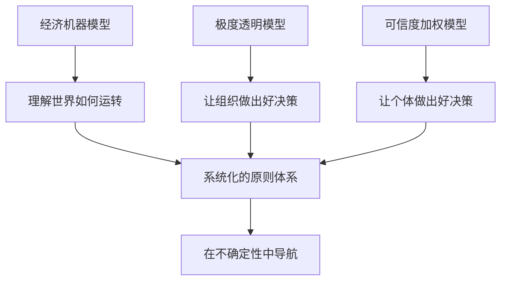

# 《原则》深度读书笔记

> [!abstract] 全书速览
> 瑞·达利欧在这本书中做了一件罕见的事：一个管理着全球最大对冲基金的人，把自己四十多年积累的决策系统完整公开。这不是一本教你"如何投资"的书，而是一本关于"如何在极度不确定的世界中做出更好决策"的书。达利欧的核心信念是：无论是经济周期、市场波动还是人生选择，背后都存在可以被识别的模式和规律；而一个人能否成功，取决于他是否建立了一套系统化的原则来应对这些模式。全书分为三个部分——个人经历、生活原则、工作原则——它们共同构成了一套从认知世界到管理组织的完整操作系统。

## 这本书要解决什么经济问题

达利欧写这本书的起点，不是某个特定的经济理论争论，而是一个更底层的问题：==为什么绝大多数投资者和决策者会反复犯同样的错误？==

这个问题来自他的切身经历。1982年，达利欧公开预测美国经济将陷入大萧条级别的衰退，这个预测彻底错误，差点让他的公司桥水基金破产。这次惨痛的失败迫使他反思：问题不在于信息不够多，而在于人的认知方式本身有系统性缺陷——过度自信、情绪干扰、确认偏误，这些东西会让聪明人做出灾难性的判断。

从这个反思出发，达利欧用了接下来三十多年时间构建一套决策系统。这套系统的核心逻辑是：把所有决策——无论是宏观经济判断还是公司管理——都转化为明确的原则，然后用算法化的方式去执行，尽可能把人的情绪和偏见排除在外。

在经济学谱系中，达利欧并不属于任何传统学派。他不是凯恩斯主义者，也不是奥地利学派，更不是芝加哥学派的信徒。他的方法更接近一种"实用主义的系统思维"：从历史数据中识别经济运行的周期模式，然后建立可量化的模型去应对。他把经济看作一台机器——一台有规律、可理解、可预测的机器。

> [!note] 关于达利欧的学术定位
> 这个立场本身就是一个大胆的主张。在一个"黑天鹅"和"不确定性"被反复强调的时代，达利欧说：不确定性没有你想的那么大，很多看似不可预测的事件，其实是重复出现的模式。关键在于你有没有足够长的历史视野去识别它们。

值得注意的是，达利欧的背景塑造了他看问题的方式。他从12岁就开始买卖股票，在哈佛商学院读MBA期间就开始交易商品期货，1975年创办桥水基金时只有26岁。他不是从学术理论出发去理解经济，而是从市场的真金白银中磨练出自己的认知。这让他的思想体系带有一种鲜明的"实战检验"特质——每一条原则背后都对应着一次盈利或亏损。

## 核心模型地图

达利欧的整套思想体系可以提炼为三个相互嵌套的核心模型。

**第一个是"经济机器"模型。** 达利欧把经济运行分解为三股叠加的力量：==长期生产力增长、长期债务周期（大约75-100年一个）和短期债务周期（大约5-8年一个）==。在他看来，大多数人只关注短期波动，却看不到长期债务周期这个更大的浪。2008年的金融危机之所以让绝大多数人措手不及，是因为上一次类似的长期债务周期顶部出现在1929年——活着的人中几乎没有人经历过。这个模型的假设是：信贷扩张和收缩是经济波动的主要驱动力，而不是传统经济学教科书强调的生产力变化。它推导出的结论是：你可以通过追踪债务相对于收入的比率，来判断经济在周期中的位置。

**第二个是"极度透明"的组织模型。** 达利欧认为，一个组织做出好决策的前提是信息的自由流通和观点的公开碰撞。在桥水基金，所有会议被录音，所有人可以质疑任何人——包括达利欧本人。这个模型假设：真相比面子重要，而大多数组织的失败源于人们为了维护关系而隐藏真实想法。它推导出的结论是：如果你能建立一个让人安全说真话的环境，组织的决策质量会大幅提升。

**第三个是"可信度加权"的决策模型。** 这是达利欧最独特的贡献。他不认为民主投票（每人一票）是好的决策方式，也不认为独裁（一人说了算）是好的。他的替代方案是：每个人的意见按其"可信度"加权——在某个领域有更多成功记录和更好推理能力的人，他的意见权重更高。这个模型假设：人与人之间在特定领域的判断力存在可量化的差异。它推导出的结论是：与其追求共识，不如追求"可信度加权后的最优判断"。

这三个模型从宏观到微观，从理解世界到管理组织，再到具体的决策方法论，构成了一个自洽的体系。

## 逐层深入

### 从1982年的灾难说起：痛苦是最好的老师

要理解达利欧的整套原则体系，你必须先理解1982年那次几乎致命的失败。

当时的达利欧已经小有名气。他在国会作证时自信地预测美国经济即将崩溃，理由是墨西哥债务危机将引发连锁反应。他的论证在逻辑上并非没有道理，但结果是：美联储成功化解了危机，美国经济不但没有崩溃，反而进入了一轮长达近二十年的大牛市。

达利欧为这个错误付出了惨痛代价——他不得不裁掉所有员工，只剩下他一个人，甚至需要向父亲借4000美元来维持家庭开支。

> [!tip] 核心公式
> ==痛苦 + 反思 = 进步==
> 这不是一句鸡汤，而是达利欧用生命验证过的公式。

这段经历催生了他整套思想体系的基石。从这次失败中，达利欧得出了几个关键认知：第一，无论你多聪明，你对世界的理解永远是不完整的；第二，过度自信比无知更危险；第三，你需要一套系统来对抗自己认知的局限性。

这些认知后来发展成了桥水基金的核心运营哲学，也成为整本书最重要的底层逻辑。达利欧后来回忆说，1982年之前的他和之后的他几乎是两个人。之前的他相信自己是对的，之后的他开始追问"我怎么知道自己是对的"。这个转变看起来很微小，但它决定了此后一切。一个永远在追问"我可能错在哪里"的人，和一个相信自己不会犯错的人，在面对同样的市场信息时会做出截然不同的决策。

### 经济机器：理解债务周期的底层运作

达利欧对经济的理解方式和大多数经济学家不同。传统经济学教科书会从供给和需求、边际效用、理性人假设出发。达利欧不关心这些抽象模型，他关心的是一个具体问题：钱从哪里来？花到哪里去？

他的回答是：经济中的支出来自两个来源——==钱和信贷==。当信贷扩张时，人们的支出超过收入，经济繁荣；当信贷收缩时，人们的支出低于收入，经济衰退。就这么简单。

短期债务周期是大多数人熟悉的：央行通过降息刺激借贷和消费，经济升温；当通胀上升时，央行加息抑制借贷，经济降温。这个周期大约每5-8年一轮，表现为我们熟悉的经济扩张和衰退交替。

但达利欧真正的洞察在于==长期债务周期==。他观察到，每一轮短期周期结束时，债务总量并不会回到起点——它会比上一轮更高一点。就像潮水，每一波涨潮都比退潮退得更少，水位在缓慢上升。经过几十年的累积，债务最终达到一个无法持续的水平。这时候，普通的降息已经不够了（因为利率已经接近零），经济就进入了达利欧所说的"去杠杆化"阶段。

2008年的金融危机正是这样一个长期债务周期的顶部。达利欧之所以比大多数人更好地预测了这场危机，正是因为他研究了历史上所有类似的去杠杆化——1930年代的美国、1990年代的日本、1920年代的魏玛德国——发现它们有惊人相似的模式。

> [!example] 去杠杆化的四个工具
> 1. **紧缩**（减少支出）
> 2. **债务违约和重组**
> 3. **财富再分配**（从富人到穷人转移）
> 4. **印钞**
>
> 成功的去杠杆化需要这四个工具的平衡使用。过度依赖紧缩会陷入1930年代美国式的通缩萧条；过度印钞会走向魏玛德国式的恶性通胀。

2008年后美联储和各国央行的量化宽松政策，在达利欧看来，基本符合"漂亮的去杠杆化"的路径——虽然并不完美，但避免了最糟糕的结果。

这个模型的力量在于它的简洁性。你不需要理解复杂的金融衍生品定价公式，只需要追踪几个关键指标：债务相对于收入的增长速度、利率水平、资产价格相对于基本面的偏离程度。当这些指标同时发出警报时，你就知道周期的顶部可能正在逼近。达利欧把这称为"经济机器的仪表盘"——你不需要打开引擎盖看每一个零件，只需要看仪表盘上的几个关键读数。

### 两种障碍：自我障碍与盲点障碍

在转向组织层面的原则之前，达利欧用了相当大的篇幅来讨论阻碍个人做出好决策的两种核心障碍，这是理解他后续所有管理理念的前提。

第一种是=="自我障碍"（ego barrier）==。你的大脑中有一个"防御系统"，它的工作是保护你的自尊心。当有人指出你的错误时，这个系统会自动启动——你会感到愤怒、委屈或否认，而不是冷静地评估对方的观点是否有道理。达利欧指出，这种防御反应来自大脑的杏仁核，它的运作方式和面对物理威胁时是一样的：别人对你观点的攻击，在你的大脑看来和一只扑过来的老虎没有本质区别。

第二种是=="盲点障碍"（blind spot barrier）==。每个人看世界的方式都不一样，有人擅长看到大局，有人擅长看到细节；有人善于逻辑推理，有人善于直觉判断。问题在于，你很难意识到自己的盲点——就像你无法用自己的眼睛看到自己眼睛的盲区一样。你以为自己看到了全貌，但实际上你只看到了现实的一个切面。

> [!warning] 两种障碍的叠加效应
> 这两种障碍叠加在一起，就构成了达利欧所说的"人类决策的最大陷阱"：你不但看不到全貌，而且还抗拒别人帮你看到全貌。理解了这一点，你就理解了为什么达利欧后来会如此执着于建立"极度透明"的文化——那本质上是一种对抗这两种障碍的制度设计。

### 原则即算法：把决策变成可执行的规则

达利欧的书名就叫"原则"，但他对这个词的理解和大多数人不同。对他来说，原则不是抽象的价值观念，而是具体的决策规则——如果遇到A情况，就执行B行动。

这种思维方式来自他的投资实践。在投资中，情绪是最大的敌人。当市场暴跌时，恐惧会驱使你卖出；当市场暴涨时，贪婪会驱使你追高。达利欧的解决方案是：在你头脑清醒、没有情绪干扰的时候，把你的决策标准写成明确的规则，然后在市场波动时严格按规则执行。

他把这个方法推广到了所有领域。在桥水基金，几乎所有的决策都被编码成了原则。比如关于招聘，有明确的标准和流程；关于如何处理分歧，有明确的升级机制；关于如何评估员工表现，有量化的评分体系。

这种做法背后有一个深层的哲学假设：==人类的理性能力是有限的，但系统的理性能力可以远超个人。== 一个好的决策系统不依赖于任何一个人的天才判断，而是通过规则、数据和流程，把集体的智慧固化下来。

不过，达利欧也承认这个方法有其边界。他把决策分为两类：一类是"已知的已知"——你遇到过类似情况，可以用已有的原则处理；另一类是"未知的未知"——全新的情况，没有先例可循。对于第二类，你需要的不是执行现有原则，而是回到更基本的思考框架，从头分析。

### 极度真实与极度透明：一种反直觉的组织哲学

桥水基金最为外界所知的特征是它的"极度透明"文化。所有会议录音并存档，任何人可以访问；任何人可以在任何场合质疑任何人的观点，无论职级高低；每个人都有一个公开的"棒球卡"，上面记录着他在各项能力上的评分。

> [!warning] 关于极度透明的争议
> 这种做法在很多人看来近乎极端，甚至有人批评它制造了一种高压的、甚至有些"邪教"色彩的工作环境。达利欧对此的回应是直接的：你可以选择痛苦的真相，或者舒适的幻觉，但后者最终会让你付出更大的代价。

这套哲学的逻辑链条是这样的：好的决策需要准确的信息；准确的信息需要人们说出真实想法；人们通常不愿说真话，因为害怕冲突和报复；因此，你需要建立一种机制，让说真话变得安全甚至被奖励。

达利欧指出，大多数组织的最大问题不是缺乏聪明人，而是聪明人之间无法进行有效的思想碰撞。他见过太多这样的场景：会议室里每个人都礼貌地点头，但散会后各怀心事，最终执行走样。

在具体操作中，极度透明并不意味着没有规则的混乱。达利欧设计了一套详细的"冲突解决机制"：当两个人意见不合时，他们首先需要明确分歧的本质是什么——是事实层面的分歧还是价值层面的分歧？如果是事实层面的，去找数据；如果是价值层面的，就需要上升到更高层级的原则来裁定。如果两个人无法自行解决，可以找一个双方都认可的"可信度更高"的第三方来仲裁。

### 可信度加权：超越民主和独裁的第三条路

==可信度加权决策==是达利欧最具原创性的管理思想，也是他花了最多篇幅来论证的。

传统的决策方式通常是两种之一：要么是民主投票，每人一票，多数决定；要么是老板说了算。达利欧认为两种都有严重缺陷。民主投票的问题是，在专业领域，外行和专家的意见被赋予了同样的权重。老板独断的问题是，再聪明的老板也有盲区。

他的解决方案是：让每个人都发表意见，但根据每个人在相关领域的"可信度"来赋予不同的权重。一个人在某个领域有多少可信度，取决于两个维度：第一，他在这个领域有没有反复成功的记录；第二，他能否清晰地解释自己的推理逻辑。

桥水基金为此开发了一套软件工具，叫"Dot Collector"。在会议中，每个人可以实时给其他人的发言打分——不是打分"我同意不同意"，而是打分"这个人的推理质量如何"。这些评分随时间累积，形成每个人在各个领域的可信度档案。

当需要做重大决策时，所有人的意见都会被纳入考量，但权重不同。一个在宏观经济分析上有二十年成功记录的分析师，他在宏观经济问题上的意见权重，会远高于一个刚入职的初级研究员。

> [!note] 可信度加权的深层问题
> 这个模型的精妙之处在于：它既保留了"听取多方意见"的优点，又避免了"一人一票"的稀释效应。但它也引发了一些深层问题：谁来定义"可信度"？这套系统会不会固化既有的权力结构？新人和异见者的声音会不会被系统性地压低？达利欧没有完全回避这些质疑，但他给出的回应是实用主义式的：任何系统都不完美，但这个系统比它的替代品更不容易出错。

### 五步流程：从目标到执行的闭环

在个人生活层面，达利欧提供了一个他称之为"五步流程"的决策框架，这也是全书在"生活原则"部分最系统化的方法论。

> [!tip] 五步流程
> 1. **设定清晰的目标** — 区分"目标"和"欲望"，你无法同时追求所有事情
> 2. **识别问题** — 不逃避，不合理化，直面阻碍你达到目标的障碍
> 3. **诊断根因** — 区分"近因"和"根因"，解决根本问题而非表面症状
> 4. **设计方案** — 系统思维，认清自己的能力边界
> 5. **执行** — 靠纪律和习惯，而非意志力

**第一步，设定清晰的目标。** 达利欧强调，你需要区分"目标"和"欲望"。欲望是你想要的一切，目标是你愿意为之承受痛苦的东西。你无法同时追求所有事情，必须做出选择。

**第二步，识别阻碍你达到目标的问题。** 这里的关键是：不要逃避问题，不要把问题合理化。大多数人的本能是回避令人不舒服的真相——这恰恰是达利欧所说的"自我障碍"（ego barrier）。

**第三步，诊断问题的根本原因。** 达利欧区分了"近因"和"根因"。一个员工反复迟到，近因可能是交通拥堵，根因可能是他对这份工作缺乏热情。你需要解决根因，而不是近因。

**第四步，设计方案。** 这一步达利欧特别强调"系统思维"：好的方案不是一个孤立的行动，而是一系列有逻辑关系的步骤。而且，设计方案的人和执行方案的人可以是不同的人——认清自己的能力边界，是达利欧反复强调的。

**第五步，执行。** 执行的关键是纪律和习惯，而不是意志力。达利欧建议把执行方案嵌入到日常流程和检查清单中，让它变成自动运行的系统，而不是每次都需要"下决心"才能完成的任务。

这五个步骤构成了一个循环——执行的结果会产生新的问题，新的问题又需要新的诊断和设计。达利欧把人生比作一系列这样的循环，每一次循环都让你螺旋上升到更高的水平。

### 拥抱现实：达利欧的世界观基底

所有这些原则背后，有一个更底层的世界观。达利欧相信，现实世界有其运行规律，这些规律不以人的意志为转移。你可以理解它们、适应它们，但不能否认它们或对抗它们。

他用进化论来类比：自然界中存活下来的不是最强壮的物种，而是最能适应环境变化的物种。同样，在经济和人生中，成功的不是最聪明的人，而是最善于面对现实并做出调整的人。

这种世界观让达利欧对"理想主义"持谨慎态度。他不认为世界"应该"是怎样的这个问题有多大意义——重要的是世界"实际"是怎样的，以及你如何在这个实际的世界中导航。

> [!tip] 高阶效应思维
> 达利欧由此提出了一个重要的概念：=="二阶效应"和"三阶效应"==。很多人做决策只看一阶效应——这个选择的直接后果是什么。比如，锻炼的一阶效应是痛苦和花时间；但二阶效应是身体更健康、精力更充沛；三阶效应是更长的职业生涯和更高的生活质量。能否看到并重视高阶效应，是区分优秀决策者和平庸决策者的关键标志。

这种思维方式在经济分析中尤为重要。当一个国家大量印钞时，一阶效应是刺激经济增长，二阶效应可能是资产价格泡沫和贫富差距扩大，三阶效应可能是社会动荡和政治极化。大多数决策者只看到一阶效应就行动了，而达利欧的整套分析框架要求你把因果链条至少推演到第二阶甚至第三阶，然后再做决定。

### 全天候投资组合：原则在投资中的直接应用

达利欧不仅在理念层面讨论原则，他还把原则直接应用在了投资实践中。=="全天候投资组合"（All Weather Portfolio）==是他最著名的投资策略之一，也是他的原则体系在金融市场上的具体体现。

这个策略背后的核心思想是：没有人能准确预测未来的经济环境会是通胀还是通缩、增长还是衰退，所以最明智的做法不是去预测，而是构建一个在任何经济环境下都能表现相对稳健的投资组合。达利欧把所有可能的经济环境分为四种：经济增长高于预期、经济增长低于预期、通胀高于预期、通胀低于预期。然后为每种环境配置不同的资产类别，使得整个组合在任何一种环境下都不会遭受致命打击。

> [!note] 全天候策略的深层哲学
> 这个策略的深层含义超越了投资本身。它体现了达利欧思想的一个核心原则：承认自己的无知，然后用系统设计来应对无知。你不需要比别人更聪明，你只需要比别人更诚实地面对自己不知道什么。全天候投资组合的设计者不是一个自信的预言家，而是一个谦逊的工程师——他不预测天气，而是建造一栋在任何天气下都能住的房子。

## 预测与现实

达利欧的经济预测记录是他理论体系可信度的重要检验。

**被验证的预测：** 2008年金融危机是他最著名的成功案例。当绝大多数华尔街机构对次贷危机的严重性还一无所知时，桥水基金已经开始大幅调整投资组合。2008年，当标普500指数下跌38%时，桥水的旗舰基金获得了正收益。达利欧能做到这一点，核心原因是他对1930年代大萧条的深入研究让他识别出了相似的债务周期模式。

**他的债务周期框架在2010年代的欧债危机中也表现出了解释力。** 希腊、西班牙等国的债务困境，完全符合达利欧所描述的"长期债务周期下行阶段叠加短期债务周期衰退"的模式。他对"漂亮的去杠杆化"的分析框架，为理解各国的不同政策应对提供了有价值的视角。

**需要打折扣的判断：** 达利欧在2018-2019年期间多次警告"经济机器"正在进入危险区域，暗示衰退可能即将到来。2020年确实发生了严重的经济衰退，但其原因是新冠疫情这个外生冲击，而非达利欧模型预测的内生性债务危机。这暴露了他的模型的一个局限：它擅长识别内部金融系统的压力，但对外生冲击（战争、疫情、自然灾害）的预测能力有限——而这恰恰是经济学本身最难的部分。

> [!warning] 尚待检验的长期判断
> 达利欧近年来对中国经济的长期看好、对美国内部冲突加剧的担忧、以及对美元国际地位可能下降的判断，仍在展开之中。他在后续著作《原则：应对变化中的世界秩序》中对大国兴衰周期的分析，是"经济机器"模型向地缘政治领域的延伸。这些宏大叙事是否经得起时间检验，目前还很难做出定论。

总体而言，达利欧的预测记录强于大多数经济学家和投资者，但远非完美。他的模型在识别债务驱动的系统性风险方面有明确的优势，但在面对非周期性的突发事件时则力不从心。

## 不同学派怎么说

达利欧的思想体系引发了来自多个方向的批评和争论。

**来自学术经济学界的质疑集中在方法论层面。** 传统经济学家倾向于使用严格的数学模型和统计检验来验证理论。达利欧的"经济机器"模型虽然直观有力，但在学术标准看来，它的变量定义不够精确，预测条件不够明确，难以被证伪。一些学者认为，达利欧更像是一个"历史模式识别者"而非"理论建构者"——他善于从历史中找到相似的模式，但这种基于类比的推理在方法论上天然地不如基于因果机制的理论严谨。

**来自行为经济学的视角则更微妙。** 达利欧的整套系统假设人可以通过建立规则来克服认知偏见，这与行为经济学的精神是一致的。但行为经济学家会指出：建立规则本身也受认知偏见的影响——你怎么知道你制定的原则本身没有被偏见污染？达利欧的回答（可信度加权、多方校验）是一种务实的应对，但未必能完全解决这个元层面的难题。

**来自奥地利学派经济学家的批评则更根本。** 他们质疑达利欧把经济视为"可预测的机器"这一基本隐喻。在奥地利学派看来，经济是一个由无数个体的主观决策构成的复杂适应系统，不可能被简化为几个变量的周期模型。达利欧的成功可能更多地归功于他的风险管理能力和适应性，而非他的周期理论的预测准确性。

**在管理学领域，** 对桥水文化的争议更加激烈。一些人认为极度透明创造了一种"可以合法霸凌"的环境——当你的老板可以当众指出你的缺陷，而且这被定义为"帮助你成长"时，权力关系并没有消失，只是穿上了一件新衣服。2017年华尔街日报等媒体的报道揭示了桥水内部高管频繁离职的现象，这至少说明极度透明文化的适用性比达利欧宣称的要窄——它可能只适合特定性格类型的人。

公平地说，达利欧在书中并没有回避这些批评。他多次承认自己的系统并非完美，也承认极度透明不适合所有人。但他的基本立场始终是：这套系统的替代品更差。

## 对你意味着什么

即使你不管理对冲基金，达利欧的思想体系也能为你的经济决策和人生管理提供具体帮助。

**在个人财务层面，** 债务周期的概念能帮助你理解一个关键问题：你现在所处的经济环境，在周期的什么位置？当利率处于低位、信贷扩张、资产价格普涨时，你需要意识到这是周期上行的表现，而非"新常态"。在做购房、投资等重大财务决策时，能够辨识周期位置的人，比随波逐流的人犯大错的概率更低。

**在职业和生活决策层面，** "痛苦+反思=进步"以及"五步流程"是可以直接使用的工具。当你遭遇挫折时，不要急于行动或自我安慰——先停下来，诊断问题的根因。是能力问题、认知问题，还是环境问题？不同的根因需要完全不同的应对方式。

**在理解世界方面，** 达利欧最大的贡献是提供了一个思考经济和社会变化的框架：不要被短期新闻淹没，尝试看到更长的周期。历史不会精确重复，但它确实在押韵。当你看到一个国家的债务占GDP比率不断攀升、贫富差距不断扩大、政治极化日益严重时，达利欧的框架会帮你识别出这些信号的含义——以及可能的走向。

**在人际关系和团队协作方面，** "可信度加权"的思维方式同样有启发。你不必在每件事上都采纳所有人的意见，但你需要知道：在这个特定问题上，谁的判断最值得信任？一个在技术上很强的朋友，他的技术建议值得重视，但他的职业规划建议可能就不一定了。学会区分"谁在什么领域可信"，会让你的决策质量显著提升。

> [!tip] 最重要的一点
> 承认自己不知道什么，比知道什么更重要。在一个充满不确定性的世界里，过度自信是最昂贵的奢侈品。达利欧用自己的亲身经历证明了这一点——1982年的那个自信满满的年轻人差点赔光一切，而后来那个不断追问"我可能错在哪里"的投资者，建立了全球最大的对冲基金。这其中的因果关系，值得每一个人深思。

## 延伸阅读

如果你对达利欧的债务周期理论感兴趣，他后来的[[《债务危机》]]一书提供了更详细的历史案例分析和量化模型。这本书比《原则》在经济学意义上更为专注和深入。

如果你想从另一个角度理解金融危机和经济周期，海曼·明斯基的[[《稳定不稳定的经济》]]是绕不开的经典。明斯基的"金融不稳定性假说"和达利欧的债务周期模型有很强的互补性，但明斯基在理论的严谨性上走得更远。

如果你对达利欧的管理思想感兴趣，可以对照阅读奈飞创始人里德·黑斯廷斯的[[《不拘一格》]]——同样是一家追求"极度坦诚"的公司，但在具体实现方式上和桥水有有趣的差异。
