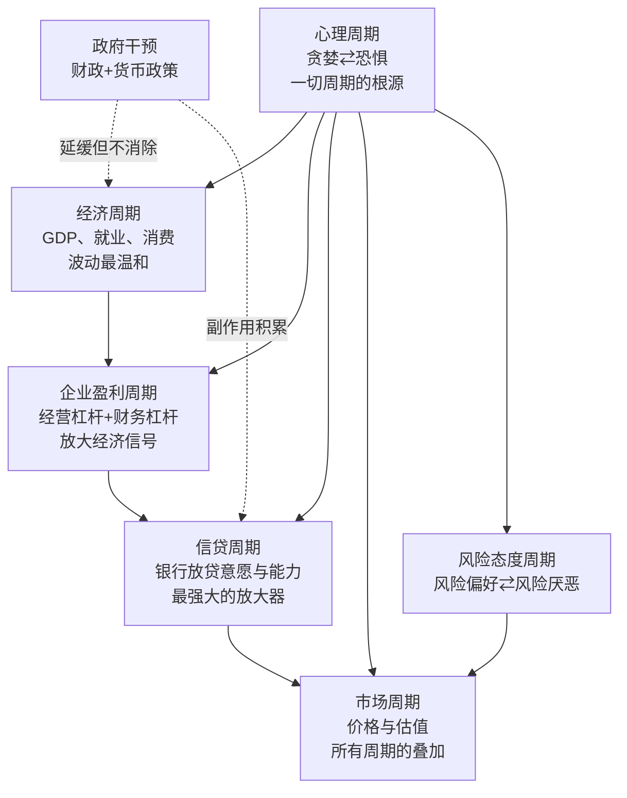
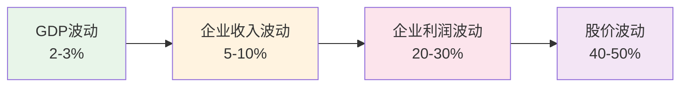

# 《周期》深度读书笔记

> [!abstract]
> 霍华德·马克斯用半个世纪的投资生涯告诉你一件事：市场不是随机漫步的，它在周期中运行。你无法预测周期的精确时间点和幅度，但你可以感知自己正站在周期的什么位置——而这种"感知"，可能是你作为投资者能拥有的最强大的武器。全书构建了一个多层周期叠加的分析框架：经济周期提供基础波动，企业盈利周期通过杠杆效应放大信号，信贷周期作为"超级放大器"将波动推向极端，而贯穿一切的==心理周期和风险态度周期==，是所有市场起伏的终极驱动力。马克斯不是教你择时，而是教你在充满不确定性的世界里，通过理解周期位置来提高自己的胜算。

## 这本书要解决什么经济问题

如果你关注投资，你一定经历过这样的困惑：为什么市场总是在人们最乐观的时候崩盘，在最绝望的时候触底反弹？为什么连最聪明的人也会在泡沫顶端疯狂买入、在恐慌底部割肉离场？为什么经济学家的预测几乎没有一次完全准确，但市场的涨跌却似乎遵循着某种看不见的节奏？

2018年，全球股市已经经历了将近十年的牛市。标普500从2009年的低点翻了三倍以上，美国失业率降至数十年低位，科技公司利润连年创新高。在这个背景下，一种危险的信念悄然蔓延：周期已经被驯服了。"这次不一样"不再是少数人的口号，而是市场的共识。

霍华德·马克斯是橡树资本的联合创始人，管理着超过千亿美元的资产，尤其擅长在市场恐慌时捡拾被低估的不良债务。他从1990年代开始写给客户的备忘录在华尔街广为流传，巴菲特曾说"每次收到霍华德的备忘录，我都会第一时间打开阅读"。马克斯在这个人人喊着"周期已死"的时刻出版《周期》，绝非偶然——他要回答的核心问题是：**周期真的可以被消除吗？如果不能，你应该如何理解和应对它？**

> [!tip] 马克斯的三层回答
> 1. ==周期是永恒的==——驱动周期的根本力量是人类心理，而人性不会因为技术进步或政策创新而改变
> 2. ==周期是不可预测的==——没有任何方法能让你准确预测转折点何时到来、振幅有多大
> 3. ==周期是可定位的==——虽然你不知道"何时"转折，但你可以判断"现在在哪里"

在投资思想的谱系中，马克斯属于价值投资的传统，但他的独特贡献在于把行为金融学的洞察融入了价值投资的框架。他不像格雷厄姆那样只聚焦于内在价值与价格的偏差，也不像技术分析者那样试图从价格图表中预测走势，而是把注意力放在一个大多数人忽视的维度上——==市场情绪在周期中的位置==。这个位置不能告诉你明天会发生什么，但它能告诉你当前的风险回报比是否对你有利。

> [!note] 与明斯基的关联
> 马克斯的周期观与经济学家海曼·明斯基的"金融不稳定假说"高度吻合——明斯基认为金融稳定性本身会催生不稳定，因为长期的稳定让人们变得大胆、增加杠杆、忽视风险，最终导致危机。这种"稳定产生不稳定"的悖论，贯穿了马克斯全书的分析。

## 核心模型地图

马克斯在书中构建了一个多层周期叠加的分析框架，理解这个框架是你把握全书的关键。

> [!note] 理解叠加结构的意义
> 一次温和的经济衰退（GDP下降3%）在传导过程中被层层放大：企业盈利下降20-30%（杠杆效应），信贷收缩加剧（正反馈循环），投资者恐慌抛售（心理极端化），最终股市可能下跌40-50%。==理解了这个结构，你就不会对市场的"过度反应"感到惊讶——那不是过度反应，那是杠杆结构下的正常反应。==

**最底层是经济周期。** 经济的长期增长由人口和生产率决定，相对稳定。但短期内GDP会围绕长期趋势线上下波动。你可以把经济周期理解为所有其他周期的"地基"。

**第二层是企业盈利周期。** 由于经营杠杆和财务杠杆的存在，企业盈利的波动幅度显著大于GDP。收入下降10%，利润可能下降40%。如果公司还有债务负担，波动被进一步放大。

**第三层是信贷周期。** 马克斯称之为"最重要的周期"。正反馈循环使它具有自我强化的力量——扩张时越来越松，收缩时越来越紧。

**第四层是心理周期与风险态度周期。** 这是最核心的一层，因为它驱动了其他所有周期。贪婪与恐惧交替主导市场情绪。

**最上层是市场周期。** 所有周期叠加的结果。市场价格波动远大于基本面波动。

此外还有**政府干预**——政策只能延缓周期，不能消除周期，而且每次干预都积累副作用。

## 逐层深入

### 一、钟摆与均值回归：周期的根本性质

如果你只从这本书里记住一个画面，那应该是马克斯反复使用的钟摆比喻。

想象一个物理钟摆在空中摆动。它有一个均衡点——正中央。但你会注意到，钟摆几乎从不停留在中间位置。它总是在从一个极端向另一个极端摆动的过程中，飞速掠过中间点。

> [!tip] 核心洞察
> 很多人假设市场的"正常状态"是均衡，偏离只是暂时扰动。马克斯的观点恰恰相反：==偏离才是常态，均衡反而是罕见的例外。== 如果你总是在等待市场"回归正常"之后再做决策，你可能永远也等不到。

钟摆到达极端后必然回摆——这就是==均值回归==。你无法知道反转何时发生，但你可以确信它一定会发生。

> [!warning] 均值回归的三个陷阱
> 1. **时间不确定**：市场可以在极端状态停留数年。正如凯恩斯所说："市场保持非理性的时间可能比你保持偿付能力的时间更长"
> 2. **极端可以变得更极端**：在回归之前钟摆可能先摆得更远。1999年纳斯达克泡沫中很多价值投资者过早做空，在"正确"的方向上先亏了一大笔
> 3. **均值本身在变化**：历史平均PE是15倍，但利率环境、经济结构的变化可能改变"正常"标准

### 二、经济周期与企业盈利周期：层层放大的链条

经济周期是最基础的周期，但你会发现它的波动幅度其实相对温和。战后美国经济衰退期间，GDP下降幅度通常在2-4%。真正让你吃惊的是企业盈利周期的波动幅度——核心原因是杠杆效应。

> [!example] 杠杆放大效应
> 假设一家公司：100元收入，60元可变成本，30元固定成本，利润10元
> - 收入增长10%→110元：可变成本66元，固定成本30元，利润14元（**增长40%**）
> - 收入下降10%→90元：可变成本54元，固定成本30元，利润6元（**下降40%**）
>
> 收入变化10%，利润变化40%——这就是经营杠杆。如果再叠加财务杠杆，波动进一步放大。

马克斯希望你理解的是：大部分投资者只关注最上层的波动（股价涨跌），却不理解这些波动是如何从底层逐级放大上来的。如果你理解了这个结构，你就不会对市场的"过度反应"感到惊讶。

### 三、信贷周期：最强大的放大器

马克斯称信贷周期为"最重要的周期"。它的正反馈特性使它具有自我强化和自我实现的力量。

**扩张期：** 经济向好 → 银行放松标准 → 信贷扩张 → 资产价格上涨 → 抵押品增值 → 更多信贷 → 价格继续上涨

**收缩期：** 违约出现 → 银行收紧标准 → 信贷萎缩 → 资产被迫出售 → 价格下跌 → 抵押品缩水 → 更多违约

> [!warning] 2008年危机的信贷视角
> 低利率 → 信贷标准放松 → 次级贷款激增 → 房价上涨 → 更多借贷 → 泡沫形成。然后反转：违约 → MBS暴跌 → 金融机构巨亏 → 信贷急剧收缩 → 系统性危机。
>
> ==马克斯的核心洞见：最大的风险来源不是借款人，而是贷款人。== 正是贷款人在宽松时期的轻率行为埋下了危机的种子。如果你想监控信贷周期的位置，应该关注贷款标准本身，而非违约率这种滞后指标。

> [!tip] 如何监控信贷周期
> ==仅仅看到低违约率就认为信贷环境健康，就像看到一个人没有安全绳走钢丝还没掉下来就认为他是安全的。== 真正需要关注的领先指标是：
> - 首付比例要求是否在下降？
> - 借款人的收入验证是否在放松？
> - 贷款条款中的保护性约定是否在被取消？
> - 金融创新产品是否在增加（通常是为了绕过现有标准）？

### 四、心理周期：一切周期的终极驱动力

马克斯把最核心的位置留给了心理周期。经济基本面的变化是缓慢的，但投资者对基本面的解读可以在一夜之间从极度乐观转为极度悲观。

| 维度 | 乐观极端（顶部） | 悲观极端（底部） |
|------|------------------|------------------|
| 主导情绪 | 贪婪、自满 | 恐惧、绝望 |
| 流行叙事 | "这次不一样" | "永远不会好转" |
| 主要驱动力 | 害怕错过（FOMO） | 害怕损失 |
| 对待风险 | 系统性低估 | 系统性高估 |

> [!tip] 从众心理与选择性遗忘
> 从众心理是心理周期的放大器——当周围的人都在赚钱，你很难坐在场外；当周围的人都在恐慌，你很难保持冷静。
>
> 投资者还有"选择性遗忘"的倾向——在牛市顶部忘记过去的崩盘，在熊市底部忘记过去的复苏。==每一次周期都好像是"第一次"，同样的错误被反复重演。==

> [!note] "叙事"的关键作用
> 每一次泡沫都有一个引人入胜的故事：1990年代末"互联网改变一切"，2000年代中期"房价永远不会在全国范围下跌"，2020-2021年"数字化革命加速"。这些叙事之所以危险，不是因为完全错误——==而是因为它们被用来为不可持续的价格水平做辩护。== 一个正确的大趋势不等于在任何价格买入都合理。叙事给你的情绪穿上了"理性"的外衣——识别这种"叙事驱动的自我欺骗"，是你抵抗心理周期裹挟的重要能力。

### 五、风险态度周期：最反直觉的洞察

这是全书最具洞察力的观点之一，值得你反复咀嚼。

> [!tip] 风险的悖论
> ==风险在人们最忽视它的时候最高，在人们最害怕它的时候最低。==
>
> - **对风险的无视制造了风险**：当人们觉得安全时，他们加杠杆、降低安全边际——推高了价格，压缩了回报空间
> - **对风险的恐惧消解了风险**：当人们恐惧时，他们抛售、去杠杆——压低了价格，扩大了回报空间

| 市场状态 | 风险溢价 | 投资者行为 | 实际风险水平 |
|---------|---------|-----------|------------|
| 极度乐观 | 极低 | 追逐收益，忽视风险 | ==极高==（价格高，下跌空间大） |
| 正常 | 适中 | 理性评估 | 适中 |
| 极度悲观 | 极高 | 恐慌抛售 | ==极低==（价格低，上涨空间大） |

> [!note] "安全感产生危险"的微观机制
> **上升期：** 好业绩 → 资金涌入 → 价格上涨 → 更好业绩 → 更多资金。==实际风险在积累==（价格偏离价值），==感知风险在下降==（波动率低、回报高）。
>
> **下降期：** 亏损 → 资金撤出 → 价格下跌 → 更大亏损 → 加速撤出。==实际风险在下降==（安全边际扩大），==感知风险在上升==（波动率高、坏消息不断）。
>
> 大多数投资者做不到逆向，不是因为不聪明，而是因为直觉——把感知风险当作实际风险——在极端时刻系统性地误导了你。

这个认知对你有什么用？当你感觉最舒适的时候——你应该开始更加谨慎。当你感觉最不舒适的时候——你应该开始寻找机会。

### 六、市场周期与周期定位

市场周期是所有周期叠加的结果。==股价的波动不仅反映基本面变化，更反映情绪和预期的变化==——在短期内，后者的影响远大于前者。

**市场价格 = 基本面 x 心理/情绪乘数。** 在牛市顶部两者都在高位，在熊市底部两者都在低位。

讲了这么多原理，一个你一定关心的问题是：你怎么知道自己站在哪里？马克斯坦承你永远不可能精确知道。但你可以通过多维信号做出粗略判断。

| 指标类型 | 观察什么 | 顶部信号 | 底部信号 |
|---------|---------|---------|---------|
| 情绪指标 | 媒体基调、投资者信心 | 极度乐观 | 极度悲观 |
| 估值指标 | PE/PB vs 历史均值 | 显著高于均值 | 显著低于均值 |
| 信贷指标 | 利差水平、贷款标准 | 利差极低、标准松 | 利差极高、标准紧 |
| 行为指标 | 资金流向、IPO、杠杆 | 资金涌入、IPO火爆 | 资金撤离、IPO冻结 |

> [!warning] 重要提醒
> 这些信号帮你判断"大致在哪里"，不能帮你预测"何时转折"。正确的做法是==渐进式地调整风险敞口的倾斜方向==：在过热区域逐步降低风险，在过冷区域逐步增加风险。

### 七、政府干预：延缓但不消除周期

央行和政府的政策工具可以影响周期节奏，但不能消除周期。

> [!note] 政策干预的深层悖论
> ==成功的干预反而会削弱市场的自我纠正能力。== 如果你相信央行会在每次下跌时救市，你就会承担更多风险——这种道德风险导致更大的泡沫，最终当央行工具失效时，调整会更加剧烈。
>
> 低利率环境下的"追逐收益"现象尤为典型：国债回报率低到无法满足退休金和保险公司需求，大量资金被迫涌向高风险资产。

> [!example] 2020-2022年的政策教训
> 2020年大规模刺激避免了经济崩溃，但直接导致了几十年最严重的通胀。通胀迫使央行急剧加息，又引发2022年全面熊市。那些在低利率环境下看起来"安全"的投资突然变成最危险的资产。==政策只能推迟痛苦，不能消除痛苦——而且推迟往往让最终的痛苦更加剧烈。==

### 八、逆向投资：理论简单，实践困难

马克斯投资哲学的核心是逆向操作。逆向投资有效的根本原因是==极端定价下的不对称性==：极端乐观时好消息已充分反映在价格中，只有坏消息能引发变化（向下）；极端悲观时情况反转。

> [!warning] 逆向投资的三个困难
> 1. **时间成本**：市场可能需要很长时间才能证明你对，你必须承受账面亏损和外界质疑
> 2. **职业风险**：在别人都赚钱时保持谨慎会导致业绩落后——"与错误的大众站在一起"短期内比"孤独地正确"更安全
> 3. **心理难度**：逆向操作要求你在最不舒服的时候行动
>
> ==有效的逆向操作需要三个前提：独立思考的能力、承受短期亏损的资本缓冲、等待回归的耐心。== 缺一不可。

### 九、"这次不一样"与运气、技能的区分

马克斯反复引用坦普尔顿的名言："投资中最危险的话是'这次不一样'。"每一轮泡沫都有人用各种论据解释为什么这次繁荣可以持续。马克斯的核心论点是：**变化的是故事的内容，不变的是人性的模式。** 你要在每一个"这次不一样"的叙事面前追问：人类处理风险的心理机制变了吗？

关于运气与技能，马克斯的答案可能让你不太舒服：在短期内，运气的成分远大于技能。你不能用短期结果判断投资能力。过程正确、结果不好——可以接受。过程错误、结果碰巧好——这才最危险。

> [!tip] 马克斯的务实哲学
> **专注于你能控制的事情。** 你无法控制宏观经济、央行决定、地缘政治。但你可以控制：买什么资产、付什么价格、承担多少风险、如何根据周期位置调整。
>
> 成功的周期应对需要四种品质：
> - **谦逊**——承认你的认知有限
> - **准备**——为各种情景做好预案
> - **耐心**——不在没有机会时勉强出手
> - **纪律**——在情绪最极端的时候仍然执行计划

## 预测与现实

《周期》出版于2018年。此后的市场发展在多个层面验证了马克斯的判断。

> [!example] 被验证的观点
> - **"周期不会消失"**——2020年新冠暴跌 → 2021年meme股票和加密货币狂热 → 2022年因通胀加息导致全面熊市。短短三年完成一个完整周期
> - **"极端状态是暂时的"**——2021年的狂热完美展示了顶部信号：新投资者涌入、SPAC疯狂、加密货币和NFT炒作。2022年均值回归让很多"新范式"资产缩水80-90%
> - **"信贷周期会回归"**——2022-2023年加息结束了十余年低利率环境，过度借贷的公司和个人开始感受压力
> - **"政策干预有副作用"**——2020年刺激直接导致几十年最严重的通胀

> [!note] 需要打折扣的地方
> 马克斯可能低估了央行干预对周期节奏的扭曲能力。你不能机械套用历史周期节奏——央行已经成为影响钟摆的重要外力。此外，被动投资对市场结构的影响仍在演化中。

## 不同学派怎么说

> [!note] 学术争论的背景
> 了解不同学派的观点会帮助你更全面地评估马克斯的框架。

- **有效市场假说**（法玛）：如果周期可识别，为什么不能被套利消除？马克斯的回应——==心理偏差不是可以被"交易掉"的==，时间上的不确定性使套利变得困难且有风险

- **随机漫步理论**：所谓的"周期模式"不过是人类大脑在随机数据中看到了不存在的规律。马克斯部分同意短期不可预测，但认为长期的大幅度偏离均值是可以识别的

- **行为金融学**（卡尼曼、席勒）：马克斯的天然盟友。前景理论、过度自信、羊群效应的实验证据与马克斯对心理周期的描述高度吻合。==马克斯从50年实践得出的结论与学术研究高度一致==

- **奥地利学派**：强调央行利率操纵造成不必要的信贷扩张收缩。马克斯部分认同，但更务实——接受央行存在的现实

- **现代货币理论（MMT）**：认为政府可通过印钞永久支撑经济。2022年通胀风暴表明无限印钞代价不可忽视

- **明斯基金融不稳定假说**：==稳定性本身催生不稳定==——长期稳定让人们加杠杆、忽视风险。明斯基的三类借款人分类（对冲型、投机型、庞氏型）的演化正是马克斯所说的"贷款标准下降"的微观表现

## 对你意味着什么

你可能不是管理千亿美元的专业投资者，但马克斯的周期思维对你依然有非常实际的帮助。

**首先，它影响你的资产配置决策。** 如果你在做定期投资，理解周期会帮助你在市场过热时不盲目追加、在市场过冷时不恐慌赎回。你不需要精确择时，只需要避免在最错误的时候做最错误的事。

**其次，你应该保持现金储备。** 现金的真正价值不在于它的回报率，而在于它赋予你在极端悲观时期"有能力行动"的自由。==现金储备不是闲置资源，而是"期权"——你以牛市中的机会成本为代价，换取在熊市中逆向操作的能力。==

**第三，它帮助你理解经济新闻。** 当你看到"经济一片大好"，你会想：好日子可能快到头了。当你看到"经济面临严峻挑战"，你会想：也许最坏的时候正在过去。

**第四，它是一种关于谦逊的训练。** 马克斯教你用概率替代预测：不说"会涨"，而是说"在当前位置，上涨的概率高于下跌的概率"。

**第五，建立你自己的"周期日志"。** 每月记录市场情绪信号。当你感到强烈冲动想要"跟着大家做"的时候，暂停24小时再决定。

**第六，关注信贷利差。** 垃圾债券与国债的利差是判断周期位置最客观的指标之一，它的极端值通常与周期极端高度吻合。

**第七，周期思维适用于投资之外。** 职业发展有周期，房地产有周期，创业融资环境也有周期。当你意识到世界充满周期性波动，你就不会在繁荣期过度乐观，也不会在低谷期彻底绝望。

> [!tip] 最深层的启示
> ==我们无法预测，但我们可以准备。== 准备的方式就是在好日子里保持清醒、储备弹药，在坏日子里保持勇气、抓住机会。市场的未来是不可知的，但人性是相对恒定的。只要你能在别人疯狂的时候保持清醒，在别人绝望的时候保持勇气，你就已经拥有了大多数投资者不具备的优势。

## 延伸阅读

- [[《投资最重要的事》]] - 霍华德·马克斯 - 马克斯投资哲学的全面阐述，《周期》是其中周期思想的深度展开。两本书搭配阅读，你可以看到周期观如何嵌入更广泛的投资框架。建议你先读这本再读《周期》

- [[《非理性繁荣》]] - 罗伯特·席勒 - 从学术角度研究市场泡沫和投资者心理。席勒的"叙事经济学"概念能帮助你理解马克斯所描述的心理周期是如何形成和传播的

- [[《这次不一样》]] - 莱因哈特与罗格夫 - 覆盖800年间66个国家的金融危机数据分析。从更长历史维度验证了"周期永恒"的观点——如果你对周期的历史纵深感兴趣，这本书不容错过

- [[《债务危机》]] - 瑞·达利欧 - 桥水基金创始人对过去500年债务周期的系统研究。如果你想对信贷周期做更深入的了解，这本书提供了大量历史案例和更细致的分析框架
