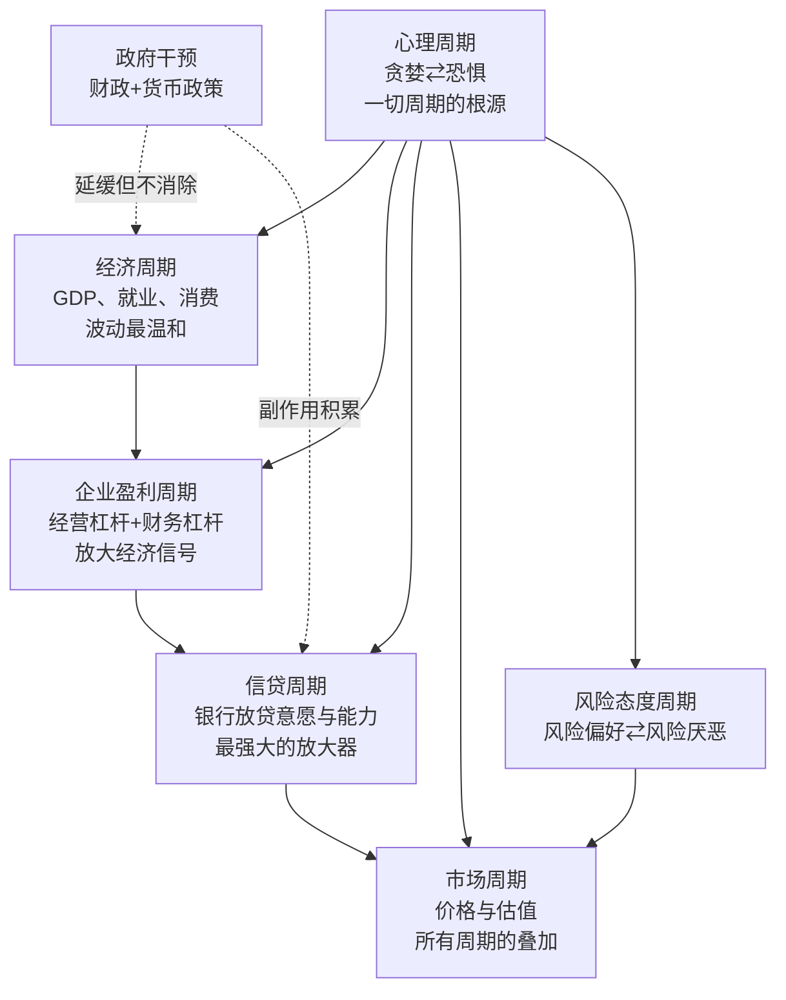
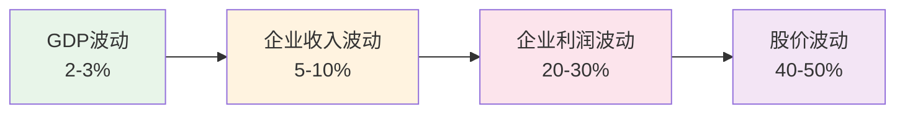

# 《周期》深度读书笔记

> [!abstract]
> 投资大师霍华德·马克斯用一整本书回答一个问题：既然我们无法预测市场的未来，投资者还能做什么？他的答案是——==理解周期，定位周期==。周期不是可以被消灭的"市场缺陷"，而是人类心理驱动的必然规律。聪明的投资者不追求预测转折点，而是学会判断"我们现在在周期的哪个位置"，然后据此调整风险敞口。马克斯构建了一个多层周期叠加的分析框架——经济周期、盈利周期、信贷周期、心理周期、风险态度周期层层递进、相互放大，最终形成市场周期的剧烈起伏。这本书是马克斯数十年投资智慧的结晶，也是[[《投资最重要的事》]]中周期思想的深度展开。

## 这本书要解决什么经济问题

2018年，全球股市已经经历了近十年的牛市。很多人开始相信一个危险的说法："这次不一样"——低利率会永远持续，科技创新会永远推动增长，周期已经被央行的政策工具"熨平"了。

马克斯在这个时候出版《周期》，绝非偶然。他要回答的核心问题是：**周期真的消失了吗？如果没有，我们该如何理解和应对它？**

> [!tip] 马克斯的三层回答
> 1. ==周期是永恒的==——因为驱动周期的人类心理不会改变
> 2. ==周期是不可预测的==——没有人能准确预测转折点何时到来
> 3. ==周期是可定位的==——虽然无法预测"何时"，但可以判断"在哪里"

在投资思想的谱系中，马克斯属于"价值投资"阵营，但他的独特贡献在于将行为金融学的洞察融入价值投资框架。他不像格雷厄姆那样只关注内在价值与价格的偏差，也不像技术分析者那样试图从价格图表中预测走势，而是聚焦于一个被大多数人忽视的变量——**市场情绪在周期中的位置**。这个位置虽然不能告诉你明天会发生什么，但它能告诉你当前的风险回报比是否对你有利。

值得注意的是，马克斯的周期观与经济学家海曼·明斯基的"金融不稳定假说"高度吻合。明斯基认为，金融稳定性本身会催生不稳定——长期的稳定让人们变得大胆、增加杠杆、忽视风险，最终导致危机。这种"稳定产生不稳定"的悖论，贯穿了马克斯全书的分析。

> [!note] 写作背景
> 本书出版于2018年，正值美股长牛末期。马克斯的橡树资本以投资不良债务闻名，而不良债务的最佳投资时机恰恰出现在周期底部。这让他对周期有着比大多数投资者更深刻的理解——他的盈利模式就建立在周期必然回归的基础之上。两年后，新冠疫情引发的市场暴跌和随后的狂热反弹，证明了他的判断。

## 核心模型地图

马克斯在书中构建了一个多层周期叠加的分析框架，理解这个框架是把握全书的关键。

各层周期之间不是简单的因果关系，而是相互影响、相互放大：

- **经济周期**是地基，波动最温和（GDP衰退期下降2-4%）
- **企业盈利周期**通过经营杠杆和财务杠杆将经济波动放大数倍
- **信贷周期**是"超级放大器"，其正反馈机制使它具有自我强化的力量
- **心理周期**贯穿一切，是所有周期波动的终极驱动力
- **市场周期**是所有层次叠加的最终结果，波动最为剧烈

> [!note] 理解叠加结构的意义
> 一次温和的经济衰退（GDP下降3%）在传导过程中被层层放大：企业盈利下降20-30%（杠杆效应），信贷收缩加剧（正反馈循环），投资者恐慌抛售（心理极端化），最终股市可能下跌40-50%。==理解了这个结构，你就不会对市场的"过度反应"感到惊讶——那不是过度反应，那是杠杆结构下的正常反应。==

## 逐层深入

### 一、钟摆与均值回归：周期的根本性质

马克斯用"钟摆"来描述市场运动的本质特征。物理钟摆大部分时间都在向一端或另一端运动，在垂直中点的停留时间极短。市场也是如此——=="合理估值"只是钟摆经过的一个瞬间，大部分时间市场要么过于乐观要么过于悲观。==

> [!tip] 核心洞察
> 很多人假设市场的"正常状态"是均衡，偏离只是暂时扰动。马克斯的观点恰恰相反：==偏离才是常态，均衡反而是罕见的例外。==钟摆到达极端后必然回摆——这就是均值回归。但你无法预测它什么时候开始回摆，只能确定：当它处于极端位置时，继续朝同方向运动的空间有限，反向运动只是时间问题。

均值回归是最可靠的市场规律，但马克斯警告了三个陷阱：

> [!warning] 均值回归的三个陷阱
> 1. **时间不确定**：市场可以在极端状态停留数年。正如凯恩斯所说："市场保持非理性的时间可能比你保持偿付能力的时间更长"
> 2. **极端可以变得更极端**：在回归之前，钟摆可能先摆得更远。1999年纳斯达克泡沫中，很多价值投资者过早做空，在"正确"的方向上先亏了一大笔
> 3. **均值本身在变化**：历史平均PE是15倍，但利率环境、经济结构、投资者构成的变化可能改变"正常"标准

### 二、经济周期与企业盈利周期：放大链条

经济周期是最基础的周期，但它的波动幅度其实相对温和。战后美国经济衰退期间，GDP下降幅度通常在2-4%——这个数字本身并不惊人。真正剧烈波动的是建立在经济周期之上的企业盈利周期——核心原因是杠杆效应。

> [!example] 杠杆放大效应
> 假设一家公司：100元收入，60元可变成本，30元固定成本，利润10元
> - 收入增长10%→110元：可变成本66元，固定成本30元，利润14元（**增长40%**）
> - 收入下降10%→90元：可变成本54元，固定成本30元，利润6元（**下降40%**）
>
> 收入变化10%，利润变化40%——这就是经营杠杆。如果再叠加财务杠杆（债务利息），波动进一步放大。

放大链条的完整图景：

这解释了为什么重资产行业（钢铁、航空、电信）的盈利波动特别剧烈——它们的固定成本比例最高，经营杠杆最大。而轻资产行业（软件、咨询）的固定成本比例低，经营杠杆小，盈利波动相对温和。

> [!tip] 放大链条的投资含义
> 理解这个放大结构有直接的投资含义：当你判断经济可能进入衰退时，==高杠杆（高固定成本、高负债）的公司将承受最大的盈利下滑==，而低杠杆的公司相对抗跌。反过来，在经济复苏期，高杠杆公司的盈利弹性最大——这就是为什么"困境反转"类投资往往集中在高杠杆的周期性行业。马克斯的橡树资本专注于不良债务投资，本质上就是在信贷周期底部买入高杠杆公司的债权。

### 三、信贷周期：最强大的放大器

马克斯将信贷周期称为"最重要的周期"，因为它的正反馈特性使它具有自我强化的力量。

**扩张期的正反馈循环：** 经济向好 → 银行放松标准 → 信贷扩张 → 资产价格上涨 → 抵押品增值 → 更多信贷 → 价格继续上涨

**收缩期的正反馈循环：** 违约出现 → 银行收紧标准 → 信贷萎缩 → 资产被迫出售 → 价格下跌 → 抵押品缩水 → 更多违约

> [!warning] 2008年危机的信贷视角
> 低利率环境 → 信贷标准放松 → 次级贷款激增 → 房价上涨 → 更多人借贷买房 → 房价进一步上涨 → 泡沫形成
>
> 然后反转：违约开始 → MBS价值下跌 → 持有MBS的机构巨亏 → 信贷急剧收缩 → 房价暴跌 → 更多违约 → 金融系统接近崩溃
>
> ==马克斯的核心洞见：最大的风险来源不是借款人，而是贷款人。==正是贷款人在宽松时期的轻率行为——降低标准、追逐量和利润、忽视风险——埋下了危机的种子。监控贷款标准的变化，比监控借款人的还款能力更重要。

信贷周期的危险在于它的自我欺骗特性：在扩张期，一切数据看起来都"证明"了风险在降低——贷款没有违约（因为资产价格在涨），银行利润丰厚，违约率处于低位。但正是这种"繁荣"积累了崩溃的条件。

> [!tip] 如何监控信贷周期
> 马克斯建议关注"过程"而非"结果"。==仅仅看到低违约率就认为信贷环境健康，就像看到一个人在没有安全绳的情况下走钢丝还没掉下来就认为他是安全的。==真正需要关注的是贷款标准本身：
> - 首付比例要求是否在下降？
> - 借款人的收入验证是否在放松？
> - 贷款条款中的保护性约定（covenants）是否在被取消？
> - 金融创新产品是否在增加（通常是为了绕过现有标准）？
>
> 这些才是判断信贷周期位置的领先指标，比违约率等滞后指标更有预警价值。

### 四、心理周期：一切周期的根源

马克斯认为心理周期是最重要的周期，因为它是所有其他周期的驱动力。经济基本面的变化是缓慢的，但投资者对基本面的解读可以在一夜之间从极度乐观转为极度悲观。

**心理周期的两极：**

| 维度 | 乐观极端（顶部） | 悲观极端（底部） |
|------|------------------|------------------|
| 主导情绪 | 贪婪、自满 | 恐惧、绝望 |
| 流行叙事 | "这次不一样" | "永远不会好转" |
| 主要驱动力 | 害怕错过（FOMO） | 害怕损失 |
| 对待风险 | 系统性低估 | 系统性高估 |
| 对待消息 | 好消息=趋势，坏消息=暂时 | 坏消息=趋势，好消息=死猫跳 |

> [!tip] 从众心理与短期记忆
> 从众心理是心理周期的放大器——牛市中大家都买推高价格，熊市中大家都卖压低价格，集体行为远比个体行为更极端。
>
> 短期记忆让情况雪上加霜——在牛市顶部忘记过去的崩盘，在熊市底部忘记过去的复苏。每一次周期都好像是"第一次"，==同样的错误被反复重演==。马克斯引用马克·吐温的话："历史不会重复，但会押韵。"

> [!note] "叙事"在心理周期中的关键作用
> 每一次泡沫都有一个引人入胜的故事支撑：1990年代末是"互联网将改变一切"，2000年代中期是"房价永远不会在全国范围内下跌"，2020-2021年是"数字化革命加速，新经济完全取代旧经济"。
>
> 这些叙事之所以危险，不是因为它们完全错误——互联网确实改变了世界，数字化确实在加速——==而是因为它们被用来为不可持续的价格水平做辩护==。一个正确的大趋势不等于在任何价格买入都是合理的。1999年买入亚马逊的投资者对趋势判断完全正确，但在泡沫顶部买入需要等待近十年才能回本。
>
> 叙事给情绪穿上了"理性"的外衣。没有人愿意承认自己因为贪婪而追高，但有一个看似有说服力的故事来解释"为什么这次真的不一样"，投资者就可以把情绪化行为包装成理性决策。==识别"叙事驱动的自我欺骗"，是抵抗心理周期裹挟的重要能力。==

**风险态度周期与心理周期紧密相连：**

| 市场状态 | 风险溢价 | 投资者行为 | 实际风险水平 |
|---------|---------|-----------|------------|
| 极度乐观 | 极低 | 追逐收益，忽视风险 | ==极高==（价格高，下跌空间大） |
| 正常 | 适中 | 理性评估风险收益 | 适中 |
| 极度悲观 | 极高 | 恐慌抛售，过度谨慎 | ==极低==（价格低，上涨空间大） |

> [!tip] 风险溢价是周期位置的重要信号
> 垃圾债券收益率与国债收益率的利差是衡量风险态度的直观指标。==利差处于历史低位时（如2007年的不到300个基点），通常出现在周期顶部；利差处于历史高位时（如2008年底的超过2000个基点），通常出现在周期底部。==

> [!note] "安全感产生危险"的微观机制
> 马克斯解释了这个悖论背后的自我强化动态：
>
> **上升期：** 好的业绩 → 吸引更多资金流入风险资产 → 推高价格 → 创造更好的业绩数据 → 进一步吸引资金。在此过程中，==实际风险在持续积累==（价格偏离价值越来越远），但==感知风险在持续下降==（波动率低、回报高、没有坏消息）。
>
> **下降期：** 亏损 → 资金撤出风险资产 → 压低价格 → 更大的亏损 → 加速资金撤出。在此过程中，==实际风险在持续下降==（安全边际越来越大），但==感知风险在持续上升==（波动率高、亏损大、坏消息不断）。
>
> 大多数投资者做不到逆向，不是因为他们不聪明，而是因为他们的直觉——把感知风险当作实际风险——在极端时刻系统性地误导了他们。

### 五、市场周期与周期定位

市场周期是所有周期叠加的结果。==股价的波动不仅反映基本面的变化，更反映情绪和预期的变化==——在短期内，后者的影响远大于前者。

马克斯用一个简洁的框架来说明市场价格的构成：**市场价格 = 基本面 x 心理/情绪乘数**。基本面（盈利、现金流）的变化相对缓慢和可预测，但心理/情绪乘数的变化剧烈且不可预测。在牛市顶部，不仅盈利在高位（经济周期和盈利周期作用），情绪乘数也在高位（心理周期作用）——两者叠加把价格推到极端。在熊市底部，两者都在低位，把价格压到另一个极端。

> [!note] 市场波动的来源
> 一次温和的经济衰退（GDP下降3%）在传导过程中被层层放大：企业盈利下降20-30%（杠杆效应），信贷收缩加剧下行压力（正反馈循环），投资者恐慌抛售（心理极端化），最终股市可能下跌40-50%。==大部分市场波动不是来自基本面变化，而是来自情绪乘数的剧烈摆动。==

马克斯总结了市场周期极端状态的识别信号：

**接近顶部时的信号清单：**
- 几乎所有人都乐观，悲观者被视为"落伍"
- "这次不一样"的说法流行，新范式叙事取代谨慎分析
- 高杠杆普遍存在，借钱投资成为常态
- 新投资者大量涌入，缺乏经验的散户成为主力
- IPO市场火爆，质量参差不齐的公司都能上市
- 媒体充满牛市故事和造富神话
- 创新金融产品涌现（往往是为了让更多人加杠杆）

**接近底部时的信号清单：**
- 几乎所有人都悲观，乐观者被视为"疯狂"
- "永远不会好转"的说法流行，末日叙事取代理性评估
- 去杠杆化正在进行，被迫出售资产
- 投资者大量撤离，连优质资产也被抛售
- IPO市场冻结，好公司也无法上市
- 媒体充满末日预言和悲观分析
- 优质资产以白菜价出售但无人问津

马克斯提供了一个实用的周期定位框架：

| 指标类型 | 观察什么 | 顶部信号 | 底部信号 |
|---------|---------|---------|---------|
| 情绪指标 | 媒体报道基调、投资者信心调查 | 极度乐观 | 极度悲观 |
| 估值指标 | PE/PB水平vs历史均值 | 显著高于均值 | 显著低于均值 |
| 信贷指标 | 利差水平、贷款标准 | 利差极低、标准宽松 | 利差极高、标准严格 |
| 行为指标 | 资金流向、IPO数量、杠杆水平 | 资金涌入、IPO火爆 | 资金撤离、IPO冻结 |

> [!warning] 重要提醒
> 这些信号可以帮助你判断"大致在哪里"，但不能帮助你预测"何时转折"。市场在顶部和底部都可以停留很长时间，极端可以变得更极端。使用这些信号的正确方式是==渐进式地调整风险敞口的倾斜方向==，而不是试图精确择时。

### 六、政府干预：延缓但不消除周期

央行和政府的政策工具可以影响周期的节奏，但不能消除周期。

- 降息可以延长扩张期，但副作用是催生资产泡沫和过度借贷
- 加息可以给过热经济降温，但可能刺破泡沫引发危机
- 财政刺激可以在衰退时托底，但会增加政府债务

> [!note] 政策干预的深层悖论
> 马克斯指出了一个重要的悖论：==成功的干预反而会削弱市场的自我纠正能力。==如果投资者相信央行会在每次下跌时救市（所谓的"央行看跌期权"），他们就会承担更多风险——因为下跌的代价似乎被保险了。但这种道德风险导致更大的泡沫，最终当央行工具失效或副作用爆发时，调整会更加剧烈。
>
> 低利率环境下的"追逐收益"现象尤为典型：国债和储蓄回报率低到无法满足退休金和保险公司的需求，大量资金被迫涌向高风险资产，压低了风险溢价。这不是投资者主动选择的结果，而是政策环境迫使他们做出的选择。

> [!example] 2020-2022年的政策教训
> 2020年新冠危机后的大规模财政和货币刺激避免了经济崩溃，但直接导致了2021-2022年几十年来最严重的通胀。通胀迫使央行急剧加息，又引发了2022年的全面熊市。那些在低利率环境下看起来"安全"的投资（长久期债券、高估值成长股、高杠杆房地产）突然变成了最危险的资产。
>
> ==政策只能延缓周期，不能消除周期。每一次干预都积累副作用，这些副作用可能在未来某个周期中集中爆发。==央行可以推迟痛苦，但不能消除痛苦——而且推迟往往让最终的痛苦更加剧烈。

### 七、逆向投资：理论简单，实践困难

马克斯的核心投资策略是逆向操作——在别人恐惧时增加风险敞口，在别人贪婪时减少风险敞口。这个原则与巴菲特的名言如出一辙，但马克斯对它的分析更加系统深入。

逆向投资有效的根本原因是==极端定价下的不对称性==：
- 极端乐观时：好消息已充分反映在价格中，只有坏消息能引发变化（向下）
- 极端悲观时：坏消息已充分反映在价格中，只有好消息能引发变化（向上）

换句话说，在极端时刻，市场预期是不对称的。逆向投资者正是在概率对自己有利的时候下注——不是赌市场一定会反转，而是利用预期的不对称性来获取更好的风险回报比。

> [!warning] 逆向投资的三个困难
> 1. **时间成本**：市场可能需要很长时间才能证明你对，期间你必须承受账面亏损和外界质疑。很多对冲基金在2005-2006年就开始做空美国房地产市场，逻辑完全正确，但在危机真正爆发前已经因持续亏损而被迫平仓
> 2. **职业风险**：在别人都赚钱时保持谨慎会导致业绩落后，客户可能赎回资金。"与错误的大众站在一起"在短期内比"孤独地正确"更安全——至少你不会因为犯了和大家一样的错而被开除
> 3. **心理难度**：在底部买入时所有新闻都是坏消息，在顶部卖出时市场还在上涨——要求你在最不舒服的时候行动。这种感觉类似于在赌场正赢钱的时候离开牌桌
>
> ==有效的逆向操作需要三个前提：独立思考的能力、承受短期亏损的资本、等待回归的耐心。==如果你不具备这三个条件，不要轻易尝试逆向操作——否则你可能在"正确"的方向上破产。

### 八、控制你能控制的

> [!tip] 马克斯的务实哲学
> 投资中有太多你无法控制的变量：宏观经济走向、央行政策决定、地缘政治事件、技术突破或挫折、自然灾害和疫情。试图预测和控制这些变量是徒劳的。
>
> 马克斯认为投资者应该把精力集中在==能够控制的决策上==：选择什么资产、为资产支付什么价格、在组合中承担多少总体风险、以及根据周期位置如何调整这个风险。
>
> 成功的周期应对需要四种品质：
> - **谦逊**：承认自己的认知有限，不对未来做过于确定的假设
> - **准备**：为各种可能的情景——包括最坏的情景——做好预案
> - **耐心**：不在没有明确机会时勉强出手，等待周期提供的真正机会
> - **纪律**：在情绪最极端、压力最大的时候仍然执行预定的计划

## 本书的边界

> [!warning] 局限性分析
> **周期判断的主观性。** 马克斯提供了判断周期位置的信号框架，但具体判断仍然相当主观。不同投资者面对同样的市场环境可能得出完全不同的"定位"结论。即使识别了周期高位，时机仍然极难把握——你可能在2018年判断美股处于高位（很多信号确实指向高位），但如果那时减仓，你会在2019-2020年的继续上涨中踏空。
>
> **不良债务领域的特殊性。** 马克斯的投资经验主要来自不良债务——一个非常特殊的资产类别。债券有面值保底、有利息支付、有法律优先权，这些特征在股票市场上不完全适用。将不良债务的逆向经验直接搬到其他资产类别，需要额外的调整。
>
> **对结构性变化讨论不足。** 被动投资的兴起、算法交易的普及、央行角色的扩展——这些结构性变化是否会改变周期的形态和幅度？2018年出版的书中对此讨论相对简略。
>
> **2020年后的新现实。** 新冠疫情后史无前例的政策干预力度提出了马克斯框架难以完全解释的现象——一个月的暴跌就被V型反弹逆转，速度之快在历史上极为罕见。如果央行在每次下跌时都能迅速兜底，传统的周期节奏是否已永久性改变？这个问题仍在演化中。

## 预测与现实

《周期》出版于2018年。此后的市场发展在多个层面验证了马克斯的判断：

> [!example] 被验证的观点
> - **"周期不会消失"**——2020年新冠暴跌 → 2021年meme股票和加密货币狂热 → 2022年因通胀加息导致全面熊市。短短三年完成一个完整周期
> - **"极端状态是暂时的"**——2021年的狂热完美展示了顶部信号：新投资者涌入（Robinhood用户激增）、不盈利公司通过SPAC上市、加密货币和NFT被疯狂炒作、"这次不一样"叙事遍地开花。2022年的均值回归让很多"新范式"资产缩水80-90%
> - **"信贷周期会回归"**——2022-2023年加息周期结束了十余年低利率环境，过度借贷的公司和个人开始感受压力。那些在低利率时期看起来"安全"的投资（长久期债券、高估值成长股）突然成为最危险的资产
> - **"政策干预有副作用"**——2020年大规模刺激直接导致几十年最严重的通胀，印证了"延缓但不消除，且副作用会爆发"的判断

> [!note] 仍需观察的问题
> - 马克斯强调的不良债务投资机会在2020年短暂出现后迅速消失（因为政策干预太快太大），未来是否还会出现他描述的那种"史诗级"不良债务机会，仍是未知数
> - AI技术革命是否会创造一个新的长期增长周期，从而延长扩张期？还是最终也会经历泡沫和均值回归？从马克斯的框架来看，技术趋势可能是真实的，但围绕它的投机行为仍然遵循周期规律
> - 被动投资的持续扩张是否改变了市场的周期特征？当越来越多的资金不做主动判断（只跟踪指数），周期的形成和演化机制可能发生微妙变化

## 不同学派怎么说

> [!note] 学术争论的背景
> 马克斯的周期观在投资实践者中广受认可，但在学术界并非没有争议。理解这些争论有助于更全面地评价他的理论。

- **有效市场假说**（法玛）：如果周期可识别，为什么不能被套利消除？任何系统性的规律都会被聪明资金迅速利用从而消失。马克斯的回应是——均值回归在长期确实存在，但在短期被心理因素扭曲。即使你知道均值回归会发生，你也不知道"何时"发生——时间上的不确定性使套利变得困难且有风险。更根本的是，==心理偏差不是可以被"交易掉"的==——只要人类还在做投资决策，贪婪和恐惧就会持续驱动周期

- **技术分析**：也关注周期和市场规律，但试图通过历史价格模式预测精确转折点（如艾略特波浪理论声称能预测市场波动的精确序列）。马克斯明确反对这种预测能力。他认为周期的存在是确定的，但具体时间和幅度不可预测。==他关注的是"位置"（你在概率分布的哪一端），而非"转折点"（市场何时见顶或见底）==

- **现代货币理论（MMT）**：认为在主权货币体系下，政府有能力通过印钞永久支撑经济和市场。2022年的通胀风暴表明无限印钞的代价不可忽视。政策工具有其边界，超越边界的使用会带来新问题

- **行为金融学**（卡尼曼、塞勒）：前景理论表明人类系统性地高估损失、低估收益；过度自信和确认偏差导致投资者在错误方向越走越远；羊群效应的实验证据与马克斯对心理周期的描述高度吻合。==马克斯从50年实践得出的结论与学术研究高度一致——这种"实践与理论的会合"增强了他论点的可信度==

- **明斯基的金融不稳定假说**：经济学家海曼·明斯基提出了一个与马克斯高度互补的理论——金融稳定性本身会催生不稳定。当经济长期稳定时，人们的风险容忍度上升，杠杆增加，投机行为蔓延，最终导致危机。明斯基将借款人分为三类：对冲型（收入足以覆盖本息）、投机型（收入只能覆盖利息，需要借新还旧）和庞氏型（连利息都付不起，完全依赖资产升值）。在信贷宽松期，投机型和庞氏型借款人占比持续上升——这正是马克斯所说的"贷款标准下降"的微观表现。这个"稳定导致不稳定"的悖论与马克斯关于"安全感是最大的风险"的论述异曲同工

## 对你意味着什么

### 判断周期位置的实用方法

定期从四个维度观察市场：

| 维度 | 具体指标 | 偏向顶部 | 偏向底部 |
|------|---------|---------|---------|
| 情绪 | 媒体基调、身边人讨论话题 | 乐观、讨论收益 | 悲观、讨论亏损 |
| 估值 | PE/PB vs历史均值 | 显著偏高 | 显著偏低 |
| 信贷 | 利差、贷款标准、金融创新 | 利差低、标准松 | 利差高、标准紧 |
| 行为 | 资金流向、IPO、杠杆率 | 涌入、火爆、高 | 撤离、冻结、低 |

### 根据位置调整策略

| 周期位置 | 主要行动 | 仓位建议 | 心态准备 |
|---------|---------|---------|---------|
| 极度乐观 | 大幅减仓 | 低于平均 | 准备错过继续上涨 |
| 温和乐观 | 适度减仓 | 略低于平均 | 保持警惕 |
| 中性 | 维持 | 平均水平 | 正常操作 |
| 温和悲观 | 适度加仓 | 略高于平均 | 准备承受继续下跌 |
| 极度悲观 | 大幅加仓 | 高于平均 | 准备长期持有 |

### 个人投资者的具体建议

1. **建立周期日志**：每月记录一次市场情绪信号（媒体基调、身边人的投资热情、IPO和新基金发行情况），长期积累后你会更敏锐地感知周期位置。不需要精确的分析，只需要一个大致判断：当前情绪偏向哪个方向，偏离程度如何

2. **保持现金储备**：在周期高位时积累现金，确保在底部机会出现时有能力行动——满仓运行的投资者即使看到了机会也无力把握。现金的真正价值不在于它的回报率，而在于它赋予你"有能力行动"的自由。如果你在2020年3月满仓运行，即使准确判断了底部，你也没有资金去把握

3. **抵抗从众本能**：当所有人都兴奋时提醒自己保持警惕，当所有人都恐惧时提醒自己保持勇气。一个实用的方法是：==当你感到强烈的冲动想要"跟着大家一起做"的时候，暂停24小时再做决定==。很多冲动的投资决策都是在从众情绪的驱动下做出的

4. **接受不完美**：你不可能买在最低点、卖在最高点。"大致正确"就够了——==周期定位追求的是方向性的倾斜，不是精确的择时==。如果你在周期高位减少了20%的风险敞口，在低位增加了20%的风险敞口，长期来看这已经是巨大的优势

5. **关注信贷利差**：它是判断周期位置最客观的指标之一，比股市本身的涨跌更有信息量。垃圾债券与国债的利差可以在Bloomberg等财经网站免费查看，它的极端值通常与周期的极端位置高度吻合

6. **把周期思维应用到职业和生活中**：周期意识的价值不仅限于投资。行业有周期（科技行业的繁荣与衰退）、房地产有周期（房价的涨跌）、甚至职业市场也有周期（人才的短缺与过剩）。==任何极端状态都是不可持续的==——理解这一点，可以帮助你在生活的各个方面做出更理性的决策

> [!tip] 最深层的启示
> 市场的未来是不可知的，但人性是相对恒定的。只要你能在别人疯狂的时候保持清醒，在别人绝望的时候保持勇气，你就已经拥有了大多数投资者不具备的优势——即使你在其他方面完全平庸。周期意识不是让你避免所有损失或抓住所有机会，而是让你在市场的起伏中保持更加平和和理性的心态——==而这种心态本身就是长期成功的重要基础==。

## 延伸阅读

- [[《投资最重要的事》]] - 霍华德·马克斯 - 马克斯投资哲学的全面阐述，《周期》是其中周期思想的深度展开。两本书搭配阅读，可以看到周期观如何嵌入更广泛的投资框架——价值评估、风险管理、逆向思维、市场效率的局限

- [[《非理性繁荣》]] - 罗伯特·席勒 - 从学术角度研究市场泡沫和投资者心理，与马克斯的实践视角形成互补。席勒用大量数据证明市场的过度波动无法用基本面变化来解释，只能用投资者心理的系统性偏差来理解。他的"叙事经济学"概念有助于理解心理周期的形成和传播机制——流行叙事像病毒一样在人群中传播，塑造集体信念和行为

- [[《这次不一样》]] - 莱因哈特与罗格夫 - 覆盖800年间66个国家的金融危机数据分析。这本书从更长的历史维度验证了马克斯关于"周期永恒"的观点——金融危机反复发生，每一次危机前都有人声称"这次不一样"，但结局总是相似的

- [[《随机漫步的傻瓜》]] - 纳西姆·塔勒布 - 关于不确定性和尾部风险的深刻思考。塔勒布的核心观点——我们系统性地低估了极端事件的概率——与马克斯关于周期不可预测性的论述高度互补。马克斯告诉你周期存在但不可精确预测，塔勒布则解释了为什么精确预测从根本上就是不可能的

- [[《动物精神》]] - 阿克洛夫与席勒 - 行为经济学著作，深入分析信心、公平感、腐败、货币幻觉和叙事如何影响经济决策。它为马克斯所描述的心理周期提供了更系统的理论框架

- [[《大衰退》]] - 辜朝明 - 从"资产负债表衰退"的角度分析经济周期，与马克斯的信贷周期分析形成有力互补。辜朝明解释了为什么在严重的资产泡沫破裂后，即使利率降到零，企业也不愿意借贷——因为它们忙于修复资产负债表。这个视角有助于理解信贷周期收缩期为何如此漫长和痛苦
