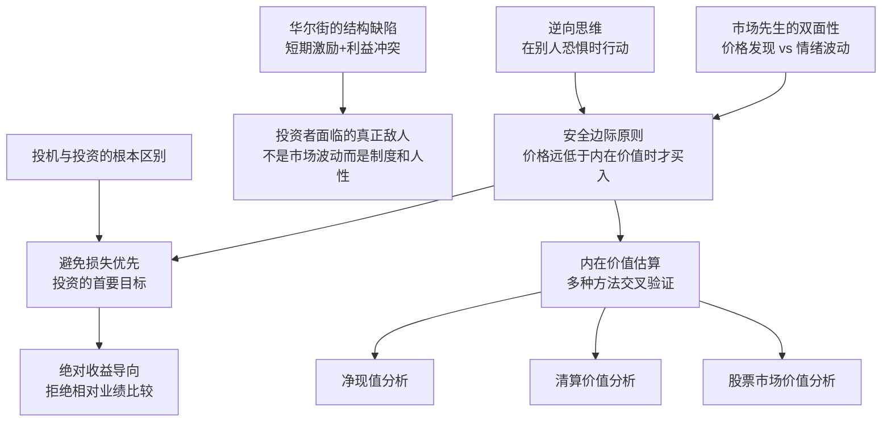

# 《安全边际》深度读书笔记

> [!abstract]
> 《安全边际》（Margin of Safety）是美国对冲基金经理塞思·卡拉曼1991年出版的投资著作，初版印量有限，出版后不久即绝版，二手市场价格长期在数百乃至上千美元。卡拉曼是波士顿Baupost Group的创始人兼首席投资官，该基金自1982年成立以来年化回报率约20%，且几乎没有亏损年份，管理规模从2700万美元增长到超过300亿美元。全书的核心论点延续了==本杰明·格雷厄姆==的价值投资传统：投资的首要目标不是追求收益最大化，而是==避免损失==。"安全边际"这个概念——只在价格远低于保守估算的内在价值时才买入——是贯穿全书的方法论基石。卡拉曼同时用大量篇幅剖析了华尔街的制度缺陷、投机心理的危害、以及1980年代垃圾债和杠杆收购泡沫的教训，将价值投资从一套技术方法提升为一种关于风险、人性和市场结构的完整世界观。

## 这本书要解决什么经济问题

> [!note] 核心困惑
> ==为什么大多数投资者——包括很多专业投资者——长期来看都跑不赢市场，甚至遭受永久性资本损失？是因为他们不够聪明，还是因为整个投资行业的激励机制和思维框架从根本上就是错误的？==

1991年卡拉曼写作此书时，华尔街刚刚经历了1980年代的垃圾债券狂潮和杠杆收购泡沫。迈克尔·米尔肯（Michael Milken）的德崇证券（Drexel Burnham Lambert）已经破产，数百亿美元的垃圾债违约，大量储贷机构倒闭需要纳税人救助。但卡拉曼观察到，几乎没有人从中吸取真正的教训——华尔街的短期激励机制依然完好无损，投资者对高收益的渴望丝毫未减，下一个泡沫的种子已经在酝酿。

> [!tip] 卡拉曼的出发点
> 大多数投资者的失败不是因为缺乏信息或分析能力，而是因为他们从一开始就搞错了==投资的目标==。他们追求的是收益最大化——买到涨幅最大的股票、获得最高的回报率。卡拉曼认为这个目标本身就是问题的根源。当你把全部精力放在"如何赚更多"上时，你自然会忽视风险、追逐热门、过度集中、放大杠杆——这些行为在牛市中看起来很聪明，在熊市中则会造成永久性的资本损失。

在投资思想的谱系中，卡拉曼直接继承了[[《聪明的投资者》|本杰明·格雷厄姆]]和大卫·多德在哥伦比亚大学开创的价值投资传统。格雷厄姆在1949年出版的《聪明的投资者》中提出了"安全边际"的概念，沃伦·巴菲特称之为"有史以来最好的投资书籍"。卡拉曼的贡献在于将格雷厄姆的理念更新到1980-1990年代的市场环境中——处理了格雷厄姆没有充分讨论的垃圾债、杠杆收购、金融工程等新事物——同时更系统地分析了==为什么大多数投资者无法做到价值投资==，将问题从"怎么做"深入到"为什么做不到"。

卡拉曼在全书中反复强调一个核心观点：投资和投机是性质完全不同的活动，但华尔街的制度设计使得大多数参与者——不论他们自认为是投资者还是交易员——实际上都在==投机==。只有理解了投资与投机的根本区别，才能真正建立起防御性的、以避免损失为优先的投资框架。

## 核心模型地图

卡拉曼在全书中构建了三个层层递进的论证：

- **投资与投机的根本区分**：投资是基于深入分析、以保本为首要目标、追求合理回报的行为；投机是基于价格预测、追求短期暴利、不考虑下行风险的行为。大多数市场参与者在投机而不自知
- **华尔街为什么系统性地制造投机者**：卖方激励机制（佣金驱动）、买方激励机制（相对业绩排名）、以及投资者自身的心理弱点（贪婪、从众、短视）共同构成了一个将参与者推向投机的系统
- **安全边际作为抵御系统性压力的方法论**：只有当你以远低于保守估算的内在价值的价格买入时，你才为自己的分析错误、运气不佳和市场波动预留了足够的缓冲空间——这是价值投资者对抗整个投机系统的核心武器

> [!important]
> 这三个层次构成了卡拉曼的完整逻辑：先诊断病因（投机的本质和制度根源），再开出药方（安全边际原则），最后讨论如何在一个系统性鼓励投机的环境中坚持这个药方。理解这个结构，你就能看清为什么卡拉曼把全书近一半的篇幅用来分析"投资者的敌人"，而不是直接教你如何选股。

## 逐层深入

### 投资与投机：你以为你在投资，其实你在赌博

卡拉曼开篇就划了一条清晰的线：==投资者关注的是资产本身的经济特征——它产生多少现金流、资产负债表上有什么、管理层是否可靠；投机者关注的是别人愿意出什么价格。==投资者买入一家公司，是因为他认为这家公司的价值高于其价格；投机者买入一个价格，是因为他认为别人会出更高的价格。

这个区分看起来简单，实际执行中极其模糊。卡拉曼以1980年代的垃圾债市场为例。垃圾债——高收益债券——在米尔肯的推销下被包装成一种"投资"产品。机构投资者被告知，虽然单个垃圾债的违约率较高，但分散持有的垃圾债组合的历史违约损失可控，而其收益率比投资级债券高出数个百分点。大量养老基金、保险公司和储贷机构涌入这个市场。

> [!warning] 卡拉曼的拆解
> 他指出垃圾债的"低历史违约率"是一个==生存偏差==的产物。1980年代大量新发行的垃圾债尚未到期，还没有机会违约——用一个年龄很轻的债券池的违约数据来推算长期违约率，就像用一群20岁年轻人的死亡率来推算人类平均寿命一样荒谬。更关键的是，垃圾债的大量发行本身改变了市场的风险结构——当每一家公司都能轻松借到高杠杆的钱时，债务质量整体下降，过去的违约率已经不能代表未来。

到1990年代初，事实证明卡拉曼是对的。垃圾债违约率从1980年代中期的约2%飙升到1990-1991年的超过10%，数百亿美元的本金蒸发。那些把垃圾债当作"投资"买入的机构遭受了巨大损失——它们从来不是在投资，而是在一个他们不完全理解的市场中投机。

卡拉曼从这个案例中提炼出一个普遍规律：==当一种"投资"的吸引力主要来自它的高收益率，而不是来自你对底层资产价值的独立分析时，你就已经从投资滑入了投机。==高收益本身就是高风险的信号——市场不会无缘无故给出额外的回报。那些看起来"免费"的超额收益，最终都会以某种形式收回成本。

### 华尔街：一台精密的投机制造机器

卡拉曼用了全书约三分之一的篇幅来剖析华尔街的制度缺陷。这不是出于道德义愤，而是出于冷静的结构分析——如果你不理解游戏规则对你的不利之处，你就不可能在这个游戏中存活。

**卖方的利益冲突。** 投资银行和券商的收入来自交易和发行，不来自客户赚钱。一个券商分析师推荐买入一只股票，这个推荐是否让客户赚钱对分析师的收入影响甚微；但这个推荐能否带来交易佣金和投行业务则直接决定他的奖金。==当推荐交易比推荐持有更赚钱时，你收到的"投资建议"天然偏向于更频繁的交易。==

> [!note] 新发行的陷阱
> 卡拉曼特别警告投资者远离新股发行（IPO）和新债发行。这些证券的发行时机是由发行方选择的——==公司选择在自身估值最高的时候上市，而不是在你买入最划算的时候。==发行方拥有远超买方的信息优势，它知道自己公司真正值多少钱。历史数据反复显示，IPO的长期回报率平均低于已上市的可比公司——那些短期翻倍的明星IPO被大量长期跑输甚至退市的IPO所抵消。

**买方的激励扭曲。** 基金经理的考核周期通常是一年甚至一个季度。如果市场上涨了30%，你只赚了15%，你就面临被客户赎回和被公司解雇的风险——即使15%的绝对回报率在任何合理标准下都很优秀。这种==相对业绩排名==制度创造了一个深刻的激励扭曲：基金经理被迫追踪市场、紧跟热门、不敢偏离——因为跑输的代价（丢掉工作）远大于跑赢的收益（多拿一些奖金）。

卡拉曼指出，这种制度安排的后果是基金经理的行为趋于高度相似——大家都重仓同样的大盘蓝筹股，因为如果这些股票下跌，所有人一起跌，没有人会因为"和大家一起亏"而被解雇。但如果你独立持有一只冷门股票，即使你的分析完全正确，短期表现也可能大幅偏离指数，从而危及你的职业生涯。==华尔街惩罚独立思考，奖励从众。==

**投资者自身的心理陷阱。** 卡拉曼列举了几种最常见的心理偏差：贪婪（看到别人赚钱就忍不住跟进）、恐惧（市场下跌时恐慌性抛售）、从众（觉得这么多人在买一定有道理）、短视（只关注下一个季度的业绩）、过度自信（以为自己能预测市场走势）。这些偏差不是性格缺陷，而是==人类进化的遗产==——在原始环境中，从众和避免短期损失有生存优势；但在投资领域，这些本能恰恰把你推向最糟糕的决策时点。

### 安全边际：价值投资的核心防御机制

> [!tip] 安全边际的定义
> ==在你对一项资产内在价值的保守估算基础上，要求价格进一步低于这个估算——低出来的部分就是你的安全边际。==如果你估算一家公司的内在价值是每股100元，你不是在100元买入，而是等到价格跌至60元或50元才买入。这40%-50%的折扣就是你的安全边际。

为什么需要安全边际？卡拉曼给出了三个理由，每一个都指向人类认知的局限性：

第一，==内在价值的估算本身就是不精确的。==未来的现金流、增长率、折现率都需要假设，而假设可能是错的。如果你以"精确"的估算值买入，你的容错空间为零——任何一个假设偏差都会导致亏损。

第二，==未来是不可预测的。==即使你今天的分析完全正确，明天可能出现你没有预料到的事件——行业变革、管理层欺诈、宏观危机、监管变化。安全边际是你为"意料之外"预留的缓冲。

第三，==市场可能在很长时间内不认可你的价值判断。==即使你买入了一只被低估的股票，市场可能需要两年、三年甚至更长时间才会纠正这个定价错误。在等待期间，你需要足够的安全边际来保证，即使情况比你预期的更差，你仍然不会遭受永久性的资本损失。

> [!example] 卡拉曼的估值方法论
> 他推荐三种互相验证的估值方法：
> - **净现值分析（NPV）**：将企业未来预期产生的自由现金流折现到当前。这是最常用的方法，但也最依赖对未来的假设。卡拉曼强调，应该使用==保守==的假设——宁可低估增长率、高估折现率，也不要为了得到一个"合理"的估值而拉伸假设
> - **清算价值分析**：如果这家公司今天关门，把所有资产卖掉、还清所有负债后还剩多少钱？这为估值设定了一个"底线"。如果你以低于清算价值的价格买入，即使公司经营完全失败，你也可能不亏钱
> - **股票市场价值分析**：在市场上，可比公司的交易估值是多少？这种方法的局限性在于市场本身可能系统性地高估或低估某个行业

卡拉曼特别强调，==估值不是为了得到一个精确的数字，而是为了确定一个大致的范围。==如果三种方法给出的估值范围差异很大，这本身就是一个警告信号——说明这项投资的不确定性很高，你需要更大的安全边际，或者干脆放弃。

### 亏损的三种形式：永久性损失才是真正的敌人

卡拉曼区分了三种不同类型的亏损，这个分类对投资决策至关重要：

==第一种是永久性资本损失。==你买入的资产价值真的低于你支付的价格——公司破产了，债券违约了，你投入的本金无法收回。这是真正的亏损，是卡拉曼全书最想帮你避免的。

第二种是账面浮亏。你买入的资产价格暂时下跌，但底层价值没有改变。如果你以50元买入一只内在价值100元的股票，价格进一步跌到40元，你的账面亏损了20%，但只要公司的基本面没有恶化，这只是暂时的价格波动，不是真正的亏损。==对价值投资者而言，这种"亏损"反而可能是加仓的机会。==

第三种是机会成本。你的钱被锁在一项回报率很低的投资中，错过了更好的机会。这种损失是隐性的，但长期来看同样代价高昂。

> [!important]
> 卡拉曼反复强调：==大多数投资者搞混了这三种亏损。==他们对第二种（账面浮亏）过度恐惧——市场一跌就割肉逃跑，把暂时的浮亏变成了永久的损失。同时对第一种（永久性损失）认识不足——在泡沫中重仓买入、在没有安全边际的价格水平上持有。安全边际原则的核心功能就是最大限度地降低第一种亏损的概率。

### 到哪里去找被低估的资产

卡拉曼不认为市场时刻保持有效。他承认市场在大部分时间、对大部分资产是大致有效的——这就是为什么大多数人确实跑不赢指数。但他认为，在某些特定的角落和特定的时刻，市场会系统性地出现定价错误，而这些正是价值投资者的机会来源。

**机构投资者不愿意触碰的领域。** 大型基金有各种内部限制：不能买低于某个市值的股票（太小了进不去也出不来），不能买信用评级低于投资级的债券（合规要求），不能买破产企业的证券（声誉风险）。当一家公司被降级、市值缩水或进入破产程序时，大量机构被迫卖出——==不是因为它们认为这些证券没有价值，而是因为它们的规则不允许持有。==这种非经济性的抛售创造了定价错误。

> [!tip] 特殊情境投资
> 卡拉曼花了大量篇幅讨论几类特殊情境：
> - **破产和重组证券**：公司进入破产保护后，其股票和债券通常暴跌。但破产不等于毫无价值——如果底层资产价值高于债务，债权人最终可能获得可观的回收。关键是对清算价值和重组后公司价值的准确评估
> - **强制性卖出**：指数成分调整、并购触发的反垄断出售、遗产清算等场景会产生与资产价值无关的卖出压力
> - **复杂证券**：可转换债券、权证、优先股等结构较复杂的证券往往被市场忽视或简单化处理，留下定价空间

**市场情绪的极端时刻。** 1987年10月19日，美股单日下跌22%。卡拉曼指出，在那一天结束时，美国经济的基本面没有发生任何变化——工厂还在运转，消费者还在消费，合同还在履行。==22%的跌幅不是因为美国企业的内在价值在一天之内蒸发了五分之一，而是因为恐慌情绪导致投资者不计成本地抛售。==对于在崩盘前就保持保守仓位和充足现金的价值投资者来说，这恰恰是十年一遇的买入机会。

### 持有现金不是浪费——耐心是被低估的竞争优势

卡拉曼在投资实践中最反直觉的一点是：==他愿意让大量资金以现金形式闲置。==在Baupost Group的历史上，现金比例有时高达30%-50%。在一个以"满仓"和"高换手率"为常态的行业中，这种做法看起来像是在浪费客户的钱。

但卡拉曼的逻辑是这样的：如果你找不到足够安全边际的投资机会，强行把钱投出去就意味着降低你的标准——这正是你开始亏钱的起点。==持有现金不是因为你看空市场，而是因为你在当前的价格水平上找不到值得承担的风险。==

现金还有另一个被低估的功能：==它让你在机会出现时有能力行动。==2008年金融危机期间，大多数基金经理被迫卖出来应对客户赎回——他们在最不应该卖出的时候被迫卖出。而保持了高现金比例的投资者不仅不需要卖出，还能趁低价大量买入。卡拉曼在2008-2009年的操作正是如此——他在危机前保持了高现金比例，在危机中大量抄底，为基金投资者创造了丰厚的回报。

> [!warning] 这对普通投资者的启示
> ==你不需要在每一天、每一周都做出投资决策。==没有法律规定你必须时刻满仓。当市场整体价格水平不提供足够安全边际时，最好的行动就是不行动。这在心理上是最难做到的——看着别人赚钱而自己"什么都没做"的痛苦，往往比实际亏损更难忍受。但正是这种耐心，构成了价值投资者最重要的竞争优势。

### 绝对收益 vs 相对收益：两种完全不同的游戏

> [!note] 核心区分
> 卡拉曼坚持以==绝对收益==为目标——他要的是每年正回报，而不是"跑赢基准"。这和华尔街主流的"相对收益"思维形成鲜明对比。一个追求相对收益的基金经理，如果市场跌了30%、他只跌了20%，会觉得"表现不错"——毕竟跑赢了指数10个百分点。但对卡拉曼来说，亏损20%就是亏损20%，不管指数跌了多少。

这两种目标导向会产生截然不同的投资行为。追求相对收益的人在牛市中被迫满仓（否则跑输），在热门板块中被迫参与（否则偏离基准太远），在市场泡沫化时被迫持有（因为减仓就意味着短期跑输）——他们的一切行为被基准指数牵着走。

追求绝对收益的人则完全不同。他们可以在找不到好价格时大量持有现金，可以在冷门的小市值股票、破产债券或外国市场中寻找机会，可以完全无视市场的短期走向——==因为他们的目标不是打败某个指数，而是在每一笔交易中获得正的风险调整后回报。==

卡拉曼认为，追求绝对收益在短期内看起来很"无聊"——你可能连续几年跑输大盘。但在长周期中，避免了重大亏损的投资者几乎必然跑赢那些在牛市中光彩夺目但在熊市中损失惨重的人。==复利的数学决定了：亏损50%后需要赚100%才能回本。避免大亏，比追求大赚重要得多。==

## 预测与现实

卡拉曼在1991年的很多判断在此后三十多年中被反复验证：

- ==市场泡沫会周期性地出现==——1991年后经历了1990年代的科技股泡沫、2000年的破灭、2007-2008年的次贷危机和金融海啸、2020年的散户投机潮，每一次都印证了他关于投机心理和制度缺陷的分析
- ==华尔街的激励机制没有根本改变==——2008年金融危机后的监管改革（如多德-弗兰克法案）在一定程度上约束了银行的自营交易，但卖方利益冲突和买方相对排名制度依然完好
- ==安全边际策略在长期中有效==——Baupost Group在2008年金融危机中大幅获利，验证了"在别人恐惧时买入"的方法论
- ==垃圾债的风险在低利率环境中被再次低估==——2010年代的低利率环境驱使投资者大量涌入高收益债市场，历史几乎重演了1980年代的场景

> [!warning] 需要注意的变化
> - 被动投资（指数基金）的崛起是卡拉曼1991年没有预见到的——当越来越多的资金不做主动选股而是被动追踪指数时，市场的价格发现机制可能被削弱，也可能为主动价值投资者创造更多定价错误的机会
> - ==量化交易和算法交易==改变了市场的微观结构——短期价格行为越来越由算法驱动，传统的基本面分析者在短期中可能面临更大的价格波动
> - 持续的低利率/零利率环境（2008年至2022年）使得卡拉曼推崇的"持有现金等待机会"的成本大幅上升——现金的实际购买力在通胀中缓慢被侵蚀
> - 信息获取的民主化（互联网、社交媒体、免佣交易）改变了散户和机构之间的信息不对称格局，但并未消除行为偏差

## 不同学派怎么说

- **有效市场假说**（尤金·法马）认为市场价格在任何时点都充分反映了所有可用信息，因此"安全边际"在理论上不应该系统性地存在。如果一只股票看起来被低估了，那一定是因为你遗漏了某些风险因素，而不是因为市场犯了错。==卡拉曼的整本书可以看作是对有效市场假说的实践层面的反驳==——他不否认市场在大部分时候大致有效，但坚持认为制度约束和人类心理会周期性地创造严重的定价错误

- **现代投资组合理论**（马科维茨、夏普）用波动率来定义风险——价格波动越大，风险越高。卡拉曼强烈反对这个定义。他认为==真正的风险是永久性资本损失的概率，而不是价格的波动幅度==。一只价格波动很大但内在价值被严重低估的股票，对价值投资者来说风险很低；一只价格稳定但估值泡沫化的蓝筹股，真实风险反而极高

- **成长股投资**（菲利普·费雪、彼得·林奇）更关注企业的长期成长潜力，愿意为高质量的增长支付较高的价格。卡拉曼对此持谨慎态度——他认为对增长率的预测本身就高度不确定，为未来的增长支付溢价意味着你在对自己预测能力的信心上押注。==格雷厄姆传统更偏好"以便宜的价格买入平庸的公司"而非"以合理的价格买入优秀的公司"==，卡拉曼在这个光谱上更靠近格雷厄姆

- **行为金融学**（卡尼曼、塔勒布）从学术角度验证了卡拉曼在实践中观察到的投资者心理偏差——过度自信、损失厌恶、锚定效应、从众行为。卡拉曼的书可以看作是行为金融学在投资实践中的先声——他在卡尼曼获得诺贝尔奖之前十多年就系统地描述了这些偏差如何导致市场定价错误

## 对你意味着什么

卡拉曼对你最重要的提醒不是某个具体的选股方法或估值公式，而是一种思维方式的转变：==把避免亏损放在追求收益之前。==这听起来过于保守，但复利的数学告诉你，长期财富的积累更多取决于你避免了多少次大亏，而不是你抓住了多少次大涨。

在操作层面，这意味着几件事。第一，不要因为"钱闲着没收益"就降低标准强行投资——持有现金是一种有意识的选择，不是一种失败。第二，当你看到一个"高收益"的投资机会时，首先问的不应该是"我能赚多少"，而是"我可能亏多少"以及"这个收益是用什么风险换来的"。第三，远离那些你不理解的复杂产品——如果你说不清一项投资为什么值这个价格，你就没有能力判断它是否有足够的安全边际。

还有一个容易被忽视但极其重要的点：==你需要警惕的不只是市场风险，更是你所接受的投资建议的来源。==券商分析师、财经媒体、社交平台上的"大V"——他们的收入和你的投资回报之间几乎没有关联。理解谁在向你推销什么、他们的激励机制是什么，是保护自己的第一道防线。

## 延伸阅读

- [[《聪明的投资者》]]：格雷厄姆的奠基之作，"安全边际"概念的最初来源。卡拉曼的书是对格雷厄姆理念在1980-1990年代市场环境中的延续和更新
- [[《证券分析》]]：格雷厄姆和多德的更学术性的经典，对企业财务分析和债券定价有更详细的讨论，是价值投资的技术性工具箱
- [[《21世纪资本论》]]：皮凯蒂从宏观层面讨论了资本回报率长期高于经济增长率的结构性趋势——这为理解卡拉曼所说的"资本积累的数学力量"提供了更宏大的历史视角
- [[《债务危机》]]：达利欧对金融危机机制的系统分析，与卡拉曼关于市场泡沫和崩溃周期的实践观察形成理论与实践的对照
- [[《随机漫步的傻瓜》]]：塔勒布对随机性和不确定性的深入思考，与卡拉曼"为意料之外预留空间"的安全边际理念在哲学层面高度共鸣
