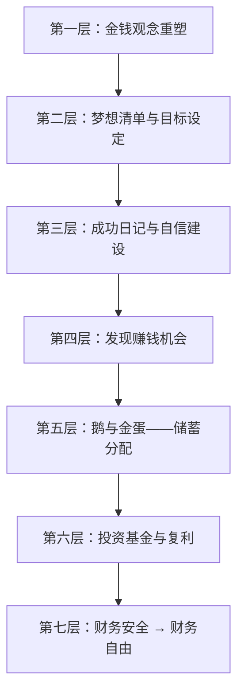

# 《小狗钱钱》深度读书笔记

> [!abstract] 全书速览
> 这本书用一个12岁女孩吉娅和会说话的小狗钱钱的故事，构建了一套完整的个人理财操作系统。它不是技术性的投资指南，而是理财观念的启蒙——从修复你和金钱的关系开始，到设定梦想、建立自信、增加收入、合理分配、投资增值，最终实现财务自由。这是一本"看起来是给孩子写的，实际上很多成年人更需要读"的书。

## 这本书要解决什么经济问题

1999年，德国理财教育家博多·舍费尔出版了这本《小狗钱钱》（德文原名 *Ein Hund namens Money*）。他想解决的问题很简单，也很普遍：==为什么大多数人终其一生都在为钱发愁，却从来没有人教过他们如何与金钱相处？==

学校教数学、物理、历史，但不教你如何管理自己的钱。父母可能自己也不会理财，只能传递一些模糊甚至错误的金钱观念——"钱是万恶之源""有钱人都是坏人""我们这种普通人不可能有钱"。舍费尔认为，正是这些从小被灌输的负面信念，成为人们理财道路上最大的障碍。

所以他选择了一个巧妙的形式：用童话故事来传递理财知识。主人公是12岁的女孩吉娅，她的老师是一只会说话的拉布拉多犬"钱钱"。这个设定既能吸引儿童读者，又能让成年人放下戒备——毕竟，承认自己在理财上是"小白"这件事，对很多人来说有点难为情。

在个人理财类书籍的谱系中，《小狗钱钱》的定位是"零基础入门"。如果说罗伯特·清崎的[[《穷爸爸，富爸爸》]]是面向成年人的理财思维革命，那《小狗钱钱》就是更温和、更务实、更系统化的入门版本。它的独特价值在于：不仅告诉你"为什么要理财"，还手把手教你"第一步具体怎么做"。

舍费尔本人的经历为这本书提供了可信度。他26岁时负债累累，通过系统学习和实践理财知识在30岁前实现了财务自由。这段经历让他深刻理解了两件事：第一，理财原则本身并不复杂，任何人都可以学会；第二，阻碍大多数人理财的不是智力不足，而是从来没有人以正确的方式教过他们。所以他选择了童话故事的形式——让读者在不知不觉中接受理财教育，而不是面对一本枯燥的教科书。这种教学策略的成功从市场反应得到了验证：《小狗钱钱》成为欧洲最畅销的理财入门书之一，被翻译成数十种语言，影响了数百万读者。

## 核心模型地图

舍费尔整本书的知识体系可以提炼为一个"理财金字塔"，从底层到顶层共七层：

**第一层是观念地基**——金钱不是邪恶的，贫穷也不是美德，你值得拥有财富。这是一切的起点。如果你潜意识里相信"有钱是不好的"，你的行为会不自觉地让自己远离财富。

**第二层是梦想确立**——没有清晰目标的人永远不会真正行动。舍费尔要求读者写下10个愿望，然后选出最重要的3个，为每个愿望制作"梦想相册"。目标必须具体到可以被感官想象。

**第三层是自信建设**——通过"成功日记"发现自己的能力。每天记录至少5件做成功的事情，不管多小。积累下来，当你面对新挑战时，可以翻看过去的记录来提醒自己"我确实是有能力的"。

**第四层是收入增加**——发现别人的需求，用自己的能力去满足它。书中吉娅通过遛狗赚到了第一笔钱。赚钱的本质不是"我想卖什么"，而是"别人需要什么"。

**第五层是合理分配**——这就是著名的"鹅的故事"。把收入的50%存入"鹅"账户（这笔钱永远不能花，只能用于投资），40%存入梦想储蓄罐，10%用于日常消费。

**第六层是投资增值**——把"鹅"的钱投入分散化的基金，长期持有，让复利为你工作。

**第七层是财务自由**——当"鹅"下的"金蛋"（投资收益）足够覆盖你的生活开支时，你就不再需要为钱工作了。

> [!note] 金字塔的结构逻辑
> 这个金字塔的精妙之处在于：每一层都是下一层的基础，跳过任何一层都会导致后面的层不稳固。很多人上来就想学"投资技巧"，却忽略了前面的观念建设和习惯培养，结果往往是赚了也拿不住、亏了更恐惧。

## 逐层深入

### 梦想清单：没有目标，你就不会出发

故事开篇，吉娅的家庭正面临财务危机——父母买了超出偿还能力的房子，信用卡债务不断累积，为钱争吵不休。在这种环境下，钱钱给吉娅的第一个任务不是"如何赚钱"，而是"写下你最想要的10样东西"。

> [!tip] 核心洞察
> 大多数人从未认真想过自己到底想要什么。他们模糊地觉得"想要更多钱"，但这个愿望太抽象了，大脑无法将其转化为行动指令。

钱钱要求吉娅从10个愿望中选出最重要的3个，并为每一个制作"梦想相册"——用图片将愿望视觉化。吉娅选择的三个目标是：一台笔记本电脑、去美国旅行、帮助父母还清债务。

这个方法背后的原理在心理学中有大量研究支持。目标设定理论（Locke & Latham）证实，具体且有挑战性的目标比模糊的"尽力而为"能带来更好的表现。"梦想相册"本质上是一种视觉化目标设定法，它让你的目标从抽象变得具体，从"想法"变成每天能看到的"图景"。

==赚钱不是目的，实现梦想才是目的。金钱是通往你真正想要的生活的工具。==当你把"赚钱"和"具体的梦想"连接起来时，你的动力会完全不同。

舍费尔还强调了一个容易被忽视的细节：你需要每天看你的梦想相册，而不是做完一次就放在抽屉里。这种持续的视觉刺激有助于在潜意识层面进行"重新编程"——你的大脑会逐渐从"这是不可能的幻想"转变为"这是我正在走向的现实"。哈佛大学的追踪研究发现，那些在青年时期写下了明确人生目标的人，在二十年后的收入和职业成就上显著高于没有明确目标的人。当然，相关关系不等于因果关系，但至少说明目标设定这个行为本身具有积极效应。

> [!warning] 需要注意的边界
> 梦想清单方法的潜在风险是：如果你选定的梦想本身是别人灌输给你的（比如社会标准中的"成功"），你可能会花大量精力追逐一个实现后并不让你快乐的目标。舍费尔没有深入讨论"如何确保你的梦想真的是你自己的"。

### 成功日记：自信是理财能力的根基

钱钱给吉娅的第二个任务是：每天写"成功日记"——每天记录至少5件自己做成功的事情，不管多小。不是大事件，而是任何你做得好的事：今天做了一道好菜、帮同学解答了一个问题、跑步比昨天多跑了100米。

为什么这件事重要？因为人类大脑有一种"消极偏差"——负面事件在记忆中的权重远大于正面事件。你可能做了十件好事，但只要犯了一个错误，就会整天想着那个错误。成功日记的作用是人为纠正这种偏差，让大脑也开始关注自己的优势和成就。

这与心理学家班杜拉的"自我效能感"理论高度一致——自我效能感的最强来源就是"掌握经验"，即通过回忆和确认过去的成功来增强对未来成功的信心。成功日记本质上是一种低成本、高回报的自我效能感训练工具。

> [!tip] 核心洞察
> ==理财能力的最大障碍往往不是知识不足，而是自信不足。==很多人不敢开始投资、不敢争取加薪、不敢创业，根本原因是他们不相信自己有能力做好。成功日记攻击的正是这个根源。

成功日记的应用范围远不止理财。在任何你想要建立新能力的领域——学外语、健身、写作、社交——每天记录"小成功"都能有效地建立正向循环。关键是：不要等到有大成就才记录，微小的进步也值得记录。

有一个常见的反对意见是："这不就是自欺欺人吗？"舍费尔的回答是：成功日记不是让你忽视缺点，而是让你的自我评估更加平衡。大多数人的问题不是"过度自信"，而是"严重低估自己"。成功日记的目标是把你从"只看到失败"的极端拉向"既看到失败也看到成功"的中间地带。而且，成功日记还有一个隐含好处：它培养了"反思习惯"。每天花几分钟回顾当天发生了什么，这种反思能力本身就是一种宝贵的元技能——很多人过着"自动驾驶"的生活，从不停下来审视自己的轨迹。

### 鹅的故事：永远不要花掉你的本金

钱钱给吉娅讲了一个寓言：一个农夫养了一只鹅。有一天他发现鹅下了一颗金蛋。此后每天鹅都下一颗金蛋。农夫越来越贪心，想一次性得到所有金蛋，于是杀了鹅——结果当然什么也没有了。

在这个比喻中，==鹅就是你的本金，金蛋就是本金产生的利息/收益==。舍费尔用这个故事推导出核心分配法则：

- **50%** 存入"鹅"账户（这笔钱永远不能花，只能用于投资）
- **40%** 存入梦想储蓄罐（为具体目标存钱）
- **10%** 用于日常零花

这个50-40-10的分配法则，本质上是"先支付自己"原则的少年版表达。与[[《穷爸爸，富爸爸》]]中强调的相同原则相比，舍费尔的版本更具体、更有操作性——他给出了明确的比例，而且用"不能杀鹅"这个形象来建立心理防线，防止你在冲动消费时挪用投资本金。

> [!warning] 现实中的调整
> 50%的储蓄率对于很多人来说可能过高，特别是对于收入刚够维持生活的家庭。这是一个教学用的简化比例，不是放之四海皆准的铁律。你需要根据自己的实际收入水平和生活成本来调整。但核心原则不变：永远先留下一部分给"鹅"，再安排其他支出。

==财富积累的第一原则不是"赚更多"，而是"留住一部分"。==很多高收入者同样是月光族——收入高但支出更高，永远没有"鹅"。舍费尔用一个12岁孩子都能理解的比喻传达了一个很多成年人终其一生都没领悟的道理：你的消费欲望会随着收入增长而增长（生活方式通胀），除非你在赚到钱的第一时间就把一部分"藏起来"。

"鹅的故事"之所以如此有效，还因为它利用了一个心理学现象：损失厌恶。人们对失去一样东西的痛苦，大约是得到同样东西的快乐的两倍。当你把一笔钱定义为"我的鹅"时，花掉它的心理成本就变得很高——它不再是一笔普通存款，而是一个有名字、有身份的"活物"。杀掉自己的鹅比花掉一笔存款要难得多。这就是比喻的力量——它在你的心理防线上安装了一个具体的、形象的、有情感重量的保护机制。

这个分配法则还有一个重要优势：自动化。舍费尔建议设置"自动转账"——每次收到钱，第一件事就是按比例分到不同账户。这意味着你不需要每次都做"要不要存钱"的决定（每次决定都消耗意志力），而是只需做一次决定（设置自动转账），然后让系统替你执行。行为经济学家理查德·泰勒的"助推"理论和"默认选项"概念，本质上就是同一个思路。

### 增加收入：发现需求，创造价值

吉娅在钱钱的引导下开始寻找赚钱的方式。钱钱没有说"去找一份工作"，而是引导吉娅思考三个问题：

1. 你喜欢做什么？
2. 你擅长做什么？
3. 别人需要什么？

当这三个问题的答案重叠时，你就找到了你的"赚钱甜蜜点"。吉娅想起自己很擅长和狗打交道，于是开始为邻居遛狗——从一条狗开始，逐步扩展到多条狗。后来她还教一个名叫莫尼卡的女孩一起遛狗，实现了简单的"业务规模化"。

> [!tip] 核心洞察
> ==赚钱的本质是发现别人的需求并用你的能力来满足它。==不是你想卖什么，而是别人需要什么。

这个方法本质上是日本"ikigai"（生活意义）概念在理财领域的简化应用。你不需要等到成年、等到有学历、等到"准备好"才能开始赚钱。舍费尔用一个12岁女孩的例子证明：只要你愿意观察周围人的需求，并用你已有的能力去满足这些需求，赚钱随时可以开始。

当然，吉娅的遛狗生意是一个理想化的创业案例——市场需求明确、启动成本为零、没有竞争对手。现实中的创业远比这复杂。但作为"第一次赚钱"的教学案例，它的简单性恰恰是优势——它让读者相信"赚钱没有那么难"，从而迈出第一步。而迈出第一步，往往是整个理财旅程中最难也最关键的一步。

吉娅后来教莫尼卡一起遛狗的情节也值得注意。这是舍费尔在暗示一个更深层的商业概念：从"出卖自己的时间"到"建立系统"。当你只是一个人遛狗时，你的收入受限于你的时间和精力。当你开始教别人遛狗并从中分成时，你就建立了一个简单的商业系统——你的收入不再完全依赖于个人的劳动时间。这个从"为钱工作"到"让系统为你工作"的转变，是整个理财旅程中的一个关键跃迁。

### 投资基金与复利：让金钱为你工作

书中出场的金先生（一位富有的老人）向吉娅介绍了投资基金的概念：基金就是把很多人的钱汇集在一起，由专业的基金经理来投资股票市场。他给出了几个关键的投资原则：

**分散投资**：不要把所有钱放在一只股票或一个市场里。

**长期持有**：短期市场波动不可预测，但长期来看股票市场整体趋势是上涨的。建议至少持有10年以上。

**定期定额**：每月固定投入一笔钱到基金中，利用"成本平均法"降低市场波动的影响。

**复利效应**：如果你每年获得12%的回报率，6年本金就会翻倍。

> [!note] 72法则
> 书中提到的快速计算复利的方法：==72 / 年回报率 = 本金翻倍所需年数==。例如：年回报率8%，72/8=9，大约9年本金翻倍。这个法则虽然是近似值，但对于培养对复利的直觉非常有用。

舍费尔在投资建议上做了一个重要选择——他没有教吉娅选个股，而是推荐基金。这反映了一种被动投资哲学的立场：对于普通人来说，试图通过选股来超越市场是不明智的。你应该把钱交给专业人士管理，或者更好地，投资于追踪市场指数的低成本基金。

==投资不是赌博。赌博是把钱押在不确定的短期结果上，而投资是把钱放在长期来看大概率增长的资产上。==关键区别在于时间维度和分散程度。

这里值得展开讨论为什么"长期持有"如此重要。短期市场波动主要由情绪驱动——恐惧、贪婪、恐慌、从众——这些情绪不可预测。但长期市场走势主要由基本面驱动——企业利润增长、技术进步带来的生产力提升、人口增长带来的需求扩张。只要人类社会在整体上是进步的，股票市场的长期趋势就是上涨的。历史数据表明，如果你持有一个分散化的股票基金超过15年，出现亏损的概率接近于零。但如果持有期只有1-3年，亏损的概率就相当高了。

行为金融学的研究还表明，投资中最大的敌人不是市场下跌，而是你自己的情绪。普通投资者因为在市场高点恐慌卖出、在低点错过反弹而损失的收益，远超因为选错基金而损失的收益。所以"定期定额、长期持有、不因短期波动而改变策略"这三条原则，实际上是在对抗人性中最根深蒂固的弱点。能够做到这三条的人，不需要高深的投资知识，就已经跑赢了大多数试图"择时"和"选股"的人。

### 债务危机：关于负债的深层教训

吉娅的父母在故事中代表了一种典型的家庭财务困境：为了"看起来过得好"而过度借贷。他们买了超出承受能力的房子，使用多张信用卡消费，收入的大部分用于偿还贷款利息。

钱钱和金先生帮助吉娅理解了债务的本质：==债务是反向复利==。当复利为你工作时（投资），你的财富指数级增长；当复利对你工作时（负债），你的债务也指数级增长。信用卡年利率通常在15%-20%之间，而投资回报率通常在5%-12%之间——也就是说，还清高利率债务本身就是一种高回报的"投资"。

金先生给吉娅父母的建议可以总结为四点：

1. 停止借新债
2. 尽可能降低每月生活支出
3. 用多余的钱优先偿还利率最高的债务
4. 即使在还债期间，也要保留一小部分钱给"鹅"——因为如果完全没有储蓄，任何突发事件都会让你再次陷入借债循环

> [!warning] 关于债务的重要区分
> 舍费尔讨论的主要是消费性债务（非投资性债务）。并非所有债务都是坏的。投资性债务（如合理的房贷用于出租房产、教育贷款用于提升收入能力）在利率合理且预期回报高于利息成本时是合理的金融工具。但对于理财初学者，先建立"消费性债务是有害的"这个认知是正确的优先级。

==负债消费是用"未来的自己"来补贴"现在的自己"。==你今天刷信用卡买的东西，要用未来几个月甚至几年的收入来偿还，而且还要加上利息。这是一种对未来自我的剥削。

从更宏观的视角看，吉娅父母的故事折射了一个全球范围内不断加剧的社会现象：消费主义文化对普通家庭的侵蚀。广告无处不在地告诉你"你值得拥有更好的"，而信用卡和消费贷款让你可以在还没赚到钱的情况下就"拥有"这些东西。这种"先享受后付款"的消费模式表面上是在提升生活质量，实际上是在透支未来的自由。当你的每月收入大部分都用于还贷和还信用卡时，你实际上已经成了债务的奴隶——你不是在为自己工作，而是在为银行工作。

舍费尔通过吉娅父母的故事温和地传达了一个尖锐信息：真正的财务自律不是"能买却不买"的苦行，而是清楚地知道什么是自己真正想要的，什么是被广告和社会压力制造的虚假需求。当你有了梦想清单，你就有了一个过滤器：每次消费前问自己，"这笔支出在帮我靠近我的三个梦想吗？"

### 金钱观念：与金钱的和解

在故事中，吉娅的表哥和一些大人代表了社会中普遍存在的"仇富"思维。他们会说"有钱人都是坏人""钱是万恶之源""安于现状才是正道"。钱钱逐一反驳了这些观点。

舍费尔指出：大多数人对金钱的负面态度不是来自他们自己的思考，而是来自成长环境中的"心理编程"。父母、老师、社会文化不断重复的关于金钱的消极信念，在人的潜意识中形成了"金钱负罪感"——你一方面想要钱，另一方面又觉得想要钱是不对的。

这种内部矛盾导致了自我破坏行为：你可能在财务状况好转时无意识地大量消费，把自己拉回"正常"（穷）的状态。

> [!example] 金钱信念自查清单
> 你内心深处是否存在这些隐性信念？
> - "有钱人是自私的"
> - "谈钱很庸俗"
> - "我不配拥有很多钱"
> - "钱多了会带来麻烦"
> - "赚大钱一定要做不道德的事"
>
> 如果你对其中任何一条有本能的认同感，这可能就是你的"金钱心理编程"在起作用。意识到它是改变它的第一步。

舍费尔的核心论点是：金钱本身是中性的工具。一把刀可以用来做饭也可以用来伤人——刀本身没有善恶，使用者的意图才有。同样，金钱可以用来做慈善、改善生活、帮助他人，也可以用于挥霍和剥削——决定因素是持有者的品格，而不是金钱本身。

这一层的观念重塑看起来简单，实际上是整本书最深层的贡献。很多理财书直接从"如何存钱""如何投资"开始讲起，假设读者已经在心理上准备好了要变得富有。但现实是，大量读者在潜意识层面还没有解决"我该不该有钱"这个问题。如果一个人内心深处认为"有钱是不好的"，那么无论你教他多少投资技巧，他都会在某个环节自我破坏。研究数据显示，彩票中奖者中有相当比例在几年内就回到了中奖前的财务状况——这不是因为他们不懂理财，而是因为他们内心的"金钱温度计"在起作用，把他们拉回"正常"的财务水平。

### 72小时法则：行动力的秘密

钱钱提出了一条关键法则：当你决定做一件事时，你必须在72小时内迈出第一步，否则你很可能永远不会去做。

这条法则背后的心理学机制是：人的动力是一条衰减曲线。在你刚产生一个想法的那一刻，你的热情和动力是最高的。随着时间推移，日常琐事、惰性、恐惧和"再想想"会逐步消磨你的意志力。72小时大约是一个临界点——如果你在这个窗口内没有采取任何行动，那个想法就会被归档到"有朝一日再说"的心理文件夹里，而那个文件夹几乎从来不被打开。

==行动比完美更重要。一个不完美的行动胜过一个完美的计划。==大多数人的理财计划死在了"我明天再开始"这句话上。

> [!warning] 适用边界
> 72小时法则适用于低风险、低成本的行动（开储蓄账户、设置自动转账、买一本理财书）。对于高风险、高成本的决策（买房、创业、大额投资），72小时内应该做的是"开始研究"，而不是"立即执行"。

### 导师与投资俱乐部：你需要同行者

书中的金先生和陶穆太太是吉娅的导师。他们不仅传授理财知识，更在精神上支持她。吉娅和朋友们还组建了一个"投资俱乐部"——几个孩子定期见面，一起学习、讨论、共同做投资决策。

导师的作用不仅是传授知识，更重要的是缩短你的试错周期。没有导师，你可能需要10年才能领悟的道理，有了导师可能6个月就明白了。但舍费尔也暗示了一个重要前提：你必须先证明自己值得被指导——吉娅之所以得到金先生的帮助，是因为她先帮金先生照看房子和宠物。

> [!tip] 核心洞察
> ==你是你花最多时间相处的五个人的平均值。==如果你周围的人都在抱怨金钱、恐惧投资、挥霍消费，你很难独自逆流而上。找到在财务上成功的人，进入他们的圈子，学习他们的思维方式。

在社交媒体时代，你的"财务同伴"不仅包括线下的朋友和同事，还包括线上关注的人。如果你的社交媒体首页满是炫富和奢侈生活内容，你的消费欲望会被不知不觉地拉高。反过来，关注分享理财知识、倡导理性消费的内容创作者，你的财务意识会逐渐提升。

金先生在书中的角色还暗示了一个要点：好的导师不会替你做决定，而是帮你建立做决定的能力。金先生没有直接告诉吉娅"买这只基金"，而是教她理解基金的原理、复利的机制、风险分散的逻辑，让她能够自己做出明智的投资决策。这种"授人以渔"的教育方式，是《小狗钱钱》整本书的教学理念。

### 从财务安全到财务自由：两个阶段的路径

钱钱在整个故事中区分了两个层次的财务目标：

**财务安全**是第一阶段——即使失去了工作，你也能维持基本生活一段时间。需要：6-12个月生活费的应急基金、没有高利率消费性债务、基本保险保障。这个阶段的目标不是"变富"，而是"不怕穷"——建立安全垫，让任何意外都不会把你推入财务深渊。

**财务自由**是第二阶段——被动收入超过生活支出，你不需要为了钱而工作。需要足够大的"鹅"，"金蛋"能覆盖日常开销。

> [!note] 先安全，后自由
> 太多人在没有安全垫的情况下追求高风险高回报——比如借钱炒股、把全部积蓄投入单一项目——一次挫折就全盘皆输。有了安全垫，你可以更从容地追求更大目标。这个策略在FIRE（Financial Independence, Retire Early）运动中得到了更详细的发展。

财务自由不意味着"从此不再工作"。它意味着你有了选择的自由——你可以选择做你真正想做的事情，而不是被迫做能付账单的事情。但通往财务自由的道路是漫长的，需要十年甚至数十年的持续努力。那些承诺"三个月翻倍""一年财务自由"的投资方案，几乎可以确定是骗局。真正有效的路径是枯燥的：持续储蓄、定期投资、长期持有、不折腾。复利需要时间来发挥威力，而时间是你现在就可以开始投入的最宝贵资源。

## 预测与现实

舍费尔在1999年出版此书时的一些核心理念，与之后二十多年的现实对照：

| 舍费尔的理念 | 后续验证 |
|-------------|---------|
| 投资基金是普通人最好的投资方式 | **高度验证**。指数基金的崛起（如先锋基金）证实了被动投资对普通人的优越性 |
| 复利是财富增长的引擎 | **永恒验证**。数学规律不会改变 |
| 消费性债务是财务毁灭的根源 | **广泛验证**。2008年金融危机的根源之一就是过度消费信贷 |
| 财商教育的缺失是普遍问题 | **持续验证**。多国开始将理财教育纳入学校课程 |
| 12%年回报率的假设 | **需要修正**。全球股票市场长期实际年化回报约5%-7%，用更保守的回报率做财务规划更稳妥 |
| 储蓄50%收入的目标 | **理想化但方向正确**。FIRE运动（财务独立提早退休）的参与者确实以40%-70%储蓄率为目标 |

关于12%回报率的假设：这个数字在1990年代的语境下（全球股市高速增长）是乐观但并非不合理的。然而以更长的历史维度看，全球股票市场的长期年化实际回报率（扣除通胀后）大约在5%-7%之间。读者应该用更保守的回报率（如6%-8%）来做财务规划。

舍费尔的投资建议——分散投资、长期持有、定期定额——在学术研究和实践中被广泛验证为适合普通投资者的策略。但他没有充分讨论的是：(1) 基金的管理费对长期回报的侵蚀；(2) 主动管理型基金长期来看大多数跑不赢指数基金。一个更稳健的建议是优先考虑低成本的指数基金，这在舍费尔写书的年代尚未像今天这样普及。

## 不同学派怎么说

**支持者观点**：
- 舍费尔用最简单的语言传达了最重要的理财原则，这是一种了不起的教育能力
- "成功日记"和"鹅的故事"是极其有效的教学工具，因为它们利用了故事和隐喻的力量
- 本书的操作性极强——读完后你确切地知道第一步该做什么

**批评者观点**：
- 书中的投资建议过于简化，缺乏对风险的充分讨论
- 12%的年回报率假设过于乐观，可能给读者不切实际的期望
- "每个人都能变富"的叙事可能忽略了结构性的经济不平等（如出生阶层、地区差异、系统性歧视）
- 书中的故事过于理想化——吉娅的创业几乎没有遇到真正的挫折

**平衡看法**：把《小狗钱钱》当作理财旅程的"第一本书"，而不是"唯一一本书"。它最大的价值在于帮助你完成从"零"到"一"的跨越——从完全不懂理财、甚至恐惧理财，到建立基本的理财框架和行动习惯。当你完成了这个跨越之后，你需要更深入、更专业的学习来完善你的知识体系。

还有一个值得探讨的问题：这本书出版于1999年，在过去二十多年里全球经济环境发生了巨大变化——互联网泡沫、2008年金融危机、欧债危机、新冠疫情、全球通胀。这些变化是否影响了书中建议的有效性？答案是：核心原则（正确的金钱观、目标设定、储蓄习惯、分散投资、长期持有）不受具体时代背景影响，因为它们基于人性和数学规律。但具体的操作建议（如12%的回报率假设、50%的储蓄比例）需要根据当下的市场环境做调整。不同国家的税收制度、金融产品可及性、社会保障体系也会影响具体策略，但"原则层面"的建议是跨文化普遍适用的。

## 对你意味着什么

如果你从未系统学习过理财，这本书可以成为你的起点。它最大的价值不在于投资技巧——事实上它的投资内容相当基础。它的价值在于做了一件大多数理财书不做或做不好的事情：==在你开始理财之前，先帮你修复了你和金钱的关系==。

它温柔地告诉你：你不蠢，你不贪，你不是"不该有钱"的人。你只是还没学会这件事。而这件事，比你想象的简单得多。

**立即可以开始做的事情**：

1. 准备一个笔记本，写下你的10个愿望/梦想，选出最重要的3个
2. 开始写成功日记——每天至少5条，坚持21天
3. 开设一个专门的"鹅"账户，设置每月自动转入（即使金额很小也没关系）
4. 如果有高利率消费性债务，制定还款计划：优先还利率最高的
5. 研究你所在市场的低成本指数基金

> [!warning] 重要提醒
> - 投资前确保你有3-6个月生活费的应急储备金
> - 投资的钱必须是你至少5年内不需要使用的闲钱
> - 不要一次性投入大额资金，用定期定额来降低择时风险
> - 不要追求高回报，先追求不亏损

最后，《小狗钱钱》是一本值得在不同人生阶段反复阅读的书。第一次读时，你可能会被它的简单性所打动。几年后再读，当你有了一些理财经验后，你可能会更深刻地理解某些建议——比如"永远不要杀掉你的鹅"这句话，在你第一次经历市场大跌、强烈想要卖出止损时，会获得完全不同的重量。十年后再读，当你可能已经实现了某种程度的财务安全后，你可能会开始思考舍费尔没有展开的更深层问题：金钱自由之后，什么才是真正让你幸福的生活？一本好的入门书的标志不是它回答了所有问题，而是它帮你提出了正确的问题，并给了你足够的基础去自己寻找答案。

## 延伸阅读

- [[《穷爸爸，富爸爸》]]（罗伯特·清崎）：理财思维的进阶挑战，更激进但也更有冲击力。与《小狗钱钱》形成互补——舍费尔更温和稳健，清崎更犀利颠覆。
- [[《巴比伦最富有的人》]]（乔治·克拉森）：与《小狗钱钱》理念一脉相承的经典寓言，用古巴比伦的故事讲述同样的理财原则。
- [[《漫步华尔街》]]（伯顿·马尔基尔）：当你准备好进入真正的投资世界时，这本书提供了指数基金投资的学术基础。
- [[《财务自由之路》]]（博多·舍费尔）：同一作者面向成年读者的进阶版，更系统更深入地阐述了同样的核心原则。
- [[《思考，快与慢》]]（丹尼尔·卡尼曼）：如果你对书中提到的心理偏差（消极偏差、冲动消费）感兴趣，这本行为经济学经典会带你深入理解人类决策的非理性本质。
