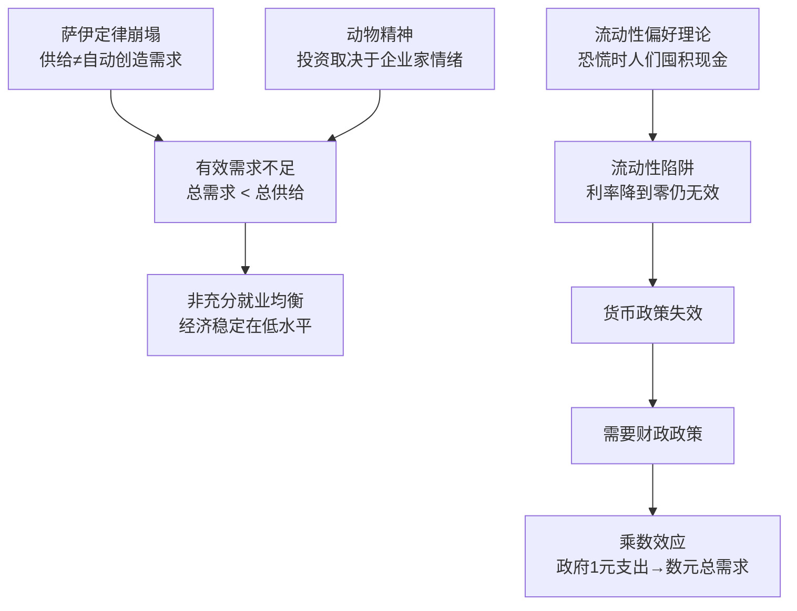

# 《就业、利息和货币通论》深度读书笔记

> [!abstract]
> 1936年出版的《通论》是20世纪最具影响力的经济学著作。凯恩斯在大萧条的废墟中论证了一个当时离经叛道、今天已成常识的观点：经济可以长期停留在高失业、低产出的均衡状态，除非政府主动干预。这本书不仅重塑了经济学理论，更直接改变了各国政府管理经济的方式——从罗斯福新政到2008年后的全球刺激政策，凯恩斯的影响无处不在。

## 这本书要解决什么经济问题

> [!note] 大萧条背景
> 1929年大萧条：美国失业率25%，工厂关门、银行倒闭、贸易崩溃。经济陷入看似无底的深渊，看不到自动恢复的迹象。

古典经济学的核心信条是：==市场有自我纠错能力==。失业→工资下降→企业多雇人→失业消失。但大萧条中工资在下降、失业率却在上升。理论和现实之间出现了巨大裂缝。

> [!tip] 凯恩斯的核心诊断
> 问题不在供给侧，而在==有效需求不足==。经济萎缩不是因为生产不出东西，而是因为没有足够的人愿意或能够购买。消费者恐惧减少支出、企业悲观减少投资、银行收紧贷款——理性的个体行为叠加成自我强化的下降螺旋。

## 核心模型地图

三个核心模型：
- **有效需求原理**：总产出由需求而非供给能力决定
- **流动性偏好理论**：利率由货币供需决定，恐慌时可能陷入流动性陷阱
- **乘数效应**：政府支出通过层层传递产生数倍的需求增量

## 逐层深入

### 萨伊定律的崩塌

> [!warning] 古典教条的致命盲点
> "供给创造自己的需求"忽略了==储蓄==的存在。在货币经济中，人们赚到钱不一定全部花掉。如果储蓄不能被投资吸收，就会出现总需求低于总供给——企业减产裁员、失业上升。

古典理论假设利率会自动平衡储蓄和投资。凯恩斯论证这个机制经常失灵：利率有下限，而在恐慌时即使利率极低企业也不愿投资——因为对未来没有信心。

### 消费函数与节俭悖论

凯恩斯提出**边际消费倾向**：收入增加100元，可能只花70元、存30元。两个规律：
1. 边际消费倾向小于1——增加的收入不会全部消费
2. 随收入增加，边际消费倾向递减——穷人几乎全花掉，富人大部分储蓄

> [!warning] 节俭悖论（合成谬误）
> ==所有人同时增加储蓄→总需求下降→企业裁员→国民收入下降→最终储蓄反而减少。==个体层面正确的行为在总体层面可能是灾难性的。

### 动物精神与投资的不可预测性

> [!tip] 选美比赛比喻
> 金融市场中，你的目标不是找出你认为最好的公司，而是==猜测其他投资者认为最好的公司==——甚至是猜测别人的猜测。这种层层博弈让市场价格远离基本面。

投资取决于对未来利润的预期，但未来本质上是**根本不确定的**（不是可计算概率的风险）。企业家在很大程度上依赖==动物精神==——自发的乐观冲动。当信心崩塌时，再低的利率也无法刺激投资。

### 流动性偏好与流动性陷阱

利率不是储蓄的"价格"，而是==放弃流动性的补偿==。持有现金的三种动机：交易、预防、投机。

> [!warning] 流动性陷阱
> 恐慌时期人们对流动性偏好急剧上升→即使利率降到零也不愿投资→==货币政策完全失效==。2008年后美联储零利率、日本二十年零利率精确验证了这个预言。

### 乘数效应与财政政策

> [!example] 乘数计算
> 政府花100亿修路→工人花掉80亿→另一批人花掉64亿→……→100亿初始支出带来约500亿总需求增量（边际消费倾向0.8时乘数=5）

> [!warning] 乘数不是万能的
> 深度衰退时乘数大（大量闲置资源），接近充分就业时乘数小甚至为负（政府支出挤出私人支出）。==凯恩斯主张的是衰退时刺激，不是任何时候都大量支出。==

### 工资刚性与非自愿失业

两个关键论点：
1. 名义工资向下刚性——工人抵制降薪不仅因工会，更因关心==相对工资==
2. 即使工资下降也不解决问题——降薪→消费下降→销售减少→进一步裁员

> [!tip] 非自愿失业
> 有人愿意以现行工资工作却找不到工作——不是因为懒惰或要价高，而是因为==有效需求不足以支撑充分就业==。这个概念在古典经济学中不存在。

## 预测与现实

- **二战后三十年**：凯恩斯主义政策带来"资本主义黄金时代"——稳定增长、低失业
- **1970年代滞胀**：高通胀+高失业并存，凯恩斯模型无法解释，促成货币主义崛起
- **2008年金融危机**：凯恩斯主义强势回归——动物精神崩塌、流动性陷阱、货币政策失效、财政刺激登场
- **2020年新冠疫情**：数万亿财政刺激是凯恩斯逻辑的直接应用，但随后的通胀提醒了过度刺激的风险

## 不同学派怎么说

- **货币主义**（弗里德曼）：过度强调财政政策、低估货币政策；大萧条根因是美联储失误而非需求不足
- **理性预期学派**（卢卡斯）：如果人们预期到政策行为会提前调整，政策效果被抵消
- **奥地利学派**（哈耶克）：政府干预扭曲价格信号，人为繁荣终将崩塌为更严重衰退
- **后凯恩斯主义**：主流凯恩斯主义太温和，丢失了原著中根本不确定性和金融不稳定性的深刻洞察

## 对你意味着什么

- 理解"刺激vs紧缩"的政策争论——需求不足需要刺激，但过度刺激引发通胀
- 金融市场中"选美比赛"的逻辑——价格反映情绪和预期，不仅反映基本面
- 个人最优≠社会最优——衰退时人人多存钱是理性的，但所有人都这样做会让经济更糟
- 货币政策有极限——零利率不一定能刺激经济，有时需要财政直接出手

## 延伸阅读

- [[《国富论》]]：凯恩斯最重要的反驳对象之一，对照阅读能看到从"市场万能"到"政府必要"的范式转变
- [[《资本主义与自由》]]：弗里德曼对凯恩斯主义最有力的回击，代表"政府干预通常使问题更糟"的立场
- [[《动物精神》]]：阿克洛夫和席勒用现代行为经济学重新诠释凯恩斯核心直觉
