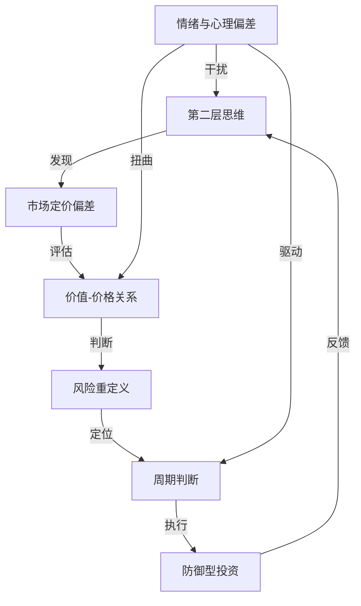

# 《投资最重要的事》深度读书笔记

> [!abstract] 全书速览
> 橡树资本创始人霍华德·马克斯用20个章节回答了一个投资者最该思考却最容易忽略的问题：==决定投资成败的，究竟是分析能力还是思维方式？==他的结论是后者。这本书不教你选股，不教你择时，而是拆解投资中那些"看不见的变量"——第二层思维、风险的真实面目、周期的位置感、价格与价值的微妙关系、以及人类情绪如何系统性地制造错误。马克斯的核心命题是：==投资成功的关键不在于"买到好东西"，而在于"买得好"==——以低于内在价值的价格买入，同时确保即使判断出错也不会出局。巴菲特评价这本书"难得一见的有用"，因为它触及的不是投资的"术"，而是投资的"道"。

## 这本书要解决什么经济问题

投资书籍市场从不缺少关于"怎么选股"和"怎么看盘"的教程，但马克斯要回应的是一个更根本的困惑：**为什么那些聪明人、那些拥有最好信息和分析工具的人，在投资中照样会犯灾难性的错误？**

2000年科技泡沫破裂，2008年全球金融海啸——每一次危机之前，华尔街最优秀的分析师都在发布看涨报告，最大的金融机构都在加大风险敞口。问题显然不在于信息不足或分析能力不够，而在于==思维方式本身存在系统性缺陷==。投资者不是缺少数据，而是缺少正确处理数据的思维框架；不是缺少聪明才智，而是缺少与聪明才智匹配的情绪纪律。

马克斯的核心主张是：投资中最重要的事不是一件事，而是一组相互关联的思维习惯。但如果非要抓住一个根本点，那就是——你必须学会与市场共识保持恰当距离。不是为了逆向而逆向，而是因为只有==非共识且正确的判断==才能带来超额收益。

> [!note] 作者背景
> 马克斯创办的橡树资本管理规模超过1500亿美元，以投资不良债务和困境资产闻名。这意味着他的盈利模式建立在"别人恐惧时买入"的基础之上——他比大多数投资者更需要理解风险和周期，因为他的投资对象本身就是危机的产物。他的"投资备忘录"自1990年代起在业界广泛传阅，巴菲特曾公开说"每次收到马克斯的备忘录，我做的第一件事就是打开阅读"。本书正是这些备忘录中核心思想的系统化整理。

在投资思想谱系中，马克斯属于价值投资阵营，但他的位置与其他价值投资者有明显区别。[[《聪明的投资者》]]的作者格雷厄姆建立了价值投资的定量框架——通过财务分析计算内在价值，以折扣价买入。巴菲特和芒格在此基础上扩展了"品质"维度。马克斯的独特贡献则在于引入了第三个维度：**投资者的集体心理如何系统性地创造和摧毁投资机会**。他聚焦于市场参与者的情绪状态和行为模式——因为正是这些"软"因素决定了价格何时偏离价值、偏离多远、以及何时回归。

## 核心模型地图

五个核心模型层层递进，构成完整的决策链条：

- **第二层思维**：市场价格反映集体预期，超额收益只来自==非共识且正确的判断==。仅仅正确是不够的，你的判断还必须与主流不同
- **价值-价格关系**：每项资产有可估算的内在价值，市场价格围绕其波动。投资本质不是"买好东西"而是"买得好"
- **风险重定义**：真正的风险不是波动率，而是永久性资本损失。==风险在繁荣时积累，在恐慌时释放==
- **周期定位**：市场在贪婪与恐惧间钟摆运动，虽然无法预测转折点，但可以判断"当前在周期的哪个位置"
- **防御型投资**：亏损与盈利数学不对称（亏50%需赚100%才回本），因此==避免灾难性损失比追求大额盈利更重要==

> [!tip] 五个模型的关系
> 这五个模型不是独立的工具箱，而是一条完整的决策链条：用第二层思维发现市场定价可能存在的错误 → 用价值-价格关系评估这个错误有多大 → 用风险重定义框架判断下行空间 → 用周期定位决定行动力度 → 用防御型投资方法论构建在各种场景下都能存活的组合。

## 逐层深入

### 一、第二层思维：为什么大多数"正确"的判断不赚钱

马克斯创造的"第二层思维"概念是全书最具影响力的贡献之一。它回答了一个让很多聪明投资者困惑的问题：我的分析明明是对的，为什么没赚到钱？

第一层思维是直线型的判断：

- "这是一家好公司，买入。"
- "经济即将衰退，股市要跌，卖出。"
- "通胀上升，买入黄金。"

第二层思维则多了一个维度——它不仅分析标的本身，还分析"其他人怎么看这个标的"：

- "这是一家好公司，但所有人都知道它好，股价已经充分反映甚至过度反映了好消息。现在买入的风险回报比并不理想。"
- "经济即将衰退，所有人都在恐慌抛售，股价已经跌到假设经济会崩溃的水平。如果衰退只是温和的，股价反而有巨大的上行空间。"

为什么这种区分如此重要？根本原因在于市场定价的本质。市场价格不是某个客观衡量标准，而是所有参与者集体预期的即时汇总。在充分竞争的市场中，大量聪明人在分析同样的信息——公司财报、行业数据、宏观经济指标。如果你的分析和结论跟他们一样，这些分析的价值已经体现在当前价格里了。你买在这个价格上，只能得到平均回报。

要获取超额收益，你的判断必须在某个维度上**不同于共识且比共识更正确**。这两个条件缺一不可。只是不同于共识但判断错误，你会亏钱；只是判断正确但与共识一致，你赚不到超额回报。这就是为什么投资如此困难——你不仅要做出正确的判断，还要做出大多数人没有做出的正确判断。

> [!example] 实战案例：2008年秋天
> 雷曼兄弟破产后，信用债市场陷入恐慌。第一层思维的反应："金融系统要崩溃了，卖掉一切风险资产。"第二层思维的反应："市场已经在按照'金融末日'的剧本定价了。投资级债券的收益率飙升到违约率远高于历史最差水平才能合理化的地步。如果政府出手救市（概率极高），大量被抛售的优质债券将以极低价格回归合理估值。"马克斯的橡树资本正是在这个时期完成了公司历史上最大规模的投资部署——短短几周内投出超过60亿美元。

马克斯特别强调：==第二层思维不等于简单的逆向操作==。它不是说市场涨你就做空、市场跌你就买入。有时候市场的共识是完全正确的。关键不是方向上的"反着来"，而是深度上的"多想一层"——当前价格反映了什么预期？这些预期合理吗？有什么被忽视了？只有在深入分析后确信市场犯了重大错误，才值得下注。

第二层思维还暗示了一种根本性的谦逊：如果你的判断和市场一致，要么市场已经正确定价了，要么你和市场一起犯了同样的错误。无论哪种情况，你都没有优势。

### 二、价值与价格：投资的基本等式

马克斯把投资还原为一个本质动作：==以低于内在价值的价格买入资产==。

这个定义看起来简单得近乎陈词滥调，但它实际上颠覆了大多数人对投资的理解方式。普通投资者的习惯思路是先判断"这是不是好公司/好行业/好趋势"然后决定买不买。马克斯说这只完成了一半的工作——而且是比较容易的那一半。一家公司好不好是一个问题，当前价格是否便宜是另一个完全不同的问题——后者才是决定投资成败的关键变量。

> [!tip] 核心洞察
> ==好公司不等于好投资。==如果你在2000年初以100倍市盈率买入思科——当时被公认为全球最伟大的科技公司之一——即使思科后来的经营没有变差，你也要等20年以上才能回本。反过来，2009年初很多看起来"很差"的公司，以足够便宜的价格买入，回报惊人。马克斯的总结是："没有任何资产好到不能被过高的价格毁掉，也没有任何资产差到不能被足够低的价格拯救。"

马克斯承认估值是困难的，但给出三个实践原则：

1. **用区间而非点位思考价值**——不要说"值100元"，而要说"大概值80到120之间"。这迫使你承认估值的不精确性
2. **要求足够的安全边际**——估值100元，不要在90元买，等到60元或50元。安全边际是对你自身估值能力局限性的保险
3. **关注相对价值**——即使无法精确判断绝对价值，也可以判断不同资产之间的相对高估或低估

马克斯还指出了一个深层原因：如果大多数人都知道"买得好"重要，为什么实际上很少有人做到？==因为最好的买入机会几乎总是出现在让人最不舒服的时刻==——当公司遭遇困境、行业前景黯淡、媒体充斥负面报道时，恰恰是价格最可能低于价值的时候。

### 三、风险的真实面目

这是全书最深刻也最具原创性的部分。马克斯对风险的重新定义不仅挑战了学术界的金融理论，也改变了很多专业投资者看待世界的方式。

学术界对风险有一个精确的定义：波动率——价格变动的标准差。按这个标准，一只价格剧烈震荡的股票比价格平稳的股票"风险更高"。这个定义之所以在学术界流行，是因为它可以被精确计算、可以被数学建模、可以被放进优化公式。但马克斯认为，这个定义抓住了一个表面特征而忽略了风险的本质。

考虑这个例子：一只股票从100元跌到50元再涨回100元，按波动率定义这是"高风险"股票——价格变动很大。但全程持有实际损失为零。另一家公司股价从100元缓慢平稳地跌到10元（逐步走向破产），波动率不特别高——每天只跌一点点——但你损失了90%本金。哪只股票的风险更高？按学术定义是前者，按常识是后者。

> [!warning] 马克斯的风险定义
> ==真正的投资风险是永久性资本损失的可能性==，而不是短期价格波动。暂时的下跌不是风险（只要你有能力和意愿持有），永久性地失去你的钱才是风险。

这个重定义带来三个反直觉但极其重要的推论：

**风险在繁荣时期积累。** 市场大好时，传统风险指标全部显示"低风险"。但高价格压缩了回报空间，乐观让人放松警惕，杠杆在不知不觉中积累。2006-2007年所有指标显示"稳定性极高"——那正是2008年海啸的前夜。

**风险在恐慌时期释放。** 市场崩溃时传统指标尖叫"高风险"。但低价格意味着更大回报空间，悲观情绪意味着坏消息已被过度定价。2009年3月所有指标说"极度危险"——那是十年大牛市的起点。

**风险无法事后验证。** 投资赚了钱不代表"没有风险"——可能只是运气好。==正确的评估方式是看风险调整后的收益，而非仅仅看收益本身。==

> [!example] 俄罗斯轮盘赌的启示
> 假设有人用左轮手枪（6个弹巢1颗子弹）赌100万美元。他活下来了，赚了100万。这是"好决策"吗？结果好（赚了100万），但决策显然是愚蠢的。==决策质量只能通过过程来评估，不能通过单一结果来评估。==投资中大量"成功案例"都有类似性质。

马克斯进一步指出，这个认识论上的困难让风险管理变成了一项"看不见的技能"。一个优秀的风险管理者，如果他的风险管理做得很好——避开了可能的灾难、保护了下行——你看到的结果可能只是"平庸的回报"。你无法看到那些没有发生的灾难。相反，一个无视风险的投机者在牛市中可能赚得盆满钵满，看起来像个天才。只有当潮水退去——熊市到来时——你才能看到"谁在裸泳"。

基于这些认知，马克斯提出了一套实用的风险管理思维：不要用波动率衡量风险，要思考"最坏情况下会永久性亏损多少以及被迫出局的概率有多大"；在市场乐观时提高警觉（因为真正的风险正在积累），在市场悲观时保持勇气（因为真正的风险正在释放）；永远为意外做准备——不是预测具体会发生什么，而是确保无论发生什么你都不会被永久性地清出市场。

### 四、周期的力量：情绪的钟摆

马克斯花了大量篇幅讨论市场周期，这个主题后来被他在专著[[《周期》]]中做了更深入的展开。他的核心论证：**周期是不可消除的，因为它的驱动力是不可改变的人性。**

市场为什么有周期？最根本的原因不是经济基本面的波动——虽然经济确实有周期——而是投资者情绪的极端摆动系统性地放大了基本面波动。

当经济好转、盈利上升、股价上涨时，投资者变得乐观。乐观情绪带来几个自我强化的效应：更多人买入股票（因为预期上涨），推高价格，上涨的价格进一步强化乐观（"你看，涨了吧"），更多原本观望的人被吸引入场——正反馈循环启动。在这个过程中，投资者对风险的容忍度不断提高：接受更低的风险溢价、使用更高的杠杆、买入质量更差的资产。信贷条件变得宽松，因为银行也被乐观情绪感染。媒体开始渲染"新经济"、"这次不一样"的叙事。

但乐观最终走向极端：价格被推到远超基本面的高度，估值变得荒谬，投资者的行为越来越像投机者。在这个状态下系统极其脆弱——任何微小的负面信号都可能触发逆转。

逆转一旦开始，恐惧取代贪婪，正反馈循环反向运作。杠杆在上涨时是放大器，在下跌时是毁灭器——当价格跌破保证金要求时投资者被迫在最坏时机卖出，进一步压低价格。银行收紧信贷，企业融资困难，实体经济也被拖累。直到悲观走向极端——价格远低于基本面、所有能卖的人都已经卖了——新一轮周期才开始酝酿。

> [!tip] 钟摆比喻
> 市场就像一个钟摆，在极端乐观和极端悲观之间摆动。==钟摆大部分时间不在中点，而是在向一端或另一端运动的途中。==它在中点只有一个瞬间就越过去了。这解释了为什么市场很少处于"合理估值"的状态。

马克斯的周期判断方法不是看图表或经济模型，而是观察投资者的行为和心理：

- 媒体在渲染"新纪元"还是警告"末日"？
- 投资者是不计风险追逐收益还是恐慌逃向现金？
- 垃圾公司也能轻松融资还是只有最优质公司才能发债？
- 新基金发行供不应求还是无人问津？
- 不懂投资的人是兴奋地讨论股票还是发誓再也不碰？

> [!warning] 逆周期行动的代价
> 逆周期投资在理论上清晰，在实践中痛苦。所有人赚钱时你保持谨慎，看起来像胆小鬼。所有人亏钱时你在买入，看起来像疯子。而且"市场保持非理性的时间可能比你保持偿付能力的时间更长"。逆向投资需要的不仅是洞察力，还有==耐心、勇气和不依赖短期业绩考核的制度保障==。马克斯的橡树资本使用"锁定"结构的基金——投资者不能随时赎回，这给了他在市场恐慌时买入的自由。

### 五、防御型投资：不对称的智慧

马克斯定位为"防御型投资者"，基于一个冷酷的数学事实：

如果你先亏损50%，然后盈利50%，你不是回本——只剩75%。要从50%亏损中恢复需要100%盈利。这种不对称性随亏损幅度增大急剧加剧：亏30%需赚43%恢复，亏75%需赚300%，亏90%需赚900%。

> [!note] 防御 vs. 进攻的数学
> ==一次灾难性亏损可以抹杀多年积累。==假设五年周期中，进攻型投资者前四年每年赚25%、第五年亏50%；防御型投资者前四年每年赚15%、第五年亏10%。最终：进攻型复合回报 = 1.25^4 x 0.5 = 1.22（总回报22%），防御型复合回报 = 1.15^4 x 0.9 = 1.57（总回报57%）。防御型回报是进攻型的两倍多——尽管四个好年份都"跑输"了。

防御型投资是一套系统性方法：

**安全边际**：价格显著低于价值时才买入，为判断错误留缓冲。如果估值100元以50元买入，即使你高估了30%（实际值70元），仍然有利可图。

**分散投资**：确保任何单一错误决策都不致命。不是消除错误，而是让错误代价可控。

**压力测试**：每笔投资都问"如果我错了会怎样"。具体评估最坏情况下会亏多少、整体组合能否承受。

**避免杠杆**：杠杆是将暂时亏损变为永久亏损的头号杀手。当价格跌破保证金要求，你被迫在最坏时机卖出——把纸面亏损变成真实亏损。

**保持流动性**：市场恐慌时有现金的人是国王。==最好的买入机会出现在别人被迫卖出的时候==——如果你自己也缺乏流动性而被迫卖出，你就是给别人提供便宜货的人。

> [!note] 防御的悖论
> 防御型投资的价值==在牛市中无法被看见==。市场连续上涨时，防御型投资者跑输全仓进攻的人。但熊市到来时，防御的价值以不成比例的方式显现——少亏50%需要的恢复力度，远小于多赚50%需要的再投入。长期看，不对称性让防御型策略在完整周期中产生更高的复合回报。

### 六、投资中的心理陷阱

马克斯列举的心理偏差不是个别人的缺点，而是全人类共有的认知特征——数百万年进化的产物，日常生活中有用，投资中有害。

**过度自信。** 人类大脑天然高估自己的预测能力。投资中表现为对分析"太确定"，不留犯错余地。正确做法是用概率分布思考——"市场上涨概率可能60%，但下跌场景也需要准备，且要确保在40%的不利场景中也能存活"。

**从众。** 进化把"和群体一致"编进基因——离群曾意味着死亡。但==在投资中，从众意味着在最贵时买入、最便宜时卖出==——亏损的完美配方。

**贪婪与恐惧的不对称。** 同等金额亏损带来的心理痛苦约是盈利带来的快乐的两倍（[[《思考，快与慢》]]中的前景理论）。导致投资者持有输家太久（不愿承认错误）、卖出赢家太快（害怕利润飞了）。

**短视损失厌恶。** 过度关注短期波动忽视长期趋势。如果投资框架以"年"为单位，每天查净值不仅无意义，还会积极损害决策——==在用最差的信息做最重要的决定==。

**锚定效应。** 投资者锚定在买入价或历史高点上。但市场不在乎你的买入价——股票是否值得持有取决于==当前价格与内在价值的关系==，和你的买入价毫无关系。

### 七、运气与技能：被忽视的区分

短期内（一年甚至三到五年），运气的影响可能大于技能。平庸投资者可能因赶上牛市而业绩出色，优秀投资者可能因黑天鹅而业绩糟糕。

马克斯指出真正判断投资能力需要两个条件：看**风险调整后的收益**，看**一个完整市场周期**（通常7-10年）的表现。

> [!tip] 识别真正的投资能力
> 马克斯提出精妙标准：==优秀的投资者不是在好年份赚得最多的人，而是在坏年份亏得最少的人。==牛市中赚钱不能证明能力——几乎所有人都在赚。在熊市中少亏——当大多数人遭受巨大损失时你亏损明显较小——这才说明风险管理和投资判断确实高于平均水平。推论：评估基金经理要重点看2008年、2020年3月、2022年这样的压力期表现。

## 预测与现实

《投资最重要的事》初版于2011年。十余年过去，可以检验马克斯的核心观点。

**被充分验证的：**

"周期不会消失"——2020年新冠暴跌、2021年刺激政策推动的狂热、2022年加息导致的回调，完美演绎周期摆动。三年内走完恐慌-狂热-回归的完整循环。

"风险在繁荣时积累"——2021年meme股票、SPAC、加密货币狂热期间，传统风险指标显示"一切正常"。2022年崩塌证明最"安全"的时刻积累了最大隐性风险。

"好公司不等于好投资"——2021年底以30-50倍营收买入的优质SaaS公司，2022年普遍下跌60-80%，尽管基本面未恶化。

> [!warning] 值得继续观察的
> - 被动投资（指数基金）的兴起是否削弱了市场的价格发现功能？越来越少的资本在做主动定价工作，市场效率是否下降？
> - 人工智能对投资决策的影响——如果更多交易由没有恐惧和贪婪的算法执行，市场行为模式是否会改变？
> - 防御型投资在不同利率环境中的有效性——超低利率时代对防御型投资者极不友好，利率正常化后重新验证了防御价值

## 不同学派怎么说

- **有效市场假说**（法玛）：如果定价错误可识别，套利者早就将其消除，长期来看没有人能持续战胜市场。马克斯的回应有两个层面：首先他承认市场在大多数时候确实相当有效——容易发现的定价错误确实很快会被套利掉。但在==极端情绪驱动的时刻==——市场恐慌或狂热的顶峰——定价会出现持续而显著的偏差。其次，即使你识别了定价错误，利用它也需要极大勇气、耐心和资金稳定性——大多数投资者在极端时刻做不到逆向行动。正因为利用这些机会太过痛苦，它们才不会被轻易套利掉

- **量化投资**（西蒙斯、阿斯内斯）：用数学模型系统性捕捉市场异常，方法论与马克斯截然不同——马克斯依赖主观判断和定性分析，量化依赖统计规律和算法执行。马克斯承认某些领域有效（如利用动量效应、价值因子），但认为模型无法捕捉"从未发生过"的极端情景，因为模型基于历史数据训练。2020年3月流动性危机中很多量化策略遭受严重损失，部分印证了这一担忧——模型在它没见过的极端条件下会失灵

- **成长投资**（费雪传统）：对于持续高速增长的公司，"价格过高"需要重新审视——如果盈利在未来十年增长十倍，今天看似"昂贵"的价格十年后可能显得极其便宜。亚马逊在2010年看起来总是"太贵了"，但如果你因此不买，错过了十倍涨幅。马克斯反驳：能持续高增长十年以上的公司极其罕见——大多数被市场预期高增长的公司最终让人失望。而且即使公司确实能高增长，为增长支付的价格也必须有上限，而市场在乐观时把这个上限推到荒谬高度。2021年大量高估值成长股暴跌是例证

- **动量投资**：市场有短期动量效应——过去上涨的资产倾向于继续上涨——"追涨杀跌"在严格的止损和仓位管理下可行且有利可图。马克斯不否认动量效应存在（有大量学术支持），但他认为在价格已大幅上涨后买入，得到的是更高价格和更小安全边际——本质是==承担更大风险换取更小潜在回报==。他的类比：动量投资者在加速列车上跳上车，赌它还会加速；价值投资者在列车停在站台时上车，等它重新出发

- **行为金融学**（塞勒、席勒）：为马克斯的很多直觉提供了学术支撑——关于投资者情绪如何扭曲价格、从众心理的力量、过度自信和锚定效应的论述都与行为金融学的实证发现高度一致。但两者有微妙分歧：学者通常认为行为偏差可被系统性利用（通过设计去偏差策略或量化行为因子），马克斯更悲观——识别偏差和克服偏差是两回事。你可以完美地理解从众心理的危害，但当所有人都在恐慌性卖出时，你的肾上腺素照样飙升，你的手照样颤抖

## 对你意味着什么

**对于个人投资者：**

- **重新校准预期**：全球股票市场长期年化回报约7-10%。期望每年20%以上，几乎必然要承担过高风险或被骗。设定合理预期是理性投资的第一步，也是最容易被忽视的一步
- **读懂市场情绪温度**：出租车司机推荐股票、"这次不一样"广泛传播、最不懂投资的朋友兴奋讨论收益 → 周期高位信号，降低风险敞口。媒体末日预言、身边的人发誓不碰股市 → 往往是最好的买入时机
- **为不知道的事情留空间**：真正的风险管理不是预测"会出什么事"（这不可能），而是承认"不知道会出什么事"，然后确保无论发生什么都不会被永久性清出市场。具体而言：避免杠杆、保持分散、持有一定比例现金或高流动性资产、确保不会在最坏时机被迫卖出
- **降低查看频率**：投资框架以"年"为单位，越频繁查看短期波动越容易做出情绪化决策。每天看净值的人比每季度看的人更容易在恐慌中卖出、在狂热中追高

**对于专业投资者：**

- **接受"大致正确"远好于"精确但经常出错"**：不需要买在最低点卖在最高点，不需要精确计算内在价值的小数点后两位。只需在价格显著低于价值时有勇气买入、显著高于价值时有纪律卖出
- **建立容许逆向操作的制度**：如果资金来源会在短期业绩不佳时撤资，你就永远无法真正实践逆周期投资。马克斯之所以能在2008年大举买入，不仅因为判断正确，更因为基金结构——锁定期足够长的封闭式基金——允许他这样做
- **区分投资能力和运气**：不要因为一两年好业绩而过度自信，也不要因为一两年差业绩而轻易改变深思熟虑的策略。评估投资能力要看风险调整后收益，看完整周期表现，重点关注压力期而非顺风期的表现

## 延伸阅读

- [[《周期》]] - 霍华德·马克斯 - 本书周期思想的深度展开，两本搭配阅读获得完整的马克斯投资哲学

- [[《聪明的投资者》]] - 本杰明·格雷厄姆 - 价值投资奠基之作，马克斯的"安全边际"直接继承自格雷厄姆。但格雷厄姆更偏重定量分析，马克斯更偏重思维方式

- [[《随机漫步的傻瓜》]] - 纳西姆·塔勒布 - 马克斯讲"如何在不确定性中做好决策"，塔勒布讲"不确定性本身有多容易被低估"。两人都强调谦逊

- [[《穷查理宝典》]] - 查理·芒格 - 芒格的多学科思维与马克斯的第二层思维深层共鸣。芒格的"反向思维"——"告诉我我将死在哪里，我就不去那里"——与马克斯的防御型投资异曲同工

- [[《思考，快与慢》]] - 丹尼尔·卡尼曼 - 马克斯在"心理陷阱"部分讨论的认知偏差的科学基础
