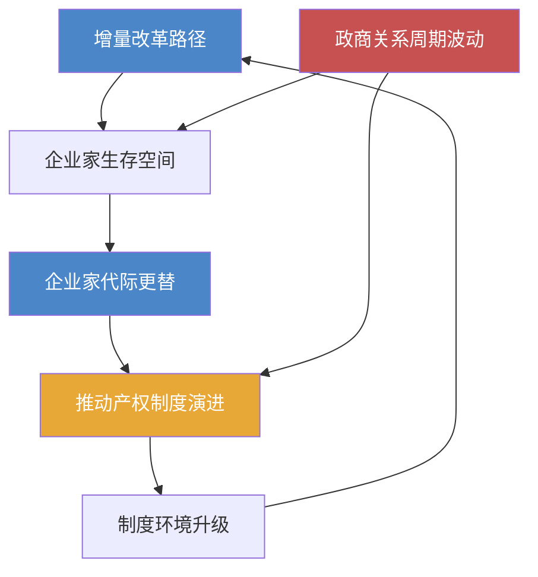

# 《激荡三十年》深度读书笔记

> [!abstract]
> 这本书是一部关于中国1978-2008年经济改革的全景式编年史。吴晓波以新闻记者的敏锐和财经作家的系统性，逐年记录了中国从计划经济走向市场经济的三十年激变。它不是一部教科书式的经济分析，而是一部以企业家群体和商业事件为主线的改革叙事——你能从中看到制度变迁如何催生一波又一波的商业浪潮，看到草根创业者如何在政策的灰色地带中野蛮生长，也能看到国有体制与民间力量之间持续数十年的博弈与共生。如果你想理解"中国经济奇迹"到底是怎么一步步走出来的，这本书提供了最鲜活、最有温度的入口。

## 这本书要解决什么经济问题

1978年之后的中国，面临着一个史无前例的经济命题：一个拥有十亿人口的农业大国，如何在没有现成路线图的情况下，从计划经济转轨到市场经济？这个问题在当时没有标准答案。苏联模式的"休克疗法"是一种路径，东欧各国的激进私有化是另一种路径，但中国最终走出了一条完全不同的道路——==摸着石头过河==。

吴晓波写这本书，核心动机不是为这场改革做理论总结，而是要回答一个更朴素的问题：这三十年到底发生了什么？谁在推动变革？变革中的赢家和输家分别是谁？那些今天看来理所当然的市场规则，当年是在怎样的混乱和争议中被建立起来的？

> [!note]
> 这本书的立场明确而坦率：它站在民营经济和企业家精神一边。吴晓波认为，中国三十年经济奇迹的真正主角不是任何宏大的顶层设计，而是千千万万在制度缝隙中寻找机会的普通人——温州的小商贩、珠三角的乡镇企业主、中关村的技术倒爷、以及后来的互联网创业者。

在经济学谱系中，这本书不属于任何学院派理论框架。它更像一部经济新闻史或商业社会学作品。如果非要定位，它的叙事逻辑最接近制度经济学的视角——关注产权变迁、政府与市场的边界移动、以及制度演化中"路径依赖"的力量。但与学术著作不同，吴晓波不做理论抽象，他让故事本身说话。他相信，当你读完足够多的企业家命运和商业事件之后，关于中国经济改革的深层逻辑会自己浮现出来。

这种"以叙事代替论证"的写法既是优点也是局限。优点在于它让经济改革的复杂历程变得可触可感——你不会觉得自己在读一份政策报告，而是在目睹一幕幕真实的人间戏剧。局限则在于，它不太可能为你提供一个精确的分析框架来预测未来。但对大多数读者来说，建立历史感本身就是一种极有价值的认知升级。

## 核心模型地图

吴晓波没有在书中提出正式的经济模型，但通读全书，你会发现有几条隐含的分析线索贯穿始终，构成了他理解中国经济转型的基本框架。

> [!tip] 线索一：增量改革路径
> 中国的改革不是先破后立，而是在保留原有计划经济体制的同时，在体制外培育市场力量。农村的联产承包责任制没有废除集体所有制，而是在其基础上激活了农民的个体积极性；乡镇企业没有动摇国有企业的地位，而是在国有体系覆盖不到的地方生长出来；经济特区没有在全国范围内推行市场化，而是在沿海划出几块"试验田"先行先试。这种==不动存量、做大增量==的策略，是理解中国改革为什么没有引发社会崩溃的关键。它意味着改革的推进方式不是"大爆炸"式的一步到位，而是"渐进蚕食"式的逐步蔓延——市场力量像水一样，从体制的缝隙中渗透进来，慢慢扩大自己的地盘。

> [!tip] 线索二：政商关系的周期性波动
> 吴晓波敏锐地捕捉到，中国的民营经济每隔几年就会经历一次"收与放"的循环。经济过热时收紧、经济冷淡时放开；民营力量壮大到让体制感到不安时收紧，经济增长乏力需要民间活力时放开。这种波动不是偶然的政策摇摆，而是反映了改革过程中==效率与控制之间根深蒂固的张力==。你在书中可以清晰地追踪到这个周期：1984年放开、1986年收紧、1992年再度放开、1993-1994年宏观调控收紧、1997年金融危机后谨慎放开、2003年后再度收紧……每一个"放"的周期都催生一批新企业家，每一个"收"的周期都让一批人出局。

> [!tip] 线索三：企业家群体的代际更替
> 书中呈现了至少三代企业家的崛起与沉浮：1980年代的草根创业者（步鑫生、年广久、鲁冠球），他们大多文化程度不高，靠胆量和本能在计划经济的缝隙中找到了生存空间；1990年代的制度套利者（牟其中、史玉柱、潘宁），他们善于在体制转型的混沌中捕捉机会，但也容易在制度规范化的过程中触礁；以及2000年代的全球化竞争者（任正非、马云、李彦宏），他们面对的是一个更加开放、也更加规范的市场环境，需要在国际竞争中证明自己。每一代企业家的成功模式和失败原因都不同，因为他们面对的制度环境和市场条件完全不同。

> [!tip] 线索四：产权改革的艰难推进
> 从"傻子瓜子"年广久的个体经营，到乡镇企业的集体产权模糊，到国有企业改制中的MBO争议，再到《物权法》的通过，产权问题一直是中国经济改革的核心矛盾之一。每一步产权制度的进步，背后都伴随着激烈的意识形态争论和复杂的利益博弈。产权的每一次明晰化，都是在为市场经济的运转夯实地基，但这个过程从来不是顺畅的，而是充满了进两步退一步的反复。

这四条线索相互交织：增量改革创造了企业家生存的空间，企业家的壮大推动了产权制度的演进，而政商关系的周期性波动则不断重塑着游戏规则。理解了这四条线索之间的关系，你就握住了阅读这本书的核心钥匙。

## 逐层深入

### 1978-1984：破冰年代——从"实践是检验真理的唯一标准"到万元户

这本书的叙事从1978年开始，但真正的起点是一种弥漫全社会的饥饿感——不只是物质上的匮乏，更是一种对改变现状的强烈渴望。当时的中国经济在"文革"十年的冲击下已经接近崩溃的边缘，国民经济处于停滞状态，城市居民的日常生活用品需要凭票供应，农村地区的贫困更是触目惊心。正是在这样的背景下，安徽凤阳小岗村的十八户农民在那份"生死契约"上按下了手印。他们并不知道自己正在参与一场改变十亿人命运的实验。

联产承包责任制的核心逻辑极其简单：==让种地的人能够保留自己的劳动成果==。在此之前的人民公社体制下，农民无论干多干少，收入都差不多，劳动积极性极低。联产承包做的只是一件事——把土地的使用权分到每家每户，交够国家和集体的，剩下的归自己。就这一个改变，在短短几年内让中国的粮食产量暴增，数亿农民的生活水平迅速提升。1984年，中国的粮食总产量突破了四亿吨，农民收入增长了近两倍。这个结果强有力地证明了一个朴素的经济学原理：当人们能为自己干活的时候，生产力就会爆发。

但农村改革的成功立即引发了一个新问题：农业生产率提高后，大量剩余劳动力从哪里去？答案是乡镇企业。吴晓波用大量篇幅描述了这一"意料之外"的经济现象——在温州、在苏南、在珠三角，农民们自发办起了小工厂、小作坊，生产从纽扣到电器的各种商品。这些乡镇企业的产权归属模糊（名义上是"集体所有"，实际运营者往往是个人），管理粗放，产品质量参差不齐，但它们以惊人的速度填补了计划经济长期忽视的消费品市场空白。到1980年代中期，乡镇企业已经成为中国经济增长最活跃的力量之一，这是中央政府在改革之初完全没有预见到的。

> [!note] 温州模式 vs 苏南模式
> 温州以家庭作坊和个体经济为主，产权清晰度更高，市场意识更强烈，但规模偏小，且长期被视为"资本主义的尾巴"。苏南则以集体所有的乡镇企业为主，规模更大，与地方政府关系更紧密，在意识形态上更"安全"，但产权模糊的问题为日后的改制纠纷埋下了伏笔。这两种模式的并存说明：在改革的早期阶段，不存在唯一正确的路径。

> [!example] 步鑫生与鲁冠球的对比
> 步鑫生——浙江海盐衬衫厂的厂长，因为推行"奖勤罚懒"的管理改革成为全国典型。被媒体捧上天，又在政策风向转变时摔得粉碎。鲁冠球——万向集团创始人，从打铁铺起家，做成了中国最大的汽车零部件企业之一，极其善于处理与政府的关系，在每一次政策风向转变时都能找到安全位置。这组对比暗示了在中国做企业家，不仅需要商业能力，还需要一种独特的政治生存智慧。

吴晓波在描述这个阶段时反复强调一个观察：最初的改革不是自上而下设计出来的，而是自下而上"逼"出来的。农民的联产承包、温州人的个体户、深圳蛇口的"时间就是金钱"——这些都是基层的自发行为，中央政策往往是在事实已经形成之后才追认。这种"先试验后推广"的模式，成为中国改革最显著的特征之一。

### 1984-1992：野蛮生长——双轨制、倒爷、与第一批企业家的命运

1984年是一个分水岭。这一年，中共十二届三中全会将改革的重心从农村转向城市，"商品经济"这个概念第一次获得了官方认可。与此同时，==价格双轨制==——计划内价格和市场价格并存——创造了中国改革史上最独特也最具争议的制度环境。

价格双轨制的经济逻辑你需要理解：同一件商品，在计划体系内是一个低价格，在市场上是另一个高价格。比如钢材，计划价可能是700元一吨，市场价却高达1800元一吨。两个价格之间的巨大差额，催生了一个庞大的"倒爷"群体——他们通过各种关系拿到计划内的低价物资，然后在市场上高价卖出。这在经济学上叫做"制度套利"：利润不来自于创造了什么价值，而来自于两种制度之间的价格差异。

> [!example] 牟其中的传奇
> 牟其中用四川的罐头和日用品，换回了几架苏联的图-154客机，再卖给国内航空公司。这笔交易本身就是双轨制下套利逻辑的极致展现：在信息和资源流通不畅的年代，谁能打通不同体系之间的通道，谁就能获得巨额利润。牟其中后来因信用证诈骗被判入狱，但他的故事折射出那个时代商业环境的本质特征——规则模糊、机会巨大、风险也同样巨大。

这个时期另一个重要现象是经济特区的崛起。深圳从一个小渔村迅速变成一座现代化城市的故事，今天已经被讲述了无数遍。但吴晓波提醒你注意的是，特区的意义不仅在于经济增长本身，更在于它充当了制度试验的"缓冲区"。很多在内地不敢做、不能做的市场化改革，先在特区试一试。成功了就推广，失败了也不至于影响全局。

> [!warning] 企业家的制度困境
> 这个时期的企业家面临一个根本性的困境：做生意赚了钱，但法律和意识形态都不保护你的财产。"投机倒把罪"仍然存在，"姓社姓资"的争论随时可能卷土重来。年广久——卖瓜子的"中国第一商贩"——被邓小平三次点名保护，但即便如此，他仍然数次入狱。这种"政治气候决定商业命运"的现象，在这三十年中虽然程度有所减轻，但从未完全消失。

1988年的"物价闯关"失败是这一时期的转折点。政府试图一步到位放开价格管制，结果引发了严重的通货膨胀和抢购风潮。老百姓疯狂抢购日用品和家电，银行出现挤兑，社会秩序受到严重冲击。这次失败的后果是深远的：它不仅导致了宏观经济的紧缩，更引发了对改革方向的根本性质疑。1989年到1991年，整个中国经济改革几乎陷入停滞，许多在1980年代风光无限的企业家纷纷落马或隐退。

这段"改革停顿期"的意义经常被低估。吴晓波花了不少篇幅描述这几年间民间经济的萧条和企业家群体的惶恐。它清楚地证明了一个道理：中国的经济改革不是一条直线，而是一条充满波折的曲线。

### 1992-1997：大转折——南方讲话、下海潮、与资本市场的诞生

1992年邓小平的南方讲话是全书最重要的转折点之一。吴晓波描述了这次讲话如何在几周之内改变了整个国家的精神气候。=="发展才是硬道理""不争论"==——这些简洁有力的表态，为此前犹豫不决的改革重新注入了动力。南方讲话之所以有如此巨大的能量，是因为它回答了当时最令人焦虑的问题：改革还要不要继续？方向是不是错了？邓小平的答案斩钉截铁：不仅要继续，而且要加快步伐。

南方讲话之后，中国出现了一波前所未有的"下海潮"。与1980年代的草根创业不同，这一波创业者中有大量来自政府机关和学术机构的精英。陈东升、田源、冯仑、潘石屹——后来被称为=="92派"==的这批企业家，他们的知识结构、社会资源和视野格局，与前一代创业者有根本的区别。他们更善于利用制度变革中的机会，也更有意识地构建现代企业治理结构。

1993-1994年的宏观调控是南方讲话之后的第一次"收"。经济在1992年的刺激下急剧升温，通胀抬头，房地产投机猖獗，特别是海南的房地产泡沫极为严重。时任国务院副总理朱镕基果断出手，实施了严厉的宏观调控政策。这次调控以"软着陆"而非"硬着陆"告终，但对很多企业家的冲击巨大——海南的房地产商几乎全军覆没，潘石屹就是从海南泡沫中逃出来的幸存者之一。

这个阶段的另一个关键事件是资本市场的建立。上海和深圳两个证券交易所在1990年底和1991年初先后开设。吴晓波花了大量篇幅描述早期股市的混乱——1992年深圳"810事件"中，上百万人排队购买股票认购证，场面几近失控。这些故事揭示了一个深刻的事实：==市场制度不是一建立就能正常运转的，它需要漫长的试错和规则完善==。

与此同时，国有企业的困境日益严峻。到1996年，全国国有企业亏损面接近40%，很多企业连工资都发不出来。朱镕基主导的国企改革——"抓大放小"——意味着数以万计的中小国企被改制、兼并或破产，数千万工人下岗。这是中国改革三十年中社会代价最惨重的一页。吴晓波没有回避这些痛苦，他记录了东北老工业基地的衰败、下岗工人的困境、以及改制过程中的国有资产流失现象。

### 1994年的分税制改革：一个常被忽视的关键节点

> [!warning] 土地财政的制度源头
> 分税制改革把最肥的增值税设定为中央拿75%、地方拿25%。中央财力迅速恢复，但地方政府的财政压力骤然增大。出让国有土地使用权成了地方政府最重要的收入来源——这就是"土地财政"的制度源头。从1994年的分税制到后来的房价飙升，中间有一条清晰的因果链条。

### 1997-2003：分水岭——亚洲金融危机、入世、与互联网的崛起

> [!note] 1997年的悖论
> 中国之所以能在亚洲金融危机中幸免于难，一个重要原因恰恰是资本账户尚未完全开放——那些在其他领域被视为"改革不到位"的管制措施，在这个特殊时刻反而成了防火墙。国际热钱无法大规模进出中国市场，在危机时刻意味着中国的金融体系不会被投机资本冲垮。制度的"不完善"有时候恰恰提供了安全缓冲。

但金融危机也暴露了中国经济的深层问题：过度依赖出口和投资拉动的增长模式、金融体系的脆弱性、以及内需不足。为了应对危机带来的增长下滑，中国政府启动了大规模的基础设施建设——高速公路网络大规模铺开，城市化进程加速推进，房地产市场也从1998年住房商品化改革后起步。

1998年的住房制度改革值得单独提一笔。在此之前，城市居民的住房由单位分配。1998年，国务院宣布停止住房实物分配，推行住房分配货币化。这项改革加上分税制造成的地方财政对土地出让收入的依赖，共同构成了此后二十多年中国房地产市场的制度基础。

2001年中国加入WTO，是三十年改革中影响最深远的事件之一。入世谈判历时十五年之久，其间反反复复。吴晓波详细记录了国内各利益群体围绕入世展开的激烈争论。最终的结果证明，==入世的获益远超代价==：从2001年到2008年，中国的出口总额增长了近五倍，"世界工厂"的地位由此确立。但入世也带来了新问题：经济对外需依赖过高，产业升级没跟上出口增长——很多中国企业赚的是最微薄的加工费，真正的利润留在品牌商和渠道商手里。

几乎在同一时期，互联网在中国悄然兴起。1999年到2000年的".com"热潮中，马云创办阿里巴巴，李彦宏回国创建百度，马化腾的腾讯还在为生存苦苦挣扎——OICQ用户增长飞快，但找不到赚钱的方法，一度想把公司卖掉。这些企业几乎全部接受境外风险投资、在开曼群岛注册VIE结构，这本身就说明国内的资本市场和法律框架还没有为这种新型企业做好准备。2000年互联网泡沫破裂后，活下来的企业之所以能存活，很大程度上是因为找到了适合中国市场的商业模式。

### 2003-2008：狂飙与隐忧——国进民退、房地产、与全球化的顶峰

2003年之后的中国经济进入了增速最快的五年。GDP增长率连年超过10%，外汇储备突破万亿美元大关，城市面貌日新月异。但吴晓波在记录这段繁荣的同时，也用大量篇幅揭示了繁荣表面之下的结构性问题。

> [!warning] "国进民退"趋势
> 2004年，香港经济学家郎咸平公开质疑几家国企改制中的国有资产流失问题，引发了关于国企改革方向的全民大讨论。结果是国企改制步伐明显放缓，一些原本计划市场化的领域重新收紧。民营企业面临越来越多的隐形壁垒——"玻璃门"和"弹簧门"。铁本事件中，江苏一个民营钢铁企业因"未经审批"被强行叫停，企业主被捕，而同样的"违规"在国有企业那里往往被默许。

房地产是这一时期另一个核心议题。你需要理解的核心逻辑是：1994年分税制让地方政府失去了主要税源，1998年住房改革创造了一个巨大的房地产市场。地方政府成了土地的唯一供应者，有强烈的动机推高地价。开发商从银行贷款买地建房，购房者从银行贷款买房——整个链条依赖于一个前提：==房价持续上涨==。这个模式一旦启动，就形成了强大的自我强化循环。

这个时期的另一条暗线是贫富差距的急剧扩大。东部沿海与中西部内陆的差距、城市与农村的差距、资本所有者与普通劳动者的差距——这些结构性不平等成为社会稳定的潜在威胁。基尼系数在这个时期持续攀升，"蚁族""房奴""蜗居"这些词汇的流行，就是社会情绪的晴雨表。

全书的结尾停在2008年，北京奥运会的辉煌与全球金融危机的阴影形成了强烈的对比。吴晓波以一种开放的姿态结束叙述：经过三十年的高速增长之后，中国经济正站在一个新的十字路口，旧的增长模式已经接近极限，而新的路径尚不清晰。

### 贯穿全书的隐含逻辑：制度变迁与企业家精神的共演

如果退后一步审视全书的叙事结构，你会发现吴晓波虽然是按年份编排内容的，但他真正想讲述的是一个关于制度与人的互动故事。制度创造了空间，人在空间中创新；人的创新反过来推动制度演变——这种"共演"关系贯穿了整个三十年。

书中反复出现的一个模式是：底层的自发创新总是走在制度认可前面。农民先包了地，政策才追认联产承包；温州人先办了个体户，法律才承认私有经济；股份制企业先运作起来了，《公司法》才姗姗来迟；互联网企业用VIE结构在海外上市了多年之后，国内的法律框架才开始认真讨论这种架构的合法性。这种==事实先于法律==的改革路径，既是中国模式的特色，也是其风险所在。

另一个贯穿全书的主题是"政策不确定性"对经济行为的深刻影响。由于改革方向时常摇摆，企业家们形成了一种独特的行为模式：短期思维、快速变现、过度依赖政治关系。吴晓波并不简单地批评这种行为，而是试图解释其制度根源——当你不知道明天的规则是否还和今天一样，"赚快钱"就是一种理性的应对策略。这种行为模式的代价是整个经济体的创新投入不足和长期主义的缺失，但你不能只批评企业家，而不追问造成这种行为模式的制度原因。

## 预测与现实

吴晓波在书的结尾对中国经济的未来表达了几重隐忧，从今天的视角回看，这些判断的准确度各有不同。

**关于"国进民退"的担忧，被部分验证了。** 2008年之后，为应对全球金融危机，中国政府推出了四万亿刺激计划。这笔资金的主要受益者是国有企业和地方政府融资平台，民营企业在融资和市场准入方面的困境进一步加剧。直到2010年代中期，民营经济的生存环境才出现了新一轮政策讨论。

**关于房地产泡沫的警惕，高度准确。** 2008年之后的十年间，中国房价经历了多轮暴涨，尤其是一线城市房价涨幅远超居民收入增长。直到2020年代初"三道红线"政策出台，房地产行业才经历了一次深度调整，恒大等巨头的债务危机震动了整个市场。吴晓波在2008年时的担忧，事后看来甚至还偏保守了。

**关于增长模式转型的判断，方向正确但低估了难度。** 书中隐含的期待是中国经济会较快从投资驱动转向消费和创新驱动。现实是这个转型远比预想的漫长。"供给侧结构性改革"的提出本身就说明旧的增长模式转型远未完成。

**关于互联网经济的前瞻性，略显不足。** 受成书时间所限，吴晓波未能充分预见移动互联网和平台经济将在随后十年彻底重塑商业格局。微信、美团、抖音、拼多多——2008年时尚不存在的产品，后来成为了数亿人日常生活的基础设施。

**关于贫富差距的担忧，持续成立。** "共同富裕"在2020年代重新进入政策话语核心，某种程度上印证了吴晓波当年的忧虑。

## 不同学派怎么说

《激荡三十年》出版后获得了广泛的读者认可，但也面临来自不同方向的批评。

**来自左翼的批评**认为，吴晓波过度美化了企业家群体和市场力量，而对改革中的社会代价着墨不足。农民工在城市中的二等公民待遇、矿难中死去的工人、被有毒废水污染的村庄——这些同样是三十年改革的组成部分，但在吴晓波的叙事中几乎看不到。

**来自新自由主义一翼的批评**认为，吴晓波对政府在经济中的角色过于宽容。张维迎等市场派学者认为中国经济的成功主要归因于市场化改革释放的力量，吴晓波的"政商互动"叙事框架模糊了一个更清晰的结论：更多市场化和更少政府干预才是正确方向。

**学院派经济学家**的批评主要集中在方法论层面。叙事过于依赖个案和轶事，对宏观经济数据的使用不够系统，有时因故事性的需要而简化复杂因果关系。

> [!note] 制度经济学的正面评价
> 像周其仁这样关注产权和制度变迁的学者，认为吴晓波的叙事直觉捕捉到了中国改革最核心的线索：产权的渐进演化和制度的试错学习。吴晓波对"增量改革"和"政商周期"的观察，与制度经济学中关于制度变迁的理论有内在一致性。

**来自国际比较的视角**也值得一提。一些转型经济学国际学者指出，吴晓波的叙事过于"中国中心主义"——中国的改革路径与全球经济格局变化（特别是冷战结束后的全球化浪潮）有着深刻关联，中国制造业的崛起不仅是国内改革的结果，更是全球产业链重组的产物。

公允地说，这些批评都有其道理，但也都忽略了这本书的根本定位——它不是一部学术著作，而是一部面向大众的经济叙事。在"让普通读者理解三十年改革"这个目标上，没有哪本中文书做得比它更好。

## 对你意味着什么

如果你是一个关心中国经济的普通读者，这本书的价值首先在于帮你建立一个==历史感==。太多关于中国经济的讨论是脱离历史的——人们讨论房价、讨论股市、讨论创业，却不知道这些议题的制度根源在哪里。读完这本书，你会理解今天中国经济中很多看似不合理的现象，其实都有深厚的历史逻辑。

比如，当你困惑于为什么中国的民营企业总是在"做大"和"安全"之间纠结时，这本书会告诉你，这种焦虑不是无中生有，而是几十年政商关系反复波动留下的集体记忆。当你对"土地财政"和"房价问题"感到愤怒时，这本书会帮你追溯到1994年分税制改革和1998年住房商品化改革，让你理解这不仅仅是"开发商黑心"那么简单。

对于投资者来说，核心启示是：在中国做经济决策，永远不能忽视制度环境的变量。市场供需只是故事的一半，另一半是政策方向和制度框架。书中一个反复出现的教训是：在中国，最大的风险往往不是市场竞争的风险，而是政策变化的风险。那些能够穿越多个政策周期存活下来的企业——比如华为、万向——都是对制度环境高度敏感的企业。

对于创业者来说，书中无数企业家的沉浮故事提供了清醒的提醒：商业成功不仅取决于产品和市场判断，还取决于对制度风险的敏感度和应对能力。同时也应注意到一个更乐观的信号：尽管制度环境充满不确定性，但三十年间中国市场化的大方向从未逆转。每一次"收"的周期之后，都跟着一个更大的"放"。对于有耐心、有定力的长期主义者来说，这个趋势本身就是最大的机会。

## 延伸阅读

如果《激荡三十年》激发了你对中国经济改革的兴趣，有几本书值得接着读。吴晓波自己的[[《跌荡一百年》]]和[[《浩荡两千年》]]将视野延伸到了更长的历史时段，帮助你理解中国商业文明的深层传统——你会发现，政商关系的紧张、"国进民退"的周期、对商人群体的意识形态争论，并不是1978年之后才有的新问题，而是贯穿了两千年的老主题。

周其仁的[[《改革的逻辑》]]从制度经济学的角度对改革进行了更理论化的分析，可以弥补《激荡三十年》在理论深度上的不足。林毅夫的[[《解读中国经济》]]从比较优势的角度解释中国经济增长，与吴晓波的叙事形成有趣互补。黄亚生的[[《中国特色的资本主义》]]则提供了更具批判性的视角，用数据论证了民营经济在1990年代末和2000年代初实际上受到了挤压而非扶持。这几本书相互对照阅读，能帮你建立对中国经济转型更立体、更平衡的理解。
