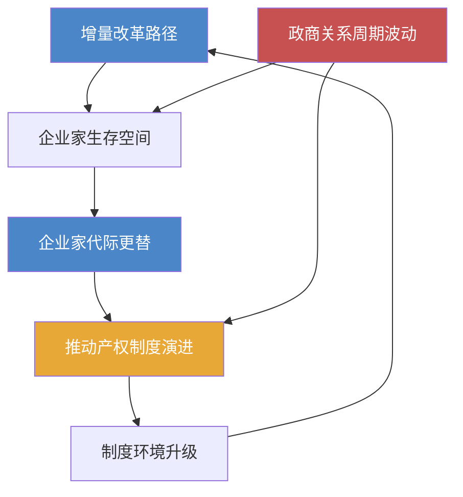

# 《激荡三十年》深度读书笔记

> [!abstract]
> 这本书是一部关于中国1978-2008年经济改革的全景式编年史。吴晓波以新闻记者的敏锐和财经作家的系统性，逐年记录了中国从计划经济走向市场经济的三十年激变。它不是一部教科书式的经济分析，而是一部以企业家群体和商业事件为主线的改革叙事——你能从中看到制度变迁如何催生一波又一波的商业浪潮，看到草根创业者如何在政策的灰色地带中野蛮生长，也能看到国有体制与民间力量之间持续数十年的博弈与共生。如果你想理解"中国经济奇迹"到底是怎么一步步走出来的，这本书提供了最鲜活、最有温度的入口。

## 这本书要解决什么经济问题

1978年之后的中国，面临着一个史无前例的经济命题：一个拥有十亿人口的农业大国，如何在没有现成路线图的情况下，从计划经济转轨到市场经济？这个问题在当时没有标准答案。苏联模式的"休克疗法"是一种路径，东欧各国的激进私有化是另一种路径，但中国最终走出了一条完全不同的道路——==摸着石头过河==。

吴晓波写这本书，核心动机不是为这场改革做理论总结，而是要回答一个更朴素的问题：这三十年到底发生了什么？谁在推动变革？变革中的赢家和输家分别是谁？那些今天看来理所当然的市场规则，当年是在怎样的混乱和争议中被建立起来的？

> [!note]
> 这本书的立场明确而坦率：它站在民营经济和企业家精神一边。吴晓波认为，中国三十年经济奇迹的真正主角不是任何宏大的顶层设计，而是千千万万在制度缝隙中寻找机会的普通人——温州的小商贩、珠三角的乡镇企业主、中关村的技术倒爷、以及后来的互联网创业者。

在经济学谱系中，这本书不属于任何学院派理论框架。它更像一部经济新闻史或商业社会学作品。如果非要定位，它的叙事逻辑最接近制度经济学的视角——关注产权变迁、政府与市场的边界移动、以及制度演化中"路径依赖"的力量。

## 核心模型地图

吴晓波没有在书中提出正式的经济模型，但通读全书，你会发现有几条隐含的分析线索贯穿始终，构成了他理解中国经济转型的基本框架。

> [!tip] 线索一：增量改革路径
> 中国的改革不是先破后立，而是在保留原有计划经济体制的同时，在体制外培育市场力量。农村的联产承包责任制没有废除集体所有制，而是在其基础上激活了农民的个体积极性；乡镇企业没有动摇国有企业的地位，而是在国有体系覆盖不到的地方生长出来。这种==不动存量、做大增量==的策略，是理解中国改革为什么没有引发社会崩溃的关键。

> [!tip] 线索二：政商关系的周期性波动
> 吴晓波敏锐地捕捉到，中国的民营经济每隔几年就会经历一次"收与放"的循环。经济过热时收紧、经济冷淡时放开；民营力量壮大到让体制感到不安时收紧，经济增长乏力需要民间活力时放开。这种波动不是偶然的政策摇摆，而是反映了改革过程中==效率与控制之间根深蒂固的张力==。

> [!tip] 线索三：企业家群体的代际更替
> 书中呈现了至少三代企业家的崛起与沉浮：1980年代的草根创业者（步鑫生、年广久、鲁冠球），1990年代的制度套利者（牟其中、史玉柱、潘宁），以及2000年代的全球化竞争者（任正非、马云、李彦宏）。每一代企业家的成功模式和失败原因都不同，因为他们面对的制度环境和市场条件完全不同。

> [!tip] 线索四：产权改革的艰难推进
> 从"傻子瓜子"年广久的个体经营，到乡镇企业的集体产权模糊，到国有企业改制中的MBO争议，再到《物权法》的通过，产权问题一直是中国经济改革的核心矛盾之一。每一步产权制度的进步，背后都伴随着激烈的意识形态争论和复杂的利益博弈。

这四条线索相互交织：增量改革创造了企业家生存的空间，企业家的壮大推动了产权制度的演进，而政商关系的周期性波动则不断重塑着游戏规则。

## 逐层深入

### 1978-1984：破冰年代——从"实践是检验真理的唯一标准"到万元户

这本书的叙事从1978年开始，但真正的起点是一种弥漫全社会的饥饿感——不只是物质上的匮乏，更是一种对改变现状的渴望。安徽凤阳小岗村的十八户农民在那份"生死契约"上按下手印的时候，他们并不知道自己正在参与一场改变十亿人命运的实验。联产承包责任制的核心逻辑极其简单：==让种地的人能够保留自己的劳动成果==。就这一个改变，在短短几年内让中国的粮食产量暴增，数亿农民的生活水平迅速提升。

但农村改革的成功立即引发了一个新问题：农业生产率提高后，大量剩余劳动力从哪里去？答案是乡镇企业。吴晓波用大量篇幅描述了这一"意料之外"的经济现象——在温州、在苏南、在珠三角，农民们自发办起了小工厂、小作坊，生产从纽扣到电器的各种商品。这些乡镇企业的产权归属模糊（名义上是"集体所有"，实际运营者往往是个人），管理粗放，产品质量参差不齐，但它们以惊人的速度填补了计划经济长期忽视的消费品市场空白。

> [!example] 步鑫生的命运
> 这个阶段最有代表性的人物是步鑫生——一个浙江海盐衬衫厂的厂长，因为在工厂里推行"奖勤罚懒"的管理改革而成为全国典型。他的改革在今天看来平淡无奇——不过是让工人的收入和产出挂钩而已——但在当时，这已经是对"吃大锅饭"体制的正面挑战。被媒体捧上天，又在政策风向转变时摔得粉碎——步鑫生的故事浓缩了那个年代改革者的典型命运。

吴晓波在描述这个阶段时反复强调一个观察：最初的改革不是自上而下设计出来的，而是自下而上"逼"出来的。农民先包了地，政策才追认联产承包；温州人先办了个体户，法律才承认私有经济；深圳蛇口的"时间就是金钱"——这些都是基层的自发行为，中央政策往往是在事实已经形成之后才追认。这种"先试验后推广"的模式，成为中国改革最显著的特征之一。

### 1984-1992：野蛮生长——双轨制、倒爷、与第一批企业家的命运

1984年是一个分水岭。这一年，中共十二届三中全会将改革的重心从农村转向城市，"商品经济"这个概念第一次获得了官方认可。与此同时，==价格双轨制==——计划内价格和市场价格并存——创造了中国改革史上最独特也最具争议的制度环境。

价格双轨制的经济逻辑你需要理解：同一件商品，在计划体系内是一个低价格，在市场上是另一个高价格。两个价格之间的巨大差额，催生了一个庞大的"倒爷"群体——他们通过各种关系拿到计划内的低价物资，然后在市场上高价卖出。牟其中就是这个时代最极端的代表，他用罐头换飞机的传奇故事，本质上就是利用两种体制之间的价差进行套利。

> [!warning] 制度风险
> 这个时期的企业家面临一个根本性的困境：做生意赚了钱，但法律和意识形态都不保护你的财产。"投机倒把罪"仍然存在，"姓社姓资"的争论随时可能卷土重来。年广久——卖瓜子的"中国第一商贩"——被邓小平三次点名保护，但即便如此，他仍然数次入狱。

1988年的"物价闯关"失败是这一时期的转折点。政府试图一步到位放开价格管制，结果引发了严重的通货膨胀和抢购风潮。这次失败的后果是深远的：它不仅导致了宏观经济的紧缩，更引发了对改革方向的根本性质疑。1989年到1991年，整个中国经济改革几乎陷入停滞，许多在1980年代风光无限的企业家纷纷落马或隐退。

### 1992-1997：大转折——南方讲话、下海潮、与资本市场的诞生

1992年邓小平的南方讲话是全书最重要的转折点之一。吴晓波描述了这次讲话如何在几周之内改变了整个国家的精神气候。=="发展才是硬道理""不争论"==——这些简洁有力的表态，为此前犹豫不决的改革重新注入了动力。

南方讲话之后，中国出现了一波前所未有的"下海潮"。与1980年代的草根创业不同，这一波创业者中有大量来自政府机关和学术机构的精英。陈东升、田源、冯仑、潘石屹——后来被称为"92派"的这批企业家，他们的知识结构、社会资源和视野格局，与前一代创业者有根本的区别。他们更善于利用制度变革中的机会，也更有意识地构建现代企业治理结构。

这个阶段的另一个关键事件是资本市场的建立。上海和深圳两个证券交易所的开设，从根本上改变了中国的资源配置方式。吴晓波花了大量篇幅描述早期股市的混乱——"认购证"风波、深圳810事件、以及由此衍生的各种投机狂潮。这些故事今天读来令人哑然失笑，但它们揭示了一个深刻的事实：==市场制度不是一建立就能正常运转的，它需要漫长的试错和规则完善==。

与此同时，国有企业的困境日益严峻。到1990年代中期，大量国企陷入严重亏损，"三角债"问题几乎让整个工业体系瘫痪。朱镕基主导的国企改革——"抓大放小"——意味着数以万计的中小国企被改制、兼并或破产，数千万工人下岗。这是中国改革三十年中社会代价最惨重的一页。吴晓波没有回避这些痛苦，他记录了东北老工业基地的衰败、下岗工人的困境，以及改制过程中触目惊心的国有资产流失现象。

### 1997-2003：分水岭——亚洲金融危机、入世、与互联网的崛起

> [!note] 1997年的悖论
> 中国之所以能在亚洲金融危机中幸免于难，一个重要原因恰恰是资本账户尚未完全开放——那些在其他领域被视为"改革不到位"的管制措施，在这个特殊时刻反而成了防火墙。制度的"不完善"有时候恰恰提供了安全缓冲。

但金融危机也暴露了中国经济的深层问题：过度依赖出口和投资拉动的增长模式、金融体系的脆弱性、以及内需不足。为了应对危机带来的增长下滑，中国政府启动了大规模的基础设施建设——高速公路、城市化、房地产开发——这些举措在当时挽救了经济增速，但也埋下了后来产能过剩和地方债务的种子。

2001年中国加入WTO，是三十年改革中影响最深远的事件之一。入世谈判的艰难过程本身就是一部精彩的政治经济学案例。吴晓波详细记录了国内各利益群体围绕入世展开的激烈争论——汽车行业担心被外资碾压，农业部门忧虑进口冲击，而出口导向的沿海企业则欢欣鼓舞。最终的结果证明，==入世的获益远超代价==：中国制造业在全球化浪潮中爆发式增长，"世界工厂"的地位由此确立。

几乎在同一时期，互联网在中国悄然兴起。1999年到2000年的".com"热潮中，马云创办阿里巴巴，李彦宏回国创建百度，马化腾的腾讯还在为生存苦苦挣扎。吴晓波敏锐地意识到，互联网企业代表了一种全新的商业物种——它们的成长逻辑、融资模式和竞争规则，与传统的制造业企业完全不同。这些企业的崛起，标志着中国经济开始从"制造驱动"向"创新驱动"的缓慢转型。

### 2003-2008：狂飙与隐忧——国进民退、房地产、与全球化的顶峰

2003年之后的中国经济进入了增速最快的五年。GDP增长率连年超过10%，外汇储备突破万亿美元大关，中国取代日本成为世界第二大经济体指日可待。但吴晓波在记录这段繁荣的同时，也用大量篇幅揭示了繁荣表面之下的结构性问题。

> [!warning] "国进民退"趋势
> 吴晓波用了一个标志性的案例——2004年围绕郎咸平质疑国企改革的大讨论——来呈现这个时期意识形态的微妙转向。当国有企业在石油、电信、金融等领域的垄断地位日益强化的时候，民营企业发现自己在获取资源、进入市场方面面临越来越多的隐形壁垒。铁本事件中，一个民营钢铁企业的投资项目因为"未经审批"被强行叫停，这个案例被吴晓波视为政商关系恶化的标志性事件。

房地产是这一时期另一个核心议题。吴晓波追溯了中国房地产市场从1998年住房商品化改革到2007年价格飙升的全过程。他指出，==土地财政==——地方政府通过卖地获取财政收入的模式——是推高房价的根本制度性原因。这不是简单的"开发商贪婪"或"投机者炒作"能解释的，它涉及中央与地方的财政关系、城市化进程中的土地制度、以及银行体系对房地产的过度依赖。

这个时期的另一条暗线是贫富差距的急剧扩大。吴晓波虽然立场上同情企业家群体，但他也诚实地记录了这样一个事实：经济高速增长的红利并没有均匀分配。东部沿海与中西部内陆的差距、城市与农村的差距、资本所有者与普通劳动者的差距——这些结构性不平等成为社会稳定的潜在威胁。

全书的结尾停在2008年，这一年北京奥运会的辉煌与全球金融危机的阴影形成了强烈的对比。吴晓波以一种开放的姿态结束叙述，没有给出确定的判断，但他的忧虑是明显的：经过三十年的高速增长之后，中国经济正站在一个新的十字路口，旧的增长模式已经接近极限，而新的路径尚不清晰。

### 贯穿全书的隐含逻辑：制度变迁与企业家精神的共演

如果退后一步审视全书的叙事结构，你会发现吴晓波虽然是按年份编排内容的，但他真正想讲述的是一个关于制度与人的互动故事。制度创造了空间，人在空间中创新；人的创新反过来推动制度演变——这种"共演"关系贯穿了整个三十年。

书中反复出现的一个模式是：底层的自发创新总是走在制度认可前面。农民先包了地，政策才追认联产承包；温州人先办了个体户，法律才承认私有经济；股份制企业先运作起来了，《公司法》才姗姗来迟。这种==事实先于法律==的改革路径，既是中国模式的特色，也是其风险所在——因为在法律追认之前，所有创新都处于法律的灰色地带，创新者随时可能被"依法追究"。

另一个贯穿全书的主题是"政策不确定性"对经济行为的深刻影响。由于改革方向时常摇摆，企业家们形成了一种独特的行为模式：短期思维、快速变现、过度依赖政治关系。吴晓波并不简单地批评这种行为，而是试图解释其制度根源——当你不知道明天的规则是否还和今天一样，"赚快钱"就是一种理性的应对策略。

## 预测与现实

吴晓波在书的结尾对中国经济的未来表达了几重隐忧，从今天的视角回看，这些判断的准确度各有不同。

**关于"国进民退"的担忧，被部分验证了。** 2008年之后，四万亿刺激计划的主要受益者是国有企业和地方政府融资平台，民营企业在融资和市场准入方面的困境进一步加剧。直到2010年代中期，民营经济的生存环境才出现了新一轮政策讨论。

**关于房地产泡沫的警惕，高度准确。** 2008年之后的十年间，中国房价经历了多轮暴涨，土地财政的依赖程度不降反升，直到2020年代初"三道红线"政策出台，房地产行业才经历了一次深度调整。吴晓波在2008年时的担忧，事后看来不仅准确，甚至还偏保守了。

**关于增长模式转型的判断，方向正确但低估了难度。** 书中隐含的期待是，中国经济会较快从投资驱动转向消费和创新驱动。现实是，这个转型过程远比预想的漫长和痛苦。十余年后，产能过剩、地方债务、消费不足等问题仍然是政策讨论的核心议题。

**关于互联网经济的前瞻性，略显不足。** 受成书时间所限，吴晓波虽然记录了阿里巴巴、百度等企业的早期故事，但并未充分预见到移动互联网和平台经济将在随后十年内彻底重塑中国的商业格局和社会生活。这当然不是批评——2008年的时候，iPhone才刚刚发布一年，没有人能预见到移动互联网的爆发力。

**关于贫富差距的担忧，持续成立。** 收入不平等在此后十几年间持续扩大，成为社会政策的核心议题之一。"共同富裕"这一概念在2020年代重新进入政策话语，某种程度上印证了吴晓波当年的忧虑。

## 不同学派怎么说

《激荡三十年》出版后获得了广泛的读者认可，但也面临来自不同方向的批评。

**来自左翼的批评**认为，吴晓波过度美化了企业家群体和市场力量，而对改革中的社会代价——下岗工人的困境、农民工的权益被侵害、环境的破坏——着墨不足。在他们看来，这本书讲述的是"赢家的故事"，而三十年改革中大量"输家"的声音被系统性地忽略了。

**来自新自由主义一翼的批评**则认为，吴晓波对政府在经济中的角色过于宽容。在张维迎等更坚定的市场派学者看来，中国经济的成功主要归因于市场化改革释放的力量，而政府干预——无论以什么名义——大多数时候是阻碍而非促进了经济效率。他们认为吴晓波的"政商互动"叙事框架模糊了一个更清晰的结论：更多的市场化和更少的政府干预，才是正确的方向。

**学院派经济学家**对这本书的批评主要集中在方法论层面。它缺乏严格的数据分析和理论框架，更像是新闻报道的汇编而非学术著作。一些经济史学者指出，吴晓波的叙事过于依赖个案和轶事，对宏观经济数据的使用不够系统，有时会因为故事性的需要而简化复杂的因果关系。

> [!note] 制度经济学视角的正面评价
> 像周其仁这样关注产权和制度变迁的学者，认为吴晓波虽然没有使用学术语言，但他的叙事直觉捕捉到了中国改革最核心的线索：产权的渐进演化和制度的试错学习。

公允地说，这些批评都有其道理，但也都忽略了这本书的根本定位——它不是一部学术著作，而是一部面向大众的经济叙事。在"让普通读者理解三十年改革"这个目标上，它的成就是显著的。

## 对你意味着什么

如果你是一个关心中国经济的普通读者，这本书的价值首先在于帮你建立一个==历史感==。太多关于中国经济的讨论是脱离历史的——人们讨论房价、讨论股市、讨论创业，却不知道这些议题的制度根源在哪里。读完这本书，你会理解今天中国经济中很多看似不合理的现象，其实都有深厚的历史逻辑。

比如，当你困惑于为什么中国的民营企业总是在"做大"和"安全"之间纠结时，这本书会告诉你，这种焦虑不是无中生有，而是几十年政商关系反复波动留下的集体记忆。当你试图理解为什么中国的经济政策总是在"放"和"收"之间摇摆时，这本书会帮你看到这种摇摆背后的结构性张力。

对于投资者来说，这本书的一个核心启示是：在中国做经济决策，永远不能忽视制度环境的变量。市场供需只是故事的一半，另一半是政策方向和制度框架。这不是"中国特色"的缺陷，而是一个仍在转型中的经济体的现实特征。理解这一点，比任何技术分析都重要。

对于创业者来说，书中无数企业家的沉浮故事提供了一个清醒的提醒：在一个制度仍在演变的环境中，商业成功不仅取决于你的产品和市场判断，还取决于你对制度风险的敏感度和应对能力。那些只看到机会而忽视制度风险的企业家，往往是最先倒下的。

## 延伸阅读

如果《激荡三十年》激发了你对中国经济改革的兴趣，有几本书值得接着读。吴晓波自己的[[《跌荡一百年》]]和[[《浩荡两千年》]]将视野延伸到了更长的历史时段，帮助你理解中国商业文明的深层传统。周其仁的[[《改革的逻辑》]]从制度经济学的角度对改革进行了更理论化的分析，可以弥补《激荡三十年》在理论深度上的不足。如果你想了解"中国模式"在国际比较中的位置，林毅夫的[[《解读中国经济》]]提供了一个更宏观的分析框架，而黄亚生的[[《中国特色的资本主义》]]则提供了一个更具批判性的视角。这几本书相互对照阅读，能帮你建立对中国经济转型更立体、更平衡的理解。
