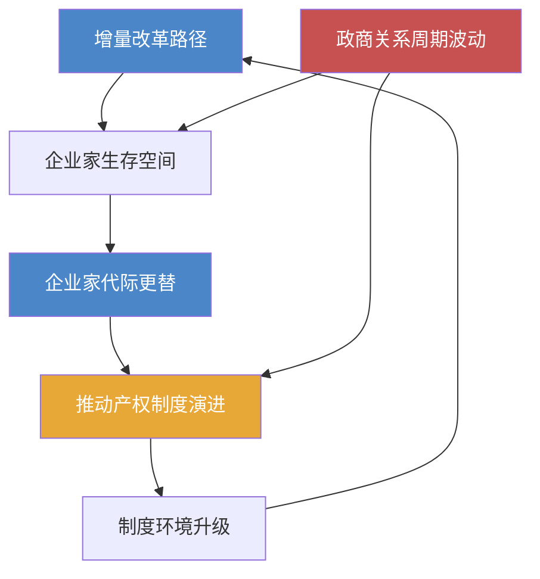

# 《激荡三十年》深度读书笔记

> [!abstract]
> 这本书是中国1978-2008年经济转轨的全景式编年史。吴晓波用财经记者的敏锐和叙事者的耐心，逐年追踪了一个拥有十亿人口的计划经济体如何在没有路线图的情况下，走出一条独特的市场化道路。它不是一部学院派的经济学著作，而是一部以企业家命运和商业事件为血肉、以==制度变迁==为骨架的改革叙事。你能从中看到价格双轨制如何制造了第一代"套利者"，看到产权模糊如何既催生了乡镇企业的繁荣也埋下了日后改制纠纷的种子，看到分税制改革如何在二十年后演变为"土地财政"和房价飙升的制度根源。如果你想理解中国经济诸多现象的来龙去脉——为什么民营企业总在"做大"与"安全"之间焦虑，为什么地方政府如此依赖卖地收入，为什么政策总在"放"与"收"之间摇摆——这本书提供了最鲜活也最系统的入口。

## 这本书要解决什么经济问题

1978年之后的中国面临着一个经济学教科书里找不到答案的命题：一个农业人口占80%以上、人均GDP不足200美元的计划经济大国，如何在不引发社会崩溃的前提下完成市场化转型？苏联选择了"休克疗法"——在短短几年内全面放开价格、大规模私有化、取消贸易管制，结果是GDP在1990年代暴跌近40%，通胀一度超过2000%。东欧各国也走了不同程度的激进路径，代价同样惨痛。中国最终走出的是一条完全不同的道路——==渐进式改革==，或者用那个著名的比喻：摸着石头过河。

吴晓波写这本书的核心动机，不是为这场转轨提供理论框架，而是要回答一系列更朴素的问题：这三十年到底发生了什么？谁在推动变革？变革中的赢家和输家分别是谁？那些今天看来理所当然的市场规则，当年是在怎样的混乱、争议和博弈中被建立起来的？

> [!note]
> 这本书的立场是明确的：它站在民营经济和企业家精神一边。吴晓波认为，中国三十年经济增长的真正微观动力不是任何宏大的顶层设计，而是千千万万在制度缝隙中寻找机会的个体——温州的小商贩、珠三角的乡镇企业主、中关村的技术创业者、以及后来的互联网企业家。

在经济学谱系中，这本书不属于任何学院派理论传统。如果非要定位，它最接近==制度经济学==的叙事逻辑——关注产权界定的演化、交易成本的变迁、政府与市场边界的移动。但与科斯或诺斯的学术著作不同，吴晓波不做抽象建模，他让故事本身说话。当你读完足够多的企业家命运和制度变迁案例之后，关于中国经济改革的深层规律会自己浮现出来。

这种"以叙事代替论证"的写法既是优点也是局限。优点是让经济改革的复杂历程变得可触可感；局限是它无法为你提供一个精确的分析框架来预测未来。但对大多数读者来说，建立对中国经济制度演化的历史感，本身就是一项极有价值的认知投资。

## 核心模型地图

吴晓波没有在书中提出正式的经济模型，但通读全书，你会发现有四条隐含的分析线索贯穿始终，构成了理解中国经济转型的基本框架。

> [!tip] 线索一：增量改革的路径逻辑
> 中国改革最核心的策略是：==不动存量，做大增量==。保留计划经济体制作为"存量"，同时在体制覆盖不到的空间培育市场力量作为"增量"。联产承包没有废除集体所有制，只是把经营权分到了农户；乡镇企业没有动摇国有企业的地位，只是在国有体系之外另开一片天地；经济特区没有在全国推行市场化，只是在沿海划出几块试验田。这种策略的经济逻辑在于：它大幅降低了改革的政治阻力和社会风险——因为没有人的既有利益在第一时间被剥夺——同时又让市场力量有了生长的空间。市场像水一样从体制的缝隙中渗入，慢慢扩大地盘。

> [!tip] 线索二：政商关系的周期性波动
> 民营经济每隔几年就经历一次"收"与"放"的循环。1984年放开、1986年收紧、1992年再度放开、1993-1994年宏观调控收紧、1997年后谨慎放开、2003年后再度收紧。这种波动反映了改革过程中==效率与控制之间根深蒂固的张力==：经济增长需要市场活力，但市场力量壮大到一定程度又会让政府感到不安。每一个"放"的周期催生一批新企业家，每一个"收"的周期让一批人出局。理解这个周期，比理解任何单一政策都重要。

> [!tip] 线索三：企业家群体的代际更替
> 书中至少呈现了三代企业家：1980年代的草根创业者（步鑫生、年广久、鲁冠球），靠胆量在制度缝隙中求生；1990年代的制度套利者和体制精英下海者（牟其中、陈东升、冯仑），善于捕捉体制转型中的结构性机会；2000年代的全球化竞争者（任正非、马云、李彦宏），在国际市场中证明自己。每一代企业家的成功逻辑和失败原因完全不同，因为他们面对的制度约束和市场条件发生了根本变化。

> [!tip] 线索四：产权改革的艰难推进
> 从年广久的个体经营到乡镇企业的集体产权模糊，从国企改制中的MBO争议到《物权法》的通过，==产权界定==一直是中国经济改革的核心矛盾。经济学的基本原理告诉你：没有清晰的产权，就没有真正的市场交易。中国产权制度的每一步进展，背后都伴随着激烈的意识形态争论和复杂的利益博弈。这个过程充满了进两步退一步的反复，但大方向始终是产权从模糊走向清晰。

这四条线索相互交织：增量改革创造了企业家的生存空间，企业家的壮大推动了产权制度的演进，而政商关系的周期性波动则不断重塑着游戏规则。理解它们之间的关系，你就握住了这本书的核心钥匙。

## 逐层深入

### 1978-1984：激励机制的第一次修复——从公社到承包，从匮乏到乡镇企业

这本书的叙事从1978年开始，但真正的起点是一个经济学意义上的效率崩塌。人民公社体制下，农民干多干少收入差别极小，劳动的边际收益趋近于零。经济学不需要复杂的模型就能预测这种激励结构的后果：普遍的消极怠工和极低的生产率。当时的中国农村人均口粮不足300斤，数亿人处于温饱线以下。

安徽凤阳小岗村十八户农民签下的那份"生死契约"，本质上做了一件事：==把劳动的剩余索取权还给了劳动者本人==。交够国家和集体的，剩下的归自己。这就是联产承包责任制的经济核心。就这一个激励机制的调整，在短短几年内引发了生产力的爆发——1984年粮食总产量突破四亿吨，农民收入增长了近两倍。这是教科书级别的案例：当产权（哪怕只是使用权和收益权）被更清晰地界定给个体时，效率就会大幅提升。

> [!note] 温州模式 vs 苏南模式：两种产权安排的对照实验
> 温州以家庭作坊和个体经济为主，产权清晰度更高，市场意识更强，但规模偏小，长期被视为"资本主义的尾巴"。苏南以集体所有的乡镇企业为主，规模更大，与地方政府关系更紧密，在意识形态上更"安全"，但产权模糊的问题为日后的改制纠纷埋下了伏笔。经济学意义上，这是一场关于"产权清晰度"与"政治安全性"之间如何权衡的天然对照实验。

农村改革的成功立即产生了一个经济学上可预见的连锁反应：农业生产率提高 → 剩余劳动力释放 → 劳动力需要新的就业出口。答案是乡镇企业。在温州、苏南、珠三角，农民自发办起小工厂和小作坊。这些企业产权模糊（名义上"集体所有"，实际运营者往往是个人），管理粗放，但它们以惊人的速度填补了计划经济长期忽视的消费品市场空白。到1980年代中期，乡镇企业已成为中国经济增长最活跃的力量，这是顶层设计完全没有预见到的。

> [!example] 步鑫生与鲁冠球：两种企业家的命运分叉
> 步鑫生在浙江海盐衬衫厂推行"奖勤罚懒"——本质上就是把激励机制从平均主义调向绩效导向。他被媒体捧为改革典型，又在政策风向转变时摔碎。鲁冠球从打铁铺起家，做成万向集团，区别在于他极其善于管理与政府的关系，在每次风向转变时都能找到安全位置。这组对比揭示了一个现实：在产权保护不完善的环境中，企业家的存活不仅取决于经营效率，更取决于==政治生存智慧==。

吴晓波在这个阶段反复强调一个重要观察：最初的改革不是自上而下设计出来的，而是自下而上"逼"出来的。农民先分了地，政策才追认联产承包；温州人先办了个体户，法律才承认私营经济。这种=="事实先于法律"==的演进路径，成为中国改革最显著的制度特征。

### 1984-1992：价格双轨制——一场关于"套利"与"寻租"的大规模社会实验

1984年是分水岭。十二届三中全会把改革重心从农村转向城市，"商品经济"获得官方认可。与此同时，==价格双轨制==——计划内价格和市场价格并存——创造了中国改革史上最独特也最具争议的制度安排。

你需要理解双轨制的经济逻辑：同一件商品在计划体系内是低价，在市场上是高价。钢材的计划价可能是700元一吨，市场价高达1800元一吨。两个价格之间的巨大价差，本质上是一种==制度租金==——它不是由生产效率产生的，而是由两种制度的价格扭曲产生的。谁能获取计划内的低价物资并在市场上高价卖出，谁就能获得巨额利润。"倒爷"群体应运而生。

> [!example] 牟其中的极端案例
> 牟其中用四川的罐头和日用品换回苏联的图-154客机，再卖给国内航空公司。这笔交易是双轨制套利逻辑的极致展现：在信息和资源流通不畅的年代，打通不同体系之间的通道本身就创造了巨大利润。牟其中后来因信用证诈骗入狱，但他的故事折射出那个年代商业环境的本质——规则模糊，机会和风险同样巨大。

从经济学视角看，双轨制是一种"次优"但务实的制度安排。它避免了全面放开价格可能引发的社会动荡（1988年"物价闯关"的失败证明了这种风险是真实的），同时为市场价格机制的生长创造了空间。但它的副作用也很明显：巨大的制度租金诱导经济主体把精力放在"寻租"而非"创造价值"上，腐败问题在这个时期急剧恶化。

经济特区的建立是增量改革在空间维度上的体现。深圳从小渔村到现代都市的变迁，核心意义不在于GDP数字，而在于它充当了==制度试验的缓冲区==。内地不敢做的市场化改革先在特区试，成功了再推广，失败了也不影响全局。这种"试点推广"的方法论将改革的风险分散化了。

> [!warning] 1988年物价闯关的失败
> 政府试图一步到位放开价格管制，结果引发严重通胀和抢购风潮。银行出现挤兑，社会秩序受到冲击。这次失败的经济学教训是深刻的：在市场基础设施（竞争性供给、信息透明度、消费者预期稳定性）不具备的情况下，激进的价格自由化很可能事与愿违。它导致了此后三年的改革停滞和紧缩。

1989-1991年的"改革停顿期"经常被低估。吴晓波用不少篇幅描述了这段时间民间经济的萧条和企业家群体的惶恐。它证明了一个对理解中国经济至关重要的规律：==改革不是线性推进的，而是一条充满回调的曲线==，每一次前进之后都可能有一段倒退，而倒退的幅度和持续时间取决于经济数据、社会情绪和高层博弈的复杂互动。

### 1992-1997：南方讲话后的制度跃迁——资本市场、分税制与国企改革

1992年邓小平南方讲话是全书的枢纽事件。=="发展才是硬道理""不争论"==——这些表态在几周内改变了整个国家的预期。经济学强调预期的力量，南方讲话正是一个典型案例：当最高决策者明确传达了改革继续推进的信号后，被压抑了三年的企业家精神迅速释放。

"下海潮"涌现。与1980年代的草根创业不同，=="92派"==企业家——陈东升、田源、冯仑、潘石屹——大多来自政府机关和学术机构。他们的知识结构和社会资源与前一代完全不同，更善于利用制度变革中的结构性机会，也更有意识地构建现代公司治理。这批人的出现，标志着中国企业家群体的一次质的跃迁。

**资本市场的诞生**是这个阶段最重要的制度创新之一。上海和深圳证券交易所在1990年底和1991年初先后开设。吴晓波详细记录了早期股市的混乱：1992年深圳"810事件"中上百万人排队抢购认购证，场面几近失控。这些故事揭示了一个基本事实：==市场制度不是建立起来就能正常运转的，它需要漫长的试错和规则完善==。监管框架、信息披露、投资者保护——这些制度基础设施的建设用了此后二十多年，至今仍在完善中。

> [!warning] 1994年分税制改革：土地财政的制度源头
> 这项改革将增值税设定为中央拿75%、地方拿25%，中央财力迅速恢复，但地方政府的收支缺口骤然增大。出让国有土地使用权成了地方政府弥补缺口的主要手段。从1994年分税制到后来的房价飙升，中间存在一条清晰的==制度因果链条==：分税制 → 地方财政压力 → 依赖土地出让收入 → 推高地价 → 房价上涨。这不是任何个人或群体的恶意，而是制度设计的副产品。

1993-1994年的宏观调控是南方讲话后的第一次"收"。经济在1992年的刺激下急剧升温，海南房地产泡沫尤为严重。朱镕基果断收紧信贷，实施严厉调控。这次调控以"软着陆"告终，在宏观经济管理史上被视为相对成功的案例，但对微观层面的企业家冲击巨大——海南房地产商几乎全军覆没，潘石屹是从泡沫中逃出来的幸存者之一。

国有企业的困境在这个时期达到顶峰。到1996年，全国国企亏损面接近40%，"三角债"几乎让工业体系瘫痪。朱镕基主导的"抓大放小"改革，意味着数万家中小国企被改制、兼并或破产，==数千万工人下岗==。这是三十年改革中社会代价最惨重的一页。吴晓波没有回避这些痛苦——东北老工业基地的衰败、下岗工人的困境、改制过程中的国有资产流失，都被如实记录。从经济效率的角度看，淘汰严重亏损的国企是必要的资源重新配置；但从社会公平的角度看，承受代价最重的是最没有议价能力的普通工人。这种效率与公平的张力，至今仍是中国经济政策讨论中最敏感的议题之一。

### 1997-2003：外部冲击与制度韧性——金融危机、WTO与新经济

1997年亚洲金融危机是中国经济的第一次外部压力测试。

> [!note] 1997年的悖论：制度"缺陷"变成安全缓冲
> 中国之所以能在金融风暴中幸免，一个重要原因恰恰是资本账户尚未完全开放——那些被视为"改革不到位"的管制措施，在危机时刻成了防火墙。国际热钱无法大规模进出中国市场，金融体系因此免于被投机资本冲垮。这个悖论值得深思：在一个制度仍在建设中的转轨经济体里，某些看似"落后"的管制有时恰恰提供了安全边际。

但金融危机暴露了中国经济的结构性问题：过度依赖出口和投资、金融体系脆弱、内需不足。为应对增长下滑，政府启动大规模基础设施建设，城市化加速推进。

1998年住房制度改革是一个关键节点：停止住房实物分配，推行货币化分配。这创造了一个巨大的新市场。1998年住房改革加上1994年分税制造成的地方财政对土地出让收入的依赖，共同构成了此后二十多年中国房地产市场的制度基础。

2001年中国加入WTO，是三十年间影响最深远的单一事件之一。入世谈判历时十五年，国内争论激烈：汽车行业担心被碾压，农业担心受冲击，沿海出口企业则欢欣鼓舞。

> [!tip] 入世的经济账
> 从2001年到2008年，中国出口总额增长了近五倍，"世界工厂"地位确立。但入世也加剧了经济的结构性失衡——==对外需依赖过高，产业处于全球价值链低端==。很多企业赚的是最微薄的加工费，品牌溢价和渠道利润留在了外资手里。"中国制造"的数量奇迹背后，是利润分配的不对称。

互联网经济几乎同步兴起。1999-2000年的".com"热潮中，马云创办阿里巴巴，李彦宏创建百度，马化腾的腾讯找不到盈利模式一度想把公司卖掉。这些企业几乎全部接受境外风投、注册VIE结构在海外上市——这本身说明==国内的资本市场和法律框架还没有为新型企业做好制度准备==。2000年互联网泡沫破裂后活下来的企业，靠的是找到了适合中国市场的商业模式，而非照搬美国路径。

### 2003-2008：繁荣的顶峰与结构性隐忧

2003年之后的五年是增速最快的时期：GDP增长率连年超过10%，外汇储备突破万亿美元。但吴晓波在记录繁荣的同时，大量揭示了表面之下的结构性问题。

> [!warning] "国进民退"的加剧
> 2004年郎咸平公开质疑国企改制中的资产流失，引发全民讨论。结果是改制步伐放缓，一些原本计划市场化的领域重新收紧。民企面临越来越多的"玻璃门"和"弹簧门"。铁本事件中，一家民营钢铁企业因"未经审批"被强行叫停，企业主被捕——而同样的"违规"在国企那里往往被默许。双重标准的存在，说明==市场准入的公平性==仍是一个未解决的制度难题。

房地产的自我强化循环在这个时期全面展开。逻辑链条是：地方政府垄断土地供给，有强烈动机推高地价；开发商贷款买地建房，购房者贷款买房；整个链条依赖于==房价持续上涨==的预期。一旦这个预期被打破，链条就会断裂。但在2008年之前，没有人有足够的动力去打破这个循环。

贫富差距在这个时期急剧扩大。东部沿海与中西部、城市与农村、资本所有者与普通劳动者之间的差距都在拉大。基尼系数持续攀升，"蚁族""房奴""蜗居"这些词汇的流行是社会情绪的晴雨表。

全书结尾停在2008年：北京奥运会的辉煌与全球金融危机的阴影形成强烈对比。吴晓波以开放姿态结束叙述——旧的增长模式接近极限，新的路径尚不清晰。

### 贯穿全书的深层逻辑：制度变迁与企业家精神的共同演化

退后一步审视全书，你会发现吴晓波虽按年份编排，但真正的叙事结构是==制度与人的互动==。制度创造空间，人在空间中创新；人的创新反过来推动制度演变。

书中反复出现的模式是：底层自发创新走在制度认可前面。农民先包了地，政策才追认；温州人先办了个体户，法律才承认私营经济；互联网企业用VIE结构在海外上市多年之后，国内法律框架才开始认真讨论这种架构的合法性。这种"事实先于法律"的路径，既是中国模式的特色，也是其风险所在——在法律追认之前，所有创新都处于灰色地带，创新者随时可能被"秋后算账"。

另一个贯穿全书的主题是=="政策不确定性"对经济行为的深刻影响==。由于改革方向时常摇摆，企业家形成了独特的行为模式：短期思维、快速变现、过度依赖政治关系。赚了钱的第一反应不是扩大再投资，而是转移资产或把家人送到海外。吴晓波不简单批评这种行为，而是追问其制度根源——当你不知道明天的规则是否还和今天一样，"赚快钱"就是理性选择。这种行为模式的代价是整个经济体创新投入不足和长期主义的缺失，但你不能只批评企业家而不追问造成这种行为的制度原因。

## 预测与现实

吴晓波在2008年结尾处表达的几重隐忧，从今天回看准确度不一。

**关于"国进民退"的担忧被部分验证。** 2008年四万亿刺激计划的主要受益者是国企和地方融资平台，民企融资困境进一步加剧。在多个行业中，国有资本的影响力在此后十年不降反升。

**关于房地产泡沫的警惕高度准确。** 2008年之后十余年间房价多轮暴涨，土地财政依赖不降反升，直到2020年代初"三道红线"政策出台，恒大等巨头的债务危机才让泡沫开始释放。吴晓波当年的担忧甚至偏保守了。

**关于增长模式转型的判断方向正确但低估了难度。** 书中隐含的期待是经济会较快从投资驱动转向消费和创新驱动。现实是这个转型远比预想的漫长——十余年后，产能过剩、地方债务、消费不足仍是政策讨论的核心议题。

**关于互联网经济的前瞻性略显不足。** 受成书时间限制，吴晓波未能预见移动互联网和平台经济在随后十年对商业格局的彻底重塑。微信、美团、抖音、拼多多——2008年时不存在的产品，后来成为数亿人的日常基础设施。但这不是批评，2008年时iPhone刚发布一年，没有人能预见移动互联网的爆发力。

**关于贫富差距的担忧持续成立。** "共同富裕"在2020年代重新进入政策话语核心，某种程度上印证了吴晓波当年的忧虑。

## 不同学派怎么说

**来自左翼的批评**认为吴晓波过度美化了企业家群体，对改革中的社会代价——下岗工人的困境、农民工的权益被侵害、环境破坏——着墨不足。这本书讲述的是"赢家的故事"，大量"输家"的声音被系统性忽略了。

**来自市场自由主义一翼的批评**认为吴晓波对政府在经济中的角色过于宽容。张维迎等学者认为中国经济成功主要归因于市场化改革释放的力量，吴晓波的"政商互动"叙事模糊了一个更清晰的结论：更多市场化和更少政府干预才是正确方向。

**学院派经济学家**的批评集中在方法论层面：叙事过于依赖个案和轶事，对宏观数据的使用不够系统，有时因故事性需要而简化复杂因果关系。

> [!note] 制度经济学的正面评价
> 像周其仁这样关注产权和制度变迁的学者，认为吴晓波的叙事直觉捕捉到了中国改革最核心的线索：产权的渐进演化和制度的试错学习。他对"增量改革"和"政商周期"的观察，与制度经济学中关于制度变迁的理论有内在一致性。

**来自国际比较的视角**指出，吴晓波的叙事过于"中国中心主义"。中国制造业的崛起不仅是国内改革的结果，更是冷战结束后全球产业链重组的产物。将中国改革放入全球化的大背景中，图景会更完整。

公允地说，这些批评各有道理，但也忽略了这本书的根本定位——它是面向大众的经济叙事，不是学术专著。在"让普通读者理解三十年改革"这个目标上，没有哪本中文书做得比它更好。

## 对你意味着什么

这本书的首要价值是帮你建立一个==制度演化的历史感==。太多关于中国经济的讨论是脱离历史的——人们讨论房价却不知道土地财政的制度根源在1994年分税制，讨论民企信心却不知道政商关系的周期性波动已经持续了四十年，讨论产业升级却不理解"世界工厂"模式是入世后全球化红利与低成本优势叠加的结果。

对于投资者，核心启示是：在中国做经济决策，==永远不能忽视制度环境这个变量==。市场供需只是故事的一半，另一半是政策方向和制度框架。书中一个反复出现的教训是：最大的风险往往不是市场竞争的风险，而是政策变化的风险。那些穿越多个政策周期存活下来的企业——华为、万向——都对制度环境高度敏感。

对于创业者，书中企业家的沉浮提供了清醒的提醒：商业成功不仅取决于产品和市场判断，还取决于对制度风险的敏感度。同时也有乐观信号：尽管制度环境充满不确定性，但三十年间市场化的大方向从未逆转。每一次"收"的周期之后，都跟着一个更大的"放"。对有耐心的长期主义者来说，这个趋势本身就是最大的机会。

## 延伸阅读

吴晓波自己的[[《跌荡一百年》]]和[[《浩荡两千年》]]将视野延伸到更长的历史时段——你会发现政商关系的紧张、"国进民退"的周期、对商人的意识形态争论，是贯穿两千年的老主题，不是1978年之后的新问题。

周其仁的[[《改革的逻辑》]]从制度经济学角度提供更理论化的分析，可弥补本书在理论深度上的不足。林毅夫的[[《解读中国经济》]]从比较优势角度解释增长，与本书叙事形成互补。黄亚生的[[《中国特色的资本主义》]]则提供批判性视角，用数据论证民营经济在1990年代末实际上受到了挤压而非扶持。兰小欢的[[《置身事内》]]从政府行为逻辑出发解读中国经济运行，是理解"土地财政""地方债务"等议题的绝佳补充。几本书对照阅读，能帮你建立对中国经济转型更立体、更平衡的理解。