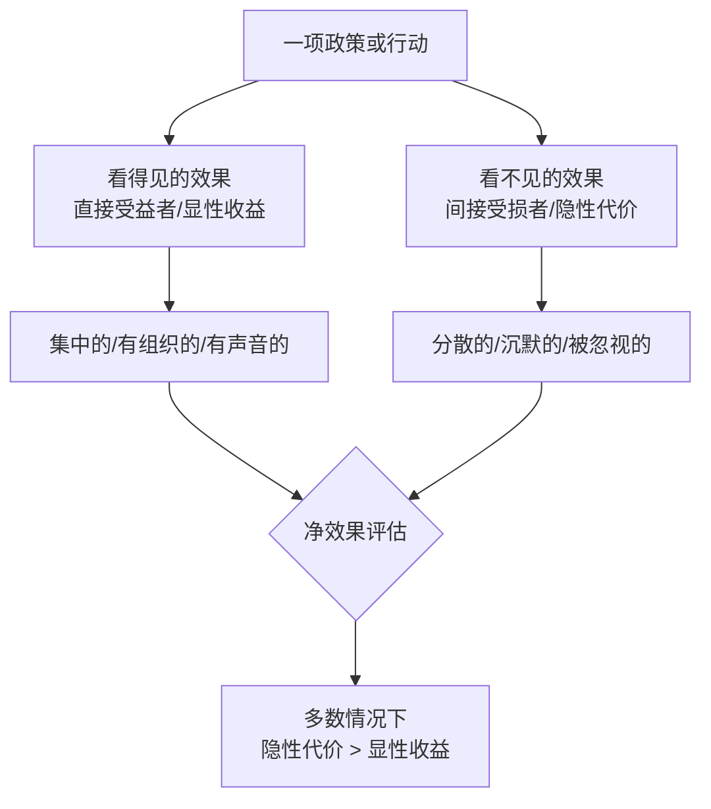

# 《看得见的与看不见的》深度读书笔记

> [!abstract] 全书速览
> 好经济学家和坏经济学家的区别只有一个：坏的只看见政策的直接效果，好的还能预见间接效果。巴斯夏用一个打破玻璃窗的故事，揭示了经济思维中最致命的盲点——人们总是被"看得见的"好处所迷惑，而忽视了"看不见的"代价。这本写于1850年的小册子，至今仍是理解机会成本、质疑政府干预、培养经济直觉最好的入门读物。

## 这本书要解决什么经济问题

弗雷德里克·巴斯夏（1801-1850）是19世纪法国政治经济学家和自由主义政治家，被誉为"经济学界的帕格尼尼"——他用最通俗的语言阐述最深刻的经济学原理。在他短暂的49年人生中，他写出了几部对后世影响深远的作品，《看得见的与看不见的》是其中最具穿透力的一部。

这本书写于1850年，正值法国大革命的余波未平，社会主义思潮和政府干预主义在法国盛行。巴斯夏面对一个令他困惑的现象：==为什么那些明显有害的经济政策能够获得广泛的民众支持？==

> [!note] 独特贡献
> 巴斯夏找到了答案：政策的受益者是集中的、可见的、有声音的；而政策的受害者是分散的、隐蔽的、沉默的。他的核心贡献就是系统化地阐述了"机会成本"的概念——每一笔资源的使用都意味着放弃了其他可能的用途，被放弃的那些用途的价值就是这笔支出的真实代价。

在经济学谱系中，巴斯夏是古典自由主义的重要代表，也是后来奥地利学派的思想先驱。他的分析框架——追问"看不见的"间接效果——已经成为现代经济学中成本-收益分析的基本逻辑。

## 核心模型地图

> [!tip] 关键洞察
> 全书只有一个核心分析模型，然后将这个模型反复应用于不同领域。==这个模型的力量不在于复杂，恰恰在于简单——它是一把万能钥匙，几乎可以打开所有经济政策谬误的锁。==

三步分析法：第一步，识别直接效果——谁直接获益？第二步，追问间接效果——谁间接受损？他们被迫放弃了什么？第三步，净效果评估——把直接收益和间接代价放在一起比较，社会整体是变好了还是变差了？

巴斯夏将这个模型应用于全书12个案例，覆盖税收、补贴、公共工程、贸易保护、技术进步、信贷政策、节俭与奢侈等广泛领域。这些案例之间不是简单并列，而是构成逐步深入的论证——从"破窗谬误"这个最简单的案例开始，到越来越复杂的政策议题，最后上升到经济哲学层面的讨论。

## 逐层深入

### 破窗谬误：一切经济谬误的原型

全书以一个简单到几乎天真的故事开篇——但这个故事的力量在于它照亮了经济思维中一个极其普遍的盲点。

一个顽童打破了面包店主的玻璃窗。围观的人群开始"安慰"店主：这也不全是坏事——至少玻璃匠有活干了。玻璃匠赚到6法郎后会去买别的东西，那个人又会花掉这笔钱，如此循环，整个经济都被"刺激"了。

> [!warning] 破窗谬误的本质
> 人们只看到了玻璃匠得到了6法郎的订单（看得见的），却完全忽视了面包店主本可以用这6法郎做的其他事情（看不见的）。如果窗户没被打破，店主可能会用这6法郎买一双新鞋。==社会的净财富不但没有增加，反而减少了——因为现在店主有了一扇窗户（和之前一样）却少了一双新鞋。==

这个道理看似浅显，应用范围之广令人吃惊。每当有人说"战争促进经济繁荣"——这是破窗谬误。每当有人说"自然灾害是经济机遇"——这也是破窗谬误。每当政府推行"挖坑填坑"式的就业工程——这还是破窗谬误。破窗谬误的本质就是忽视机会成本：每一笔支出都意味着放弃了其他可能的用途。

### 税收：财富的转移而非创造

政府每花1法郎，就意味着纳税人少花1法郎。政府用税收修了一条路——这条路是看得见的，修路的工人的就业是看得见的。但纳税人本来可以用这笔钱做的事情——买衣服、修房子、投资生意——这些是看不见的。

关键问题不是"政府的支出是否有用"，而是=="政府花这笔钱是否比纳税人自己花这笔钱更有效率"==。巴斯夏认为答案通常是否定的，原因有三：第一，政府官员花的是别人的钱，天然缺乏节省的动机。第二，政治决策往往服务于特殊利益集团而非公共利益。第三，官僚体系的层层截留会消耗大量资源。

> [!tip] 税收的三重代价
> 直接成本（纳税人交出的税款）、征收成本（税务系统本身的运营费用）、无谓损失（因税收导致的经济活动减少——比如税率太高导致人们减少工作或转入地下经济）。

### 补贴：用政治判断取代市场判断

政府补贴戏剧100万法郎，效果是：戏剧行业繁荣了，演员增加了就业——看得见的。但纳税人减少了100万法郎的其他消费，其他行业需求因此下降——看不见的。

补贴没有创造就业，只是把就业从纳税人偏好的行业转移到了政府偏好的行业。这里有一个更深层的问题：如果纳税人本来就想看戏剧，他们不需要补贴就会自己掏钱去看；如果他们更想要其他东西，补贴就是在强迫他们接受一个次优的选择。==补贴本质上是政府在说"我比你更清楚什么对你好"。==

### 贸易保护：保护看得见的就业，牺牲看不见的就业

进口关税的直接效果：被保护行业的就业保住了——看得见的。间接效果：消费者支付更高价格，其他消费减少，其他行业就业下降——看不见的。一得一失，社会净损失。

> [!example] 蜡烛制造商请愿书
> 巴斯夏为此写了一篇著名的讽刺文章——蜡烛商们联合请愿，要求政府封住所有窗户，以保护他们免受太阳光这个"不公平的外国竞争者"的打击。这篇文章把保护主义的逻辑推到了极致，让其荒谬性暴露无遗。

自由贸易的真正好处不仅仅是"消费者获得更便宜的商品"。更根本的是，自由贸易让资源流向最有效率的用途。如果法国人生产葡萄酒比英国人更有效率，英国人生产纺织品比法国人更有效率，那么两国各自专注于优势领域、通过贸易交换，双方总产出都会增加。

### 机器：技术进步不是就业的敌人

机器取代了某些工人——看得见的。但机器降低了生产成本，产品价格下降，消费者省下来的钱可以用于购买其他商品和服务，创造新的就业——看不见的。

从长期来看，技术进步从未减少总就业，只是改变了就业结构——从低生产率的工作转向高生产率的工作。农业机械化释放劳动力投入制造业和服务业，汽车产业链创造的就业远超马车产业，电脑革命催生的新行业远超被消灭的旧工作。巴斯夏不否认短期调整痛苦，但反对以此为理由阻止技术进步——那等于为了保护少数人的短期利益而牺牲整个社会的长期福祉。

### 信贷管制：政治标准vs经济标准

政府贷款给农民，农民发展了——看得见的。B没能得到贷款，他可能更有效率的计划落空了——看不见的。

> [!warning] 信贷扭曲的危险
> 政府分配信贷的标准是政治性的（谁的选票更重要），而非经济性的（谁能更有效地使用资金）。更危险的是，==政府低息贷款扭曲了风险定价，鼓励过度冒险。==当大量基于扭曲信号做出的投资决策同时失败，就可能引发系统性金融风险。2008年次贷危机完美验证了这个分析。参见 [[《逃不开的经济周期》 - 拉斯·特维德]]。

### 节俭与奢侈：储蓄不是经济的敌人

"富人大肆消费刺激经济，节俭反而导致萧条"——流行的误解。巴斯夏指出：节俭不是不消费，而是延迟消费和改变消费形式。储蓄进入银行，银行贷给企业，企业投资扩产，同样创造就业——只不过是在资本品行业而非消费品行业。

储蓄有一个奢侈消费没有的优势：==它带来资本积累。资本积累是生产率提高的前提，生产率提高是工资上涨和生活水平提升的前提。==一个完全消费不储蓄的社会，不可能有持续的经济增长。

### 就业权：逻辑的终极检验

巴斯夏在最后讨论了"政府应该保障充分就业"的主张。如果政府保障每个人都有工作，资金来源只有三种：税收（纳税人为不经济的工作买单）、强制企业雇用（企业成本上升）、限制技术进步（生产率停滞）。每一种方案都只是把问题从一个地方转移到另一个地方——看得见的就业被保住了，但看不见的就业被消灭了。

## 预测与现实

巴斯夏写于1850年的分析框架在170多年后依然保持着惊人的解释力。

破窗谬误在每次自然灾害和军事冲突后都会被重新"发明"。2011年日本大地震后，一些经济评论员预测重建将刺激日本经济——典型的破窗谬误思维。事实上，日本经济在灾后经历了显著的产出下降。

他对贸易保护主义的批判在每次贸易战中都被验证。2018年以来的中美贸易摩擦中，多项研究表明关税的成本主要由美国消费者和企业承担，而非中国出口商。

他对政府信贷干预的分析在2008年金融危机中得到了教科书式的验证——人为压低利率、鼓励向低收入群体放贷，最终酿成全球金融海啸。参见 [[《货币金融百科》 - 英国DK出版社]]。

> [!note] 需要打折扣的地方
> 巴斯夏对政府干预的批评有时过于绝对——在外部性、公共品、信息不对称等领域，市场确实会失灵，政府干预可能是必要的。他对分配公平的关注也不够——即使总效率是正的，如果收益集中于富人而成本分散于穷人，也存在公平问题。

## 不同学派怎么说

**凯恩斯主义**对巴斯夏的批评最为直接。凯恩斯认为，在经济深度衰退时（"流动性陷阱"），巴斯夏的分析不完全适用——私人支出本来就在萎缩，政府支出不会"挤出"什么，反而可以创造净增的就业。这个批评有一定道理，但凯恩斯主义者也承认，巴斯夏的框架在经济正常运行时基本正确。

**新制度经济学**（科斯、诺斯）指出，市场运行需要制度基础——产权保护、合同执行、信息披露。某些政府支出不是"破窗"式浪费，而是市场有效运行的前提条件。

**公共选择理论**（布坎南、塔洛克）可以被视为巴斯夏思想的现代延伸。他们用严格的经济学方法证实了巴斯夏的直觉：政治决策往往服务于自身利益而非公共利益。

**发展经济学**的经验对巴斯夏的自由放任主张构成了挑战。东亚经济体的发展经验表明，在特定历史阶段，政府产业政策可以加速经济发展。参见 [[《置身事内》 - 兰小欢]]。

## 对你意味着什么

巴斯夏给你的最重要的礼物是一种思维习惯——每当看到某项政策或行动带来"看得见的"好处时，立刻追问：谁是"看不见的"受害者？这笔资源如果不这样用，会怎样用？

你可以把这种思维应用到个人决策中。每一笔消费都有机会成本——买一部新手机意味着放弃了一次旅行或一笔投资。每一个小时的时间也有机会成本。重大决策时，不仅要问"这个选择有什么好处"，还要问"我放弃了什么"。

最后，留意==集中利益与分散成本的陷阱==。受益者通常是少数、集中、有组织、声音大的群体；而承担成本的通常是多数、分散、无组织、沉默的公众。作为公民，学会识别这种模式，是你对自己和社会最有价值的思维投资。

## 延伸阅读

- [[《国富论》 - 亚当·斯密]]：古典自由主义的源头，巴斯夏的"看不见的"分析可以理解为斯密"看不见的手"的另一面
- 《经济学的思维方式》（托马斯·索维尔）：把巴斯夏式的分析应用于当代经济政策争论
- 《通往奴役之路》（弗里德里希·哈耶克）：从更宏观视角论证中央计划经济为什么注定失败
- [[《逃不开的经济周期》 - 拉斯·特维德]]：理解政府信贷干预如何扭曲经济周期
