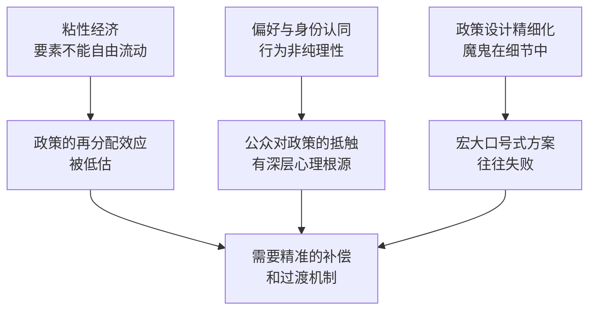

# 《穷人经济学》深度读书笔记

> [!abstract] 全书速览
> 经济学家们关于移民、贸易、不平等和技术变革的主流观点，有多少经得起证据的检验？阿比吉特·班纳吉和埃斯特·迪弗洛在获得诺贝尔经济学奖之后写下这本书，把他们在[[《贫穷的本质》]]中锤炼出的方法论——==随机对照实验和对微观证据的执着==——从发展中国家的贫困问题扩展到了困扰发达国家的核心政策争论。移民是否抢走了本地人的工作？自由贸易让谁受益、让谁受损？GDP增长能否自动惠及所有人？AI会不会让大多数人失业？对于这些在酒吧里能引发争吵、在选举中能决定胜负的问题，经济学家给出的标准答案往往过于简单，而政客们兜售的叙事更是偏离事实。这本书的野心是用证据拆解这些简单叙事，告诉你真实的经济世界远比口号复杂——但也远比绝望者想象的更有出路。

## 经济问题

2019年前后的世界正在经历一场信任危机。英国脱欧、特朗普当选、全球范围内民粹主义浪潮的兴起，都指向同一个事实：普通人对经济学家和政策精英的判断失去了信心。当经济学家说自由贸易对所有人都好，被关闭工厂的锈带工人不信。当经济学家说移民不会压低工资，看着社区面貌改变的本地居民不信。当经济学家说GDP在增长，工资十年没涨的中产阶级不信。

班纳吉和迪弗洛认为，这场信任危机不完全是公众的错。经济学家自己也有责任——他们太迷恋优雅的理论模型，太急于给出斩钉截铁的政策建议，而没有足够认真地去面对证据中的复杂性和模糊性。一个典型的例子是自由贸易。教科书上的比较优势理论告诉你，贸易让所有参与国都变得更好。但这个结论建立在一系列严格的假设之上——劳动力可以自由流动、工人可以轻松转行、调整过程是迅速的。当这些假设不成立时（而在现实中它们经常不成立），自由贸易的好处就会高度集中于一小部分人，而代价则由另一群人承担。

这本书试图回答的核心问题是：在这些关乎亿万人命运的政策议题上，证据到底怎么说？不是某个经济学派的理论怎么说，不是某个政客的竞选口号怎么说，而是扎扎实实的数据和实验怎么说。班纳吉和迪弗洛延续了他们在[[《贫穷的本质》]]中确立的方法论立场：与其在宏大理论的层面争吵不休，不如回到可检验的具体问题上来。

> [!note] 学术定位
> 这本书的英文名"Good Economics for Hard Times"（2019年出版）点明了它的定位：在艰难时代，什么才算"好的"经济学？它不是一本教科书，也不是一本政策白皮书，而是两位顶尖经济学家对自己学科的一次诚实的自我审视——承认经济学知道什么、不知道什么，以及在不确定性中如何做出更负责任的判断。

## 核心模型地图

这本书没有一个统一的理论模型，而是围绕几个反复出现的分析框架来组织论证。

**==粘性经济==** 是第一个框架。传统经济学假设生产要素（劳动力、资本）可以在市场之间自由流动——如果一个行业衰落了，工人会自然转移到新兴行业；如果一个地区经济下滑，人们会搬到繁荣的地方。但班纳吉和迪弗洛用大量证据表明，现实中的人和资源远比模型假设的更"粘"。工人不会轻易搬家，不会轻易转行，不会轻易接受比原来低的工资。这种粘性不是非理性的——搬家意味着离开熟悉的社区、孩子要换学校、配偶要重新找工作、社会网络要重建。转行意味着多年积累的技能报废、要从零开始学习。这些调整成本在经济学模型中被轻描淡写，但在真实的人生中却是沉重的。

**==偏好与身份认同==** 是第二个框架。标准经济学假设人的偏好是稳定的、外生的，人们追求效用最大化。但班纳吉和迪弗洛引入了行为经济学和社会心理学的视角：人的经济行为深刻地受到社会身份、文化归属和叙事框架的影响。一个美国锈带工人可能拒绝一份薪水更高但需要搬到大城市的工作，因为他的自我认同和社区归属感比工资单上的数字更重要。人们对移民的反感，很多时候不是基于对劳动力市场的理性分析，而是基于"我的社区正在被陌生人改变"的身份焦虑。

**==政策设计的精细化==** 是第三个框架。贯穿全书的方法论主张是：好的政策不能建立在宏大的意识形态口号上（"打开市场""限制移民""减税刺激增长"），而要建立在对具体机制的精确理解上。同一个政策在不同的执行细节下，效果可能天壤之别。这和他们在[[《贫穷的本质》]]中的核心方法一脉相承——从宏大问题中抽出可检验的小问题，用实验和数据来回答。

这三个框架共同指向一个结论：经济学家惯用的简单模型和简洁结论，在面对真实世界的复杂性时严重不足。好的经济学需要更多的谦逊、更多的证据、更精细的政策设计。

## 逐层深入

### 移民：被过度恐惧的经济现象

移民问题是当今世界最具政治爆炸性的议题之一。班纳吉和迪弗洛首先指出一个被严重忽视的基本事实：大多数人不愿意移民。

这个事实和主流叙事形成尖锐对比。无论是"打开国门欢迎所有人"的自由派，还是"移民潮将淹没我们"的保守派，都假设只要有机会，穷国的人就会蜂拥涌入富国。但数据显示，即使在国内，人口的地理流动性也远低于经济模型的预测。美国各州之间的人口流动在过去几十年持续下降。在发展中国家，即使家乡的经济条件很差，大多数人也选择留下来。为什么？因为搬迁的成本远比金钱所能衡量的更高——离开熟悉的语言、文化、社会网络和身份归属，对大多数人来说是极其痛苦的。

这引出了一个关键洞察：移民不是一个"开关"问题——不是穷国和富国之间存在收入差距，穷国人口就会自动涌入。现实中有大量的"摩擦力"阻止人们移动，而这些摩擦力是心理的、社会的、文化的，不仅仅是经济的。

那么，那些确实移民了的人，对目的地的劳动力市场造成了什么影响？这是争论的核心。经济学家戴维·卡德在1990年发表了一篇著名研究——"马列尔偷渡事件"。1980年，卡斯特罗突然允许古巴人自由离境，短短几个月内约12.5万古巴人涌入迈阿密，使迈阿密的劳动力供给猛增约7%。按照简单的供需模型，这应该会显著压低迈阿密本地工人的工资。但卡德发现，迈阿密本地工人的工资和就业几乎没有受到影响。

这个发现引发了经济学界长达数十年的争论。乔治·博尔哈斯用不同的数据处理方法得出了相反的结论——他认为移民确实压低了低技能本地工人的工资。班纳吉和迪弗洛仔细梳理了双方的证据后得出了一个审慎的结论：移民对本地工人工资的影响非常小，远小于公众的恐惧。原因有几个。首先，移民不仅是劳动力的供给者，也是消费者——他们到了新地方要吃饭、租房、购物，这些需求创造了新的就业机会。其次，移民和本地工人往往不是完全的替代关系——移民可能做本地人不愿意做的工作，或者填补本地劳动力短缺的领域。第三，经济不是一个固定大小的蛋糕——新的劳动力可以带来新的分工和专业化，扩大整体产出。

但班纳吉和迪弗洛也不回避复杂性。即使移民对整体经济的影响是中性甚至正面的，特定群体可能受到负面冲击——比如与新移民技能最接近的低收入本地工人。而且移民引发的焦虑不仅仅是经济上的。当一个社区的人口构成在短时间内发生剧烈变化，长期居民感到的不安和失落是真实的，不能简单用"GDP增长了"来打发。好的移民政策需要同时处理经济维度和社会心理维度。

### 贸易：自由贸易的赢家和输家

如果说经济学家在什么问题上最有共识，那就是自由贸易有益。曼昆教科书里的第一课就是比较优势：每个国家专注于生产自己最擅长的东西，然后通过贸易交换，所有人都会变得更好。问题是，"所有人都变得更好"这个结论对吗？

班纳吉和迪弗洛用中国加入世贸组织后的数据来检验这个问题。2001年中国加入WTO后，大量廉价中国商品涌入美国市场。经济学家大卫·奥托尔和他的合作者发现了后来被称为"中国冲击"的现象：那些与中国进口品竞争最激烈的美国地区——主要是制造业集中的区域——经历了工厂关闭、大规模失业、工资下降，而且==这些冲击的持续时间远超经济学家的预期==。十年、十五年之后，这些地区仍然没有恢复。失业的工人没有转移到新行业，而是退出了劳动力市场、领取了更多的残疾补助、陷入了更高的离婚率和药物成瘾率。

这个发现对标准贸易理论的打击是致命的。理论说贸易的调整成本是暂时的——短期内会有一些工人失业，但他们很快会在新的行业找到工作，长期来看每个人都会受益。但"中国冲击"的研究表明，调整成本不是暂时的，而是持久的、巨大的、集中在特定人群和地区的。而且这些成本不仅仅是经济的——社区瓦解、家庭破裂、心理健康恶化、政治极端化（这些地区后来更倾向于投票给特朗普）。

班纳吉和迪弗洛并不反对自由贸易本身。他们承认贸易创造了巨大的总体收益——消费者享受到了更便宜的商品，效率更高的产业得到了扩张。但他们尖锐地指出，经济学家有一个很方便的借口叫"卡尔多-希克斯改进"：如果赢家的收益足以补偿输家的损失，那么这个政策就是好的——即使补偿从来没有真正发生。在现实中，补偿几乎从来不会发生。美国的"贸易调整援助"项目（TAA）资金少得可怜，覆盖范围狭窄，效果乏善可陈。赢家拿走了好处，输家独自承受代价，然后经济学家耸耸肩说"总体上是好的"。

这意味着什么？不是要关闭贸易，而是要认真对待再分配。如果自由贸易确实创造了巨大的总体收益，那就有足够的资源来补偿受损者——问题是有没有政治意愿这样做。班纳吉和迪弗洛主张，好的贸易政策必须把对受损者的保护内嵌到政策设计中，而不是事后补救。

### 经济增长的迷思：GDP不是一切

经济学家有一种近乎信仰的观念：增长是解决一切问题的钥匙。只要GDP在增长，贫困会减少，就业会增加，生活水平会提高。这被称为"涓滴效应"——增长的好处会从顶层逐渐渗透到底层。

班纳吉和迪弗洛用数据拆解了这个信仰。首先，经济学家其实不太知道增长到底从哪里来。主流的增长模型（索洛模型及其变种）把无法解释的增长残差归因于"全要素生产率"——但这本质上是一个"我们不知道"的优雅别名。影响一个国家增长率的因素极其复杂——制度、地理、文化、历史路径、运气——而经济学家能够可靠预测的部分少得令人尴尬。

其次，即使增长确实发生了，它的分配是极度不均匀的。美国在过去四十年经历了显著的GDP增长，但中位数工人的实际工资几乎没有变化。增长的好处绝大部分被顶层的人拿走了。"涓滴效应"在很多国家的数据中根本找不到。印度在2000年代经历了高速增长，但农村地区的贫困人口从中获益甚少。中国的增长确实带动了大规模减贫，但这在很大程度上是因为中国的增长模式特殊——劳动密集型制造业吸收了大量农村劳动力——而不是因为"增长自然会惠及所有人"。

第三，对增长的过度追求会导致政策扭曲。为了吸引投资和促进增长，政府可能降低企业税率、放松环境管制、削减社会福利——这些措施可能在短期内推高GDP数字，但长期来看可能加剧不平等、恶化环境、削弱社会安全网。

班纳吉和迪弗洛的立场不是"增长不重要"，而是=="增长不够"==。一个社会的目标不应该仅仅是把蛋糕做大，还要关注蛋糕怎么分。更重要的是，很多改善穷人生活的干预措施——更好的教育、更可及的医疗、更完善的社会保障——本身就能促进增长，因为它们提高了人力资本和劳动参与率。把"增长"和"再分配"对立起来是一个错误的二元对立。

### 不平等：一把双刃剑

不平等是本书讨论的另一个核心议题。班纳吉和迪弗洛并不简单地宣称"不平等是坏事"，而是仔细分析了不平等通过哪些具体机制影响社会。

最直接的影响是社会流动性的下降。当不平等加剧时，穷人家庭的孩子越来越难以通过教育和努力跨越阶层。美国梦——"任何人只要努力工作就能成功"——在数据上越来越站不住脚。出生在底层20%家庭的美国人，==进入顶层20%的概率只有约7.5%==，而且这个概率在过去几十年并没有提高。社会流动性的僵化不仅是不公平的，也是低效的——它意味着大量潜在的人才因为出生在错误的家庭而被浪费。

不平等还通过政治渠道产生影响。当财富高度集中时，富人在政策制定中的话语权远大于穷人。这可能导致税制有利于资本而不利于劳动、环境监管被削弱、公共教育和医疗投入不足——这些政策反过来又加剧不平等，形成恶性循环。

班纳吉和迪弗洛还讨论了一个更微妙的机制：不平等对人的心理和行为的影响。高度不平等的社会中，人们更焦虑、更不信任他人、更倾向于短视决策。这不仅仅是穷人的问题——即使是中产阶级，在高度不平等的社会中也会感到更大的压力和不安全感。这种心理状态反过来影响消费、储蓄和投资决策，进而影响整体经济表现。

在政策回应方面，他们特别讨论了全民基本收入（UBI）。这个看似激进的想法——给每个人无条件发放一笔基本收入——近年来在学术界和政策界引起了热烈讨论。班纳吉和迪弗洛引用了来自印度、肯尼亚和芬兰的实验证据，发现UBI的效果比批评者预期的要积极得多：接受者并没有因此停止工作（"养懒人"的担忧被数据否定了），而是把钱用于改善生活质量、投资子女教育、启动小生意。当然，大规模推行UBI面临巨大的财政挑战，而且不同国家的情况差异很大，但实验结果至少说明这个方向值得认真探索。

### 技术变革与就业：AI焦虑的解药

"AI和自动化会消灭大部分工作"——这是近年来最流行的焦虑叙事之一。班纳吉和迪弗洛对此给出了一个审慎但不悲观的分析。

历史提供了重要的参照。工业革命时期，纺织机取代了手工纺纱工，但并没有导致大规模永久失业——新的工作类型出现了，虽然调整过程漫长而痛苦。二十世纪的自动化浪潮同样如此——ATM机没有消灭银行柜员（银行柜员的数量在ATM普及后反而增加了，因为开设新分行的成本降低了），电子表格软件没有消灭会计师。每一次技术革命都会消灭某些工作，同时创造新的工作——问题不在于"有没有工作"，而在于"什么样的工作"以及"谁能得到这些工作"。

班纳吉和迪弗洛指出，当前AI焦虑的真正问题不是总量上的就业消失，而是就业质量的两极分化。技术进步倾向于提高高技能工人的生产率（因此增加他们的收入），同时替代中等技能的常规性工作（工厂流水线、数据录入、简单的客服），而底层的非常规体力劳动（清洁、护理、送餐）因为难以自动化反而保留了下来——但薪水很低。结果是劳动力市场的"空心化"：高端和低端都有工作，中间层被挤压。

但他们也强调，技术取代就业的速度往往远慢于技术乐观主义者或悲观主义者的预测。企业采用新技术需要时间，需要配套的组织变革，需要培训工人。而且技术替代的范围总是被高估——人们擅长想象什么工作会被取代，但不擅长想象什么新工作会被创造出来（就像十九世纪的人无法想象"社交媒体经理"这个职业）。

政策上的含义是清晰的：与其试图阻止技术进步（这既不可能也不可取），不如投资于帮助工人适应变化的机制——终身教育体系、过渡期的收入支持、鼓励地理流动的住房政策。关键在于，这些机制必须在技术冲击到来之前就建立好，而不是等到工人已经失业了再临时补救。

### 偏好、叙事与身份认同：经济行为的非经济根源

本书最具原创性的部分之一，是对人类经济行为背后非经济动因的分析。

标准经济学假设人是"理性经济人"——追求自身利益最大化，偏好稳定且一致。但班纳吉和迪弗洛通过大量案例表明，人的偏好是高度可塑的，深受社会叙事和身份认同的影响。

一个关键概念是"叙事框架"的力量。同一个经济事实，用不同的叙事来包装，会引发截然不同的公众反应。"移民为经济注入了活力"和"移民抢走了我们的工作"描述的可能是同一组数据，但它们激发的情感和政策偏好完全不同。政治企业家深谙此道——他们不需要改变事实，只需要改变叙事。特朗普关于"墨西哥人正在强暴和犯罪"的叙事，不需要数据支持就能影响数百万人的投票选择。

班纳吉和迪弗洛引用了社会心理学中"内群体偏好"的大量研究。人们天然倾向于信任和帮助"自己人"（同种族、同宗教、同社区），而对"外人"抱有警惕和敌意。这种偏好在进化上可能有其功能，但在现代多元社会中却成为歧视和排斥的温床。更关键的是，这种偏好会自我强化：当你对某个群体抱有负面刻板印象时，你会选择性地关注证实这个印象的信息，忽略反驳的信息。于是偏见在没有新证据的情况下不断加固。

这对经济政策的含义深远。如果人们反对移民不是因为经济理由（实际上移民对工资的影响微乎其微），而是因为身份焦虑和文化不适感，那么仅仅用经济数据来说服他们是无效的。政策设计者需要理解并回应这些非经济的关切——比如确保移民融入社区的过程更平缓、为快速变化的社区提供额外支持、保护本地文化和生活方式不被突然颠覆。

### 气候变化的经济学：最大的市场失灵

班纳吉和迪弗洛将气候变化定义为人类面临的最大规模的市场失灵。碳排放是一个经典的"外部性"问题——排放者获得了化石燃料带来的经济利益，但排放的代价（全球变暖）由全人类和后代承担。

他们首先拆解了关于气候政策的一个常见争论：碳税是不是应对气候变化的最优工具？从纯经济理论的角度看，碳税确实是最优的——让排放者为排放付费，市场会自动找到最高效的减排方式。但在实践中，碳税面临巨大的政治阻力。最重要的原因是碳税的分配效应——它会提高能源价格，而能源支出在穷人收入中的占比远高于富人。如果不搭配补偿措施，碳税就是一种"累退税"，让穷人承担不成比例的代价。法国的"黄背心运动"就是一个活生生的例子——政府试图提高燃油税来应对气候变化，结果引发了底层民众的大规模抗议。

班纳吉和迪弗洛主张一种更精细化的气候政策路径：碳税收入应该全部返还给公民（"碳红利"），以抵消对穷人的冲击；同时大规模投资清洁能源技术，降低绿色转型的成本。他们也指出，气候政策不能只看富国——发展中国家的人均排放量远低于发达国家，但气候变化的后果（干旱、洪水、极端天气）却不成比例地冲击最穷的国家和最穷的人。

### 政府的角色：什么时候干预，什么时候放手

贯穿全书的一条暗线是关于政府角色的讨论。班纳吉和迪弗洛既不是"政府万能"的信徒，也不是"市场万能"的鼓吹者。他们的立场是务实的：政府干预有时候极其必要（当市场失灵严重时），有时候适得其反（当政府本身的激励机制扭曲时），关键在于具体问题具体分析。

他们特别批评了一种在发达国家流行的观点：政府应该缩小、减税、放松管制，因为自由市场会自动解决问题。这种观点在全球化和技术变革的背景下尤其危险，因为市场自身无法解决调整成本集中于特定人群的问题。当一个工厂关闭、一个社区衰败时，说"市场会调整"是对受害者的侮辱。

但他们也承认，政府干预的质量参差不齐。很多转移支付项目设计拙劣、执行低效、充满官僚主义。解决方案不是取消政府干预，而是改善干预的设计——用更好的数据、更严格的评估、更精细的目标定位来提高政策效果。这和他们在[[《贫穷的本质》]]中对发展中国家公共服务的分析如出一辙：问题不是"要不要做"，而是"怎么做才能真正有效"。

## 预测与现实

这本书出版于2019年底。此后的几年为书中的很多判断提供了意料之中和意料之外的验证。

新冠疫情是最大的"压力测试"。疫情暴露了全球供应链的脆弱性——这直接呼应了书中关于自由贸易不能忽视风险维度的警告。疫情也加剧了不平等——远程工作的高收入群体几乎不受影响，而服务业和制造业的低收入工人遭受了沉重打击。各国政府在疫情期间的大规模财政干预（直接发钱、失业补助、企业救助）则是对UBI理念的一次非自愿的大规模实验——结果表明，直接现金转移在紧急情况下确实有效且可执行。

在技术领域，ChatGPT等生成式AI的爆发使得关于技术替代就业的讨论更加紧迫。书中"就业市场空心化"的分析框架在2023年以来的AI浪潮中得到了进一步验证——AI目前最擅长替代的恰恰是中等技能的白领工作（文案、编程辅助、数据分析），而不是体力劳动。但新的就业机会也在涌现（AI训练师、提示工程师），验证了"旧工作消失、新工作出现"的历史规律。

在贸易和移民方面，美中贸易战的持续升级和全球产业链重组（"近岸外包""友岸外包"）部分反映了书中对简单自由贸易信条的质疑——各国开始更认真地对待供应链安全和战略产业的保护。但保护主义的代价也在显现——关税提高了美国消费者的成本，并没有如预期那样带回大量制造业就业。

总的来说，书中的核心框架——粘性经济、身份认同对经济行为的影响、政策设计的精细化需求——在这几年里变得更加紧迫和相关，而不是过时。

## 不同学派怎么说

围绕这本书的争论反映了经济学内部更深层的方法论和意识形态分歧。

自由市场派（以芝加哥学派为代表）认为班纳吉和迪弗洛过于强调市场失灵，低估了政府干预的副作用。他们会说：自由贸易确实制造了一些输家，但它带来的总体收益远大于损失，而政府试图"挑选赢家和输家"的产业政策往往比市场本身更低效。对于不平等，他们的回应是"不平等本身不是问题，缺乏机会才是问题"——应该通过改善教育和消除进入壁垒来解决，而不是通过再分配。

新凯恩斯主义者（如保罗·克鲁格曼、约瑟夫·斯蒂格利茨）在方向上认同班纳吉和迪弗洛，但可能觉得他们还不够激进。斯蒂格利茨会说，不平等不仅仅是"一个问题"，而是当代资本主义的系统性缺陷，需要系统性的改革——不仅仅是更精细的政策设计，还需要根本性的制度变革（比如大幅提高最高边际税率、打破垄断、强化工人组织权力）。

发展经济学内部的批评则延续了对[[《贫穷的本质》]]的争论。兰特·普里切特等学者认为，RCT方法论在分析发展中国家的贫困问题时已经有局限性了，把它扩展到发达国家的宏观政策问题上更是牵强。移民政策、贸易政策、气候政策——这些不是可以用田间实验来回答的问题，它们涉及的因素太多、尺度太大、反馈太复杂。

行为经济学家（如理查德·塞勒）则会对书中关于偏好和身份认同的分析表示赞赏，但可能觉得这部分的分析还可以更深入——特别是在"如何设计政策来应对认知偏差"方面，书中给出的建议比较笼统，不如他们自己在"助推"方面的研究那么具体。

客观来说，班纳吉和迪弗洛的立场是一种温和的实用主义：承认市场的力量，但不迷信市场；承认政府的必要性，但不忽视政府的局限性；在证据允许的范围内给出判断，在证据不足的地方承认不确定性。这种立场在当前极化的公共讨论中弥足珍贵。

## 对你意味着什么

这本书的价值不在于给你一套现成的政策方案，而在于改变你思考经济问题的方式。

第一，当你听到关于移民、贸易、技术变革的简单叙事时——"移民抢工作""自由贸易伤害工人""AI要消灭所有工作"——你应该养成一个习惯：问一问证据到底怎么说。不是"某个专家怎么说"，而是"可靠的数据和严格的研究怎么说"。你会发现，几乎所有重大经济问题的真实答案都比口号复杂得多。这种对证据的尊重不是学术上的洁癖，而是在信息泛滥的时代保护自己不被操纵的基本能力。

第二，你需要理解"粘性"这个概念对你自己生活的意义。经济学家假设人是流动的、灵活的、可以迅速适应变化的，但你知道这不是真的。搬家很难，转行很难，放弃已有的技能和社会网络很难。当你面临职业或生活中的重大变化时，承认这种粘性的存在——承认调整需要时间、需要支持、需要心理上的过渡——是务实的，不是软弱的。

第三，这本书教会你警惕"总体上好"的论证。一个政策可能"总体上好"（GDP增加了、平均收入提高了），但如果它的好处高度集中于少数人而代价由大多数人承担，那么用"总体上好"来为它辩护是不诚实的。无论是在公共政策讨论中还是在你自己的组织决策中，永远追问一句：好处归谁？代价由谁承担？有没有被忽视的输家？

第四，这本书提供了一种看待经济学本身的更健康的态度。经济学不是物理学，它不能给出像F=ma那样精确的预测。好的经济学是谦逊的——它承认自己不知道什么，承认模型有局限性，承认现实比理论复杂。当你听到任何人用"经济学已经证明了"来为某个政策辩护时，你有理由怀疑。好的经济学说的是"证据倾向于表明"、"在这些条件下可能成立"、"但也有相反的发现"。

## 延伸阅读

[[《贫穷的本质》]]（班纳吉 & 迪弗洛）是这本书的前传，聚焦于发展中国家的极端贫困问题，方法论和思维框架一脉相承。如果你还没读过，建议先读这本再读《穷人经济学》。

[[《21世纪资本论》]]（托马斯·皮凯蒂）从宏观历史的角度分析了不平等的长期趋势，和本书中关于不平等的讨论形成互补——皮凯蒂提供大历史的画卷，班纳吉和迪弗洛则给出微观层面的精细分析。

[[《国富论》]]（亚当·斯密）是古典经济学的奠基之作。班纳吉和迪弗洛在书中多次回到斯密，指出他的很多原始洞察——关于分工的局限性、关于政府的必要角色——远比后来的自由市场教条更加nuanced。回到源头，你会发现很多被简化的"常识"其实是对斯密的误读。
