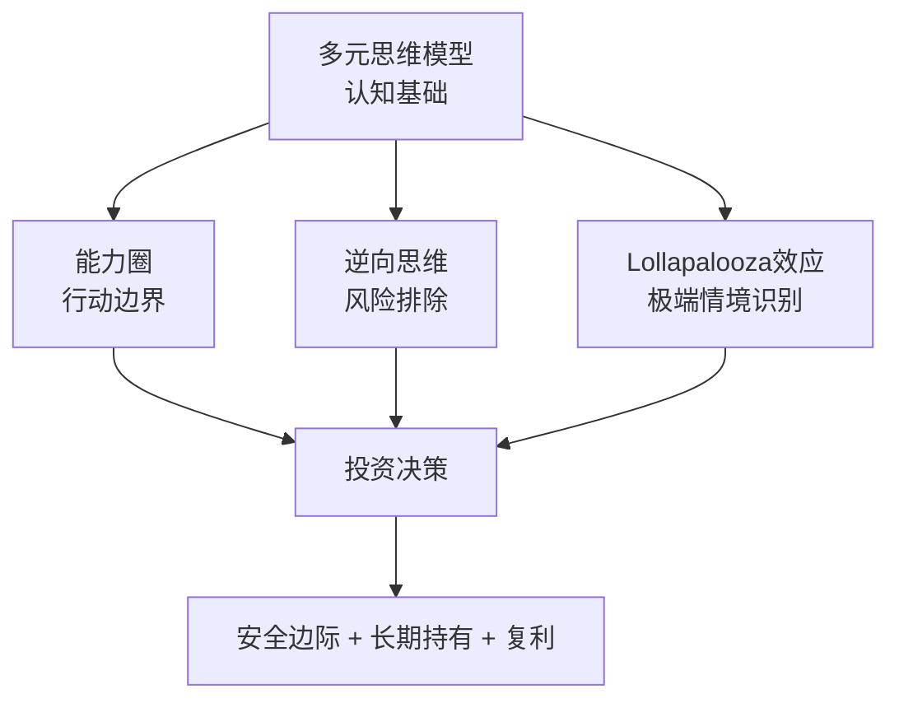

# 《穷查理宝典》深度读书笔记

> [!abstract]
> 这不是一本教你选股的投资手册，而是一位活到99岁的智者关于"如何正确思考"的终身心法。查理·芒格——沃伦·巴菲特长达半个多世纪的合伙人、伯克希尔·哈撒韦的副主席——在这本书中展示了一套跨越物理学、生物学、心理学、经济学等多学科的普世智慧体系。他的核心信念是：投资成功的秘诀不在于掌握某个特殊技巧，而在于建立一个由多元思维模型组成的"格栅"，用它来过滤世界的复杂性。

## 这本书要解决什么经济问题

表面上看，这是一本关于投资的书。但芒格要回应的问题比"怎么赚钱"深刻得多：在一个充满不确定性和系统性偏差的世界里，人类如何做出真正理性的经济决策？

传统金融学建立在"理性人"假设之上——人会最大化自身效用，市场会自动趋向均衡。但芒格从50多年的投资实践中看到了完全不同的景象：人类大脑充满系统性偏差，会在可预测的方向上反复犯同样的错误。市场远非教科书描述的有效机器，而是一个由恐惧和贪婪交替驱动的混沌系统。

> [!tip] 核心主张
> ==投资成功归根到底是思考质量的胜利==。芒格不相信任何单一的投资公式或技术指标，而是主张建立一套跨学科的思维工具箱来应对现实世界的复杂性。

在经济学的谱系中，这让他既不同于格雷厄姆那种纯粹的量化价值投资者，也区别于学院派的金融理论家。他代表了一种更古老也更宽广的智慧传统——像本杰明·富兰克林那样，追求对世界的完整理解，而不仅仅是对金融市场的局部精通。

## 核心模型地图

芒格的智慧体系不是一个封闭的理论，而是四个相互关联的模型群落，它们共同构成了他理解世界的"格栅"。

**多元思维模型**是整座大厦的地基。芒格有一个著名的比喻：只拿着锤子的人，会把所有问题都看成钉子。真正的智慧需要你掌握来自不同学科的核心模型——物理学的临界质量、生物学的进化压力、心理学的认知偏差、数学的复利效应——然后让它们在头脑中形成一张相互连接、相互校验的网。

**能力圈**定义了边界。知道自己知道什么固然重要，知道自己不知道什么才真正要命。能力圈的边界比它的大小更重要。

**逆向思维**是保护机制。"反过来想，总是反过来想。"不要问"怎样才能成功"，而要问"怎样一定会失败"，然后避免那些行为。

**lollapalooza效应**是机会和风险的放大器。当多个心理倾向或多个经济力量在同一方向上叠加时，会产生极端的非线性结果。

## 逐层深入

### 人类大脑为什么是投资的最大敌人

芒格在多次演讲中反复锤打一个反直觉的观点：投资成功的秘诀不是学会更多技巧，而是减少愚蠢的错误。

> [!example] 芒格的原话
> "我们一直很成功，是因为我们专注于找出并避开那些愚蠢的事情，而不是因为我们有什么超凡的智力。"

芒格列举了==25种人类误判心理学==，这是他最独特的贡献之一。"社会认同倾向"让你在所有人都在疯狂买入时无法保持冷静；"锚定效应"让你不自觉地用买入价格评估一切；"损失厌恶"让你死死抱着亏损的股票不肯放手。

> [!warning] 重要警示
> 知道这些偏差的存在并不能让你免疫。芒格坦诚，他自己也会犯这些错误。他的解决方案是建立一套检查清单，在每次重大决策前逐一排查。

### 可口可乐的启示：多因素共振的力量

芒格用可口可乐来演示多因素叠加的惊人力量。可口可乐同时利用了巴甫洛夫条件反射、社会认同、稀缺性心理、一致性承诺等多种心理机制。这些力量不是简单相加，而是接近乘数效应。当多种有利因素在同一方向上共振时，结果远超线性预期。

### 能力圈：为什么知道边界比知道答案更重要

芒格和巴菲特拒绝投资科技股长达几十年。在1990年代末互联网泡沫的狂热期，华尔街嘲笑他们"落伍了"。然后泡沫破裂，那些"懂"科技的投资者损失了数万亿美元，而伯克希尔安然无恙。

> [!tip] 核心洞察
> ==最危险的情况是你以为自己懂但实际上不懂。==智力在这里反而成了诅咒——越聪明的人越容易说服自己"我已经理解了"。

能力圈可以扩大，但需要时间和真诚的努力。芒格晚年逐渐理解了科技公司，伯克希尔投资苹果成了他们最成功的投资之一。

### 逆向思维：从失败的墓碑上读取智慧

"告诉我我会死在哪里，这样我就不去那里。"研究失败比研究成功能提供更可靠的智慧。成功的路径千差万别，但通往毁灭的路径惊人地相似。在投资中，这意味着先排查"可能怎样失败"，然后发现所有失败模式都不太可能——这才是值得出手的信号。

### 复利：被低估的第八大奇迹

每年15%的回报，40年后财富增长267倍。复利思维有三个推论：==时间比时机重要==，==避免亏损比追求收益重要==，==摩擦成本是复利的隐形杀手==。

> [!note] 知识的复利
> 复利同样适用于知识。芒格每天花数小时阅读。知识也会复利——每个新概念都会和已有知识网络产生新联结，让理解力指数增长。

### 护城河：持久竞争优势的本质

芒格识别了几种核心护城河类型：品牌（可口可乐）、规模（沃尔玛、亚马逊）、网络效应（Visa、社交平台）、转换成本（企业软件、银行账户）。

> [!warning] 护城河会被侵蚀
> 报纸行业曾有极为坚固的护城河——本地广告垄断——但互联网在短短十年内就把它彻底摧毁了。你必须持续追问：什么变化可能填平这条护城河？

### 管理层的品质与安全边际

芒格反复强调：你投资的不是一张股票，而是一个由具体的人经营的企业。评估管理层的信号包括资本分配能力、薪酬合理性和沟通坦诚度。

安全边际不仅是价格低于价值的缓冲，更是一种贯穿一切决策的思维方式——财务杠杆的安全边际、多元化的安全边际、时间的安全边际。

> [!tip] 棒球比喻
> 投资和棒球最大的区别是，投资中没有"三振出局"——你可以无限期等待完美的球。==大多数投资者的问题是挥棒太频繁，而不是太少。==

## 预测与现实

伯克希尔·哈撒韦近60年年化回报率接近20%，1965年投入1万美元今天价值数亿美元。这个回报不依赖于预测宏观经济或市场走势。他们的成功来自四个可复制的原则：只在能力圈内行动，以合理价格买入优质企业，长期持有让复利做功，以及避免重大错误。

这套方法也经历过严峻考验。2008年金融危机期间伯克希尔股价也下跌了超过30%。但总体而言，这套思维框架经受住了时间考验。

> [!warning] 适用背景
> 芒格和巴菲特的成功发生在20世纪后半叶到21世纪初的美国市场——人类历史上经济增长最强劲、资本市场最成熟的时段和地域之一。原则在不同宏观环境下是否同样有效，值得独立思考。

## 不同学派怎么说

**有效市场假说**认为市场价格已反映所有信息，无人能系统性战胜市场。芒格的回应："我喜欢和相信有效市场假说的人竞争。"不过学术界对芒格超额回报有不同解释——部分可归因于保险浮存金提供的低成本杠杆。

**技术分析者**相信价格历史模式可预测未来。芒格认为这是"占星术在金融领域的变种"。

**量化投资者**用数学模型发现系统性机会。芒格警告，太多资金追逐同一策略时策略会失效，且纯量化方法可能忽略难以量化的关键因素。

芒格自己立场也在演化：从格雷厄姆式"捡烟蒂"转向"以合理价格买入优质公司"，这个转变是伯克希尔成功的关键转折点。

## 对你意味着什么

- **降低期望和行动频率** — 大多数时候最好的行动就是不行动
- **持续投资于学习** — 选一本远离你专业领域的经典，开始建立跨学科思维网络
- **建立你的检查清单** — 每次重大决策前排查心理偏差
- **保持诚实** — 自欺是所有认知偏差中最危险的一种
- **做一个正直的人** — 信誉和品格在长期是最有价值的资产

## 延伸阅读

- [[《巴菲特致股东的信》]]：芒格的思维框架在具体投资决策中的应用，两人思想高度一致但各有侧重
- [[《思考，快与慢》]]：丹尼尔·卡尼曼对人类认知偏差的系统性研究，芒格"25种误判心理学"的学术源流
- [[《影响力》]]：罗伯特·西奥迪尼探讨说服原理的经典，芒格多次公开推荐
