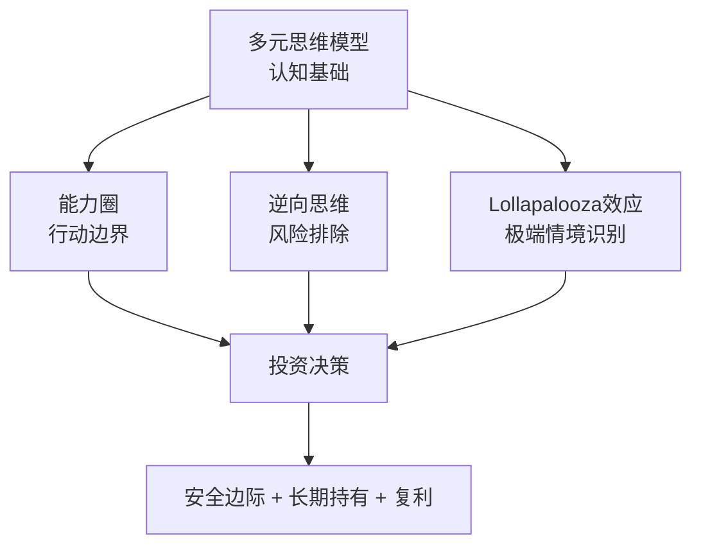

# 《穷查理宝典》深度读书笔记

> [!abstract]
> 这不是一本教你选股的投资手册，而是一位活到99岁的智者关于"如何正确思考"的终身心法。查理·芒格——沃伦·巴菲特长达半个多世纪的合伙人、伯克希尔·哈撒韦的副主席——在这本书中展示了一套跨越物理学、生物学、心理学、经济学等多学科的普世智慧体系。他的核心信念是：投资成功的秘诀不在于掌握某个特殊技巧，而在于建立一个由多元思维模型组成的"格栅"，用它来过滤世界的复杂性。

## 这本书要解决什么经济问题

表面上看，这是一本关于投资的书。但芒格要回应的问题比"怎么赚钱"深刻得多：在一个充满不确定性和系统性偏差的世界里，人类如何做出真正理性的经济决策？

传统金融学建立在"理性人"假设之上——人会最大化自身效用，市场会自动趋向均衡。但芒格从50多年的投资实践中看到了完全不同的景象：人类大脑充满系统性偏差，会在可预测的方向上反复犯同样的错误。市场远非教科书描述的有效机器，而是一个由恐惧和贪婪交替驱动的混沌系统。想想2000年的互联网泡沫：无数博士学位持有者、华尔街分析师和专业基金经理集体相信"这次不一样"，相信一家没有收入甚至没有产品的公司值几十亿美元。这不是个别人的失误，而是人类认知系统的结构性缺陷在特定环境条件下被集体触发的结果。

> [!tip] 核心主张
> ==投资成功归根到底是思考质量的胜利==。芒格不相信任何单一的投资公式或技术指标，而是主张建立一套跨学科的思维工具箱来应对现实世界的复杂性。

在经济学的谱系中，这让他既不同于格雷厄姆那种纯粹的量化价值投资者，也区别于学院派的金融理论家。他代表了一种更古老也更宽广的智慧传统——像本杰明·富兰克林那样，追求对世界的完整理解，而不仅仅是对金融市场的局部精通。

这本书之所以在经济/投资领域占据独特地位，是因为它提供了一个极为稀缺的视角：一个真正在市场上获得了惊人长期回报的人，坦诚分享他思考的全过程——包括错误、遗憾，以及他认为大多数人系统性忽视的东西。芒格不是在课堂上推演理论的教授，而是在战场上真刀真枪打了几十年的老将。他的每一条原则都经过了真金白银的检验。你需要注意的是，这种"实战派智慧"有时候缺乏学术意义上的系统性和严格证明，但它补充了学院理论在真实世界中常常缺失的那种"手感"和判断力。

## 核心模型地图

芒格的智慧体系不是一个封闭的理论，而是四个相互关联的模型群落，它们共同构成了他理解世界的"格栅"。

**多元思维模型**是整座大厦的地基。芒格有一个著名的比喻：只拿着锤子的人，会把所有问题都看成钉子。真正的智慧需要你掌握来自不同学科的核心模型——物理学的临界质量、生物学的进化压力、心理学的认知偏差、数学的复利效应——然后让它们在头脑中形成一张相互连接、相互校验的网。芒格估计自己常用的模型大约有100个左右，其中最重要的大概十几个来自数学、物理、化学、生物和心理学等基础学科。他建议每个认真的投资者都应该掌握至少几十个核心模型，而且要真正理解到能在不同情境中灵活运用的程度，而不是仅仅知道名词的定义。

**能力圈**定义了边界。知道自己知道什么固然重要，知道自己不知道什么才真正要命。能力圈的边界比它的大小更重要。这个概念听起来简单，但在实践中极为困难——因为人类天生厌恶承认无知，尤其是在公开场合，尤其是当同行和媒体都在吹捧某个你不理解的热门领域时。

**逆向思维**是保护机制。"反过来想，总是反过来想。"不要问"怎样才能成功"，而要问"怎样一定会失败"，然后避免那些行为。它背后有一个深刻的统计学洞察：在大多数复杂系统中，失败原因的分布比成功原因的分布更加集中和可预测。

**lollapalooza效应**是机会和风险的放大器。当多个心理倾向或多个经济力量在同一方向上叠加时，会产生极端的非线性结果。这个概念的重要性在于，它提醒你不能用线性思维去估算叠加效应的结果。

> [!note] 模型关系
> 这四个模型层层嵌套，构成一个完整的决策漏斗：多元思维模型帮你看清全景，能力圈帮你筛掉不该碰的领域，逆向思维帮你排除有致命风险的选项，lollapalooza效应帮你在剩下的选项中识别出那些真正值得重仓的机会。

## 逐层深入

### 人类大脑为什么是投资的最大敌人

芒格在多次演讲中反复锤打一个反直觉的观点：投资成功的秘诀不是学会更多技巧，而是减少愚蠢的错误。

> [!example] 芒格的原话
> "我们一直很成功，是因为我们专注于找出并避开那些愚蠢的事情，而不是因为我们有什么超凡的智力。"

问题出在硬件层面：人类大脑有一套在数百万年进化中形成的心理机制，这些机制帮助我们的祖先在非洲草原上生存下来，但在现代金融市场中，它们会系统性地引导你走向错误决策。在草原上，看到同伴奔跑时你也立刻跟着跑，这是保命的好策略；在股市里，看到所有人都在买入时你也跟风买入，这往往是灾难的开始。

芒格列举了==25种人类误判心理学==，这是他最独特的贡献之一。"社会认同倾向"让你在所有人都在疯狂买入时无法保持冷静——1999年底的纳斯达克就是这种心理的完美展示场。"锚定效应"让你不自觉地用买入价格评估一切——但理性的做法是完全忽略买入价格，重新评估这只股票在当前价位是否值得持有。"损失厌恶"让你死死抱着亏损的股票不肯放手——行为经济学的研究表明，同等数额的亏损带来的痛苦大约是同等数额收益带来的快乐的两倍。"过度自信偏差"可能是所有偏差中最阴险的一个——研究显示，当人们对某件事表示"90%确定"时，实际正确率通常只有70%左右。"可得性偏差"让你过度重视容易想到的信息，而忽视不那么显眼但可能更重要的数据。

> [!warning] 重要警示
> 知道这些偏差的存在并不能让你免疫。芒格坦诚，他自己也会犯这些错误。他的解决方案是建立一套检查清单，在每次重大决策前逐一排查。航空业用检查清单把飞行事故率降低了数个数量级，芒格相信同样的方法可以大幅减少投资中的非受迫性失误。

你不需要完美，你只需要比对手犯更少的错误。投资是一个相对游戏——当别人在恐慌中抛售时你能保持冷静，当别人在狂热中追涨时你能按兵不动，你就已经拥有了巨大的优势。

### 可口可乐的启示：多因素共振的力量

芒格用可口可乐来演示多因素叠加的惊人力量。可口可乐同时利用了巴甫洛夫条件反射（清凉爽快的体验与品牌深度绑定）、社会认同（"所有人都在喝"的无声推荐）、稀缺性心理（独一无二的"秘密配方"）、一致性承诺（形成身份认同："我就是喝可乐的人"）。这些力量不是简单相加，而是接近乘数效应。

如果你只看品牌知名度，这是一家不错的饮料公司。同时看到全球分销网络，评估会提高。再加上定价能力（通胀中可持续提价），再上一个台阶。但当你把品牌、分销、定价能力、消费者习惯、全球文化渗透全部放在一起看时，竞争壁垒已经达到几乎不可摧毁的程度。这就是多因素共振产生的非线性效果。

> [!warning] 负向的lollapalooza
> 2008年金融危机就是一个负向案例：过度杠杆、错误的风险模型、监管失职、评级机构利益冲突、金融创新复杂性超过参与者理解能力——这些因素单独任何一个都不会导致全球金融体系崩溃，但同方向叠加创造了一场完美风暴。

### 能力圈：为什么知道边界比知道答案更重要

芒格和巴菲特拒绝投资科技股长达几十年。在1990年代末互联网泡沫的狂热期，华尔街嘲笑他们"落伍了"。然后泡沫破裂，那些"懂"科技的投资者损失了数万亿美元，而伯克希尔安然无恙。

> [!tip] 核心洞察
> ==能力圈不是"兴趣圈"，也不是"知识圈"。==你可能对人工智能非常感兴趣，也读了大量文章，但这不意味着你有能力评估一家AI公司值多少钱。真正的能力要求你理解一个行业的经济本质——利润从哪里来，竞争格局会怎样演变，什么条件下商业模式会失效。

能力圈可以扩大，但需要时间和真诚的努力。芒格晚年逐渐理解了科技公司，伯克希尔投资苹果成了他们最成功的投资之一。但他们不是从技术角度理解苹果的，而是从消费者行为和品牌忠诚度的角度——这些恰恰在他们几十年的能力圈之内。

> [!example] LTCM的教训
> ==最危险的情况是你以为自己懂但实际上不懂。==长期资本管理公司（LTCM）的合伙人包括两位诺贝尔经济学奖得主和一群华尔街最聪明的交易员。他们用精密的数学模型进行套利交易，头几年获得了令人瞩目的回报。然后1998年俄罗斯债务危机爆发，模型没有预见到的关联性导致连锁崩溃，几周之内几乎把整个公司的资本亏光。

错过机会是投资的正常成本，亏损才是致命伤。一次50%的亏损需要100%的收益才能回本，所以保护下行风险的价值远远超过追求上行空间。

### 逆向思维：从失败的墓碑上读取智慧

"告诉我我会死在哪里，这样我就不去那里。"研究失败比研究成功能提供更可靠的智慧。成功的路径千差万别，但通往毁灭的路径惊人地相似。

芒格特别喜欢研究那些曾经辉煌但最终陨落的企业。柯达曾经是世界上最强大的消费品牌之一，它甚至发明了数码相机技术，但内部的官僚主义和对胶卷利润的执念让它无法完成自我革命。通用汽车曾经是全球最大的公司，但臃肿的组织结构和对消费者需求变化的忽视让它走向破产。安然曾被媒体追捧为"最具创新精神的公司"，但虚假的利润数字和有毒的企业文化最终让它成了商业史上最臭名昭著的丑闻之一。

这些失败案例有惊人的共同模式：管理层的傲慢、对显而易见的威胁视而不见、激励机制与长期价值的错位。在投资中，不要问"这笔投资为什么会成功"，而要先问"这笔投资可能怎样失败"——逐一排查所有失败模式后发现都不太可能发生，这才是值得出手的信号。

逆向思维还是对抗过度乐观偏差的天然解药。人类天生倾向于高估好结果的概率、低估坏结果的概率。强迫自己系统性地思考"什么会出错"，是对这种偏差最有效的矫正。

### 复利：被低估的第八大奇迹

每年15%的回报，40年后财富增长267倍。但真正震撼的是不同回报率的长期差异：100万元投资30年，年化10%变成1745万；年化15%变成6621万；年化20%变成2.37亿。仅仅5个百分点的年化差异，30年后变成十几倍的终值差距。

复利思维有三个推论：==时间比时机重要==（即使每次在年内最高点买入标普500，只要长期持有，回报仍远超等待"最佳时机"的人），==避免亏损比追求收益重要==（50%亏损需要100%收益回本，90%亏损需要900%），==摩擦成本是复利的隐形杀手==（每年额外2%的摩擦成本，30年后可能让终值减半）。

> [!note] 知识的复利
> 复利同样适用于知识。芒格每天花数小时阅读。一个同时懂物理学和心理学的人，看待商业问题的眼光不是两门学科的简单叠加，而是一种全新的、整合后的视角。这就是为什么多元思维模型的价值不是线性增长，而是指数增长。芒格本人就是这种知识复利的活体证明：几十年的知识积累在头脑中形成了一张极为密集的关联网络。

### 护城河：持久竞争优势的本质

芒格识别了几种核心护城河类型：

- **品牌护城河**（可口可乐、苹果）——品牌在消费者的神经回路中建立了直达情感和习惯层面的通道，极难复制，需要几十年和数十亿美元广告投入
- **规模护城河**（沃尔玛、亚马逊）——亚马逊的飞轮：更多卖家带来更丰富选品，吸引更多买家，又吸引更多卖家，规模让物流成本持续下降
- **网络效应护城河**（Visa、社交平台）——每增加一个用户，网络对所有现有用户的价值都在增加，新进入者面临几乎不可能的冷启动问题
- **转换成本护城河**（企业软件、银行账户）——使用SAP管理全球业务的企业即使不满意也几乎不可能更换

> [!warning] 护城河会被侵蚀
> 报纸行业曾有极为坚固的护城河——本地广告垄断——但互联网在短短十年内就把它彻底摧毁了。传统出租车的牌照垄断被网约车平台几年内瓦解。你必须持续追问：什么变化可能填平这条护城河？

### 管理层的品质与安全边际

芒格反复强调：你投资的不是一张股票，而是一个由具体的人经营的企业。评估管理层的信号包括资本分配能力（糟糕的管理者热衷于不创造价值的并购——研究表明大多数大型并购以失败告终）、薪酬合理性（在公司亏损时仍给自己发巨额奖金是危险信号）和沟通坦诚度（主动讨论风险和错误的CEO通常更值得信任）。

芒格说过一句深刻的话：==激励机制的设计往往比找到聪明人更重要==——即使是品格高尚的人，在扭曲的激励机制下也会做出糟糕的决定。这不是指责个人道德，而是承认一个人性事实：人会对激励做出反应，而这种反应往往发生在意识层面以下。

安全边际不仅是价格低于价值的缓冲，更是一种贯穿一切决策的思维方式——财务杠杆的安全边际（LTCM的策略长期正确，但短期极端波动在杠杆放大下让他们等不到"正确"那一天）、多元化的安全边际、时间的安全边际（好投资应该在经济衰退、利率上升、竞争加剧等不利环境中仍能存活）。

> [!tip] 棒球比喻
> 投资和棒球最大的区别是，投资中没有"三振出局"——你可以无限期等待完美的球。==芒格说，一生做二十个好的投资决定就足以让你非常富有。问题是大多数人一年就做了二十个决定，且大部分是冲动驱动的。==

## 预测与现实

伯克希尔·哈撒韦近60年年化回报率接近20%，1965年投入1万美元今天价值数亿美元。这个回报不依赖于预测宏观经济或市场走势——芒格从不预测GDP增长率、利率走向或股市点位，这在投资界是极为罕见的立场。他们的成功来自四个可复制的原则：只在能力圈内行动，以合理价格买入优质企业，长期持有让复利做功，以及避免重大错误。

这套方法也经历过严峻考验。2008年金融危机期间伯克希尔股价也下跌了超过30%。2020年疫情初期卖出全部航空股后来看起来过于悲观。但总体而言，这套思维框架经受住了时间考验。

> [!warning] 适用背景
> 芒格和巴菲特的成功发生在20世纪后半叶到21世纪初的美国市场——人类历史上经济增长最强劲、资本市场最成熟的时段和地域之一。此外，伯克希尔的保险浮存金提供了普通投资者不具备的低成本杠杆。因此复制他们的回报率可能不现实，但思维原则仍有普遍价值。

## 不同学派怎么说

**有效市场假说**认为市场价格已反映所有信息，无人能系统性战胜市场。尤金·法玛因此获得诺贝尔奖。芒格的回应："我喜欢和相信有效市场假说的人竞争。"不过学术界对芒格超额回报有不同解释——部分可归因于保险浮存金提供的低成本杠杆和特定风险因子暴露。

**技术分析者**相信价格历史模式可预测未来。芒格认为这是"占星术在金融领域的变种"。

**量化投资者**用数学模型发现系统性机会。芒格警告，太多资金追逐同一策略时策略会失效，且纯量化方法可能忽略难以量化的关键因素。

芒格自己立场也在演化：从格雷厄姆式"捡烟蒂"转向"以合理价格买入优质公司"，这个转变是伯克希尔成功的关键转折点。==价值和成长不是对立的——真正的价值投资必须把未来增长纳入价值评估。==

## 对你意味着什么

- **降低期望和行动频率** — 大多数时候最好的行动就是不行动。经纪商、财经媒体的商业模式都建立在你频繁交易的基础上，但频繁交易几乎总是损害长期回报
- **持续投资于学习** — 选一本远离你专业领域的经典，每周花几个小时有纪律地阅读，坚持十年，你看世界的方式会发生根本性变化
- **建立你的检查清单** — 每次重大决策前排查心理偏差，不要依赖记忆
- **保持诚实** — 自欺是所有认知偏差中最危险的一种。找值得信赖的人，授权他们在你犯蠢时毫不留情地指出来
- **做一个正直的人** — 信誉和品格在长期是最有价值的资产。只和你信任和尊敬的人做生意

## 延伸阅读

- [[《巴菲特致股东的信》]]：芒格的思维框架在具体投资决策中的应用，两人思想高度一致但各有侧重
- [[《思考，快与慢》]]：丹尼尔·卡尼曼对人类认知偏差的系统性研究，芒格"25种误判心理学"的学术源流
- [[《影响力》]]：罗伯特·西奥迪尼探讨说服原理的经典，芒格多次公开推荐
- [[《聪明的投资者》]]：本杰明·格雷厄姆的经典之作，芒格和巴菲特共同的思想起点，安全边际和市场先生等概念至今仍是价值投资的基石
