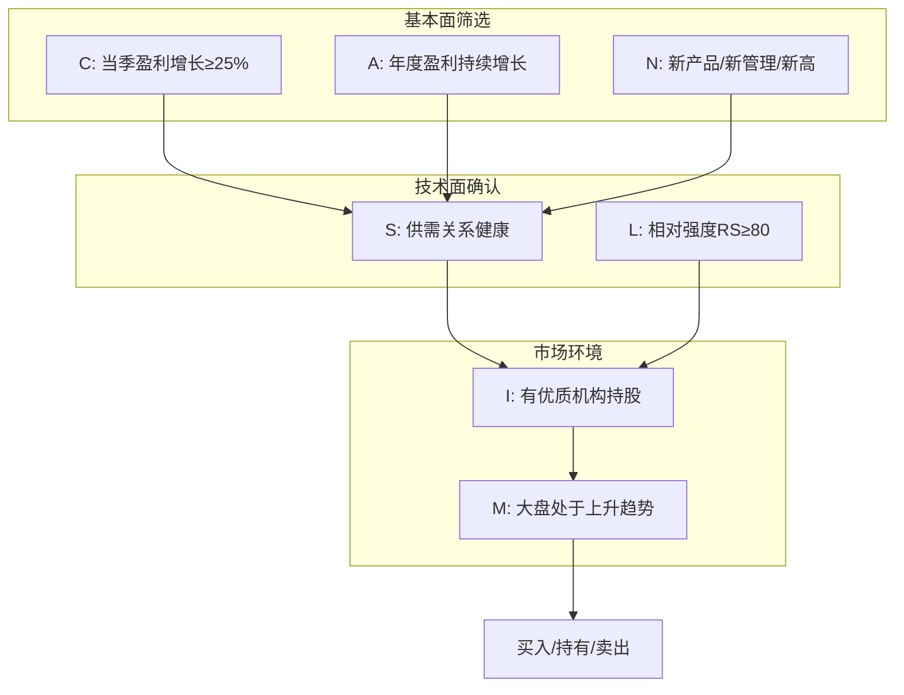

# 《笑傲股市》深度读书笔记

> [!abstract] 全书速览
> 这是一本教你用数据和规则识别、买入并持有超级成长股的操作手册。威廉·欧奈尔通过研究125年间所有大牛股的共同特征，提炼出了CANSLIM选股系统——这是一套将基本面分析与技术分析相结合的完整投资方法论。全书的核心主张是：==投资成功可以系统化==，只要你愿意按规则行事，小心控制风险，就能在股市中获得稳定的超额收益。

## 这本书要解决什么经济问题

股票投资领域充斥着各种相互矛盾的建议。有人说要"低买高卖"，有人说要"长期持有"，有人信奉技术分析，有人只看基本面。普通投资者面对这些噪音，往往无所适从。

欧奈尔的问题意识非常明确：**如何系统化地识别下一只大牛股？**他不满足于模糊的投资原则，而是要建立一套可重复、可验证的选股系统。

这个追问来自他的实战经验。欧奈尔30岁时就在纽约证券交易所买下了一个席位，是当时最年轻的席位持有者。他创立的欧奈尔数据系统为全球600多家顶级机构投资者提供股票研究服务。这种实战背景让他深知：投资者需要的不是"可能有用"的建议，而是"确实有效"的系统。

在经济学谱系中，欧奈尔的方法介于纯粹的基本面分析和纯粹的技术分析之间。他与格雷厄姆的价值投资传统截然不同——价值投资强调"买便宜货"，欧奈尔强调"买好货"。他认为，在正确的时机买入最强势的股票，比买入被低估但缺乏催化剂的股票更有效率。

## 核心模型地图

CANSLIM系统由七个相互关联的选股原则组成，每个字母代表一个关键因素。这不是一个简单的检查清单，而是一个层层筛选的漏斗系统。

前三个原则（C、A、N）构成==基本面筛选层==，关注企业的盈利质量和成长动力。中间两个原则（S、L）是==技术面确认层==，通过供需关系和相对强度来验证股票的市场地位。第六个原则（I）关注==机构行为==，因为机构投资者是股价的主要推动力量。最后一个原则（M）是==大盘判断==，因为即使是最好的股票在熊市中也会下跌。

这七个原则的关系可以这样理解：基本面筛选确保你买的是好公司，技术面确认确保市场也认可这是好公司，机构认同提供了持续的买盘支撑，而大盘判断则决定了你应该激进还是保守。任何一个原则的缺失都会增加投资的风险。

## 逐层深入

### C原则：当季盈利是股价的根本驱动力

> [!tip] 核心洞察
> 在过去125年中的所有大牛股，在股价大涨之前，其当季盈利平均增长了70%。

欧奈尔的研究揭示了一个简单但常被忽视的事实：股价的长期走势由盈利决定。那些能带来巨额回报的股票，几乎无一例外地在启动前展现出强劲的盈利增长。

具体的筛选标准是：**当季每股收益（EPS）同比增长至少25%**。注意是同比增长（与去年同期比），而非环比增长——这是为了排除季节性因素的干扰。增长越快越好，最好能看到加速增长的迹象。如果一家公司前几个季度增长30%，本季度增长50%，下季度增长80%，这种加速模式是最理想的。

> [!warning] 常见误区
> 很多投资者喜欢买入盈利下滑但"便宜"的股票，期待反转。欧奈尔的数据显示，这类股票成为大牛股的概率极低。买入弱势盈利的股票就像买入下沉的船——你以为捡到了便宜货，实际上是在接手别人急于抛弃的烫手山芋。

### A原则：年度盈利验证企业的真实质量

短期盈利可能有偶然性，比如一次性的资产出售或政府补贴。年度盈利则更能反映企业的真实竞争力。

欧奈尔的标准是：**过去3-5年的年度EPS持续增长，年均增长率至少25%，且最近一年的增长应该最强劲**。理想的增长模式是逐年加速：从25%到30%到35%，而不是从40%降到30%降到20%。

除了盈利增长，欧奈尔特别强调==股本回报率（ROE）==的重要性。ROE衡量的是企业用股东资本创造利润的效率。大牛股通常ROE在17%以上，最好超过25%。高ROE意味着企业能用较少的资本创造较多的利润，这是优质企业的标志。

### N原则："新"是股价上涨的催化剂

基本面的改善需要一个触发点，这个触发点通常是某种"新"的因素。欧奈尔发现，**95%的大牛股在启动前都有某种"新"的因素**。

"新"有三种形式：

**新产品或新服务**。苹果的iPhone、谷歌的搜索引擎、特斯拉的电动汽车——这些划时代的产品不仅改变了用户的生活，也改变了这些公司的股价轨迹。一个革命性的新产品可以创造全新的市场需求，让企业的盈利跃升到一个全新的水平。

**新管理层**。一位有远见的新CEO可以带来战略变革，激活一家停滞不前的企业。管理层更换往往意味着旧问题将被解决，新机会将被把握。

**新高**。这是最反直觉的一点。很多投资者害怕追高，认为创新高的股票"太贵了"。但欧奈尔的研究显示，==创新高的股票往往会继续创新高==。股价创新高意味着所有持有者都在盈利，没有"套牢盘"的抛压，股价上涨的阻力最小。

> [!example] 突破买入原则
> 欧奈尔最著名的建议之一是：在股票突破整理形态创新高时买入。这个时点结合了基本面改善（新产品/业绩）和技术面确认（新高突破）。就像一个学生经过长期努力终于考进了年级前十，这个突破既是能力的证明，也是未来继续进步的起点。

### S原则：供需关系决定价格的弹性

供需关系决定价格，这是经济学的基本原理。对于股票来说，供给就是流通股数量，需求就是买盘力量。

欧奈尔指出，**流通盘较小的股票更容易大涨**。原因很简单：当机构投资者决定买入一只流通盘小的股票时，有限的供给会被迅速消化，价格自然被推高。相反，流通盘巨大的股票就像大象，即使有很多买盘也很难推动。

成交量是观察供需关系的窗口。欧奈尔提供了一个简单的分析框架：

| 情况 | 含义 |
|------|------|
| 上涨+放量 | 健康的上涨，机构在买入 |
| 上涨+缩量 | 上涨动力不足，可能见顶 |
| 下跌+放量 | 机构在卖出，危险信号 |
| 下跌+缩量 | 正常回调，可能是买点 |

股票回购是另一个正面信号。当公司用自有资金回购股票时，既减少了流通股的供给，又传递了管理层对未来有信心的信息。

### L原则：只买领导股，远离落后股

欧奈尔强调要只买行业中的领导股，坚决避开落后股。这个原则基于一个残酷的现实：在同一个行业中，领导股和落后股的回报差异是惊人的。

识别领导股的核心工具是==相对强度评级（RS Rating）==——这是欧奈尔发明的指标。RS评级从1到99，RS评级80意味着该股表现超过80%的股票。欧奈尔的研究显示，大牛股在启动前RS通常在80以上。

> [!warning] 为什么不买"便宜"的落后股
> 很多投资者喜欢买同行业中"便宜"的股票，认为它们会"补涨"。这种想法的背后是一个心理偏误：我们本能地喜欢"捡便宜"。但欧奈尔的数据显示，落后股很少能追上领导股。买落后股就像在赛马中押注跑得最慢的马——它之所以落后，通常是有原因的。

### I原则：跟随聪明钱

机构投资者掌握着市场上大部分的资金。当他们决定买入一只股票时，其巨大的买盘会推动股价持续上涨。因此，选择有机构持股的股票是明智的。

但欧奈尔给出了一个重要的限定条件：**有机构持股，但不要太多**。最好是机构开始关注但尚未大规模建仓的阶段。如果一只股票已经被数百家机构重仓持有，那么潜在的买盘已经消耗殆尽，反而可能面临大规模卖出的风险。

此外，持股机构的质量比数量更重要。一家顶级基金的持仓，比十家不知名机构的持仓更有说服力。同时要关注机构持股比例的变化趋势——是在增加还是在减少？这反映了聪明钱的真实动向。

### M原则：大盘方向是最重要的判断

> [!tip] 核心洞察
> 75%的股票会跟随大盘方向运动。在熊市中，即使是最好的股票也很难上涨。

判断大盘方向是欧奈尔认为最重要的投资技能。他提供了几个关键的观察指标：

**分发日（Distribution Days）**：当指数下跌0.2%以上且成交量高于前一日时，就是一个分发日。分发日意味着机构在卖出。如果在4-5周内出现4-5个分发日，通常预示顶部即将形成。

**跟进日（Follow-Through Day）**：在市场下跌后，如果出现一天指数上涨1.5%以上且成交量放大，这是市场反转的信号。跟进日不保证反弹成功，但没有跟进日的反弹几乎必然失败。

M原则具有一票否决权。即使一只股票满足了前六个原则，如果大盘处于下跌趋势，也应该保持谨慎或空仓等待。

## 技术形态：杯柄形态详解

杯柄形态是欧奈尔最著名的技术形态发现，也是大牛股最常见的启动形态。

这个形态的名字来自它的形状——像一个带把手的咖啡杯。股价先下跌形成杯的左侧，然后在底部企稳，再上涨形成杯的右侧，最后在接近前高时有一个小幅回调形成"柄部"。当股价突破柄部的高点时，就是买入信号。

> [!note] 杯柄形态的要素
> | 要素 | 标准 |
> |------|------|
> | 杯的深度 | 从顶部回调12%-33%（熊市可达40-50%） |
> | 杯的时间 | 至少7周，通常3-6个月 |
> | 杯底形状 | U形比V形更健康 |
> | 柄部深度 | 从杯口回调8%-12% |
> | 柄部时间 | 至少1-2周 |
> | 柄部位置 | 应在杯的上半部 |
> | 买点 | 柄部高点突破+成交量放大 |

为什么杯柄形态有效？这背后是市场心理的规律。杯的形成过程筛掉了意志不坚定的持有者，柄部的回调又筛掉了一批急于获利了结的短线客。当股价最终突破时，留下的都是坚定的持有者，加上新进入的买盘，股价上涨的动力很足。

## 买入与卖出的纪律

### 买入规则

欧奈尔的买入原则可以概括为：**在正确的时机买入正确的股票**。正确的时机是突破买点，正确的股票是满足CANSLIM的领导股。

具体的买入规则：

1. **只在突破买点买入**。不要提前买入（形态可能失败），也不要追高太多（突破后5%内买入）。
2. **突破必须配合成交量**。突破日成交量至少比平时增加40-50%。
3. **在大盘上升趋势中买入**。不要在下降趋势中抄底。

仓位管理也很重要：不要一次满仓，分批建仓。第一笔仓位用于试探，确认突破成功后再加仓。单只股票仓位不超过20-25%。

### 止损规则：7-8%的铁律

> [!warning] 最重要的规则
> **亏损7-8%必须卖出。** 这是欧奈尔体系中最重要的规则，没有之一。

为什么是7-8%？这是一个风险回报的计算。如果你的亏损控制在7-8%，而盈利的股票能涨20-25%甚至更多，那么你只需要三分之一的成功率就能盈利。但如果放任亏损扩大到20-30%，你需要33-43%的涨幅才能回本，这会严重损害你的整体回报。

止损的心理门槛很高。人性本能地抗拒"确认损失"。但欧奈尔强调，止损是为了保护资本，不是承认失败。很多大牛股第一次突破会失败，回调后再次突破才成功。止损让你有机会在更好的价位重新买入。

### 卖出获利规则

何时卖出盈利的股票？欧奈尔给出了几个指引：

1. **盈利20-25%时部分卖出**。这是一个合理的获利了结点，特别是在股价快速上涨时。
2. **出现顶部信号时卖出**：放量滞涨（高位放量但价格不涨）、低量反弹（反弹时成交量萎缩）、跌破关键支撑位。
3. **基本面恶化时卖出**：盈利增速放缓、管理层大量减持。

对于特别强势的股票，欧奈尔建议采用"让利润奔跑"策略——只要股票保持强势，就不急于卖出。很多大牛股的涨幅会超过200%甚至1000%。过早卖出是常见的错误。

## 预测与现实

CANSLIM系统自1988年首次出版以来，经历了多次市场周期的检验。

**经受住时间检验的核心理念**：

- 盈利增长是股价的根本驱动力——这一点在科技股时代被反复验证
- 相对强度是预测未来表现的有效指标——学术研究（如Jegadeesh和Titman的动量研究）也支持这一结论
- 成交量是市场情绪的窗口——这是技术分析中最可靠的工具之一
- 止损的重要性——无论什么投资风格，风险控制都是成功的前提

**需要调整的地方**：

- 在2000年后的低利率时代，一些高估值成长股即使盈利不达标也能创新高
- 被动投资和ETF的兴起改变了市场的微观结构
- 算法交易的普及使得一些传统的技术形态变得不那么可靠
- 在A股等非美国市场，CANSLIM需要根据当地市场特点进行调整

## 不同学派怎么说

价值投资者对CANSLIM最主要的批评集中在几个方面：

**关于"买强势股"**：格雷厄姆学派认为买入已经大涨的股票是危险的，因为它们往往已经反映了乐观预期。他们更喜欢买入被市场忽视的低估值股票。

**关于技术分析**：效率市场假说的支持者认为股价形态不能预测未来走势，历史价格中不包含可利用的信息。

**关于止损**：长期投资者认为频繁止损会错过很多最终反转上涨的机会，并产生大量交易成本。巴菲特从不使用止损。

**对CANSLIM的回应**：

- 欧奈尔不追求买"最便宜"的股票，而是买"最好"的股票，这是两种不同的投资哲学
- CANSLIM的有效性有历史数据支撑，尤其在趋势明显的市场中
- 止损规则虽然会错过一些反转机会，但能有效保护资本免受灾难性损失

两种方法的适用场景不同：CANSLIM更适合趋势市场和成长股投资，价值投资更适合震荡市场和稳定型企业投资。

## 对你意味着什么

如果你是一位想要系统化提升投资能力的个人投资者，《笑傲股市》提供了一套完整的操作框架。

**对选股的启示**：不要试图在一堆平庸的股票中"发现"未来的大牛股。相反，专注于那些已经展现出优秀特征的股票——盈利高增长、相对强势、机构认可。

**对择时的启示**：买入时机和股票选择同样重要。等待突破确认，而不是提前猜测。

**对风险控制的启示**：7-8%的止损规则可能是你能学到的最重要的一课。它强迫你在小亏损时离场，保留资本等待下一次机会。

**对心理建设的启示**：投资成功需要纪律——严格执行规则，不因情绪改变决策。这可能比学习任何技术都更重要。

## 延伸阅读

- [[《股票大作手回忆录》]]：利弗莫尔的投机智慧与CANSLIM有很多共鸣，是理解趋势交易哲学的经典之作
- [[《彼得·林奇的成功投资》]]：另一位成长股大师的方法论，提供了更侧重基本面的视角
- [[《交易心理分析》]]：马克·道格拉斯的著作，帮助你解决执行CANSLIM规则时的心理障碍
