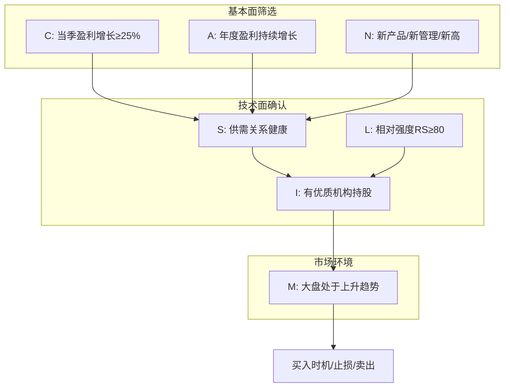

# 《笑傲股市》深度读书笔记

> [!abstract] 全书速览
> 这是一本用125年历史数据锤炼出的成长股投资手册。威廉·欧奈尔用系统化的方法回答了一个所有股票投资者都想知道的问题：**下一只大牛股长什么样？** 他的答案是CANSLIM——七个字母代表七个筛选维度，从盈利增长到市场趋势，从技术形态到机构行为，构建了一套完整的"发现-买入-持有-卖出"投资系统。这不是一本讲"投资哲学"的书，而是一本可以直接照着操作的实战指南。

## 这本书要解决什么经济问题

股票投资领域有一个核心困境：市场上有成千上万只股票，你的时间和资金都是有限的，==如何在这片汪洋中找到那几只真正能带来超额回报的股票？==

传统的价值投资告诉你"买便宜货"——寻找被市场低估的股票，等待价值回归。但欧奈尔走了一条完全不同的路：**不买便宜的，买最强的。** 他的逻辑是：股票便宜往往是有原因的，而那些盈利高速增长、股价不断创新高的公司，才是真正的投资机会。

> [!tip] 核心洞察
> 欧奈尔研究了1880年以来所有涨幅超过数倍的大牛股，发现它们在启动前有惊人相似的特征。CANSLIM就是这些共同特征的系统化提炼。

这套方法在投资谱系中属于"成长股+动量投资"的结合体。它既关注基本面（盈利增长），也重视技术面（价格形态），还考虑市场环境（大盘趋势）。与格雷厄姆、巴菲特的价值投资形成鲜明对比：价值投资者在股价下跌时兴奋，欧奈尔则在股价创新高时出手。

## 核心模型地图

CANSLIM是一个层层筛选的漏斗系统，每个字母代表一个筛选条件：

**第一层是基本面筛选**（C、A、N三个条件），解决"这家公司值不值得关注"的问题。C看当季盈利是否高速增长，A看年度盈利是否持续增长，N看是否有新的催化剂（新产品、新管理层、或股价创新高）。这三个条件筛选出那些正处于业绩爆发期的公司。

> [!note] 模型假设
> 这一层假设：盈利增长是股价上涨的根本驱动力。历史数据支持这个假设——大牛股启动前的当季盈利平均增长70%。

**第二层是技术面确认**（S、L、I三个条件），解决"市场是否认可这家公司"的问题。S关注供需关系（流通盘大小、成交量变化），L筛选行业领导股而非落后股，I确认是否有优质机构在买入。这三个条件确保你买的股票有足够的市场力量支撑。

**第三层是大盘环境判断**（M条件），解决"现在是不是买股票的好时机"的问题。75%的股票会跟随大盘方向运动，逆势操作的成功率很低。

三层筛选之后，还有**执行层**：买入时机（突破形态）、仓位管理（分批建仓）、止损规则（8%止损）、卖出信号（盈利了结与顶部识别）。

## 逐层深入

### C：当季盈利——你的第一道筛选器

> [!tip] 数据支撑
> 欧奈尔研究发现，历史上所有大牛股在启动前，当季盈利同比增长平均达到70%。

如果你只能用一个指标筛选股票，那就用当季盈利增长率。欧奈尔设定的最低门槛是**同比增长25%**，但他更青睐那些增长50%甚至100%以上的公司。

这里有几个容易踩的坑：

第一，要看**同比**增长（与去年同期比），不是环比。很多公司有明显的季节性，环比数据会产生误导。第二，要警惕**非经常性收益**。一次性的资产出售或投资收益会让财报好看，但不可持续。第三，最好是连续几个季度保持高增长，如果增长率在**加速**（比如从30%到50%再到80%），那更是强烈的买入信号。

> [!warning] 常见错误
> 很多投资者喜欢抄底——买那些盈利下滑但"价格便宜"的股票。欧奈尔的数据显示，这类股票成为大牛股的概率极低。买入弱势盈利的股票，就像买一艘正在下沉的船。

### A：年度盈利——过滤掉昙花一现的公司

当季盈利好可能是偶然，年度盈利持续增长才能说明公司的真实质量。

欧奈尔的标准是：**过去3-5年的年度EPS持续增长，年均增长率至少25%**。理想的模式是增长在加速——比如前年增长25%、去年增长30%、今年增长35%。

除了盈利增长，他特别强调==股本回报率（ROE）==。大牛股通常ROE在17%以上，最好超过25%。ROE高意味着企业能用较少的资本创造较多的利润，这是优质公司的标志。

把C和A结合起来看：当季盈利高增长说明公司正处于加速期，年度盈利持续增长说明这种加速是建立在稳固基础上的，不是空中楼阁。

### N：新——催化剂理论

> [!tip] 关键发现
> 95%的大牛股在启动前都有某种"新"的因素。

股价要大涨，需要催化剂。欧奈尔定义的"新"有三种形式：

**新产品或新服务**是最常见的催化剂。苹果的iPhone、谷歌的搜索引擎、特斯拉的电动汽车——这些划时代的产品创造了巨大的股价上涨空间。

**新管理层**也能带来变革。新CEO往往带来新战略、新执行力，可能把一家平庸的公司变成行业领袖。

**新高**——这是最反直觉的一点。很多投资者害怕追高，觉得股价已经涨了这么多，再买就是"接盘"。但欧奈尔的数据显示，==创新高的股票往往会继续创新高==。股价创新高本身就是市场对公司的最强背书，说明有足够多的资金愿意在这个价位买入。

> [!example] 突破买入原则
> 欧奈尔最著名的建议之一：在股票突破整理形态创新高时买入。这个时点结合了基本面改善（新产品/新业绩）和技术面确认（新高突破），是最佳的买入窗口。

### S：供需关系——理解价格形成的底层逻辑

股价是由供需决定的。对股票来说，供给就是流通股数量，需求就是买盘力量。

欧奈尔发现，**流通盘较小的股票更容易大涨**。道理很简单：当机构投资者决定买入时，如果流通盘小，他们的买盘会更容易推高价格。反之，流通盘很大的股票需要更多资金才能推动。

成交量是判断供需的关键指标。欧奈尔提出了一个简洁的分析框架：

| 情况 | 含义 |
|------|------|
| 上涨+放量 | 健康的上涨，机构在买入 |
| 上涨+缩量 | 上涨动力不足，可能见顶 |
| 下跌+放量 | 机构在卖出，危险信号 |
| 下跌+缩量 | 正常回调，可能是买点 |

**股票回购**是一个正面信号。公司花自己的钱买回股票，减少了流通盘（供给减少），同时也表明管理层对公司前景有信心。

### L：领导股vs落后股——只买第一名

> [!warning] 投资陷阱
> 很多投资者喜欢在同一个行业里买"便宜"的股票，期待它们会"补涨"。欧奈尔的研究显示，落后股很少能追上领导股。买落后股就像在赛马中押注跑得最慢的马。

欧奈尔发明了==相对强度评级（RS Rating）==来识别领导股。这个指标把一只股票的表现与市场上所有其他股票比较，用1-99评分。RS评级80意味着这只股票在过去12个月的表现超过了80%的股票。

他的标准是：只买RS评级在80以上的股票。大牛股在启动前，RS评级通常已经很高了。

除了RS评级，还要看**行业地位**：市场份额是第一还是第二？产品是否有差异化优势？利润率是否高于行业平均？

领导股和落后股在行业景气上升时的表现差异巨大。领导股率先上涨、涨幅更大、调整时跌幅更小。落后股滞后上涨、涨幅有限、调整时跌得更惨。

### I：机构认同——跟随聪明钱

机构投资者掌握着市场上大部分的资金。当他们决定买入一只股票时，巨大的买盘会推动股价持续上涨。

但这里有个微妙的平衡：你希望有机构持股，但不希望机构持股太多。

**理想的状态是：机构刚开始关注但尚未大规模建仓的阶段。** 如果一只股票已经被所有主流基金重仓，上涨空间就有限了——因为潜在的买家已经买完了。

欧奈尔建议关注几个指标：
- 持股机构的数量是否在增加？
- 持股机构的质量如何？顶级基金持股是正面信号
- 机构持股比例是否在上升？说明机构在买入而非卖出

> [!tip] 核心原则
> 跟随聪明钱，而非与之对抗。

### M：市场方向——最重要的一个字母

> [!warning] 关键事实
> 75%的股票会跟随大盘方向运动。在熊市中，即使是最好的股票也很难上涨。

CANSLIM的前六个字母帮你找到好股票，但M决定了你是否应该下场。欧奈尔认为，判断大盘方向是最重要的投资技能。

他提出了两个核心工具来判断大盘：

**分发日（Distribution Days）** 是识别顶部的信号。当指数下跌超过0.2%且成交量高于前一日，就记录一个分发日。如果在4-5周内出现4-5个分发日，通常预示着顶部即将到来。这时候应该开始减仓。

**跟进日（Follow-Through Day）** 是确认底部反转的信号。在市场下跌一段时间后，如果某一天指数上涨超过1.5%且成交量放大，这可能是市场反转的信号。但欧奈尔强调，跟进日不是让你立刻满仓，而是开始试探性建仓的信号。

## 技术形态：杯柄形态与买点识别

CANSLIM解决了"买什么"的问题，技术形态解决了"什么时候买"的问题。

**杯柄形态（Cup with Handle）** 是欧奈尔最著名的发现，也是大牛股最常见的启动形态。

想象一个茶杯的侧面轮廓：股价从前期高点下跌，形成杯底（这是"杯"），然后反弹接近前高，再小幅回调（这是"柄"），最后突破柄部高点，开始新一轮上涨。

> [!note] 杯柄形态的关键参数
> | 要素 | 标准 |
> |------|------|
> | 杯的深度 | 从顶部回调12%-33%（熊市可达40-50%） |
> | 杯的时间 | 至少7周，通常3-6个月 |
> | 杯底形状 | U形比V形更健康 |
> | 柄部深度 | 从杯口回调8%-12% |
> | 柄部时间 | 至少1-2周 |
> | 柄部位置 | 应在杯的上半部 |
> | ==买点== | 柄部高点突破+成交量放大 |

> [!warning] 形态失败的信号
> - 杯的深度超过50%：说明股票太弱
> - 柄部在杯的下半部：说明反弹无力
> - 突破时成交量不足：可能是假突破

**双底形态**（像字母W）和**平底形态**（横盘整理后突破）也是常见的买入形态，原理类似。

## 买入与卖出：执行层的纪律

### 买入规则

欧奈尔的核心原则是：**在正确的时机买入正确的股票。正确的时机是突破买点，正确的股票是满足CANSLIM的领导股。**

具体规则：
- 只在突破买点买入，不要提前抄底（形态可能失败），也不要追高太多（突破后5%内买入）
- 突破日成交量至少比平时增加40-50%，成交量越大，突破越可靠
- 只在大盘上升趋势中买入

关于仓位管理：不要一次满仓。第一笔仓位用于试探，确认突破成功后再加仓。单只股票仓位不超过20-25%。

### 止损规则——最重要的规则

> [!warning] 欧奈尔的铁律
> **亏损7-8%必须卖出。没有例外。**

为什么是7-8%？因为所有的股票在买入时都有可能下跌。把亏损控制在这个范围内，让你能用小亏损换取大机会。如果放任亏损扩大到20-30%，你需要50%的涨幅才能回本——这几乎是不可能完成的任务。

止损的心理难点在于"承认错误"。但欧奈尔提醒：止损是为了保护资本，不是承认失败。很多大牛股第一次突破会失败，回调后再次突破才成功。止损让你有机会在更好的价位重新买入。

### 卖出获利规则

什么时候卖出盈利的股票？这个问题比止损更复杂。

**盈利20-25%时考虑部分卖出**——这是一个合理的获利了结点，特别是在股价快速上涨的情况下。

**出现顶部信号时卖出**：放量滞涨（高位放量但价格不涨）、低量反弹（反弹时成交量萎缩）、跌破关键支撑位。

**基本面恶化时卖出**：盈利增速放缓、管理层大量减持。

但对于特别强势的股票，欧奈尔建议"让利润奔跑"。很多大牛股的涨幅会超过200%甚至1000%。过早卖出是常见的错误。

## 常见投资错误与心理陷阱

欧奈尔在书中列举了最常见的投资错误：

**买入下跌的股票（接飞刀）**——认为"便宜"就是好机会，实际上股价下跌往往有理由。

**平均下跌成本**——买入后下跌再加仓，希望摊低成本。实际上这是在错误上加错误。

**卖出盈利、持有亏损**——人性倾向于"确保收益、回避确认损失"。应该反过来：卖出亏损、持有盈利。

**过度分散**——持有太多股票会稀释回报。欧奈尔建议个人投资者持有5-10只股票。

**忽视大盘**——在下跌市场中坚持做多。应该在大盘发出警告信号时减仓。

> [!note] 成功投资者的心理特质
> - **纪律性**：严格执行规则，不因情绪改变决策
> - **客观性**：根据事实而非希望行动，承认错误并及时纠正
> - **耐心**：等待正确的买点，让盈利股票继续运行
> - **灵活性**：市场变化时调整策略，不固执于某个判断

## 预测与现实

CANSLIM系统自1988年首次出版以来，经历了多次市场周期的检验。

**成功案例**：欧奈尔本人用这套系统创造了惊人的投资业绩，30岁就买下了纽交所席位。《投资者商业日报》基于CANSLIM原则评选的股票，长期跑赢大盘。许多个人投资者也报告了这套系统带来的超额回报。

**需要打折的地方**：

首先是**后视镜偏差**。所有"大牛股特征"都是事后总结的。满足这些特征的股票，未来成为大牛股的概率虽然比随机选股高，但绝对成功率仍然有限。你会有很多止损单被触发。

其次是**交易成本**。CANSLIM是一个高周转策略，频繁止损和换股会产生大量交易成本和税收。对于小账户尤其不利。

第三是**时间投入**。跟踪市场、分析股票、监控仓位需要投入大量时间。这套系统不适合无法全职投资的人。

第四是**心理门槛**。严格止损说起来容易做起来难。很多人无法克服"确认亏损"的心理障碍，导致系统执行变形。

第五是**市场适用性**。CANSLIM主要针对美国股市开发。在其他市场（如A股），由于涨跌停限制、T+1交易规则、市场结构差异等因素，需要进行适当调整。

## 不同学派怎么说

**价值投资阵营**对CANSLIM持保留态度。他们认为：
- 买创新高的股票是"追涨"，风险很高
- 短期盈利增长可能不可持续
- 这套系统更像是投机而非投资
- 技术分析没有坚实的理论基础

**行为金融学视角**提供了一些理论支撑：
- 动量效应（过去表现好的股票往往继续表现好）在学术上是有实证支持的
- 机构行为会造成价格的趋势性和惯性

**技术分析师**普遍认可欧奈尔对形态分析的贡献，特别是杯柄形态的系统化描述。

**真正的争论焦点**在于：CANSLIM的超额回报来自于系统本身的价值，还是来自于严格纪律执行带来的心理优势？或者只是数据挖掘的结果？这个问题至今没有定论。

### CANSLIM与价值投资的对比

| 维度 | CANSLIM | 价值投资 |
|------|---------|----------|
| 核心理念 | 买最强的股票 | 买便宜的股票 |
| 选股标准 | 高增长+强势 | 低估值+安全边际 |
| 买入时机 | 创新高突破时 | 价格低于价值时 |
| 持有期限 | 数周到数月 | 数年到永远 |
| 止损规则 | 严格止损 | 很少止损 |
| 研究重点 | 近期盈利+技术面 | 长期价值+护城河 |

两种方法的适用场景：CANSLIM更适合趋势市场和成长股投资，价值投资更适合震荡市场和稳定型企业投资。成熟投资者可以根据市场环境灵活切换。

## 对你意味着什么

> [!abstract] 核心收获
> 即使你不完全采用CANSLIM系统，这本书也提供了几个值得借鉴的思维框架。

**第一，系统化思维**。投资最大的敌人是情绪。CANSLIM的价值不仅在于它的选股标准，更在于它用规则取代了直觉。有规则可循，就不容易被恐惧和贪婪左右。

**第二，止损意识**。无论你用什么方法投资，控制下行风险都是第一要务。7-8%止损规则可能过于严格，但"亏损不能放任扩大"的原则是普适的。

**第三，顺势而为**。不要和大趋势作对。在牛市中积极参与，在熊市中保持谨慎——这个朴素的道理很多人做不到。

**第四，关注盈利增长**。无论是成长股投资还是价值投资，盈利是股价的最终驱动力这一点是共通的。学会读财报、关注盈利趋势，对任何投资者都有价值。

## 行动工具箱

### CANSLIM选股清单

**基本面筛选：**
- C：当季EPS增长≥25%？
- A：过去3-5年EPS年均增长≥25%？
- A：ROE≥17%？
- N：是否有新产品/新管理/新高？

**技术面确认：**
- S：流通盘是否适中？成交量是否健康？
- L：RS评级≥80？行业排名前两位？
- I：是否有优质机构持股？机构持股是否在增加？

**市场环境：**
- M：大盘是否处于上升趋势？近期有无分发日？

### 每日/每周检查清单

**每日检查：**
- 大盘今日表现如何？有无分发日信号？
- 持仓股票是否触发止损？
- 观察名单中是否有股票接近买点？

**每周检查：**
- 筛选满足CANSLIM的新候选股
- 更新观察名单中股票的技术形态
- 检查持仓股票的基本面有无变化
- 评估整体仓位是否与市场环境匹配

## 延伸阅读

- [[《股票大作手回忆录》]]——利弗莫尔的投机智慧与CANSLIM有很多共鸣，是理解市场心理和趋势交易的经典
- [[《彼得·林奇的成功投资》]]——另一位成长股投资大师的方法论，与欧奈尔有相似之处但更偏基本面分析
- [[《交易心理分析》]]——解决执行CANSLIM规则的心理障碍，理解为什么知道规则和能执行规则是两回事
- [[《海龟交易法则》]]——另一个经典的系统化交易方法，可以与CANSLIM对比学习
