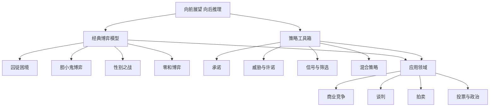

# 《策略思维》深度读书笔记

> [!abstract] 全书速览
> 这本书的核心信息只有一句话：在互动决策中，你的最优选择取决于对手的选择，而对手的选择又取决于你的选择。学会"站在对手的立场上向前看，然后从终点倒推回来"，你就掌握了策略思维的精髓。迪克西特和奈尔伯夫把博弈论从数学家的黑板搬进了你的日常生活——从商业谈判到职场博弈，从国际冲突到约会策略。

## 这本书要解决什么经济问题

阿维纳什·迪克西特是普林斯顿大学经济学教授，巴里·奈尔伯夫是耶鲁大学管理学院教授。1991年出版的《策略思维》是第一本将博弈论从学术殿堂带入大众视野的通俗读物。

> [!note] 问题的起点
> 传统的决策分析假设你面对的是"大自然"——天气要么下雨要么不下雨，概率是固定的，不会因为你带不带伞而改变。但在商业竞争、谈判、政治选举中，你面对的是另一个理性人。你降价，对手也会降价；你出牌，对手会根据你的出牌来调整策略。这种"策略互动"需要完全不同的思维方式。

冯·诺伊曼和摩根斯坦在1944年建立了博弈论的数学框架（参见 [[《博弈论》 - 约翰·冯·诺伊曼]]），但那本书满是数学证明。迪克西特和奈尔伯夫的贡献在于：用丰富的真实案例和生动的故事，把博弈论的核心思维传递给了任何愿意思考的读者。

## 核心模型地图

> [!tip] 核心逻辑
> ==基础概念==提供分析的逻辑起点；==经典博弈模型==提供分类识别的工具；==策略工具==提供改变博弈结构的手段；==应用领域==展示整个框架的实际威力。

## 逐层深入

### 向前展望，向后推理

> [!example] 硬币博弈
> 你和对手轮流从桌上拿硬币，每次可以拿1-3枚，拿到最后一枚的人输。桌上有21枚硬币。从终局倒推：让对手面对只剩1枚的局面，你就赢了。再往回推：剩5枚、9枚、13枚、17枚、21枚且轮到对手都是你的目标。你第一步拿1枚，然后每次让你和对手的总拿数为4，必赢。

这个方法在商业中无处不在——进入新市场前先想清楚竞争对手会怎么反应；定价之前先想清楚对手看到你的价格后会怎么调整。

> [!warning] 局限性
> 向后推理假设你知道博弈的完整结构和所有参与者都完全理性。现实中这两个条件经常不满足。

### 囚徒困境：个人理性的陷阱

==每个人都做出对自己最好的选择，结果却对所有人都不好。==价格战是典型的囚徒困境：两家公司都想降价抢客户，结果双方都降价，利润一起缩水。

走出囚徒困境的四种机制：
- **重复博弈**：今天的背叛在明天遭到报复。"以牙还牙"策略——简单、善良、有报复性、宽容
- **声誉机制**：品牌本质上是一种合作的承诺
- **外部执行**：合同法把囚徒困境变成合作博弈
- **改变收益结构**：让合作的回报压倒背叛的诱惑

### 承诺的力量

> [!tip] 反直觉洞见
> ==在策略互动中，主动限制自己的选择有时反而能让你处于更有利的位置。==项羽破釜沉舟不是疯狂，而是高明的承诺策略——一个无路可退的军队更可怕。

有效承诺的三个条件：**可观察**、**不可逆**、**可信**。

商业案例："最惠国条款"——承诺给所有客户相同最低价——看似限制灵活性，实际上给了你拒绝降价的坚实理由。

### 威胁与许诺

==最好的威胁是永远不需要执行的威胁。==如果威胁需要执行，说明它没有达到目的。核威慑（MAD）就是这个原理的极端案例。

### 信号与筛选

在信息不对称中，说话是廉价的。==有效的信号必须是昂贵的，而且对"好类型"来说成本更低。==

> [!example] 信号案例
> - 教育学位是能力信号——因为只有聪明和有毅力的人才能顺利毕业
> - 长期保修是质量信号——因为对产品有信心的公司退货率低
> - 高价可以是高品质信号——因为低质量产品无法承受高价带来的客户流失

**筛选**是不知情方设计机制来区分对方类型。保险公司用不同免赔额方案让客户"自动暴露"风险类型。

### 混合策略

==在某些博弈中，任何可预测的行为模式都会被对手利用。==点球大战中最优策略是以精心计算的概率随机选择方向。研究数据证实顶级球员的表现确实接近混合策略均衡。

### 谈判的博弈论

- **BATNA**（最佳替代方案）是你在谈判中最重要的筹码
- **谈判区间**是双方BATNA之间的空间
- **锚定效应**：在信息不对称的情况下，先出价通常有利

### 拍卖与赢家诅咒

> [!warning] 赢家诅咒
> 在共同价值拍卖中，赢家往往是那个对价值估计最高的人——也就是最可能高估的人。如果你"赢了"，想想是不是因为其他人看到了你没看到的风险。

## 预测与现实

博弈论在商业竞争分析、拍卖设计、谈判策略中的应用已成为主流。混合策略在体育竞技中的预测被数据支持。但一些核心预测也遇到挑战——实验中人们经常在一次性囚徒困境中选择合作，在最后通牒博弈中拒绝不公平但对自己有利的分配。这催生了行为博弈论。

## 不同学派怎么说

**行为经济学派**认为理性假设过强。参见 [[《思考，快与慢》 - 丹尼尔·卡尼曼]]。

**演化博弈论**提供了替代框架——策略通过试错和学习来演化，均衡不是算出来的而是自然选择的结果。

**批评者**指出把人类互动全部还原为"博弈"可能忽视了信任、友情和道德感的力量。

## 对你意味着什么

这本书给你一副看到互动结构的眼镜。面对商业决策时，先识别博弈类型：是囚徒困境？胆小鬼博弈？还是协调博弈？进入谈判前，先明确你和对方的BATNA。观察商业竞争时，留意"看不见的策略"——一个看似不理性的决定可能是在发送信号、建立承诺或改变博弈规则。

## 延伸阅读

- [[《博弈论》 - 约翰·冯·诺伊曼]]：博弈论的数学源头，需要相当的数学功底
- [[《合作的进化》]]（阿克塞尔罗德）：用计算机锦标赛研究竞争中合作如何涌现
- 《谈判力》（费希尔和尤里）：博弈论在谈判中的最实用框架
