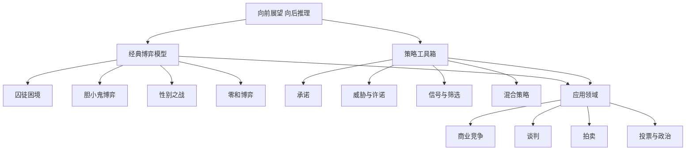

# 《策略思维》深度读书笔记

> [!abstract] 全书速览
> 这本书的核心信息只有一句话：在互动决策中，你的最优选择取决于对手的选择，而对手的选择又取决于你的选择。学会"站在对手的立场上向前看，然后从终点倒推回来"，你就掌握了策略思维的精髓。迪克西特和奈尔伯夫把博弈论从数学家的黑板搬进了你的日常生活——从商业谈判到职场博弈，从国际冲突到约会策略。

## 这本书要解决什么经济问题

阿维纳什·迪克西特是普林斯顿大学经济学教授，国际贸易和博弈论领域的顶级学者，曾任美国经济学会主席。巴里·奈尔伯夫是耶鲁大学管理学院教授，专注于博弈论在商业中的应用，同时也是一位成功的企业家。1991年出版的《策略思维》是第一本将博弈论从学术殿堂带入大众视野的通俗读物。

> [!note] 问题的起点
> 传统的决策分析假设你面对的是"大自然"——天气要么下雨要么不下雨，概率是固定的，不会因为你带不带伞而改变。但在商业竞争、谈判、政治选举中，你面对的是另一个理性人。你降价，对手也会降价；你出牌，对手会根据你的出牌来调整策略。这种"策略互动"需要完全不同的思维方式。

要理解这个问题的实际分量，你需要区分两种决策情境。"对自然的决策"——带不带伞——用传统概率论就够了。"对人的决策"——降不降价——则涉及相互依存：对手的行动取决于他对你行动的预期，而你的行动也取决于你对他行动的预期。传统MBA课程中的会计、运营、营销大多假设竞争环境是"给定的"，但你最重要的商业决策几乎都涉及策略互动。

冯·诺伊曼和摩根斯坦在1944年建立了博弈论的数学框架（参见 [[《博弈论》 - 约翰·冯·诺伊曼]]），纳什在1950年提出了均衡概念，但这些都是写给数学家和经济学家的。迪克西特和奈尔伯夫有意避开所有数学公式，用直觉和例子替代定理和证明，让任何愿意思考的读者都能掌握策略思维。这本书被翻译成十多种语言，至今仍是全球商学院博弈论课程的首选教材之一。

## 核心模型地图

> [!tip] 核心逻辑
> ==基础概念==（向前看向后推、纳什均衡）提供分析的逻辑起点；==经典博弈模型==提供分类识别的工具，就像医生的诊断分类；==策略工具==提供改变博弈结构的手段；==应用领域==展示整个框架的实际威力。

## 逐层深入

### 向前展望，向后推理

在技术上对应"逆向归纳法"，迪克西特和奈尔伯夫把它变成了一种日常思维习惯。

> [!example] 硬币博弈
> 你和对手轮流从桌上拿硬币，每次可以拿1-3枚，拿到最后一枚的人输。桌上有21枚硬币。大多数人"向前猜测"很快迷失。向后推理：让对手面对只剩1枚——再推，剩5枚、9枚、13枚、17枚、21枚且轮到对手都是你的目标。你第一步拿1枚，然后每次让你和对手的总拿数为4，必赢。

商业中无处不在：进入新市场前先想竞争对手会怎么反应（是价格战还是默认？取决于对手的成本结构和战略目标）；定价前先想对手看到价格后会怎么调整；求职谈判中先想公司看到你的要求后会怎么反应。

> [!warning] 局限性
> 向后推理假设你知道博弈的完整结构和所有参与者都完全理性。蜈蚣博弈中理论预测第一步就应停止，但实验中人们通常继续很多轮。有限次重复囚徒困境中理论预测永远不合作，但人们前期经常合作。

### 囚徒困境：个人理性的陷阱

==每个人都做出对自己最好的选择，结果却对所有人都不好。==个人理性可以导致集体非理性。"招供"是优势策略，但双方招供远不如双方沉默。

价格战、军备竞赛、公共地悲剧都是这个结构。2010年代中国网约车补贴大战是教科书案例：多个平台疯狂补贴用户，行业整体巨额亏损。冷战期间美苏核弹数量远超"毁灭一次"所需——囚徒困境驱动的军备竞赛。

走出困境的四种机制：
- **重复博弈**：今天的背叛明天遭到报复。"以牙还牙"策略：善良、有报复性、宽容、清晰——在阿克塞尔罗德的计算机锦标赛中胜出。在重复互动中好人不吃亏，但前提是有报复能力
- **声誉机制**：品牌本质上是合作的承诺。百年老店可靠不是因为道德，而是声誉投资太大
- **外部执行**：合同法、WTO争端解决机制让背叛有代价
- **改变收益结构**：引入罚款条款或利润分成，让合作成为最优选择

> [!tip] 关键洞见
> ==改变博弈规则比在既有规则中挣扎更有效。==

### 承诺的力量

> [!tip] 反直觉洞见
> ==在策略互动中，主动限制自己的选择有时反而能让你处于更有利的位置。==因为对手会观察你的选择空间并据此调整策略，你的选择空间本身就影响博弈结果。

项羽破釜沉舟、科尔特斯凿沉船队——无路可退的军队更可怕。"最惠国条款"看似限制灵活性，实际给了你拒绝降价的坚实理由。沃尔玛"天天低价"消除消费者"等待降价"的动机。

有效承诺的三个条件：**可观察**、**不可逆**、**可信**。

"自动触发机制"（违约金条款、自动制裁条款）消除了侥幸心理。"授权给代理人"（派出权限有限的谈判代表）看似削弱谈判能力，实际加强了谈判地位。

### 威胁与许诺

==最好的威胁是永远不需要执行的威胁。==如果威胁需要执行，说明它没有达到目的。核威慑（MAD）是极端案例。但深层可信性问题存在：如果对方已发射核弹，报复只导致更多毁灭——你真的会按按钮吗？谢林认为关键是"自动化"报复机制。

许诺面临对称的可信性问题——合同、声誉、自动执行机制是确保可信性的手段。

### 信号与筛选

信息不对称是市场失灵的主要来源。阿克洛夫1970年的"柠檬市场"论文证明信息不对称可导致市场崩溃。

> [!example] 信号案例
> - 教育学位是能力信号——不仅因为教了什么，更因为只有聪明有毅力的人才能毕业。名校门槛高所以信号价值高
> - 长期保修是质量信号——有信心的公司退货率低
> - 餐厅装修水平是食物质量信号——沉没成本只有通过长期经营才能收回

==有效信号必须满足斯彭斯的"分离条件"：对好类型成本低，对坏类型成本高。==

**筛选**是信号的镜像。保险公司用不同免赔额方案让客户"自动暴露"风险类型。航空公司让经济舱"足够不舒服"来筛选价格敏感和时间敏感的乘客。

### 混合策略

==在某些博弈中，任何可预测的行为模式都会被对手利用。==点球大战中最优策略是以精心计算的概率随机选择方向。帕拉西奥斯-韦尔塔的数据分析证实顶级球员表现接近混合策略均衡。税务随机审计比可预测审计更有效。零售商随机打折防止消费者集中在打折时购买。

### 谈判的博弈论

- **BATNA**（最佳替代方案）是最重要的筹码。提升BATNA——多拿offer、多找供应商——比谈判技巧更有效
- **谈判区间**是双方BATNA之间的空间
- **锚定效应**：信息优势时先出价设定锚，信息劣势时让对方先出价
- **时间压力**：鲁宾斯坦模型证明更有耐心的一方拿到更大份额——"能等"本身就是优势

### 拍卖与赢家诅咒

维克瑞拍卖（密封投标、第二高价成交）有美妙的"激励相容"性质：诚实出价就是最优策略。

> [!warning] 赢家诅咒
> 在共同价值拍卖中，赢家往往是最乐观（也最可能高估）的那位。石油开采权拍卖是经典案例。这不限于正式拍卖——企业并购、房产竞拍都面临同样风险。如果你在竞争激烈的竞标中"赢了"，想想是不是其他人看到了你没看到的风险。

### 投票与政治

**策略投票**：理性选民不一定投给最喜欢的候选人。2000年美国大选中纳德可能分流了戈尔的选票。**议程设置**：投票顺序可以完全改变结果，控制议程者拥有不成比例的权力。**阿罗不可能定理**：不存在满足几条合理条件的"完美"投票制度——这是数学定理，不可能被"更聪明的设计"克服。

## 预测与现实

博弈论在商业竞争、拍卖设计、谈判策略中的应用已成主流。混合策略在足球点球和网球发球中的预测被数据支持。但一些核心预测遇到挑战——实验中40-60%的人在一次性囚徒困境中合作，最后通牒博弈中拒绝不公平但有利的分配，跨文化实验中合作比率差异很大。这催生了行为博弈论。

## 不同学派怎么说

**行为经济学派**认为理性假设过强——框架效应、损失厌恶、过度自信使实际行为偏离预测。凯默勒的"认知层级模型"假设策略推理只进行有限层次。参见 [[《思考，快与慢》 - 丹尼尔·卡尼曼]]。

**演化博弈论**：策略通过试错和学习演化，均衡不是算出来的而是自然选择的结果。

**复杂系统理论**：参与者极多时出现涌现行为，均衡分析可能无法捕捉。市场泡沫和崩盘是典型例子。

**批评者**：把人类互动全部还原为"博弈"忽视了信任、友情和道德感。在亲密关系中把对方当"博弈对手"可能恰恰是关系破裂的原因。策略思维是强大工具但不是唯一视角。

## 对你意味着什么

面对商业决策时先识别博弈类型——囚徒困境要建立合作，胆小鬼博弈要让对手相信你不会退让，协调博弈要建立沟通渠道。进入谈判前先明确双方BATNA。观察商业竞争时留意"看不见的策略"——表面亏损的投资可能是"不退出"的信号，过于慷慨的条款可能是建立声誉。

记住最重要的一课：在做决策之前，先站在对手的立场上想一想。你的决策不是在真空中做出的，它会引发连锁反应。预见这些反应，是好决策的前提。

## 延伸阅读

- [[《博弈论》 - 约翰·冯·诺伊曼]]：博弈论的数学源头，需要相当的数学功底
- [[《合作的进化》]]（阿克塞尔罗德）：用计算机锦标赛研究竞争中合作如何涌现
- 《谈判力》（费希尔和尤里）：博弈论在谈判中的最实用框架
- 《合作竞争》（奈尔伯夫和布兰登伯格）：进一步发展了"改变博弈"的商业战略方法论
