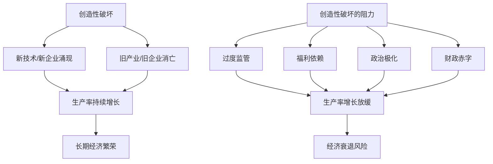

# 《繁荣与衰退》深度读书笔记

> [!abstract] 全书速览
> 美国经济史是一部"创造性破坏"的史诗。格林斯潘和伍尔德里奇从建国时代讲到21世纪，论证美国之所以能从一个农业边陲成长为全球最大经济体，根本动力在于它比任何其他国家都更彻底地拥抱了熊彼特所说的"创造性破坏"——允许旧产业消亡、新产业兴起、失败者出局、创新者上位。而当代美国经济面临的最大威胁，不是来自外部竞争，而是来自内部对创造性破坏的抵制——膨胀的福利体系、僵化的监管、政治极化和财政赤字，正在腐蚀这台曾经高效运转的经济引擎。这本书既是一部经济通史，也是一份来自前美联储主席的政策诊断书。

> [!warning] 掌握度声明
> 本笔记基于对全书核心论点和主要章节的理解撰写，但对部分章节的历史细节（尤其是19世纪铁路扩张、南北战争经济影响的具体数据）了解有限，相关段落侧重逻辑框架而非精确引述。

## 这本书要解决什么经济问题

艾伦·格林斯潘执掌美联储近二十年（1987-2006），经历了1987年股灾、互联网泡沫、911冲击和次贷危机的酝酿期。阿德里安·伍尔德里奇是《经济学人》资深编辑，长期研究资本主义制度史。这本书2018年出版，格林斯潘时年92岁，可以看作他对自己亲历和塑造的那段经济史的总结性反思。

> [!note] 核心问题
> 他们要回答的问题是：==美国经济为什么能持续增长近250年，而今天这种增长动力正在减弱？==答案浓缩在一个概念里——"创造性破坏"。这个概念来自熊彼特，但格林斯潘把它从一个学术术语变成了解读整部美国经济史的主线。

在经济学谱系中，这本书不是纯粹的学术研究，而是一部"政策知情者的经济通史"。格林斯潘的独特价值在于他不只是观察者，还是参与者——他在书中坦率讨论了自己任期内的政策选择及其后果，包括对2008年金融危机的部分责任。伍尔德里奇提供了历史叙事的厚度。两人的合作使这本书兼具内部视角的深度和历史视野的广度。参见 [[《熊彼特经济学》 - 约瑟夫·熊彼特]]。

## 核心模型地图

> [!tip] 关键洞察
> ==美国经济史的核心节奏不是"繁荣-衰退"的简单交替，而是"创造性破坏被接受的程度"的波动。==当社会对创造性破坏的容忍度高时（如镀金时代、战后繁荣、信息革命），经济蓬勃增长；当社会转向保护既有利益、抵制变革时（如大萧条后的过度监管、1970年代的滞涨），增长就停滞。

## 逐层深入

### 建国基因：为什么美国天然适合创造性破坏

格林斯潘把美国经济的起点追溯到建国者的制度设计。与欧洲旧大陆不同，美国从一开始就缺乏一个强大的封建贵族阶层来抵制变革。宪法保护产权和契约自由，联邦制允许各州之间竞争制度方案，广袤的西部边疆为失败者提供了"第二次机会"——在欧洲破产可能意味着社会死亡，在美国你可以去西部重新开始。

> [!example] 破产法的启示
> ==美国的破产法制度是创造性破坏的制度基础设施。==与许多国家惩罚性的破产制度不同，美国的破产法给予失败者东山再起的机会。这降低了创业的风险成本，鼓励了冒险和试错。亨利·福特在成功之前经历过两次公司倒闭。

亚历山大·汉密尔顿作为首任财政部长，建立了联邦信用体系、国家银行和关税保护幼稚工业的政策框架。杰斐逊则代表了农业共和主义的理想。两种愿景的张力贯穿了美国经济史的始终，但格林斯潘认为汉密尔顿的金融资本主义路线最终胜出——因为它更适合创造性破坏的逻辑。

### 镀金时代：创造性破坏的黄金年代

南北战争之后的"镀金时代"（约1870-1900）是创造性破坏最剧烈的时期。铁路、钢铁、石油、电力——每一个新产业的崛起都伴随着旧秩序的瓦解。

> [!tip] 铁路的双重角色
> 铁路不仅是一个新产业，更是一个==平台型基础设施==——它把美国从一个松散的地方经济体拼图变成了统一的全国市场。统一市场意味着规模经济，规模经济意味着大企业的崛起。洛克菲勒的标准石油、卡耐基的钢铁帝国、JP摩根的金融网络，都建立在铁路缔造的全国市场之上。

这个时代的不平等程度惊人——1890年代最富有的1%家庭拥有全国约51%的财富。但格林斯潘的论点是：这种不平等是创造性破坏的副产品而非目的，而这个时代的生产率增长和生活水平提升也是史无前例的。普通美国人的实际工资在1870年到1900年间增长了约50%。电灯、电话、缝纫机等发明从奢侈品变成了大众消费品。

### 进步时代与新政：对创造性破坏的第一次系统性抵制

1900年代到1930年代，美国社会开始系统性地回应创造性破坏的负面效应。反垄断法（1890年谢尔曼法、1914年克莱顿法）试图约束大企业的市场权力。食品药品安全法规回应了"丛林"式的卫生丑闻。这些监管在格林斯潘看来有一部分是必要的——市场需要规则才能运转——但他也认为监管的边界一旦建立就倾向于不断扩张。

1929年大崩盘和随后的大萧条是一个分水岭。罗斯福新政带来了社会保障体系、证券监管（SEC）、银行业分业经营（格拉斯-斯蒂格尔法案）、劳工权利保护等一系列制度变革。

> [!warning] 格林斯潘的新政评价
> 格林斯潘承认新政中部分措施（如FDIC存款保险、SEC证券监管）稳定了金融体系，但他认为新政总体上==过度扩张了政府的角色==，尤其是对企业经营的直接干预（如NRA的行业价格管控）抑制了经济的自我修复能力。他引用数据指出，美国经济直到二战才真正走出大萧条——而不是在新政实施后就恢复了。

### 战后黄金时代：创造性破坏的再释放

1945年到1970年代初是美国经济的"黄金时代"。GDP年均增长约3.8%，中产阶级急剧扩大，实际家庭收入中位数几乎翻倍。格林斯潘指出几个关键驱动力。

战时技术的民用转化是第一推动力——雷达技术催生了微波炉和电视产业，军用航空技术催生了商业航空，合成材料进入了千家万户。《退伍军人权利法案》（GI Bill）资助了数百万退伍军人接受高等教育，极大地提升了劳动力素质。州际高速公路系统的建设（1956年启动）创造了一个新的物流网络，推动了郊区化、购物中心和汽车文化的兴起。

> [!note] 生产率增长的黄金数据
> ==1948年到1973年间，美国劳动生产率年均增长约2.8%。==这个数字看似平淡，但复利效应惊人——按此速度，每25年产出就翻一倍。格林斯潘反复强调：生产率增长是唯一可持续的繁荣来源，其他一切——货币政策、财政刺激、贸易政策——都是配角。

### 1970年代滞涨：系统告警

1970年代是美国经济的转折点。通胀和失业同时上升（"滞涨"），这在凯恩斯主义框架下是不可能的。格林斯潘的诊断是多因素的：约翰逊的"伟大社会"计划大幅扩张了政府支出和福利体系，越战军费加剧了财政赤字，尼克松1971年关闭"黄金窗口"终结了布雷顿森林体系，1973年和1979年两次石油危机冲击了供给侧。

但在格林斯潘看来，更深层的原因是==监管积累对创造性破坏的窒息==。从新政到1970年代，联邦监管条文的页数增长了数倍。航空、电信、能源、金融——几乎每个行业都被密集的管制包裹。企业把越来越多的资源用于应对监管而非创新。劳工法规使得解雇低效率工人变得困难，阻碍了劳动力的重新配置。

> [!tip] 沃尔克的"痛苦药方"
> 1979年保罗·沃尔克就任美联储主席，把联邦基金利率提高到20%以上，引发了1981-1982年的严重衰退（失业率超过10%），但成功地将通胀从两位数压降到4%以下。格林斯潘高度评价沃尔克的勇气——==他愿意承受短期的巨大政治成本来治愈长期的经济疾病。==这也是格林斯潘理解的央行角色：不是讨好政治家和选民，而是做正确但不受欢迎的事。

### 里根革命与信息时代：创造性破坏的又一个高潮

1980年代的放松管制浪潮——航空、电信、金融、运输——重新释放了创造性破坏的能量。AT&T的拆分催生了一个竞争性的电信市场，最终为互联网的普及铺平了道路。航空管制的解除让票价大幅下降，飞行从精英特权变成了大众消费。

> [!example] 互联网革命的生产率效应
> 1990年代中后期，美国劳动生产率增速从之前二十年的约1.5%跳升到2.5%以上。格林斯潘是最早在美联储内部提出"新经济"论点的人——他判断信息技术正在实质性地提升生产率，因此美联储可以容忍更快的经济增长而不必急于加息。这个判断在当时极具争议，但后来被证明基本正确。==信息技术是继蒸汽机、电力之后第三次真正改变游戏规则的通用技术。==

格林斯潘同时讨论了自己任期内的争议。他承认在互联网泡沫时期（1990年代末）本可以采取更积极的措施遏制投机，但他也辩解说，央行很难在事前准确识别泡沫——"非理性繁荣"的演讲发表于1996年12月，但股市之后又涨了三年多。参见 [[《非理性繁荣》 - 罗伯特·席勒]]。

### 2008年金融危机：格林斯潘的反思

这是全书最坦诚也最引人注目的章节之一。格林斯潘承认他对金融体系的自我纠错能力过于乐观。他长期相信，金融机构出于自身利益会进行充分的风险管理——如果你的钱在赌桌上，你自然会小心。但2008年证明这个假设是错的——系统性的激励扭曲（"别人的钱"效应、短期奖金文化、"太大而不能倒"的隐性担保）使得风险管理失效。

> [!warning] 格林斯潘的"部分认错"
> ==格林斯潘承认他对衍生品市场的监管态度过于宽松==，但他不接受2008年危机完全是货币政策过松的结果。他引用数据指出，全球长期利率在2000年代初开始下降（"格林斯潘之谜"），这是全球储蓄过剩和亚洲央行大量购买美国国债的结果，不完全是美联储的政策选择。他也把部分责任归于政府推动住房自有率的政策（两房的隐性担保扭曲了住房市场的风险定价）。参见 [[《大空头》 - 迈克尔·刘易斯]]。

### 当代困境：创造性破坏的四个敌人

全书的后半部分转向对当代美国经济困境的分析。格林斯潘识别了四个正在侵蚀创造性破坏动力的结构性问题。

第一个是==福利支出的不可持续增长==。社会保障和医疗保险（Medicare/Medicaid）支出占GDP的比例持续上升，预计到2030年代将消耗联邦预算的绝大部分。这不仅意味着财政赤字的持续扩大，更意味着政府把越来越多的资源从投资（基础设施、研发、教育）转移到了消费转移支付。用格林斯潘的话说，美国正在用未来的生产力来支付当下的消费。

第二个是监管的累积性窒息效应。每一条监管规则单独看可能是合理的，但它们叠加在一起形成了一个沉重的合规成本。《多德-弗兰克法案》（2010年）虽然回应了金融危机的监管教训，但其复杂性也大幅提高了中小银行的经营成本，间接减少了对小企业的信贷供给。

第三个是生产率增长的长期放缓。2004年之后，美国劳动生产率增速降到约1.3%，远低于战后黄金时代的2.8%。格林斯潘认为这不是因为技术创新停滞了，而是因为创新成果转化为生产率的管道——企业投资、劳动力流动、竞争性市场——被各种制度摩擦堵塞了。

第四个是政治极化导致的制度僵化。两党在财政、移民、贸易等关键问题上的分歧越来越大，妥协空间越来越小。结果是必要的结构性改革——社会保障改革、税制简化、移民政策调整——长期搁置。政治体制的决策效率下降本身就是对创造性破坏的一种阻碍。

### 不平等问题：格林斯潘的"生产率药方"

格林斯潘没有回避收入不平等加剧这个问题。自1970年代以来，实际工资中位数几乎停滞，而高收入群体的收入大幅增长。但他的诊断与主流进步派不同。

> [!note] 格林斯潘的不平等观
> ==格林斯潘把不平等的根源归于教育和技能溢价的拉大==，而非资本主义制度本身的缺陷。技术进步提高了对高技能劳动力的需求，而美国的教育系统未能跟上——K-12教育质量停滞、大学学费飙升、职业教育薄弱。他的药方不是再分配（他认为这会削弱激励），而是提高教育质量和劳动力技能，使更多人能够参与而非被排斥在创造性破坏的成果之外。

## 预测与现实

格林斯潘在书中对生产率增长放缓和财政赤字不可持续的判断，到目前为止被证实了。2020年代美国联邦债务占GDP比例突破了120%，两党都没有认真对待长期财政问题。生产率增长虽然在2020年疫情后短暂反弹，但长期趋势仍然低迷。

但他对监管过度的判断有一个复杂的对冲案例——2023年硅谷银行的倒闭正是监管放松（2018年《经济增长、监管放松和消费者保护法》将加强审查的门槛从500亿美元提高到2500亿美元）的直接后果。这说明监管的最优边界是动态的，不是简单的"越少越好"。参见 [[《债务危机》 - 瑞·达利欧]]。

AI技术的爆发式发展（2022年以来）部分印证了格林斯潘的乐观——创造性破坏的引擎没有熄火，新一轮通用技术革命可能正在展开。但AI同时也在加剧他所担忧的技能极化——高技能工人受益，低技能工人面临替代风险。

## 不同学派怎么说

**新凯恩斯主义**（克鲁格曼、斯蒂格利茨等）对格林斯潘的"创造性破坏万能论"持强烈批评。他们认为格林斯潘低估了市场失灵的普遍性和严重性，高估了市场自我纠错的能力。2008年危机在他们看来恰恰证明了放松监管的危险。克鲁格曼直接把格林斯潘列为危机的"罪魁祸首"之一。

**制度经济学**（阿西莫格鲁、罗宾逊等）从更深层的视角指出，创造性破坏能否被一个社会接受，取决于该社会的政治制度是"包容性"还是"攫取性"的。美国的成功不仅是因为拥抱了创造性破坏，更是因为其民主制度使得利益受损者可以通过政治渠道获得补偿，从而降低了对变革的抵抗。参见 [[《经济学的思维方式》 - 托马斯·索维尔]]。

**后凯恩斯主义和MMT**认为格林斯潘对财政赤字的担忧过度了。拥有货币主权的政府面临的真正约束不是财政空间而是通胀压力。但2022年的通胀飙升给这个论点泼了冷水。

**皮凯蒂的资本回报率分析**提供了不平等问题上的系统性反驳——当资本回报率持续高于经济增长率（r > g）时，不平等是资本主义的内生趋势，仅靠教育和技能培训无法根治。格林斯潘的"生产率药方"在这个框架下显得过于乐观。

## 对你意味着什么

这本书的最大价值，是让你用"创造性破坏"这个镜头重新审视经济变化。当一个新技术或新商业模式出现并摧毁旧有格局时——无论是AI替代白领工作、电商消灭实体零售，还是新能源颠覆石化产业——你的第一反应不应是恐惧和抵制，而是理解这正是经济进步的方式。问自己：我是在被破坏的一侧还是创造的一侧？如何调整自己的位置？

同时也要警惕格林斯潘视角的盲区。创造性破坏的"创造"部分往往集中在少数人手中，而"破坏"部分则由大量普通人承受。一个健康的经济体不仅需要释放创造性破坏的力量，还需要安全网和再培训机制来帮助被破坏者重新站起来。这两者不是对立的，而是互补的。

## 延伸阅读

- [[《熊彼特经济学》 - 约瑟夫·熊彼特]]：创造性破坏概念的原始出处
- [[《逃不开的经济周期》 - 拉斯·特维德]]：从周期理论的角度补充对美国经济波动的理解
- [[《大衰退》 - 辜朝明]]：对2008年后经济停滞的另一种解释——资产负债表衰退
- 《国家为什么会失败》（阿西莫格鲁和罗宾逊）：从制度视角解释创造性破坏为何只在部分社会发生
- [[《反脆弱》 - 纳西姆·塔勒布]]：从系统韧性角度理解为什么允许小型破坏反而增强整体稳健性
