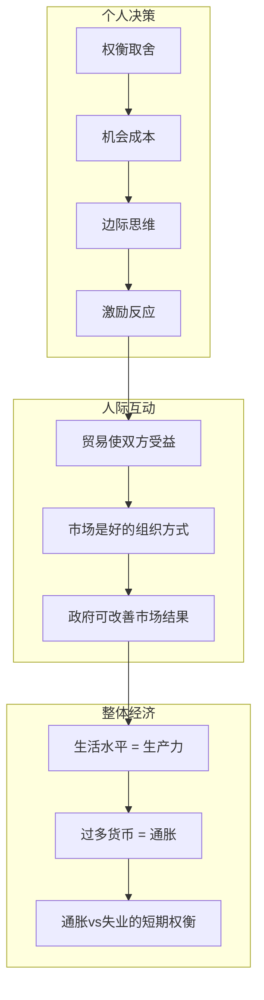

# 《经济学原理》深度读书笔记

> [!abstract]
> 曼昆的《经济学原理》是全球销量最大的经济学入门教材，用极其清晰的方式将经济学两百多年积累的核心智慧整合成一个连贯体系。他提出的"经济学十大原理"为全书搭建骨架，让微观和宏观的所有核心问题都能在统一框架下理解。如果你只打算读一本经济学书，这本是最不会出错的选择。

## 这本书要解决什么经济问题

曼昆要解决的不是某个具体经济问题，而是一个更基础的问题：==如何让一个没有经济学背景的人系统地理解经济世界的运作逻辑？==

> [!note] 作者背景
> 曼昆是哈佛大学经济学教授，曾任小布什政府经济顾问委员会主席。学术立场属于"新凯恩斯主义"——承认市场力量，也承认市场失灵和政府干预的必要性。

全书分为微观经济学和宏观经济学两大部分。微观分析个人和企业的决策、市场运作和市场失灵；宏观分析GDP、通胀、失业、货币政策和财政政策。两部分由"十大原理"串联成有机整体。

## 核心模型地图

**十大原理**分三组：
- 个人决策：权衡取舍、机会成本、边际思维、激励反应
- 人际互动：贸易互利、市场协调、政府角色
- 整体经济：生产力决定生活水平、货币与通胀、通胀-失业权衡

## 逐层深入

### 机会成本：经济学思维的起点

> [!tip] 核心定义
> ==做一件事的真正成本，是你为此放弃的另一件事的价值。==

读大学的机会成本不只是学费，还包括四年全职工作能赚到的收入。这个思维迫使你看到被忽视的选择。

> [!warning] 沉没成本谬误
> 花了100元买的电影票，发现电影无聊——坚持看完是因为"不想浪费"。但那100元已经花了，无论看不看都拿不回来。真正的问题是：接下来两小时怎么用最有价值？

### 边际思维与激励

> [!tip] 边际思维
> 理性决策比较的不是总收益和总成本，而是==多做一点的额外收益和额外成本==。

航空公司起飞前有空座，以低于平均成本的价格卖出合理吗？只要票价高于多运一人的边际成本（几乎为零），就是合理的。

> [!example] 钻石与水的悖论
> 水比钻石"重要"得多，但钻石比水贵得多——因为钻石的边际一单位极其稀缺，而水的边际一单位非常充裕。==价值由边际效用决定，不是由总效用决定。==

**激励原理**：改变激励就能改变行为。为什么出租车在下雨天更难叫到？为什么医生有时建议不必要的检查？==几乎所有行为都可以从激励结构角度理解。==

### 供给与需求：市场的核心引擎

- 需求定律：价格上升→需求量下降
- 供给定律：价格上升→供给量增加
- 均衡：两条曲线交叉点决定价格和数量

> [!warning] 价格管制的陷阱
> **房租上限**：短期保护租客，长期导致房东减少供给→住房短缺。**最低工资**：可能导致低技能工人失业——但实证研究显示适度提高的负面影响可能比理论预测的小。==好的意图不等于好的结果。==

### 弹性：谁承担价格变化的后果

==弹性==衡量需求量或供给量对价格变化的敏感度。

> [!example] 税收负担分析
> 政府对香烟加税100元——是消费者还是生产者承担？取决于弹性。烟民需求刚性（戒不掉），大部分税收负担转嫁给消费者。

丰收悖论：食物需求弹性低→丰收导致价格暴跌→农民总收入反而下降。这是理解农业补贴政策的关键。

### 市场失灵

> [!warning] 市场不是万能的
> 三种主要市场失灵：
> 1. **外部性**：工厂污染影响居民但不支付成本→解决方案：碳税、环境法规
> 2. **公共品**：国防无法排除不付费者使用→需要政府提供
> 3. **市场势力**：垄断企业定高价→需要反垄断法

承认市场失灵不是否定市场，而是理解市场的边界。

### GDP、通胀与失业

> [!tip] 生活水平的决定因素
> ==一国的生活水平取决于生产力==——不是货币数量、不是贸易顺差、不是自然资源。

> [!warning] GDP的局限
> GDP不衡量收入分配、环境质量和闲暇。一个GDP高但贫富悬殊的社会，大多数人可能过得并不好。

**通胀**长期是货币现象（钱印多了）；短期可能由需求拉动、成本推动或预期自我实现。

**菲利普斯曲线**：社会面临通胀与失业的短期权衡——刺激经济降低失业可能推高通胀，抑制通胀可能升高失业。

### 货币政策与财政政策

- **货币政策**（央行）：调整利率和货币供应→降息刺激需求，加息抑制过热
- **财政政策**（政府）：增加支出或减税→提振需求，但可能累积债务、产生挤出效应

> [!note] 学派分歧
> 古典主义者更信任市场自我调节，倾向少干预；凯恩斯主义者强调市场失灵，主张积极干预。曼昆的新凯恩斯主义试图在两者间取得平衡。

### 比较优势与自由贸易

> [!tip] 比较优势
> ==即使一个国家在所有产品上都比另一个国家高效，两国仍可通过贸易互利——只要它们在不同产品上的相对效率不同。==

> [!warning] 贸易的分配问题
> 贸易让整体更富裕，但在国内可能让某些行业工人失业。赢家收益理论上足以补偿输家——但补偿往往不会发生。

## 预测与现实

供需分析、弹性、外部性、比较优势等核心模型被反复验证为有用的思维工具。但曼昆呈现的某些"共识"在学界内部并非完全一致（最低工资效应、财政乘数等）。

> [!note] 这本教材的真正价值
> 不在于给你正确答案，而在于给你==正确的思考框架==。具体结论可能随新证据修正，但机会成本、边际思维、激励分析这些工具的价值是持久的。

## 不同学派怎么说

- **奥地利学派**：经济学不应模仿物理学建模，应基于人类行动的逻辑推理；对政府干预更警惕
- **马克思主义**：主流经济学忽略阶级关系和权力结构；利润不是资本的正当回报而是剥削
- **行为经济学**：挑战"理性人"假设——人们系统性偏离理性决策（框架效应、损失厌恶、过度自信）
- **现代货币理论**：曼昆的宏观过于依赖新古典综合，忽略金融不稳定性和货币内生性

## 对你意味着什么

- **机会成本思维**：下次做决定时问——我为此放弃了什么？那个值多少？
- **激励分析**：遇到不合理行为先分析激励结构——几乎都能解释
- **看不见的代价**：对"看起来很好"的政策保持警觉——每个政策都有隐性成本
- **贸易不是零和**：买卖双方都从交易中获益，把这个逻辑扩展到国际贸易

## 延伸阅读

- [[《国富论》]]：现代经济学的源头，曼昆教材中几乎所有微观概念都可追溯至此
- [[《魔鬼经济学》]]：展示经济学思维如何应用于各种非传统问题，和曼昆教材互补
- [[《就业、利息和货币通论》]]：宏观经济学部分的思想源头，原著中的洞察比教材版更深刻
