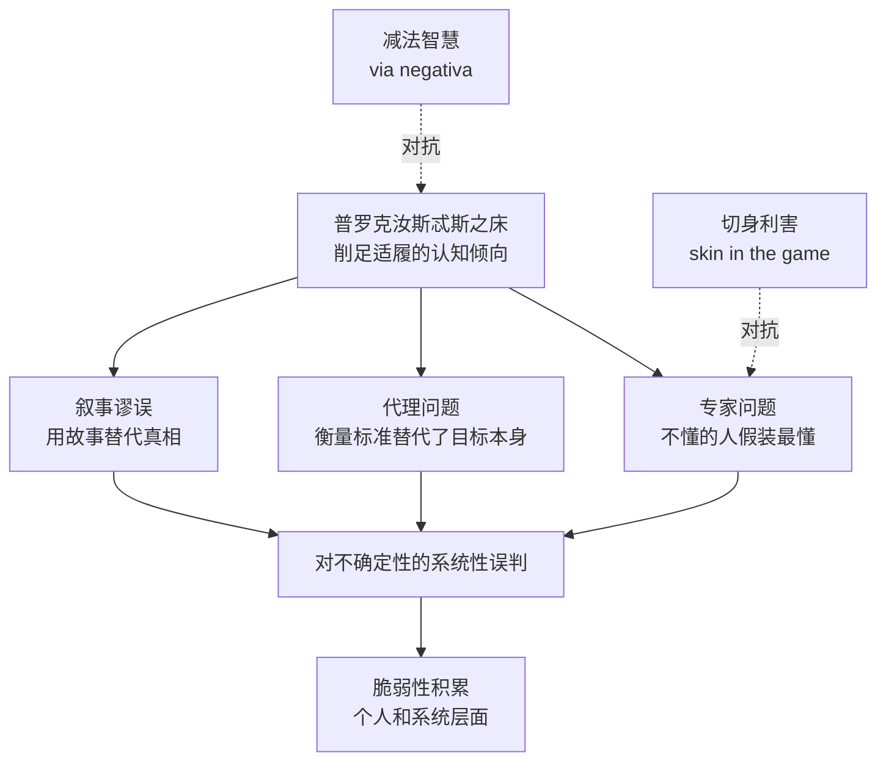

# 《肤浅之下》深度读书笔记

> [!abstract] 全书速览
> 《肤浅之下》（The Bed of Procrustes）是塔勒布"不确定性"系列（Incerto）中最特殊的一部——不是论证式的专著，而是一本格言集（aphorisms）。书名取自希腊神话中普罗克汝斯忒斯的铁床：这位强盗用一张铁床来"适配"路人，太高的截短，太矮的拉长——==我们对待现实也是如此，不断削足适履，把复杂世界强行塞进简化的框架、理论和叙事中==。全书收录了数百条格言，涵盖认识论、概率、伦理、成功与失败、现代性、宗教、美学等领域，每一条都试图揭露我们在面对不确定性时的自欺行为。这不是一本"读完就懂"的书，而是一本需要你反复咀嚼、在生活中不断验证的书——每条格言都是一粒浓缩的思想炸弹，在不同的人生阶段会引爆不同的领悟。

---

## 这本书要解决什么经济问题

> [!note] 核心困惑
> ==为什么人类在面对复杂世界时，总是倾向于用过度简化的框架来理解它，并且对这种简化毫无自觉？这种系统性的认知扭曲，在经济决策、风险管理和日常生活中造成了怎样的后果？==

这个问题不是以通常的经济学论文形式提出的，而是以格言的方式——一种最古老的知识传递形式——来拆解。塔勒布选择格言体裁不是出于偷懒，而是出于认识论上的诚实：当你面对的是一个非线性、不可还原的复杂世界时，==试图用一套连贯的线性叙事来"解释"它，本身就是普罗克汝斯忒斯铁床式的削足适履==。格言的碎片化恰恰尊重了现实的碎片化——每条格言照亮一个局部，但不假装自己能照亮全局。

在塔勒布的整个Incerto系列中，这本书扮演着特殊角色。[[《随机漫步的傻瓜》]]揭示了我们被随机性欺骗的程度，[[《黑天鹅》]]论证了极端事件的不可预测性，[[《反脆弱》]]提出了在不确定性中获益的系统方法，而《肤浅之下》则是对一个更底层问题的追问：==我们的认知工具本身就是扭曲的，我们用来理解不确定性的那些概念框架、叙事结构和理论模型，本身就在制造新的盲区==。

> [!tip] 为什么放在经济金融类
> 虽然这本书不是传统意义上的经济学著作，但它的核心关切——人类如何在不确定性中做决策、为什么系统性地犯错、制度和专家如何制造虚假的确定感——与经济金融领域的每一个重大问题直接相关。2008年金融危机、长期资本管理公司的崩溃、各类市场泡沫，背后都有"把复杂现实强行塞进简单模型"的认知根源。

## 核心模型地图

塔勒布在这本格言集中没有像其他著作那样构建显性的理论框架，但有几个隐含的概念内核贯穿全书：

- **普罗克汝斯忒斯之床（核心隐喻）**：人类不是用理论适配现实，而是把现实削切成理论能容纳的形状。这发生在所有层面——从个人的自我叙事（"我的失败都是命运不公"）到学术界的模型崇拜（"现实不符合模型，那一定是现实错了"）
- **减法智慧（via negativa）**：==真正的知识不是通过增加信息获得的，而是通过减少错觉获得的==。知道什么是错的，比知道什么是对的更可靠、更有用
- **代理问题**：当我们无法直接衡量一个事物时，就用一个可衡量的替代指标来代替——然后逐渐忘记那个替代指标不是事物本身。GDP不等于幸福，论文数量不等于学术贡献，简历不等于能力
- **切身利害（skin in the game）**：没有承担后果的人，不应该为承担后果的人做决策——这是塔勒布后来专门写了一整本书（[[《非对称风险》]]）来展开的主题，在这本格言集中已经以压缩的形式出现

> [!important]
> 这四个概念不是平行的，而是有层次的。普罗克汝斯忒斯之床是病症描述，代理问题和叙事谬误是具体病理，减法智慧和切身利害是开出的处方。

## 逐层深入

### 铁床隐喻：我们如何系统性地扭曲现实

普罗克汝斯忒斯是希腊神话中阿提卡的一个强盗。他有一张铁床，专门用来"款待"路过的旅人——如果旅人比床长，他就截掉多出来的部分；如果比床短，他就把旅人的身体拉长。塔勒布用这个意象来描述一种无处不在的认知行为：==我们不是调整理论来适配现实，而是削切现实来适配理论==。

这种倾向的根源在于人类认知的基本架构。你的大脑需要秩序、因果、叙事——面对一堆随机事件，你会不由自主地编织出一个"故事"来"解释"它们。面对一个复杂系统，你会不由自主地抽取几个变量建立一个"模型"来"理解"它。这些故事和模型让你感到安心，但安心的代价是盲区：那些被削掉的、不符合你框架的信息，恰恰可能包含最重要的风险信号。

> [!example] 塔勒布的格言
> "我们把不理解的东西称为随机的；把不想理解的东西称为确定的。"
>
> "教育让人以系统化的方式犯错——教育把铁床做得更精致了。"

在经济金融领域，铁床效应尤其致命。金融模型（如VaR——风险价值模型）假设收益率服从正态分布，把"肥尾"事件削掉了——然后2008年，那些被削掉的"不可能事件"集体发生了。经济预测模型假设未来是过去的线性延伸，把结构性断裂的可能性削掉了——然后每一次衰退都"出乎意料"。

> [!warning] 核心洞察
> ==铁床效应最危险的地方在于它是不自觉的。你不知道自己在削足适履，你以为自己在"理解世界"。被削掉的那部分信息不是消失了，而是变成了你的盲区——而盲区是风险滋生的温床。==

### 叙事谬误与因果幻觉

塔勒布在格言集中反复攻击的一个靶子是人类对"故事"的沉迷。我们天然需要因果叙事——"因为A所以B"——来组织经验。但在一个充满随机性的世界里，大部分"因为A所以B"都是事后编造的幻觉。

> [!quote] 代表性格言
> "成功的人找到成功的'原因'；失败的人也找到失败的'原因'。两者都是事后构建的叙事。"
>
> "报纸的存在价值，不在于让你了解世界，而在于给你一种了解世界的错觉。"
>
> "历史学家把自己想象成倒放电影的导演——他们看到结果后倒推'原因'，然后声称这个原因是'必然的'。"

这些格言指向一个对经济决策极为重要的事实：==你以为自己是基于分析做决策，但很大程度上是基于叙事做决策==。你买入一只股票不是因为你真正理解了这家公司的所有变量，而是因为你心中有一个关于它的"故事"——"AI革命的最大受益者""被低估的价值股""下一个特斯拉"。这个故事让你感到确定，但确定感和正确性是两回事。

叙事谬误在宏观经济层面的表现更加严重。每一轮牛市都有一个令人信服的叙事（"新经济""中国世纪""AI生产力革命"），每一次崩盘之后人们也能编出一个令人信服的叙事来"解释"崩盘——==问题在于，崩盘前的那个叙事和崩盘后的那个叙事往往互相矛盾，但持有它们的可能是同一批人==。

> [!tip] 塔勒布的处方
> 不是"不要讲故事"——那不可能，叙事是人类认知的底层架构。而是==对自己的叙事保持警觉：你正在用哪个故事来理解当前的局面？这个故事删掉了什么？如果故事的反面是真的，你会怎样？==

### 代理问题：当衡量标准吞噬了目标本身

这是《肤浅之下》中最具经济学意味的一组格言。塔勒布观察到一个普遍现象：当你为一个复杂目标设立可量化的代理指标时，人们会开始优化代理指标本身，而忘记了它代表的那个目标。

> [!quote] 代表性格言
> "我们用能衡量的东西来代替重要的东西，然后慢慢忘记了：我们衡量的那个东西并不重要。"
>
> "学术界：一群互相评判论文的人。论文的读者就是其他论文的写作者。"
>
> "现代人不是运动员，而是运动数据收集者。"

==GDP是经济福祉的代理指标，但当政策制定者为GDP本身而非福祉优化时，就出现了污染不计入成本、金融投机算作"产出"、公共服务被削减以"减少政府支出"的荒诞现象。==信用评级是企业偿债能力的代理指标，但当整个金融体系围绕评级而非真实风险运转时，评级机构给次贷产品打出AAA的那一刻，2008年危机的种子就已经埋下了。

在个人层面，代理问题同样无处不在。你的简历是能力的代理指标，但简历优化和能力提升是两回事。你的社交媒体粉丝数是社会影响力的代理指标，但追逐粉丝和创造真正有价值的内容是两回事。你的收入是人生成功的代理指标，但收入最高的人和生活最满意的人之间的交集，远比你想象的小。

> [!important]
> 代理问题的根源在于==人类对可量化事物的迷恋==。面对一个无法直接衡量的复杂目标（"好的教育""健康的经济""有意义的人生"），你的焦虑会驱使你找到一个可以量化的替代物（考试分数、GDP、收入）。量化让你觉得自己"在控制"，但这种控制感是虚幻的——你控制的是指标，不是它背后那个你真正在意的东西。

### 专家、预测者和"有学问的白痴"

塔勒布对学术界和专家阶层的攻击贯穿他的所有著作，在《肤浅之下》中以格言的形式达到了最尖锐的浓度。

> [!quote] 代表性格言
> "一个人拥有的学位越多，他就越有可能从简历上获得自信，而非从实际成就上。"
>
> "经济学家的预测记录，还不如随机数生成器——至少随机数生成器不会有系统性偏差。"
>
> "学者是那种用脚够不着地面的方式走路的人。"
>
> "如果你的医生自己也抽烟，你应该认真考虑他关于吸烟的建议——不是因为他说了什么，而是因为他自己不信他说的。"

这些格言的锋芒指向一个在经济金融领域尤其严重的问题：==在不确定性最高的领域，恰恰是那些最不了解自己无知边界的人在做"专家"==。经济学家对GDP增长率的预测、金融分析师对股票目标价的预测、央行行长对通胀路径的预测——回头检验这些预测的准确率，会发现它们与投掷硬币的差距并没有想象中那么大。但专家们不会因此变得谦逊，因为他们的激励结构不鼓励谦逊——==说"我不知道"不会让你上电视、得到咨询费或者赢得学术声誉==。

> [!warning] 切身利害的核心
> 塔勒布对专家问题的终极解药是"切身利害"（skin in the game）：如果你要为别人做预测或决策，你必须自己也承担后果。==华尔街分析师推荐你买入一只股票，他自己持有这只股票吗？经济学家建议削减社会保障，他自己需要社会保障吗？==没有切身利害的建议，本质上是免费的看涨期权——说对了获得声誉，说错了不用承担任何代价。

### 减法智慧：知道什么是错的比知道什么是对的更有价值

如果说整本格言集有一个最接近"核心方法论"的东西，那就是via negativa——减法智慧。

> [!quote] 代表性格言
> "最强大的不是补充知识的人，而是减少错觉的人。"
>
> "对一本书最好的赞美不是'它告诉了我什么'，而是'它让我停止相信什么'。"
>
> "成功的秘诀不在于做对了什么，而在于持续避免了做错什么。"
>
> "技术进步是做减法：在发明洗衣机之前没人知道自己需要洗衣机；发明之后你减少了手洗衣服的痛苦。"

这个思想对投资和经济决策的启示极为深刻。==传统的决策方法是"寻找最优解"——分析所有选项，选择预期回报最高的那个。塔勒布的方法是"排除最劣解"——你不需要知道什么是最好的投资，你只需要知道什么是最糟糕的投资并避开它。==

在投资中，这意味着：与其花大量精力预测哪只股票会涨最多（这件事没有人能持续做到），不如花精力避开那些可能让你血本无归的风险——过度杠杆、集中押注、在自己不理解的领域投机。巴菲特说的"第一条规则是不要赔钱，第二条规则是不要忘记第一条规则"，本质上就是via negativa。

在企业管理中，减法智慧意味着：与其不断增加新的流程、新的KPI、新的管理层级来"提升效率"，不如识别并去除那些正在制造摩擦和损耗的环节。

> [!tip] 减法的认识论基础
> ==减法之所以更可靠，是因为否证比证实在逻辑上更有力量。一千个白天鹅不能证明"所有天鹅都是白的"，但一只黑天鹅就能推翻这个命题。==同理，你不知道什么能让你成功（太多变量、太多随机性），但你大致知道什么会让你失败（过度负债、健康崩溃、把全部筹码压在单一赌注上）。在不确定性中，避免失败比追求成功更可靠。

### 现代性的陷阱：更多信息、更少智慧

塔勒布在格言集中对现代生活提出了尖锐的批评——不是作为一个浪漫主义者怀念过去，而是作为一个认识论者指出：==现代社会的很多"进步"实际上增加了普罗克汝斯忒斯效应的严重程度==。

> [!quote] 代表性格言
> "信息越多，你知道的越少。互联网时代的人，拥有全部事实，却不理解任何事情。"
>
> "社交媒体让每个人都成为了出版商——在此之前，发表观点需要通过某种过滤器（编辑、出版商、老师），现在过滤器消失了，噪音代替了信号。"
>
> "现代人最大的错觉是：因为他拥有更多的工具，所以他比古人更聪明。但驾驶汽车的人并不比骑马的人更了解运动的原理。"

这组格言对经济和金融领域的警示在于：信息技术的爆炸并没有让经济决策变得更好。高频交易让市场波动加剧而非减少，信息过载让投资者更容易被噪音驱动而非更理性，24小时新闻周期让央行和政策制定者更难做出需要长期视角的决策。==我们用来处理不确定性的工具更多了，但我们对不确定性的理解并没有因此加深——反而因为工具的精密而产生了更深的虚假确定感。==

### 伦理与美学：格言集中被忽视的维度

很多人把《肤浅之下》当作纯粹的认识论著作来读，但塔勒布在其中穿插了大量关于伦理和美学的格言，这些格言构成了全书不可忽视的维度。

> [!quote] 代表性格言
> "真正的慷慨是匿名的。如果你做慈善需要让别人知道，那你买的是声誉，不是善行。"
>
> "英雄主义的反面不是懦弱，而是官僚主义。"
>
> "优雅是对效率的超越——效率是达到目的，优雅是不让手段玷污了目的。"

这些格言的经济学意义在于：它们质疑了现代经济学对人类行为的基本假设——即人是理性的效用最大化者。塔勒布暗示，==一个好的社会不能仅用效率和产出来衡量，正如一个好的人不能仅用收入和简历来衡量==。这与他对代理问题的批评一脉相承：当经济学把人简化为"理性经济人"时，它削掉了人性中不可量化但极为重要的维度——荣誉感、美学判断、对意义的追求。

## 预测与现实

由于《肤浅之下》是格言集而非预测性著作，它不包含通常意义上可以被验证的具体预测。但书中的许多洞察在出版后（初版2010年，扩展版2016年）得到了令人惊讶的印证。

关于信息过载导致决策质量下降的格言，在社交媒体时代被反复验证——从散户投资者在Reddit上的GameStop事件中的群体行为，到假新闻对选举的影响。关于专家预测记录糟糕的格言，在2020年新冠疫情期间得到了鲜明体现——流行病学家对疫情轨迹的预测分歧巨大，经济学家对经济影响的估计与实际结果偏差惊人。关于代理问题的格言，在ESG（环境、社会和治理）投资浪潮中得到了有趣的印证——ESG评级本应衡量企业的可持续性表现，但当它变成一个可操纵的代理指标时，出现了"漂绿"（greenwashing）现象。

> [!warning] 值得注意的是
> 塔勒布的格言风格有一个内在风险：==因为格言足够模糊，几乎总能找到"验证"它的事后案例==。这本身就是叙事谬误的一种表现。塔勒布的思想需要被批判性地阅读，而非教条式地崇拜——讽刺的是，这恰恰是塔勒布自己在书中反复强调的态度。

## 不同学派怎么说

**主流经济学**对塔勒布的格言集基本不予讨论。在学术界看来，格言不是知识的合法形式——没有数据、没有模型、没有同行评审，因此不值得"认真对待"。这种态度本身就印证了塔勒布对学术界的批评：==学术界的"铁床"之一就是对知识形式的狭隘定义——如果一个洞察不能被装进论文格式，它就不算"知识"==。

**行为经济学**（卡尼曼、塞勒等）与塔勒布的观察有大量交叉——认知偏误、启发式误判、过度自信等。但行为经济学家倾向于用实验来量化这些偏误并设计"助推"（nudge）来纠正它们，而塔勒布对这种"用系统来修复系统"的方法持怀疑态度：==谁来纠正纠正者的偏误？设计"助推"的专家自己不也在削足适履吗？==

**古典哲学传统**（斯多葛主义、怀疑主义）是塔勒布最明确认同的思想谱系。他多次引用塞涅卡、蒙田、尼采，视格言为一种比论文更古老也更诚实的知识形式。批评者认为这种对古典传统的推崇有浪漫化之嫌——古代思想家说的话不一定因为古老就更深刻。

**复杂系统科学**为塔勒布的直觉提供了更正式的理论支撑——非线性系统确实不能用线性模型来理解，"涌现性"确实意味着整体不等于部分之和。但复杂系统科学家有时也会建立自己的铁床——用复杂系统理论来"解释"一切，这本身就是另一种削足适履。

## 对你意味着什么

《肤浅之下》不会告诉你该投资什么、该如何配置资产、该如何预测市场走向。它做的是更根本的事情：==让你对自己的认知工具产生健康的怀疑==。

在经济决策层面，它提醒你：当你觉得自己"看懂了"一个投资机会时，问问自己——你的"看懂"是真的理解了底层的复杂性，还是你在心里编了一个故事来让自己感到安心？你正在使用的那些分析框架和指标，是在帮助你理解现实，还是在帮助你过滤掉你不想面对的信息？

在个人生活层面，它提醒你重新审视那些你用来衡量自己和他人的代理指标——收入、头衔、粉丝数、产出量。这些指标是否已经从"衡量工具"变成了"追逐目标"？你是在过你自己的人生，还是在优化一组别人定义的KPI？

最务实的一条建议或许是：==学会说"我不知道"。==在一个充斥着意见、预测、分析和建议的世界里，承认无知是一种稀缺的竞争优势。你不需要对每一个经济事件都有"看法"，你不需要对每一个投资机会都做出"判断"——认识到自己不知道什么，本身就是一种最强大的知识形式。

## 延伸阅读

- [[《反脆弱》]]：如果《肤浅之下》是对认知扭曲的诊断，《反脆弱》就是正面的处方——如何在不确定性中构建一个能从冲击中获益的系统
- [[《黑天鹅》]]：塔勒布对极端事件不可预测性的系统论证，是理解《肤浅之下》中关于预测和专家的格言的理论基础
- [[《随机漫步的傻瓜》]]：Incerto系列的起点，探讨随机性如何欺骗我们——《肤浅之下》中大量关于成功与失败的格言在这里找到了详细的展开
- 蒙田《随笔集》：塔勒布最推崇的思想先驱之一，同样以碎片化的形式探讨不确定性与自我认知，同样对系统性知识保持警觉
- 塞涅卡《道德书简》：斯多葛主义格言的典范，塔勒布的"减法智慧"和"切身利害"思想在这里有深厚的根源