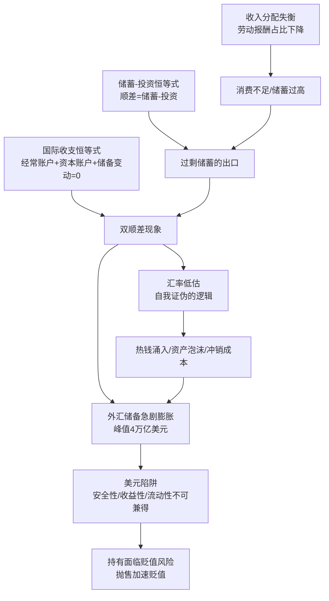
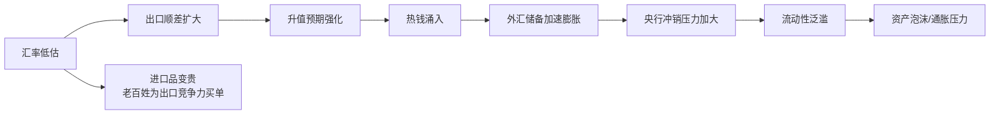
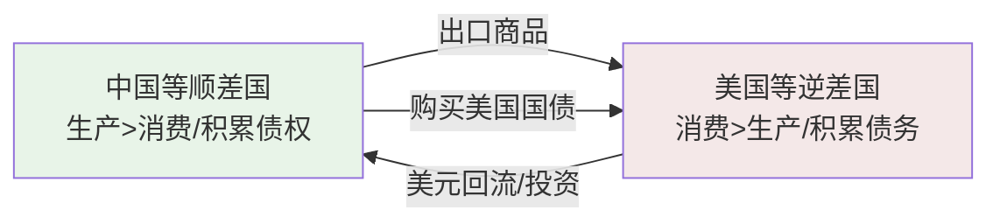

# 《见证失衡》深度读书笔记

> [!abstract]
> 《见证失衡》是中国宏观经济领域最具影响力的学者之一余永定对中国国际收支失衡的系统性诊断。作为前央行货币政策委员会委员，余永定以亲历者和批评者的双重身份，揭示了一个被繁荣表象遮蔽的深层矛盾：中国长期同时出口商品和出口储蓄，用真实的劳动和资源换取不断贬值的美元债权。全书从国际收支的会计恒等式出发，层层深入到汇率制度、储蓄结构、收入分配和全球货币体系，构建了一幅中国经济失衡的全景图，并在政策辩论的激流中坚守了独立判断。

## 这本书要解决什么经济问题

2000年代中期，中国经济正处于高速增长的黄金时代。GDP年增长率超过10%，出口总额年年创新高，外汇储备节节攀升，一度达到4万亿美元的全球之最。在主流话语中，这些都是"中国奇迹"的铁证。

> [!tip] 核心问题
> ==中国一边积累着天量外汇储备（购买美国国债，年收益率不到3%），一边大量引进外资（年回报率超过10%）。低息借出、高息借入——这不是精明的理财，而是一笔明摆着亏钱的国家级交易。==

这个悖论驱动了全书的追问：中国的"双顺差"格局（经常账户顺差与资本账户顺差同时存在）是如何形成的？它的真实含义是什么？为什么我们把一个严重的经济问题当成了值得炫耀的成就？应该如何纠正？

余永定在经济学谱系中属于开放宏观经济学领域，关注国际收支、汇率、资本流动等议题。他曾任中国社科院世界经济与政治研究所所长、央行货币政策委员会委员。这种学术与政策的双重身份，让他的分析兼具理论穿透力和制度现实感。更难得的是，在当时"报喜不报忧"的主流氛围中，他敢于公开批评汇率政策的失误，敢于指出利益集团对改革的阻碍。

余永定早在2000年代初就开始发出警告，但政策回应迟缓。这本书因此不仅是一份学术分析报告，也是一份政策备忘录——它记录了一位体制内学者如何在"繁荣"的表象下坚持独立判断。

## 核心模型地图

三个核心框架相互嵌套：

- **国际收支恒等式**：揭示双顺差必然导致外汇储备膨胀的会计逻辑
- **储蓄-投资恒等式**：打通国际收支问题与国内经济结构——==外部失衡的根源在内部==
- **储备管理的"不可能三角"**：安全性、收益性、流动性不可兼得，规模越大困境越尖锐

> [!note] 框架结构
> 这三个模型不是平行的，而是层层递进的：恒等式解释了"为什么失衡"，储蓄-投资关系解释了"失衡的根源在哪里"，不可能三角解释了"为什么难以退出"。理解了它们之间的逻辑关系，就掌握了全书的分析骨架。

## 逐层深入

### 失衡的全景图：什么是"双顺差"之谜

正常情况下，经常账户和资本账户方向相反——出口多于进口（经常账户顺差）的国家在积累对外债权，资本应该流出（资本账户逆差）。但中国两个账户同时顺差：既在向全世界"借出"储蓄（通过贸易顺差），又在从全世界"借入"资本（通过吸引外资）。

> [!warning] 异常的"正常"
> 我们已经习惯了失衡，以至于把失衡当作正常状态。"外汇储备世界第一"被庆祝为成就，而不是被审视为症状——==这是最危险的认知惯性==。

多余的外汇去了哪里？变成了央行的外汇储备。让我们看关键数字：

| 指标 | 数值 | 含义 |
|------|------|------|
| 外汇储备峰值 | ~4万亿美元 | 全球第一 |
| 合理储备水平 | ~1万亿美元 | 3-6个月进口+短期外债+干预缓冲 |
| 经常账户顺差/GDP | 曾超过10% | 远超3-4%的国际警戒线 |
| 外汇储备投资回报率 | <3% | 主要投资美国国债 |
| 引进外资回报率 | >10% | 外商直接投资 |

> [!example] 一笔不划算的交易
> 这相当于一个勤劳的工人把辛苦赚来的钱以极低利息存进银行，同时从另一家金融机构高息贷款来装修房子。==超出合理需求的储备不是"安全垫"，而是"负担"。==

### 失衡的根源：增长模式之病

#### 出口导向战略的两面性

中国的出口导向战略取得了巨大成功——利用低成本优势嵌入全球生产网络，创造大量就业，实现工业化跨越。但成功蕴含了问题的种子。

**资源扭曲**：生产要素过度流向出口部门，内需部门和服务业发展不足。**环境成本**：污染密集型产业扩张，出口价格未包含环境成本。**分配扭曲**：劳动报酬占GDP比重从1990年代的约53%降至2007年的约40%，消费率被结构性压低。**对外依赖**：出口占GDP超过30%时，外需波动直接冲击经济。

> [!tip] 核心洞察
> ==出口导向战略的成功不应成为继续这一战略的理由。时移势易，过去的成功药方可能成为现在的毒药。==一种增长模式不可能永远有效，关键是识别拐点、及时转型。

#### 汇率管制的困境

人民币汇率长期被低估，带来一系列连锁问题：

**冲销成本**：央行低息持有美元资产、高息发行央票回收流动性，做一笔注定亏损的生意。**输入性通胀**：低估汇率使进口商品更贵，消费者为出口企业的竞争力买单。**资产泡沫**：过剩流动性推高房价等资产价格。**热钱涌入**：升值预期吸引投机资本，形成恶性循环。

> [!note] 汇率悖论
> ==维持低估汇率的目的是促进出口，但如果出口持续顺差、外汇储备持续增加，恰恰证明汇率被低估了==——这是一个自我证伪的逻辑。如果温度计持续显示体温过高，正确的做法是退烧，而不是把温度计调低。

#### 储蓄-投资失衡的深层原因

中国储蓄率长期超过50%，远高于世界平均水平（约25%）。高储蓄不是单一现象，而是三个来源叠加：

**家庭储蓄高**：社保不足、教育医疗住房压力大，预防性储蓄动机强烈。"不敢花钱"——不是不想花，而是必须为不确定性存够钱。

**企业储蓄高**：国企利润留存多、分红率极低。企业储蓄没有通过分红或工资变成居民消费。

**政府储蓄高**：财政收入增速快于公共服务支出增速。资源集中在政府手中而非流向居民。

> [!tip] 关键判断
> ==贸易顺差的本质是中国生产的商品中国人自己消费不了，只能卖给外国人；卖了之后赚的钱又花不掉，只能存起来。这不是出口竞争力强的表现，而是内需不足的症状。==

更深一层，高储蓄的背后是收入分配失衡。恶性循环的链条：分配失衡 → 消费不足 → 出口依赖 → 外汇积累 → 资源错配 → 分配进一步恶化。余永定把国际收支问题和国内分配问题贯通了起来——这是全书最重要的分析贡献。

### 失衡的代价：看不见的损失

#### 外汇储备的真实成本

> [!example] 算一笔账
> 4万亿美元外汇储备如果投资回报率低3个百分点，每年的机会成本就是1200亿美元。这笔钱可以建设多少学校医院？可以投入多少科研？可以提高多少养老金？

五重成本叠加：

1. **机会成本**：低收益美国国债 vs 高回报国内投资
2. **汇率风险**：人民币升值10%，储备（以人民币计）缩水数千亿美元
3. **通胀风险**：美国印钞稀释债务，中国被动承受购买力损失
4. **流动性困境**：规模太大无法减持——抛售本身加速贬值
5. **冲销成本**：央行高息发行负债、低息持有资产，持续亏损

#### "美元陷阱"：被锁定的债权国

> [!warning] 进退两难
> 持有美元资产 → 面临贬值风险。抛售美元资产 → 加速贬值。==中国被自己的外汇储备"绑架"了——规模本身成了枷锁。==

这就像一个债权人发现债务人没有偿债能力，但不敢催债——催债导致债务人破产，自己的债权变成废纸。债权人反而不得不继续借钱给债务人。

深层不对称在于国际货币体系的结构：美元是全球主要储备货币，美国因此享有"过度特权"（exorbitant privilege）——可以用本币借债、可以印钞稀释债务、可以把货币政策外溢效果转嫁给他国。中国只能被动接受。

==中国工人辛辛苦苦生产的商品出口到美国，换来的却是不断贬值的美元债权。财富的真实转移方向，和表面的资金流动方向恰恰相反。==

#### 资源错配与国际摩擦

> [!tip] 重新理解"出口创汇"
> ==出口创汇本身不是目的，而是手段。创汇的目的是为了进口本国不能生产的商品。如果创了汇却不花，就失去了经济意义。==

贸易顺差意味着中国生产的商品没有被中国人消费——生产者付出了劳动，消费者没有享受产品，换来的只是央行资产负债表上的数字。持续的大规模顺差还引发国际摩擦：美国施压人民币升值、贸易摩擦升级为贸易战、中国被贴上"汇率操纵国"标签。

### 外汇储备的悖论：多少是"够用"的

传统上，外汇储备用于支付进口、偿还外债、干预汇市。按这些标准：

| 用途 | 需求量 |
|------|--------|
| 3-6个月进口额 | 约5000亿美元 |
| 短期外债覆盖 | 约2000亿美元 |
| 汇率干预缓冲 | 约3000亿美元 |
| **合理水平** | **约1万亿美元** |

但中国的外汇储备曾高达4万亿美元。==多余的3万亿不是"安全垫"，而是"负担"。==

可能的出路是"藏汇于民"——让外汇由企业和居民持有，而非集中于央行。但面临障碍：资本管制阻碍私人持汇，汇率预期影响持汇意愿，缺乏足够的外汇投资渠道。

### 汇率之争：自主权的边界

余永定明确主张：==汇率改革应基于中国自身利益判断。"不能因为美国要我们升值就不升值"——如果升值符合中国利益，就应该升值。==这是一种理性而非情绪化的主权观。

他严厉批评渐进升值策略：宣布要升值但每次只升一点点，创造了"稳赚不赔"的套利机会，反而吸引更多热钱。==渐进、可预测的升值是所有选项中最差的，因为它把成本最大化而收益最小化。==

> [!note] 改革路径
> - **短期**：加快升值步伐或一步到位
> - **中期**：扩大浮动区间，减少央行常态化干预
> - **长期**：实现人民币可自由兑换、市场决定的浮动汇率

### 全球失衡：不可持续的共生

这种"中美国"共生格局的前提是顺差国愿意持续借钱给美国。但债务不能无限积累。2008年金融危机是全球失衡的一次剧烈调整——美国债务泡沫破裂，中国作为债权国也受到波及。

> [!warning] 不对称的依赖
> 中美经济依赖是不对称的：==美国可以印美元，中国不能。在危机中，发行储备货币的债务国反而比持有储备货币的债权国更主动、更安全。==

### 纠正失衡：结构性转型

**纠正失衡的根本出路是扩大内需，特别是消费需求。** 核心逻辑是：让老百姓有钱、敢花钱。

扩大消费的途径：提高劳动报酬占比、完善社会保障体系、推进城镇化和户籍改革、改善收入分配、发展服务业。

> [!note] 改革面临的阻力
> - **出口利益集团**：反对汇率升值
> - **地方政府**：依赖出口创造GDP和就业
> - **金融部门**：从外汇业务中获利
> - **认知惯性**："外汇储备越多越好""贸易顺差是好事"
>
> ==结构性转型不能靠市场自发完成，需要顶层设计和政治决心。==

## 预测与现实

余永定的许多判断被后来的发展验证。

**被验证的预测**：
- 外汇储备2014年后从4万亿降至约3万亿美元
- 人民币汇率经历大幅波动（2015年"811汇改"后贬值压力骤增）
- 出口导向模式面临挑战（中美贸易战）
- 内需驱动成为政策重点（"双循环"战略与余永定十多年前的主张高度吻合）

> [!warning] 需要更新的判断
> - 资本外逃成为新问题（本书主要担心资本流入过多）
> - 人民币国际化进程比预期更曲折
> - 中美关系从经济摩擦升级为全面战略竞争
> - 数字货币等新变量改变国际货币体系的条件
> - "藏汇于民"在实践中推进有限，资本账户管制依然是常态

## 不同学派怎么说

- **林毅夫新结构经济学**：出口导向是发展中国家合理选择，失衡是发展阶段的自然产物。分歧在于对"什么时候转型"的时机判断
- **官方立场**：倾向渐进式汇率改革，强调"可控""有序""稳定"。余永定批评渐进路线实际变成了"不改"的借口
- **市场派**：外汇储备多总比少好，是应对金融危机的"弹药"。余永定回应：==保险也有最优水平——你不会因为害怕火灾而把全部收入用来买保险==
- **民族主义话语**：将外汇储备视为国力象征，批评储备问题等于"唱衰中国"
- **国际学界**（伯格斯坦、罗奇等）：基本认同中美失衡不可持续，但往往低估中国政策调整的政治经济学复杂性

余永定的立场是务实的：不是说储备不好而是"过多"不好；不是反对出口而是反对过度依赖出口。==这种分寸感反映了一位资深政策研究者的成熟。==

## 对你意味着什么

如果你是**普通公民**：
- "外汇储备第一"不一定是好事——它可能意味着你的劳动换来了不断贬值的"纸币"
- 收入分配和消费能力比GDP增速更重要——增长的成果是否真正惠及你
- 房价和汇率看似无关却紧密相连——汇率管制造成的流动性泛滥推高资产价格

如果你是**投资者**：
- 人民币汇率走势取决于经常账户和资本流动方向
- 中美利差是影响资本流动和汇率的关键变量
- 外汇风险是国际资产配置中最不应忽视的因素

如果你是**政策研究者**：
- 如何用经济学基本框架穿透复杂现实的迷雾
- 如何在学术独立与政策现实间保持平衡
- 如何在主流话语中保持批判性思考

==对所有读者：经济发展的目的是提高人民实际生活水平，而不是积累一堆数字。任何偏离这个目标的"成就"都值得质疑。==

## 延伸阅读

- [[《美元陷阱》]] - 埃斯瓦尔·普拉萨德著，从全球视角分析美元体系的困境与韧性，与本书形成互补
- [[《失衡》]] - 斯蒂芬·罗奇著，从美国视角看中美经济共生关系
- [[《大衰退》]] - 辜朝明著，从资产负债表衰退角度理解全球失衡调整的"崩溃式路径"
- [[《国富论》]] - 亚当·斯密著，"货币不是财富，生产能力才是"——余永定的分析与这一洞察一脉相承
- [[《21世纪资本论》]] - 皮凯蒂著，关于收入分配与经济增长的关系，与本书的分配视角相呼应
