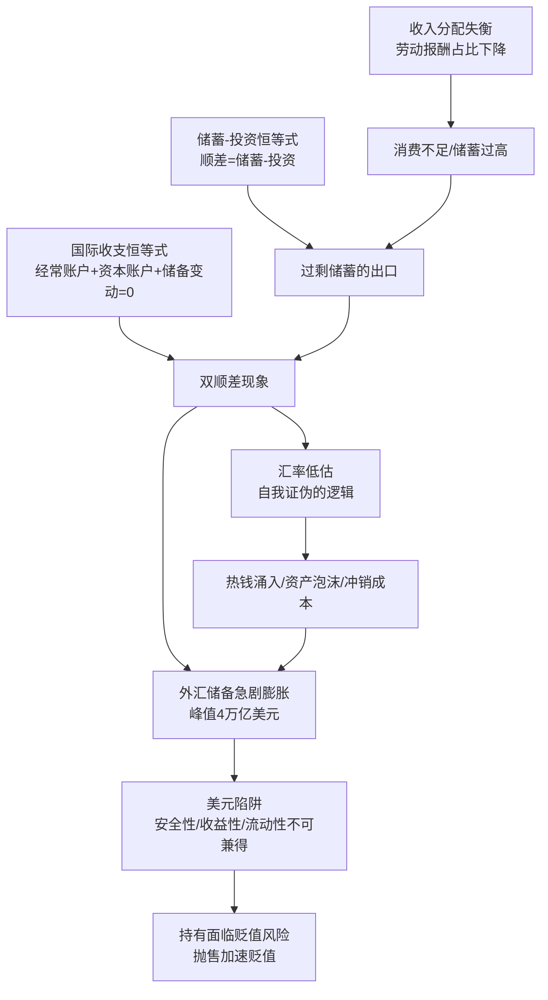
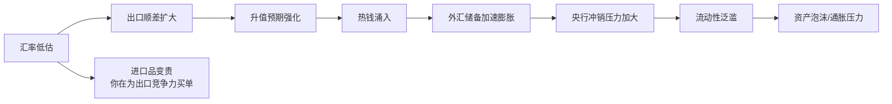
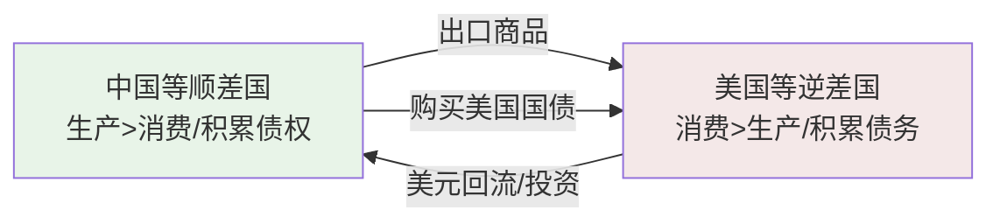

# 《见证失衡》深度读书笔记

> [!abstract]
> 如果你只知道中国外汇储备曾高居"世界第一"却从没想过这到底是好事还是坏事，这本书会彻底重塑你对这个问题的理解。余永定——中国社科院学部委员、前央行货币政策委员会委员——以亲历者和批评者的双重身份，揭示了一个被繁荣表象遮蔽的深层矛盾：中国长期同时出口商品和出口储蓄，用真实的劳动和资源换取不断贬值的美元债权。在这笔"低息借出、高息借入"的国家级交易中，外汇储备从保险变成了负担，贸易顺差从成就变成了症状。全书从国际收支的会计恒等式出发，层层深入到汇率制度、储蓄结构、收入分配和全球货币体系，构建了一幅中国经济失衡的全景图。如果你关心自己的财富保值、房价走势、收入增长，这本书里的分析和你的切身利益直接相关。

## 这本书要解决什么经济问题

2000年代中期，中国经济正处于高速增长的黄金时代。GDP年增长率超过10%，出口总额年年创新高，外汇储备节节攀升，一度达到4万亿美元的全球之最。在主流话语中，这些都是"中国奇迹"的铁证。各级政府把出口创汇和引进外资作为政绩指标，"外汇储备世界第一"被当作国力强盛的标志。如果你当时打开新闻，看到的几乎全是赞歌。

但余永定看到了完全不同的图景。作为长期从事国际经济研究的学者，他敏锐地察觉到这些亮眼数据背后的深层矛盾。

> [!tip] 核心问题
> ==中国一边积累着天量外汇储备（主要用于购买美国国债等低收益资产），一边大量引进外资（支付较高的资本回报）。== 你不妨想一想，这在财务上意味着什么？低息借出、高息借入——一笔明显不划算的交易。

这个悖论驱动了整本书的追问：中国经济的"双顺差"格局（经常账户顺差与资本账户顺差同时存在）是如何形成的？它的真实含义是什么？为什么我们把一个严重的经济问题当成了值得炫耀的成就？应该如何纠正？

余永定在经济学谱系中属于开放宏观经济学领域，关注国际收支、汇率、资本流动等议题。但他不是纯粹的学院派——他曾任中国社科院世界经济与政治研究所所长、央行货币政策委员会委员。这种学术与政策的双重身份，让他的分析兼具理论穿透力和制度现实感。更难得的是，在当时"报喜不报忧"的主流氛围中，他敢于公开批评汇率政策的失误，敢于指出利益集团对改革的阻碍，敢于直言渐进改革可能丧失最佳时机。

余永定早在2000年代初就开始发出警告，但政策回应迟缓。这本书因此不仅是一份学术分析报告，也是一份政策备忘录——它记录了一位体制内学者在"繁荣"的表象下如何坚持独立判断，以及正确的声音如何在利益博弈和认知惯性中被延迟接受。如果你对"为什么明明有人提前看到了问题，政策却迟迟不动"这种现象感兴趣，这本书会给你极其鲜活的案例。

## 核心模型地图

余永定的分析建立在三个相互关联的经济学框架之上。你可以把它们想象成三个不同焦距的镜头，从不同距离审视同一个问题。

**第一个是国际收支恒等式。** 翻译成你能直接理解的白话：一个国家通过贸易赚的钱加上外国投资流入的钱，如果不花掉，就只能变成外汇储备。中国两个账户同时为正（双顺差），意味着外汇储备必然持续膨胀。余永定的贡献在于用它来揭示"双顺差"不是健康的标志而是失衡的症状。

**第二个是储蓄-投资恒等式：** 经常账户顺差 = 国内储蓄 - 国内投资。如果你生产的东西自己消费不完、投资也吸收不了，多余的部分就只能通过贸易顺差"借给"国外。这个恒等式打通了国际收支问题和国内经济结构问题——==外部失衡的根源在内部==。储蓄过高不是因为中国人天生节俭，而是因为收入分配结构压低了你的消费能力，社保体系不完善迫使你进行预防性储蓄。

**第三个是外汇储备管理的"不可能三角"：** 安全性、收益性、流动性不可兼得。你不能悄悄卖掉几千亿美元的美国国债而不被市场察觉，而一旦市场知道最大的持有者在抛售，价格立刻暴跌。==规模本身成了枷锁。==

> [!note] 框架之间的逻辑关系
> 这三个模型不是平行的，而是层层递进的：恒等式解释了"为什么失衡"，储蓄-投资关系解释了"失衡的根源在哪里"，不可能三角解释了"为什么难以退出"。你理解了它们之间的逻辑关系，就掌握了全书的分析骨架。

## 逐层深入

### 失衡的全景图：什么是"双顺差"之谜

要理解余永定的分析，你首先需要理解几个基本概念。正常情况下，经常账户和资本账户应该方向相反。但中国的情况是"双顺差"——两个账户同时为正。你可能会困惑：一个国家既在向全世界"借出"储蓄，为什么还需要从全世界"借入"资本？

多余的外汇去了哪里？变成了央行的外汇储备。

> [!warning] 异常的"正常"
> 我们已经习惯了失衡，以至于把失衡当作正常状态。"外汇储备世界第一"被庆祝为成就，而不是被审视为症状——==这是最危险的认知惯性==。

| 指标 | 数值 | 含义 |
|------|------|------|
| 外汇储备峰值 | ~4万亿美元 | 全球第一 |
| 合理储备水平 | ~1万亿美元 | 3-6个月进口+短期外债+干预缓冲 |
| 经常账户顺差/GDP | 曾超过10% | 远超3-4%的国际警戒线 |
| 外汇储备投资回报率 | <3% | 主要投资美国国债 |
| 引进外资回报率 | >10% | 外商直接投资 |

> [!example] 一笔不划算的交易
> 这相当于一个勤劳的工人把辛苦赚来的钱以极低利息存进银行，同时从另一家金融机构高息贷款来装修房子。==超出合理需求的储备不是"安全垫"，而是"负担"。==

### 失衡的根源：增长模式之病

#### 出口导向战略的两面性

中国的出口导向战略取得了巨大成功——利用低成本优势嵌入全球生产网络，创造大量就业。如果你或你的家人在沿海城市的工厂工作过，你对这段历史一定不陌生。但成功蕴含了问题的种子。

**资源扭曲**：生产要素过度流向出口部门，内需部门和服务业发展不足。**环境成本**：你呼吸的空气、你喝的水，为出口的繁荣付出了代价，但出口价格没有包含这些环境成本。**分配扭曲**：劳动报酬占GDP比重从1990年代的约53%降至2007年的约40%，你作为劳动者的实际获得感远不及GDP数字所暗示的那样好。**对外依赖**：出口占GDP超过30%时，外需波动直接冲击经济。

> [!tip] 核心洞察
> ==出口导向战略的成功不应成为继续这一战略的理由。== 一种增长模式不可能永远有效，关键是识别拐点、及时转型。如果你习惯了一种赚钱方式就永远不改变，当环境变化的时候，你会被打个措手不及。

#### 汇率管制的困境

人民币汇率长期被低估，带来一系列连锁问题：

**冲销成本**：央行低息持有美元资产、高息发行央票回收流动性，做一笔注定亏损的生意。**输入性通胀**：低估汇率使进口商品更贵，你在为出口企业的竞争力买单——以更高的物价为代价。**资产泡沫**：你可能已经注意到，房价的持续飙升与过剩流动性密切相关。**热钱涌入**：升值预期吸引投机资本，形成恶性循环。

> [!note] 汇率悖论
> ==维持低估汇率的目的是促进出口，但如果出口持续顺差、外汇储备持续增加，恰恰证明汇率被低估了==——这是一个自我证伪的逻辑。你可以用一个生活化的类比来理解：如果温度计持续显示体温过高，正确的做法是退烧，而不是把温度计调低。

#### 储蓄-投资失衡的深层原因

中国储蓄率长期超过50%，远高于世界平均水平（约25%）。高储蓄是三个来源叠加的结果：

**家庭储蓄高**：社保不足、教育医疗住房压力大——不是你不想花，而是你必须为可能的大病、孩子的教育、自己的养老存下足够的钱。

**企业储蓄高**：国企利润留存多、分红率极低。这些储蓄没有通过分红或工资变成你口袋里的钱和你的消费。

**政府储蓄高**：财政收入增速快于公共服务支出增速。资源集中在政府手中而非流向你的钱包。

> [!tip] 关键判断
> ==贸易顺差的本质是中国生产的商品中国人自己消费不了，只能卖给外国人；卖了之后赚的钱又花不掉，只能存起来。这不是出口竞争力强的表现，而是内需不足的症状。==

更深一层，高储蓄的背后是收入分配失衡。恶性循环的链条：分配失衡 → 消费不足 → 出口依赖 → 外汇积累 → 资源错配 → 分配进一步恶化。余永定把国际收支问题和国内分配问题贯通了起来。如果你以前觉得"国际收支"是一个离自己很远的宏观概念，现在你应该明白，它和你的工资、你的消费能力、你的生活质量直接挂钩。

### 失衡的代价：看不见的损失

#### 外汇储备的真实成本

> [!example] 算一笔账
> 4万亿美元外汇储备如果投资回报率低3个百分点，每年的机会成本就是1200亿美元。你不妨想一想：这笔钱可以建多少学校医院？可以投入多少科研？可以提高多少养老金？

五重成本叠加：

1. **机会成本**：低收益美国国债 vs 高回报国内投资
2. **汇率风险**：人民币升值10%，储备（以人民币计）缩水数千亿美元——这相当于你辛苦工作多年积攒的一大笔钱被悄无声息地蒸发了
3. **通胀风险**：美国印钞稀释债务，中国被动承受购买力损失
4. **流动性困境**：规模太大无法减持——你的抛售行为会加速你想要避免的损失
5. **冲销成本**：央行高息发行负债、低息持有资产——这种亏损最终由你承担

#### "美元陷阱"：被锁定的债权国

> [!warning] 进退两难
> 持有美元资产 → 面临贬值风险。抛售美元资产 → 加速贬值。==中国被自己的外汇储备"绑架"了——规模本身成了枷锁。==

如果你想象自己就是这个债权人，你能体会到那种"明知不对、但无法抽身"的焦虑。这就像一个债权人发现债务人没有偿债能力，但不敢催债——催债导致债务人破产，自己的债权变废纸。

深层不对称在于国际货币体系的结构：美元是全球主要储备货币，美国享有"过度特权"——可以用本币借债、可以印钞稀释债务、可以把货币政策外溢效果转嫁给他国。

==中国工人辛辛苦苦生产的商品出口到美国，换来的却是不断贬值的美元债权。财富的真实转移方向，和表面的资金流动方向恰恰相反。== 如果你是一个在出口企业工作的普通工人，这个分析会让你对自己劳动成果的最终去向有一个全新的认识。

#### 资源错配与国际摩擦

> [!tip] 重新理解"出口创汇"
> ==出口创汇本身不是目的，而是手段。创汇的目的是为了进口本国不能生产的商品。如果创了汇却不花，就失去了经济意义。==

你可能觉得贸易摩擦是宏观政策层面的事——但当贸易战来临，关税上升，你消费的进口商品涨价，你所在行业的出口订单锐减时，你就是这场失衡的直接受害者。

### 汇率之争：自主权的边界

余永定在汇率争论中的立场值得你仔细体会：==汇率改革应基于中国自身利益判断。"不能因为美国要我们升值就不升值"——如果升值符合中国利益，就应该升值。== 这是一种理性而非情绪化的主权观——真正的主权是根据自身利益做出最优决策。你想一想，这个逻辑放到个人生活中也完全成立：别人建议你做的事情如果确实对你有好处，你不会仅仅因为是别人建议的就拒绝去做。

他严厉批评渐进升值策略：宣布要升值但每次只升一点点，等于向投机者发放"稳赚不赔"的入场券。如果你把这个逻辑类比到生活中：你不会告诉全世界"我打算慢慢减价卖我的房子"，因为每个买家都会等你降到最低再出手。

> [!note] 改革路径
> - **短期**：加快升值步伐或一步到位
> - **中期**：扩大浮动区间，减少央行常态化干预
> - **长期**：实现人民币可自由兑换、市场决定的浮动汇率

### 全球失衡：不可持续的共生

这种"中美共生"的前提是顺差国愿意持续借钱给美国。但债务不能无限积累。2008年金融危机就是一次剧烈调整。如果你当时在珠三角或长三角的出口工厂工作，你对那次冲击一定记忆犹新。

> [!warning] 不对称的依赖
> 中美经济依赖是不对称的：==美国可以印美元，中国不能。在危机中，发行储备货币的债务国反而比持有储备货币的债权国更主动、更安全。== 你可以把这理解为：借你钱的人反而比你更有底气，因为他可以随时"稀释"欠你的钱。

### 纠正失衡：结构性转型

纠正失衡的根本出路是扩大内需，而每一项改革都和你的切身利益直接相关。

**提高劳动报酬占比**：让你分享更多经济增长的成果。**完善社会保障**：当你不再为大病、教育、养老焦虑时，你才会愿意消费。**推进城镇化**：如果你是在城市工作的农民工却不能享受城市公共服务，你的消费意愿就会被压制。**改善收入分配**：经济学的基本原理告诉你，把一块钱从富人手里转移到穷人手里，社会总消费会增加。

外汇储备管理方面：控制增长速度、多元化投资、设立主权财富基金、支持企业"走出去"、推动"藏汇于民"（让外汇由你和企业自行持有）。

> [!note] 改革面临的阻力
> - **出口利益集团**：反对汇率升值
> - **地方政府**：依赖出口创造GDP和就业
> - **金融部门**：从外汇业务中获利
> - **认知惯性**："外汇储备越多越好""贸易顺差是好事"
>
> ==结构性转型不能靠市场自发完成，需要顶层设计和政治决心。==

## 预测与现实

**被验证的预测**：
- 外汇储备2014年后从4万亿降至约3万亿美元
- 2015年"811汇改"后人民币贬值压力骤增——如果你关注过当时的财经新闻，你会记得弥漫的恐慌情绪
- 中美贸易战使出口导向模式面临挑战
- "双循环"战略与余永定十多年前的主张高度吻合——当你在新闻中看到"以国内大循环为主体"时，你现在知道它的智识源头之一

> [!warning] 需要修正的判断
> - 资本外逃成为新问题（本书主要担心资本流入过多）——你以为稳定的东西，可能比你想象的更脆弱
> - 人民币国际化进程比预期更曲折
> - 中美关系从经济摩擦升级为全面战略竞争
> - "藏汇于民"在实践中推进有限，资本账户管制依然是常态

## 不同学派怎么说

- **林毅夫新结构经济学**：出口导向是发展中国家合理选择，失衡是发展阶段的自然产物。两人的分歧在于"什么时候转型"的时机判断。你在思考这个问题时，可以问自己：一种有效但有副作用的药，应该什么时候停？
- **官方立场**：倾向渐进式汇率改革，强调"可控""有序""稳定"。余永定批评渐进路线实际变成了"不改"的借口
- **"储备多多益善"派**：外汇储备是应对金融危机的"弹药"。余永定回应：==保险也有最优水平——你不会因为害怕火灾而把全部收入用来买保险==。如果你买保险花了这么多钱以至于影响了正常生活，那保险本身就成了问题
- **民族主义话语**：将外汇储备视为国力象征。这种压力提醒你：在公共讨论中，情绪化的标签往往会淹没理性分析的声音
- **国际学界**（伯格斯坦、罗奇等）：基本认同中美失衡不可持续，但往往低估中国政策调整的复杂性

==余永定的立场是务实的分寸感：不是说储备不好而是"过多"不好；不是反对出口而是反对过度依赖出口。== 如果你在生活中也面临类似的"度"的拿捏问题，他的思路值得你借鉴。

## 对你意味着什么

首先，你应该明白人民币汇率的走势不是随机的。当你考虑是否需要配置外币资产来分散风险时，余永定的分析框架可以帮你判断汇率压力是结构性的还是周期性的。你不需要成为经济学家，但你需要理解决定汇率走势的基本力量。

其次，这本书能帮你理解为什么你的房价、物价和银行利率会受到国际资本流动的影响。当美联储加息或降息时，你在做投资决策时就不会只看国内数据，还会关注全球资金流向。

第三，余永定的分析让你重新审视"GDP高增长"的含义。如果你的收入增长持续慢于GDP增长，那这个增长对你来说就打了折扣。你应该关注的不仅是GDP数字，更是你实际能感受到的收入增长和公共服务改善。

> [!tip] 最重要的启示
> ==经济发展的目的是提高你的实际生活水平，而不是积累一堆数字——无论这个数字是GDP增速还是外汇储备规模。任何偏离这个目标的"成就"都值得你质疑。== 亚当·斯密在250年前就说过：货币不是财富，生产能力才是。余永定把这个古老的洞察应用到了21世纪中国的具体情境中，而你，可以把它应用到你自己的财富观和消费观中。

## 延伸阅读

- [[《美元陷阱》]] - 埃斯瓦尔·普拉萨德著，从全球视角分析美元体系的困境与韧性。如果你想从另一个角度理解这个问题，这本书不可错过
- [[《失衡》]] - 斯蒂芬·罗奇著，从美国视角看中美经济共生关系，帮你获得更完整的双边视角
- [[《大衰退》]] - 辜朝明著，从资产负债表衰退角度理解全球失衡调整。如果你想弄清楚2008年到底发生了什么，这本书值得你花时间
