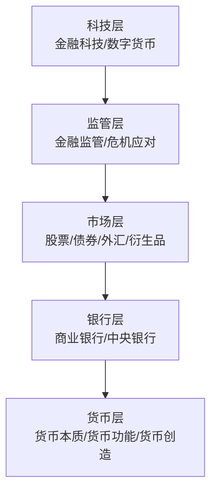

# 《货币金融百科》深度读书笔记

> [!abstract] 全书速览
> 这是一本用图解方式呈现的金融世界地图。从"货币是什么"到"中央银行如何运作"，从"股票债券怎么估值"到"金融危机为什么反复发生"，DK出版社用视觉化手段把金融领域的全景图谱铺在你面前。它不教你怎么炒股赚钱，而是帮你建立一个完整的金融认知框架——理解金融不是为了成为投资大师，而是为了在这个高度金融化的世界里不做一个糊涂人。

## 这本书要解决什么经济问题

DK出版社面向的是一个简单但重要的问题：如何让对金融一无所知的普通人，快速建立起对整个金融体系的基本理解？

> [!note] 为什么这个问题重要
> 金融已经渗透到现代生活的每一个角落。你的工资存在银行里，银行用它去放贷款；你交的社保在资本市场上投资；你买的房子通过按揭贷款和整个信贷体系相连。如果你不理解这些机制的基本逻辑，你就像一个在高速公路上开车却看不懂交通标志的人。

它在金融学领域的定位是"入门级全景图谱"——与学术教科书和投资指南不同，它追求的是广度覆盖和直观理解。

## 核心模型地图

> [!tip] 架构逻辑
> 五层之间不是简单堆叠，而是有复杂的交互。==银行层的信用创造能力影响货币层的货币供应；市场层的价格信号引导银行层的资源配置；监管层的规则约束着银行层和市场层的行为；科技层正在改变所有其他层次的运作方式。==

## 逐层深入

### 货币：远比你想象的复杂

> [!tip] 颠覆性认知
> ==现代货币主要不是中央银行"印"出来的，而是商业银行通过贷款创造的。==银行发放贷款时，只是在借款人账户上增加一笔数字——这笔数字就是新创造的货币。通过货币乘数效应，100元基础货币在20%准备金率下最终可创造500元广义货币。

货币的三大功能：交换媒介、价值尺度、价值储藏。当通货膨胀侵蚀价值储藏功能时，人们就会逃离该种货币。

### 银行体系：金融的心脏

商业银行的商业模式是"==借短贷长=="——用短期存款发放长期贷款，赚取利差。但这蕴含根本性的期限错配风险。

> [!warning] 银行挤兑
> 如果大量存款人同时提款，银行即使资产质量没问题也会面临流动性危机——它的资产（贷款）是好的，但短期内无法变现。这就是为什么需要央行充当"最后贷款人"。

**中央银行四大职能**：货币政策、金融稳定、银行的银行、政府的银行。

**货币政策工具**：政策利率、公开市场操作、准备金要求、量化宽松（非常规工具）。

### 金融市场：资本的竞技场

**股票**：公司所有权凭证，享有分红权、投票权和资本增值潜力。估值方法：市盈率（P/E）、市净率（P/B）、DCF。

> [!tip] 收益率曲线
> ==收益率曲线倒挂==（短期利率高于长期利率）是最可靠的衰退预警信号之一。过去几十年中几乎准确预测了每一次衰退。

**不可能三角**：固定汇率 + 资本自由流动 + 独立货币政策——三者不可兼得。

> [!example] 各国的选择
> - 中国：独立货币政策 + 资本管制 → 汇率有管制
> - 美国：独立货币政策 + 资本自由流动 → 汇率完全浮动
> - 欧元区：固定汇率 + 资本自由流动 → 放弃独立货币政策

**衍生品的双面性**：风险管理工具（正面） vs 杠杆放大器（负面）。2008年CDS是将次贷危机放大为全球金融海啸的关键推手。

### 个人理财

> [!tip] 理财金字塔
> - 底层（保障）：应急基金、保险
> - 中层（增值）：指数基金、债券、房产
> - 顶层（投机）：个股、期权、加密货币
>
> 大多数人犯的错误是底层不稳就冲向顶层。

**72法则**：资金翻倍年数 = 72 / 年化收益率

**行为偏差**：损失厌恶、处置效应、羊群效应、过度自信、锚定效应。参见 [[《思考，快与慢》 - 丹尼尔·卡尼曼]]。

### 金融危机

> [!warning] 危机的循环模式
> 信贷扩张 → 资产泡沫 → 泡沫破裂 → 信贷紧缩 → 经济衰退 → 政策救助 → 新一轮信贷扩张

==复杂性本身就是一种风险。==当金融产品复杂到连发行者和评级机构都不完全理解时，灾难就已经在酝酿。参见 [[《逃不开的经济周期》 - 拉斯·特维德]]。

### 金融科技

央行数字货币（CBDC）是最值得关注的前沿趋势。中国数字人民币（e-CNY）是全球先行者。CBDC vs 加密货币：前者有国家信用背书，后者价值来自共识。

## 预测与现实

书中关于金融危机模式的总结在2020年新冠冲击后再次得到验证。个人理财的基本原则——分散投资、长期持有、控制成本——经受住了时间检验。金融科技发展方向符合预期，但P2P借贷和加密货币的实际路径比预期更曲折。

## 不同学派怎么说

**后凯恩斯学派**（明斯基）：稳定本身酝造不稳定。参见 [[《反脆弱》 - 纳西姆·塔勒布]]。

**奥地利学派**：央行人为压低利率是经济周期的根源。参见 [[《看得见的与看不见的》 - 弗雷德里克·巴斯夏]]。

**现代货币理论（MMT）**：拥有货币主权的政府不会"破产"，真正的约束是通胀而非赤字。

**加密货币阵营**：中心化金融体系存在权力集中和审查风险，但2022年以来的加密暴雷也暴露了去中心化理想与现实的差距。

## 对你意味着什么

检查你的财务金字塔底层是否稳固。如果还没开始投资，从宽基指数基金月定投开始。每周用本书框架解读一则财经新闻，持续升级你的金融认知。

## 延伸阅读

- [[《聪明的投资者》 - 本杰明·格雷厄姆]]：价值投资的圣经
- [[《漫步华尔街》 - 伯顿·G·马尔基尔]]：指数投资的最好辩护
- [[《置身事内》 - 兰小欢]]：理解中国经济和金融体系的优秀入门读物
- 《这次不一样》（莱因哈特和罗格夫）：800年金融危机数据，证明人类在金融方面从不吸取教训
