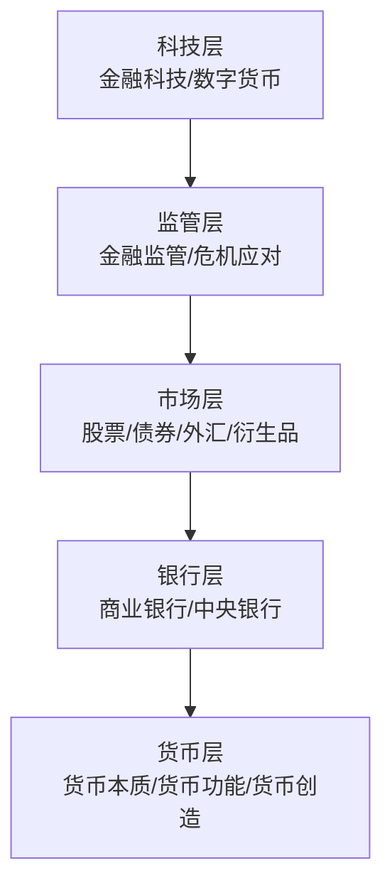

# 《货币金融百科》深度读书笔记

> [!abstract] 全书速览
> 这是一本用图解方式呈现的金融世界地图。从"货币是什么"到"中央银行如何运作"，从"股票债券怎么估值"到"金融危机为什么反复发生"，DK出版社用它最擅长的视觉化手段，把金融领域的全景图谱铺在你面前。它不教你怎么炒股赚钱，而是帮你建立一个完整的金融认知框架——理解金融不是为了成为投资大师，而是为了在这个高度金融化的世界里不做一个糊涂人。

## 这本书要解决什么经济问题

DK出版社（Dorling Kindersley）是全球领先的图文百科出版商，1974年创立于伦敦，以"视觉化知识传递"著称。它出版的百科全书覆盖了从天文地理到人体科学的几乎所有领域，以精美的图解和清晰的信息架构闻名。《货币金融百科》是DK"商业与经济"系列的核心作品，面向的是一个简单但重要的问题：如何让一个对金融一无所知的普通人，快速建立起对整个金融体系的基本理解？

> [!note] 为什么这个问题重要
> 金融已经渗透到现代生活的每一个角落。你的工资存在银行里，银行用它去放贷款；你交的社保在资本市场上投资，股市的涨跌直接影响你退休后能拿到多少钱；你买的房子通过按揭贷款和整个信贷体系相连，央行的利率决策直接影响你每月的还款额；你手机里的支付软件背后是一整套清算系统；你持有的人民币的购买力取决于货币政策和通胀趋势。如果你不理解这些机制的基本逻辑，你就像一个在高速公路上开车却看不懂交通标志的人。

与学术教科书（如曼昆的《经济学原理》或米什金的《货币金融学》）不同，这本书不追求理论深度和数学严谨——你不会在这里看到IS-LM模型或者泰勒规则的数学推导。与投资指南（如《聪明的投资者》或《漫步华尔街》）不同，这本书不教你怎么投资——它不会告诉你应该买哪只股票或者什么时候买入。与财经畅销书（如《大空头》或《说谎者的扑克牌》）不同，它也不讲故事——没有戏剧性的人物和情节。

它的独特价值在于：用最短的路径、最直观的方式，帮你建立一个关于金融世界的"心理地图"。有了这张地图，你在面对任何金融话题——从新闻里的"央行降息"到朋友推荐的投资产品——都不至于完全茫然。它在金融学领域的定位是"入门级全景图谱"。

## 核心模型地图

> [!tip] 架构逻辑
> 五层之间不是简单堆叠，而是有复杂的交互。==银行层的信用创造能力影响货币层的货币供应；市场层的价格信号引导银行层的资源配置；监管层的规则约束着银行层和市场层的行为；科技层正在改变所有其他层次的运作方式。==

整本书的知识体系可以理解为一栋五层大厦，每一层都建立在下面一层的基础之上。

最底层是**货币层**——理解什么是货币、货币怎么产生、货币的功能是什么。这是一切金融活动的起点。没有货币，就没有银行、没有市场、没有金融。你可能觉得"货币就是钱嘛，有什么好理解的"，但当你知道现代货币主要是商业银行通过贷款创造出来的、而非央行"印"出来的，你对整个金融体系的认知就会发生根本性的转变。

第二层是**银行层**——商业银行如何运作、中央银行如何调控。银行是货币体系的枢纽，连接着储蓄者和借款者，是信用创造的核心引擎。理解银行"借短贷长"的商业模式及其内在脆弱性，你就理解了为什么银行挤兑如此可怕、为什么需要存款保险制度、为什么需要中央银行充当最后贷款人。

第三层是**市场层**——股票市场、债券市场、外汇市场、衍生品市场。这些市场提供了资本配置的机制，让钱能够流向最需要它、最能有效使用它的地方。理解这些市场的基本运作逻辑和定价机制，你就能读懂大部分财经新闻。

第四层是**监管层**——金融监管、危机应对、国际金融治理。这一层处理的是金融系统的脆弱性——如何防止市场失灵、如何应对危机、如何在效率和稳定之间取得平衡。金融危机不是偶然事件，而是金融系统内在逻辑的周期性爆发。

最上层是**科技层**——金融科技、数字货币、未来趋势。这一层代表的是正在重塑整个金融体系的技术力量。从移动支付到区块链，从智能投顾到央行数字货币，科技正在改变金融的面貌。

## 逐层深入

### 货币：远比你想象的复杂

大多数人对货币的理解停留在"钱就是钱"的层面。但这本书的第一部分就会颠覆你的认知。

货币的起源不是一个发明创造的故事，而是一个集体演化的过程。人类最初的交易是以物易物，但这有一个致命的问题——经济学家称之为"双重需求巧合"：你有鱼想换米，但有米的人不一定想要鱼。如果你处在一个只有五种商品的经济体中，你需要记住10个交换比率（5选2的组合数）；但如果有100种商品，你需要记住4950个交换比率。这种复杂性在没有货币的世界里会严重制约交换的发生，从而限制分工和经济发展。

> [!tip] 货币的简化效应
> ==有了货币，100种商品只需要100个价格（每种商品以货币计价），而不是4950个交换比率。==这个简化效应是货币最基本但最被低估的功能。

货币经历了从商品货币（贝壳、盐、牲畜、烟草——二战集中营里香烟就是通行货币）到金属货币（金、银、铜），再到纸币、电子货币、数字货币的漫长演化。每一次演化都不是偶然的——它们都是为了让货币更好地履行三大功能：**交换媒介**（让交易更便利）、**价值尺度**（提供统一的计价标准）、**价值储藏**（跨越时间转移购买力）。

这三大功能看似简单，实际上蕴含着深刻的张力。当一种货币很好地履行交换媒介功能时（比如流动性极高、被广泛接受），它可能在价值储藏方面表现不佳（因为供应量增长过快导致通胀）。当一种货币过度追求价值储藏功能时（比如金本位制下的黄金），它可能会制约经济增长（因为货币供应量不能灵活调整）。这种张力是理解货币政策困境的关键。

> [!tip] 颠覆性认知
> ==现代货币主要不是中央银行"印"出来的，而是商业银行通过贷款创造的。==银行发放贷款时，只是在借款人账户上增加一笔数字——这笔数字就是新创造的货币。在10%的准备金率下，一笔100万的初始存款最终可以创造出约1000万的广义货币。这就是"货币乘数效应"。

英格兰银行在2014年发表了一篇引起广泛关注的论文，明确表示："当今世界的大部分货币是商业银行创造的，它们通过发放贷款来创造货币。"这与大多数教科书上"央行印钱，商业银行只是传递渠道"的传统叙事截然不同。

理解这一点至关重要，因为它解释了两个重要现象。第一，为什么银行是金融系统中最重要的机构——它们是货币创造的引擎，不是简单的资金中介。第二，为什么金融危机往往始于银行系统的问题——当银行停止放贷（信贷紧缩），货币创造也会急剧萎缩，整个经济就会陷入收缩。2008年金融危机后，尽管美联储大幅降息并实施量化宽松，但因为银行不愿意放贷（它们在修复自己的资产负债表），经济复苏远比预期缓慢——基础货币增加了，但信贷没有跟上，货币乘数效应大打折扣。

### 银行体系：金融的心脏

商业银行的商业模式用一句话概括就是"==借短贷长=="——以较低的利率吸收短期存款（你的活期账户利率可能只有0.3%），以较高的利率发放长期贷款（房贷利率可能是4-5%），赚取中间的利差（净息差）。这个模式简单但蕴含着一个根本性的脆弱性：期限错配。

> [!warning] 银行挤兑
> 存款可以随时提取，但贷款是长期的（房贷通常是20-30年）。银行手头只保留一小部分准备金。如果出现恐慌——大量存款人蜂拥提款——银行就会面临流动性危机。注意，银行的资产（贷款）可能完全没问题——借款人在正常还款——但银行短期内无法把这些贷款变成现金来应对挤兑。==一个资产质量完好的银行，可以被一场恐慌性挤兑击垮。==这就是金融系统脆弱性的一个核心来源。

这就是为什么需要两个制度安排。第一是**存款保险制度**——政府承诺在银行倒闭时保障存款人的资金（中国的存款保险上限是每家银行50万元），这降低了存款人挤兑的动力。第二是**中央银行的最后贷款人功能**——当银行面临流动性困难时，央行可以提供紧急贷款来稳定局面。沃尔特·白芝浩在1873年的经典著作《伦巴第街》中就阐述了这个原则：在危机时，央行应该自由借贷，但要以惩罚性利率、有良好抵押品为条件。

现代中央银行有四大核心职能：

**第一，制定和执行货币政策。**通过调整政策利率来影响整个经济中的借贷成本和经济活动水平。但实际上货币政策的传导机制漫长而不确定——从央行改变政策利率到实体经济真正受到影响，通常需要6-18个月，而且效果的大小和方向都难以精确预测。

2008年金融危机后，常规利率工具已经不够用（利率已经接近零甚至为负），各主要央行开始使用"量化宽松"（QE）——直接在市场上大规模购买国债和其他资产。美联储的资产负债表从2008年的不到1万亿美元膨胀到2022年的近9万亿美元。日本央行更是走得更远，不仅买国债还买股票ETF，一度成为日本股市最大的持有者之一。

**第二，维护金融稳定。**监测系统性风险，防止金融危机的发生和蔓延。2008年之后，各国央行普遍加强了"宏观审慎监管"。

**第三，充当"银行的银行"。**为商业银行提供清算服务和流动性支持。

**第四，充当"政府的银行"。**管理国库资金和政府债务，有些央行还管理外汇储备。

### 金融市场：资本的竞技场

股票市场是公众最熟悉的金融市场。但这里有一个很多人忽略的事实：股票市场虽然引人注目，但它在整体融资中的比重其实不大。全球范围内，企业融资的主要来源不是股票市场（股权融资），而是银行贷款和债券市场（债务融资）。

> [!example] 估值方法
> - **市盈率**（P/E）：股价除以每股收益。标普500的长期平均市盈率大约在15-17倍
> - **市净率**（P/B）：股价除以每股净资产，适用于资产密集型行业
> - **DCF估值**：将公司未来所有自由现金流按折现率折算到今天的价值，理论上最"正确"但对假设高度敏感

债券市场在规模上超过股票市场——全球债券市场规模超过130万亿美元——但在公众的关注度中远远不如。

> [!tip] 收益率曲线
> ==收益率曲线倒挂==（短期利率高于长期利率）是最可靠的衰退预警信号之一。过去几十年中，收益率曲线倒挂几乎准确地预测了每一次美国经济衰退——包括2000年互联网泡沫破裂、2007-08年金融危机和2020年新冠衰退之前都出现了倒挂。

外汇市场是全球最大的金融市场，日交易量超过6万亿美元。

**"不可能三角"**（蒙代尔-弗莱明提出）：一个国家不可能同时实现固定汇率、资本自由流动和独立的货币政策。

> [!example] 各国的选择
> - 中国：独立货币政策 + 资本管制 → 汇率有管制
> - 美国：独立货币政策 + 资本自由流动 → 汇率完全浮动
> - 欧元区：固定汇率 + 资本自由流动 → 放弃独立货币政策

理解这个三角形，你就理解了大量国际金融现象背后的逻辑——比如为什么中国要实施资本管制，为什么欧元区出现债务危机时各国无法独立调整货币政策来应对。

**衍生品的双面性**：正面是风险管理工具（农民用期货锁定价格，航空公司用期权对冲燃油价格）；反面是杠杆放大器。沃伦·巴菲特称衍生品为"大规模杀伤性金融武器"，2008年CDS的角色证明了这个比喻并非夸张。

### 个人理财：你自己的财务架构

> [!tip] 理财金字塔
> - 底层（保障）：3-6个月开支的应急基金 + 医疗意外重疾保险
> - 中层（增值）：指数基金、债券、房产
> - 顶层（投机）：个股、期权、加密货币
>
> ==大多数人犯的错误是在底层还不稳固的时候就冲向顶层——没有应急基金和保险就去炒股，这等于在沙滩上建高楼。==

**72法则**：资金翻倍年数 = 72 / 年化收益率。年化10%约7.2年翻倍，年化8%约9年翻倍。

更重要的是时间的力量。25岁开始每月投资1000元，假设年化8%，到65岁时积累的财富约为350万元——其中你实际投入的本金只有48万元，剩下的300多万全部是复利的贡献。如果你35岁才开始，即使每月投资2000元，到65岁时积累的约为300万元。晚开始10年，即使每月多投一倍，最终结果还是更少。

行为金融学揭示了你在理财中最大的敌人不是市场，而是你自己的大脑。**损失厌恶**让你对亏损的痛苦是对等量盈利的快乐的两倍，导致"处置效应"。**羊群效应**让你追涨杀跌。**过度自信**让你高估选股能力——研究表明，越频繁交易的个人投资者，平均回报率越低。**锚定效应**让你被买入价格"钉住"。参见 [[《思考，快与慢》 - 丹尼尔·卡尼曼]]。最有效的对策：定投指数基金，减少决策频率，让系统替你克服人性弱点。

### 金融危机：系统的脆弱性

> [!warning] 危机的循环模式
> 信贷扩张催生资产泡沫 → 泡沫破裂引发信贷紧缩 → 信贷紧缩导致经济衰退 → 政策救助启动新一轮信贷扩张

纵观历史，从1637年荷兰郁金香泡沫到1720年南海泡沫，从1929年华尔街崩盘到1997年亚洲金融危机，再到2008年全球金融危机，所有金融危机都遵循这个惊人相似的模式。海曼·明斯基将这个循环概括为"稳定孕育不稳定"——长期的繁荣会让人们逐渐遗忘风险，采取越来越激进的融资方式，直到系统无法承受。

2008年的危机是教科书式案例。低利率刺激房贷需求；银行放松次贷标准——甚至出现NINJA贷款（No Income, No Job, No Assets）；贷款被打包成MBS、CDO出售给全球投资者；评级机构给予AAA评级；房价下跌时整个链条从底部崩塌。

==复杂性本身就是一种风险。==CDO的CDO（CDO-squared）是"以复杂金融产品为基础再创造出更复杂的金融产品"，到最后没有人真的知道底层资产的真实风险——但所有人都假设其他人知道。参见 [[《逃不开的经济周期》 - 拉斯·特维德]]。

### 金融科技：正在到来的变革

移动支付让中国从现金社会直接跳到了无现金社会——支付宝和微信支付的普及速度和覆盖广度超过了所有人的预期。P2P借贷试图绕过传统银行中介，但中国的P2P行业从2013年的爆发式增长到2020年的全面清退，是一个关于金融创新与金融风险的深刻教训。

央行数字货币（CBDC）是目前最值得关注的前沿趋势。与比特币等加密货币不同，CBDC是央行发行的数字法币，有国家信用背书。中国的数字人民币（e-CNY）是全球CBDC的先行者。CBDC可能带来深远变化——提高支付效率（尤其是跨境支付）、增强金融包容性、为央行提供更精准的政策工具（央行可以直接看到资金流向，甚至可以设计"可编程货币"——比如只能用于特定用途的补贴）。但CBDC也引发了关于隐私、金融脱媒和跨境货币竞争的严肃讨论。

## 预测与现实

书中关于金融危机模式的总结在2020年新冠冲击后再次得到验证：各国央行大规模放水（美联储在2020年3月将利率降至接近零并重启量化宽松），资产价格飙升（美股在2020年3月触底后仅用5个月就恢复并创新高），随后通胀高企（2022年美国CPI一度达到9.1%的40年高点），迫使美联储快速加息，资产价格回调。

金融科技的发展总体上符合本书的展望方向，但速度和路径与预期有所不同。加密货币从小众实验变成了主流话题，但2022年的Luna崩盘、FTX破产等事件暴露了加密行业的诸多问题。

本书关于个人理财基本原则的建议——分散投资、长期持有、控制成本、先保障后增值——经受住了时间的检验。在2020年3月的恐慌性抛售中，坚持定投的投资者在随后的反弹中获利丰厚；而在恐慌中清仓的投资者则锁定了亏损。

## 不同学派怎么说

**后凯恩斯学派**（如明斯基的"金融不稳定假说"）认为这本书对金融系统内在脆弱性的讨论还不够深入。明斯基认为稳定本身就会酿造不稳定——长期的经济繁荣会让人们逐渐放松风险意识，从"对冲融资"（收入足以偿还本息）过渡到"投机融资"（收入只够偿还利息，需要借新还旧来偿还本金），最终滑向"庞氏融资"（收入连利息都不够，只能靠资产增值来维持）。参见 [[《反脆弱》 - 纳西姆·塔勒布]]。

**奥地利学派**会批评书中对中央银行和货币政策的呈现过于"正统"。奥地利学派认为中央银行人为压低利率是经济周期的根源——廉价的信贷导致资源被错误配置，人为的繁荣最终必然以萧条告终。哈耶克和米塞斯的商业周期理论是这种批评的理论基础。参见 [[《看得见的与看不见的》 - 弗雷德里克·巴斯夏]]。

**现代货币理论（MMT）**对本书关于政府债务和赤字的传统观点提出了挑战。MMT认为，对于拥有货币主权的政府来说，债务上限的担忧是多余的——政府永远不会"破产"，因为它可以创造自己的货币。真正的约束不是财政赤字，而是通货膨胀。

**加密货币阵营**认为中心化金融体系存在权力集中和审查风险，主张用去中心化的加密货币和DeFi协议来取代传统银行体系。但2022年以来加密行业的一系列暴雷事件也暴露了去中心化理想与现实之间的差距。

## 对你意味着什么

具体来说，你可以做几件事。第一，检查你的个人财务金字塔：你有3-6个月开支的应急基金吗？你的保险覆盖了医疗、意外和重疾吗？你的信用卡是否每月还清（信用卡的年化利率通常在15-18%，这是一种非常昂贵的借贷）？如果答案是否定的，先解决这些问题，再考虑投资。

第二，如果你还没有开始投资，考虑从一只宽基指数基金的定投开始。巴菲特给他妻子的投资建议就是："把90%的钱放在一只低费用的标普500指数基金里。"

第三，每周读一篇财经文章，试着用本书提供的框架来理解文章中的概念——"央行为什么加息？""收益率曲线倒挂意味着什么？""为什么银行股在信贷紧缩时大跌？"这个持续的练习会让你的金融认知不断升级。

## 延伸阅读

- [[《聪明的投资者》 - 本杰明·格雷厄姆]]：价值投资的圣经
- [[《漫步华尔街》 - 伯顿·G·马尔基尔]]：指数投资的最好辩护
- [[《置身事内》 - 兰小欢]]：理解中国经济和金融体系的优秀入门读物
- 《这次不一样》（莱因哈特和罗格夫）：800年金融危机数据，证明人类在金融方面从不吸取教训
