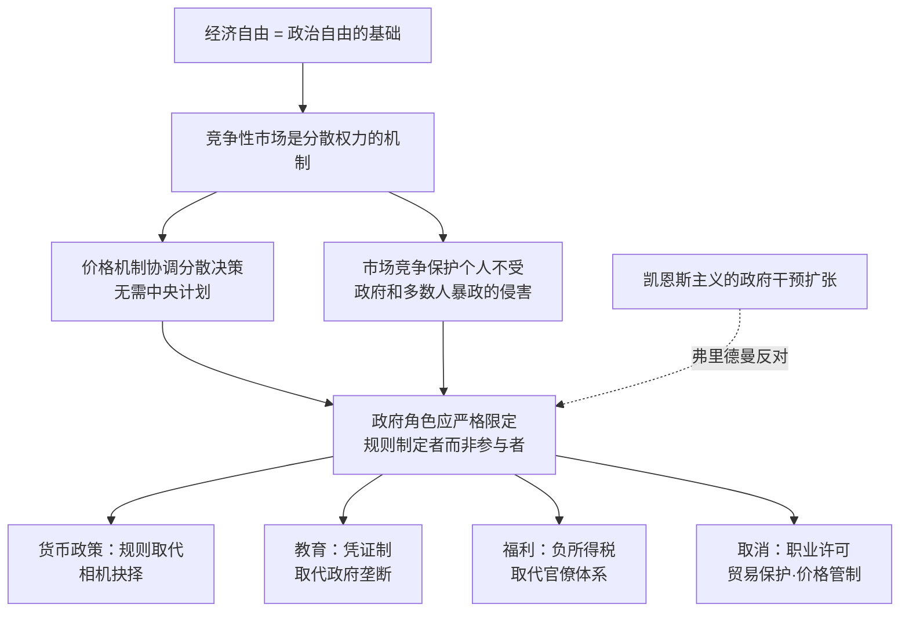

# 《资本主义与自由》深度读书笔记

> [!abstract]
> 《资本主义与自由》（Capitalism and Freedom）是美国经济学家米尔顿·弗里德曼1962年出版的经济学经典，脱胎于他1956年在沃巴什学院的系列讲座。弗里德曼是芝加哥经济学派的领军人物，1976年诺贝尔经济学奖得主，货币主义的创始人。这本书的核心命题是：==经济自由既是政治自由的必要条件，也是政治自由最有效的保障机制==。竞争性资本主义——即通过自由市场组织经济活动——不仅在效率上优于政府干预，更在根本上保护了个人不受国家权力的侵蚀。弗里德曼逐章拆解了政府在教育、职业许可、货币政策、贸易保护、社会福利等领域的干预，论证大多数干预不仅未能实现其声称的目标，反而损害了它们想要帮助的人群。全书是对[[《通论》|凯恩斯主义]]政策范式最系统、最有影响力的自由主义反击，深刻塑造了1980年代以来的全球经济政策转向。

## 这本书要解决什么经济问题

> [!note] 核心困惑
> ==20世纪中叶，西方知识界普遍认为资本主义的放任已被证明失败（大萧条是"铁证"），政府干预是纠正市场失灵的唯一出路。弗里德曼要回答的问题是：这个被广泛接受的前提本身是否就是错误的？==

1930年代大萧条的创伤深刻塑造了整整一代经济学家和政策制定者的世界观。凯恩斯在[[《通论》|《就业、利息和货币通论》]]中论证了市场经济无法自动实现充分就业，需要政府通过财政政策主动管理总需求。这一理论在二战后成为西方国家经济政策的主导框架——政府大规模介入经济被视为理所当然，不仅体现在反周期的宏观调控上，更体现在价格管制、贸易保护、产业政策、教育垄断、职业准入管制等微观层面的广泛干预中。

> [!tip] 弗里德曼的反击
> 弗里德曼认为这个叙事从根基上就搞错了因果关系。==大萧条不是自由市场失败的证据，而是政府——具体来说是美联储——灾难性政策失误的结果。==美联储在1929年股市崩盘后不仅没有向银行体系注入流动性，反而任由货币供应量收缩了三分之一，导致数千家银行倒闭，信贷冻结，将一次可控的经济衰退推向了史无前例的灾难。弗里德曼在与安娜·施瓦茨合著的[[《美国货币史》]]中用详实的数据论证了这一点。

在弗里德曼写作此书的1960年代初，美国政府的经济角色已经膨胀到前所未有的程度。联邦支出占GDP的比重从1929年的约3%上升到约18%，加上州和地方政府的支出，政府总支出已占GDP的近三分之一。政府管制覆盖了从航空票价到天然气价格、从广播频率到药品审批的几乎所有经济领域。工会通过法律保护获得了巨大的谈判权力。社会保障、医疗补助等福利项目不断扩张。

弗里德曼看到的不是一个运转良好的混合经济体，而是一个==自由正在被以善意为名义逐步蚕食的社会==。他要做的不仅是在技术层面反驳凯恩斯主义的具体政策建议，而是在哲学层面重建一个被遗忘的论证：经济自由和政治自由是不可分割的整体，削弱前者必然危及后者。

在经济学谱系中，弗里德曼接续的是从[[《国富论》|亚当·斯密]]到哈耶克（[[《通往奴役之路》]]）的古典自由主义传统。他与凯恩斯的分歧不仅是关于货币政策还是财政政策更有效的技术争论，而是关于==政府和市场哪个更值得信任==这一根本性判断的分歧。凯恩斯相信受过良好教育的精英可以通过审慎的政策管理经济，弗里德曼则认为，无论精英多么善意，==集中化的权力总会被滥用，而分散化的市场竞争才是约束权力、保护自由的最可靠机制==。

## 核心模型地图

弗里德曼全书的论证围绕三个层层递进的核心主张展开：

- **经济自由与政治自由不可分割**：经济自由不只是"效率工具"，更是个人在政治上免于被强制的必要前提。在一个政府控制所有经济资源的社会里，即使宪法保障言论自由，一个持不同政见者也无处谋生——经济依附使政治自由沦为空文
- **竞争性市场是已知的最佳权力分散机制**：价格体系通过无数分散个体的自愿交易协调经济活动，不需要任何人"规划"全局。竞争确保没有任何单一买方或卖方能主宰市场，这种经济上的分散恰恰是对抗政治集中化的屏障
- **政府干预几乎总是产生与其目标相反的效果**：弗里德曼逐一分析了教育、职业许可、社会保障、关税、农业补贴等具体领域，论证政府干预通常被利益集团俘获，最终保护的是既得利益者而非弱势群体

> [!important]
> 理解弗里德曼的关键在于：他不是一个无政府主义者，他承认政府有必要存在——但政府的角色应严格限定在==制定和执行规则==（产权保护、合同执行、防止垄断、提供某些公共品），而不是==直接参与经济活动或试图决定谁应该得到什么==。这是"规则之内的自由"与"政府主导的秩序"之间的根本分野。

## 逐层深入

### 经济自由与政治自由：一个被忽视的关联

弗里德曼在开篇两章建立了全书的哲学基础。他的核心论证可以这样理解：==政治自由的实质是个人有能力在不受他人强制的情况下做出自己的选择。而这种能力的前提是经济独立。==

设想一个极端情况：政府是唯一雇主。在这样的社会里，任何批评政府的人都面临失去生计的风险——不需要秘密警察，经济依附本身就是最有效的政治控制工具。这不是假设情景。苏联体制下的异见者面临的第一个惩罚往往不是监禁，而是失去工作——在国家控制一切就业岗位的体制下，这等于社会性死亡。

> [!note] 历史验证
> 弗里德曼写作此书时（1962年），这个论证还主要是理论性的。此后几十年的历史提供了丰富的验证。==没有一个实行中央计划经济的国家同时维持了政治自由==，而经济自由化——如二战后西德的"经济奇迹"、1980年代后中国和东欧的市场改革——往往是政治开放的先导或伴随条件（尽管并非充分条件，中国案例在这里构成了一个重要的复杂化因素）。

反过来，弗里德曼也指出，==资本主义虽然是政治自由的必要条件，却不是充分条件==——意大利法西斯时期和日本明治时代都有相当程度的私有企业制度，但并不民主。他的论证是"必要"而非"充分"：没有经济自由就不可能有政治自由，但有了经济自由也不能保证政治自由。

这个论证在今天看来似乎不言而喻，但在1962年的知识界，它具有相当的挑战性。当时西方学术界对中央计划的热情仍然高涨——大量杰出的经济学家（包括保罗·萨缪尔森）在教科书中预测苏联经济将赶上甚至超越美国。弗里德曼旗帜鲜明地站在另一边，而历史证明他的判断更接近现实。

### 货币政策：规则取代相机抉择

> [!example] 弗里德曼的货币主义核心主张
> ==通货膨胀在任何时候、任何地方都是一种货币现象。==经济中的价格水平在长期中由货币供应量决定。如果中央银行让货币供应量增长过快，物价就会上升——这就是通胀；如果增长过慢甚至收缩，经济就会陷入通缩和衰退。

弗里德曼对大萧条的重新诊断是他货币理论最有力的应用。凯恩斯主义将大萧条归咎于私人部门的"动物精神"——投资者信心崩溃导致总需求塌陷，市场无法自我修复。弗里德曼的诊断完全不同：美联储在1929-1933年间犯下了一系列致命错误——面对银行恐慌，它没有履行"最后贷款人"的职责向银行体系提供流动性，反而通过紧缩货币政策加剧了信用崩溃。==货币供应量在这个时期收缩了约三分之一——这是史无前例的货币政策灾难，而非自由市场的固有缺陷。==

> [!tip] 政策主张：k%规则
> 既然央行官员的"相机抉择"（根据当时经济状况灵活调整政策）导致了如此灾难性的后果，弗里德曼主张用简单的规则取代央行的自由裁量权：==让货币供应量以固定比率（如每年3%-5%，大致匹配实际经济潜在增长率）稳定增长==。不需要央行行长猜测经济走向，不需要相机抉择，不需要精英判断——只需要一条自动执行的规则。

弗里德曼反对相机抉择的理由有三层。第一，==信息问题==：央行不可能实时掌握经济的全部信息，政策制定总是基于不完整甚至过时的数据。第二，==时滞问题==：货币政策从实施到生效存在"长而可变的时滞"（他的实证研究显示平均约6-18个月），这意味着今天为应对当前状况而采取的措施，等到生效时经济状况可能已经完全不同，原本的刺激可能变成火上浇油。第三，==政治问题==：中央银行名义上独立，实际上面临巨大的政治压力——选举前刺激经济的诱惑极难抵挡，这导致了系统性的通胀偏向。

> [!warning] 现实检验
> 弗里德曼的k%规则在实践中从未被完整采用。1979年沃尔克担任美联储主席后确实转向了货币总量目标制，但很快发现==金融创新使得货币供应量的定义和测量变得极为困难==——M1、M2等指标与经济活动的稳定关系在1980年代后瓦解了。各国央行最终转向了通胀目标制——这在精神上继承了弗里德曼"规则优于相机抉择"的理念，但在具体操作上给了央行远多于k%规则所允许的灵活性。2008年金融危机后各国央行的非常规政策（量化宽松、零利率乃至负利率）更是远远超出了弗里德曼设想的框架。

### 政府的合理边界：市场失灵的严格限定

弗里德曼不是无政府资本主义者。他明确承认存在市场无法有效处理的领域，政府干预在这些领域是合理的。但他把这些领域界定得非常狭窄：

**外部性（邻里效应）**。当一个人的行为对他人产生了不通过市场价格反映的影响时——比如工厂排放的污染——市场价格就无法正确引导资源配置，政府干预有其正当性。但弗里德曼强调，==外部性的存在是政府干预的必要条件而非充分条件==——你还需要证明政府干预带来的净收益超过了干预本身的成本（包括官僚机构的运行成本、寻租行为、信息损失等）。在很多情况下，人们以"外部性"为名要求的政府干预其实反映的是利益集团的诉求，而非真正的市场失灵。

**自然垄断**。在某些行业（如供水、电力输配网），竞争不可行或效率极低——一个城市不需要三套平行的自来水管网。弗里德曼承认这是市场力量的真实局限，但他指出，==面对自然垄断有三种选择：私人垄断、政府管制下的私人垄断、政府直接经营——三种都不完美==。他倾向于不受管制的私人垄断或政府管制（视具体情况而定），认为==政府直接经营通常是最差选择==，因为缺乏利润动机和竞争压力的政府机构几乎总是在效率上远逊于私人企业。

> [!note] 公共品
> 弗里德曼承认国防等纯公共品无法由市场提供——你不可能在享受国防保护的同时不为他人提供保护（非排他性），一个人享受保护不会减少他人的保护（非竞争性）。但他严格限定了公共品的范围——==很多被政府以"公共品"名义提供的服务（如教育、邮政）其实完全可以由市场提供==。

**家长主义的严格限制**。弗里德曼承认对于"不负责任的人"——主要指儿童和精神障碍者——社会不能完全放任。但他坚决反对将家长主义扩展到心智正常的成年人：==一个自由社会的核心原则是，成年人有权做出别人认为愚蠢的选择，只要他们不直接伤害他人。==政府没有资格替成年人决定什么是"好的"消费、投资或生活方式选择。

### 教育券制度：打破政府对教育的垄断

弗里德曼对教育的分析是全书最有政策影响力的章节之一。他首先区分了两个经常被混淆的问题：==政府应不应该资助教育，和政府应不应该直接经营学校==——他的回答是"是"和"不一定"。

教育具有正外部性——一个受过良好教育的公民对整个社会有溢出效益（更高的公民参与度、更低的犯罪率、更好的公共卫生意识等），因此政府有理由确保每个孩子都接受基本教育。但从这里到"政府应该经营学校"之间有一个巨大的逻辑跳跃。

> [!tip] 教育券的设计
> ==弗里德曼提出：政府向每个适龄儿童的家庭发放教育券（voucher），面值等于公立学校的生均开支。家庭可以拿着这张券到任何符合最低标准的学校——公立或私立——为孩子注册入学。==学校之间为吸引学生而竞争，竞争驱动教育质量提升和创新。家长拥有选择权，不再被束缚在按学区划分的公立学校系统中。

弗里德曼认为政府垄断教育体系存在几个根本问题。第一，==缺乏竞争压力==——公立学校无论教学质量如何都能获得拨款，因为学生被按学区分配，无处可去。第二，==官僚化==——教育资源的分配由行政机构而非消费者（家长和学生）的选择来决定，导致资源错配。第三，==不平等固化==——富裕家庭可以通过购买高房价学区的房产来为子女获得优质公立教育，或者直接送子女上私立学校，而贫困家庭的孩子只能被困在质量低下的学区学校中。==教育券恰恰最有利于贫困家庭——它赋予他们和富人同样的选择权。==

> [!warning] 争议与后续
> 教育券制度在全球多地进行了不同规模的试验。智利在皮诺切特时期（弗里德曼曾为其提供经济顾问建议，这一关系引发了巨大的道德争议）推行了全国性的教育券制度。美国的密尔沃基、克利夫兰等城市也进行了有限的试点。==实证结果并不像弗里德曼预期的那样一边倒——一些研究显示教育券对参与学生的成绩有小幅提升，但也有研究发现效果不显著或存在筛选效应（私立学校挑选优质生源，公立学校被留下处理最困难的学生群体）。==瑞典的教育市场化改革（允许营利性私立学校与公立学校竞争）在2000年代后被指与教育质量的系统性下降相关，成为反对者常引用的案例。

### 职业许可制度：以保护消费者之名保护既得利益者

弗里德曼用大量篇幅攻击职业许可制度——他认为这是政府干预损害其声称要保护的对象的最典型案例。

以医疗行业为例。美国医学会（AMA）通过控制医学院招生名额和行医许可标准，人为限制了医生的供给。弗里德曼的论证是：表面上，执业许可保护了病人免受庸医之害；实际上，==它主要保护了现有医生免受竞争——限制供给推高了医疗服务价格，使医生收入远高于竞争市场水平，而消费者为此付出了更高的费用和更长的等待时间==。

弗里德曼并不否认信息不对称的存在——病人确实很难判断医生的水平。但他认为解决方案不应该是禁止无执照者行医，而应该是==信息披露和认证==（certification）——让合格的认证机构向公众提供关于医生资质的信息，让消费者自己决定是否愿意找一个没有认证的医生（可能更便宜）。政府发放"许可"（licensing）——即禁止未获许可者从事该职业——是一种远比认证（certification）更具强制性的手段，而弗里德曼认为大多数情况下这种强制性没有正当理由。

> [!note] 扩展到其他职业
> 弗里德曼指出，职业许可已经远远超出了医疗等少数高风险领域。在他写作的年代，美国有超过75个职业需要州级许可——从律师、会计到理发师、出租车司机甚至室内装潢师。在几乎所有案例中，==推动建立许可制度的都是该行业的现有从业者，而非消费者==——这本身就暴露了许可制度的真实受益者是谁。这是"规制俘获"（regulatory capture）的经典案例：政府管制被它本应约束的对象所控制。

### 社会福利改革：负所得税取代官僚体系

弗里德曼对现有社会福利制度的批评集中在两点：第一，==庞大的官僚机构吞噬了大量本应用于帮助穷人的资源==——社工、审查员、管理者的薪酬和办公费用占了福利预算的巨大比例。第二，==现有制度创造了"贫困陷阱"==——当一个人开始工作或收入增加时，福利减少的幅度往往接近甚至超过收入增加的幅度，这意味着他实际上面临接近100%甚至超过100%的有效边际税率，工作的经济动力被摧毁。

> [!tip] 负所得税方案
> ==弗里德曼提出用"负所得税"（Negative Income Tax）取代所有现有的分类福利项目。==机制非常简单：设定一个收入门槛（比如一万美元），门槛以上的部分按正常税率纳税，门槛以下的部分政府按一定比率（比如50%）补贴差额。如果一个人没有任何收入，他获得5000美元的补贴（门槛1万 × 50%）；如果他赚了4000美元，他获得3000美元的补贴（差额6000 × 50%），总收入7000美元；如果他赚了8000美元，他获得1000美元的补贴（差额2000 × 50%），总收入9000美元。

这个方案的设计解决了两个关键问题。第一，==消除贫困陷阱==：在任何收入水平上，多赚一元钱总是让总收入增加——补贴减少的幅度始终低于收入增加的幅度，保留了工作的正向激励。第二，==大幅减少官僚机构==：不需要甄别申请者属于哪个福利类别，不需要社工上门审查，不需要分别管理食品券、住房补贴、医疗补助等数十个项目——只需通过现有的税务系统一次性操作。

> [!important]
> 负所得税的理念后来以"劳动所得税抵免"（EITC）的形式在美国部分实现，并被两党广泛支持为"最有效的反贫困工具之一"。近年来全球范围内对"全民基本收入"（UBI）的讨论也深受弗里德曼负所得税构想的影响——==尽管弗里德曼本人不太可能支持UBI的无条件性和高额度版本==，因为那与他"保留工作激励"的核心考量相悖。

### 贸易与汇率：自由贸易与浮动汇率

弗里德曼是彻底的自由贸易主义者。他的论证从亚当·斯密的比较优势原理出发，但加入了更现实的政治经济学分析。

==关税和贸易限制名义上保护了国内产业和工人，实际上是让全体消费者为少数行业的利益买单。==假设政府对进口钢铁征收关税——钢铁工人保住了工作（这是可见的、集中的收益），但所有使用钢铁的下游企业（汽车制造商、建筑商、家电企业）的成本上升了，最终转嫁给消费者（这是不可见的、分散的损失）。弗里德曼指出，==分散的损失总量几乎总是远大于集中的收益——但因为受益者高度集中且有动力游说，而受损者高度分散且每个人的损失不大到值得为之抗争，保护主义政策就这样不断产生了。==

> [!note] 浮动汇率
> 弗里德曼早在1953年就发表了为浮动汇率辩护的重要论文，在当时的布雷顿森林固定汇率体系下这是非常异端的观点。他的论证是：==固定汇率制度要求各国放弃独立的货币政策来维持汇率锚定，当国内经济状况需要调整时（比如通胀率差异导致实际汇率失调），固定汇率制度迫使调整通过痛苦的价格和工资下调来完成，而浮动汇率允许汇率本身吸收这种调整压力。==1971年布雷顿森林体系瓦解后，主要工业国转向浮动汇率——弗里德曼的主张事后被证明具有相当的预见性。

### 收入分配：市场分配的正当性与再分配的限度

弗里德曼在全书的倒数几章直面了一个核心伦理问题：==市场产生的收入分配是否"公平"？==

他的回答是多层次的。首先，在一个竞争性市场中，收入差异反映了人们在技能、努力、风险承担和运气上的差异。弗里德曼坦率地承认运气的巨大作用——一个人出生在什么家庭、拥有什么天赋、处于什么历史时期，这些他无法选择的因素对收入有巨大影响。但他认为，==试图通过政府再分配来消除运气带来的不平等，其代价（对自由的侵蚀、对激励的扭曲、对经济效率的损害）远大于收益。==

> [!warning] 平等的两种含义
> 弗里德曼严格区分了"机会平等"和"结果平等"。他支持前者——==每个人都应该有平等的起跑线，不因种族、宗教或出身而被剥夺机会==。但他坚决反对后者——试图让所有人到达终点时处于相同位置的努力，不仅在实践中不可能，在道德上也不可取，因为这必然要求一个拥有巨大权力的政府来强制决定谁得到什么。==对结果平等的追求最终将摧毁自由——这正是哈耶克在《通往奴役之路》中预言的。==

弗里德曼也对累进税提出了尖锐的质疑。他认为高度累进的所得税在实践中效果很差——==富人有资源聘请税务顾问来利用各种漏洞和避税手段，实际缴纳的有效税率远低于名义上的边际税率==。累进税制的主要后果不是让富人多缴税，而是扭曲了经济行为——推动资源从生产性活动转向避税活动。他建议用统一的比例税率（flat tax）取代累进税，并取消大部分税收减免和漏洞——这将更简单、更公平、更难以规避。

### 反歧视：市场竞争作为歧视的天敌

弗里德曼对种族歧视问题的分析可能是全书最具争议性的章节之一。他反对政府通过公平就业立法来禁止私人企业的歧视行为——不是因为他支持歧视（他明确表示歧视是"可鄙的"），而是因为他认为==强制性的反歧视法在哲学上侵犯了结社自由，在实践上不如市场竞争本身有效==。

他的论证是：在竞争性市场中，歧视有成本。==如果一个雇主仅因种族偏见拒绝雇用能力出色的黑人员工，他的竞争对手——如果不那么偏执——就可以低成本雇用这些被忽视的人才，从而获得竞争优势。==长期来看，歧视者会在竞争中被淘汰，或者被利润动机迫使放弃歧视。弗里德曼引用了南非种族隔离时期的例子：正是白人商人——而非道德改革者——最先推动放松对黑人劳工的限制，因为这些限制提高了他们的劳动力成本。

> [!warning] 争议点
> ==这个论证在逻辑上是成立的——如果市场是完全竞争的，如果信息是完全的，如果歧视只是个人偏好。==但历史现实远比这复杂。在弗里德曼写作此书的1962年，美国南方的种族歧视不是分散的个人偏好，而是由法律和社会制度（吉姆·克劳法）系统性地强制执行的——在这种条件下，指望市场竞争自发消除歧视是不现实的。1964年《民权法案》的通过以及此后黑人经济地位的改善，表明立法干预在纠正制度性歧视方面发挥了重要作用——尽管弗里德曼的支持者会争辩说，市场力量在法律框架建立之后才是真正推动变化的力量。

## 预测与现实

经受住检验的：

- ==通胀是货币现象==——1970年代的全球性通胀（根源是各国货币供应的过度扩张）和沃尔克通过紧缩货币政策成功遏制通胀的经历，有力地验证了弗里德曼的货币主义分析
- ==浮动汇率制度可行==——1971年布雷顿森林体系瓦解后，弗里德曼预言的灾难并未发生，主要经济体在浮动汇率下运行了半个世纪
- ==社会主义计划经济的失败==——苏联和东欧集团的瓦解，以及中国从计划经济向市场经济的转型，印证了弗里德曼关于中央计划无法有效配置资源的论断
- ==管制俘获和寻租==——航空、铁路、电信等行业在放松管制后价格下降、服务改善，验证了弗里德曼对政府管制效率的质疑
- ==福利制度的激励扭曲==——劳动所得税抵免（EITC）作为负所得税的部分实现，被广泛认为比传统福利项目更有效地激励了工作

> [!warning] 尚未明确验证或需要修正的
> - 弗里德曼的k%货币规则在1980年代因金融创新导致货币定义模糊而被放弃——==货币政策的实践最终走向了通胀目标制，保留了"规则"精神但赋予了央行更大的灵活性==
> - 2008年金融危机暴露了金融市场放松管制的重大风险——==衍生品市场的不透明和系统性风险的积累表明，弗里德曼低估了金融行业外部性的严重性==。危机后的救助和大规模财政刺激恰恰是弗里德曼终身反对的政策手段，但多数经济学家认为这些措施避免了又一次大萧条
> - 教育券的实证效果不如弗里德曼预期的那样清晰——==市场竞争改善教育质量的假设在实践中遇到了信息不对称、选择成本、筛选效应等复杂问题==
> - 收入不平等从1980年代至今的急剧扩大——减税、放松管制和削弱工会正是弗里德曼倡导的政策方向，但[[《21世纪资本论》|皮凯蒂]]的数据表明，这些政策与不平等的扩大之间存在密切关联。弗里德曼关于"市场分配的结果不需要被过度纠正"的主张在不平等达到当前水平后面临了更大的政治和道德压力

## 不同学派怎么说

- **凯恩斯主义**（保罗·萨缪尔森、詹姆斯·托宾、保罗·克鲁格曼）：弗里德曼严重低估了市场失灵的广度和深度。2008年金融危机证明了不受约束的金融市场可以自我毁灭，大规模政府干预（救助金融机构、财政刺激、量化宽松）不是威胁自由的暴政，而是避免经济灾难的必要手段。==弗里德曼对大萧条的货币主义解释虽有洞见，但忽视了财政政策在严重衰退中的独特作用==——当利率降到零（流动性陷阱）时，单靠货币政策无法拉动经济复苏

- **奥地利学派**（哈耶克、罗斯巴德）：弗里德曼在根本问题上走得不够远。他接受了央行和法定货币的存在，只想改革央行的操作规则——而==真正的自由市场方案是废除央行、回归金本位或完全的自由银行制度==。此外，弗里德曼对政府征税提供"公共品"（包括教育券等）的接受，在更彻底的自由意志主义者看来仍然是对自由的不当妥协

- **制度经济学和行为经济学**（斯蒂格利茨、阿克洛夫、塞勒）：弗里德曼的理论建立在"理性经济人"和"完全竞争"的假设之上。==现实中的市场充斥着信息不对称、外部性、有限理性和行为偏差==——消费者并不总是知道什么对自己最好（这挑战了弗里德曼反对家长主义的立场），市场力量并不总能约束垄断和歧视（这挑战了他反对反垄断执法和反歧视立法的立场）。弗里德曼对"政府失灵"的分析精辟而有力，但他对"市场失灵"的轻描淡写同样是一种偏见

- **社会民主主义**（北欧经验的支持者）：==北欧国家同时拥有高税收、大政府和高水平的经济自由、创新能力和个人幸福感==，这个事实对弗里德曼"政府越大自由越少"的逻辑构成了显著挑战。高质量的公共教育、医疗和社会保障不仅没有摧毁自由，反而为个人提供了更大的"实质性自由"——在不担心破产的情况下创业、在不担心医疗费用的情况下换工作——这是纯粹的市场自由所无法提供的

## 对你意味着什么

弗里德曼给你的最根本提醒是：==当有人以"为你好"的名义要求你交出选择权时，保持警惕。==无论那个人是政府官员、行业协会还是道德倡导者。限制你选择的自由——即使是以保护你的名义——几乎总是同时限制了你的机会。

在具体的经济决策层面，弗里德曼的分析提醒你注意政策的"看不见的成本"。贸易保护拯救了钢铁工人的就业，但你为每一辆汽车多付了几百美元——只是没人告诉你。职业许可"保护"了你的安全，但你为每一次看医生多等了几周、多付了几十美元——因为人为制造的医生短缺。理解这些隐藏的成本，你就能更清醒地评估政策主张，而不是被集中的、可见的好处所迷惑。

但也要对弗里德曼的框架保持批判性距离。==他对市场力量的信心和对政府失灵的警觉都有坚实的经验基础，但他对市场失灵的轻视——尤其在金融监管、环境保护、信息不对称等领域——已被后续的历史反复修正。==自由市场不是万能药，政府干预也不是万恶之源。最有用的思维框架可能不是"市场还是政府"的二选一，而是在每个具体问题上评估两种选择各自的成本和收益。

## 延伸阅读

- [[《通往奴役之路》]]：哈耶克在1944年发出的警告——中央计划不可避免地通向极权主义。弗里德曼的《资本主义与自由》可以看作是哈耶克这一论证在具体政策领域的展开和应用
- [[《通论》]]：凯恩斯的《就业、利息和货币通论》是弗里德曼终身对抗的理论体系。对照阅读能看到20世纪最重要的两种经济学世界观之间的根本分歧
- [[《21世纪资本论》]]：皮凯蒂从数据角度提供了弗里德曼框架的一个重要反例——自由市场的长期运行趋势可能是财富集中而非广泛繁荣，这与弗里德曼对市场分配结果的乐观态度形成了尖锐的张力
- [[《美国货币史》]]：弗里德曼与安娜·施瓦茨合著的学术巨著，用详实的数据重新诊断了大萧条的根源——这是理解弗里德曼货币主义思想不可绕过的基础文献
