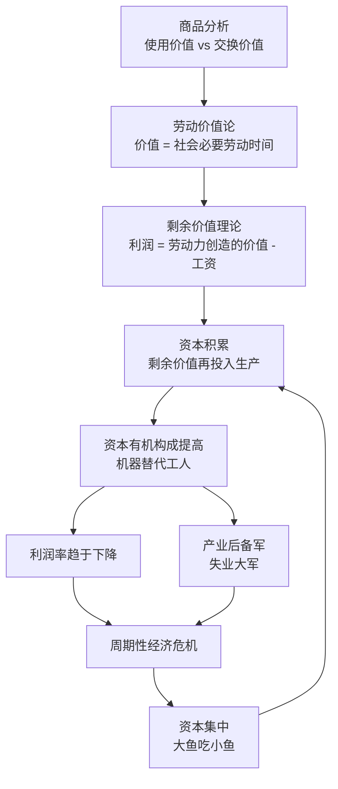

# 《资本论》深度读书笔记

> [!abstract]
> 《资本论》是马克思对资本主义生产方式最彻底的解剖。从一件普通商品出发，层层追问价值从何而来、利润从何而来、资本如何自我增殖，最终揭示出他认为隐藏在自由交换表象之下的剥削关系。无论你是否认同其结论，《资本论》提出的问题——财富如何被创造和分配？谁得到了什么？为什么？——至今仍是经济学和社会科学的核心议题。第一卷于1867年出版，第二卷和第三卷由恩格斯在马克思去世后整理出版。

## 这本书要解决什么经济问题

马克思写作《资本论》的19世纪中叶，工业革命已经彻底改变了欧洲的面貌。工厂拔地而起，城市急剧膨胀，财富以前所未有的速度被创造出来。英国的钢铁产量在半个世纪内增长了几十倍，纺织业的产出几乎没有上限地扩张，铁路网络像血管一样向整个大陆延伸。但与此同时，工人阶级的生存状况触目惊心：每天工作14-16小时，工资勉强糊口，童工随处可见，工伤事故司空见惯。==曼彻斯特工厂区的平均预期寿命只有17岁==——这不是一个遥远的历史数字，而是马克思亲眼所见的现实。恩格斯在《英国工人阶级状况》中详细记录了这些惨状，这本书对马克思产生了深远的影响。

> [!note] 核心困惑
> ==在一个标榜自由平等交换的市场经济中，为什么会系统性地产生如此巨大的贫富分化？资本家的利润到底从哪里来？==

古典经济学——尤其是[[《国富论》|亚当·斯密]]和大卫·李嘉图——已经提出了劳动价值论，认为商品的价值来源于生产它所耗费的劳动。马克思接受了这个起点，但他追问了一个前人回避的问题：如果一切价值都来自劳动，那么资本家不劳动却能获得利润，这个利润的来源是什么？斯密和李嘉图对这个问题含糊其辞——他们把利润视为"自然的"收入类别之一，和工资、地租并列。马克思认为这种处理方式掩盖了问题的本质。

> [!tip] 核心答案
> ==利润的来源是剩余价值——工人创造的价值超出其工资的那个部分。==资本家购买的不是工人的劳动，而是工人的"劳动力"，而劳动力的价值（工资）低于劳动力在使用过程中实际创造的价值。这个差额就是剩余价值，也就是利润的本质。

在经济学谱系中，马克思是古典政治经济学的终结者和批判者。他站在斯密和李嘉图的肩膀上，使用他们的分析工具（劳动价值论），却得出了完全颠覆性的结论：==资本主义不是一个和谐的自然秩序，而是一个建立在特定历史条件下、包含内在矛盾的生产方式==。它有一个开始（从封建制度中产生），因此也会有一个结束——这个结论是马克思整个分析的政治指向。你不必同意这个结论，但理解他的推理过程本身就极有价值。

## 核心模型地图

马克思在《资本论》中构建了三个层层递进的核心理论模型：

- **商品与价值理论**：交换价值由社会必要劳动时间决定，技术进步不断降低商品价值
- **剩余价值理论**：利润来自工人创造的价值超出工资的部分，剥削发生在生产领域而非流通领域
- **资本积累与危机理论**：积累导致资本有机构成提高，利润率趋于下降，矛盾周期性爆发为危机

> [!important]
> 这三个模型构成了一个完整的分析链条：价值理论解释价格背后的本质，剩余价值理论解释利润的来源，资本积累理论解释资本主义经济运动的规律和趋势。如果你只看到"剥削"的结论而不理解推导过程，就既无法正确评价马克思的贡献，也无法有效批评他的局限。

## 逐层深入

### 商品的二重性：从一件衬衫开始

> [!example] 开篇的起手式
> "资本主义生产方式占统治地位的社会的财富，表现为'庞大的商品堆积'。"

马克思从最简单、最日常的商品入手。一件衬衫有两个维度：**使用价值**（能穿、能保暖）和**交换价值**（在市场上能换到的其他商品的量——比如一件衬衫可以换两双袜子）。使用价值是具体的、各不相同的，但交换价值要求不同商品之间是可比较的。一件衬衫凭什么能和两双袜子交换？它们之间有什么共同的东西？马克思的回答是：它们都是人类劳动的产物。抽掉一切具体的有用属性，剩下的就是==无差别的"抽象人类劳动"——这就是价值的实体==。

商品的价值量由"社会必要劳动时间"决定——在现有的社会正常的生产条件下，在社会平均的劳动熟练程度和劳动强度下，生产某种使用价值所需要的劳动时间。如果技术进步让生产一件衬衫只需要原来一半的时间，那么衬衫的价值就会减半——不管你手里那件是不是在老技术下花了更多时间做出来的。

> [!tip] 关键推论
> 单个企业如果采用了比社会平均水平更先进的技术，它生产同样一件衬衫花的时间比社会必要劳动时间少，但衬衫的售价仍然由社会必要劳动时间决定——于是这家企业就获得了==超额利润==。这种超额利润正是推动资本家不断进行技术革新的动力。

这个分析有一个极为实际的推论：**技术进步会不断降低商品的价值**。对消费者来说这是好事（东西越来越便宜），但对资本家来说意味着持续的压力（利润空间不断被压缩），对工人来说则意味着他们的技能随时可能被新技术淘汰。你今天在电子产品市场上观察到的现象——产品功能越来越强大但价格越来越低——恰恰是这个规律的当代表现。

### 商品拜物教：物的关系掩盖了人的关系

> [!warning] 商品拜物教
> 在市场经济中，人与人之间的社会关系被转化为物与物之间的交换关系。你买一杯咖啡，看到的是一个商品和一个价格标签，看不到的是咖啡豆种植园中劳动者的处境、运输链条中的碳排放、烘焙工厂里的工作条件。商品仿佛拥有了自主的"价值"，它的社会本质被神秘化了。

这不是宗教意义上的崇拜，而是一种认知遮蔽。当你在超市看到一件标价99元的T恤时，价格标签把一个涉及棉花种植、纺纱、织布、染色、裁剪、缝纫、运输的复杂社会过程简化成了一个数字。你不会想到越南工厂里缝纫这件T恤的女工每天工作多少小时、赚多少钱、她的孩子是否在上学。市场的抽象化让一切变得干净利落——商品归商品，人归人——但在马克思看来，这种"干净"恰恰掩盖了最重要的东西：==人与人之间的权力关系和利益关系==。

无论你是否接受马克思的整套理论，这个"透过商品看到人"的分析视角都有独立的价值。它提醒你，每一个价格标签背后都有一个由具体的人在具体的条件下进行劳动的故事。

### 劳动力商品与剩余价值的秘密

马克思的分析进入核心环节：在自由平等的市场交换中，利润到底从哪里来？

如果所有商品都按照其价值（社会必要劳动时间）进行交换，那么买进卖出之间不应该有差额——你不可能通过等价交换凭空制造出利润。但现实中利润确实存在。这个矛盾怎么解释？

马克思发现了一种特殊的商品：**劳动力**。劳动力和其他商品一样在市场上按其价值出售——劳动力的价值等于维持工人及其家庭生存和再生产所需的生活资料的价值，也就是工资。在19世纪的英国，这意味着工人得到的工资恰好够买面包、住简陋的房屋、穿最基本的衣服，并养活能继承他们位置的下一代工人。到这一步为止，一切都是"公平"的等价交换。

> [!tip] 核心公式
> 劳动力有一个任何其他商品都没有的特殊属性：==它在使用过程中能够创造出超过自身价值的新价值==。
>
> 工人每天需要4小时的劳动产品来维持自己的生存（对应于他的工资），但资本家让他工作10小时。前4小时他在"为自己工作"（创造相当于工资的价值 = ==必要劳动==），后6小时他在"为资本家工作"（创造==剩余价值==，被资本家无偿占有）。

马克思把资本分为两部分：购买生产资料（机器、原料）的叫"不变资本"（它只是把自身的价值转移到产品中，不创造新价值），购买劳动力的叫"可变资本"（它在使用过程中创造出超过自身的价值）。==剩余价值率=剩余价值/可变资本==，它衡量的是资本对劳动的剥削程度。在马克思研究的19世纪英国纺织业中，他估算剩余价值率常常在100%以上——也就是说，工人为自己工作的时间和为资本家工作的时间至少一样多。

> [!note] 剥削发生在哪里
> ==不是在流通领域（交换是等价的），而是在生产领域（劳动力创造的价值大于其自身价值）。==市场交换的表面公平掩盖了生产过程中的实质不公平——这就是马克思所说的"拜物教"的经济学版本。

这里需要指出一个马克思分析的精妙之处：他不是在说资本家个人道德败坏。在他的框架中，==即使一个资本家主观上非常善良，市场竞争也会迫使他压低工资、延长工时、提高效率——否则他就会被成本更低的竞争对手挤出市场==。剥削是制度的产物，不是个人恶意的结果。这个洞察让马克思的批判远比简单的道德谴责更加深刻。

### 绝对剩余价值与相对剩余价值

资本家有两种方法来增加剩余价值。

**绝对剩余价值**的方法简单粗暴：延长工作日。如果工人每天工作10小时变成12小时，而工资不变，那多出来的2小时全部转化为额外的剩余价值。马克思在《资本论》中用大量篇幅记录了19世纪英国工厂中触目惊心的劳动状况：一天14-16小时的工作、6岁的童工在棉纺厂里操作机器、没有任何安全防护的矿井中频繁发生致命事故。工作日的延长有一个物理极限——人不吃不睡会死——但在法律限制出现之前，资本家总是试图把工作日推向这个极限。马克思详细记录了英国议会围绕《工厂法》的斗争——资本家游说延长工时，工人运动争取缩短工时。

**相对剩余价值**的方法更精巧：在工作日不变的情况下，通过提高劳动生产力来降低劳动力的价值。如果技术进步使得食品、衣物等生活必需品更便宜了，那么工人维持生存所需的工资就更低，"必要劳动时间"就更短，剩余劳动时间就相应更长。

> [!example] 相对剩余价值的运作
> 面包的价格因为农业技术进步而降低了一半 → 工人只需要更少的工资就能买到同样的食物 → 必要劳动时间从4小时缩短为3小时 → 剩余劳动时间从6小时变成7小时 → ==在工作日不变的情况下，剩余价值率提高了==

这意味着，技术进步在马克思的框架中有一个矛盾的角色：它让商品更便宜、让社会更富裕，但同时也加深了剥削——因为生产力的提高让资本家能在不延长工时的情况下攫取更多剩余价值。消费者作为消费者受益了，但作为劳动者可能反而更受剥削了。

这两种方法在历史上交替出现。早期资本主义主要依赖绝对剩余价值（延长工时），但随着工人运动争取到工时限制，资本转向了相对剩余价值（技术升级）。今天的数字经济可能正在创造第三种形式：通过算法优化、平台经济和数据提取，在传统"工作时间"之外获取价值。外卖骑手名义上是"自由"的独立承包商，但算法对他们的路线、速度和接单量的控制，可能比19世纪工厂主对工人的控制更加精密和无处不在。马克思的分析框架虽然是为19世纪的工厂写的，但它提出的问题在数字时代依然尖锐。

### 资本积累的一般规律

马克思认为，资本积累——把剩余价值再投入到扩大再生产中——是资本主义运动的根本动力。资本家不是因为贪婪而积累，而是==竞争迫使他们不得不积累==：不投资于新技术和更大规模的生产，就会被竞争对手淘汰。资本家在这里不是作为个人而行动，而是作为"人格化的资本"而行动——资本的逻辑通过他们来执行自己的意志。

积累的过程带来了一个重要的趋势：**资本有机构成的提高**。随着技术进步，同样数量的工人能操作更多更好的机器，这意味着资本中用于购买机器设备（不变资本）的比例越来越高，用于雇佣工人（可变资本）的比例越来越低。在1800年，一个纺织工人操作一台手工织机；到1850年，一个工人可以看管多台动力织机。机器变得更贵了，但需要的工人更少了。

但根据马克思的理论，只有可变资本（活劳动）才能创造剩余价值。如果可变资本在总资本中的比例不断下降，==利润率——剩余价值与总资本的比率——也会趋于下降==。

这就是马克思所说的"利润率趋向下降的规律"。它不是说利润的绝对量会减少（总资本在增大，所以利润的绝对量可以增加），而是说每一单位资本获得的利润率会下降。资本家会通过各种"反趋势"来对抗这个规律——加强对工人的剥削、降低不变资本的价格、开拓海外市场、开发全新的产业——但马克思认为这些反趋势只能暂时延缓，不能根本改变这个趋势。

### 产业后备军与贫困积累

资本积累的另一个后果是马克思所说的"产业后备军"——一支庞大的失业人口。机器替代工人，工人被抛入失业大军。失业大军的存在压低了在职工人的工资（因为总有人愿意以更低的工资接受工作），也瓦解了工人的集体谈判能力。

> [!note] 产业后备军的三种形态
> - **流动形态**：暂时失业的熟练工人，随时准备被重新雇佣
> - **潜在形态**：农村中随时准备涌入城市工厂的人口
> - **停滞形态**：长期失业、从事最不稳定和最低报酬工作的人群
>
> 在产业后备军的底层，是完全被排除在正常劳动市场之外的赤贫人口——流浪者、乞丐、囚犯。马克思认为这不是个别人的不幸，而是资本积累过程的必然产物。

马克思由此得出了一个强烈的结论：==资本积累的一极是财富的积累，另一极是贫困的积累==。财富越集中在资本家手中，工人阶级的相对处境就越恶化。这不是某个坏资本家的道德问题，而是资本主义生产方式的结构性特征。

这个论断在马克思之后的历史中经受了复杂的检验。20世纪发达国家工人阶级的生活水平确实有了巨大提高——这是马克思没有充分预见的。但如果把视野扩展到全球，资本积累伴随贫困积累的模式在很多发展中国家仍然清晰可见。而在21世纪的发达国家，贫富差距的重新扩大——最富有的1%人口占有越来越多的社会财富——让马克思的某些论断重新获得了现实感。托马斯·皮凯蒂在[[《21世纪资本论》]]中用几个世纪的数据证明了一个趋势：当资本收益率（r）持续高于经济增长率（g）时，财富不平等就会自动扩大。这个发现虽然使用了和马克思完全不同的分析工具，但其核心直觉与马克思的诊断惊人地一致。

### 经济危机的必然性

> [!warning] 核心矛盾
> 资本主义有无限扩大生产的趋势（因为竞争迫使每个资本家都要扩大生产），但劳动者的消费能力被压低到最低限度（因为工资被尽可能压低以增加剩余价值）。==生产能力和消费能力之间的鸿沟越来越大==，最终导致产品过剩、价格暴跌、企业倒闭、工人失业——这就是经济危机。

马克思对危机的分析不仅限于"消费不足"这一个维度。他还指出了信用体系在危机形成中的作用：银行和信用扩张允许生产在一段时期内远远超出有效需求，这掩盖了矛盾，但也让矛盾在最终爆发时更加剧烈。这个洞察在2008年全球金融危机中得到了某种验证——信用扩张和金融衍生品创造了一个巨大的泡沫，当泡沫破裂时，危机的范围和深度远超如果没有信用扩张时的情况。

危机之后，大量资本被摧毁，弱小的企业被淘汰，幸存的企业以更低的成本重新开始积累——直到下一次危机。这个循环不断重复，而且马克思认为每次危机都比上一次更严重，因为资本的集中度在每次危机后都会提高。大鱼吃小鱼，市场从分散走向垄断。

### 原始积累：资本主义的"原罪"

> [!example] 马克思的历史考察
> 《资本论》第一卷的最后几章讨论了"原始积累"——资本主义关系是如何历史性地产生的。

马克思用尖锐的笔锋描述了这个过程：英国的"圈地运动"把农民从祖辈耕种的土地上赶走，变成了一无所有的"自由"劳动者（自由得除了自己的劳动力之外什么都没有）；殖民掠夺把亚洲、非洲和美洲的财富抽取到欧洲；奴隶贸易为新世界的种植园提供了免费劳动力。

马克思在这里的核心论点是：==资本主义的起点不是勤劳和节俭（这是古典经济学的神话），而是暴力和掠夺==。"资本来到世间，从头到脚，每个毛孔都滴着血和肮脏的东西。"这个论断不仅仅是道德谴责——它试图说明一个结构性问题：资本主义要运作，就需要一群除了劳动力之外一无所有的工人，而这群工人不是自然产生的，而是通过历史性的暴力剥夺而产生的。

## 预测与现实

经受住时间检验的：
- ==资本集中趋势==——今天的科技巨头（苹果、谷歌、亚马逊）比马克思时代的任何企业都庞大得多
- ==周期性经济危机==——从1929年大萧条到2008年金融危机，其间还有无数次较小的衰退和泡沫破裂
- ==全球贫富分化==——皮凯蒂的数据显示，发达国家最富有的10%人口占有的财富份额自1980年代以来持续上升

> [!warning] 未能应验的预测
> - 发达国家工人绝对贫困化没有加剧——福利制度、工人运动和技术进步显著提升了生活水平
> - 资本主义没有如预期般崩溃——展现出远超预期的适应性和自我修正能力
> - 利润率趋向下降在数据中缺乏一致支持——技术创新不断开辟新的利润空间
> - ==马克思的"诊断"比他的"处方"更有持久价值==——计划经济在20世纪实践中遭遇严重的结构性困难：没有价格信号的引导，中央计划者无法有效配置资源；缺乏竞争激励，国有企业效率普遍低下；权力过度集中导致政治上的专制

## 不同学派怎么说

- **奥地利学派**（门格尔、米塞斯、哈耶克）：从根本上拒绝劳动价值论，认为价值由消费者的主观评价决定。一杯沙漠中的水比一颗钻石更有价值——这不取决于生产它们花了多少劳动，而取决于你在那个时刻有多需要它。如果劳动价值论不成立，建立在它之上的整个剩余价值理论也就失去了基础
- **新古典经济学**：用边际分析取代了劳动价值论。工资、利润和地租由各种生产要素的边际生产力决定。工人得到的工资等于他最后一单位劳动为企业带来的产出增量。利润不是剥削，而是资本要素的正当回报
- **[[《就业、利息和货币通论》|凯恩斯主义]]**：接受有效需求不足会导致危机的直觉，但主张通过政府财政和货币政策刺激经济解决，而非推翻资本主义。危机被承认为真实存在的问题，但处方是改良而非革命
- **后马克思主义**：保留对权力关系、制度结构和历史变迁的分析，同时放弃那些已被证伪的具体预测。很多当代社会学家和政治经济学家仍然大量使用马克思的概念工具来分析不平等、全球化和金融化

## 对你意味着什么

读《资本论》对你最大的价值，不在于接受或拒绝马克思的全部理论，而在于获得一套追问"谁得到了什么、为什么"的分析视角。

- 消费时有意识地"透过商品看到人"——这个低价是怎么实现的？是技术进步带来的效率提升，还是生产链条某个环节的劳动者在承担代价？
- 关注你创造的价值与获得的报酬之间的差距——这个差距由什么决定？
- 注意经济危机中"生产过剩"与"消费不足"并存的悖论
- 学会用"制度而非个人"的视角分析问题——工人待遇差可能不是老板人品不好，而是竞争结构迫使所有企业压低劳动成本
- 理解马克思关于信用体系放大危机的洞察——当你看到信贷宽松和资产泡沫并存时，值得保持警惕
- 无论政治立场如何，马克思对资本主义自我矛盾的诊断——无限扩大生产与有限消费能力之间的张力——在经济周期的低谷中总会重新显现出它的解释力

## 延伸阅读

- [[《国富论》]]：马克思最重要的对话对象之一，斯密的劳动价值论为马克思提供了起点，但两人得出了完全不同的结论。对照阅读能看到同一个分析工具如何导向截然相反的世界观
- [[《21世纪资本论》]]：皮凯蒂用现代数据重新检验马克思核心论题，证实 r > g 导致财富不平等持续扩大。他的结论比马克思温和——主张通过全球资本税来纠正——但数据为马克思的直觉提供了21世纪的证据
- [[《就业、利息和货币通论》]]：凯恩斯对有效需求不足的另一种回应——在资本主义内部修补资本主义
- 《英国工人阶级状况》（恩格斯）：对19世纪英国工人生活的第一手调查报告，是理解马克思写作《资本论》的历史背景的最佳入口
