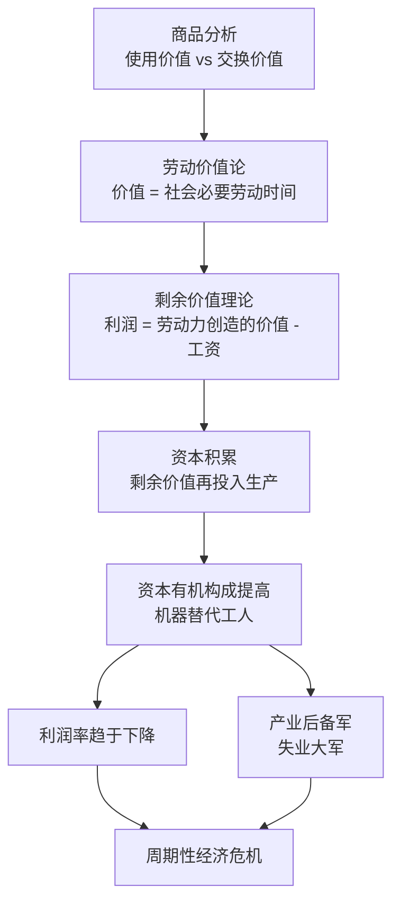

# 《资本论》深度读书笔记

> [!abstract]
> 《资本论》是马克思对资本主义生产方式最彻底的解剖。从一件普通商品出发，层层追问价值从何而来、利润从何而来、资本如何自我增殖，最终揭示出他认为隐藏在自由交换表象之下的剥削关系。无论你是否认同其结论，《资本论》提出的问题——财富如何被创造和分配？谁得到了什么？为什么？——至今仍是经济学和社会科学的核心议题。

## 这本书要解决什么经济问题

马克思面对的核心困惑是：==在一个标榜自由平等交换的市场经济中，为什么会系统性地产生如此巨大的贫富分化？资本家的利润到底从哪里来？==

> [!note] 写作背景
> 19世纪中叶的工业革命：工厂拔地而起，财富空前增长，但工人每天14-16小时工作、童工遍地、工伤事故频发。

马克思接受了斯密和李嘉图的劳动价值论作为起点，但追问了一个前人回避的问题：如果一切价值都来自劳动，资本家不劳动却能获得利润，这个利润的来源是什么？

> [!tip] 核心答案
> ==利润的来源是剩余价值——工人创造的价值超出其工资的那个部分。==资本家购买的不是劳动，而是"劳动力"，劳动力的价值（工资）低于劳动力实际创造的价值。差额就是剩余价值。

## 核心模型地图

三个层层递进的核心模型：
- **商品与价值理论**：交换价值由社会必要劳动时间决定
- **剩余价值理论**：利润来自工人创造的价值超出工资的部分
- **资本积累与危机理论**：积累导致矛盾累积，周期性爆发为危机

## 逐层深入

### 商品的二重性与商品拜物教

> [!example] 开篇的起手式
> "资本主义生产方式占统治地位的社会的财富，表现为'庞大的商品堆积'。"

每件商品都有**使用价值**（具体的有用性）和**交换价值**（能换到的其他商品的量）。不同商品之间能交换，是因为它们有共同的东西——==无差别的抽象人类劳动==。

> [!warning] 商品拜物教
> 市场经济中，人与人的社会关系被转化为物与物的交换关系。你买一杯咖啡，看到商品和价格，看不到种植园工人的处境、运输链条的辛苦。商品仿佛拥有了自主的"价值"，它的社会本质被神秘化了。

### 剩余价值的秘密

如果所有商品都按价值等价交换，利润从何而来？关键在于**劳动力**这种特殊商品：

- 劳动力的**价值** = 维持工人生存所需费用（工资）
- 劳动力的**使用价值** = 能创造出超过自身价值的新价值

> [!tip] 核心公式
> 工人工作10小时 → 前4小时创造的价值 = 工资（必要劳动）→ 后6小时创造的价值 = ==剩余价值==（被资本家无偿占有）

> [!note] 剥削发生在哪里
> ==不是在流通领域（交换是等价的），而是在生产领域（劳动力创造的价值大于其自身价值）。==市场交换的表面公平掩盖了生产过程中的实质不公平。

资本家增加剩余价值有两条路：
- **绝对剩余价值**：延长工作日
- **相对剩余价值**：提高生产力降低劳动力价值——技术进步让生活必需品更便宜，工资可以更低

### 资本积累的一般规律

竞争迫使资本家把剩余价值再投入扩大生产。机器不断替代工人（==资本有机构成提高==），导致：

- **利润率趋于下降**：只有活劳动创造剩余价值，而活劳动在总资本中比例不断下降
- **产业后备军壮大**：失业大军压低工资、瓦解谈判能力
- **财富两极分化**：积累的一极是财富，另一极是贫困

### 经济危机的必然性

> [!warning] 核心矛盾
> 资本主义有无限扩大生产的冲动（竞争驱动），但劳动者的消费能力被压低（工资被压低以增加剩余价值）。==生产能力与消费能力之间的鸿沟不断扩大==，最终爆发为产品过剩、企业倒闭、工人失业的经济危机。

马克思认为这种危机是周期性的、不可避免的，而且每次危机后资本集中度更高、矛盾更尖锐。

## 预测与现实

经受住时间检验的：
- 资本集中趋势——今天的科技巨头比马克思时代任何企业都庞大
- 周期性经济危机——从1929大萧条到2008金融危机
- 全球贫富分化——皮凯蒂用数据证实了 r > g

> [!warning] 未能应验的预测
> - 发达国家工人绝对贫困化没有加剧——福利制度和技术进步提升了生活水平
> - 资本主义没有如预期般崩溃——展现出远超预期的适应性
> - 利润率趋向下降在数据中缺乏一致支持
> - ==马克思的"诊断"比他的"处方"更有持久价值==——计划经济在20世纪实践中遭遇严重困难

## 不同学派怎么说

- **奥地利学派**：从根本上拒绝劳动价值论，认为价值由主观效用决定
- **新古典经济学**：工资由边际生产力决定，利润是资本要素的正当回报，不存在"剥削"
- **凯恩斯主义**：接受有效需求不足的诊断，但主张通过政府干预解决，而非推翻资本主义
- **后马克思主义**：保留对权力关系和制度结构的分析，放弃已被证伪的具体预测

## 对你意味着什么

- 消费时有意识地"透过商品看到人"——低价是怎么实现的？谁在承担代价？
- 关注你创造的价值与获得的报酬之间的差距——这个差距由什么决定？
- 注意经济危机中"生产过剩"与"消费不足"并存的悖论
- 无论政治立场如何，学会用"谁得到了什么、为什么"的视角审视经济现象

## 延伸阅读

- [[《国富论》]]：马克思最重要的对话对象，劳动价值论从温和版本到革命性版本的演变
- [[《21世纪资本论》]]：皮凯蒂用现代数据重新检验马克思核心论题，证实 r > g 导致不平等持续扩大
- [[《就业、利息和货币通论》]]：凯恩斯对有效需求不足的另一种回应——在资本主义内部修补资本主义
