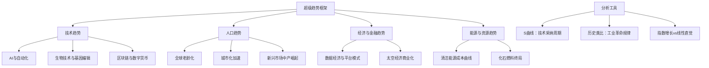

# 《逃不开的大势》深度读书笔记

> [!warning] 掌握度声明
> 这本书内容丰富，以下内容基于我有限的了解整理，建议对照原书阅读以获得最佳体验。

> [!abstract] 全书速览
> 未来十年将被一系列不可逆转的力量重塑——人工智能、生物技术、清洁能源、人口结构变迁、数据经济的崛起。拉斯·特维德把这些力量称为"超级趋势"，并提出一个核心主张：与其试图预测下一个季度的经济数据或下一次市场崩盘，不如理解那些已经确定正在发生、只是展开速度尚不确定的长期变革。这些趋势不是猜想，而是已经启动的进程——==关键不是它们会不会发生，而是你准备好了没有==。特维德用技术采纳的S曲线、历史工业革命的类比和人口统计学的硬数据，为投资者绘制了一张穿越不确定性的路线图。

## 这本书要解决什么经济问题

拉斯·特维德是丹麦企业家和投资人，在科技和金融领域有数十年的实战经验。他此前最知名的作品是 [[《逃不开的经济周期》 - 拉斯·特维德]]，那本书讨论的是经济的周期性波动。而这本《逃不开的大势》处理的是一个不同层次的问题：不是短期的起伏，而是长期的方向。

> [!note] 核心问题
> 特维德要回答的问题是：==哪些正在发生的变革是不可逆转的？==如果某些趋势注定会展开，那么聪明的策略不是抵抗它们，而是理解它们的速度和节奏，把自己放在趋势的正确一侧。

这本书的英文原名是 *Supertrends: 50 Things You Need to Know About the Future*，出版于2020年前后。特维德的方法论有两个支柱。第一个是从历史工业革命中总结规律——每一次重大技术变革都遵循类似的轨迹，从最初的怀疑到泡沫式的狂热再到广泛的采纳和社会重构。第二个是用S曲线分析技术采纳的生命周期——新技术的渗透率在早期增长缓慢，中期爆发式增长，后期趋于饱和，整个过程画出一条S形曲线。理解你所关注的技术处于S曲线的哪个位置，决定了你的投资策略和时间框架。

在经济类书籍的谱系中，这本书不是学术论文式的严谨论证，而更像一份面向投资者和商业决策者的趋势地图。它的竞争力在于跨领域的视野——把AI、生物技术、能源转型、人口变迁和金融创新放在同一个分析框架中，帮你看到它们之间的交汇和共振。

## 核心模型地图

> [!tip] 关键洞察
> 特维德的核心分析工具是**S曲线**。任何新技术的采纳都会经历三个阶段：底部的缓慢渗透期（怀疑者占主流）、中段的爆发期（临界点突破后迅速普及）、顶部的饱和期（增长放缓）。==投资回报最丰厚的窗口是S曲线从底部弯曲到中段的那个拐点==——此时技术已经证明可行，但市场尚未充分定价。错过这个窗口，你要么付出过高的价格，要么承受过大的不确定性。

## 逐层深入

### 超级趋势的本质：不可逆的力量

特维德在书中区分了两种对未来的判断。一种是预测——试图猜测某件特定事件会不会发生、何时发生，比如"明年会不会爆发金融危机"。这类预测的成功率很低，因为它依赖太多不可控的变量。另一种是识别趋势——辨认那些已经启动、背后有强大结构性力量支撑、几乎不可能被逆转的变化方向。

特维德所说的"超级趋势"属于后者。太阳能的发电成本在过去十年下降了约90%，这个下降不是偶然事件，而是由学习曲线和规模效应驱动的——每当累计产量翻一番，成本就下降约20-30%。这个规律在半导体领域已经持续了半个多世纪（摩尔定律），在太阳能领域也已经被观察了二十多年。你可以争论太阳能何时会完全取代化石燃料，但你很难否认这个方向本身。同样，全球65岁以上人口比例的上升是人口统计学的确定性事实——出生率和死亡率的数据不会骗人，今天已经出生的人口决定了未来二十年的劳动力结构和消费模式。

> [!example] 超级趋势vs短期预测
> 预测"比特币明年会涨到多少"是一个短期预测问题，充满不确定性。但判断"数字支付将持续替代现金交易"是识别一个超级趋势——背后有技术成本下降、年轻一代的支付习惯、监管的逐步适应等多重力量支撑。特维德建议你把精力花在后者而非前者上。

### AI与自动化：第四次工业革命

这可能是特维德讨论最多的趋势之一。他的分析框架不是简单地说"AI会取代工作"或"AI会创造工作"，而是从历史工业革命中寻找参照系。

每一次重大技术变革——蒸汽机、电力、计算机——都曾引发过"大规模失业"的恐慌。19世纪的卢德运动砸毁纺织机器，20世纪60年代肯尼迪总统成立委员会研究自动化导致的失业问题。但历史的结果是：技术革命在短期内确实摧毁了大量特定岗位，但在中长期创造了更多全新的工作类型——这些工作在革命之前甚至无法想象。1900年美国约40%的劳动力从事农业，如今这个比例不到2%，但美国的就业总量并没有因此减少，因为服务业、信息产业和知识经济创造了海量的新岗位。

> [!note] 特维德的立场
> 特维德可能认为AI和自动化的这一轮冲击与之前的工业革命遵循类似规律——==短期的岗位替代是真实的痛苦，但长期来看技术进步创造的就业机会很可能超过它摧毁的==。不过，这一次的转型速度可能比以往更快，留给社会适应的时间窗口更短，这对教育体系和社会保障制度提出了紧迫的要求。

AI的S曲线正在从底部向中段弯曲。深度学习在2012年之后取得了突破性进展，大语言模型在2020年代初展示了令人惊讶的通用能力。但AI在许多特定领域的实际部署仍然处于早期阶段——大量企业知道AI重要，但还不知道如何真正将它融入业务流程。这个"知道重要但不知道怎么用"的阶段，恰恰是S曲线底部向中段过渡的典型特征。对投资者来说，这意味着AI领域的长期增长空间仍然巨大，但选择具体标的需要辨别哪些公司真正掌握了可落地的技术，哪些只是在蹭概念。

### 生物技术与基因编辑：生命科学的拐点

CRISPR基因编辑技术的出现，在生物技术领域扮演的角色类似于互联网在信息技术领域扮演的角色——它把原本昂贵、缓慢、只有少数实验室能做的基因操作变成了相对便宜、快速、广泛可及的工具。

> [!tip] 生物技术的S曲线位置
> 特维德可能将生物技术定位在S曲线的早期到中期阶段。基因疗法已经从实验室走向了临床——2020年代已有数款基因疗法获得监管批准——但大规模应用仍面临成本、伦理审查和公众接受度的瓶颈。==这个领域的特殊之处在于，技术能力的增长是指数级的，但伦理和监管的演进是线性的，两者之间的张力将决定商业化的实际速度。==

从投资角度看，生物技术是一个高度不对称的领域——单个项目的失败率很高（临床试验的成功率在历史上大约只有10-15%），但一旦成功，回报可以是数十倍甚至百倍。这种特征决定了分散投资在这个领域尤其重要——押注整个赛道而非单个选手。

人口老龄化趋势与生物技术之间存在天然的共振。当65岁以上人口比例持续上升时，社会对抗衰老药物、慢性病管理、精准医疗的需求只会不断增长。这两个趋势的交汇，可能构成未来十到二十年最确定的投资主题之一。

### 清洁能源转型：成本曲线决定终局

在所有超级趋势中，清洁能源转型可能是最具确定性的一个，因为它由最简单的经济逻辑驱动——成本。

太阳能发电的度电成本在过去十年已经下降到与化石燃料竞争甚至更低的水平。风能的成本曲线也在走类似的轨迹。这不是政策补贴造成的暂时现象——即使撤掉所有补贴，可再生能源在越来越多的地区已经是最便宜的发电选择。背后的驱动力是制造业的学习曲线：每当全球太阳能面板的累计装机量翻一番，成本就下降约20-30%。这个规律被称为"斯旺森定律"，已经持续了四十多年。

> [!example] 化石燃料的终局逻辑
> 特维德的论证可能是这样的：你不需要政府禁令来终结化石燃料——当可再生能源加上储能的综合成本低于化石燃料时，市场力量自然会完成这个转换。==问题不是"是否"转换，而是"多快"转换。==阻力来自已有基础设施的沉没成本、化石燃料行业的政治游说、以及电网改造的技术挑战。但成本曲线是无情的——长期来看，更便宜的选择总会胜出。

储能技术是清洁能源转型的关键瓶颈。太阳能和风能的间歇性问题（太阳不总是照耀，风不总是吹）意味着大规模的储能解决方案是必需的。锂电池的成本也在快速下降——过去十年下降了约85%——但是否能继续以这个速度下降，以及是否会出现全新的储能技术路线，仍然是开放性问题。

### 人口趋势：最确定的预测

人口统计学可能是所有社会科学中预测能力最强的分支——因为今天已经出生的人口基本决定了未来二十年的劳动力规模、消费结构和储蓄率。

特维德可能讨论了三个相互关联的人口趋势。

第一是全球老龄化。发达国家首当其冲——日本、德国、意大利的65岁以上人口占比已经超过20%。中国由于独生子女政策的长期影响，正在以比大多数国家更快的速度老龄化。老龄化意味着劳动力供给收缩、养老和医疗支出膨胀、储蓄率变化——这些力量将深刻影响利率水平、资产价格和产业结构。

第二是城市化加速。全球城市人口比例从1950年的约30%上升到2020年的约56%，预计到2050年将达到约68%。城市化不仅是人口的空间重新分布，更是经济效率的提升——城市的集聚效应让知识溢出、分工深化和创新加速成为可能。投资含义很直接：城市基础设施、房地产、城市交通和城市服务的需求将持续增长。

第三是新兴市场中产阶级的壮大。特维德可能引用了类似的数据：全球中产阶级人口预计在2030年前后达到约50亿，其中大部分增量来自亚洲——中国和印度是最大的贡献者。中产阶级的壮大意味着消费升级：从基本生存需求向品牌消费、教育投资、医疗保健和旅游休闲转移。

> [!note] 人口趋势的投资含义
> 这三个人口趋势的交汇指向几个确定性较高的长期方向：老龄化驱动医疗和养老产业的增长，城市化驱动基础设施和房地产的需求，中产崛起驱动消费升级和金融服务的扩展。==这些趋势的时间跨度以十年计，远超任何商业周期的长度==，因此它们提供的是一种"穿越周期"的投资视角。

### 数据经济与平台模式

特维德可能在书中论证了数据正在成为21世纪最有价值的资源——如果说石油定义了20世纪的地缘政治和商业版图，数据正在定义21世纪的。

平台经济的崛起是数据经济最显著的表现形式。亚马逊、谷歌、Meta、腾讯、阿里巴巴——这些公司的核心竞争力不是某个具体产品，而是它们所搭建的平台生态和所积累的数据资产。平台具有天然的赢家通吃特征：更多的用户吸引更多的供应商，更多的供应商吸引更多的用户，网络效应形成护城河。

这种集中化趋势带来了新的社会和监管挑战。数据隐私问题、算法偏见、市场垄断——这些议题正在从技术讨论变成政治议题。欧盟的GDPR法规、美国对科技巨头的反垄断调查、中国对平台经济的监管收紧，都是社会对数据经济集中化的回应。对投资者来说，监管风险已经成为科技投资中不可忽视的变量。

### 区块链与数字货币：金融体系的重构

特维德可能将区块链和数字货币定位为金融基础设施的一次根本性升级——类似于互联网对信息传播基础设施的升级。

区块链的核心价值在于去中心化的信任机制——不需要一个中间人来验证交易的真实性，代码和密码学承担了这个角色。这个特性在跨境支付、供应链追踪、数字身份和智能合约等领域有明确的应用场景。

但截至本书出版时，区块链技术的实际大规模应用仍然有限。加密货币市场的投机性远远大于其实用价值。各国央行对数字货币的态度也在快速演变——中国的数字人民币已经进入试点，欧洲央行和美联储也在研究各自的央行数字货币（CBDC）方案。

> [!warning] 不确定性提示
> 区块链和数字货币领域的发展速度和最终形态仍然高度不确定。特维德可能对这个领域持谨慎乐观态度，认为底层技术的价值是真实的，但具体哪种实现方式会胜出、监管将如何塑造这个行业，仍然是开放性问题。

### 太空经济：从科幻到商业现实

SpaceX把火箭发射的成本降低了一个数量级——可复用火箭技术的突破让"低成本进入太空"从愿景变成了现实。卫星互联网（如Starlink）、太空旅游、小行星采矿、太空制造——这些以往被归入科幻小说的领域，正在变成真实的商业计划。

太空经济在特维德的框架中可能处于S曲线的最早期阶段。市场规模相对于其他趋势仍然很小，但增长速度很快。对大多数投资者来说，太空经济目前更多是一个需要关注和追踪的方向，而非一个可以大规模配置的资产类别——除非你有足够长的时间跨度和足够高的风险承受能力。

### S曲线与投资时机

贯穿全书的一个分析框架是**S曲线**。特维德可能通过大量历史案例来说明这个工具的价值。

汽车的采纳遵循了经典的S曲线：1900年代是底部（昂贵的玩具，只有富人买得起），1910-1920年代是拐点（福特T型车把价格降到工人阶级可以承受的水平），1930-1960年代是快速爬升段，1970年代之后在发达国家趋于饱和。智能手机走了类似的路径，但速度快得多——从2007年iPhone发布到全球渗透率超过50%，大约只用了十年。

> [!tip] S曲线的投资应用
> ==S曲线给投资者的核心启示是：最大的回报出现在拐点附近==——技术已经证明可行、成本开始快速下降、但市场渗透率仍然很低的阶段。太早进入（技术未证明）风险太大，太晚进入（渗透率已高）回报有限。判断各项技术在S曲线上的位置，是特维德给出的核心投资方法论。

按照这个框架来评估当前各项技术：电动汽车可能正处于S曲线的快速爬升段（渗透率从个位数向两位数跳升）；AI可能刚刚到达拐点附近（技术突破已经发生，但商业应用仍在早期）；基因疗法可能还在底部即将接近拐点的位置；太空经济可能还在底部的最早期。

### 指数增长vs线性直觉

特维德可能在书中反复强调一个认知陷阱：人类的直觉是线性的，但技术的进步往往是指数级的。

> [!example] 指数增长的威力
> 如果你每天给一个人一粒米，他在30天后有30粒米。但如果每天给的米粒数翻一倍（1, 2, 4, 8, 16...），30天后他有超过10亿粒米。大多数人对指数增长的直觉是严重低估的。AI计算能力的增长、基因组测序成本的下降、太阳能成本的下降——都遵循指数级轨迹。==当你用线性思维去理解指数变化时，你会在早期低估变革的速度，然后在后期被它的规模震惊。==

这个认知偏差解释了为什么大多数人（包括行业专家）对新技术的长期预测总是过于保守。国际能源署连续十多年低估了太阳能的装机增长。智能手机的普及速度超出了几乎所有人在2007年时的预期。如果你能训练自己用指数思维而非线性思维来评估技术趋势，你就比大多数市场参与者多了一个重要的认知优势。

## 预测与现实

这本书出版于2020年前后，距今已经过去了数年，可以对其中一些判断做初步检验。

AI的发展速度可能超出了包括特维德在内的大多数预测者的预期。大语言模型的能力跃升——从GPT-3到GPT-4到后续模型——展示了AI在语言理解、推理和创造性任务上的惊人进步。如果特维德当时判断AI处于S曲线的底部到拐点附近，这个判断很可能是正确的。

清洁能源转型的速度基本符合或超出了成本曲线预测的方向。2020年代初太阳能和风能在全球新增发电装机中的占比持续攀升，多个国家的可再生能源发电量创下纪录。但化石燃料的退出速度比乐观预期更慢——地缘政治冲突（如2022年俄乌战争）一度导致欧洲回归煤电，说明能源转型的路径不会是一条直线。

> [!warning] 需要谨慎对待的判断
> 区块链和数字货币领域的发展比许多2020年前后的预期更加曲折。加密市场在2021年经历了狂热，在2022年经历了崩溃（FTX事件、Luna崩盘），然后在2023-2024年又有所恢复。这说明即使方向判断正确（去中心化金融有真实价值），具体路径和时间表仍然极难预测。

人口趋势方面，书中的判断基本被验证——全球老龄化、城市化和新兴市场中产壮大都在按照人口统计学的惯性继续推进。如果有什么意外的话，可能是某些国家的出生率下降速度比预期更快（韩国在2023年的总和生育率降到了约0.72，创下历史新低），这意味着老龄化的挑战可能比预期来得更快更猛。

## 不同学派怎么说

**技术乐观主义**（以凯文·凯利、彼得·戴曼迪斯为代表）与特维德的立场最接近。他们认为技术进步是解决人类主要问题的关键力量，历史的大方向是向好的——贫困率在下降，寿命在延长，暴力在减少。但批评者指出，这种视角可能低估了技术变革带来的分配问题——整体上的进步并不意味着所有人都受益。参见 [[《黑天鹅》 - 纳西姆·塔勒布]] 中关于"脆弱性转移"的讨论。

**技术悲观主义**和技术怀疑论者会对特维德的多项预测提出质疑。罗伯特·戈登在《美国增长的起落》中论证了当代技术创新的经济影响力远不及19世纪末到20世纪中期的发明（电力、自来水、内燃机），因此不应期待类似的生产率增长。如果戈登是对的，特维德对超级趋势推动经济增长的乐观预期就需要打折扣。

**塔勒布的不确定性框架**为特维德的趋势分析提供了有价值的对冲视角。塔勒布在 [[《黑天鹅》 - 纳西姆·塔勒布]] 中警告：真正改变历史的往往不是你能预见的趋势，而是你根本没有想到的事件。2020年的新冠疫情就是一个案例——它不在任何一份2019年的趋势报告中，但它对全球经济和社会的影响超过了大多数"超级趋势"在那两年的累积影响。这提醒你：即使特维德对超级趋势的方向判断是正确的，"黑天鹅"事件仍可能在任何时候打断或加速这些趋势的展开。

**经济周期学派**（包括特维德自己在 [[《逃不开的经济周期》 - 拉斯·特维德]] 中的论述）会补充一个重要维度：长期趋势是一回事，短期周期波动是另一回事。一个行业的长期前景可以非常光明，但如果你在周期的顶部高价买入，你可能要忍受数年的浮亏才能看到趋势的回报。趋势思维和周期思维不是互相替代的，而是互相补充的。

## 对你意味着什么

特维德这本书给你的核心工具是一种评估长期变化的框架——不是告诉你明天买什么股票，而是帮你识别那些在十年尺度上几乎确定会展开的方向，然后把自己的职业规划和资产配置放在这些方向上。

具体来说，你可以做几件事。第一，学会用S曲线的视角评估你所关注的技术和行业——它处于早期、拐点、快速增长还是饱和阶段？你的投资时机和持有耐心应该与S曲线的位置匹配。第二，区分趋势和噪音——并非所有热门话题都是超级趋势，也并非所有超级趋势都已经被市场充分定价。关键是判断背后是否有不可逆转的结构性力量在支撑。第三，==把趋势思维和周期思维结合起来==——在长期看好的方向上，利用短期的周期下行来建仓，而不是在所有人都疯狂追捧时高位买入。

## 延伸阅读

- [[《逃不开的经济周期》 - 拉斯·特维德]]：特维德的前作，理解短期经济波动的最佳入门
- [[《黑天鹅》 - 纳西姆·塔勒布]]：理解和应对极端不确定性事件的经典之作
- [[《长尾理论》 - 克里斯·安德森]]：理解数字经济和平台模式的经典作品
- 《指数型组织》（萨利姆·伊斯梅尔）：如何利用指数增长的技术建立高速成长的企业
- 《第四次工业革命》（克劳斯·施瓦布）：世界经济论坛创始人对技术融合趋势的系统分析
