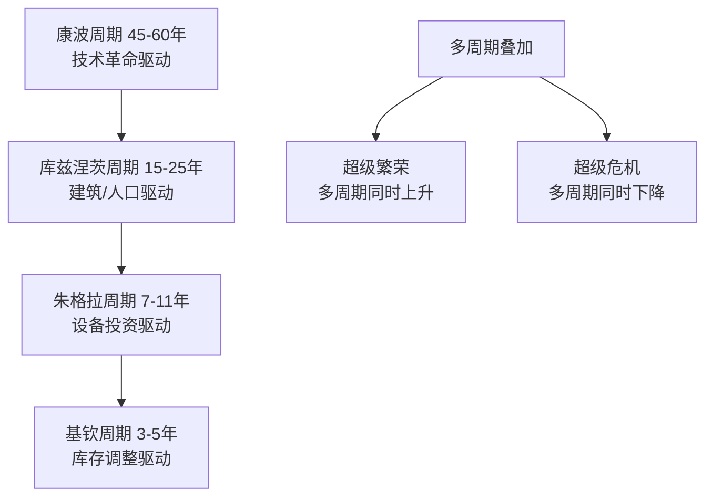

# 《逃不开的经济周期》深度读书笔记

> [!abstract] 全书速览
> 经济像一个会呼吸的生物——繁荣是吸气，衰退是呼气，这个节奏是停不下来的。拉斯·特维德用200多年的理论史和大量历史数据证明：经济周期不是外部冲击造成的意外，而是市场经济的内在特征。无论政府如何调控、央行如何干预，经济都会周期性地起伏。理解这一点，你就不会在繁荣的顶峰过度乐观，也不会在萧条的谷底过度悲观。

## 这本书要解决什么经济问题

拉斯·特维德是丹麦投资家和经济学作家。本书2006年出版，两年后2008年金融危机完美印证了核心论点。他要回答的问题是：==为什么经济总是在繁荣和衰退之间摇摆？==

> [!note] 独特贡献
> 特维德的价值不在于提出新理论，而在于把200多年来各种周期理论串联起来。他的核心主张：不存在单一的经济周期，而是多种不同长度的周期同时运行并相互叠加。

## 核心模型地图

> [!tip] 关键洞察
> ==当多个周期同时向上时，繁荣会特别猛烈；当多个周期同时向下时，衰退会特别深重。==1929年和2008年的危机都是多个周期同时见顶后的崩塌。

## 逐层深入

### 周期理论的演进

> [!example] 朱格拉的革命性洞见
> "危机不是经济的病态，而是经济的正常呼吸。"如果周期是"正常的"，试图彻底消除周期就像试图让人停止呼吸一样不切实际。

### 三大学派的贡献

**凯恩斯**：市场经济可能长期停留在低于充分就业的均衡状态，"动物精神"驱动预期自我强化。药方：政府财政刺激。

**弗里德曼**：=="通货膨胀永远是一个货币现象。"==大萧条如此严重，主要因为美联储错误收紧货币供应。药方：货币供应按规则增长。

**奥地利学派**：==繁荣是衰退的原因，而不是相反。==人为压低利率发出错误信号，导致建立在廉价信贷上的"空中楼阁"式投资，最终必然崩溃。参见 [[《看得见的与看不见的》 - 弗雷德里克·巴斯夏]]。

> [!tip] 综合判断
> 每个学派都抓住了周期的一个面向。真实的经济周期可能同时包含所有这些因素。

### 四种周期的机制

**基钦周期**（3-5年）：需求增加→企业增产过度→库存积压→减产消化→库存恢复→再增产。

**朱格拉周期**（7-11年）：投资的==加速器效应==——即使需求仍在增长，只要增速放缓，投资就可能开始下降。

**库兹涅茨周期**（15-25年）：房地产供给严重滞后于需求。2008年美国和2020年代中国都在经历这种长周期调整。

**康波周期**（45-60年）：技术革命的"四季"——春天（萌芽）→夏天（扩散）→秋天（成熟/投机）→冬天（清算）。

### 周期预测工具

> [!warning] 最可靠的预警信号
> ==收益率曲线倒挂==（短期利率高于长期利率）在过去几十年中几乎准确预测了每一次衰退。

**领先指标**：股市、货币供应、建筑许可证、消费者信心、收益率曲线

**同步指标**：GDP、工业生产、零售销售

**滞后指标**：失业率、通胀率、银行贷款余额

### 投资与周期

| 周期阶段 | 最佳资产 | 最差资产 |
|----------|----------|----------|
| 复苏初期 | 股票（周期性） | 债券 |
| 繁荣中期 | 股票、房地产 | 现金 |
| 繁荣后期 | 商品、现金 | 长期债券 |
| 衰退初期 | 现金、债券、黄金 | 股票 |
| 衰退后期 | 债券、防御性股票 | 商品 |

## 预测与现实

2008年危机完美验证了多周期叠加理论。但康波周期的时间预测不够准确——2010年代的十年牛市可能是量化宽松延长了"秋天"。收益率曲线倒挂在2019年出现，2020年衰退果然到来。

> [!note] 领先指标的真正价值
> 领先指标不能告诉你衰退的"原因"，但能告诉你经济系统的脆弱程度——脆弱的系统即使不被A触发，也会被B或C触发。

## 不同学派怎么说

**真实经济周期理论（RBC）**：经济波动由供给冲击驱动，政府干预反而降低效率。

**明斯基**：稳定本身酿造不稳定。参见 [[《反脆弱》 - 纳西姆·塔勒布]]。

**行为经济学**：过度自信、从众效应等认知偏差放大了周期波幅。参见 [[《黑天鹅》 - 纳西姆·塔勒布]]。

## 对你意味着什么

关注收益率曲线，根据周期位置调整资产配置。最重要的是训练逆向思维：==不要在繁荣顶峰加杠杆，不要在萧条底部恐慌抛售，保持足够的流动性。==

## 延伸阅读

- [[《投资最重要的事》 - 霍华德·马克斯]]：将周期思维应用于投资实践的最佳作品
- [[《周期》 - 霍华德·马克斯]]：专门讨论投资周期
- 《这次不一样》（莱因哈特和罗格夫）：800年金融危机数据证明历史总在重演
- 《非理性繁荣》（席勒）：行为金融学视角解释泡沫的心理机制
