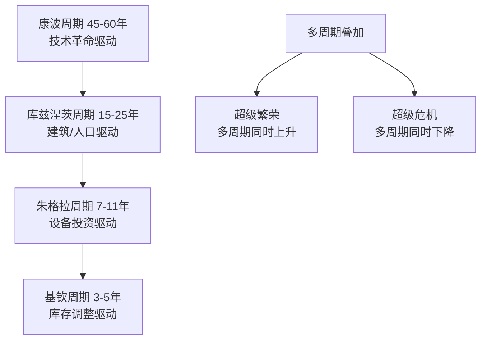

# 《逃不开的经济周期》深度读书笔记

> [!abstract] 全书速览
> 经济像一个会呼吸的生物——繁荣是吸气，衰退是呼气，这个节奏是停不下来的。拉斯·特维德用200多年的理论史和大量历史数据证明：经济周期不是外部冲击造成的意外，而是市场经济的内在特征。无论政府如何调控、央行如何干预，经济都会周期性地起伏。理解这一点，你就不会在繁荣的顶峰过度乐观，也不会在萧条的谷底过度悲观。

## 这本书要解决什么经济问题

拉斯·特维德是丹麦投资家和经济学作家，曾在多家国际投行工作，亲历过1987年黑色星期一、1990年代日本泡沫破裂、1997年亚洲金融危机和2000年互联网泡沫。本书2006年出版，两年后2008年金融危机完美印证了核心论点。他要回答的问题是：==为什么经济总是在繁荣和衰退之间摇摆？==

> [!note] 独特贡献
> 特维德的价值不在于提出新理论，而在于把200多年来各种周期理论串联起来。他的核心主张：不存在单一的经济周期，而是多种不同长度的周期同时运行并相互叠加。这个"多周期叠加"的视角，让你可以理解为什么有些衰退温和短暂而有些危机灾难性地剧烈——差别在于有几个周期同时向下。

在经济学谱系中，这本书属于"经济周期理论的通俗史"，它不是学术专著（不会用DSGE模型或VAR回归），而是一本面向投资者和经济爱好者的知识地图。它的竞争力在于把抽象的理论翻译成了可操作的投资框架。

## 核心模型地图

> [!tip] 关键洞察
> ==当多个周期同时向上时，繁荣会特别猛烈；当多个周期同时向下时，衰退会特别深重。==1929年和2008年的危机都是多个周期同时见顶后的崩塌。你可以把经济想象成海浪的叠加：小浪叠在中浪上，中浪叠在大浪上，当所有浪同时拍来就是海啸。

## 逐层深入

### 周期理论的演进

19世纪初人们把经济危机视为偶然"恐慌"——每次都找一个具体的"罪魁祸首"。但危机以惊人的规律性反复出现——1825、1837、1847、1857、1866、1873。

> [!example] 朱格拉的革命性洞见
> 法国医生兼统计学家朱格拉在1862年出版《法国、英国和美国的商业危机》，首次用数据证明危机大约每7-11年出现一次。=="危机不是经济的病态，而是经济的正常呼吸。"==如果周期是"正常的"，试图彻底消除周期就像试图让人停止呼吸一样不切实际。你能做的不是消灭周期，而是理解它、适应它、利用它。

古典经济学的"萨伊定律"（供给创造自己的需求）认为经济不应出现普遍过剩。但特维德指出漏洞——人们不一定会立即把收入全部花掉。储蓄、投资和消费之间的时间差，被信贷的放大机制加剧，就变成了周期。货币和信贷不是"中性的面纱"——它们是周期的发动机。

### 熊彼特的创造性破坏

> [!tip] 创造性破坏
> 熊彼特把周期理解为经济进步的节奏。新技术摧毁旧产业——蒸汽机摧毁手工作坊，铁路摧毁运河，互联网摧毁传统零售。==试图阻止创造性破坏就是试图阻止进步。==

熊彼特借鉴康德拉季耶夫的研究（康德拉季耶夫后来因为这一理论触怒斯大林而被处决），提出了45-60年的长波周期。每个长波由重大技术革命驱动：第一波蒸汽机和纺织（1787-1842），第二波铁路和钢铁（1842-1897），第三波电力汽车和化工（1897-1949），第四波电子和计算机（1949年后），第五波可能是互联网和生物技术。

### 三大学派的贡献

**凯恩斯**：市场经济可能长期停留在低于充分就业的均衡状态，"动物精神"驱动预期自我强化——悲观导致不投资，不投资验证悲观。药方：政府财政刺激。罗斯福新政是早期实践。

**弗里德曼**：1963年《美国货币史》证明大萧条的严重程度主要因为美联储错误收紧货币供应，货币供应减少约三分之一。=="通货膨胀永远是一个货币现象。"==药方：货币供应按规则增长。

**奥地利学派**：==繁荣是衰退的原因，而不是相反。==人为压低利率发出错误信号，导致建立在廉价信贷上的"空中楼阁"式投资，最终必然崩溃。衰退不是疾病而是治疗——经济在清除繁荣期积累的毒素。参见 [[《看得见的与看不见的》 - 弗雷德里克·巴斯夏]]。

> [!tip] 综合判断
> 每个学派都抓住了周期的一个面向。凯恩斯抓住了信心的自我强化效应，弗里德曼抓住了货币政策失误的破坏力，奥地利学派抓住了信贷扭曲的深层机制。真实的经济周期可能同时包含所有这些因素——就像一个人生病可能同时涉及细菌感染、免疫力下降和长期不良生活习惯。

### 四种周期的机制

**基钦周期**（3-5年）：需求增加→企业增产过度→库存积压→减产消化→库存恢复→再增产。核心是信息延迟和过度反应。丰田JIT系统和沃尔玛实时库存追踪缩短了周期但未消除——2021年全球供应链危机的"牛鞭效应"就是基钦逻辑在全球尺度的放大版。

**朱格拉周期**（7-11年）：投资的==加速器效应==——即使需求仍在增长，只要增速放缓，投资就可能开始下降。例：10台机器年损耗1台。需求增10%需买2台，增速降到5%只需1.5台——需求还在涨，投资已跌25%。

**库兹涅茨周期**（15-25年）：房地产供给严重滞后于需求，从拿地到交付可能5-8年。人口结构是深层驱动力——25-45岁购房主力人口的增减直接影响长期趋势。日本1990年代、2008年美国和2020年代中国都在经历这种长周期调整。

**康波周期**（45-60年）：技术革命的"四季"——春天（萌芽）→夏天（扩散、高增长、通胀）→秋天（边际贡献递减但金融投机疯狂）→冬天（泡沫破裂、债务清算）。1990年代末互联网泡沫可能是第五波"夏天"转"秋天"的标志。

### 周期预测工具

> [!warning] 最可靠的预警信号
> ==收益率曲线倒挂==（短期利率高于长期利率）在过去几十年中几乎准确预测了每一次美国衰退，包括2000年、2006年、2019年。纽约联储开发了基于此的衰退概率模型，历史回测准确率极高。

**领先指标**：股市（领先实体经济6-9个月）、货币供应（M2增速）、建筑许可证、消费者信心、收益率曲线

**同步指标**：GDP、工业生产、零售销售

**滞后指标**：失业率（确认复苏后才招聘）、通胀率、银行贷款余额

> [!note] 领先指标的真正价值
> 领先指标不能告诉你衰退的"原因"，但能告诉你经济系统的脆弱程度——脆弱的系统即使不被A触发，也会被B或C触发。就像一棵已经枯萎的树，你不知道是哪阵风会把它吹倒，但你知道它早晚会倒。

### 投资与周期

| 周期阶段 | 最佳资产 | 最差资产 |
|----------|----------|----------|
| 复苏初期 | 股票（周期性） | 债券 |
| 繁荣中期 | 股票、房地产 | 现金 |
| 繁荣后期 | 商品、现金 | 长期债券 |
| 衰退初期 | 现金、债券、黄金 | 股票 |
| 衰退后期 | 债券、防御性股票 | 商品 |

==不要在繁荣的顶峰加杠杆，不要在萧条的底部恐慌抛售，保持足够的流动性。==

## 预测与现实

2008年危机完美验证了多周期叠加理论：库存周期下行、投资周期见顶、房地产周期崩塌。同样的逻辑也解释了2001年互联网泡沫远不如2008年严重——当时房地产周期仍在上升，部分对冲了冲击。

但康波周期的时间预测不够准确——2010年代的十年牛市可能是量化宽松延长了"秋天"、推迟了"冬天"。收益率曲线倒挂在2019年出现，2020年衰退果然到来——虽然触发因素是疫情而非内生因素。

## 不同学派怎么说

**真实经济周期理论（RBC）**：经济波动由供给冲击驱动，周期是经济体的最优调整，政府干预反而降低效率。基德兰德和普雷斯科特因此获2004年诺贝尔奖。

**明斯基**：稳定本身酿造不稳定——从"对冲融资"到"投机融资"到"庞氏融资"的滑坡。2008年被广泛认为是"明斯基时刻"。参见 [[《反脆弱》 - 纳西姆·塔勒布]]。

**MMT**：拥有货币主权的政府可以通过财政政策平滑周期。但2020-2022年大规模刺激后通胀飙升让这个主张面临现实检验。

**行为经济学**：过度自信、从众效应等认知偏差放大了周期波幅。周期不仅是经济的呼吸，也是人类集体心理的潮汐。参见 [[《黑天鹅》 - 纳西姆·塔勒布]]。

## 对你意味着什么

关注收益率曲线，根据周期位置调整资产配置。最重要的是训练逆向思维：当所有人疯狂乐观时提醒自己"这一切都会过去"，当所有人绝望时提醒自己"黎明就在前方"。周期思维的终极价值不在于让你赚更多钱，而在于让你在经济的潮起潮落中保持清醒和从容。

## 延伸阅读

- [[《投资最重要的事》 - 霍华德·马克斯]]：将周期思维应用于投资实践的最佳作品
- [[《周期》 - 霍华德·马克斯]]：专门讨论投资周期
- 《这次不一样》（莱因哈特和罗格夫）：800年金融危机数据证明历史总在重演
- 《非理性繁荣》（席勒）：行为金融学视角解释泡沫的心理机制
