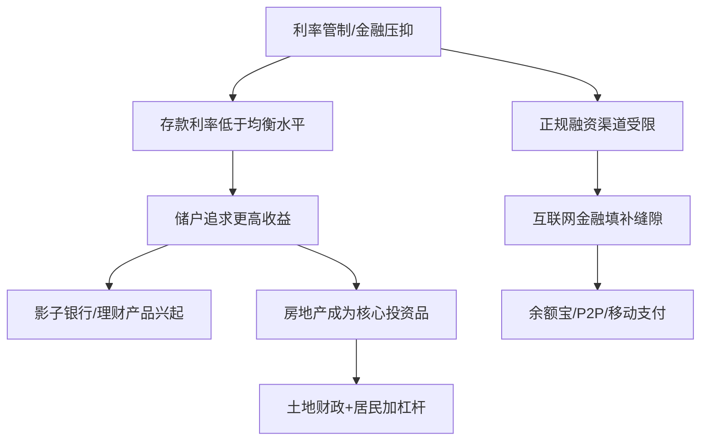

# 《金钱永不眠》深度读书笔记

> [!abstract] 全书速览
> 香帅（唐涯）是北大光华管理学院金融学教授，这本2017年出版的书是她面向大众的金融通识作品。全书以专栏文章合集的形式，用通俗语言拆解了中国金融市场的核心现象：==银行主导的金融体系为什么长成了今天的样子==，影子银行和理财产品背后是怎样的利率管制逻辑，房地产为什么成了中国最大的"金融产品"，互联网金融从余额宝到P2P经历了怎样的创新与崩塌，A股"牛短熊长"的制度根源是什么，以及普通人在这套复杂体系中如何理解利率、汇率和自己的钱包。这不是一本学术专著，而是一本金融世界的"翻译手册"——把学院里的金融学概念翻译成你能听懂的故事和逻辑。

> [!warning] 掌握度声明
> 本笔记基于对《金钱永不眠》核心论点、主要内容板块和公开评论的中等程度了解撰写。由于本书是专栏文章合集，各篇之间独立性较强，部分具体案例和数据细节可能存在偏差。书中部分观点具有较强的时效性（基于2017年前后的中国金融环境），笔记中会尽量标注时间语境。

---

## 这本书要解决什么经济问题

中国金融市场对普通人来说一直是一个巨大的黑箱。你每天都在和金融打交道——存钱、买房、买理财、刷手机支付——但你对这些行为背后的制度逻辑几乎一无所知。==为什么银行存款利率那么低？为什么房价总在涨？为什么余额宝横空出世又逐渐褪色？为什么你在股市里总亏钱？==

香帅要做的事情是：把这个黑箱打开，用你能理解的语言告诉你里面的零件是怎么运转的。

这本书的独特价值在于作者的双重身份——她既是北大金融学教授，拥有扎实的学术训练，又是一个善于用故事和类比说话的写作者。她不是在给你上金融学课，而是在帮你建立一个理解中国金融现象的基本框架。

在中国金融学写作的谱系中，这本书介于学术专著和财经畅销书之间。它比陈志武的《金融的逻辑》更贴近中国市场的具体现象，比吴晓波的财经叙事更有理论纵深，比各类"理财指南"更关注制度层面的"为什么"而不仅仅是"怎么做"。==它的核心贡献是为普通读者提供了一张中国金融世界的导航地图。==

---

## 核心模型地图

> [!note] 理解全书框架
> 香帅对中国金融的分析可以提炼为一个核心判断：**中国金融体系的很多特殊现象，都可以追溯到一个根源——金融压抑。**

这个判断展开后有几个关键组件：

**第一层：利率管制与金融压抑**。长期以来，中国的存款利率被人为压低。这意味着储户把钱存进银行，实际上是在补贴借款人（主要是国有企业和地方政府）。利率管制造成了一个巨大的缺口——储户想要更高收益，而正规渠道无法满足。

**第二层：影子银行的必然崛起**。利率管制压低了正规渠道的收益，但需求不会消失。银行理财产品、信托、各类资管计划应运而生——它们本质上是绕过利率管制，让资金以更接近市场均衡的价格流动。这就是"影子银行"。它不是什么阴谋，而是金融压抑下资金寻找出路的必然结果。

**第三层：房地产的金融化**。在投资渠道有限、利率被压低的环境下，房地产成了居民抵御通胀、实现财富增值的核心工具。再加上土地财政制度下地方政府对卖地收入的依赖，房地产从一个居住消费品变成了中国最大的"金融产品"。

**第四层：互联网金融的冲击**。余额宝让普通人第一次享受到货币基金的收益，移动支付重塑了金融的底层基础设施。互联网金融在短短几年内撕开了传统金融体系的裂缝，但也在监管套利中积累了风险（P2P爆雷就是典型案例）。

---

## 逐层深入

### 一、金融不是"钱生钱的游戏"

> [!tip] 核心洞察
> 金融的本质不是投机，而是==跨时间、跨空间配置资源的工具==。

很多人对金融的第一印象是"钱生钱"——炒股、炒房、买理财。香帅要纠正的正是这个认知偏差。金融做的事情，归根结底是三件：跨时间配置资源（你今天借钱买房，用未来三十年的收入偿还，这就是把未来的钱搬到了今天）；跨空间配置资源（深圳有资金但缺项目，贵州有项目但缺资金，金融体系把钱从深圳搬到贵州）；管理风险（保险让你把个人的巨大损失分摊到一个更大的群体中）。

金融创新的本质也是围绕这三件事展开的。每一种新的金融工具——从最古老的借贷到最新的衍生品——都是在试图更有效地完成时间配置、空间配置或风险管理中的某一项。那些看起来眼花缭乱的金融产品，拆开来看都是这三个基本功能的排列组合。

> [!example] 类比理解
> 金融就像一个社会的"血液循环系统"。血液（资金）需要从心脏（央行和银行体系）泵出，流经大动脉（金融市场）、小动脉（各类金融机构）、毛细血管（小微金融），最终到达每一个需要养分的细胞（企业和个人）。当这个循环系统健康运转时，整个经济体就充满活力；当某些管道堵塞或某个环节出了问题，就会出现"局部缺血"（中小企业融资难）或"血栓"（金融风险积聚）。

### 二、中国金融体系：银行主导的特殊结构

中国的金融体系和美国有一个根本性的差异：美国是"市场主导型"——企业融资主要靠发行股票和债券，资本市场是核心；中国是"银行主导型"——企业融资主要靠银行贷款，银行体系是核心。

这个结构不是偶然形成的。新中国成立后实行计划经济，资金分配由国家统一安排，银行本质上是财政的出纳。改革开放后，银行体系虽然逐步商业化，但始终保持着对信贷资源的主导权。股票市场1990年代才建立，债券市场发展更晚，整个直接融资体系远不如美国成熟。

银行主导意味着几个重要后果：

==信贷资源的分配不完全由市场决定==。国有企业和地方政府因为有政府背书，更容易获得银行贷款；民营企业和中小企业则长期面临"融资难、融资贵"的困境。这不是银行"嫌贫爱富"，而是在信息不对称的环境下，银行更偏好有政府隐性担保的借款人——风险更可控，坏账更好处理。

利率管制的影响被放大了。在一个银行主导的体系中，存贷利率是整个金融系统的核心价格。当这个价格被人为管制时，扭曲的影响远比在市场主导型体系中更大。

> [!warning] 边界条件
> 银行主导不等于"落后"。德国和日本的金融体系同样以银行为主导，但运转良好。关键不在于银行主导还是市场主导，而在于银行体系本身的效率和竞争程度。

### 三、影子银行：被"逼"出来的金融创新

如果你2015年前后去银行办事，客户经理大概率会向你推销一种叫"理财产品"的东西——收益率比存款高不少，风险"基本可控"。你可能不知道的是，这类产品正是中国影子银行体系的重要组成部分。

影子银行的逻辑其实不复杂。央行把存款利率压得很低（比如一年期存款利率长期在2%-3%），但真实的资金供需关系决定了均衡利率应该更高。这个差价就是一块巨大的利润空间。银行通过理财产品把存款从"表内"挪到"表外"，绕过利率管制和存贷比限制，以更高的利率吸收资金，再以更高的利率投放出去。

> [!tip] 理解影子银行的关键
> 影子银行不是一个"坏东西"，它是==利率管制下资金寻找真实价格的自然反应==。它的存在恰恰说明，被管制的利率偏离了市场均衡太远。

但影子银行也带来了真实的风险：

- 资金链条被拉长了。一笔钱从储户到最终借款人之间可能经过了银行理财、信托、券商资管、基金子公司等多个环节，每个环节加一层杠杆、收一道费用，风险也在层层累积。
- "刚性兑付"的潜规则。理财产品虽然名义上不保本，但长期以来银行都在隐性兜底。这让投资者丧失了风险意识——反正亏了银行会赔——也让风险定价完全失灵。
- 监管盲区。影子银行的很多操作恰好落在不同监管部门的管辖范围之间，形成了"监管套利"的空间。

### 四、房地产：中国最大的"金融产品"

> [!note] 一个关键认知
> 在中国，房子不仅仅是用来住的，它同时是==居民最大的金融资产、银行最重要的抵押品、地方政府最核心的收入来源==。

香帅对中国房地产的分析有几个层次。

从需求端看，中国居民的投资渠道极其有限。股市波动大、理财产品刚性兑付打破后风险升高、实业投资门槛高——对大多数家庭来说，买房几乎是唯一可靠的财富保值手段。在利率被压低、通胀预期存在的环境下，持有现金等于财富缩水，买房成了一种近乎"理性"的选择。

从供给端看，土地供给被地方政府垄断。地方政府既是土地的唯一供应者，又高度依赖土地出让金来维持财政运转。这就造成了一个矛盾：政府一方面要调控房价，另一方面又依赖高地价来保财政收入。

从金融体系的角度看，房地产与银行体系深度绑定。银行资产中大量是房地产相关贷款（个人住房按揭、房地产开发贷、以房地产为抵押的企业贷款）。房价下跌不仅影响居民财富，还会直接冲击银行资产质量，进而影响整个金融体系的稳定。

> [!example] 房地产的三重角色
> 想象一个人同时是运动员、裁判和赛事组织者——你就理解了房地产在中国经济中的特殊地位。它既是经济增长的引擎（建筑业、家电、装修等产业链），又是金融体系的"压舱石"（抵押品价值），还是地方财政的"提款机"（土地出让金）。这种三位一体的结构让房地产调控变得异常困难——你动哪一块，都会牵扯其他两块。

### 五、互联网金融：从颠覆到规范

2013年6月，天弘基金和支付宝合作推出了余额宝。这个产品让中国数亿普通用户第一次接触到货币基金——你把钱放进去，每天能看到收益，随时可以取出来消费。

余额宝的颠覆性不在于它是一个多复杂的金融产品——货币基金在美国已经存在了四十多年——而在于它打破了一道看不见的墙：==普通人和金融市场之间的准入门槛==。在余额宝之前，你想买货币基金，需要去银行柜台、需要起购金额、需要等待赎回。余额宝把这些门槛全部抹平，一块钱就能买，随时能用。

移动支付的影响更为深远。从支付宝到微信支付，中国在短短几年内几乎跳过了信用卡时代，直接进入了移动支付时代。这重塑了整个金融体系的底层基础设施——支付数据成了信用评估的基础，小微商户获得了接入金融体系的通道，金融服务的触达范围急剧扩大。

但互联网金融的另一面则是P2P网贷的惨痛教训。P2P的初衷是"个人对个人的借贷平台"，用技术手段降低信息不对称，连接有闲钱的人和需要钱的人。但在实际运作中，大量P2P平台变成了非法集资的工具——没有真正的风控能力，靠高息吸引投资者，拆东墙补西墙，最终大面积爆雷。

> [!warning] P2P的教训
> P2P的兴衰告诉你一个重要规则：==金融的核心是风险定价和风险管理==。技术可以降低信息成本、提高触达效率，但技术本身不能替代风险管理。当一个平台承诺高收益又声称低风险时，你应该自动警惕——高收益和低风险不可能同时存在，如果看起来同时存在了，那一定是有人在隐瞒风险。

### 六、A股：为什么"牛短熊长"

中国A股市场有一个让所有参与者痛苦的特征：==牛短熊长==。美股过去几十年的走势是"长牛慢升"，而A股则反复上演暴涨暴跌的剧本。香帅对此的分析从制度层面入手。

第一，A股长期是一个"政策市"。市场的涨跌与政策信号的关系远大于与企业基本面的关系。IPO暂停、印花税调整、"国家队"入场救市——这些政策行为对市场的短期影响巨大。当投资者的主要策略是"猜政策方向"而不是"分析公司价值"时，市场必然充满投机。

第二，上市公司质量问题。在审批制下，IPO是一种稀缺资源，上市本身就是一种"特权"。这导致两个后果：一些质量不高的企业通过各种手段获得上市资格，而真正优秀的企业（特别是互联网企业）反而去了境外上市。留在A股的上市公司整体质量不够优，投资者赚钱的概率也就更低。

第三，散户主导的市场结构。中国A股的交易量中散户占比远高于成熟市场。散户的特点是信息劣势大、交易频率高、追涨杀跌倾向强。当一个市场的主要参与者都在做短线投机时，价格波动必然被放大。

香帅指出，注册制改革的意义正在于此——让上市从"审批特权"变成"市场选择"，提高上市公司整体质量，逐步改变A股的制度基因。

### 七、普通人的金融决策

香帅在书中对普通人的金融决策提供了几个有价值的思考框架。

关于买房，她的分析不是简单的"买"或"不买"，而是帮你理解影响房价的核心变量：货币政策（利率低、流动性充裕时房价容易涨）、人口流动（人口净流入的城市住房需求更强）、土地供给（政府卖地的节奏直接影响供给）、政策调控（限购限贷等措施的短期影响和长期效果）。

关于股市投资，她强调的核心观点是：==你在股市里亏钱，大概率不是因为运气不好，而是因为你不理解这个市场的结构性特征==。散户在信息、资金、时间上的全面劣势决定了，在一个制度尚不完善的市场中频繁交易，大概率是在给机构投资者和交易费用"交学费"。

关于利率和汇率，她的提醒是：这两个数字看起来离你很远，但实际上深刻影响着你的生活成本。利率变动影响你的房贷月供、理财收益和物价水平；汇率变动影响你的海淘价格、出国旅行成本，以及你持有的以人民币计价的资产的国际购买力。

---

## 预测与现实

《金钱永不眠》出版于2017年，距今已近十年。从此后的发展来看：

**被验证的判断：**

- 书中对影子银行风险的警示在随后几年充分兑现。2018年"资管新规"出台，打破刚性兑付，影子银行规模大幅收缩。这正是香帅分析中"刚性兑付不可持续"的逻辑结论。
- P2P网贷的全面爆雷和清退（2018-2020年完成），验证了书中对P2P监管套利风险的判断。
- 房地产市场在2021年后经历的深度调整，印证了书中关于"房地产过度金融化"和"土地财政不可持续"的隐忧。
- 移动支付继续深化，数字人民币进入试点阶段，互联网金融对传统金融的改造持续推进。

**需要更新的部分：**

- 书中对互联网金融的讨论带有2015-2017年的乐观色彩，对后来的强监管转向（蚂蚁集团上市叫停、平台经济整顿）未能预见。
- 关于A股注册制改革的讨论相对初步。2019年科创板开板、2023年全面注册制落地后，A股制度环境发生了显著变化。
- 全球金融环境在2020年疫情后发生了深刻变化——全球大放水、随后的激进加息、中美金融脱钩风险——这些是2017年的视角难以覆盖的。

---

## 不同学派怎么说

围绕中国金融市场的改革方向，学界存在不同的声音：

**金融自由化派**认为，中国金融体系的核心问题是管制太多。利率管制、资本账户管制、汇率管制——这些管制扭曲了资源配置，催生了影子银行和各种扭曲现象。解决方案是加速市场化改革，让价格机制真正发挥作用。他们可能觉得香帅对金融管制的批评还不够彻底。

**审慎监管派**则强调，中国作为发展中国家，金融自由化的风险不可忽视。1990年代亚洲金融危机的教训表明，在制度基础不完善的情况下贸然放开金融管制，可能招致灾难性后果。他们会认为影子银行的壮大本身就是监管缺失的表现，需要的不是更多自由化而是更有效的监管。

> [!note] 香帅的立场
> 香帅的分析总体上偏向==理解而非简单评判==。她既不是金融自由化的激进倡导者，也不是强监管的坚定支持者。她更倾向于让你看清每一种制度安排的利弊和内在逻辑，让你自己做判断。不过，作为金融学教授，她对金融创新和市场化改革持有一定的乐观倾向——这种倾向在2017年的语境下可以理解，但在2020年代的回看中需要一些调整。

---

## 对你意味着什么

读完这本书，你至少会在三个方面建立起新的认知框架：

**理解中国金融现象的底层逻辑**。当你再看到"银行理财收益下降""房贷利率调整""股市政策利好"这类新闻时，你不会只看到表面现象，而是能追溯到背后的利率环境、监管政策和制度约束。这种"透过现象看结构"的能力，比任何一条具体的投资建议都更有价值。

**对金融产品建立基本的辨别能力**。在一个金融产品层出不穷的时代，最重要的能力不是知道"该买什么"，而是知道"什么不该碰"。香帅的分析让你理解一个基本原则：==高收益必然对应高风险，如果一个产品声称兼具高收益和低风险，要么它在说谎，要么你没看到风险藏在哪里。==

**对宏观经济建立"体感"**。利率、汇率、通胀、货币政策——这些概念不再只是新闻联播里的抽象名词，而是会实实在在影响你的房贷月供、工资购买力和储蓄价值的具体力量。

---

## 延伸阅读

- [[《置身事内》]] —— 兰小欢从地方政府和财政体系的角度切入中国经济，与香帅的金融视角形成互补。如果说香帅告诉你"钱是怎么流动的"，兰小欢告诉你"政府为什么这么花钱"。两本一起读，你对中国经济的理解会更立体。

- [[《薛兆丰经济学讲义》]] —— 如果你想从更基础的经济学原理出发理解金融现象，薛兆丰对价格、产权和制度的分析提供了很好的理论底座。

- [[《激荡三十年》]] —— 吴晓波的这部经济改革编年史，为你提供了中国金融体系形成的历史背景。理解金融体系为什么"长成今天这个样子"，需要先了解它是在怎样的改革进程中一步步演化出来的。
