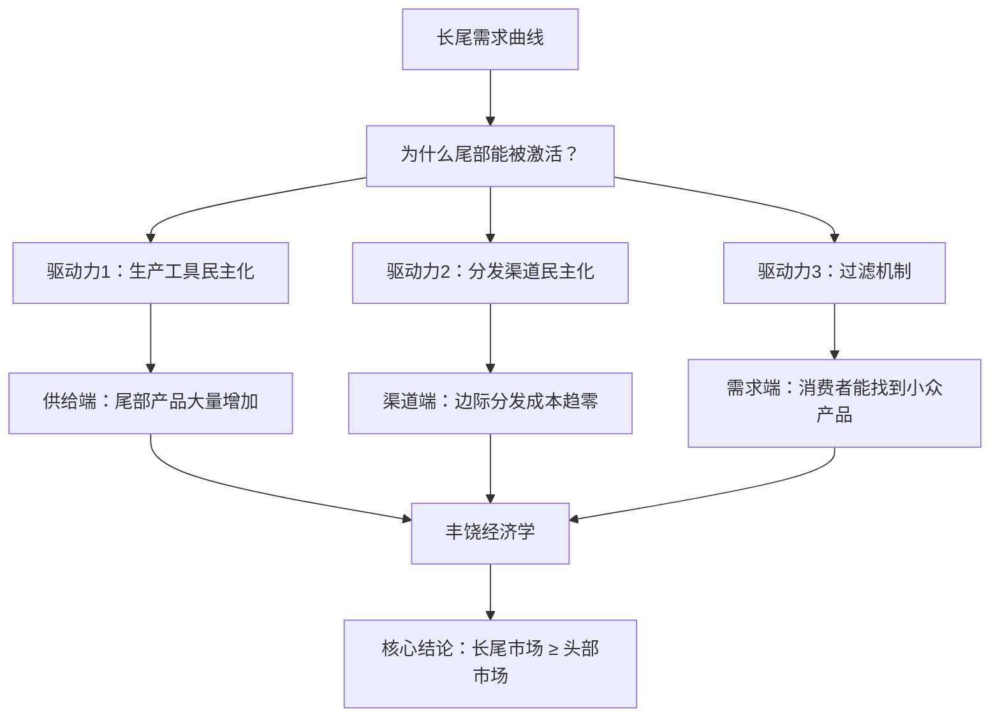

# 《长尾理论》深度读书笔记

> [!abstract] 全书速览
> 克里斯·安德森在2006年提出了一个颠覆传统商业认知的洞察——在数字经济时代，真正的市场不在头部的热门商品上，而在那条看似无穷延伸的长尾上。过去，货架空间有限，零售商只能摆放最畅销的商品，帕累托法则（80/20法则）主宰一切。但互联网把"货架"变成了近乎无限的数字空间，存储和分发的边际成本趋近于零，那些曾经因为"不够畅销"而被排除在市场之外的小众产品，突然拥有了找到自己买家的可能。安德森的核心论断是：==把所有这些"不畅销"的产品加在一起，它们构成的市场规模可以匹敌甚至超越那些超级热门商品==。这不仅是一个商业模型的更新，更是对"什么是市场"这个问题的重新定义。

---

## 这本书要解决什么经济问题

长期以来，商业世界被一个简洁的法则主宰：少数热门产品创造绝大部分利润。无论是好莱坞电影、流行音乐还是书店货架，"赢家通吃"似乎是不可撼动的铁律。帕累托法则告诉你，20%的产品贡献80%的收入，所以你应该把资源集中在这20%上。

但到了2004年前后，安德森观察到一个令人困惑的现象。Rhapsody（一个在线音乐服务平台）的数据显示，它的音乐库中排名前10000之后的歌曲——那些你可能从未听过名字的歌曲——每个月依然有人在播放。不仅如此，这些"无人问津"的歌曲加在一起，其播放量竟然构成了总播放量中一个可观的比例。亚马逊的数据也呈现类似的模式：那些排名在十万之后的图书，销售额加总起来占到了亚马逊总收入的相当一部分。

> [!tip] 核心洞察
> ==安德森的核心问题：如果"不畅销"的商品总数足够庞大，它们的集合市场是否能与"畅销品"抗衡？如果可以，那整个商业逻辑是否需要重写？==

安德森时任《连线》杂志主编，他在2004年发表了同名文章，2006年扩展为这本书。他的核心主张是：互联网和数字技术正在将需求曲线的"尾巴"无限延长，而这条长尾不是利润的边角料，而是一个被系统性忽视的巨大市场。在经济学谱系中，安德森的工作本质上是对传统供给约束理论的一次挑战——当供给侧的瓶颈（货架空间、分发成本、信息匹配成本）被技术打破后，需求的真实形态才第一次显露出来。

---

## 核心模型地图

全书的理论架构可以提炼为三个相互嵌套的模型。

> [!note] 模型一：长尾需求曲线
> 这是全书的起点和地基。想象一条传统的商品销量排名曲线——横轴是按销量从高到低排列的产品，纵轴是各产品的销量。在实体零售时代，这条曲线的头部陡峭（少数爆款卖出天量），然后急剧下降，尾部很快被截断——因为实体货架放不下那么多商品。安德森指出，在数字经济中，这条曲线的尾部不再被截断，而是无限延伸，虽然每个单品的销量很低，但产品总数极其庞大。这个模型假设的前提是：==人类的兴趣和需求天然是高度多样化的，过去的"集中"是供给瓶颈造成的假象，而非需求的真实形态==。

**模型二：三大驱动力。** 长尾不会自动出现，它需要三股力量来"解锁"。第一股力量是==生产工具的民主化==——数字技术让任何人都能以极低成本创作内容（博客、播客、独立音乐、自出版图书），极大扩充了"尾部"的产品供给量。第二股力量是==分发渠道的民主化==——互联网让这些小众产品能以近乎零成本触达全球消费者，不再依赖有限的实体货架。第三股力量是==连接供需的过滤机制==——搜索引擎、推荐算法、用户评论帮助消费者在海量选择中找到符合自己偏好的小众产品。没有过滤机制，长尾只是一堆噪音；有了过滤机制，长尾才变成可被发掘的金矿。三股力量缺一不可。

**模型三：丰饶经济学 vs. 匮乏经济学。** 安德森将传统经济学称为"匮乏经济学"——货架有限、注意力有限、分发渠道有限，所以必须做选择，必须聚焦头部。长尾理论的底层逻辑则是"丰饶经济学"——当存储和分发成本趋近于零时，"选择"本身不再是稀缺资源，你不需要在"摆这个还是摆那个"之间做取舍，你可以全都摆上。这个模型推导出一个关键结论：==在丰饶经济中，"拥有一切"比"挑选最好的"更有商业价值==。

三个模型的关系是递进的：长尾曲线是现象描述，三大驱动力是机制解释，丰饶经济学是底层范式。

---

## 逐层深入

### 一、帕累托法则的失效边界

安德森的论证从挑战帕累托法则开始。80/20法则是商业世界中最广为人知的经验规律之一——20%的客户贡献80%的收入，20%的产品占据80%的销售额。这条法则如此深入人心，以至于几乎成了"自然法则"。

但安德森指出，帕累托法则有一个常被忽视的前提条件：它成立的环境是一个**供给受限**的环境。当货架空间有限（比如一家实体书店只能放10万本书），零售商必须优化这有限的空间，自然会把位置留给最畅销的商品。在这种约束下，少数热门产品确实主导了收入。

但如果你把货架空间变成无限的呢？

> [!example] 亚马逊的启示
> 亚马逊在当时拥有超过230万本图书（而一家大型实体书店通常只有10万本左右）。安德森引用了一个引人注目的数据：==亚马逊总收入中，有大约四分之一来自其排名10万之后的图书==——也就是说，这些在任何实体书店都找不到的书，贡献了亚马逊四分之一的营收。

这个数据揭示了帕累托法则的一个结构性盲点：它描述的不是需求的自然形态，而是供给约束下需求的扭曲形态。当约束被解除，真实需求浮出水面——它远比我们以为的更加分散、更加多样、更加"长尾"。

### 二、无限货架的经济学

为什么实体零售时代长尾被截断？答案是成本。

一家实体书店每一平方英尺的货架空间都有租金成本。如果一本书每年只能卖出两三本，那它"占据"的货架成本可能超过了它带来的利润。理性的零售商会用一个简单的门槛来筛选：只有预期销量超过某个最低线的商品，才值得上架。这条最低线，就是长尾被截断的那个点。

安德森用沃尔玛做例子。沃尔玛是全球最大的音乐零售商之一，但它的CD货架只能容纳大约4500张专辑。这意味着在任何一个时间点，一张CD必须足够畅销，才能在沃尔玛获得一个位置。而Rhapsody这样的在线音乐服务拥有超过150万首曲目——这些曲目存储在服务器上，边际成本几乎可以忽略。

> [!tip] 关键经济学原理
> ==当存储和分发的边际成本趋近于零时，"值不值得上架"这个问题本身就消失了。== 你不再需要做选择——你可以全都上架。这就是安德森所说的"丰饶经济"的基础。

Netflix也是这个逻辑的典型案例。在它早期的DVD邮寄业务中，安德森观察到，Netflix目录中排名前几千的DVD之外的所有DVD，加在一起占了总租赁量的约20%。这些是你在任何一家Blockbuster视频店都找不到的电影——纪录片、外国文艺片、独立电影、老片子。它们单独拿出来都不够"畅销"，但它们的总量构成了一个不可忽视的市场。

### 三、生产工具的民主化——长尾的供给侧

长尾不仅是需求侧的故事，更是供给侧的革命。

安德森把长尾供给侧的扩张追溯到数字生产工具的普及。在音乐领域，过去录制一张专辑需要昂贵的录音棚、专业的音频工程师，成本动辄数万美元。到了2000年代，一台个人电脑加上GarageBand或Pro Tools软件，就能以几百美元的成本完成一张品质尚可的专辑。安德森引用了当时的数据：每年约有超过600万首新歌曲被创作出来，但主流唱片公司每年只发行大约3万张专辑。那些被唱片公司"淘汰"的音乐并非毫无价值——它们只是不符合大众市场的门槛而已。

图书出版也是类似的故事。传统出版社每年收到的书稿远超其出版能力，大量有质量的作品被"过滤"掉。自出版平台（如当时的Lulu.com，后来的亚马逊KDP）让这些作品可以以极低成本进入市场。

视频领域更加戏剧化。YouTube在2005年成立时，每天的视频上传量就以指数速度增长。每一个拥有摄像头的人都成了潜在的内容生产者。这不是说每个YouTube视频都有商业价值——而是说"谁有资格创作内容"这道门槛被彻底打平了。

安德森将此概括为长尾的第一股驱动力：==生产工具的民主化极大地增加了"尾部"的产品数量==。曲线的尾巴之所以能延伸得更长，是因为有更多的产品被创造出来并进入了市场。

这里有一个微妙但重要的判断：安德森并不认为这些长尾产品的平均质量与头部产品相当。他承认，大量业余创作的内容质量参差不齐。但他的论点是，质量问题可以交给过滤机制去解决——好的内容会通过评论、推荐和口碑浮出来，差的内容会自然沉底。生产民主化的意义不在于"人人都能创作出好作品"，而在于"好作品不会因为创作者没有被唱片公司或出版社看中而永远消失"。

### 四、分发渠道的革命——让长尾触达消费者

有了更多的产品还不够。如果消费者接触不到这些产品，长尾依然只是一个理论概念。

安德森把长尾的第二股驱动力定义为==分发渠道的民主化==。互联网本质上是一个零边际成本的分发网络。一首歌放在iTunes上，不管它被下载1次还是100万次，苹果所承担的额外分发成本几乎相同。一本电子书放在亚马逊上，无论它排名第1还是第200万，亚马逊服务器承担的存储成本几乎可以忽略。

安德森对比了两种分发模式。在实体分发中，每一件商品从工厂到消费者手中都有物流成本、仓储成本、零售空间成本。这些成本构成了一道"门槛"——只有预期销量足够高的商品，才值得被分发。在数字分发中，这道门槛近乎消失。eBay让任何一件长尾商品（二手货、收藏品、小众配件）都可以找到买家，即使这个买家在地球的另一端。

> [!note] 纯数字商品 vs. 物理商品
> 这里有一个重要的区分：纯数字商品（音乐、电影、电子书、软件）和物理商品（书籍、服装、硬件）。纯数字商品的长尾效应最强，因为它们的存储和分发边际成本真的趋近于零。物理商品则仍然面临仓储和物流成本，但即便如此，像亚马逊这样的集中化仓库模式，也比分散的实体零售大幅降低了成本，从而允许更长的尾部存在。

安德森还讨论了"聚合器"的角色。像亚马逊、iTunes、Netflix这样的平台，本质上是长尾商品的聚合器。它们的商业模式不是"找到下一个爆款"，而是"让所有商品都能被找到"。它们的竞争优势不在于拥有最热门的商品（这些商品哪儿都能买到），而在于拥有最完整的目录——因为正是长尾部分贡献了差异化价值和额外利润。

### 五、过滤机制——从噪音到信号

如果说前两股力量增加了"长尾"的供给和可达性，第三股力量则解决了一个至关重要的问题：==在海量选择面前，消费者如何找到自己想要的东西？==

安德森将这第三股力量称为"过滤器"——帮助消费者在长尾中导航的各种工具和机制。没有有效的过滤器，丰富的选择就会变成"选择过载"的灾难，消费者会因为无所适从而退回到热门商品的安全地带。

安德森列举了几类关键的过滤机制。

第一类是**搜索引擎**。Google让你可以精确找到自己想要的东西，即使它非常小众。在搜索引擎出现之前，你不知道自己不知道什么。搜索引擎不仅满足了已有需求，还唤醒了沉睡的需求——你第一次发现原来有人写了一本关于你小众爱好的书。

第二类是**推荐算法**。亚马逊的"购买此商品的人也购买了……"是长尾经济的关键润滑剂。推荐算法做了一件实体零售店店员永远做不到的事情：基于数百万用户的行为数据，将每一个消费者与可能感兴趣但他从未听过的商品连接起来。它系统性地将需求从头部推向尾部。

第三类是**用户评论和口碑系统**。亚马逊的用户评论、豆瓣的评分、博客的推荐文章，这些"群体智慧"在长尾中扮演了质量认证的角色。当一本没有任何主流媒体报道的小众图书拥有30个五星评论时，潜在读者获得了一种信任基础——这是实体书店中完全不存在的信息。

> [!warning] 过滤机制的关键性
> 安德森强调，==过滤机制的有效性直接决定了长尾的商业可行性==。如果过滤器失败——比如推荐算法不够精准，搜索结果被垃圾信息淹没——消费者就会回到"选热门的总没错"的保守策略，长尾市场就无法被激活。从这个意义上说，长尾经济不仅仅是一个关于"更多选择"的故事，更是一个关于"更好的选择导航"的故事。

### 六、长尾经济的微观机制——98法则

安德森提出了一个与帕累托法则对应的新法则，他称之为"98%法则"。在传统零售中，大量商品的销量为零——因为它们根本没有机会上架。但在数字平台上，安德森发现，几乎所有可获得的商品都至少会被卖出一次。他引用的数据是：Ecast（一个数字点唱机网络）的歌曲库中，==98%的曲目在每个季度至少被播放过一次==。

这个数据的含义是深远的。它说明：几乎不存在"完全没有市场"的产品——只要消费者能够发现它。"滞销品"不是因为没有需求，而是因为在传统渠道中没有被看见。

安德森由此推导出长尾的商业逻辑：如果你能把这条无限延伸的尾巴上的微小需求聚合起来，你就拥有了一个与头部市场同等量级甚至更大的市场。而且这个市场有一个额外的优势：竞争远没有头部那么激烈。所有零售商都在争夺头部的热门商品，但几乎没有人在系统性地经营长尾。

### 七、从"或"到"和"——丰饶经济的选择逻辑

安德森花了相当篇幅讨论一个看似简单但意义深远的转变：从"or"到"and"。

在匮乏经济中，每一个商业决策都是取舍——上架这本书还是那本书？播出这个节目还是那个节目？将广告投在这个渠道还是那个渠道？因为资源有限，你必须选择，而选择意味着排除。

在丰饶经济中，这个约束被大幅放松。你不需要在A和B之间选择——你可以同时拥有A和B。iTunes可以同时上架几百万首歌曲；亚马逊可以同时销售几百万本图书；YouTube可以同时托管几十亿个视频。=="全都要"在数字空间中是可行的策略。==

这个转变的商业含义是：长尾企业的竞争优势不在于"精选"，而在于"齐全"。沃尔玛的音乐部门靠的是精选4500张最可能畅销的CD；iTunes靠的是拥有几百万首歌曲，让每一个消费者都能找到自己想要的。

安德森用一个形象的比喻来说明：如果说传统零售商是一个"守门人"（gatekeeper），决定什么产品有资格进入市场，那么长尾企业就是一个"聚合者"（aggregator），让一切产品都进入市场，然后用过滤器帮助消费者导航。

### 八、微市场的崛起与大众市场的碎片化

安德森在书中花了相当篇幅描绘一个他认为正在发生的宏观趋势：大众市场的碎片化。在广播电视时代，几乎所有美国人都在看同样的三个电视网、听同样的广播电台、读同样的几本杂志。文化消费高度同质化——不是因为每个人的口味都一样，而是因为供给端只提供了这么多选项。

安德森认为，互联网正在将这个"假性统一"的大众市场打碎成无数个微市场。每个微市场可能很小——可能只有几千人甚至几百人——但每个微市场中的消费者对自己想要什么有着非常清晰的偏好。一个死亡金属乐迷、一个冰岛语学习者、一个老式火车模型爱好者，他们在实体零售时代找不到足够的同好来支撑一个有利可图的市场，但在互联网上，全球范围内有着相同小众兴趣的人可以被聚合起来。

这个趋势的深层含义是：文化正在从"少数大众产品"走向"大量小众产品"。安德森并不是说大众热门会消失——超级碗和漫威电影不会消亡——而是说它们在整体文化消费中所占的比例会持续下降。取而代之的是一个由无数微市场构成的长尾文化生态系统。

对企业来说，这意味着"创造所有人都喜欢的产品"变得越来越难，而"精准服务某个小众群体"变得越来越有利可图——前提是你能找到并连接这些分散的消费者。

### 九、免费作为长尾的极端形式

安德森在书中初步探讨了一个后来他在另一本书《免费》中详细展开的话题：免费模式与长尾的关系。

当边际成本趋近于零时，价格也有趋近于零的趋势。开源软件、免费在线服务、广告支持的内容，都是这个趋势的体现。安德森认为，"免费"不是慈善，而是丰饶经济中一种理性的商业策略：通过免费获取海量用户，然后在另一个维度上实现盈利（广告、增值服务、数据等）。

这与长尾的逻辑是自洽的：当供给足够丰富、分发成本足够低时，内容的价格趋向零，而注意力和精准匹配成为稀缺资源——过滤器、推荐算法、社区口碑的价值因此上升。

### 十、长尾企业的运营逻辑

安德森将长尾时代的商业实践归纳为若干条法则，其中最核心的几条值得展开。

第一，**让所有东西都能被获取**。不要预先替消费者做选择。传统零售商的思维是"只上架能赚钱的商品"，长尾企业的思维是"上架一切，让数据告诉你谁会买什么"。

第二，**帮助消费者找到它**。光有海量供给不够，你需要投资于搜索、推荐、分类、评论等过滤系统。安德森认为这是长尾企业的核心竞争力之一。

第三，**一种分发方式不能满足所有人**。不同的消费者有不同的偏好——有人喜欢流媒体，有人喜欢下载，有人喜欢实体。提供多种获取方式可以最大化长尾的价值。

第四，**一种产品不能满足所有人**。安德森预言大众市场将越来越碎片化，取而代之的是大量的微市场（micro-markets）。企业应该学会服务于大量的小众群体，而不是试图创造"所有人都喜欢"的产品。

第五，**一种价格不能满足所有人**。价格歧视在长尾中是自然的——同一首歌可以是免费流媒体（有广告）、0.99美元下载、或者专辑捆绑购买的一部分。灵活定价让长尾中不同支付意愿的消费者都能被服务到。

---

## 预测与现实

安德森的书出版于2006年，如今已经过去了近二十年。他的核心预测经受住了时间检验了吗？

**被验证的预测。** 长尾最核心的判断——数字经济会让小众产品获得前所未有的市场空间——被大量事实证实。Spotify拥有超过一亿首曲目，Netflix的内容库包含海量非主流影视作品，亚马逊的图书种类以百万计。独立音乐人、自出版作者、小众播客等"长尾创作者"确实构成了一个庞大的生态系统。安德森关于"生产工具民主化"的判断精准无比：智能手机让人人都是摄影师、录音师、视频制作者。亚马逊KDP（Kindle Direct Publishing）上每年有数百万本自出版图书问世，其中不乏在特定小众领域获得读者认可的佳作。播客领域更是长尾理论的完美注脚——全球播客数量已超过数百万档，覆盖了从量子物理到中世纪烹饪的一切主题。

> [!warning] 需要修正的部分
> 后续的实证研究对安德森最乐观的判断提出了质疑。哈佛商学院教授安妮塔·埃尔伯斯（Anita Elberse）在2008年发表了一项重要研究，分析了Rhapsody和尼尔森音乐数据后发现：==虽然长尾确实在变长，但头部的集中度并没有如安德森所预言的那样下降==——事实上，在某些市场中，头部集中度反而在上升。换句话说，长尾和大热门可以同时增长，而不是此消彼长的关系。

这个修正是重要的。安德森的原始叙事暗示了一个从"头部经济"向"长尾经济"的范式转移，但现实更接近于"头部依然强大，长尾成为有益补充"。赢家通吃的效应在注意力经济中非常顽固——病毒式传播和网络效应会让热门变得更热门。

**平台经济的双刃剑。** 安德森设想的长尾经济在很大程度上由平台来实现——亚马逊、Spotify、YouTube、Netflix。但他在2006年可能没有充分预见到的是，这些平台本身会成为高度集中的守门人。长尾上的创作者虽然获得了"上架"的机会，但他们的收入分配极度不均。Spotify上排名前1%的艺术家获得了超过90%的流媒体收入。长尾上的创作者"有曝光但没收入"的困境，是安德森原始理论没有充分处理的问题。

**算法推荐的偏向。** 安德森将推荐算法视为长尾的"引擎"，将需求从头部分流到尾部。但实际情况更为复杂。很多推荐算法出于用户留存和参与度最大化的目标，倾向于推荐已经有一定热度的内容，而不是真正的长尾内容。算法可能正在制造一个"中部隆起"——介于超级爆款和真正小众之间的一个区间被放大了，而真正的深度长尾依然幽暗。

---

## 不同学派怎么说

长尾理论在学术界引发了持续的讨论。

**主流经济学的立场。** 传统产业组织经济学对长尾理论的态度比较谨慎。一些学者承认数字技术降低了搜索成本和交易成本，从而让更多小众产品得以进入市场，但他们认为安德森高估了这种效应的规模。特别是，经济学家们指出，帕累托分布（幂律分布）本身就是一种"长尾"分布——少数项目占据大量份额是统计规律的自然结果，而非供给瓶颈造成的扭曲。安德森混淆了"帕累托法则的失效"和"帕累托分布尾部的可货币化"。

**安妮塔·埃尔伯斯的"大热门"反论。** 哈佛商学院的埃尔伯斯是最系统的质疑者。她在2013年出版的[[《大热门》]]（Blockbusters）一书中论证了一个几乎完全相反的命题：在数字时代，投注于大热门依然是最佳策略，而且大热门的重要性可能反而在增加。她的论据是：虽然长尾在变长，但每个尾部产品分到的注意力越来越少，消费者面对无穷选择时反而更依赖社会证据（排行榜、口碑），导致热者更热。

**网络经济学的视角。** 一些网络经济学者指出，安德森低估了"网络效应"对头部集中度的强化作用。在社交媒体和平台经济中，用户越多的产品越有吸引力（梅特卡夫定律），这天然导致赢家通吃。长尾理论适用于"独立消费品"（一首歌的价值不取决于有多少人听它），但不太适用于具有强网络效应的产品和平台。

**文化经济学的贡献。** 一些文化经济学者对长尾理论给予了更积极的评价，但从不同的角度。他们认为，长尾的真正价值不在于商业利润的重新分配，而在于文化多样性的保护。即使尾部创作者赚不到多少钱，他们的作品能被全世界的人发现和欣赏这件事本身，就是数字时代的文化贡献。从这个角度看，长尾理论的意义超越了纯粹的商业分析，进入了文化政策的领域——数字平台作为文化多样性的基础设施，其公共价值可能比其商业价值更加重要。

**信息经济学的补充。** 信息经济学者还指出，安德森对"过滤机制"的分析可以进一步深化。搜索和推荐本质上是在降低信息不对称——消费者不知道什么产品存在，生产者不知道谁需要他的产品。长尾的成败归根结底是一个信息匹配效率的问题。从这个角度看，长尾理论与信息经济学中关于搜索成本、信号传递、信息中介的经典文献有着深层的对话关系。

---

## 对你意味着什么

读完这本书，你可以带走几个具体的思考工具。

**重新审视"不值得做"的判断。** 如果你在创业或做产品决策，问自己：你砍掉某些"不够主流"的产品线，是因为它们真的没有市场，还是因为你的分发渠道不够好？安德森的核心启示是，很多被判"死刑"的产品，只是没有找到自己的消费者。在数字分发成本极低的今天，"上架"本身几乎没有成本，真正需要投资的是帮助消费者发现它们。

**作为消费者，主动走进长尾。** 你的阅读、影视、音乐消费，是不是长期停留在推荐榜单和热门排行上？安德森的数据表明，你的个人满意度可能反而来自长尾中的那些小众作品——它们更精准地匹配你的独特偏好。试着使用更精细的搜索、关注小众社区的推荐、探索推荐算法"第二页"的内容。

**作为创作者，长尾既是机会也是陷阱。** 如果你是独立创作者——写作、音乐、设计、教育内容——长尾理论告诉你：你不需要成为头部才有市场。但你需要清醒地认识到，长尾创作者的收入中位数很低。关键在于你能否建立自己的过滤通道——一个精准的受众社区、一个独特的品牌定位、一种不依赖平台算法的分发方式。

**理解你所处的平台经济。** 无论你是卖家、内容创作者还是消费者，理解"平台是长尾的基础设施"这一点很重要。平台从长尾中获利最多的不是尾部的创作者，而是平台本身——因为它从每一笔长尾交易中都收取佣金或广告费。如果你在长尾上，你需要思考如何不被平台的规则和算法所裹挟。

---

## 延伸阅读

如果这本书激发了你的兴趣，以下几本可以作为有益的延伸。

[[《大热门》]]（Anita Elberse）是长尾理论最直接的对手戏。埃尔伯斯用大量数据论证了"大热门策略"在数字时代依然有效的原因，与安德森形成了精彩的对照阅读。你把两本放在一起读，会对"数字经济到底是分散的还是集中的"这个问题形成更立体的判断。

[[《免费》]]（Chris Anderson）是安德森本人的续作，将长尾理论中关于"边际成本趋零"的逻辑推到了极致，探讨"免费"作为商业模式的可能性。如果你对"当东西不要钱时，商业逻辑怎么运转"感兴趣，这是自然的下一步。

[[《平台革命》]]（Geoffrey Parker, Marshall Van Alstyne, Sangeet Paul Choudary）则从平台经济的角度深化了长尾理论的讨论。长尾经济的底层基础设施就是平台——理解平台的运作逻辑，能帮你更好地理解长尾中的权力关系和利益分配。
