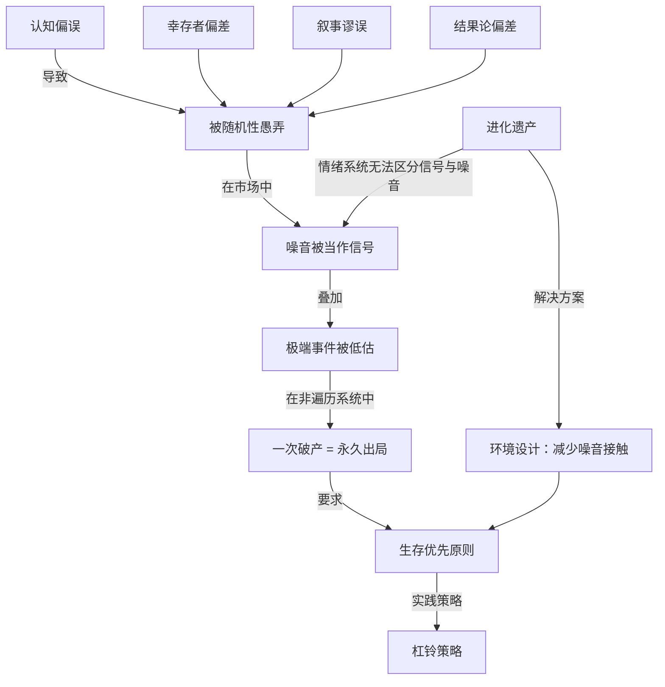
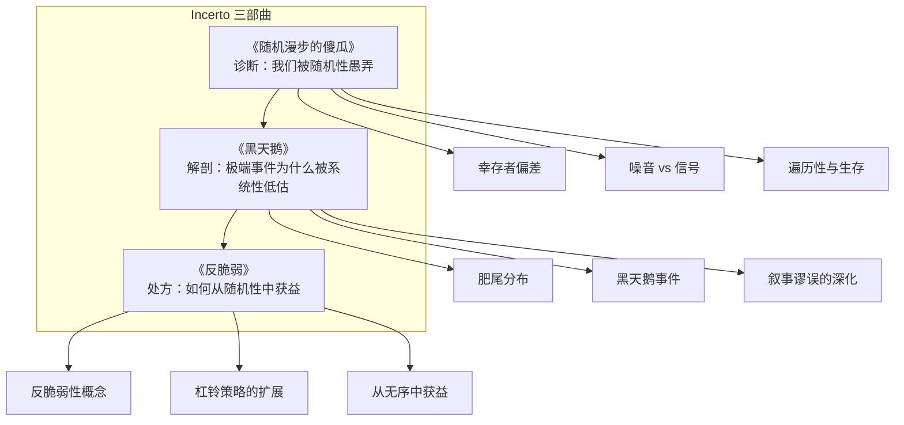

# 《随机漫步的傻瓜》深度读书笔记

> [!abstract]
> 《随机漫步的傻瓜》是纳西姆·塔勒布"不确定性"系列（Incerto）的第一部，2001年首版。核心论点是：==我们严重低估了随机性在生活中的作用，尤其是在金融市场和职业成功中==。塔勒布用案例和思想实验揭示了一个令人不安的事实——很多归因于"能力"的成功其实只是运气，很多被赋予"意义"的模式其实只是噪音。这不是一本投资指南，而是一本关于如何在充满随机性的世界中思考和生存的哲学著作。

## 这本书要解决什么问题

塔勒布写这本书时，华尔街正处于科技股泡沫的巅峰。无数交易员和基金经理凭借牛市赚得盆满钵满，被封为"天才"。塔勒布在交易大厅每天目睹这一切，但他看到的不是能力的展示，而是随机性的表演——那些"天才"中的大多数，只是碰巧站在了概率的正确一边。

> [!tip] 核心问题
> ==为什么我们在面对随机性时如此无能？我们的哪些认知习惯在系统性地欺骗我们？知道了这些之后，我们应该如何行动？==

塔勒布的回答围绕几个层次展开：人类大脑在进化中形成了寻找模式、构建因果叙事的本能——这套本能在石器时代是适应性的，但在现代复杂系统中成了系统性误导的来源。这种认知缺陷在金融市场中被放大到极致，因为市场产生了海量的随机数据，每一条都在诱惑我们"发现"不存在的模式。最危险的是，在非遍历系统中——一次失败就永久出局的系统中——这些认知错误可能是致命的。

在思想谱系上，塔勒布处于几条传统的交汇处：卡尔·波普尔的证伪主义、大卫·休谟对归纳法的怀疑、卡尼曼和特沃斯基的行为经济学，以及古代斯多葛哲学。他的独特之处在于双重身份——既是期权交易员又是学者——这让他的思考有学院派通常缺乏的切肤之痛。

## 核心概念地图



## 逐层深入

### 被随机性愚弄：幸存者偏差与替代历史

塔勒布创造了一个角色——"高收入的白痴"（High-income Idiot）：碰巧在牛市入行，碰巧押对方向，赚了大钱，然后以为自己是天才。这个角色不是虚构的讽刺，而是华尔街的常态。

> [!example] 幸存者偏差的思想实验
> 假设10000个交易员同时入场，每年50%的人因纯粹的运气而盈利。五年后还剩约312个"连续盈利"的交易员。这312人会写书、做演讲、被媒体追捧。但他们可能只是统计学上的幸存者——那9688个用同样方法破产的人，你永远不会听说他们的故事。
>
> ==我们的样本被系统性地扭曲了，因为失败者从视野中消失了。==

塔勒布引入了"替代历史"（alternative histories）概念来深化这个论点。我们只生活在一条历史路径上，但本可以有无数条不同的路径。一个成功的企业家可能只是走对了一条路，而在其他999条替代路径上他都破产了。我们没法观察那999条路径，所以错误地认为他的成功是必然的。

他建议用"蒙特卡洛思维"看世界：不要问"发生了什么"，而要问"在所有可能发生的情况中，这个结果出现的概率是多少"。一个基金经理连续3年每年跑赢市场5%，如果有1000个基金经理在随机交易，预期约有125个人做到这一点。仅凭3年的业绩，你无法区分真正的能力和纯粹的运气。需要多少年才能有合理的置信度？塔勒布认为至少20年以上——但大多数基金经理的职业生涯都不够长。

> [!warning] 结果论的陷阱
> 我们的社会——从教育体系到企业考核到投资评估——都深度沉浸在结果论中：用最终结果来判断决策的好坏。买彩票中奖了，就是"好决定"。但买彩票的期望值是负的，平均每花1元只能回收约0.5元。无论结果如何，从概率角度来说这都是坏决定——你碰巧赢了不会把坏决定变成好决定，正如一个人醉驾回家没出事不会把醉驾变成好决定。
>
> ==决策质量应该用决策时的信息和概率来评估，不是用事后结果来评估。==一个基于错误理由的投资可能赚钱（运气好），一个基于正确分析的投资可能亏钱（运气差）。长期看，好的决策过程会通过大数定律产生好的结果；但在任何单次决策中，随机性可以让结果和决策质量完全脱钩。所以评价一个投资者，不应该问"他赚了多少钱"，而应该问"他的决策过程是否合理"。前者受运气影响太大，后者才是真正能评估的东西。

### 能力与运气的领域差异

塔勒布引入了一个重要区分：不同领域中能力和运气的比重完全不同。

> [!note] "友善"领域 vs "残酷"领域
> - **友善领域**（国际象棋、外科手术、钢琴演奏）：反馈快速清晰，能力差异可被迅速识别和积累，运气影响有限
> - **残酷领域**（金融市场、风险投资、政治预测）：反馈缓慢模糊，噪音淹没信号，运气影响被极度放大
>
> ==我们的错误是把"友善"领域的直觉——能力决定成败——不加区分地搬到"残酷"领域。==

选择外科医生时看过去的手术成功率是有意义的（友善领域，过去表现能预测未来）。但选择基金经理时看过去3年业绩几乎毫无意义（残酷领域，3年数据中噪音远多于信号）。

金融业恰好是一个运气占主导的领域，但参与者和观察者都不愿承认——没有客户会把钱交给一个说"我主要靠运气"的基金经理。这种集体否认催生了大量"高收入的白痴"。

### 噪音与信号：信息的时间维度

> [!tip] 核心洞察：观察频率与噪音比例
> 假设一只股票年回报率10%（信号），年化波动率15%（噪音）：
> - 每年看一次：约70%概率看到正收益（信号占主导）
> - 每月看一次：约62%概率
> - 每天看一次：约51%概率——和抛硬币几乎一样
>
> 年化10%回报分摊到每天只有0.04%，而每天随机波动可能是1%或更多。==越频繁地观察，你接收到的信息中噪音的比例就越高。==盯盘不是在"收集信息"，而是在收集噪音。

塔勒布对新闻媒体持极度批评态度。财经新闻的运营模式是每天甚至每小时提供"市场解读"。但从噪音-信号角度看，每日的市场波动几乎完全是噪音——不包含任何关于长期趋势的有用信息。然而新闻媒体必须为每一次波动找到"原因"——这是它们的商业模式所要求的。

于是我们看到：股市上涨，分析师说"因为经济数据好"或"美联储立场温和"；第二天股市下跌，分析师说"因为贸易紧张"或"投资者获利了结"。这些"解释"有一个共同特征——它们是在结果已知之后才被构建的。无论市场往哪个方向走，总能找到一个听起来合理的"原因"。但这些事后合理化没有任何预测价值。

塔勒布称之为"叙事谬误"（narrative fallacy）——人类大脑强烈需要把世界组织成有因果关系的故事，即使真实情况是随机的、多因素的、根本不可能用单一叙事来概括的。这种需要在面对随机性时变成了系统性的自我欺骗。

> [!note] 数据挖掘的陷阱
> 随着计算能力的飞速提升，我们能够测试海量变量组合来寻找"预测模式"。但如果你测试足够多的变量，纯粹出于统计偶然总能找到看起来有"预测力"的关系。有人发现孟加拉国的黄油产量可以"预测"标准普尔500指数——如果你只看数据，你会得出黄油产量能预测美国股市的结论。但这当然是荒谬的——两者之间没有因果关系，只是测试了几千个变量后碰巧出现的虚假相关。
>
> 在量化投资领域这个问题尤其严重。一个量化团队可能测试了上千种策略，选出历史数据上表现最好的来部署。但"历史数据上表现最好"可能只意味着"在过去的噪音模式上拟合得最好"——一旦噪音模式变化，策略就失效。这就是"过度拟合"：模型记住了噪音，而不是学会了信号。

塔勒布的实践建议直接：大幅减少与短期市场数据的接触。不看财经新闻，不盯盘，尽可能降低检查投资组合的频率。你以为在通过关注市场来"控制风险"，实际上在用噪音轰炸自己的情绪系统。真正的风险管理不在于紧盯市场，而在于建立一个即使在你不看的情况下也能存活的投资组合。

### 极端事件与火鸡问题

传统风险模型假设市场回报遵循正态分布（高斯分布）。正态分布有一个关键特征：它的"尾部"衰减极快。超过3个标准差的事件概率只有0.3%，超过4个标准差只有0.006%，超过5个标准差只有百万分之几，超过6个标准差的概率低于10亿分之一——实际上"永远不会发生"。

但金融市场的真实数据完全不同。1987年10月19日黑色星期一，道琼斯指数一天暴跌22.6%——按正态分布的概率约为10的负50次方，即使从宇宙大爆炸开始每天观察，也不可能遇到一次。1998年长期资本管理公司（LTCM）的崩盘也是一个"不可能事件"——这家由两位诺贝尔经济学奖得主创办的基金，正是因为过度信任正态分布模型而轰然倒塌。LTCM的风险模型告诉他们最大日亏损不太可能超过某个数字，但现实中他们在几周内亏掉了几十亿美元。

==现实世界的分布是"肥尾"的——极端事件发生的概率远高于正态分布的预测。==在肥尾分布中，一小部分极端事件贡献了大部分的波动和影响。传统风险工具（标准差、VaR）在"正常"市场条件下运作良好，但在极端市场条件下严重低估风险——而极端情况正是风险管理最重要的时刻。

> [!warning] 火鸡问题
> 一只火鸡被喂养了1000天，每一天都强化了信念："人类是友善的，他们会永远喂我。"它的"统计模型"基于1000天数据，置信度极高。然后感恩节来了。
>
> 1000天的数据不仅没帮火鸡预测感恩节，反而让它更确信安全——==数据越多，虚假的自信越高。==这是归纳法的根本困境：过去的规律不保证未来的延续，而恰恰是那些打破过去规律的事件决定了最终的命运。

火鸡问题本质上是对归纳法的质疑——这正是大卫·休谟在18世纪提出的经典哲学难题。过去的规律性不能在逻辑上保证未来的延续。你观察到的1000只白天鹅不能证明"所有天鹅都是白的"——只需要一只黑天鹅就能推翻这个结论。在金融市场中，100年的历史数据不能保证第101年不会出现前所未有的极端事件。而恰恰是那些打破历史模式的事件——2008年的金融海啸、2020年的新冠疫情——对你的财务生存影响最大。

塔勒布还强调了非线性效应。很多现实系统不是线性的——小的变化可能导致巨大的突变。在金融市场中，这表现为长时间的平静后突然爆发剧烈波动。一只股票可能连续三年每天只波动1-2%，然后在某一天暴跌50%。如果你用那三年的数据来建模，你会得出"这只股票很安全"的结论——但这个结论恰恰在最关键的时刻是错的。

很多看似稳健的策略（如卖出深度虚值期权收取权利金）利润曲线极其平滑，给人"稳赚不赔"的印象。但它们本质上在承担尾部风险：大多数时间赚取小额稳定利润，在罕见的极端事件中亏损可能是灾难性的。这种策略就是金融版的"火鸡"——每天都在积累虚假的自信，直到感恩节到来。

### 遍历性与生存原则

> [!note] 遍历性的核心定义
> 一个系统是"遍历的"，意味着==时间平均等于集合平均==。一个人重复做某件事很多次的平均结果，等于很多人各做一次的平均结果。

```mermaid
graph LR
    subgraph 遍历系统：抛硬币
    A1[100人各抛1次<br>平均结果 = 0] --- A2[1人抛100次<br>平均结果 = 0]
    end

    subgraph 非遍历系统：俄罗斯轮盘赌
    B1[6人各玩1次<br>平均存活率 5/6] -.- B2[1人玩6次<br>几乎肯定死亡]
    end
```

俄罗斯轮盘赌是最极端的非遍历例子：6个人各玩一次，"平均"存活率5/6。但一个人连续玩6次几乎肯定会死——一旦死了一次就永久退出游戏。时间平均和集合平均完全不同。

> [!warning] 投资中的非遍历性
> 一个策略99%赚10%，1%亏100%（归零）。集合平均回报：0.99×10% - 0.01×100% = 8.9%——看起来很好。但一个人连续使用这个策略：当n=69次时存活概率约50%，当n=459次时存活概率仅1%。==最终破产几乎确定——不管之前赚了多少，一次归零就全部清空。==
>
> **核心原则：在非遍历系统中，不要追求最大化期望收益，而要最小化破产概率。**

杠杆是非遍历性的放大器。无杠杆投资者遇到50%下跌可以持有等待反弹；2倍杠杆投资者在50%下跌时直接归零，没有第二次机会。==杠杆不只是放大收益和损失，更关键的是放大了在极端情况下被永久淘汰的概率。==

很多看起来很成功的交易员和基金经理，可能只是因为还没遇到那个让他们破产的极端事件。他们的策略在"正常"条件下表现优秀，但包含了一个隐藏的"感恩节"。塔勒布把这类策略比作"在推土机前面捡硬币"：大部分时间安全地捡到硬币，但一旦推土机碾过来，后果不堪设想。

### 专家的可靠性边界

塔勒布对"专家"做了重要区分。他不是反智主义者——他只是在可靠和不可靠的专业知识之间画了一条线。

> [!tip] 什么样的专家值得信任
> - **值得信任**：友善领域的专家（外科医生、飞行员、消防员）——反馈快速清晰，专家可通过大量实践校准判断
> - **需要怀疑**：残酷领域的"专家"（经济预测者、市场分析师、政治评论家）——反馈太慢太模糊，专家无法有效从经验中学习
>
> 菲利普·泰洛克的研究显示：大多数政治和经济预测专家的准确率不比随机猜测好多少。更令人震惊的是，==最自信的专家反而预测准确率更低==——在不确定性高的领域，过度自信意味着低估了随机性。

实践推论：需要依赖专家意见时，先判断这个领域是"友善的"还是"残酷的"。如果是后者，专家的意见需要大打折扣——尤其当专家表现得非常自信时。

### 情绪、进化与环境设计

塔勒布坦率承认：知道随机性的存在不能让你免受其影响。他自己也会因随机的账面亏损而情绪低落——尽管理性上完全清楚那只是噪音。==这是大脑结构决定的硬性局限，不是知识可以解决的。==

我们的情绪系统在确定性远高于现代社会的环境中进化。在石器时代，"草丛在动就假设有狮子"这种偏好完全合理。但现代金融市场的价格波动大部分是无意义的噪音，情绪系统无法区分——每次下跌都触发焦虑，每次上涨都触发兴奋。

> [!tip] 塔勒布的解决方案
> 不是"控制情绪"（几乎不可能），而是==减少情绪被触发的机会==：
> - 不看财经新闻——你接收到的99%是噪音
> - 不盯盘——每天的价格变动几乎完全是随机波动
> - 降低检查投资组合的频率——从每天改为每月甚至每季度
> - 避免与其他投资者过度讨论短期市场走势

塔勒布认为"控制情绪"这个建议听起来很好但实际几乎不可行。你无法通过意志力压制一个经过数百万年进化打磨的情绪反应系统——就像你无法通过意志力阻止瞳孔在强光下收缩。这是硬件层面的限制，不是软件可以修复的。

塔勒布对斯多葛哲学有深度认同，尤其是塞涅卡和马可·奥勒留。斯多葛主义的核心教义是区分你能控制的事和不能控制的事——然后把全部精力集中在前者上，对后者保持平静接受。

在投资语境下，这意味着：
- 你不能控制市场的随机波动——接受它
- 你不能控制某个公司的股价明天涨还是跌——接受它
- 你能控制你的资产配置——把精力放在这里
- 你能控制你的风险管理——把精力放在这里
- 你能控制你的信息摄入习惯——把精力放在这里
- 你能控制你的交易频率——把精力放在这里

这不是消极——这是在随机性面前最理性、最节省认知资源的姿态。试图控制不可控的事情不仅注定失败，还会消耗你处理可控事情的精力和判断力。

### 杠铃策略与实践框架

杠铃策略是塔勒布最核心的实践建议，名字来源于杠铃的形状——两端重、中间轻。在投资中，这意味着：大部分资产（85-90%）放在极端安全的位置（如短期国债或现金等价物），确保在任何情况下都不会被摧毁；小部分资产（10-15%）放在极端高风险高回报的位置（如深度虚值期权或高度投机性的头寸），这部分做好了全部亏光的准备，但如果你对了，回报可能是数十倍甚至数百倍；==完全避开中间的"中等风险"区域==。

> [!note] 杠铃策略的逻辑
> 1. **中等风险给你虚假安全感**——一个"中等风险"的债券基金看起来很稳健，直到一次信用危机来袭，你发现它的亏损可能和股票一样惨重。中等风险意味着你既没有真正的安全性，也没有极端事件中的超额回报
> 2. **安全端确保生存**——这是遍历性原则的直接应用。无论发生什么，你的大部分资产是安全的，你不会被淘汰出局
> 3. **风险端利用非线性和肥尾效应**——深度虚值期权在大多数时间价值归零，但在极端事件中回报可能是几百倍。你在小部分资金上做好了100%亏损的准备（这不会伤害你），但获得了在极端事件中获得超额回报的可能
> 4. **杠铃策略是"火鸡问题"的解药**——火鸡的问题是把所有赌注押在"明天和今天一样"上。杠铃策略则相反：既为正常情况做了准备（安全端提供稳定收益），也为异常情况做了准备（风险端在极端事件中获利）

杠铃策略也可以延伸到职业和人生：保持一份稳定的主业（安全端），同时用少量时间和资源探索高风险高回报的副业或项目（风险端）。即使所有探索性项目都失败了，你的主业保证了生存；但如果某个项目成功了，它的回报可能远超你的想象。

## 与其他思想的交叉

### 塔勒布与行为经济学

塔勒布的观点与卡尼曼、特沃斯基的行为经济学大量重叠——都强调人类认知的系统性缺陷。但两者侧重不同。

> [!note] 互补关系
> - **卡尼曼**：实验科学方法，通过精心实验识别和分类偏误（锚定、可得性、框架效应等），建立偏误的"目录"
> - **塔勒布**：哲学和实践方法，不关心偏误分类，关心偏误在非遍历系统中的灾难性综合后果
>
> 卡尼曼会说"人类有过度自信偏差"；塔勒布会说"过度自信偏差 + 杠杆 + 肥尾分布 = 金融危机"。

两人后来成为好朋友。卡尼曼在[[《思考，快与慢》]]中多次引用塔勒布。但塔勒布温和地批评行为经济学过于关注实验室偏误，而对现实世界中偏误的交互作用和级联效应关注不够——一个偏误在实验室中可能只导致轻微判断错误，但在金融市场中可能导致系统性崩溃。

### 塔勒布与价值投资

塔勒布和巴菲特、芒格在很多实践结论上高度一致：

- 都强调长期视角和安全边际
- 都警惕过度交易
- 都建议减少对市场噪音的关注
- 都对"市场专家"的预测能力深度怀疑

> [!warning] 核心分歧
> **巴菲特**相信通过深入基本面研究可以识别被低估的资产并获得长期超额收益。**塔勒布**对这种能力远为怀疑——他承认巴菲特可能是真正有能力的极少数人之一，但强调你事前无法识别谁是巴菲特，谁是碰巧连续赢了的赌徒。
>
> 实践含义：巴菲特式投资者集中投资少数深入研究过的公司；塔勒布式投资者承认自己不知道什么会涨什么会跌，用杠铃策略利用自己的无知。==选择哪种取决于你对自己判断能力的诚实评估。==

### 塔勒布与有效市场假说

> [!note] 复杂的关系
> - **一致**：市场很难被预测，大多数试图预测市场的努力是徒劳的
> - **对立1**：法马假设市场价格变动遵循正态分布——塔勒布最核心的攻击目标。法马后来承认了肥尾现象的存在，但两人对如何应对的建议截然不同
> - **对立2**：有效市场假说暗示市场是稳定的——信息迅速纳入价格，价格围绕真实价值波动；塔勒布认为市场可能是根本不稳定的——正反馈循环可以把小波动放大成大危机，市场可能偏离"真实价值"很远、很久
>
> 2008年金融危机中很多资产价格明显偏离任何合理的"真实价值"——这很难用有效市场假说解释。

### 塔勒布与Ole Peters的遍历性研究

> [!note] 学术化验证
> Ole Peters在伦敦数学实验室的工作为塔勒布的遍历性论证提供了更严格的数学基础。Peters证明了经济学教科书中的"期望效用理论"隐含地假设了遍历性——当这个假设不成立时（而它在现实中经常不成立），很多标准的经济学结论就会失效。
>
> 这意味着：==经济学教科书教你"选择期望值最高的选项"这个建议，在很多真实场景中是错误的——因为它假设了你有机会通过多次重复来实现"平均"回报，但在非遍历的现实中，你只活一次。==

## 对不同领域的启示

### 金融市场

- **不要相信"明星基金经理"**：3-5年的业绩几乎无法区分能力和运气。在评估基金经理时追问：他的超额收益是否可被已知风险因子（市场、规模、价值等）解释？他的策略在逻辑上是否站得住脚？他的长期记录（20年以上）如何？追踪研究表明大多数"明星"的超额收益会消失（均值回归）
- **避免过度交易**：交易越频繁，接收的噪音越多，情绪化决策越多，交易成本和税负越高。除非你有真正的信息优势（大多数人没有），减少交易频率几乎总是有益的。买入并持有之所以有效，部分原因就是它强制投资者远离噪音
- **警惕"从不亏钱"的策略**：如果一个策略声称可以持续盈利而没有任何回撤，很可能它在收取"尾部风险溢价"——大多数时间赚小额稳定利润，在罕见事件中亏损是毁灭性的。它可能只是还没遇到它的"感恩节"
- **真正的分散投资**：持有50只股票不等于分散——如果它们都是同一个行业、同一个国家、受同样宏观因素驱动，在危机中会一起下跌。真正的分散需要持有真正不相关的资产类别：不同国家、不同资产类型、不同驱动因素

### 职业与人生

- **不要把成功者的建议当普遍真理**：你看到的是幸存者。可能有成千上万人采用了同样的方法但失败了，他们不会出现在你的信息源中。不是说成功者的经验毫无价值，而是你需要打一个巨大的折扣
- **用概率而非确定性思考**：面对一个机会，问自己"如果我做这件事100次，平均结果如何？有多少次会成功？有多少次会失败？最坏的情况是什么？"这种思维方式可以帮你避免被单一的乐观或悲观情景左右
- **建立韧性**：在非遍历的职业游戏中，确保永远不会被彻底淘汰。保持一定的财务储备，不要把所有鸡蛋放在一个篮子里，培养可迁移的技能，维护多元化的人际网络。即使一次失败，也能重新开始
- **区分过程和结果**：不要因为一个好结果就认为你的决策正确，也不要因为一个坏结果就否定你的决策。评估你的决策过程——在做决策时你是否充分考虑了概率和可能的后果

### 日常决策

- **承认不确定性**：不是所有事情都需要解释。有些事情就是随机发生的，强行找"原因"只是在创造虚假的因果叙事
- **减少噪音输入**：少看新闻，少看短期数据。你以为在"保持信息灵通"，实际上在用噪音轰炸自己的情绪系统
- **评估"感恩节风险"**：审视你的生活安排——有没有某种小概率事件一旦发生就会让你彻底出局？如果有，这是你需要首先处理的风险，无论它看起来多么不可能

## 预测与现实

塔勒布在这本书中描述的很多风险在出版后几年就得到了戏剧性验证。2008年的金融海啸是一个教科书级别的案例：

- 基于正态分布的VaR模型严重低估风险——"肥尾"批评被完美印证
- 大量使用杠杆的金融机构在极端事件中破产——遍历性原则的直接验证
- "从不亏钱"的对冲基金策略（如固定收益套利）一夜崩溃——火鸡问题的现实版
- 评级机构和监管机构系统性低估风险——幸存者偏差和叙事谬误的制度化体现

塔勒布本人据报道在2008年通过做空金融市场获得了巨额利润——他不仅预见了危机，还通过杠铃策略从中获益。这让他的理论获得了一种学术论文无法提供的信度。

> [!warning] 需要修正的地方
> - 塔勒布的框架有时导致过度怀疑——如果把所有成功都归因于运气，就丧失了从成功案例中学习的能力。巴菲特连续50年以上的超额收益用纯运气解释不合理，虽然塔勒布也承认真正的能力确实存在
> - "不看新闻"的建议在实践中可能过于极端——完全断绝信息输入会让你错过一些虽然罕见但确实重要的信号。大幅减少比完全断绝更务实
> - 这本书更多是"破"而非"立"——杠铃策略是建设性例外，但对普通投资者实施门槛较高
> - 关键在于找到平衡：承认运气的巨大作用，但不否认能力的存在；对短期业绩保持怀疑，但承认足够长的记录可以提供有意义的信号

## 对你意味着什么

读《随机漫步的傻瓜》最大的收获不是某个具体的投资技巧，而是一种思维方式的根本转变。

> [!tip] 实践检查清单
> 1. 看到一个"成功人士"分享经验时，自动问：如果有10000人做了同样的事，有多少人会成功？如果只有几百个，他的"经验"可能只是幸存者偏差——不是说毫无价值，而是需要打一个巨大的折扣
> 2. 看到一个基金经理过去3年表现优秀时，知道仅凭3年数据无法区分能力和运气——至少需要20年以上的记录才能开始有统计学上的区分度，而即使那样也要考虑幸存者偏差
> 3. 发现自己每天查看投资组合时，意识到你看到的几乎完全是噪音，而你的情绪反应正在驱动糟糕的决策——减少查看频率是最好的行动
> 4. 评估一个投资策略时，不只看平均回报，追问：最坏的情况是什么？有没有一种情景——即使概率很小——会让你完全归零？如果有，那么这个策略的"平均回报"就是一个骗局——在非遍历的现实中，你可能永远无法实现那个"平均"
> 5. 你的职业生涯是非遍历的——你不能"重来"。优先确保自己永远不会被完全淘汰：保持财务储备、不把全部赌注压在一个方向上、培养可在不同环境中使用的技能、维护多元化的人际网络。不是因为这些策略会让你"最优化"你的收益，而是因为它们确保了你能一直留在游戏中——只要你还在游戏中，你就有机会

## 塔勒布思想体系的完整图景



《随机漫步的傻瓜》是塔勒布"不确定性"系列（Incerto）的起点。三本书形成了一个完整的思想递进：第一本诊断问题（我们被随机性愚弄）；第二本解剖问题的核心维度（极端事件比我们以为的更重要、更频繁、更具决定性）；第三本提出解决方案（不仅要抵御随机性，还要设计你的生活和投资，使其能够从随机性和不确定性中获益——这就是"反脆弱"）。

如果你只读一本，《随机漫步的傻瓜》是最佳起点——它可读性最强，思想最集中，而且足以改变你看待成功、失败和风险的方式。如果它说服了你，后两本会在更深的层次上拓展你的思考。

## 批评与局限

> [!note] 关于这本书的写作风格
> 塔勒布对金融从业者、学者和记者几乎不加掩饰的鄙视可能让一些读者不适。他的写作傲慢、跑题、自我中心。但他自己也承认这一点，并认为一本关于随机性的书如果写得井井有条反而是一种讽刺。如果你能越过风格的障碍，核心思想是极具穿透力的。

**批评1：过度强调随机性。** 虽然运气确实被低估，但能力也确实存在。塔勒布承认这一点，但他的修辞有时走得太远，给人一种"一切都是运气"的印象。真正有用的视角是：在不同领域中，运气和能力的比重不同，而我们倾向于在所有领域都高估能力。

**批评2：实用建议有限。** 这本书更多是在"破"而非"立"。它告诉你不要做什么（不要追业绩、不要相信模式、不要频繁交易），但对于应该做什么，建议相对模糊。杠铃策略是一个例外，但它的实施对普通投资者来说门槛较高——你需要理解期权和极端风险敞口。

**批评3：不可证伪性风险。** 塔勒布的框架有时接近不可证伪：如果一个成功者确实有能力，塔勒布会说"你事前无法识别他是有能力还是运气好"；如果一个策略最终失败了，他会说"看，我说了吧"。这种论证方式在逻辑上是有问题的——一个好的理论应该是可证伪的。

## 现代回响

塔勒布的核心论点在出版后二十多年间不断被验证。2008年金融海啸是最戏剧性的案例，但此后事件持续印证他的框架：

- 2010年"闪崩"——道琼斯指数几分钟内暴跌近1000点又反弹
- 2020年新冠疫情引发的全球市场崩盘——又一个"按正态分布不应发生"的事件
- 2022年加密货币连环爆雷（Luna/Terra、FTX）——大量"加密天才"被证明只是"高收入的白痴"

> [!note] 社交媒体时代的幸存者偏差
> 社交媒体极大放大了塔勒布描述的问题。每个人只展示成功，失败者不会发帖分享。"炒股群"和"投资大V"是新版的"连续五年盈利的交易员"——你只看到碰巧赚了钱的人在声称自己有能力，看不到用同样方法亏钱的沉默大多数。如果2001年的新闻已是噪音的主要来源，今天7×24小时的信息轰炸就是噪音的超级放大器。

塔勒布的思想也渗透到了其他领域：医学中的"可重复性危机"（大量发表的研究发现可能只是数据挖掘的产物）、技术创业中的"精益创业"方法论对验证性学习的强调——都是他的噪音-信号框架和幸存者偏差警告的回响。

## 延伸阅读

- [[《黑天鹅》]]：塔勒布系列的第二部，从"被随机性愚弄"发展到"极端事件为什么被系统性低估，以及它们如何塑造了历史"
- [[《反脆弱》]]：系列第三部，从"如何抵御随机性"跃升到"如何从随机性中获益"——塔勒布创造了"反脆弱"概念描述那些在随机冲击中变得更强的系统。三本书构成完整思想体系：被愚弄 → 理解极端 → 从中获益
- [[《思考，快与慢》]]：卡尼曼毕生研究的总结，系统介绍人类认知的两套系统及其互动冲突，为塔勒布的很多观察提供实验证据和理论框架
- [[《漫步华尔街》]]：如果你被塔勒布说服了"大多数人无法战胜市场"，马尔基尔会告诉你具体该怎么做——低成本指数基金、定期定额投资、长期持有
