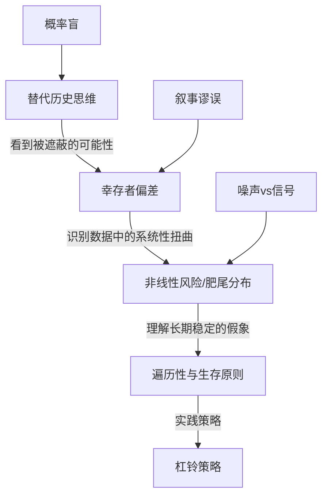

# 《随机漫步的傻瓜》深度读书笔记

> [!abstract] 全书速览
> 这本书只有一个核心主张：你以为的成功，很可能只是运气。纳西姆·塔勒布用交易员的视角和概率论的武器，拆穿了一个让大多数人不舒服的真相——在充满随机性的世界里，人类天生不擅长区分技能和运气。你看到的那些成功者、投资天才、商界领袖，他们的辉煌故事里有多少成分是真实能力，有多少成分只是恰好站在了==随机分布的有利一端==？塔勒布不是在否认努力的价值，而是在提醒你：如果你不理解概率，你就会被随机性愚弄，把噪声当信号，把幸存者当英雄，把偶然当必然。这本书出版于2001年，正值互联网泡沫破灭之际，它的警告在此后的每一次金融危机中都得到了惊人的验证。二十多年过去了，书中对人类认知偏误和概率盲区的分析不仅没有过时，反而在信息爆炸的时代变得更加尖锐。

## 这本书要解决什么经济问题

你有没有想过一个问题：为什么金融市场里那些风光无限的明星交易员，往往过几年就销声匿迹了？为什么投资大师的预测记录和掷硬币差不多，却依然有无数人追随他们？为什么你的邻居买了一只股票赚了钱，就自信地认为自己掌握了投资的秘诀？

> [!tip] 核心问题
> ==在一个被随机性深度渗透的世界里，人类为什么如此不擅长理解概率，而这种无能又是怎样导致了系统性的决策错误？==

塔勒布自己就是华尔街的交易员，他在交易大厅里近距离观察了无数同行的起落。他发现一个令人不安的模式：很多看起来极其成功的交易员，其实只是在玩一种对自己有利的随机游戏——短期内赚到了钱，但承担了巨大的隐性风险。那些风险暂时没有爆发，不意味着不存在。当极端事件降临时，这些人往往一夜之间被清零。

这本书在经济学和金融学的谱系中位置独特。它既不是传统的投资指南，也不是学院派的经济学论文。塔勒布更接近行为经济学的先驱卡尼曼和特沃斯基的思路——关注人类认知偏误对经济决策的影响——但他的切入角度更加激进。他不只是说"人类有认知偏误"，而是说"在随机性面前，人类的整个认知系统都是不可靠的"。他把矛头直接指向了华尔街的专业人士、商学院的教授、经济学家的预测模型，以及每一个以为自己理解了市场的普通投资者。在思想谱系上，塔勒布继承了波普尔的证伪主义——你永远不能证明理论为真，只能证明为假；他吸收了休谟对因果关系的怀疑——过去发生的事不保证未来也会发生；他认同卡尼曼和特沃斯基的行为经济学发现——人类在处理概率时存在系统性偏误；他还深受古代斯多葛哲学家的影响——区分你能控制和不能控制的事情，专注于前者。但和纯粹的学者不同，塔勒布用自己的钱在市场上押注，这种==切肤之痛==让他的思考有一种学院派通常缺乏的现实感。

## 核心模型地图

塔勒布在这本书中并没有提出一个统一的数学模型，但他围绕"随机性"这个中心，构建了几个相互关联的思考框架。理解这些框架之间的关系，是把握全书思想体系的关键。

**第一个框架是"替代历史"思维。** 这是全书最核心的工具。你看到的现实只是无数可能发生的历史中的一条路径。你的邻居买了某只股票赚了50%，你看到的是一个成功的投资决策。但在替代历史中——在所有可能发生的情景里——这个决策可能有60%的概率让他亏损30%。你只看到了实际发生的那条路径，忽略了所有没有发生但本可能发生的路径。这就像你看到一个人在俄罗斯轮盘赌中活了下来，就认为他勇敢而明智——你忽略了那些在替代历史中已经死去的玩家。塔勒布建议你培养一种=="蒙特卡洛思维"==：不要问"发生了什么"，而要问"在所有可能发生的情况中，这个结果出现的概率是多少"。

**第二个框架是"幸存者偏差"。** 这个概念和替代历史紧密相关，但更直接地指向你在日常生活中犯的错误。你看到的所有成功故事都是经过筛选的。书店里摆满了成功企业家的传记，但你看不到那些用了完全相同方法却失败了的人——因为没有人会为失败者写书。你看到的基金经理是那些恰好在过去五年表现好的，但你看不到那些表现差而被淘汰的。塔勒布提醒你：==在评估任何策略或方法时，你必须考虑整个样本池，而不只是幸存下来的那部分。==

**第三个框架是"非线性风险"与肥尾分布。** 在传统金融学中，风险和收益被假设为正态分布——极端事件非常罕见。但塔勒布指出，现实世界中很多重要事件遵循的是"肥尾分布"：==极端事件的发生频率远远高于正态分布的预测==。这意味着那些看起来连续稳定盈利的策略，可能正在积累一个巨大的尾部风险——就像感恩节前的火鸡，每天都被喂食，每天都觉得世界很美好，直到屠刀落下。

**第四个框架是"遍历性"与生存原则。** 这是塔勒布最具原创性的贡献之一。在遍历系统中，时间平均等于集合平均，你可以用期望值来指导决策。但很多现实系统是非遍历的——一旦你在某一次中被淘汰，游戏就永久结束了。在非遍历系统中，==生存——确保自己永远不会被淘汰出局——才是第一位的==。

> [!note] 四个框架的递进关系
> 替代历史帮你看到被遮蔽的可能性；幸存者偏差帮你识别数据中的系统性扭曲；非线性风险帮你理解为什么"长期稳定"可能只是灾难来临前的假象；遍历性原则则告诉你，在这样一个世界里，你应该把生存放在一切策略之前。

## 逐层深入

### 运气伪装成技能：尼罗和约翰的故事

塔勒布在书中虚构了两个对比鲜明的人物来展示他的核心论点。尼罗是一个谨慎的交易员，深知随机性的力量，采取保守策略，稳步积累财富，但从不引人注目。约翰则是另一类典型——冲劲十足，连续几年获得惊人回报，买了豪车，换了大房子，成为同事们羡慕的对象。

如果你在约翰赚钱的那几年看他，你会认为他是一个天才交易员。他自己也这么认为。但塔勒布要你思考的是：约翰的策略本质上是什么？他其实是在卖保险——大部分时候收取小额保费（稳定盈利），但承担着极小概率下的巨额赔付（灾难性亏损）。当市场长期平稳时，约翰看起来无比聪明。但当极端事件发生——比如1998年俄罗斯债券危机——约翰的全部积累可能在一天内蒸发。

这个故事揭示了一个在金融市场中反复出现的模式：==大量的"成功"交易策略其实是在用隐性的、难以观察的风险来换取显性的、容易衡量的收益。== 你在任何一个时间点观察，这些策略都看起来很好。但如果你把时间拉长到足够长，或者在足够多的替代历史中观察，你就会发现这些策略的期望值可能是负的。

> [!example] 幸存者偏差的思想实验
> 假设10000个交易员在同一时间开始交易，每年有50%的人因纯粹的运气而盈利。一年后5000人盈利，两年后2500人连续盈利，三年后1250人，四年后625人，五年后大约312人。这312个"连续五年盈利"的交易员——在一个完全随机的过程中——会被市场和媒体视为天才。他们会被邀请到电视上做节目，被媒体采访，出版畅销书讲述他们的"投资秘诀"。但他们和那9688个破产的人之间的唯一区别是运气。==你永远看不到那9688个失败者。他们悄悄消失了。你的整个样本被系统性地扭曲了——只有幸存者进入了你的视野。==

这对你意味着什么？当你看到一个投资顾问、一个基金经理、或者一个股市大V连续几年业绩优异时，不要急着崇拜。问自己几个问题：他的策略在极端情况下会怎样？他是真的有能力，还是恰好在一个对他有利的市场周期里？如果让一千个人用随机策略投资，其中是否也会有几个看起来像"天才"的幸存者？需要多少年的记录才能区分能力和运气？塔勒布认为至少需要20年以上——但大多数基金经理的职业生涯都不够长。

> [!warning] 结果论的陷阱
> 你的社会——从教育体系到企业考核到投资评估——都深度沉浸在结果论中：用最终结果来判断决策的好坏。一个人买彩票中了1000万，你会恭喜他"做了一个聪明的决定"。但买彩票的期望值是负的，不管结果如何，从概率角度来说这都是一个坏决定——==你碰巧赢了不会把坏决定变成好决定，正如醉驾回家没出事不会把醉驾变成好决定==。塔勒布要你区分"好的决策过程"和"好的结果"。好的决策过程是在决策时充分考虑了概率和可能的后果；好的结果可能只是运气。

### 概率盲：你的大脑不是为概率设计的

塔勒布花了大量篇幅解释一个残酷的事实：人类的大脑在演化过程中并没有被训练来处理概率问题。你的祖先需要快速判断灌木丛后面是不是有老虎——这是一个确定性问题，不需要贝叶斯推理。但在现代金融市场中，你面对的几乎全是概率问题：这只股票涨的概率有多大？这个策略长期盈利的概率是多少？

人类存在一系列系统性的概率盲区。你会把"高概率的小盈利"和"低概率的大亏损"混为一谈。一个策略如果99%的时候赚1万，1%的时候亏100万，它的长期期望值是负的（99乘1万减去1乘100万等于负1万），但大多数人只看到了"几乎每次都赚钱"这个表象。

你会被=="叙事谬误"==绑架。当一件事情已经发生，你的大脑会自动编造一个因果故事来解释它，让它看起来是"必然的"。股价涨了，分析师说是因为"市场信心恢复"；股价跌了，同一个分析师说是因为"投资者获利回吐"。这些都是事后编造的叙事，你根本无法从中提取任何有用的预测信息。但你的大脑就是喜欢故事——故事比概率分布好理解一万倍。

你还会受到"锚定效应"和=="可得性偏差"==的影响。你刚听说一个朋友炒币赚了十倍，这个鲜活的个案就会压倒所有统计数据，让你觉得"我也可以"。但你没看到的是，在同一时期亏损的人远远多于盈利的人，只是亏损的人不会到处宣扬罢了。

塔勒布认为，这些认知偏误不是你个人的缺陷，而是人类这个物种的集体特征。你不能通过"更加努力思考"来克服它们——你需要的是系统性的方法来绕过它们。这就是为什么他特别重视环境设计：与其试图让你的大脑变得更理性（几乎不可能），不如改变你所处的信息环境，减少你被噪声触发的机会。

### 噪声与信号：信息越多，判断越差

这是书中最令人不安的部分之一。塔勒布直言不讳地攻击了整个金融评论和预测行业。

你可能以为获取更多信息会帮助你做出更好的决策。但塔勒布告诉你恰恰相反：==在大多数情况下，你获取的"信息"大部分是噪声，真正的信号被淹没在噪声的海洋中。== 更糟糕的是，噪声不是中性的——它会系统性地干扰你的判断。

> [!tip] 观察频率与噪声比例
> 假设你投资了一个年化回报率15%、年化波动率10%的投资组合——这已经是非常优秀的投资了。如果你每年看一次收益，你有93%的概率看到盈利。但如果你每天看一次，你只有大约54%的概率看到盈利——因为短期波动让日收益几乎像掷硬币一样随机。每次你看到亏损，你的情绪就会受到冲击，你可能会做出冲动的卖出决策。所以==更频繁地查看信息不是让你更聪明，而是让你更焦虑、更容易犯错==。

塔勒布对金融媒体和分析师的批评尤为猛烈。他认为这些人本质上是"噪声贩子"。他们每天需要解释市场为什么涨了或跌了，但大部分市场波动根本没有可解释的"原因"——它只是随机波动。然而分析师不能对着镜头说"今天的市场波动是随机的、没有意义的"，因为这样就没人看他的节目了。所以他们被迫编造故事，而你作为观众，被迫消费这些噪声，并且你的大脑会自动把这些噪声当作有意义的信号来处理。

> [!note] 数据挖掘的陷阱
> 如果你测试足够多的变量组合，纯粹出于统计偶然，你总能找到一些看起来有"预测力"的关系。有人曾发现孟加拉国的黄油产量和标准普尔500指数之间有统计上显著的相关性。但这当然是荒谬的——两者之间没有任何因果关系，只是在测试了几千个变量之后碰巧出现的虚假相关。量化投资领域的很多看似有效的策略就属于这种过度拟合：在历史数据上完美，在未来失效。

这对你的启示直接而实用：==如果你是一个长期投资者，减少查看投资账户的频率可能是你能做的最有价值的事情之一。== 不是因为"眼不见心不烦"的鸵鸟心态，而是因为高频信息中的信噪比太低，它在伤害你的判断力。

### 肥尾分布与火鸡问题：极端事件的阴影

塔勒布区分了两种截然不同的世界。一种是"正态世界"——在这里个体差异不大，极端值很罕见，均值有意义。比如人的身高：即使你找到全世界最高的人，他也不会比平均身高高出十倍。在这种世界里，传统统计学工作得很好。

另一种是"极端世界"——在这里极端事件可以彻底主导全局。比如财富分布：世界上最富有的人的财产可能超过最穷的几十亿人的总和。在这种世界里，均值几乎没有意义，你上周计算的风险指标可能在下周就被一个极端事件彻底推翻。

金融市场恰恰属于极端世界。但大量的金融模型——包括你耳熟能详的Black-Scholes期权定价模型和VaR（在险价值）风险模型——都建立在正态分布的假设上。塔勒布认为这是一个致命的错误：==你在用适合正态世界的工具来应对极端世界的风险==。

> [!example] LTCM的崩溃
> 1998年长期资本管理公司（LTCM）的崩溃是塔勒布反复引用的案例。这家由两位诺贝尔经济学奖得主创办的对冲基金，使用了极其精密的数学模型来管理风险。在他们的模型中，1998年那种级别的市场波动几乎不可能发生——概率低到宇宙年龄都不够用。但它就是发生了。LTCM在几周内就从金融巨头变成了需要美联储紧急协调救助的案例。

> [!warning] 火鸡问题
> 一只火鸡从出生第一天起就被人类喂养。第一天它有些紧张，第十天它开始放松，第100天它已经相当确信人类是友善的。第1000天，它的置信度达到了极限——1000天的数据无一例外地支持这个模型。然后在感恩节那天，它被宰了。==1000天的数据不仅没有帮助火鸡预测感恩节，反而让它更加确信安全——数据越多，虚假的自信越高。== 这是归纳法的根本困境：过去的规律性不能在逻辑上保证未来的延续。

这个故事告诉你：==不要把"从未发生过"等同于"不可能发生"。== 你的投资策略必须能够承受极端事件，而不是假装极端事件不存在。很多看似稳健的策略——比如卖出深度虚值期权收取权利金——利润曲线极其平滑，给人"稳赚不赔"的印象。但它们本质上就是金融版的"火鸡"——在大多数时间赚取小额稳定利润，但在罕见的极端事件中亏损可能是灾难性的。

### 遍历性：为什么期望值可能是个骗局

遍历性是塔勒布引入的一个关键数学概念，也可能是他对金融思想最重要的贡献之一。一个系统是遍历的，意味着==时间平均等于集合平均==——一个人重复做某件事很多次的平均结果，等于很多人各做一次的平均结果。

抛硬币是遍历的：100个人各抛一次，平均结果是零；一个人抛100次，平均结果也是零。但俄罗斯轮盘赌不是遍历的。6个人各玩一次，5个人存活——"集合平均"的存活率是83%。但一个人连续玩6次？他几乎肯定会死——因为一旦死了一次，就永久退出游戏了。时间平均的存活率远低于83%。

> [!warning] 投资中的非遍历性
> 一个策略99%的情况下赚10%，1%的情况下亏100%（完全归零）。集合平均回报是正的8.9%——看起来很不错。但如果一个人连续使用这个策略，最终破产几乎是确定的——不管你之前赚了多少，==一次归零就全部清空==。

塔勒布从这个分析得出了他最核心的实践原则：**在非遍历系统中，生存比优化更重要。不要追求最大化期望收益，而要最小化破产概率。**

这个原则有几层含义。首先，你不能简单地用期望值来指导决策。经济学教科书告诉你"选择期望值最高的选项"——但这个建议隐含地假设了遍历性。在非遍历的现实中——你只有一次生命、一笔养老金——一次灾难性的亏损可能让你永久出局。

其次，==杠杆是非遍历性的放大器==。没有杠杆的投资者遇到50%的下跌可以选择持有等待反弹——他的"游戏"没有结束。但2倍杠杆的投资者在50%下跌时直接归零——他被强制淘汰出局，没有第二次机会。杠杆不仅放大了收益和损失，更关键的是增加了你在极端情况下被永久淘汰的概率。这就是为什么塔勒布对杠杆极度警惕。

第三，这个原则延伸到金融之外。你的职业生涯也是非遍历的——你不能"重来"。一次严重的声誉损失、一次健康崩溃、一次完全押注在错误方向上的决策，都可能让你永久出局。因此塔勒布建议你保持财务储备、不要把所有鸡蛋放在一个篮子里、培养可迁移的技能——这些都是确保你在非遍历的人生游戏中永远不会被彻底淘汰的方法。

### 情绪、斯多葛主义与杠铃策略：如何与随机性共处

塔勒布关于情绪和认知局限的讨论是这本书中最诚实也最有人情味的部分。他坦率地承认：尽管他比大多数人都更了解随机性和概率，他自己作为交易员仍然会因为账面上的随机亏损而情绪低落——即使他理性上完全清楚那只是噪声。

这揭示了一个比任何具体偏误都更深层的问题：==知道偏误存在和真正避免偏误之间有一条巨大的鸿沟。== 这不是教育可以解决的问题，而是大脑结构决定的。你的情绪系统是在石器时代进化出来的，那时"草丛在动就假设有老虎"是完全合理的。但现代金融市场的价格波动大部分是无意义的噪声，你的情绪系统无法区分——每次下跌都触发焦虑，每次上涨都触发兴奋，这些反应累积起来驱动了大量糟糕的投资决策。

> [!tip] 塔勒布的解决方案：环境设计
> 塔勒布的解决方案不是"控制情绪"——他认为这几乎不可能，就像你无法通过意志力阻止瞳孔在强光下收缩一样——而是==设计你的环境来减少情绪被触发的机会==。具体措施包括：
> - 不看财经新闻（你接收到的99%是噪声）
> - 不盯盘（每天的价格变动几乎完全是随机波动）
> - 降低检查投资组合的频率（从每天改为每月甚至每季度）
> - 避免与其他投资者过度讨论短期市场走势

塔勒布对古代斯多葛哲学家有深度认同，尤其是塞涅卡和马可·奥勒留。斯多葛主义的核心教导是区分"你能控制的事"和"你不能控制的事"。在投资语境下，这意味着：你不能控制市场的随机波动，但你能控制你的资产配置和风险管理；你不能控制某个公司的股价明天涨还是跌，但你能控制你的信息摄入习惯和交易频率。把精力集中在你能控制的事上，对你不能控制的事保持平静接受——这不是消极，而是在随机性面前最理性的姿态。

> [!note] 杠铃策略：核心实践建议
> 杠铃策略的名字来源于杠铃的形状——两端重、中间轻。在投资中，这意味着：
> - **安全端（85-90%）：** 极端安全的资产——如短期国债或现金——确保任何情况下都不会被摧毁
> - **风险端（10-15%）：** 极端高风险高回报的资产——如深度虚值期权——你做好了这部分全部亏光的准备，但如果对了，回报可能是数十倍甚至数百倍
> - **完全避开中间的"中等风险"区域**
>
> 逻辑基础：中等风险给你虚假的安全感——一次信用危机就可能让"中等风险"的债券基金亏损和股票一样惨重。杠铃的安全端确保了生存——这是遍历性原则的直接应用。杠铃的风险端利用了非线性和肥尾效应。这也是"火鸡问题"的解药——==杠铃策略既为正常情况做了准备，也为异常情况做了准备==。

## 预测与现实

《随机漫步的傻瓜》出版于2001年。二十多年过去了，书中的核心论断经受住了时间的检验吗？

**被强力验证的部分：** 2008年全球金融危机是对塔勒布观点的最大验证。他在书中警告的那些问题——对风险模型的过度信赖、极端事件的低估、金融系统的脆弱性——在这场危机中全部暴露无遗。基于正态分布假设构建的风险管理系统在危机面前形同虚设。大量"连续盈利多年"的金融机构在几周内破产。塔勒布本人在2008年因为其对冲策略而获得了巨大回报。

此后的事件继续印证他的框架：2010年的"闪崩"（道琼斯指数在几分钟内暴跌近1000点然后反弹）、2020年新冠疫情引发的全球市场崩盘、2022年加密货币市场的连环爆雷（FTX等）——每一次都是传统模型预测之外的极端事件。加密货币市场尤其像是塔勒布警告的一个实验室。大量的"加密天才"在牛市中涌现，他们的"投资哲学"被广泛传播，然后市场崩盘时大部分人归零。这正是塔勒布描述的"被随机性愚弄"的典型场景。

> [!warning] 需要修正或补充的部分
> 塔勒布在这本书中对"技能vs运气"的讨论有时过于倾向运气一方。后来的研究——比如迈克尔·莫布森在[[《成功方程式》]]中的工作——更精细地量化了不同领域中技能和运气的相对贡献，给出了更平衡的画面。在某些金融领域（比如巴菲特式的长期价值投资），持续跑赢市场的记录可能确实反映了真实的技能成分，而不仅仅是幸存者偏差。此外，虽然塔勒布正确地指出了正态分布假设的危险性，但在他之后金融行业已经发展出了更多考虑尾部风险的模型——包括极值理论、压力测试框架等。这些进步虽然远远不够完美，但也不是毫无价值的。

## 不同学派怎么说

塔勒布的观点在经济学和金融学界引发了激烈争论，不同学派从各自的立场出发给出了不同的回应。

**有效市场假说的支持者**（如尤金·法玛）在某种程度上同意塔勒布关于"主动投资难以跑赢市场"的观点，但他们的理由不同。法玛认为市场是有效的，所以你跑赢市场几乎不可能；塔勒布则认为市场根本不遵循传统金融理论描述的理性均衡——它更混乱、更极端、更不可预测。法玛的早期理论假设市场价格变动遵循正态分布——这恰恰是塔勒布最核心的攻击目标。两人的结论看似相似（不要试图战胜市场），但对市场本质的理解截然不同。

**传统风险管理学派**对塔勒布的攻击最不买账。他们承认正态分布不完美，但认为在缺乏更好替代方案的情况下，现有模型仍然是"有用的近似"。他们批评塔勒布只破不立——指出问题容易，但你总不能因为模型不完美就完全放弃量化风险管理吧？这个批评有一定道理，也是塔勒布思想体系中相对薄弱的环节。

**行为经济学家**是塔勒布最天然的盟友。卡尼曼本人在[[《思考，快与慢》]]中引用了塔勒布的工作，两人有深度的学术交流。但行为经济学家通常比塔勒布更温和——他们倾向于在承认人类认知偏误的同时，设计"助推"机制来改善决策，而塔勒布则更悲观，认为很多偏误是根深蒂固、难以纠正的。

**价值投资者**对塔勒布的态度比较复杂。巴菲特会同意塔勒布关于"大部分交易员只是运气好"的论断，但他不会同意"所有持续成功都是运气"的极端版本。巴菲特相信并且用几十年的记录证明了通过纪律性的价值投资可以持续获取超额回报——这似乎是对"一切都是随机的"最有力的反例。==争论的焦点归根结底在于一个问题：在金融市场这种高噪声环境中，技能到底占多大比重？== 塔勒布倾向于说"比你以为的少得多"，而他的批评者则认为他矫枉过正了。

## 对你意味着什么

读完这本书，你不需要变成一个彻底的怀疑论者，但你确实应该对自己的思维方式做几个关键调整。

> [!tip] 实践检查清单
> 1. **在评价投资业绩时，永远问"样本量够大吗"。** 一个基金经理三年的业绩几乎没有统计意义。如果你非要根据过往业绩选择投资，至少看十年以上，而且要看他在不同市场环境下的表现——牛市、熊市、震荡市都经历过才有参考价值。
> 2. **降低你消费金融新闻的频率。** 这不是懒惰，这是理性。每日的市场评论中95%以上是噪声。如果你是长期投资者，每月甚至每季度审视一次投资组合就足够了。在审视之间的时间里，把注意力放在你能控制的事情上——你的职业发展、你的储蓄率、你的学习。
> 3. **设计你的财务策略时，把"不被消灭"放在"获取最大回报"前面。** 这意味着：永远留有安全边际；不要把全部资金压在任何单一策略上；确保即使最坏的情况发生，你也能继续生存下去。塔勒布自己的做法是把大部分资产放在极其安全的地方，只用一小部分进行高风险投机。
> 4. **学会以过程而非结果来评价决策。** 当你做了一个好决策但结果不好时，不要过度自责；当你做了一个差决策但结果很好时，不要沾沾自喜。长期来看，好的决策过程会产生好的结果，但短期内任何事情都可能发生。
> 5. **对"成功故事"保持健康的怀疑。** 当你听到某人分享他的成功经验时，想想那些用了同样方法却失败了的人。他们的故事你永远听不到，但他们的存在对你评估这个方法的有效性至关重要。
> 6. **审视你的生活安排中是否存在"火鸡问题"。** 你的收入来源是否过于集中？你的职业技能是否过于单一？有没有某种小概率事件一旦发生就会让你彻底出局？如果有，这是你需要首先处理的风险，无论它看起来多么不可能。
> 7. **接受不确定性。** 不是所有事情都需要解释。有些事情就是随机发生的，强行找"原因"只是在创造虚假的因果叙事。承认"我不知道"是一种力量，而不是软弱。当你面对一个你无法预测的局面时，把注意力从"预测会发生什么"转向"无论发生什么我都能存活"——这是塔勒布给你的最核心的建议。

## 延伸阅读

塔勒布自己的[[《黑天鹅》]]是最直接的续篇，它把"极端事件"这个主题从本书的初步探讨发展成了一个完整的理论体系。如果你读完《随机漫步的傻瓜》还想深入，《黑天鹅》是必读的。

丹尼尔·卡尼曼的[[《思考，快与慢》]]从认知心理学的角度系统讲述了人类决策中的偏误和陷阱，和塔勒布的观点高度互补。塔勒布告诉你"随机性在愚弄你"，卡尼曼告诉你"你的大脑是怎么被愚弄的"。两本书对照阅读，你会对自己的认知局限有一个非常清醒的认识。

迈克尔·莫布森的[[《成功方程式》]]提供了一个更平衡的视角，用统计方法量化了不同领域中技能和运气的相对贡献。如果你觉得塔勒布的观点有时过于偏激，莫布森会帮你找到一个更均衡的立场。