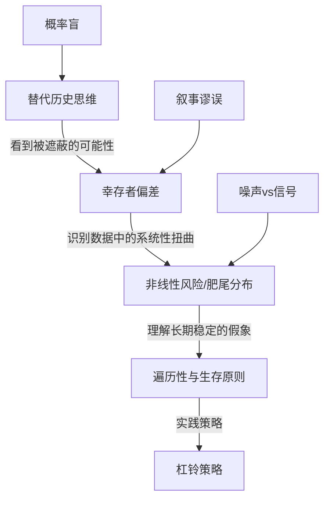

# 《随机漫步的傻瓜》深度读书笔记

> [!abstract]
> 这本书只有一个核心主张：你以为的成功，很可能只是运气。纳西姆·塔勒布用交易员的视角和概率论的武器，拆穿了一个让大多数人不舒服的真相——在充满随机性的世界里，人类天生不擅长区分技能和运气。你看到的那些成功者、投资天才、商界领袖，他们的辉煌故事里有多少成分是真实能力，有多少成分只是恰好站在了==随机分布的有利一端==？塔勒布不是在否认努力的价值，而是在提醒你：如果你不理解概率，你就会被随机性愚弄，把噪声当信号，把幸存者当英雄，把偶然当必然。这本书出版于2001年，正值互联网泡沫破灭之际，它的警告在此后的每一次金融危机中都得到了验证。

## 这本书要解决什么经济问题

你有没有想过一个问题：为什么金融市场里那些风光无限的明星交易员，往往过几年就销声匿迹了？为什么投资大师的预测记录和掷硬币差不多，却依然有无数人追随他们？

> [!tip] 核心问题
> ==在一个被随机性深度渗透的世界里，人类为什么如此不擅长理解概率，而这种无能又是怎样导致了系统性的决策错误？==

塔勒布自己就是华尔街的交易员，他在交易大厅里近距离观察了无数同行的起落。他发现一个令人不安的模式：很多看起来极其成功的交易员，其实只是在玩一种对自己有利的随机游戏——短期内赚到了钱，但承担了巨大的隐性风险。那些风险暂时没有爆发，不意味着不存在。当极端事件降临时，这些人往往一夜之间被清零。

这本书在经济学和金融学的谱系中位置独特。它既不是传统的投资指南，也不是学院派论文。塔勒布更接近行为经济学的先驱卡尼曼和特沃斯基的思路——关注人类认知偏误对经济决策的影响——但他的切入更激进。他不只是说"人类有认知偏误"，而是说"在随机性面前，人类的整个认知系统都是不可靠的"。他把矛头直接指向了华尔街的专业人士、商学院的教授、经济学家的预测模型，以及每一个以为自己理解了市场的普通投资者。

## 核心模型地图

塔勒布在这本书中并没有提出一个统一的数学模型，但他围绕"随机性"这个中心，构建了几个相互关联的思考框架。

**第一个框架是"替代历史"思维。** 这是全书最核心的工具。你看到的现实只是无数可能发生的历史中的一条路径。你的邻居买了某只股票赚了50%，你看到的是一个成功的投资决策。但在替代历史中——在所有可能发生的情景里——这个决策可能有60%的概率让他亏损30%。你只看到了实际发生的那条路径，忽略了所有没有发生但本可能发生的路径。就像你看到一个人在俄罗斯轮盘赌中活了下来，就认为他勇敢而明智——你忽略了那些在替代历史中已经死去的玩家。

**第二个框架是"幸存者偏差"。** 你看到的所有成功故事都是经过筛选的。书店里摆满了成功企业家的传记，但你看不到那些用了完全相同方法却失败了的人——因为没有人会为失败者写书。你看到的基金经理是那些恰好在过去五年表现好的，但你看不到那些表现差而被淘汰的。塔勒布提醒你：==在评估任何策略或方法时，你必须考虑整个样本池，而不只是幸存下来的那部分。==

**第三个框架是"非线性风险"。** 在传统金融学中，风险和收益被假设为正态分布——极端事件非常罕见。但塔勒布指出，现实世界中很多重要事件遵循的是"肥尾分布"：极端事件的发生频率远高于正态分布的预测。那些看起来连续稳定盈利的策略，可能正在积累一个巨大的尾部风险——就像感恩节前的火鸡，每天都被喂食，每天都觉得世界很美好，直到屠刀落下。

这三个框架之间的关系是递进的：替代历史帮你看到被遮蔽的可能性；幸存者偏差帮你识别数据中的系统性扭曲；非线性风险帮你理解为什么"长期稳定"可能只是灾难来临前的假象。

## 逐层深入

### 运气伪装成技能：尼罗和约翰的故事

塔勒布在书中虚构了两个对比人物。尼罗是一个谨慎的交易员，深知随机性的力量，采取保守策略，稳步积累但从不引人注目。约翰则是另一类典型——冲劲十足，连续几年获得惊人回报，买了豪车，换了大房子，成为同事们羡慕的对象。

如果你在约翰赚钱的那几年看他，你会认为他是天才。他自己也这么认为。但塔勒布要你思考的是：约翰的策略本质上是什么？他其实是在卖保险——大部分时候收取小额保费，但承担着极小概率下的巨额赔付。当市场长期平稳时，约翰看起来无比聪明。但当极端事件发生——比如1998年俄罗斯债券危机——约翰的全部积累可能在一天内蒸发。

> [!example] 幸存者偏差的思想实验
> 假设10000个交易员同时入场，每年有50%因纯粹运气而盈利。五年后还剩约312个"连续盈利"的交易员。这312人会写书、做演讲、被媒体追捧。但他们和那9688个破产的人之间的唯一区别是运气。你永远看不到那9688个失败者——他们悄悄消失了。==你的整个样本被系统性地扭曲了。==

这对你意味着什么？当你看到一个投资顾问或基金经理连续几年业绩优异时，不要急着崇拜。问自己几个问题：他的策略在极端情况下会怎样？他是真的有能力，还是恰好在一个有利的市场周期里？如果让一千个人用随机策略投资，其中是否也会有几个看起来像"天才"的幸存者？

### 概率盲：你的大脑不是为概率设计的

人类的大脑在演化过程中并没有被训练来处理概率问题。你的祖先需要快速判断灌木丛后面是不是有老虎——这是一个确定性问题，不需要贝叶斯推理。但在现代金融市场中，你面对的几乎全是概率问题。

你会把"高概率的小盈利"和"低概率的大亏损"混为一谈。一个策略如果99%的时候赚1万，1%的时候亏100万，它的长期期望值是负的。但大多数人只看到了"几乎每次都赚钱"这个表象。

你会被"叙事谬误"绑架。当一件事情已经发生，你的大脑会自动编造一个因果故事来解释它，让它看起来是"必然的"。股价涨了，分析师说是因为"市场信心恢复"；股价跌了，同一个分析师说是因为"投资者获利回吐"。这些都是事后编造的叙事，你根本无法从中提取任何有用的预测信息。但你的大脑就是喜欢故事——故事比概率分布好理解一万倍。

> [!warning] 可得性偏差的陷阱
> 你刚听说一个朋友炒币赚了十倍，这个鲜活的个案就会压倒所有统计数据，让你觉得"我也可以"。但你没看到的是，在同一时期亏损的人远远多于盈利的人。

塔勒布认为，这些偏误不是你个人的缺陷，而是人类物种的集体特征。你不能通过"更加努力思考"来克服它们——你需要系统性的方法来绕过它们。

### 噪声与信号：信息越多，判断越差

塔勒布直言不讳地攻击了整个金融评论和预测行业。你可能以为获取更多信息会帮助你做出更好的决策。但塔勒布告诉你恰恰相反：==在大多数情况下，你获取的"信息"大部分是噪声，真正的信号被淹没在噪声的海洋中。==

> [!tip] 核心洞察：观察频率与噪声比例
> 假设你投资了一个年化回报率15%、年化波动率10%的组合：
> - 每年看一次：93%概率看到盈利（信号占主导）
> - 每天看一次：约54%概率看到盈利（几乎和抛硬币一样）
>
> 每次你看到亏损，你的情绪就会受到冲击，你可能会做出冲动的卖出决策。==更频繁地查看信息不是让你更聪明，而是让你更焦虑、更容易犯错。==

塔勒布对金融媒体的批评尤为猛烈。分析师每天需要解释市场为什么涨了或跌了，但大部分波动根本没有可解释的"原因"——它只是随机波动。然而分析师不能对着镜头说"今天的市场波动是随机的、没有意义的"，所以他们被迫编造故事，而你被迫消费这些噪声。

这对你的启示直接而实用：**如果你是一个长期投资者，减少查看投资账户的频率可能是你能做的最有价值的事情之一。** 不是鸵鸟心态，而是因为高频信息中的信噪比太低，它在伤害你的判断力。

### 肥尾分布与火鸡问题：极端事件的阴影

塔勒布区分了两种截然不同的世界。一种是"正态世界"——个体差异不大，极端值很罕见。比如人的身高：即使你找到全世界最高的人，他也不会比平均身高高出十倍。

另一种是"极端世界"——极端事件可以彻底主导全局。比如财富分布：世界上最富有的人的财产可能超过最穷的几十亿人的总和。金融市场恰恰属于极端世界。但大量的金融模型——包括Black-Scholes期权定价模型和VaR风险模型——都建立在正态分布的假设上。你在用适合正态世界的工具来应对极端世界的风险。

> [!example] LTCM的崩溃
> 1998年长期资本管理公司（LTCM）——由两位诺贝尔经济学奖得主创办的对冲基金——使用了极其精密的数学模型来管理风险。在他们的模型中，1998年那种级别的市场波动几乎不可能发生。但它就是发生了。LTCM在几周内就从金融巨头变成了需要美联储紧急救助的案例。

> [!warning] 火鸡问题
> 一只火鸡从出生起就被人类喂养。1000天的"数据"让它建立了一个高置信度的模型："人类会永远喂我。"然后在感恩节那天，它被宰了。==1000天的数据不仅没有帮助火鸡预测感恩节，反而让它更加确信安全——数据越多，虚假的自信越高。==

这个故事告诉你：**不要把"从未发生过"等同于"不可能发生"。** 你的投资策略必须能够承受极端事件，而不是假装极端事件不存在。

### 遍历性：为什么期望值可能是个骗局

塔勒布引入了"遍历性"这个概念来揭示一个更深层的问题。一个系统是遍历的，意味着==时间平均等于集合平均==——一个人重复做某件事很多次的结果，等于很多人各做一次的平均结果。

抛硬币是遍历的。但俄罗斯轮盘赌不是。6个人各玩一次，5个人存活——"平均"存活率83%。但一个人连续玩6次？他几乎肯定会死——因为一旦死了一次，就永久退出游戏了。

> [!warning] 投资中的非遍历性
> 一个策略99%的情况下赚10%，1%的情况下亏100%。集合平均回报是正的8.9%。看起来很不错。但如果你反复使用这个策略，最终破产几乎是确定的——不管你之前赚了多少，==一次归零就全部清空==。
>
> **核心原则：在非遍历系统中，生存比优化更重要。不要追求最大化期望收益，而要最小化破产概率。**

杠杆是非遍历性的放大器——没有杠杆的投资者遇到50%的下跌可以等待反弹，但2倍杠杆的投资者在50%下跌时直接归零。杠杆增加了你在极端情况下被永久淘汰的概率。

这个原则延伸到金融之外。你的职业生涯也是非遍历的——一次严重的声誉损失、一次健康崩溃，都可能让你永久出局。因此塔勒布建议你保持财务储备、不把所有赌注压在一个方向上——这些都是确保你永远不会被彻底淘汰的方法。

### 斯多葛主义与杠铃策略：如何与随机性共处

在拆穿随机性的幻觉之后，塔勒布也提供了应对方式。他的答案来自两个方向：古希腊的斯多葛哲学和他自己的杠铃策略。

斯多葛学派的核心教导是区分"你能控制的事"和"你不能控制的事"。你能控制的是决策过程、准备程度、心态；你不能控制的是结果——因为结果总是被随机性影响。你应该关注的不是"这次投资赚了还是亏了"，而是"我的决策过程是否合理"。一个好的决策可能产生坏的结果，一个坏的决策可能产生好的结果。如果你能做到按过程而非结果来评价自己，你就不会被短期的随机波动带着走。

> [!note] 杠铃策略的逻辑
> 把大部分资产（85-90%）放在极端安全的位置——如短期国债或现金——确保任何情况下都不会被摧毁。把小部分资产（10-15%）放在极端高风险高回报的位置——如深度虚值期权。完全避开中间的"中等风险"区域。
>
> 逻辑是：中等风险给你虚假的安全感，一次信用危机就可能让"中等风险"的债券基金亏损和股票一样惨重。杠铃的安全端确保生存，风险端则利用极端事件中的非线性回报。

## 预测与现实

2008年全球金融危机是对塔勒布观点的最大验证。他在书中警告的那些问题——对风险模型的过度信赖、极端事件的低估、金融系统的脆弱性——在这场危机中全部暴露无遗。基于正态分布假设构建的风险管理系统在危机面前形同虚设。大量"连续盈利多年"的金融机构在几周内破产。塔勒布本人在2008年因为其对冲策略而获得了巨大回报。

此后的事件继续印证他的框架：2010年的"闪崩"、2020年新冠疫情引发的全球市场崩盘、2022年加密货币市场的连环爆雷（FTX等）——每一次都是传统模型预测之外的极端事件。

> [!warning] 需要修正的部分
> 塔勒布在这本书中对"技能vs运气"的讨论有时过于倾向运气一方。后来的研究——比如迈克尔·莫布森在《成功方程式》中的工作——更精细地量化了不同领域中技能和运气的相对贡献，给出了更平衡的画面。在某些金融领域（比如巴菲特式的长期价值投资），持续跑赢市场的记录可能确实反映了真实的技能成分。此外，虽然塔勒布正确地指出了正态分布假设的危险性，但在他之后金融行业已经发展出了更多考虑尾部风险的模型。这些进步虽不完美，但也不是毫无价值的。

## 不同学派怎么说

**有效市场假说的支持者**（如尤金·法玛）在"市场很难被预测"这个层面上和塔勒布一致，但理由不同。法玛认为市场是有效的，所以你跑赢市场几乎不可能；塔勒布则认为市场根本不遵循传统金融理论描述的理性均衡——它更混乱、更极端。法玛的早期理论假设市场价格变动遵循正态分布——这恰恰是塔勒布最核心的攻击目标。两人的结论看似相似（不要试图战胜市场），但对市场本质的理解截然不同。

**传统风险管理学派**对塔勒布的攻击最不买账。他们承认正态分布不完美，但认为在缺乏更好替代方案的情况下，现有模型仍然是"有用的近似"。他们批评塔勒布只破不立——你总不能因为模型不完美就完全放弃量化风险管理吧？

**行为经济学家**是塔勒布最天然的盟友。卡尼曼本人在[[《思考，快与慢》]]中引用了塔勒布的工作。但行为经济学家通常比塔勒布更温和——他们倾向于设计"助推"机制来改善决策，而塔勒布则更悲观，认为很多偏误是根深蒂固、难以纠正的。

**价值投资者**对塔勒布的态度比较复杂。巴菲特会同意"大部分交易员只是运气好"的论断，但他不会同意"所有持续成功都是运气"。巴菲特相信并且用几十年的记录证明了，通过纪律性的价值投资可以持续获取超额回报——这似乎是对"一切都是随机的"最有力的反例。争论的焦点归根结底在于：==在金融市场这种高噪声环境中，技能到底占多大比重？== 塔勒布倾向于说"比你以为的少得多"，而他的批评者则认为他矫枉过正了。

## 对你意味着什么

读完这本书，你不需要变成一个彻底的怀疑论者，但你确实应该对自己的思维方式做几个关键调整。

> [!tip] 实践检查清单
> 1. **在评价投资业绩时，永远问"样本量够大吗"。** 一个基金经理三年的业绩几乎没有统计意义。如果你非要根据过往业绩选择投资，至少看十年以上，而且要看他在牛市、熊市、震荡市中的表现。
> 2. **降低你消费金融新闻的频率。** 这不是懒惰，这是理性。每日的市场评论中95%以上是噪声。如果你是长期投资者，每月甚至每季度审视一次投资组合就足够了。在此之间，把注意力放在你能控制的事情上——你的职业发展、你的储蓄率、你的学习。
> 3. **设计你的财务策略时，把"不被消灭"放在"获取最大回报"前面。** 永远留有安全边际；不要把全部资金压在任何单一策略上；确保即使最坏的情况发生，你也能继续生存下去。
> 4. **学会以过程而非结果来评价决策。** 当你做了一个好决策但结果不好时，不要过度自责；当你做了一个差决策但结果很好时，不要沾沾自喜。长期来看，好的决策过程会产生好的结果。
> 5. **对"成功故事"保持健康的怀疑。** 当你听到某人分享他的成功经验时，想想那些用了同样方法却失败了的人。他们的故事你永远听不到，但他们的存在对你评估这个方法的有效性至关重要。
> 6. **审视你的生活安排中是否存在"火鸡问题"。** 你的收入来源是否过于集中？你的职业技能是否过于单一？有没有某种小概率事件一旦发生就会让你彻底出局？如果有，这是你需要首先处理的风险，无论它看起来多么不可能。

## 延伸阅读

塔勒布自己的[[《黑天鹅》]]是最直接的续篇，它把"极端事件"这个主题从本书的初步探讨发展成了一个完整的理论体系。如果你读完《随机漫步的傻瓜》还想深入，这是必读的。

卡尼曼的[[《思考，快与慢》]]从认知心理学的角度系统讲述了人类决策中的偏误和陷阱。塔勒布告诉你"随机性在愚弄你"，卡尼曼告诉你"你的大脑是怎么被愚弄的"。两本书对照阅读，你会对自己的认知局限有非常清醒的认识。

迈克尔·莫布森的《成功方程式》提供了一个更平衡的视角，用统计方法量化了不同领域中技能和运气的相对贡献。如果你觉得塔勒布的观点有时过于偏激，莫布森会帮你找到更均衡的立场。
