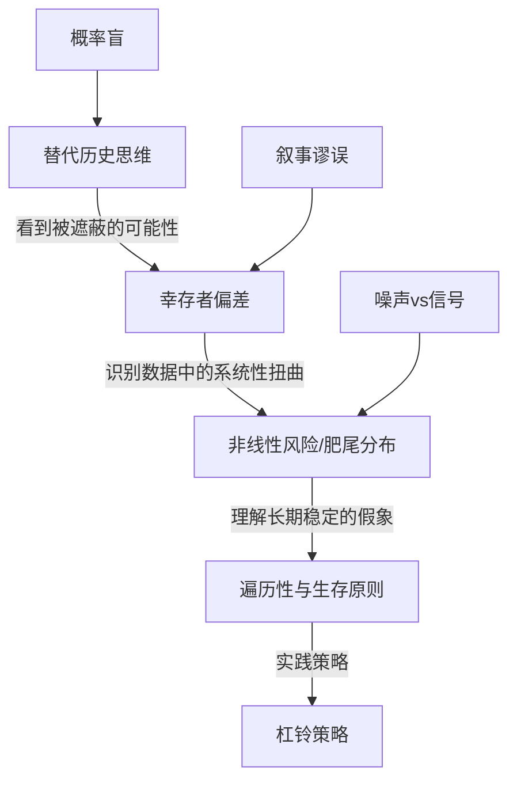

# 《随机漫步的傻瓜》深度读书笔记

> [!abstract]
> 这本书只有一个核心主张：你以为的成功，很可能只是运气。纳西姆·塔勒布用交易员的视角和概率论的武器，拆穿了一个让大多数人不舒服的真相——在充满随机性的世界里，人类天生不擅长区分技能和运气。你看到的那些成功者、投资天才、商界领袖，他们的辉煌故事里有多少成分是真实能力，有多少成分只是恰好站在了==随机分布的有利一端==？塔勒布不是在否认努力的价值，而是在提醒你：如果你不理解概率，你就会被随机性愚弄，把噪声当信号，把幸存者当英雄，把偶然当必然。这本书出版于2001年，正值互联网泡沫破灭之际，它的警告在此后的每一次金融危机中都得到了惊人的验证。二十多年过去了，书中对人类认知偏误和概率盲区的分析不仅没有过时，反而在信息爆炸的时代变得更加尖锐。

## 这本书要解决什么经济问题

你有没有想过一个问题：为什么金融市场里那些风光无限的明星交易员，往往过几年就销声匿迹了？为什么投资大师的预测记录和掷硬币差不多，却依然有无数人追随他们？为什么你的邻居买了一只股票赚了钱，就自信地认为自己掌握了投资的秘诀？

> [!tip] 核心问题
> ==在一个被随机性深度渗透的世界里，人类为什么如此不擅长理解概率，而这种无能又是怎样导致了系统性的决策错误？==

塔勒布自己就是华尔街的交易员，他在交易大厅里近距离观察了无数同行的起落。他发现一个令人不安的模式：很多看起来极其成功的交易员，其实只是在玩一种对自己有利的随机游戏——短期内赚到了钱，但承担了巨大的隐性风险。那些风险暂时没有爆发，不意味着不存在。当极端事件降临时，这些人往往一夜之间被清零。

这本书在经济学和金融学的谱系中位置独特。它既不是传统的投资指南，也不是学院派的经济学论文。塔勒布更接近行为经济学的先驱卡尼曼和特沃斯基的思路——关注人类认知偏误对经济决策的影响——但他的切入角度更加激进。他不只是说"人类有认知偏误"，而是说"在随机性面前，人类的整个认知系统都是不可靠的"。在思想谱系上，塔勒布继承了波普尔的证伪主义——你永远不能证明理论为真，只能证明为假；他吸收了休谟对因果关系的怀疑——过去发生的事不保证未来也会发生；他认同卡尼曼的行为经济学发现——人类在处理概率时存在系统性偏误；他还深受古代斯多葛哲学家的影响——区分你能控制和不能控制的事情，专注于前者。但和纯粹的学者不同，塔勒布用自己的钱在市场上押注，这种"切肤之痛"让他的思考有一种学院派通常缺乏的现实感。

## 核心模型地图

**第一个框架是"替代历史"思维。** 你看到的现实只是无数可能发生的历史中的一条路径。你的邻居买了某只股票赚了50%，你看到的是一个成功的投资决策。但在替代历史中——在所有可能发生的情景里——这个决策可能有60%的概率让他亏损30%。你只看到了实际发生的那条路径，忽略了所有没有发生但本可能发生的路径。塔勒布建议你培养一种"蒙特卡洛思维"：不要问"发生了什么"，而要问"在所有可能发生的情况中，这个结果出现的概率是多少"。

**第二个框架是"幸存者偏差"。** 你看到的所有成功故事都是经过筛选的。书店里摆满了成功企业家的传记，但你看不到那些用了完全相同方法却失败了的人。你看到的基金经理是那些恰好在过去五年表现好的，但你看不到那些表现差而被淘汰的。==在评估任何策略或方法时，你必须考虑整个样本池，而不只是幸存下来的那部分。==

**第三个框架是"非线性风险"与肥尾分布。** 现实世界中很多重要事件遵循的是"肥尾分布"：极端事件的发生频率远远高于正态分布的预测。那些看起来连续稳定盈利的策略，可能正在积累一个巨大的尾部风险——就像感恩节前的火鸡。

**第四个框架是"遍历性"与生存原则。** 在遍历系统中，时间平均等于集合平均。但很多现实系统是非遍历的——一旦你在某一次中被淘汰，游戏就永久结束了。==生存——确保自己永远不会被淘汰出局——才是第一位的。==

## 逐层深入

### 运气伪装成技能：尼罗和约翰的故事

塔勒布在书中虚构了两个对比鲜明的人物。尼罗是一个谨慎的交易员，深知随机性的力量，采取保守策略。约翰则冲劲十足，连续几年获得惊人回报，成为同事们羡慕的对象。

如果你在约翰赚钱的那几年看他，你会认为他是天才。但塔勒布要你思考的是：约翰的策略本质上是在卖保险——大部分时候收取小额保费，但承担着极小概率下的巨额赔付。当极端事件发生时，约翰的全部积累可能在一天内蒸发。

> [!example] 幸存者偏差的思想实验
> 假设10000个交易员同时入场，每年有50%因纯粹运气而盈利。五年后还剩约312个"连续盈利"的交易员。这312人会写书、做演讲、被媒体追捧。但他们和那9688个破产的人之间的唯一区别是运气。==你永远看不到那9688个失败者——你的整个样本被系统性地扭曲了。==

这对你意味着什么？当你看到一个投资顾问或基金经理连续几年业绩优异时，不要急着崇拜。问自己：他的策略在极端情况下会怎样？他是真的有能力，还是恰好在一个有利的市场周期里？需要多少年才能区分能力和运气？塔勒布认为至少需要20年以上。

> [!warning] 结果论的陷阱
> 你的社会深度沉浸在结果论中：用最终结果来判断决策的好坏。你碰巧赢了不会把坏决定变成好决定，正如醉驾回家没出事不会把醉驾变成好决定。==决策质量应该用决策时的信息和概率来评估，不是用事后结果来评估。==

### 概率盲：你的大脑不是为概率设计的

人类的大脑在演化过程中并没有被训练来处理概率问题。你的祖先需要快速判断灌木丛后面是不是有老虎——这是一个确定性问题。但在现代金融市场中，你面对的几乎全是概率问题。

你会被"叙事谬误"绑架——你的大脑会自动为已发生的事编造因果故事。你还会受到"可得性偏差"的影响——你刚听说一个朋友炒币赚了十倍，这个鲜活的个案就会压倒所有统计数据。塔勒布认为这些偏误不是你个人的缺陷，而是人类物种的集体特征。你不能通过"更加努力思考"来克服它们——你需要系统性的方法来绕过它们。

### 噪声与信号：信息越多，判断越差

> [!tip] 核心洞察：观察频率与噪声比例
> 假设你投资了一个年化回报率15%、年化波动率10%的组合：
> - 每年看一次：93%概率看到盈利（信号占主导）
> - 每天看一次：约54%概率看到盈利（几乎和抛硬币一样）
>
> ==更频繁地查看信息不是让你更聪明，而是让你更焦虑、更容易犯错。==

塔勒布对金融媒体的批评尤为猛烈。分析师每天需要解释市场为什么涨了或跌了，但大部分波动根本没有可解释的"原因"——它只是随机波动。然而分析师不能说"今天的波动是随机的"，所以他们被迫编造故事，而你被迫消费这些噪声。

> [!note] 数据挖掘的陷阱
> 有人曾发现孟加拉国的黄油产量和标准普尔500指数之间有统计上显著的相关性。但这只是测试了几千个变量后碰巧出现的虚假相关。量化投资领域的很多看似有效的策略就属于这种过度拟合：在历史数据上完美，在未来失效。

### 肥尾分布与火鸡问题

金融市场属于"极端世界"，但大量金融模型建立在正态分布假设上。你在用适合正态世界的工具来应对极端世界的风险。

> [!example] LTCM的崩溃
> 1998年LTCM——由两位诺贝尔经济学奖得主创办的对冲基金——在其模型中认为那种级别的市场波动几乎不可能发生。但它就是发生了。LTCM在几周内就从金融巨头变成了需要美联储紧急救助的案例。

> [!warning] 火鸡问题
> 一只火鸡被喂养了1000天，它的"统计模型"置信度极高。然后感恩节来了。==1000天的数据不仅没有帮助火鸡预测感恩节，反而让它更加确信安全——数据越多，虚假的自信越高。== 这告诉你：不要把"从未发生过"等同于"不可能发生"。

### 遍历性：为什么期望值可能是个骗局

一个系统是遍历的，意味着==时间平均等于集合平均==。但俄罗斯轮盘赌不是遍历的——6个人各玩一次"平均"存活率83%，但一个人连续玩6次几乎肯定会死。

> [!warning] 投资中的非遍历性
> 一个策略99%赚10%，1%亏100%。集合平均回报正的8.9%。但如果你反复使用，==一次归零就全部清空==，最终破产几乎确定。
>
> **核心原则：在非遍历系统中，生存比优化更重要。不要追求最大化期望收益，而要最小化破产概率。**

杠杆是非遍历性的放大器——2倍杠杆的投资者在50%下跌时直接归零，你连第二次机会都没有。这个原则延伸到金融之外：你的职业生涯也是非遍历的——一次严重的声誉损失或健康崩溃都可能让你永久出局。

### 情绪、斯多葛主义与杠铃策略

塔勒布坦率地承认：知道偏误存在和真正避免偏误之间有一条巨大的鸿沟。你的情绪系统是在石器时代进化出来的，无法区分有意义的信号和无意义的噪声。

> [!tip] 塔勒布的解决方案
> 不是"控制情绪"（几乎不可能），而是==减少情绪被触发的机会==：
> - 不看财经新闻（你接收到的99%是噪声）
> - 不盯盘（每天的价格变动几乎完全是随机波动）
> - 降低检查频率（从每天改为每月甚至每季度）
> - 避免与其他投资者过度讨论短期走势

斯多葛主义的核心教导是区分"你能控制的事"和"你不能控制的事"。你不能控制市场波动，但你能控制你的资产配置、你的风险管理、你的信息摄入习惯。

> [!note] 杠铃策略的逻辑
> 把大部分资产（85-90%）放在极端安全的位置，小部分资产（10-15%）放在极端高风险高回报的位置，完全避开中间的"中等风险"区域。
>
> 中等风险给你虚假的安全感。杠铃的安全端确保生存，风险端利用极端事件中的非线性回报。这也是"火鸡问题"的解药——杠铃策略既为正常情况做了准备，也为异常情况做了准备。

## 预测与现实

2008年全球金融危机是对塔勒布观点的最大验证。基于正态分布假设构建的风险管理系统在危机面前形同虚设。此后的事件继续印证他的框架：2010年的"闪崩"、2020年新冠疫情引发的市场崩盘、2022年加密货币连环爆雷——每一次都是传统模型预测之外的极端事件。

> [!warning] 需要修正的部分
> 塔勒布对"技能vs运气"有时过于倾向运气一方。莫布森在《成功方程式》中给出了更平衡的画面。在某些领域（如巴菲特式长期价值投资），持续跑赢市场的记录可能确实反映了真实技能。此外，金融行业已发展出更多考虑尾部风险的模型，虽不完美但也非毫无价值。

## 不同学派怎么说

**有效市场假说的支持者**（如法玛）在"市场很难被预测"上与塔勒布一致，但理由不同。法玛认为市场是有效的；塔勒布认为市场根本不遵循理性均衡。两人的结论看似相似，但对市场本质的理解截然不同。

**传统风险管理学派**批评塔勒布只破不立——你总不能因为模型不完美就放弃量化风险管理吧？

**行为经济学家**是塔勒布最天然的盟友。卡尼曼在[[《思考，快与慢》]]中引用了塔勒布的工作。但行为经济学家通常更温和，倾向于设计"助推"机制来改善决策。

**价值投资者**对塔勒布态度复杂。巴菲特会同意"大部分交易员只是运气好"，但不会同意"所有持续成功都是运气"。==争论焦点在于：在高噪声环境中，技能到底占多大比重？==

## 对你意味着什么

> [!tip] 实践检查清单
> 1. **在评价投资业绩时，永远问"样本量够大吗"。** 一个基金经理三年的业绩几乎没有统计意义。至少看十年以上，而且要看他在牛市、熊市、震荡市中的表现。
> 2. **降低你消费金融新闻的频率。** 每日市场评论中95%以上是噪声。如果你是长期投资者，每月甚至每季度审视一次就足够了。把注意力放在你能控制的事上——你的职业发展、你的储蓄率、你的学习。
> 3. **设计你的财务策略时，把"不被消灭"放在"获取最大回报"前面。** 永远留有安全边际；确保即使最坏的情况发生，你也能继续生存下去。
> 4. **学会以过程而非结果来评价决策。** 当你做了好决策但结果不好时不要过度自责；做了差决策但结果好时不要沾沾自喜。
> 5. **对"成功故事"保持健康的怀疑。** 想想那些用了同样方法却失败了的人。他们的故事你永远听不到。
> 6. **审视你的生活安排中是否存在"火鸡问题"。** 你的收入来源是否过于集中？你的职业技能是否过于单一？有没有某种小概率事件一旦发生就会让你彻底出局？
> 7. **接受不确定性。** 承认"我不知道"是一种力量。当你面对无法预测的局面时，把注意力从"预测会发生什么"转向"无论发生什么我都能存活"。

## 延伸阅读

塔勒布自己的[[《黑天鹅》]]是最直接的续篇，它把"极端事件"这个主题从本书的初步探讨发展成了一个完整的理论体系。如果你读完《随机漫步的傻瓜》还想深入，这是必读的。

卡尼曼的[[《思考，快与慢》]]从认知心理学的角度系统讲述了人类决策中的偏误和陷阱，和塔勒布的观点高度互补。塔勒布告诉你"随机性在愚弄你"，卡尼曼告诉你"你的大脑是怎么被愚弄的"。两本书对照阅读，你会对自己的认知局限有一个非常清醒的认识。

迈克尔·莫布森的《成功方程式》提供了一个更平衡的视角，用统计方法量化了不同领域中技能和运气的相对贡献。如果你觉得塔勒布的观点有时过于偏激，莫布森会帮你找到一个更均衡的立场。
