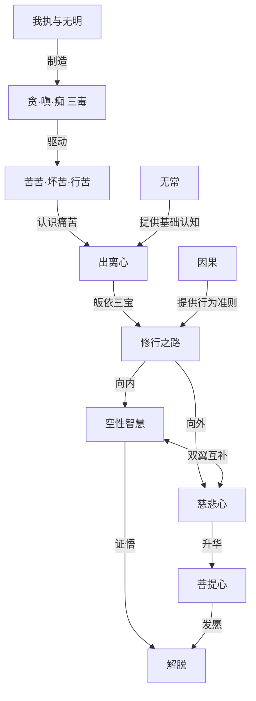
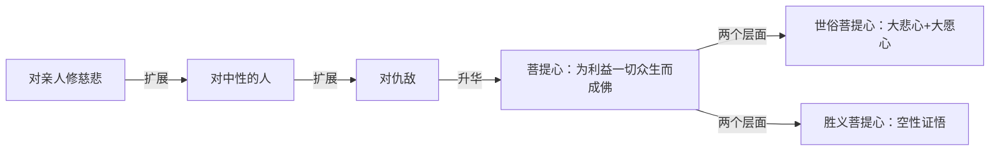

# 《次第花开》深度读书笔记

> [!abstract] 全书速览
> 这是一本关于==如何在日常生活中修行==的心灵指南。希阿荣博堪布以平实温暖的语言，将藏传佛教的核心智慧转化为现代人可以理解和践行的生活哲学。全书不是枯燥的教义阐释，而是一位真正修行者对人生苦乐、生死无常、慈悲与智慧的真诚分享。它告诉你：修行不是逃避生活，而是更清醒、更柔软、更勇敢地活着。"次第花开"这个书名本身就是一个隐喻：觉醒不是一蹴而就的顿悟，而是像花朵绽放一样，需要时间、耐心和持续的培育。

## 这本书治什么"病"

如果你常常感到焦虑、空虚、不知道活着的意义是什么；如果你在得到想要的东西后依然不满足，在失去时又痛苦不堪；如果你对人生的无常感到恐惧，对死亡避之不谈却又无法真正释怀——这本书提供了一条被无数修行者验证过的道路。

希阿荣博堪布是当代藏传佛教宁玛派最具影响力的上师之一，1963年生于四川甘孜德格县，师从法王如意宝晋美彭措，在色达喇荣五明佛学院深入修学显密教法二十余年。他的文字没有高高在上的说教，而是像一位走过这条路的人在平等地分享他看到的风景。他不会告诉你"放下执着"这类正确的废话，而是具体地讲：执着是什么，它如何产生，为什么我们总是放不下，以及如何一步一步地松动它。

> [!tip] 核心定位
> 这本书与心灵鸡汤的本质区别在于：它不给你廉价的安慰，而是直面人生的真相。痛苦是真实的，无常是必然的，但正是因为看清了这些，你才能获得真正的自由。==修行的目的不是获得什么神奇的体验，而是减少痛苦、增长智慧和慈悲。==

全书分三个部分——"珍宝人生"讨论人生的意义和修行的动机，"一切从皈依开始"讲解皈依的含义和修行的基础，"生活中的修行"将佛法落实到日常生活。

## 核心理念地图

## 核心理念

### 痛苦的真相：它不是来自外在，而是来自内心的对抗

大多数人与痛苦的关系是对抗——痛苦来了，我们想尽办法逃避、压制、转移注意力。但堪布指出，==这种对抗本身就在制造更多的痛苦==。你越是抗拒痛苦，痛苦就越是紧紧抓住你。

痛苦的最根本制造机是**我执**——我们在内心深处默认存在一个独立、恒常、需要被满足的"自我"。当外在世界不能配合这个"自我"的期待时，痛苦就产生了。堪布用了一个比喻：我们像是在做一个梦，梦中有一个"我"在经历各种悲欢离合。醒来后发现梦中的一切都不是真的，包括那个"我"。但问题是我们现在还在梦中。

> [!note] 三毒循环
> 与我执配套运作的是**三毒**：贪（对喜欢事物的过度追求）、嗔（对不喜欢事物的排斥抵抗）、痴（对事物真相的无知颠倒）。三者互相纠缠，形成自我强化的循环——你越贪求越怕失去，越怕失去越排斥变化，越排斥变化越看不清真相，越看不清真相越贪求。

堪布特别指出：==条件的改善从来没有从根本上消除过痛苦==。有钱的人担心失去钱，有伴侣的人担心失去伴侣。痛苦不是来自缺乏，而是来自执着。佛法将痛苦分为三层：

- **苦苦**：明显的痛苦——病痛、失去、挫折
- **坏苦**：快乐变质后的痛苦——升职后担心被超越，恋爱中担心被抛弃
- **行苦**：一切有为法无常变迁带来的深层不安——那种"好像哪里不对但说不上来"的微妙不安

堪布用火烫手的比喻来说明痛苦的层次：手被火烫了一下是第一层痛苦；然后你开始责怪自己、担心留疤、愤怒谁把火放在那里——这些心理活动制造了第二层、第三层痛苦。我们日常生活中的大部分痛苦，都是第二层和第三层——是我们对事件的反应和对抗，而不是事件本身。

真正的转变始于你愿意停下来，仔细观察痛苦。当你只是经历恐惧本身，而不是恐惧"恐惧会毁掉我"，痛苦会减少大半。

堪布还指出一个现代人特别容易陷入的误区：我们以为快乐和痛苦是对立的，只要消除了痛苦就自然会快乐。但佛法的洞察更深刻——==建立在执着之上的快乐，结构性地包含着不安==。你得到了想要的东西，随之而来的是怕失去的焦虑。真正的安乐不是"更多的快乐"，而是从对快乐的执着中解脱出来。

### 无常：不是诅咒，而是自由的钥匙

> [!tip] 核心洞察
> ==对确定性的追求本身就是痛苦的根源之一==，因为世界的本质是无常的——一切都在变化中，没有例外。

一切有为法都是无常的。无常有两个层面：

- **粗分无常**：可以直接观察到的变化——四季更替、生老病死、人事沧桑
- **细分无常**：更微妙的每一刹那的生灭变化——没有任何东西能保持前后一致，包括你自己

无常不是坏消息。如果一切恒常不变，那么你此刻的痛苦也将永恒不变。正因为无常，改变才是可能的。当你真正接受了"此刻的一切都会过去"这个事实，你会发现一种奇妙的轻松：不必死死抓住快乐（它会走），也不必死死对抗痛苦（它也会走）。你开始学会"经历"而非"占有"。

> [!example] 死亡无常的修行价值
> 堪布特别强调思考死亡的价值。藏族谚语说"明天和来世，不知哪个先到"。一个真正思考过死亡的人，不会活得消极，反而会活得更有滋味——因为他知道每一个平凡的瞬间都是珍贵的，没有什么是理所当然的。

### 因果：行为与结果的内在法则

因果不是外在的奖惩机制，不是有一个神在记录你的行为。因果是事物本身的规律，就像种子会发芽、火会燃烧一样自然。

> [!warning] 因果的常见误解
> 因果关系是复杂的，不是简单的一对一对应。因果的成熟需要时间和条件，不是即时反馈。"好人没好报"只是因果尚未完全成熟，不是因果不存在。

堪布强调**业**的概念——每一个身语意的行为都会在心识中留下印记，在适当条件下成熟为果报。==业力不会凭空消失，也不会错乱成熟。==

理解因果的真正意义在于主动性：过去的业力无法改变，但当下的选择是自由的。每一个当下的善念善行，都在为未来播下好的种子。对于已造恶业，可以通过真诚忏悔来减轻——认识错误、发自内心后悔、决心不再重犯、实际修持净化法门。

> [!note] 因果的实用意义
> 不要轻视小善，也不要轻视小恶。水滴虽小，终能满杯。正是日常的、微小的选择构成了你生命的走向。因果法则给修行提供了一个坚实的行为基础：你不需要成为圣人才能开始改变，只需要从此刻开始做善的选择。

### 出离心：不是逃避世界，而是看清游戏规则

> [!note] 出离心的真义
> ==真正的出离是看清轮回的本质后做出的清醒选择==。你可以继续赚钱、追求事业、享受生活，但你知道：这些不是终极答案，它们无法填满内心深处的那个空洞。出离心是一种"不再上当"的状态——你依然在世间生活，但不再被幻象欺骗。

堪布强调皈依三宝是修行的起点：
- **佛**是导师——以佛为榜样，相信自己也能觉悟
- **法**是道路——按照佛法调整身语意
- **僧**是同行者——从修行人那里获得支持和启发

真正的皈依是内心的转变：从内心深处认识到轮回的痛苦，生起出离心，相信三宝是可靠的依止。

在藏传佛教中，**上师**占据极其重要的位置。堪布指出，上师不只是知识的传授者，更是修行的引导者和榜样。选择上师需要谨慎——长时间观察言行、品格和发心后再依止。一旦选定就应生起信心，但信心不是盲从。如果上师行为明显违背佛法，保持恭敬但保持距离是合理的。

> [!example] 出离心在现代生活中的体现
> 你不需要辞职出家才算有出离心。以利益他人的心态工作，工作就是修行；以正当方式获取财富、以利益他人方式使用财富，财富就是积累功德的资具；与家人相处时培养耐心和慈悲，家庭就是修行的道场。出离的不是世间本身，而是对世间的执着。

### 修行实践：从理论到日常

堪布一再提醒：修行不是一个"知道就够了"的事情。概念上理解无常和空性还远远不够，不在日常生活中践行，这些概念就只是知识，不是智慧。

修行的基础是**持戒**——戒律不是外在束缚，而是保护心的清净的围栏。最基本的戒律是不杀生、不偷盗、不邪淫、不妄语、不饮酒。

**禅修**是核心方法：
- **止禅**：让心安静下来，最常见的方法是观察呼吸。看似简单，但你会发现心是多么散乱
- **观禅**：在心安定的基础上观察身体的无常、情绪的生灭、念头的来去
- **慈悲禅**：先对自己发出慈悲祝愿，然后扩展到亲人、中性的人、困难的人、一切众生

> [!tip] 座下修行比座上修行更重要
> 座上禅修只是一天中的一小部分时间。堪布的座下修行建议：**早晨发善愿** → **做事时保持觉知** → **烦恼生起时观察它** → **晚上回顾一天**。他特别提醒现代人注意心的保护——==有意识地减少无意义的信息摄入==，保持心的相对清净。

### 面对痛苦：转化的契机

堪布提供了一个与世俗观点截然不同的视角：==痛苦可以成为修行最强大的契机==。

- **痛苦帮助认识轮回本质**：如果生活一直顺利，很难生起出离心
- **痛苦培养慈悲心**：自己经历痛苦时，更容易理解他人的痛苦
- **痛苦消除我执**：当你痛苦时，那个看起来牢固的"自我"开始动摇

堪布介绍了**"自他交换"**修法：当痛苦来临时，想"愿我承受这个痛苦，使一切众生免于这种痛苦"。这把痛苦从一个让你缩小、封闭的力量，变成了一个让你扩大、打开的力量。

面对重大痛苦（亲人去世、严重疾病）：不要压抑，允许自己悲伤；提醒自己无常的道理——这种极度的痛苦也会过去；最重要的是不要失去对三宝的信心。

### 慈悲：从"我"到"我们"的根本转向

堪布强调，==真正的慈悲不是居高临下的施舍，而是基于"我们都在同一条船上"的平等心==。

修慈悲有**次第**：先对亲人修（已有感情基础），扩展到中性的人，最后扩展到仇敌。对仇敌生起慈悲最困难但也最有力量——仇敌之所以伤害你，是因为他们被自己的烦恼驱使，他们自己也在受苦。如果你能看到这一点，就会发现仇敌其实是值得悲悯的。

**菩提心**是慈悲的升华——发愿为利益一切众生而成就佛果：
- **世俗菩提心**：对众生的大悲心+成佛的大愿心
- **胜义菩提心**：对空性的证悟

堪布强调，对一切众生生起平等慈悲是极其困难的。但这是修行的方向，不是起点。你不需要一开始就做到完美，只需要持续朝这个方向努力。今天能对一个人多一分善意，明天就能对两个人。

> [!tip] 反直觉的发现
> 当你把注意力从自己的痛苦转向他人的痛苦时，你自己的痛苦反而会减轻。==过度的自我关注本身就是痛苦的放大器==。嗔恨伤害的首先是自己的心，慈悲滋养的也首先是自己的心。

### 空性：不是"什么都没有"，而是"什么都不是你以为的那样"

> [!abstract] 空性定义
> ==空性指的是事物没有独立、固定、不变的本质，而不是说事物不存在。==

堪布用**绳蛇比喻**说明空性：昏暗中你看到一条蛇，吓得不敢动。光线亮起来，你发现那不过是一根绳子。蛇从来不存在，但你的恐惧是真实的。同样，我们执着的"自我"和"实有世界"就像那条蛇——从来不曾以我们以为的方式存在，但我们的执着和痛苦却是真实的。

你面前的这本书存在吗？当然存在。但它不是以你以为的方式存在。它由纸张、油墨、胶水组成，纸张由纤维组成——一路追问下去，你找不到一个独立存在的、叫做"书"的实体。"书"是一个方便的标签，用来指代某些条件暂时聚合在一起的状态。同样的分析适用于你自己——你的"自我"由身体、感受、想法、记忆等暂时聚合而成，是一个不断变化的过程，而不是一个固定的实体。

**空性与缘起是一体两面**：
- 缘起：一切事物因缘和合而生 → 没有独立自存的本性 → 这就是空性
- 空性：事物没有固定本质 → 可以因缘和合而显现 → 这就是缘起

> [!tip] 空性的实用价值
> 当你知道"这段感情没有一个固定不变的本质"，失恋时你会少一些"世界末日"的感觉；当你知道"这个让你愤怒的人没有一个固定不变的本质"，你会更容易放下怨恨。当你不再执着于实有的"自我"和"世界"时，你反而能更加自在地生活。

> [!warning] 理解空性的边界
> 理解空性不是为了否定日常生活的意义，而是为了从执着中解脱。如果你的"空性理解"让你变得冷漠、觉得什么都没有意义，那说明你理解错了。对空性的证悟需要长期的**闻**（听闻教法）、**思**（反复思维）、**修**（禅定中直接体验）。

## 工具包

### 工具一：三层苦的辨识

**解决什么问题**：看清痛苦的完整面貌，而不只是最表层的那部分。

**具体怎么做**：
1. **识别苦苦**：记录明显的不适——病痛、创伤、挫折
2. **识别坏苦**：观察快乐的事情，问自己：这种快乐能持续多久？它是否同时带来了失去它的恐惧？
3. **识别行苦**：注意那种"好像哪里不对但说不上来"的微妙不安

**在什么场景下用**：感到莫名烦躁、空虚、"条件都不错但就是不快乐"的时候。

> [!example] 类比理解
> 你的房间总是进水。苦苦是那些明显的水渍。坏苦是你买了新家具后更加担心被水泡坏。行苦是你始终感到不安因为知道水还会进来。三层苦的辨识，就是让你抬头看看天花板上那个洞。

---

### 工具二：死亡冥想

**解决什么问题**：我们拖延、浪费时间、不敢做真正重要的事，很大程度上是因为假装自己有无限的时间。

**具体怎么做**：
1. 每天花3-5分钟静坐
2. 真诚思考三个事实：我一定会死；死亡时间不确定；死亡来临时只有修行的功德能帮助我
3. 想象今天是最后一天：我做的事真的重要吗？有什么话一直没说？有什么事一直在逃避？
4. 让这种意识渗透到接下来的一天中

**可能遇到的阻力**：最初会感到恐惧和不适。这恰恰说明你平时对死亡有多回避。坚持练习，恐惧会逐渐转化为清醒和对生命的珍惜。堪布提醒，思考死亡不是陷入悲观，而是让每一个平凡的瞬间都变得珍贵——因为你不再把它当作理所当然。

---

### 工具三：观察念头而非跟随念头

**解决什么问题**：被负面情绪裹挟时做出事后后悔的反应。==烦恼的力量来自你对它的认同==——你以为"我就是这个愤怒"，于是被完全控制。

**具体怎么做**：
1. 情绪升起时暂停（不是压抑，是暂停）
2. 命名情绪（"这是愤怒""这是焦虑"）
3. 观察身体感觉（胸口发紧？胃部翻涌？）
4. 保持观察30秒-1分钟，不做反应
5. 注意：情绪强度通常会自然降低

> [!example] 类比理解
> 想象你在看一部很投入的电影，跟着剧情或哭或笑。观察念头就像突然意识到"我在电影院里"——你没有关掉电影，但多了一层距离，不再完全被剧情控制。

---

### 工具四：自他交换呼吸法（tonglen）

**解决什么问题**：训练你的心从"以自我为中心"转向"以他人为中心"。这是藏传佛教中非常重要的菩提心修法。

**具体怎么做**：
1. 安静坐下，放松身体，注意呼吸
2. 想到一个正在受苦的人
3. 吸气时想象将他的痛苦吸入（观想为黑色烟雾）
4. 呼气时想象将快乐和平安送给他（观想为白色光）
5. 逐步扩展：亲人→朋友→陌生人→让你不舒服的人→一切众生
6. 每天5-15分钟

> [!warning] 关于阻力
> "我自己还在受苦，怎么有资格帮助别人？"——关心他人本身就是减轻自己痛苦最有效的方法之一。==当全部注意力放在自己的痛苦上时，痛苦会被放大；转向他人的需要时，自己的痛苦反而变小。==

---

### 工具五：动机检查

**解决什么问题**：净化行为的出发点。佛法认为，一个行为的善恶不仅取决于行为本身，更取决于做这件事时的心态。

**具体怎么做**：做重要的事之前花10秒问自己：
- 我为什么要做这件事？
- 动机是贪（想得到）、嗔（想避免）、痴（不清醒的习惯），还是真正的善意？
- 如果动机不够纯净，能否调整——除了为自己，也想想能否利益他人？

> [!note] 觉察本身就是改变的开始
> 你可能会发现大部分行为的动机都不那么"纯净"。不要自我批判，只是诚实地看见。==一个能清醒看见自己动机的人，比一个自以为动机高尚的人更有可能真正改变。==

---

### 工具六：正念锚点

**解决什么问题**：将修行融入日常生活。堪布强调==座下修行比座上修行更重要==。

**具体怎么做**：
1. 选一个每天做很多次的动作——喝水、开门、拿手机
2. 设为"正念锚点"
3. 每次做这个动作时暂停一秒，觉察身心状态
4. 不需要改变什么，只是觉察
5. 慢慢增加锚点数量

堪布的座下修行框架可作参考：**早晨发善愿** → **做事时保持觉知** → **晚上睡前回顾**。

---

### 工具七：逆境转化

**解决什么问题**：将困难和挫折转化为修行素材。堪布指出，痛苦可以成为修行的契机。

当遭遇逆境时，尝试三个层面的转化：

1. **因果层面**：接受当前处境，警醒未来行为。停止在"为什么是我"上消耗能量
2. **修行层面**：困境是修行机会。堵车练耐心，被批评练放下执着，生病体验无常
3. **菩提心层面**：愿我承受这个痛苦，使一切众生免于这种痛苦（自他交换）

> [!warning] 边界提醒
> 这不是让你合理化不公正的对待。如果正在遭受不公正或伤害，改变外部条件是合理的、必要的。逆境转化针对的是那些**你无法改变的处境**。

---

### 工具八：睡前三问

**解决什么问题**：建立日常自我审查习惯。

每天睡前三个问题：
1. 今天最感恩的一件事？（培养感恩心）
2. 今天对谁最缺乏善意？（诚实看见，忏悔的开始）
3. 明天可以做的一个小善行？（意愿转化为行动）

==修行的关键不在于方法有多"高深"，而在于是否持续。==三分钟，每天，不间断。

## 常见陷阱

> [!warning] 陷阱一：把"出离"误解为逃避
> 很多人以为出离心就是厌世。堪布明确否定：==真正的出离是在人群中保持清醒，而不是逃离人群==。你可以全身心地工作、爱、生活，同时清楚地知道这一切都是无常的，不再被它们绑架。

> [!warning] 陷阱二：把"无我"和"空性"误解为虚无
> "无我"不是说你不存在，而是说你不以你以为的方式存在。如果你的"空性理解"让你变得冷漠、无所谓，那说明你理解错了。真正理解空性的人反而更加温暖和慈悲——因为他知道执着不必要，所以能更轻盈地爱。

> [!warning] 陷阱三：把修行变成另一种自我提升项目
> 你可能把修行当成新的"成就领域"——我要修得比别人好，我要证明我很有灵性。==这种心态本身就是"我执"的又一种表现形式。==修行是去除我执，而不是用"修行者"的身份来装饰"我"。

> [!warning] 陷阱四：只修"慈悲"不修"智慧"
> 没有智慧的慈悲可能造成伤害——溺爱孩子不是慈悲。反过来，没有慈悲的"智慧"可能变成冷漠和傲慢。堪布说，==智慧和慈悲就像鸟的两只翅膀，缺了任何一只都飞不起来==。

> [!warning] 陷阱五：忽视善知识的重要性
> 修行中最大的陷阱是自欺——你的烦恼极其擅长伪装成智慧。你以为在修出离心，实际上只是逃避困难；以为在修忍辱，实际上只是压抑愤怒。堪布建议在条件允许时寻找一位合格的上师——长时间观察言行、品格和发心后再依止。

## 这本书的边界

**适合谁**：
- 感到生活空虚、迷茫，想找到更深层意义的人
- 对佛学有兴趣，想要一本既深刻又可读的入门书
- 正在经历人生困境，想找到"穿越"而非"逃避"困境的方法
- 已有修行基础，想要系统梳理修行次第的人

**不适合谁**：
- 寻找快速解决方案的人——"次第"意味着需要时间
- 不愿自己实践的人——修行必须亲自走
- 对宗教内容有强烈排斥的人

**什么情况下书中建议可能不够**：
- 严重心理健康问题（重度抑郁、焦虑障碍、PTSD）需要专业心理治疗，本书只能辅助
- 正在遭受不公正对待（暴力、虐待），首要任务是改变外部处境、保护安全
- 书中一些概念（转世、六道轮回、中阴）植根于藏传佛教世界观，可以先接受可验证的部分，暂时搁置无法验证的部分
- 空性理解如果停留在概念层面，可能产生虚无感。需要在闻思修完整过程中逐步证悟

## 21天启动计划

### 第1-3天：建立觉察的基础

- 每天早上3分钟"死亡冥想"
- 选定一个"正念锚点"（如每次喝水时）
- 晚上做"睡前三问"
- 目标：建立节奏

### 第4-7天：加入核心练习

- 继续上述三个练习
- 加入"三层苦的辨识"——每天记录一个例子
- 开始"动机检查"——重要事情前花10秒自问
- 尝试5-10分钟"自他交换呼吸法"

### 第8-14天：加入情绪工作

- 重点加入"观察念头而非跟随念头"
- 目标：至少3次"成功暂停"
- 扩大"自他交换"范围——从亲人到不太熟悉的人
- 回顾第一周记录

### 第15-21天：深化与调整

- 遭遇逆境时尝试"逆境转化"
- 观察自己是否掉入常见陷阱
- 根据体验调整：有效的加强，总忘的先降低频率
- 最后一天整体回顾：对痛苦、无常、慈悲的理解有何变化

> [!tip] 核心原则
> 堪布反复强调：==做一点点，每天做==，比做很多然后放弃强一百倍。"次第花开"——花不是一夜之间开的，但只要你持续浇水，它一定会开。

## 延伸阅读

- [[《透过佛法看世界》]] — 希阿荣博堪布：以问答形式回应现代人对佛法的常见困惑，与本书构成堪布对现代人的完整回应
- [[《西藏生死书》]] — 索甲仁波切：侧重生死观和临终关怀，与本书互补——一本讲"如何活"，一本讲"如何面对死亡"
- [[《当下的力量》]] — 埃克哈特·托利：对"活在当下"和"超越自我认同"的现代表述，没有宗教色彩。托利所说的"小我"与堪布所说的"我执"有深层呼应
- [[《正念的奇迹》]] — 一行禅师：把正念修行浓缩到最简洁的形式，适合先建立日常觉知基础再回来读堪布的完整修行次第
