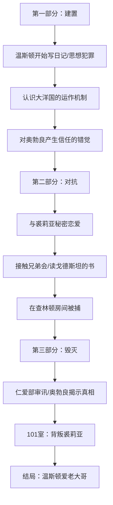
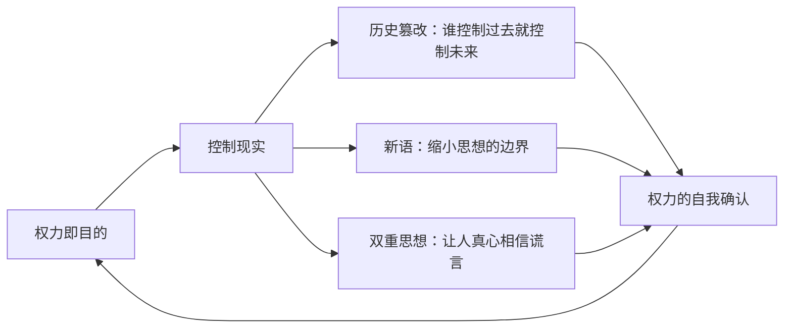

## 一、文学坐标定位

> [!abstract] 速览
> 《1984》是英国作家乔治·奥威尔（George Orwell, 1903-1950）于1948年完成、1949年出版的长篇小说，也是20世纪最具影响力的政治寓言之一。小说以虚构的超级大国「大洋国」（Oceania）为背景，讲述了外围党员温斯顿·史密斯（Winston Smith）在极权体制下试图保存个人思想、追求自由与爱情，最终被彻底碾碎的故事。

你需要理解这本书的写作语境：1948年，二战刚结束三年，纳粹德国已经覆灭，但苏联斯大林体制正在东欧迅速扩张。奥威尔本人是一位民主社会主义者——他参加过西班牙内战，在加泰罗尼亚前线亲眼目睹了斯大林主义者对左翼盟友的清洗与背叛（记录在《向加泰罗尼亚致敬》中）。这段经历彻底塑造了他对极权主义的警觉。《1984》不是预言，而是==警告==——它将已经存在的极权逻辑推演到终极形态。

在文学谱系中，《1984》与以下作品构成对话网络：

- [[《我们》]]（叶夫根尼·扎米亚京，1924）——公认的反乌托邦文学开山之作，奥威尔曾撰文评论此书，《1984》在结构上有明显借鉴
- [[《美丽新世界》]]（阿道司·赫胥黎，1932）——与《1984》形成互补：赫胥黎预见的是用快乐控制人，奥威尔预见的是用恐惧控制人
- [[《动物农场》]]（奥威尔，1945）——《1984》的前奏，以寓言形式讽刺苏联革命的蜕变
- [[《审判》]]（卡夫卡，1925）——同样书写个体在不可理喻的体制面前的无力感

《1984》出版后迅速成为冷战时期西方世界的文化标志，但奥威尔本人在去世前（1950年1月去世）曾明确声明：这本书不是对社会主义的攻击，而是对==任何形式的极权主义==的批判。这一点常被有意或无意地忽略。

---

## 二、叙事结构解析

> [!note] 三幕式结构
> 小说分为三个部分（Part），精确对应古典戏剧的三幕结构：建置（Setup）、对抗（Confrontation）、解决（Resolution）。但这里的「解决」是一种反高潮的彻底毁灭。

### 第一部分：思想犯罪的萌芽（Part One）

你跟随温斯顿进入大洋国的日常生活。他在真理部（Ministry of Truth）工作，职责是篡改历史记录——把党过去的错误预测、失势官员的存在从档案中抹去，使党「永远正确」。温斯顿开始秘密写日记，这本身就是「思想犯罪」（thoughtcrime），可以被处以死刑。

奥威尔在第一部分做了极为精密的世界观建构。你注意到他并不急于推进情节，而是用大量篇幅描写大洋国的物质匮乏（劣质杜松子酒、粗劣的烟草、永远坏掉的电梯）、语言改造（新语/Newspeak）、无处不在的监控（电幕/telescreen）、以及日常生活的窒息感。

> [!question] 苏格拉底追问
> 为什么奥威尔要花这么多笔墨描写物质生活的细节？因为极权主义的恐怖不仅仅在于政治迫害，更在于它对==日常生活肌理==的全面侵蚀。你无法逃入私人生活——因为私人生活已经不存在了。劣质的食物、衣物、住房不是管理失败的副产品，而是体制设计的一部分：让你永远处于匮乏和不适中，你就没有多余的精力去思考。

### 第二部分：爱情与反叛（Part Two）

温斯顿与裘莉亚（Julia）开始秘密恋爱。他们在郊外幽会，在商人查林顿先生（Mr. Charrington）的小楼上层租了一个没有电幕的房间。温斯顿接触到传说中的反抗组织「兄弟会」（The Brotherhood），从据称是其领导者戈德斯坦（Goldstein）的著作中读到了大洋国体制运作的真正逻辑。

> [!tip] 黄金圈拆解
> - **Why**：为什么奥威尔要在反乌托邦小说中插入一段爱情？因为在极权体制下，==性爱与亲密关系本身就是政治行为==。党要求所有的激情都指向党——对老大哥的爱、对敌人的恨。两个人之间不受控制的、纯粹的欲望和柔情，是对党的忠诚垄断的最根本威胁。
> - **How**：奥威尔刻意将裘莉亚描写为一个本能的反叛者而非理论家。她反抗不是因为读了什么禁书，而是因为她==想要快乐==。这恰恰是奥威尔最精妙的洞见之一：极权主义最深层的对手不是另一种意识形态，而是人类对快乐、自由和爱的本能渴望。
> - **What**：一段注定失败的恋情，但在失败之前，它提供了小说中唯一的温暖光亮。

### 第三部分：审讯与重塑（Part Three）

温斯顿被捕，在「仁爱部」（Ministry of Love）经历了奥勃良（O'Brien）的系统性审讯与酷刑。这一部分是全书的思想核心——奥勃良不仅要让温斯顿认罪，更要让他==真心实意地==接受党的真理，包括「2+2=5」。最终，在101室（Room 101），温斯顿面对自己最深的恐惧（老鼠），出卖了裘莉亚。小说以温斯顿坐在栗树咖啡馆、望着老大哥的画像、发现自己==真的爱老大哥了==而结束。

> [!question] 苏格拉底追问
> 奥威尔为什么选择让温斯顿彻底失败？为什么不给读者留一丝希望？因为这本书的目的不是讲一个英雄的故事，而是展示极权机器的==完整运作逻辑==。如果温斯顿成功了，读者会感到慰藉——「看，个人终究能战胜体制」。但奥威尔恰恰要剥夺你这种慰藉，迫使你直面一个令人不安的可能性：==如果极权体制足够彻底，个人反抗是不可能的==。这不是悲观主义，而是一种极致的诚实。它的言外之意是：所以你必须在极权体制建成==之前==阻止它。

---

## 三、主题与意象网络

### 主题一：权力——目的即自身

> [!tip] 黄金圈拆解
> - **Why**：奥威尔为什么要把「权力的本质」作为核心主题？因为他在西班牙内战和观察苏联的过程中，看到了一个令他震惊的事实：革命可以背叛自身，解放者可以变成压迫者，而这种蜕变的根源在于——权力不需要理由。
> - **How**：通过奥勃良在审讯室中的那段核心独白来揭示。
> - **What**：「权力不是手段，权力是目的。」（Power is not a means; it is an end.）

奥勃良对温斯顿说的那段话，是全书的思想高潮：

==「党追求权力完全是为了权力本身。我们对别人的好处没有兴趣；我们只对权力感兴趣。不是财富、奢侈、长寿或者幸福：只有权力，纯粹的权力。」==

这段话为什么重要？因为它打破了一个常见的幻觉——人们习惯性地认为独裁者追求权力是为了某种「目的」（财富、安全、意识形态理想），一旦目的达成，权力就可以被节制或交还。奥威尔说：不。在最纯粹的形态中，==权力本身就是目的==，而验证权力的方式就是==让他人受苦==。

**概念网络**：这一主题与小说中的「双重思想」（doublethink）、「新语」（Newspeak）、「历史篡改」形成互相支撑的网络——

这是一个==闭环==——权力通过控制现实来维持自身，而对现实的控制又进一步巩固权力。没有外部参照点可以打破这个循环。

---

### 主题二：语言与思想的关系——新语

> [!tip] 黄金圈拆解
> - **Why**：奥威尔为什么要发明一整套「新语」？因为他深信==语言塑造思想==。如果你从语言中删除了表达反抗概念的词汇，反抗本身就变得不可思议。
> - **How**：通过赛姆（Syme）这个人物——新语词典编纂者——来解说新语的运作原理。赛姆热情洋溢地解释如何通过缩减词汇来缩减思想的范围。
> - **What**：新语的终极目标是使「思想犯罪」在字面意义上不可能——不是因为惩罚太重，而是因为==你找不到词来思考它==。

你需要注意奥威尔在新语设计中的精妙之处。新语不是简单的审查——不是禁止你说某些话——而是从根基上改造语言结构。几个关键机制：

1. **词汇缩减**：把同义词、反义词全部消除。「好」（good）的反义词不是「坏」（bad），而是「不好」（ungood）。「非常好」变成「加好」（plusgood）或「双加好」（doubleplusgood）。这样一来，语言的细腻层次消失了，微妙的思辨也随之消失。

2. **政治词汇的抽象化**：「自由」（free）这个词在新语中保留了，但只用于「这条狗摆脱了跳蚤」这类用法，其政治含义（政治自由、思想自由）被完全删除。

3. **缩略与合并**：「英社」（Ingsoc = English Socialism）、「仁爱部」（Miniluv = Ministry of Love）——通过缩略，词汇失去了原始含义的回声，变成了纯粹的标签。

> [!question] 苏格拉底追问
> 新语在现实中有没有对应物？你仔细想想就会发现：政治术语的空心化（「人民民主专政」）、企业黑话的泛滥（「人力资源优化」= 裁员）、社交媒体上词义的快速漂移——这些都是新语逻辑的碎片化呈现。奥威尔的洞见在于：你不需要一个中央委员会来推行新语，==语言的贫化可以自发地发生==，只要人们不再警惕。

奥威尔本人在1946年的著名论文《政治与英语语言》（*Politics and the English Language*）中已经系统阐述了语言腐败与思想腐败之间的关系。《1984》中的新语是这篇论文的小说化呈现。这不是科幻设定，而是==语言学观察的极端推演==。

---

### 主题三：历史、记忆与真理

==「谁控制了过去，就控制了未来；谁控制了现在，就控制了过去。」==

这是党的核心口号之一，也是理解《1984》最关键的命题。温斯顿的工作就是实践这一命题——在真理部日复一日地篡改旧报纸、删除失势者的存在、修改经济数据，使党的每一个预言都在事后变成「正确」。

> [!tip] 黄金圈拆解
> - **Why**：为什么历史篡改如此重要？因为如果人们无法确定过去发生了什么，就无法判断现在是否在进步还是倒退，也无法想象未来可以不同于现在。==历史记忆是反抗的基础设施==。
> - **How**：通过温斯顿的日常工作来展示。他亲手实施篡改，却又本能地抵触这种行为——他记得某些事情发生过，尽管所有记录都说它没有发生。
> - **What**：在党的体制下，客观真理不存在。真理是党在任何给定时刻宣布的东西。

**文本细读**：温斯顿在小说开头记得一个关键细节——他曾经看到过一张照片，证明三个被处决的「叛徒」（琼斯、阿隆森、拉瑟福德）在他们被指控犯罪的时间实际上在纽约参加党的活动。这张照片证明了党在撒谎。但温斯顿后来把这张照片投入了「记忆洞」（memory hole）销毁了。

这个情节设计极为精妙。奥威尔不是在说「党消灭了所有证据」——他是在说，==即便有证据，个人也可能出于恐惧而亲手销毁它==。真理的消亡不仅是暴力的结果，也是怯懦的结果。

**概念网络**：「记忆洞」是全书最有力的意象之一。它是一个物理装置——办公室墙上的一个开口，不需要的文件投入其中即被焚毁。但它也是一个隐喻——集体记忆中的黑洞，吞噬一切不合时宜的事实。

---

### 主题四：监控与内化的恐惧

电幕（telescreen）是《1984》中最广为人知的意象——一种同时充当电视和摄像头的装置，安装在每一个房间中，你无法关闭它（只有内围党员可以短暂关闭），它始终在播放宣传，也始终在监视你。

但奥威尔真正要说的不是技术监控本身。他最深刻的洞见在于：==当监控足够持久，你就不再需要实际的监控了，因为人们已经学会了自我监控==。温斯顿在写日记时的恐惧、说话时的小心翼翼、甚至睡觉时都担心自己会说梦话——这些都是监控内化的表现。

> [!question] 苏格拉底追问
> 这与边沁（Jeremy Bentham）的「全景敞视监狱」（Panopticon）有什么关系？米歇尔·福柯（Michel Foucault）在[[《规训与惩罚》]]中详细分析了这一模型：当囚犯知道自己可能随时被观察，他们就会自行规训行为——不是因为真的被看到了，而是因为==可能被看到==。《1984》中的电幕正是全景敞视监狱的升级版。奥威尔比福柯早了近三十年就以文学形式呈现了这一洞见。

---

### 主题五：双重思想——矛盾的内化

==「双重思想」（doublethink）是指同时持有两个相互矛盾的信念，并且同时接受它们。==

这不是简单的伪善。伪善是知道自己在撒谎；双重思想是==真心实意地同时相信两个矛盾的命题==。你知道你在篡改历史，但你同时相信历史从未被篡改过。你知道党在撒谎，但你同时相信党永远正确。

> [!tip] 黄金圈拆解
> - **Why**：为什么奥威尔要发明「双重思想」这个概念？因为他观察到，极权体制下的忠诚者不是简单的骗子——他们具有一种==真诚的不真诚==，一种发自内心的自欺。这种心理机制比恐惧更可怕，因为它消除了内部张力，使人在矛盾中获得一种诡异的平静。
> - **How**：通过温斯顿在真理部的工作来具象化。他每天的工作就是实践双重思想——篡改记录的同时相信记录从未被篡改。
> - **What**：四个部门的名称本身就是双重思想的标本——真理部负责撒谎，和平部负责战争，仁爱部负责酷刑，富裕部负责制造匮乏。

**苏格拉底追问**：双重思想在日常生活中存在吗？你可能比你以为的更熟悉它。当一个人说「我知道吸烟有害健康」同时继续吸烟，这是轻度的双重思想。当一个社会宣称「人人平等」同时维持系统性的不平等，这是制度化的双重思想。奥威尔的贡献在于给这种普遍存在的心理机制命了名，并展示了它被==有意训练和系统利用==时的恐怖。

---

## 四、人物分析

### 温斯顿·史密斯（Winston Smith）

> [!info] 人物定位
> 温斯顿不是英雄。他是一个==普通人==——体弱、怯懦、偶尔自私，他的反叛与其说出于道德勇气，不如说出于一种无法遏制的本能不适。他无法停止思考，而在大洋国，==思考本身就是反叛==。

奥威尔给他取名「Winston Smith」是有讲究的。「Winston」指向温斯顿·丘吉尔——二战中英国抵抗精神的象征；「Smith」是英语世界最常见的姓氏——代表普通人。这个名字本身就包含一个张力：==一个以抵抗英雄命名的普通人==，暗示每个普通人都有可能成为（也有可能无法成为）抵抗者。

温斯顿的核心特质是==记忆==。在一个系统性消灭记忆的社会中，他无法忘记。他记得小时候的伦敦与现在不同，他记得某些事实被篡改过。这种记忆不是学术研究的产物，而是身体性的、本能的——就像一根刺扎在意识中，无法拔出。

**文本细读**：注意温斯顿的身体。奥威尔不断描写他的静脉曲张溃疡（varicose ulcer）——这个溃疡在他反叛时好转，在他被捕后恶化。身体成为政治状态的晴雨表。这不是偶然的：奥威尔本人在写作《1984》时正身患严重的肺结核，他在病痛中写下了一部关于身体如何被权力征用的小说。

> [!question] 苏格拉底追问
> 温斯顿为什么会信任奥勃良？小说中有足够的线索表明奥勃良可能是陷阱——温斯顿自己也知道这一点。但他选择信任，甚至可以说==需要==信任。因为在绝对孤立的环境中，人类对联结的渴望是如此强烈，以至于你宁可走进陷阱也不愿继续独自承受。这是奥威尔对人性的深刻理解：极权体制不仅利用恐惧，还==利用你对信任的渴望==来摧毁你。

---

### 裘莉亚（Julia）

裘莉亚是温斯顿的反面与补充。温斯顿从思想出发反抗——他追问历史、真理、体制的本质；裘莉亚从身体和本能出发反抗——她追求快感、自由、生活的乐趣。温斯顿读戈德斯坦的书时全神贯注，裘莉亚则在一旁睡着了。

> [!tip] 黄金圈拆解
> - **Why**：奥威尔为什么要创造一个与温斯顿如此不同的反叛者？因为他想展示反叛有两种根源——理性的和本能的——而==极权体制对两种都具有同等的敌意==。
> - **How**：裘莉亚的反叛完全是实用主义的。她在公共场合是模范党员（反性联盟成员），在私下里追求感官享受。她不在乎推翻体制，只想在体制的缝隙中活出自己。
> - **What**：裘莉亚代表了一种更普遍的人类反应——不是去理解压迫的机制，而是==绕过它==。

关键问题：裘莉亚的实用主义反叛是否比温斯顿的思想反叛更有效？从结局来看，答案是否定的——两人都被摧毁了。但奥威尔的暗示更微妙：裘莉亚式的反叛（追求快乐、拒绝苦行）可能是极权体制==更难根除==的威胁，因为它根植于人的动物本能，而不是可以被论证和反驳的理论。

---

### 奥勃良（O'Brien）

奥勃良是全书最复杂、最令人不安的人物。他是内围党员，是思想警察——这一点在第三部分揭示。但他不是一个简单的反派。他聪明、有魅力、能够理解温斯顿的思想——事实上，他比温斯顿==更深刻地理解==温斯顿在想什么。

> [!danger] 核心洞见
> 奥勃良之所以可怕，不是因为他残忍，而是因为他==真诚==。他真的相信党的哲学。他不是在执行任务——他是在布道。当他说「权力是目的本身」时，他不是在威胁温斯顿，他是在向温斯顿==揭示真理==。

这是奥威尔对「大审判官」（Grand Inquisitor）原型的现代改写。在陀思妥耶夫斯基的[[《卡拉马佐夫兄弟》]]中，大审判官对耶稣说：人类承受不了自由，我们替他们承受。奥勃良更进一步：他甚至不为自己的权力辩护——权力不需要辩护，它只需要==存在==。

奥勃良与温斯顿之间的关系有一种扭曲的亲密感。奥勃良是审讯者，但也是温斯顿遇到过的==唯一一个能够与之进行真正对话的人==。在整个小说中，温斯顿渴望的就是这样一个对话者——而当他终于找到时，那个人恰恰是要摧毁他的人。这里有一种深沉的悲剧性：==理解你的人和摧毁你的人是同一个人==。

---

### 老大哥（Big Brother）

老大哥可能存在，也可能不存在——奥勃良在审讯中拒绝回答这个问题。老大哥是==一个功能==，而非一个人。他是权力的面孔化身，是让抽象的体制变得「可爱」的装置。

你需要注意一个矛盾：老大哥这个名字暗示亲情（哥哥），而他的功能是恐惧和控制。这本身就是双重思想的体现——==被恐惧的对象同时是被爱的对象==。在小说结尾，温斯顿终于「爱上了」老大哥，这种爱不是虚假的，而是被酷刑真正植入内心的——这才是最恐怖的地方。

---

## 五、风格与语言

### 散文风格：冷峻、精确、反修辞

奥威尔的散文风格是英语文学中最具辨识度的之一。他在《政治与英语语言》中主张：好的写作应该像一块窗户玻璃——你透过它看到外面的世界，而不是注意到玻璃本身。

在《1984》中，这一原则被严格贯彻。你几乎找不到花哨的修辞、华丽的比喻或炫技的长句。语言是平实的、直接的、有时甚至是单调的——这种单调是刻意的，它==模拟了大洋国生活本身的单调==。

> [!example] 文本举例
> 小说的开头：「四月里一个晴朗而寒冷的日子，钟敲了十三下。」（It was a bright cold day in April, and the clocks were striking thirteen.）
>
> 一句话就完成了世界观的建立。「钟敲了十三下」——你立刻知道这不是你熟悉的世界。不需要长篇解释，一个细节就够了。这就是奥威尔式的经济性。

**风格对比**：与赫胥黎《美丽新世界》的讽刺机智、扎米亚京《我们》的数学化抒情相比，奥威尔的文风是最「朴素」的，但也是==最具穿透力==的。朴素不是缺乏技巧，而是技巧的最高形式——让语言消失，让意义直达读者。

### 小说中的非叙事文本

《1984》中嵌入了两段长篇非叙事文本：

1. **戈德斯坦的书**（《寡头集体主义的理论与实践》）——第二部分第九章几乎全文引用了这本「书中书」，详细阐述了大洋国的社会结构、战争逻辑和意识形态机制。

2. **新语附录**（*The Principles of Newspeak*）——置于小说结尾之后，以学术论文的形式解释新语的语法和目的。

> [!question] 苏格拉底追问
> 为什么奥威尔要在小说中嵌入这些「论文」？这是否打断了叙事节奏？的确打断了——但这是有意为之。戈德斯坦的书是温斯顿（和读者）理解大洋国体制的唯一窗口；新语附录则是一种结构性的反讽——它以==过去时态==描述新语（「Newspeak was the official language of Oceania」），暗示大洋国在未来某个时刻已经瓦解。这是奥威尔在小说最绝望的结局之外，偷偷埋下的==唯一一丝希望==。

---

## 六、文学批评多视角

### 1. 政治寓言读法

最常见的解读：《1984》是对斯大林主义苏联的讽刺。老大哥 = 斯大林，戈德斯坦 = 托洛茨基，大清洗 = 思想警察的逮捕，历史篡改 = 苏联对百科全书和照片的系统性修改。

这种读法是有根据的——奥威尔确实以苏联为蓝本——但也是==不完整的==。奥威尔自己在给美国联合汽车工人工会的信中明确说：这本书「不是对社会主义或英国工党的攻击，而是一部揭示极权主义的扭曲走向的讽刺作品」。把《1984》仅仅视为反苏宣传，是对奥威尔的简化。

### 2. 存在主义读法

从存在主义角度看，温斯顿的困境是加缪式的荒谬处境——他活在一个意义被强制规定的世界中，任何个人意义的寻求都被视为犯罪。但与加缪的西西弗斯不同，温斯顿最终==放弃了反抗==。他不是「想象西西弗斯是幸福的」，而是被迫想象老大哥是值得爱的。

这提出了一个严峻的问题：==荒谬的反抗是否有其物理极限？==加缪假设人可以在精神上拒绝屈服——但如果酷刑可以改变你的精神本身呢？奥威尔的回答比加缪更悲观也更诚实：身体有极限，意志也有极限。

### 3. 语言学/后结构主义读法

从语言学角度看，新语是「萨丕尔-沃尔夫假说」（语言决定思维）的极端实验。如果语言真的塑造了思维的边界，那么缩减语言就等于缩减了可思考的范围。

后结构主义批评家可能会进一步指出：《1984》本身就是用「老语」（Oldspeak，即标准英语）写成的——这本书的==存在本身==就是对新语的反抗。奥威尔用丰富、精确、有层次的英语散文来对抗他在小说中描绘的语言贫化。写作行为本身就是政治行为。

### 4. 心理分析读法

从弗洛伊德的角度看，101室的设计——让每个人面对自己「最深的恐惧」——是一种==精确的心理外科手术==。党不是用统一的恐惧来控制所有人，而是为每个人定制恐惧。这意味着党比你更了解你自己。

温斯顿在101室出卖裘莉亚——「让她来承受！让老鼠咬她的脸！」——这不仅是道德上的背叛，更是==自我的彻底瓦解==。在那一刻，他放弃了最后一个使他成为「他自己」的东西：对裘莉亚的爱。此后的温斯顿不再是温斯顿——他是一个壳，里面装的是党注入的内容。

### 5. 女性主义读法

裘莉亚的形象引发了女性主义批评的关注。一方面，她是小说中唯一的主要女性角色，她的反叛被框定为「本能的」「身体的」「不理论的」——这是否暗示女性无法进行系统性思考？另一方面，你也可以反过来读：==裘莉亚的身体反叛比温斯顿的思想反叛更接近人性的核心==，奥威尔是否在暗示理论（男性的领域）不如本能（女性的领域）可靠？

这个问题没有确定答案，但它值得你思考。奥威尔写作此书时是1948年，他对性别的理解不可避免地带有时代烙印。

---

## 七、跨时空共鸣

### 1. 监控资本主义时代的回响

你在21世纪阅读《1984》时，会发现电幕的隐喻已经以一种奥威尔可能未曾预料的方式实现了——不是通过国家强制安装的设备，而是通过你==自愿携带==的智能手机。雪莉·特克尔（Sherry Turkle）在《群体性孤独》中分析了这种「自愿监控」的心理基础；肖莎娜·祖博夫（Shoshana Zuboff）在[[《监控资本主义时代》]]中则系统论述了数据采集如何成为新的权力形式。

关键区别在于：奥威尔描写的是==国家极权==下的监控，而当代现实是==商业资本==驱动的监控。但底层逻辑惊人地相似：通过收集关于你的一切数据，权力机构（无论是党还是科技公司）可以比你更了解你自己，进而==预测和塑造==你的行为。

### 2. 后真相时代的回响

「另类事实」（alternative facts）——这个2017年美国政治中出现的术语，听起来就像从《1984》中直接提取的新语。当政治话语中的事实变得可选择、可替换，当「我觉得」的权重等同于「数据显示」，当社交媒体的回音室使人们生活在平行的现实中——你就会明白奥威尔的警告并未过时。

==《1984》中最具预见性的不是电幕，而是「真理的消亡」。==

奥威尔写道：「如果党可以伸手到过去，说这件或那件事情从未发生过——那肯定比仅仅是折磨或者杀人更可怕。」在一个深度伪造（deepfake）技术可以伪造任何视频、AI可以生成任何文本的时代，这段话获得了新的紧迫性。

### 3. 与当代文学的对话

《1984》的遗产渗透在无数后来的作品中：

- 玛格丽特·阿特伍德[[《使女的故事》]]——宗教极权下的女性身体控制
- 村上春树[[《1Q84》]]——书名本身就是致敬，探讨现实与虚构的边界
- 戴夫·艾格斯《圆圈》——硅谷版的老大哥
- 黑镜系列（电视剧）——多个单元直接回应了奥威尔的主题

### 4. 奥威尔与赫胥黎之争

尼尔·波兹曼（Neil Postman）在[[《娱乐至死》]]中提出了一个著名的对比：奥威尔担心的是书籍被禁，赫胥黎担心的是没有人想读书；奥威尔担心的是信息被剥夺，赫胥黎担心的是信息泛滥使人淹没；奥威尔担心的是真理被隐藏，赫胥黎担心的是真理被淹没在无关紧要的信息海洋中。

波兹曼写于1985年，他认为赫胥黎的预言更接近现实。但你如果仔细观察当代世界，会发现==两者同时在发生==——在某些社会中是奥威尔式的控制（审查、监控、宣传），在另一些社会中是赫胥黎式的控制（娱乐、消费、信息过载），而在很多社会中==两种模式叠加共存==。

---

## 八、费曼终极检验

> [!success] 用你能理解的最简单的话解释《1984》

想象你生活在一个房间里。这个房间有一个屏幕，屏幕告诉你今天是星期几、外面天气如何、你应该高兴还是难过。你知道屏幕有时候在撒谎——昨天它说今天会下雨，结果没有下，但今天它说它从未说过会下雨，而所有记录都被改成了「晴天」。

现在关键问题来了：==时间久了之后，你还能确定自己的记忆是对的吗？==

这就是《1984》的核心恐怖。不是酷刑，不是监控，不是战争——而是你无法确定什么是真的。当你连「昨天下没下雨」都不敢确认时，你怎么可能质疑更大的事情？

奥威尔在说：保护真理的能力——确认「2+2=4」的能力、记住「昨天确实下了雨」的能力——是自由的最底层基础设施。一旦这个基础被瓦解，其他一切（民主、法治、人权）都会跟着倒塌。

所以《1984》不是在说一个遥远的反乌托邦。它是在问你一个此刻的问题：==你现在确定的那些事实，你确定它们是真的吗？你凭什么确定？==

---

## 延伸阅读

> [!book] 理解《1984》的必要阅读网络

**奥威尔其他作品**：
- [[《动物农场》]] — 权力腐蚀的寓言，《1984》的前奏
- 《向加泰罗尼亚致敬》 — 奥威尔西班牙内战亲历记，理解他政治立场的关键
- 《政治与英语语言》 — 理解新语的理论基础
- 《我为什么写作》 — 奥威尔对自身创作动机的剖析

**反乌托邦谱系**：
- [[《我们》]]（扎米亚京） — 反乌托邦文学的源头
- [[《美丽新世界》]]（赫胥黎） — 快乐作为控制手段的预言
- [[《使女的故事》]]（阿特伍德） — 宗教极权与身体政治
- [[《华氏451度》]]（布拉德伯里） — 焚书与记忆的抵抗

**思想延伸**：
- [[《娱乐至死》]]（波兹曼） — 奥威尔vs赫胥黎的经典辨析
- [[《极权主义的起源》]]（汉娜·阿伦特） — 极权主义的政治哲学分析
- [[《规训与惩罚》]]（福柯） — 监控、规训与权力的微观物理学
- [[《监控资本主义时代》]]（祖博夫） — 数据时代的新型权力
- 《论自由》（约翰·斯图尔特·密尔） — 思想自由的经典辩护
- 《公开的秘密》（迈克尔·陶西格） — 「每个人都知道但没人说」的权力机制

**传记与研究**：
- 《奥威尔：一部人生》（D.J.泰勒） — 奥威尔的权威传记
- 《奥威尔的胜利》（克里斯托弗·希钦斯） — 希钦斯对奥威尔遗产的评述

---

> [!quote] 收束
> 「在谎言遍地的时代，说出真话就是革命行为。」
> — 乔治·奥威尔
>
> 你读完《1984》之后，最重要的不是记住大洋国的设定或温斯顿的命运，而是带着一种==持久的警觉==回到你自己的生活中：注意语言是否在被简化，注意历史是否在被改写，注意你是否已经习惯了被监视，注意你是否已经开始==自愿地==进行双重思想。奥威尔写的不是过去，也不仅仅是未来——他写的是==每一个当下的可能性==。
