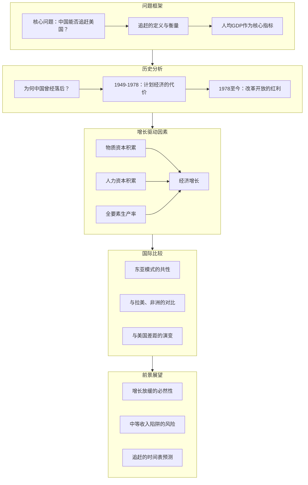
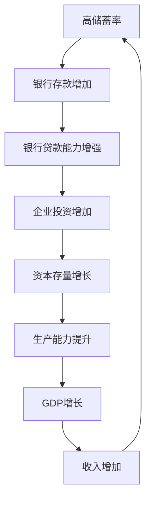
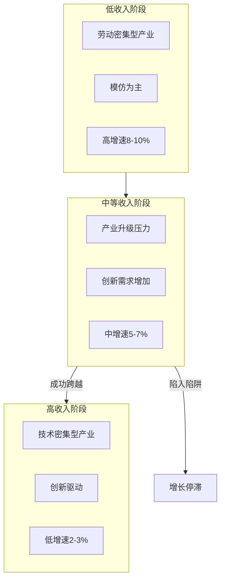
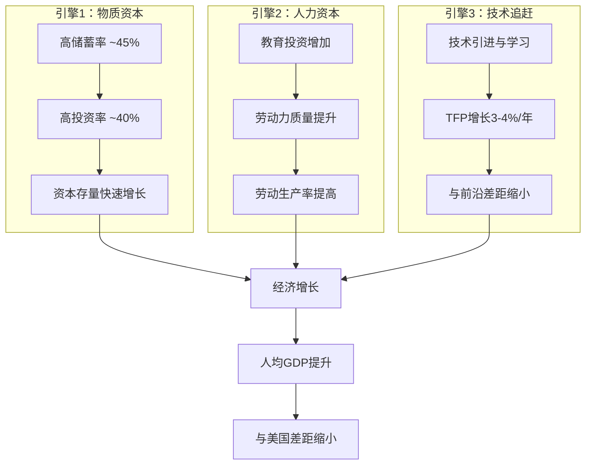

# 《Catching Up to America》深度拆解

## 一、元信息/坐标定位

### 作者背景
**朱天（Tian Zhu）**是中欧国际工商学院经济学与金融学教授，密歇根大学经济学博士。本书是他关于中国经济增长研究的英文学术著作，面向国际学术界和政策研究者，系统阐述了中国经济追赶美国的逻辑与前景。

### 学科定位
本书处于==发展经济学与比较经济学的交叉地带==。与其中文著作《中国式增长》相比，本书更强调学术严谨性和国际比较视角，特别是将中国的发展路径置于"追赶美国"这一明确的参照框架中进行分析。

### 写作动机
国际学术界和政策界对中国经济的理解存在大量误区和偏见。朱天教授希望通过严谨的数据分析和经济学逻辑，向英语世界的读者解释：==中国经济增长的真实机制是什么，以及这种增长模式的可持续性如何==。

### 目标读者
- 国际学术界的经济学研究者
- 关注中国经济的国际投资者和分析师
- 制定对华政策的政府官员
- 对发展经济学感兴趣的MBA学员

> [!abstract] 一句话定位
> 这是一本用==严谨经济学分析解释中国如何追赶美国==的学术著作，既回应国际社会的误解，也为理解中国经济前景提供分析框架。

---

## 二、全书逻辑地图

本书采用==问题导向的分析结构==：

1. **问题界定**：明确"追赶"的含义和衡量标准
2. **历史回顾**：解释中国为何曾经落后以及如何开始追赶
3. **机制分析**：识别驱动追赶的核心经济因素
4. **国际比较**：将中国置于全球发展模式的谱系中
5. **前景预判**：分析追赶的可持续性和时间框架

---

## 三、核心主题/逐章深度拆解

### 第一章：The Catching-Up Question

#### 核心论点
"追赶美国"是理解中国经济发展的核心框架。==中国的目标不仅是高速增长，而是缩小与发达国家（特别是美国）的差距==。

#### DIKW四层提炼
| 层次 | 内容 |
|------|------|
| **Data（数据）** | 1980年中国人均GDP约为美国的2%，2020年约为17% |
| **Information（信息）** | 40年间差距缩小了约15个百分点 |
| **Knowledge（知识）** | 追赶速度取决于相对增长率差异的持续性 |
| **Wisdom（智慧）** | ==追赶是一场马拉松，而非短跑；持续性比爆发力更重要== |

#### 费曼式解读
想象一场赛跑。美国从起跑线出发已经跑了200年，中国才刚刚认真开始跑40年。中国能追上美国吗？

要回答这个问题，你需要知道两件事：
1. 目前的差距有多大？
2. 中国的速度比美国快多少？

朱天教授的分析显示：差距仍然很大（中国人均GDP只有美国的约1/6），但追赶速度也很可观（中国增速长期比美国快5-6个百分点）。按这个速度，完全追赶需要几十年。

> [!note] 追赶的数学
> 假设美国年均增长2%，中国年均增长6%，差距为4%。
> 如果中国人均GDP是美国的20%，追赶到80%需要约35年。
> 但随着追赶，中国增速会下降（后发优势减少），实际时间会更长。

#### 关键概念
- **收敛（Convergence）**：落后国家向发达国家靠拢的过程
- **条件收敛（Conditional Convergence）**：只有满足特定条件的国家才能实现收敛
- **追赶（Catching Up）**：缩小与技术前沿国家差距的动态过程

---

### 第二章：Why Was China Poor?

#### 核心论点
中国在1949-1978年间的贫困不是历史宿命，而是==政策选择的结果==。计划经济体制严重压抑了经济效率和增长潜力。

#### DIKW四层提炼
| 层次 | 内容 |
|------|------|
| **Data** | 1952-1978年，中国人均GDP年均增长约2.3%，远低于同期日本、韩国、台湾 |
| **Information** | 同样的文化背景，不同的制度选择，导致截然不同的发展结果 |
| **Knowledge** | 计划经济的核心问题：信息问题和激励问题 |
| **Wisdom** | ==制度是发展的根本，"好的政策"比"好的资源"更重要== |

#### 费曼式解读
1949年时，中国、韩国、台湾的起点差不多——都是贫穷的农业经济体。30年后，韩国和台湾已经成为中等收入经济体，而中国仍然是世界上最贫穷的国家之一。

发生了什么？==制度的差异==。

韩国和台湾选择了市场经济道路（尽管有政府干预），而中国选择了计划经济。计划经济有两个根本问题：

1. **信息问题**：中央计划者不可能知道每个人需要什么、每个工厂能生产什么
2. **激励问题**：当努力工作不能带来更多回报时，人们为什么要努力？

> [!warning] 反思"中国特殊论"
> 有人认为中国的贫困是因为人口多、资源少、起点低。但同期其他东亚经济体的成功表明，==这些不是决定性因素==。制度选择才是关键。

#### 关键概念
- **计划经济（Planned Economy）**：政府而非市场决定资源配置
- **激励兼容（Incentive Compatibility）**：制度设计需要让个人利益与社会利益一致
- **制度经济学（Institutional Economics）**：研究制度如何影响经济绩效

---

### 第三章：The Savings Engine

#### 核心论点
==超高的储蓄率是中国经济增长的第一引擎==。中国的国民储蓄率长期保持在40-50%，是世界平均水平的两倍以上，为高投资率提供了国内资金来源。

#### DIKW四层提炼
| 层次 | 内容 |
|------|------|
| **Data** | 中国储蓄率约45-50%，美国约15-20%，世界平均约25% |
| **Information** | 高储蓄→高投资→高资本积累→高增长 |
| **Knowledge** | 储蓄率差异可解释相当部分的跨国增长率差异 |
| **Wisdom** | ==储蓄是对未来的投资；高储蓄率反映了社会对未来的重视== |

#### 费曼式解读
经济增长最基本的来源是什么？==积累更多的资本==——建更多的工厂、修更多的道路、买更多的机器。

资本从哪里来？只有两个来源：
1. **国内储蓄**：自己攒的钱
2. **外国借款**：借别人的钱

中国主要依靠第一条路。中国人的储蓄率高得惊人——收入的近一半被存起来而非消费。这笔钱变成了投资，投资变成了工厂和道路，工厂和道路创造了更多的产出。

> [!tip] 为什么中国人储蓄率这么高？
>
> 多种因素共同作用：
> - **文化传统**：儒家文化强调节俭和为子女积累
> - **社会保障不完善**：需要为养老、医疗、教育自我储蓄
> - **房价压力**：需要为购房储蓄
> - **人口结构**：劳动年龄人口比例高（抚养负担轻）
> - **收入增长快**：消费习惯跟不上收入增长

#### 关键概念
- **国民储蓄率（National Savings Rate）**：储蓄占GDP的比例
- **资本深化（Capital Deepening）**：人均资本存量的增加
- **黄金法则（Golden Rule）**：使稳态消费最大化的最优储蓄率

---

### 第四章：Human Capital Accumulation

#### 核心论点
==人力资本的快速积累是中国追赶的第二引擎==。中国在教育上的投入带来了劳动力质量的大幅提升，这是理解中国"人口红利"真正内涵的关键。

#### DIKW四层提炼
| 层次 | 内容 |
|------|------|
| **Data** | 中国高等教育入学率从1990年的3%上升到2020年的超过50% |
| **Information** | 劳动力的平均受教育年限在40年间翻了一倍多 |
| **Knowledge** | 人力资本回报率在发展中国家通常高于物质资本 |
| **Wisdom** | ==教育是最确定的投资，人力资本是唯一不会折旧的资本== |

#### 费曼式解读
"人口红利"这个词被严重误解了。很多人以为人口红利就是"人多"——但非洲人更多，为什么没有高速发展？

真正的红利不是"人多"，而是"人的质量提升"。==人力资本才是关键==。

什么是人力资本？就是工人头脑里的知识和技能。一个受过12年教育的工人比只受过6年教育的工人生产效率高得多——不是高一点点，而是可能高好几倍。

中国做了什么？大规模投资教育。
- 普及九年义务教育
- 大学扩招
- 职业培训
- 海外留学

结果是：==同样数量的工人，现在能创造更多价值==。

> [!abstract] 人力资本的乘数效应
> 人力资本不仅直接提高劳动生产率，还有以下间接效应：
> 1. **技术吸收能力**：受教育程度高的工人更容易学习新技术
> 2. **创新能力**：人力资本是创新的基础
> 3. **组织效率**：高素质管理人员提升企业效率
> 4. **正外部性**：高人力资本环境有利于知识溢出

#### 关键概念
- **人力资本（Human Capital）**：劳动者所拥有的知识、技能和健康
- **明瑟回报率（Mincer Returns）**：多受一年教育带来的收入增长率
- **教育溢价（Education Premium）**：高学历相对于低学历的工资差距

---

### 第五章：Technological Catching Up

#### 核心论点
作为后发国家，中国能够通过==技术引进、学习和模仿==来实现快速追赶。这种"后发优势"是中国TFP高速增长的主要来源。

#### DIKW四层提炼
| 层次 | 内容 |
|------|------|
| **Data** | 中国TFP年均增长约3-4%，远高于发达国家的1-2% |
| **Information** | 技术差距越大，追赶空间越大 |
| **Knowledge** | 技术进步的两条路径：创新（前沿推进）vs 模仿（追赶） |
| **Wisdom** | ==追赶阶段，模仿比创新更划算；但接近前沿时，必须转向创新== |

#### 费曼式解读
假设你要从北京去上海，有两种方式：
1. 自己发明一种新的交通工具
2. 坐别人已经发明好的高铁

哪种更快？当然是后者。

这就是技术追赶的逻辑。发达国家已经发明了大量成熟技术——汽车、电脑、手机、互联网。中国作为后来者，可以直接学习和使用这些技术，而不需要自己从头发明。

这比自主创新：
- **更快**：不需要漫长的研发过程
- **更便宜**：不需要承担研发失败的风险
- **更确定**：已经被验证有效

> [!warning] 追赶的终点
> 但后发优势有一个重要限制：==它会随着追赶而消失==。
>
> 当你越来越接近技术前沿，可以学习的东西就越来越少。到某个点上，你必须开始自己创新——这比模仿难得多、贵得多、不确定性也大得多。
>
> 这就是为什么增长放缓是必然的：==不是因为中国做错了什么，而是因为追赶效应正在减弱==。

#### 关键概念
- **全要素生产率（TFP）**：产出增长中不能被资本和劳动增长解释的部分
- **后发优势（Latecomer Advantage）**：落后国家通过学习领先国家技术获得的追赶机会
- **技术前沿（Technology Frontier）**：当前最先进的技术水平

---

### 第六章：The East Asian Pattern

#### 核心论点
==中国的高增长不是孤立现象，而是东亚发展模式的一部分==。日本、韩国、台湾、新加坡都经历过类似的追赶过程，共同的文化和制度特征是重要的解释因素。

#### DIKW四层提炼
| 层次 | 内容 |
|------|------|
| **Data** | 所有东亚经济体的储蓄率都高于世界平均10-20个百分点 |
| **Information** | 高储蓄→高投资→高增长是东亚共同的增长公式 |
| **Knowledge** | 儒家文化特征（重视教育、勤劳节俭、延迟满足）有利于经济发展 |
| **Wisdom** | ==文化不是决定论，但它影响集体行为的倾向== |

#### 费曼式解读
如果中国的成功只是运气或特殊政策的结果，那就很难复制或预测。但如果它是一种"模式"的体现，那就有更强的规律性。

事实上，东亚经济体呈现出惊人的相似性：
- **日本**：1950-1970年代高速增长
- **韩国**：1960-1990年代高速增长
- **台湾**：1960-1990年代高速增长
- **新加坡**：1965年至今持续增长
- **中国大陆**：1978年至今高速增长

这些经济体有什么共同点？
1. **超高储蓄率**
2. **重视教育**
3. **出口导向
4. **政府干预但保护市场机制**
5. **儒家文化背景**

> [!note] 儒家文化与经济发展
> | 文化特征 | 经济含义 |
> |----------|----------|
> | 重视教育 | 高人力资本投资 |
> | 勤劳节俭 | 高储蓄率、高劳动投入 |
> | 延迟满足 | 长期导向、愿意牺牲当前消费 |
> | 家庭责任 | 代际财富积累 |
> | 尊重权威 | 社会稳定、政策执行力 |

#### 关键概念
- **东亚模式（East Asian Model）**：高储蓄、高投资、出口导向、政府干预的发展模式
- **发展型国家（Developmental State）**：政府积极引导经济发展的国家类型
- **儒家资本主义（Confucian Capitalism）**：融合儒家价值观与市场经济的发展模式

---

### 第七章：Prospects for Continued Catching Up

#### 核心论点
中国的追赶将会继续，但==增速会逐渐放缓==。这不是失败，而是追赶规律的自然体现。关键挑战是避免"中等收入陷阱"。

#### DIKW四层提炼
| 层次 | 内容 |
|------|------|
| **Data** | 中国GDP增速已从2000年代的10%以上降至2020年代的5-6% |
| **Information** | 增速放缓的主因是：人口老龄化、资本边际回报递减、后发优势减弱 |
| **Knowledge** | 成功跨越中等收入陷阱需要：产业升级、创新驱动、制度改革 |
| **Wisdom** | ==追赶放缓是正常的，关键是保持持续追赶的能力== |

#### 费曼式解读
想象追赶是爬山。山脚下的时候，坡度平缓，你可以跑着上。但越往上爬，坡度越陡，你的速度自然会慢下来。

中国正在经历这个过程：
- **1980年代**：起点极低，增长空间巨大，年均增长9%以上
- **2000年代**：仍有大量追赶空间，年均增长10%左右
- **2020年代**：已经是中等收入国家，年均增长5-6%
- **未来**：随着接近高收入国家，增速可能进一步降至3-4%

> [!warning] 中等收入陷阱
> "中等收入陷阱"是指一个国家进入中等收入后，既无法与低收入国家在劳动密集型产业竞争（因为工资上涨），又无法与高收入国家在技术密集型产业竞争（因为创新能力不足），导致增长停滞。
>
> 拉丁美洲多数国家都陷入了这个陷阱。东亚的日本、韩国成功跨越了。==中国能否跨越，是未来20年的核心问题==。

#### 关键概念
- **中等收入陷阱（Middle-Income Trap）**：中等收入国家增长停滞的现象
- **产业升级（Industrial Upgrading）**：从低附加值产业向高附加值产业转型
- **创新驱动（Innovation-Driven Growth）**：依靠技术创新而非要素投入驱动的增长

---

## 四、核心框架提炼

### 框架一：追赶的三引擎模型

### 框架二：追赶阶段论

| 阶段 | 人均GDP（PPP，美国=100） | 增长特征 | 主要驱动力 |
|------|------------------------|----------|----------|
| 起飞期 | 5-10% | 超高速（8-10%） | 资本积累、基础教育、技术引进 |
| 追赶期 | 10-30% | 高速（6-8%） | 产业升级、高等教育、技术消化 |
| 转型期 | 30-50% | 中速（4-6%） | 创新初步发力、服务业发展 |
| 收敛期 | 50-80% | 中低速（2-4%） | 自主创新、制度优化 |
| 成熟期 | 80%+ | 低速（1-2%） | 前沿创新、生产率提升 |

中国目前处于==追赶期向转型期过渡的阶段==。

### 框架三：追赶成功的条件

| 条件 | 中国表现 | 评估 |
|------|----------|------|
| 高储蓄率 | 45-50% | 强 |
| 人力资本积累 | 快速提升 | 强 |
| 开放与学习 | 积极融入全球 | 强 |
| 市场机制 | 混合经济 | 中 |
| 制度质量 | 有待提升 | 中 |
| 创新能力 | 快速进步 | 中 |

---

## 五、批判性思考

### 本书的优势

1. **国际视角**：将中国置于全球发展比较框架中，而非孤立看待
2. **数据驱动**：每个论点都有定量数据支持
3. **学术严谨**：符合经济学的分析范式，便于与国际学术界对话

### 本书的局限

1. **制度分析相对薄弱**：对政治经济学因素的分析不够深入
2. **风险讨论不足**：对可能阻碍追赶的风险因素（如地缘政治）分析有限
3. **预测的不确定性**：长期经济预测存在固有的不确定性

### 与其他观点的对话

| 话题 | 本书观点 | 替代观点 | 我的思考 |
|------|----------|----------|----------|
| 追赶前景 | 持续追赶是可能的 | 制度瓶颈可能阻碍追赶 | 制度改革是关键变量 |
| 增长模式 | 投资驱动有其合理性 | 应更快转向消费驱动 | 两者并非对立，而是动态演进 |
| 政府角色 | 政府干预有其积极作用 | 市场应发挥更大作用 | 关键是政府干预的类型和边界 |

> [!warning] 批判性阅读提醒
> 经济预测存在根本性的不确定性。本书的分析框架是有价值的，但具体的时间表预测应谨慎对待。==框架比预测更重要==。

---

## 六、行动清单

### 对研究者的启示

- [ ] **采用比较视角**：将中国置于东亚模式和全球发展比较中理解
- [ ] **关注三个引擎**：分析资本、人力资本、TFP各自的贡献
- [ ] **区分阶段特征**：不同发展阶段有不同的增长动力和政策需求

### 对投资者的启示

- [ ] **接受增速放缓**：这是规律，而非危机
- [ ] **关注转型机遇**：产业升级和创新领域有长期机会
- [ ] **评估陷阱风险**：关注中国能否成功跨越中等收入陷阱

### 对政策研究者的启示

- [ ] **重视人力资本**：教育投资是长期竞争力的基础
- [ ] **推动制度改革**：高收入阶段需要更好的制度
- [ ] **培育创新能力**：为后发优势消失后做准备

---

## 七、延伸阅读路线图

### 作者其他著作

1. [[《中国式增长》- 朱天]] - 本书的中文姊妹篇，面向中国读者

### 发展经济学经典

1. [[《国家为什么会失败》- 阿西莫格鲁、罗宾逊]] - 制度决定论的代表作
2. [[《亚洲的崛起》- 乔·斯塔威尔]] - 东亚发展模式的深入分析

### 中国经济研究

1. [[《中国经济增长的逻辑》- 林毅夫]] - 新结构经济学视角
2. [[《伟大的中国经济转型》- 勃兰特、罗斯基]] - 全面的学术研究

---

## 八、费曼终极检验

### 如果要向一个完全不懂经济学的人解释这本书，我会说：

"中国能追上美国吗？这本书试图回答这个问题。

首先，什么是'追上'？不是指GDP总量（那已经追得很近了），而是==人均生活水平==。按这个标准，中国人均收入只有美国的约六分之一，差距还很大。

中国靠什么追赶？三样东西：

**第一，存钱**。中国人把收入的近一半存起来，这些钱变成了工厂、道路、机器。

**第二，读书**。中国大规模投资教育，工人的技能和知识大幅提升。

**第三，学习**。发达国家已经有很多成熟技术，中国可以直接学习，不用自己从头发明。

但追赶会越来越慢，因为：
- 存钱能建的工厂是有限的
- 可以学习的技术越来越少
- 人口在老龄化

==增速放缓是正常的==，关键是能不能持续追赶。如果能保持比美国快3-4个百分点的增速，几十年后就能接近美国的水平。但这需要成功转型——从'模仿'转向'创新'，从'汗水'转向'智慧'。"

### 我能用这些知识做什么？

1. **评估中国经济时**：用三引擎框架分析，而非简单看GDP数字
2. **理解增速放缓时**：区分"追赶规律"和"增长失败"
3. **预判未来时**：关注中国能否成功跨越中等收入陷阱

> [!abstract] 本书精华一句话
> ==中国正在追赶美国，动力来自高储蓄、人力资本和技术学习；追赶会继续但会放缓；成功的关键是从模仿转向创新==。
