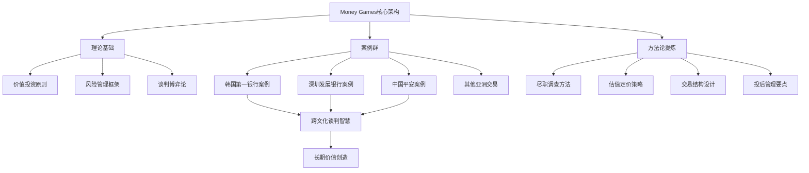
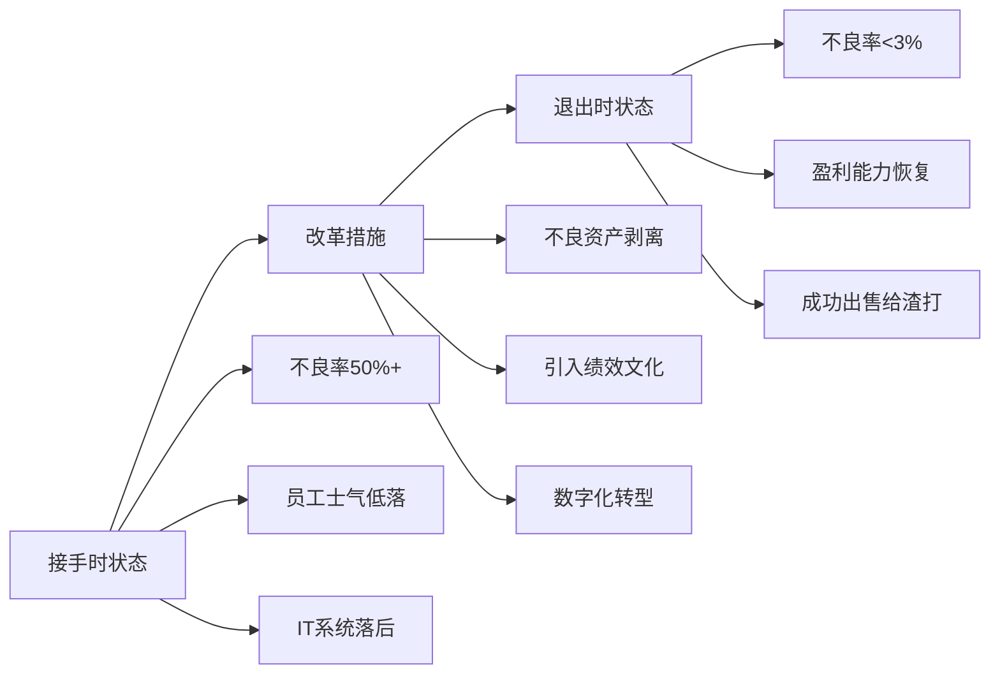
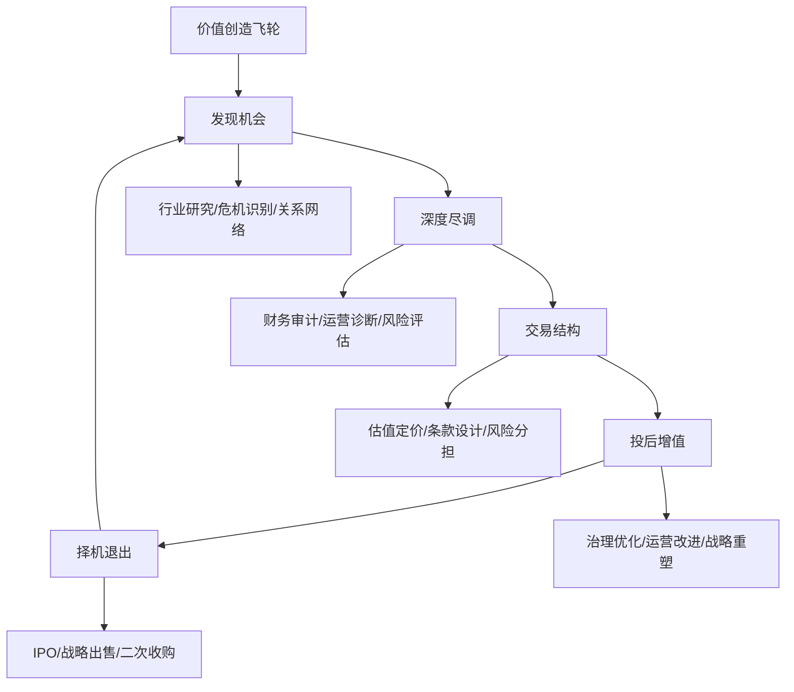

# 《Money Games》深度读书笔记

## 一、元信息/坐标定位

### 作者背景

==单伟建（Weijian Shan）==是全球私募股权投资领域的顶级人物，现任太盟投资集团（PAG）执行董事长。他的人生轨迹本身就是一部传奇：文革期间在戈壁滩劳动六年，后考入北京对外经贸大学，获加州大学伯克利分校MBA和博士学位，曾任沃顿商学院教授，后转战华尔街，先后任职摩根大通和新桥资本（Newbridge Capital）。

### 写作背景

本书写于2020年，记录了作者在亚洲私募股权投资领域二十余年的实战经验。彼时全球私募股权行业管理资产已超过4万亿美元，但关于交易实操内幕的一手资料极为稀缺。

### 学科定位

本书处于==金融学、管理学与商业实战的交叉地带==，是极少数由顶级从业者亲笔撰写的私募股权投资实录。相比学术著作如《门口的野蛮人》侧重叙事，本书更强调交易逻辑与谈判策略的系统性呈现。

### 核心贡献

> [!abstract] 本书独特价值
> 1. 首次系统披露亚洲大型私募股权交易的完整内幕
> 2. 提供了"从尽职调查到交割"的全流程方法论
> 3. 揭示了跨文化商业谈判的深层博弈逻辑

与[[门口的野蛮人]]聚焦单一交易不同，本书涵盖韩国第一银行、深圳发展银行、中国平安等多个里程碑式案例，构建了完整的交易图谱。

---

## 二、全书逻辑地图

本书的叙事逻辑遵循==「案例驱动、理论穿插、方法提炼」==的三层结构：

**第一层（表层）**：以时间为轴，讲述作者参与的重大交易故事，情节跌宕起伏，极具可读性。

**第二层（中层）**：在每个案例中嵌入投资分析框架、谈判策略、风险评估等专业内容，让读者理解"为什么这样做"。

**第三层（深层）**：贯穿全书的是作者对资本、价值与人性的哲学思考，以及跨文化商业环境中的生存智慧。

全书可划分为四大板块：
1. **入门与觉醒**（1-2章）：从学者到投资人的转型
2. **韩国战场**（3-6章）：第一银行收购的完整复盘
3. **中国征途**（7-12章）：深发展、平安等中国交易
4. **智慧结晶**（13-15章）：方法论总结与反思

---

## 三、核心主题/逐章深度拆解

### 第一板块：身份转换——从学者到交易者

#### 核心洞见

> [!tip] 关键转变
> 学术研究追求"正确"，而投资实战追求"赚钱"。二者的思维模式存在根本差异。

单伟建在沃顿商学院任教期间，研究的是"应该怎样"；而进入投资界后，他必须面对"实际如何"。这一转变带来三个认知升级：

1. **从完美主义到概率思维**：学术论文要求逻辑自洽，但投资决策永远在不完全信息下进行。作者学会了"用60%的信息做100%的决定"。

2. **从旁观分析到亲身博弈**：教授点评案例时置身事外，而交易者必须承担真金白银的后果。这要求将分析能力转化为行动能力。

3. **从单一学科到跨界整合**：成功的私募投资需要整合金融、法律、政治、心理学、跨文化沟通等多领域知识。

#### 方法论要点

==「T型能力结构」==——垂直深度在金融分析，水平广度跨越法律、政治、文化等领域。

### 第二板块：韩国第一银行——私募股权的教科书级案例

#### 背景设定

1997年亚洲金融危机后，韩国银行系统濒临崩溃。韩国第一银行（Korea First Bank）不良贷款率高达50%以上，政府被迫寻求外资救援。这为新桥资本提供了历史性机遇。

#### 交易解构

> [!note] 交易关键数据
> - 交易时间：1999年签约，2000年交割
> - 交易金额：约5亿美元
> - 股权比例：51%控股权
> - 持有期：约5年
> - 退出回报：约10亿美元收益

**阶段一：机会识别（1998年）**

作者敏锐捕捉到亚洲金融危机创造的"错位定价"机会。韩国政府急需外资背书以恢复国际信心，愿意以大幅折扣出售银行资产。关键洞见：==危机是价值投资者的朋友==。

**阶段二：尽职调查（1998-1999年）**

> [!warning] 核心挑战
> 不良贷款的真实规模远超官方披露数据，如何在信息高度不对称的情况下做出估值判断？

作者团队采用"分层抽样+压力测试"方法：
- 将贷款组合按行业、规模、抵押品类型分层
- 对每层随机抽取样本进行深度审查
- 基于样本推算总体不良率
- 设置多个压力情景测试估值敏感性

**阶段三：交易谈判（1999年）**

这是全书最精彩的部分。谈判持续超过一年，涉及韩国政府、工会、媒体、国际债权人等多方博弈。

==关键谈判策略==：

1. **分离利益与立场**：韩国政府表面立场是"不能让外国人控制银行"，但深层利益是"尽快稳定金融系统"。作者团队始终聚焦后者。

2. **创造共同利益**：提出"看跌期权"结构——政府为未来可能暴露的不良贷款提供担保，换取新桥即刻注资。双方风险共担。

3. **管理舆论环境**：主动与韩国媒体沟通，将新桥定位为"帮助韩国重建"的合作伙伴，而非"趁火打劫"的秃鹫。

**阶段四：投后管理（2000-2004年）**

> [!tip] 投后管理核心原则
> "我们不是来剥削的，是来创造价值的。只有企业真正变好，我们才能赚钱。"

### 第三板块：深圳发展银行——中国金融改革的里程碑

#### 交易背景

2004年，深圳发展银行是中国第一家上市股份制银行，但因历史包袱陷入困境。新桥通过复杂的交易结构获得控股权，成为==首个控股中国银行的外资私募基金==。

#### 核心挑战

> [!warning] 中国市场特殊性
> 1. 监管环境不确定性极高
> 2. 国有股东利益诉求复杂
> 3. 舆论对"外资控制银行"高度敏感
> 4. 银行内部利益格局固化

#### 解决方案

**结构创新**：通过"战略投资+管理权"组合，在不直接触碰"外资控股"红线的情况下获得实质控制权。

**文化融合**：作者亲自担任董事长，组建中外混合管理团队。关键策略是==尊重中方管理层的专业能力，同时引入国际最佳实践==。

**风险化解**：投入大量时间与监管层沟通，建立信任关系。作者的中国背景成为重要资产。

#### 价值创造路径

1. **资产质量改善**：清理历史不良贷款，建立现代风控体系
2. **业务模式升级**：从传统存贷业务向综合金融服务转型
3. **治理结构优化**：引入国际标准的董事会运作机制
4. **人才梯队建设**：培养本土化国际视野管理人才

最终，深发展与中国平安合并，新桥获得丰厚回报。

### 第四板块：中国平安——战略眼光的胜利

#### 投资逻辑

2002年，新桥以约1.5亿美元投资中国平安，获得约6%股权。当时平安还是一家以寿险为主的区域性公司。

> [!abstract] 投资论点
> 1. 中国保险渗透率极低，增长空间巨大
> 2. 平安管理团队具有企业家精神
> 3. 估值相对国际同业大幅折让
> 4. 金融牌照具有稀缺价值

#### 关键决策

**选择增持而非早期退出**：平安上市后股价上涨，多数投资者会选择获利了结。但作者团队判断平安的成长故事才刚开始，选择持有并增持。

这一决策背后是对==中国经济长期增长的信念==以及对==平安管理层执行力的信任==。

#### 投资结果

持有期间平安从区域保险公司成长为综合金融集团，股价增长超过20倍。这成为私募股权投资史上最成功的案例之一。

### 跨文化谈判的深层智慧

贯穿全书的是作者在东西方文化间穿梭的独特视角。

> [!tip] 跨文化谈判原则
> 1. **理解"面子"的经济价值**：在亚洲，让对方有台阶下，往往比价格让步更有效
> 2. **区分正式立场与真实意图**：亚洲谈判者常通过非正式渠道传递关键信息
> 3. **建立长期关系网络**：单次交易思维在亚洲行不通，信任需要时间积累
> 4. **尊重当地制度逻辑**：不要试图用西方模式改造一切

---

## 四、核心框架提炼

### 框架一：私募股权价值创造飞轮

### 框架二：交易成功的六维度评估模型

| 维度 | 韩国第一银行 | 深发展 | 中国平安 |
|------|-------------|--------|----------|
| 进入时机 | ★★★★★ | ★★★★☆ | ★★★★★ |
| 估值纪律 | ★★★★★ | ★★★★☆ | ★★★★☆ |
| 结构创新 | ★★★★★ | ★★★★★ | ★★★☆☆ |
| 投后增值 | ★★★★☆ | ★★★★★ | ★★★☆☆ |
| 退出执行 | ★★★★☆ | ★★★★★ | ★★★★★ |
| 风险管理 | ★★★★★ | ★★★★☆ | ★★★☆☆ |

### 框架三：谈判策略矩阵

> [!note] 四象限谈判策略
> - **强势/合作**：当你有筹码且需要长期关系时——主导议程但给对方面子
> - **强势/竞争**：当交易是一次性且你占优时——最大化己方利益
> - **弱势/合作**：当你需要对方但筹码有限时——创造共同利益、建立信任
> - **弱势/竞争**：尽量避免这种处境——要么改变格局，要么退出

### 框架四：单伟建投资检查清单

1. **宏观定位**：这个行业处于周期什么位置？监管风向如何？
2. **企业质地**：护城河是什么？管理层是否值得信任？
3. **估值锚定**：基于什么假设？安全边际多少？
4. **下行保护**：最坏情况是什么？能否承受？
5. **增值路径**：控股后如何创造价值？需要什么资源？
6. **退出视野**：谁是潜在买家？需要多长时间？

---

## 五、批判性思考

### 本书优势

> [!tip] 独特价值
> 1. **亲历者视角**：不是二手资料整理，而是决策者的第一手复盘
> 2. **平衡叙事**：既有成功经验，也坦诚失误教训
> 3. **方法可迁移**：尽管案例特殊，但底层逻辑具有普适性
> 4. **文化洞察**：作者的双重文化背景带来独特视角

### 潜在局限

> [!warning] 阅读时需注意
> 1. **幸存者偏差**：书中呈现的都是成功案例，失败交易着墨较少
> 2. **时代特殊性**：1998-2010年的亚洲市场机会已不可复制
> 3. **门槛限制**：书中策略需要大量资本和顶级人脉支撑
> 4. **视角单一**：主要是投资者立场，被投企业、监管者、工会的视角缺失

### 与其他著作的对话

- 与[[门口的野蛮人]]相比：后者更具戏剧性，但本书更系统化
- 与[[聪明的投资者]]相比：格雷厄姆是二级市场视角，本书是一级市场视角
- 与[[零到一]]相比：蒂尔讲创业，本书讲并购，但"逆向思维"是共通的

### 延伸思考

==私募股权到底是价值创造者还是价值榨取者？==

作者显然持前一种立场，并以韩国第一银行等案例为证。但批评者可能指出：
- 杠杆收购增加了企业财务风险
- 短期业绩压力可能牺牲长期投资
- 成功退出有时只是"击鼓传花"

真相或许在于：私募股权本身是中性工具，关键看如何运用。

---

## 六、行动清单

### 对投资从业者

- [ ] 建立系统的行业跟踪机制，捕捉"危机中的机会"
- [ ] 发展尽职调查的结构化方法论
- [ ] 练习"用60%信息做决策"的能力
- [ ] 积累跨文化沟通经验，尤其是亚洲市场

### 对企业管理者

- [ ] 理解私募基金的思维模式，知己知彼
- [ ] 学习如何与资本伙伴建立双赢关系
- [ ] 借鉴投后管理中的治理优化经验

### 对普通读者

- [ ] 培养概率思维，接受"不确定性是常态"
- [ ] 在自己领域寻找"被低估的资产"
- [ ] 学习谈判策略，应用于日常协商场景
- [ ] 建立跨文化敏感性，这是全球化时代的核心能力

### 阅读方法建议

> [!tip] 最佳阅读路径
> 1. **第一遍**：快速通读，享受故事
> 2. **第二遍**：聚焦方法论章节，做笔记
> 3. **第三遍**：带着自己的问题重读，寻找答案

---

## 七、延伸阅读路线图

### 私募股权深化

1. [[门口的野蛮人]] - KKR收购RJR Nabisco的经典叙事
2. 《King of Capital》 - 黑石集团创始人传记
3. 《The New Tycoons》 - 私募股权行业全景

### 价值投资拓展

1. [[聪明的投资者]] - 格雷厄姆的价值投资圣经
2. [[巴菲特致股东的信]] - 伯克希尔的投资哲学
3. [[投资最重要的事]] - 霍华德·马克斯的风险洞见

### 中国金融理解

1. 《红色资本》 - 中国金融体系的政治经济学
2. 《中国金融史》 - 理解当代的历史根基
3. [[置身事内]] - 政府与经济的中国逻辑

### 谈判与博弈

1. [[谈判力]] - 哈佛谈判项目经典
2. 《掌控谈话》 - FBI谈判专家的实战技巧
3. [[博弈论]] - 理论基础

---

## 八、费曼终极检验

**如果要用一分钟向外行解释这本书的精髓：**

> 想象你是一个医生，但你治疗的不是人，而是生病的公司。这些公司可能欠了很多债、管理混乱、快要倒闭了。
>
> 单伟建就是这样一位"企业医生"。他专门在金融危机时去买那些看起来快死掉的银行，然后用自己的钱和方法把它们治好，最后再卖掉赚钱。
>
> 这本书就是他的"病例档案"。他治好了韩国最烂的银行，也救活了中国的深发展。
>
> 核心秘诀是什么？==在别人恐惧时贪婪，但贪婪之前一定要做足功课==。还有就是，治病的时候要尊重病人和家属的感受——在亚洲做生意，"面子"有时比钱更重要。

**一句话总结**：这是一部私募股权投资的"实战手术记录"，教你如何在危机中发现价值、在谈判中获得优势、在投后管理中创造回报。

---

> [!quote] 书中金句
> "在投资中，最重要的不是你知道什么，而是你知道自己不知道什么。"
>
> "好的交易不是零和游戏，是把蛋糕做大后各方都受益。"
>
> "耐心是私募股权投资者最重要的品质，没有之一。"
