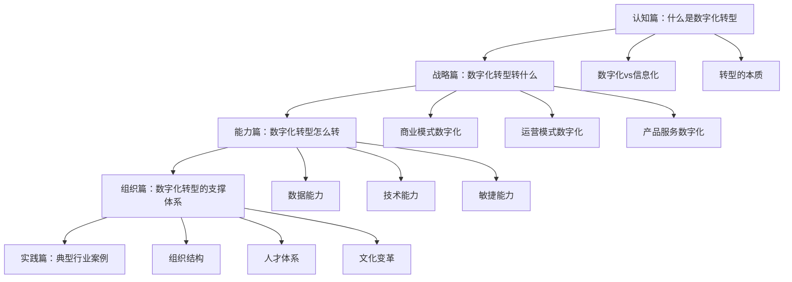
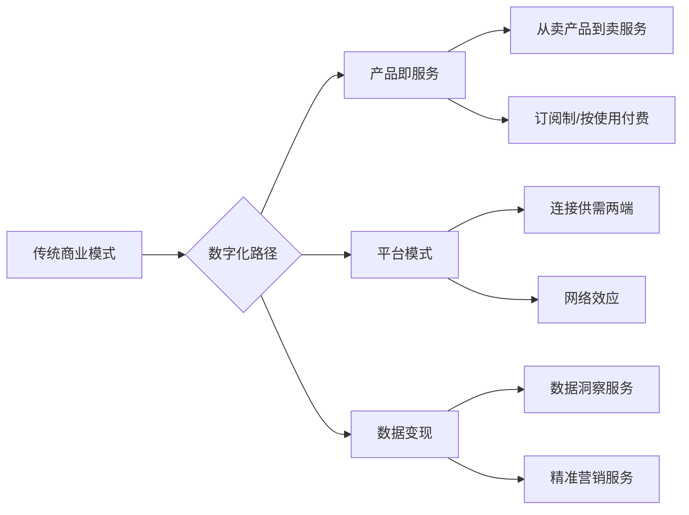
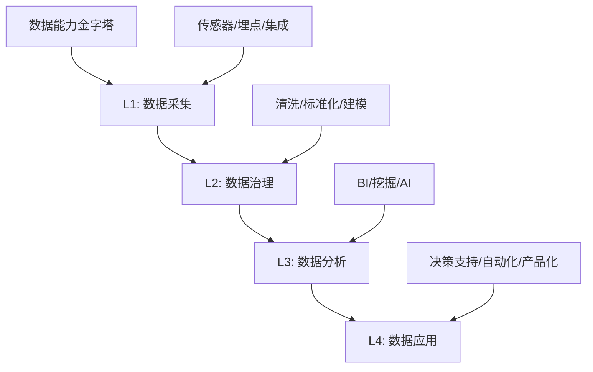
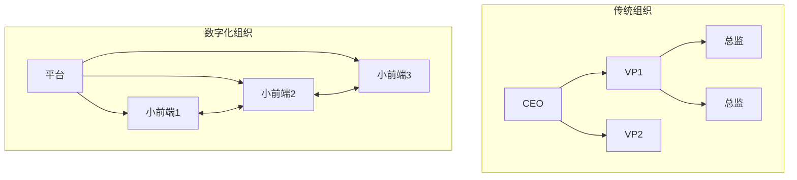
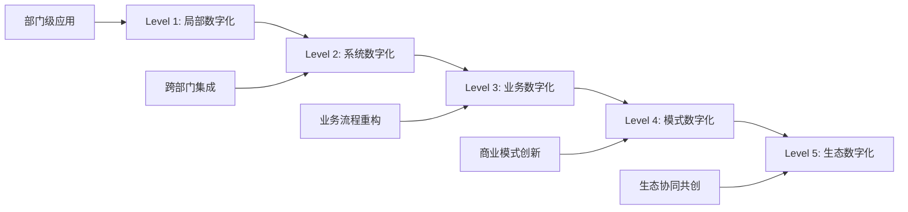

# 《一本书读懂数字化转型》深度读书笔记

## 一、元信息/坐标定位

### 作者背景
陈雪频是知名企业管理顾问、财经作家，智慧云创始合伙人，长期为中国大型企业提供战略和组织咨询服务。他拥有丰富的实战经验，服务过的企业涵盖制造业、零售业、金融业等多个领域。其写作特点是==将复杂理论与中国企业实践相结合==，语言通俗，案例丰富。

### 写作背景与时代语境
本书写于中国数字化转型进入"深水区"的关键时期。经过多年的信息化建设和互联网发展，中国企业普遍完成了基础的"上云""上网"，但真正的数字化转型——==业务模式、组织形态、决策方式的根本性变革==——才刚刚开始。疫情更是加速了这一进程，使数字化从"可选项"变成了"必答题"。

### 学科定位
本书属于==企业战略与组织变革==领域，聚焦于数字化转型这一具体命题。它不是技术书籍，而是从管理视角解读数字化，强调"数字化是业务问题而非IT问题"。在相关著作谱系中，它填补了"面向中国企业的数字化转型实操指南"的空白。

### 核心问题域
- 数字化转型到底转什么？技术升级还是业务重构？
- 中小企业如何在资源有限的情况下推进数字化？
- 数字化转型为什么失败率这么高？关键成功因素是什么？

> [!abstract] 一句话定位
> 这是一本写给中国企业管理者的数字化转型入门指南，用朴实的语言和本土案例，讲透数字化转型的"是什么、为什么、怎么做"。

---

## 二、全书逻辑地图

**全书逻辑主线**：本书采用"认知→战略→能力→组织→实践"的递进结构。

**第一部分（第1-2章）**：澄清概念，区分数字化与信息化，明确数字化转型的本质是业务转型而非技术升级。

**第二部分（第3-5章）**：战略层面，回答"转什么"的问题——商业模式、运营模式、产品服务三个维度的数字化。

**第三部分（第6-8章）**：能力层面，回答"用什么转"的问题——数据能力、技术能力、敏捷能力的构建。

**第四部分（第9-11章）**：组织层面，回答"谁来转"的问题——组织结构、人才体系、文化变革的配套。

**第五部分（第12-14章）**：实践层面，通过制造业、零售业、金融业的典型案例，展示数字化转型的落地路径。

> [!tip] 阅读建议
> 建议先通读第1-2章建立正确认知，再根据自身企业情况选择性深读。第6章"数据能力"和第9章"组织变革"是全书精华。

---

## 三、核心主题/逐章深度拆解

### 第一章：数字化转型的概念澄清

#### 核心论点
数字化转型不等于信息化升级。信息化是==用技术提升效率==，数字化是==用数据重构业务==。很多企业的"数字化转型"失败，根源在于把它当成了IT项目而非业务变革。

#### DIKW四层提炼
| 层次 | 内容 |
|------|------|
| **Data** | 全球数字化转型失败率高达70-80% |
| **Information** | 失败的主因不是技术问题，而是战略模糊和组织惯性 |
| **Knowledge** | 数字化 = 信息化 + 数据化 + 智能化 |
| **Wisdom** | 数字化的本质是用数据驱动决策、用算法优化运营、用平台重构关系 |

#### 费曼式解读
> [!note] 用大白话解释
> 打个比方：==信息化==是给传统马车装上GPS导航——马车还是马车，只是更容易找路了。==数字化==是把马车换成自动驾驶汽车——不仅导航，而且车子自己能开、能学习、能优化路线。很多企业做了十几年"信息化"，以为自己在"数字化"，其实只是给马车装了一堆传感器，马车本身没变。

#### 关键概念
- **信息化**：将业务流程电子化，提升效率
- **数据化**：将业务对象和过程转化为可分析的数据
- **智能化**：基于数据进行自动决策和持续优化

> [!warning] 常见误区
> "上了ERP就是数字化"——错！ERP是信息化工具。数字化的标志是：==数据成为生产要素，算法成为决策依据，平台成为竞争壁垒==。

---

### 第二章：数字化转型的本质

#### 核心论点
数字化转型的本质是==商业模式的重构==，而非技术的应用。技术只是手段，目的是创造新的客户价值、建立新的竞争优势、开辟新的增长曲线。

#### DIKW四层提炼
| 层次 | 内容 |
|------|------|
| **Data** | 数字化领先企业的营收增速是行业平均的2-3倍 |
| **Information** | 数字化带来的不是效率提升，而是模式创新 |
| **Knowledge** | 转型成功 = 清晰战略 × 坚定执行 × 持续迭代 |
| **Wisdom** | 数字化不是"锦上添花"，而是"生死攸关" |

#### 费曼式解读
> [!note] 用大白话解释
> 柯达发明了数码相机，但柯达倒闭了。诺基亚的手机质量最好，但诺基亚消失了。为什么？因为数字化不只是==换一种技术==，而是==换一种游戏规则==。柯达的商业模式是卖胶卷，数码相机让胶卷没用了；诺基亚的优势是硬件制造，智能手机的战场在软件生态。它们的技术不差，但"转型"失败了——因为没转商业模式。

#### 关键概念
- **商业模式**：企业创造价值、传递价值、获取价值的逻辑
- **第二曲线**：在主业衰退前开辟新的增长曲线
- **颠覆式创新**：用新技术改变竞争规则，使领先者优势失效

---

### 第三章：商业模式数字化

#### 核心论点
商业模式数字化有三种典型路径：==产品即服务（PaaS）==、==平台模式==、==数据变现==。传统企业可以根据自身资源和能力选择适合的路径。

#### DIKW四层提炼
| 层次 | 内容 |
|------|------|
| **Data** | 订阅制企业的客户留存率比一次性销售高3-5倍 |
| **Information** | 商业模式数字化的核心是建立持续的客户关系 |
| **Knowledge** | 产品服务化 = 产品 + 数据 + 服务 + 生态 |
| **Wisdom** | 卖产品是一次性交易，卖服务是终身关系 |

#### 费曼式解读
> [!note] 用大白话解释
> 以前卖空调是"==一锤子买卖=="——装完走人，下次见面是10年后换新。现在的智能空调可以"==按舒适度收费=="——空调免费装，你用多少舒适付多少钱，厂家通过数据持续优化你的体验。这就是"产品即服务"。厂家赚的不是空调差价，而是服务费；粘住的不是一次采购，而是终身关系。

#### 关键概念
- **订阅经济**：从一次性购买到持续付费
- **平台模式**：连接多边用户，撮合交易，获取分成
- **数据资产**：将积累的数据变成可交易的产品或服务

---

### 第四章：运营模式数字化

#### 核心论点
运营数字化的核心是==端到端的数据贯通==和==实时智能决策==。从研发、采购、生产、物流到销售、服务，全链条数据打通，才能实现真正的敏捷响应。

#### DIKW四层提炼
| 层次 | 内容 |
|------|------|
| **Data** | 数据贯通的企业库存周转率提升30-50% |
| **Information** | 运营数字化消除的是"信息孤岛"和"决策滞后" |
| **Knowledge** | 运营效率 = 数据实时性 × 决策自动化 × 执行敏捷性 |
| **Wisdom** | 未来的运营竞争是"秒级响应"vs"周级响应" |

#### 费曼式解读
> [!note] 用大白话解释
> 传统企业像"==接力赛=="——销售把订单交给计划，计划交给生产，生产交给物流，每个交接都有等待和误差。数字化企业像"==交响乐=="——指挥（数据中台）实时看到每个乐器（部门）的状态，一个手势（算法）就能让大家同步调整。SHEIN能把服装从设计到上架压缩到7天，就是靠这种"交响乐"式的数字化运营。

#### 关键概念
- **数据中台**：统一的数据采集、处理、服务平台
- **业务中台**：可复用的业务能力组件（如订单、支付、库存）
- **智能决策**：基于规则和算法的自动化决策系统

---

### 第五章：产品服务数字化

#### 核心论点
产品和服务的数字化有两个方向：一是==产品智能化==（嵌入芯片、传感器、算法），二是==服务在线化==（将线下服务搬到线上）。两者结合形成"智能产品+数字服务"的新形态。

#### DIKW四层提炼
| 层次 | 内容 |
|------|------|
| **Data** | 智能产品的客户满意度平均提升20%以上 |
| **Information** | 智能化让产品从"工具"变成"伙伴" |
| **Knowledge** | 产品价值 = 功能价值 + 数据价值 + 生态价值 |
| **Wisdom** | 未来的产品都是"可进化"的——通过OTA持续升级 |

#### 费曼式解读
> [!note] 用大白话解释
> 传统汽车是"==买定离手=="——出厂什么样，用到报废还是什么样。特斯拉是"==越用越好=="——你睡一觉，车子OTA升级了，续航多了20公里，自动驾驶更聪明了。==产品从"名词"变成了"动词"==，从"交付完毕"变成了"持续进化"。这就是产品数字化的终极形态。

#### 关键概念
- **智能产品**：具备感知、连接、计算能力的产品
- **OTA升级**：通过网络远程更新产品软件
- **数字孪生**：产品在数字空间的虚拟镜像

---

### 第六章：数据能力建设

#### 核心论点
数据能力是数字化转型的==核心基础设施==。它包含四个层次：数据采集（感知）、数据治理（清洗整合）、数据分析（洞察）、数据应用（决策）。很多企业卡在"有数据但用不起来"的阶段。

#### DIKW四层提炼
| 层次 | 内容 |
|------|------|
| **Data** | 80%的企业时间花在数据清洗上，只有20%用于分析 |
| **Information** | "数据不可用"是数字化转型最大的瓶颈 |
| **Knowledge** | 数据价值 = 数据质量 × 分析能力 × 应用场景 |
| **Wisdom** | 数据不是"有"就行，要"好用"才行 |

#### 费曼式解读
> [!note] 用大白话解释
> 很多企业像"==数据囤积症患者=="——买了一堆摄像头、上了各种系统，数据存了一大堆，但问"库存周转率是多少"，半天出不来。因为数据散落在各个系统、格式不统一、口径不一致。这就像你家有十个抽屉，但东西乱塞，找把剪刀要翻半天。==数据治理==就是给抽屉分门别类、贴好标签，要什么一秒钟找到。

#### 关键概念
- **数据治理**：确保数据的准确性、一致性、可用性
- **数据湖/数据仓库**：统一存储和管理数据的基础设施
- **数据产品**：将数据能力封装成可直接使用的产品或服务

> [!tip] 实践建议
> 数据能力建设要"==小步快跑、场景驱动=="。不要试图一次性建成"完美的数据中台"，而是从一个具体的业务痛点切入，快速验证价值，再逐步扩展。

---

### 第七章：技术能力建设

#### 核心论点
技术能力不等于技术团队。数字化时代需要的是==技术与业务融合的能力==——业务人员懂技术、技术人员懂业务、组织有快速试错的机制。

#### DIKW四层提炼
| 层次 | 内容 |
|------|------|
| **Data** | 数字化领先企业的IT与业务人员配比是1:3，传统企业是1:10 |
| **Information** | 技术能力的核心不是写代码，而是解决业务问题 |
| **Knowledge** | 技术竞争力 = 架构灵活性 × 交付速度 × 业务理解深度 |
| **Wisdom** | 最强的技术能力是"让技术隐身"——业务人员自己就能用 |

#### 费曼式解读
> [!note] 用大白话解释
> 传统企业的IT部门像"==翻译官=="——业务提需求，IT翻译成技术语言，开发上线，来回折腾几个月。数字化企业的技术团队像"==嵌入式顾问=="——和业务坐在一起，当场理解问题、当场出原型、快速迭代。更厉害的是，现在有"低代码平台"，业务人员自己拖拖拽拽就能做应用，==不用懂代码也能"编程"==。

#### 关键概念
- **微服务架构**：将大系统拆解为独立、灵活的小服务
- **DevOps**：开发和运维一体化，加速交付
- **低代码/无代码**：让非技术人员也能快速构建应用

---

### 第八章：敏捷能力建设

#### 核心论点
数字化时代的竞争本质是==响应速度的竞争==。敏捷能力包括：快速感知市场变化、快速决策、快速执行、快速迭代。它需要组织结构、流程机制、文化观念的配套变革。

#### DIKW四层提炼
| 层次 | 内容 |
|------|------|
| **Data** | 敏捷组织的产品上市时间比传统组织快40-60% |
| **Information** | 敏捷不是"快"，而是"快速适应变化" |
| **Knowledge** | 敏捷能力 = 感知灵敏度 × 决策速度 × 执行弹性 |
| **Wisdom** | 未来的竞争不是大鱼吃小鱼，而是快鱼吃慢鱼 |

#### 费曼式解读
> [!note] 用大白话解释
> 传统企业像"==大象=="——计划周密、执行有力，但转身很慢。数字化时代需要像"==猎豹=="——随时观察、快速出击、扑空了马上换目标。ZARA一年能出1.2万款新品，每款少量生产，卖得好追加、卖不好立刻下架。这种"小批量、多品种、快周转"的敏捷，是数字化才能支撑的。

#### 关键概念
- **敏捷开发**：短周期迭代、快速交付、持续反馈
- **MVP（最小可行产品）**：用最低成本验证假设
- **AB测试**：同时运行多个版本，用数据选择最优

---

### 第九章：组织结构变革

#### 核心论点
数字化转型需要==与之匹配的组织形态==。传统的金字塔结构适合稳定环境，数字化时代需要更扁平、更灵活、更开放的网络化组织。

#### DIKW四层提炼
| 层次 | 内容 |
|------|------|
| **Data** | 海尔将7万人组织拆分为4000+小微，创新效率提升5倍 |
| **Information** | 组织结构是战略落地的载体 |
| **Knowledge** | 数字化组织 = 大平台 + 小前端 + 生态化 |
| **Wisdom** | 组织的边界不应该成为创新的边界 |

#### 费曼式解读
> [!note] 用大白话解释
> 传统组织像"==军队=="——层级分明、命令驱动、按规矩办事。数字化组织像"==特种部队=="——小队灵活作战、总部提供火力支援和情报支持。华为的"铁三角"、字节的"小团队"都是这个逻辑：==让听得见炮火的人呼唤炮火==，总部变成"赋能平台"而非"管控中心"。

#### 关键概念
- **平台+小前端**：中后台提供能力，前端灵活组合
- **项目制/小组制**：打破部门墙，按任务组队
- **内部市场化**：部门之间结算，激活内部动力

> [!warning] 转型陷阱
> 很多企业只改了组织架构图，没改权责利分配，结果"换汤不换药"。==真正的组织变革是权力的重新分配==，会触动既得利益，所以阻力巨大。

---

### 第十章：人才体系建设

#### 核心论点
数字化转型需要三类人才：==数字化原住民==（年轻一代）、==业务+技术复合型人才==（跨界者）、==变革领导者==（推动者）。人才的获取方式也在变化——从"拥有"到"使用"。

#### DIKW四层提炼
| 层次 | 内容 |
|------|------|
| **Data** | 85%的企业认为数字化人才短缺是最大障碍 |
| **Information** | 人才问题的本质是"能力差距"，不是"人数不够" |
| **Knowledge** | 人才策略 = 外部引进 + 内部培养 + 生态借力 |
| **Wisdom** | 最重要的人才是"能带来其他人才的人才" |

#### 费曼式解读
> [!note] 用大白话解释
> 数字化人才像"==稀缺资源=="，你招不到、留不住、用不起。怎么办？三条路：一是=="养"==——从内部培养，让业务骨干学技术、让技术骨干学业务；二是==借"==——用外包、顾问、生态伙伴的人才，不求所有但求所用；三是=="抢"==——在核心岗位上不惜代价引进顶尖人才，一个顶十个。

#### 关键概念
- **T型人才**：既有专业深度，又有跨领域广度
- **人才共享**：通过生态合作获取外部人才资源
- **数字化培训**：用数字化手段规模化培养数字化能力

---

### 第十一章：文化与领导力

#### 核心论点
数字化转型最难的是==改变人的思维方式和行为习惯==。技术可以买、人才可以挖，但文化只能慢慢培育。领导者的示范作用至关重要。

#### DIKW四层提炼
| 层次 | 内容 |
|------|------|
| **Data** | 70%的数字化转型项目失败的根源是组织文化 |
| **Information** | 文化吃战略当早餐（德鲁克） |
| **Knowledge** | 数字化文化 = 数据文化 + 敏捷文化 + 开放文化 |
| **Wisdom** | 转型首先是领导者的自我转型 |

#### 费曼式解读
> [!note] 用大白话解释
> 很多老板说"要数字化转型"，但自己从不看数据报表、决策全凭直觉、对新事物不学不问。==上行下效==，员工也就心照不宣地"走过场"。真正的转型是老板自己先变：学会用数据说话、敢于承认错误、愿意听年轻人的意见。==组织的天花板就是领导者的认知天花板==。

#### 关键概念
- **数据文化**：用数据说话、用数据决策、用数据考核
- **试错文化**：允许失败、快速迭代、从错误中学习
- **开放文化**：打破层级、鼓励跨界、拥抱外部

---

### 第十二至十四章：行业案例分析

#### 制造业数字化
- **核心挑战**：设备联网难、数据孤岛多、人才短缺
- **典型路径**：设备→产线→工厂→供应链的逐级数字化
- **标杆案例**：三一重工"树根互联"——从卖设备到卖服务

#### 零售业数字化
- **核心挑战**：线上线下割裂、会员数据分散、供应链响应慢
- **典型路径**：全渠道融合→会员统一→供应链敏捷
- **标杆案例**：盒马鲜生——线上线下一体化、30分钟配送

#### 金融业数字化
- **核心挑战**：监管合规、遗留系统、风险控制
- **典型路径**：渠道数字化→产品数字化→运营数字化
- **标杆案例**：招商银行APP——从交易工具到生活平台

> [!tip] 行业共性
> 无论哪个行业，数字化转型的共性规律是：==从客户端倒推、从痛点切入、小步快跑验证、数据驱动迭代==。

---

## 四、核心框架提炼

### 框架一：数字化转型成熟度模型

**应用场景**：评估企业数字化转型所处阶段，制定升级路线。

### 框架二：数字化转型四力模型

| 维度 | 内涵 | 关键问题 |
|------|------|---------|
| **战略力** | 清晰的数字化愿景和路径 | 转型的目标是什么？优先级如何？ |
| **组织力** | 与数字化匹配的组织和人才 | 谁来干？怎么考核？ |
| **数据力** | 数据采集、治理、分析、应用能力 | 数据在哪？好用吗？ |
| **技术力** | 技术架构和交付能力 | 能快速实现吗？能持续演进吗？ |

**应用场景**：诊断数字化转型的短板，聚焦关键能力建设。

### 框架三：数字化转型项目分类矩阵

| | 高业务价值 | 低业务价值 |
|---|---|---|
| **低实施难度** | ==速赢项目==（优先推进） | 锦上添花（资源充裕时做） |
| **高实施难度** | ==战略项目==（长期投入） | 暂时搁置（重新评估） |

**应用场景**：对数字化项目进行优先级排序，避免资源分散。

> [!abstract] 框架整合
> 成熟度模型确定"在哪里"，四力模型诊断"缺什么"，分类矩阵决定"先做什么"。三者结合形成数字化转型的完整规划工具。

---

## 五、批判性思考

### 理论贡献与局限

**贡献**：
1. 用本土语言和案例讲解数字化转型，适合中国企业管理者
2. 强调"业务视角"而非"技术视角"，纠正常见误区
3. 提供了实用的框架和工具，具有操作指导性

**局限**：
1. ==内容偏入门==，对已有一定数字化基础的企业深度不足
2. 案例多为大企业，对中小企业的针对性指导较少
3. 对失败案例分析不够深入，缺乏"教训"视角

### 争议性观点

> [!warning] 需要批判性审视的论断
> 1. "数字化转型是生死问题"——是否所有企业都需要深度数字化？
> 2. "数据是新时代的石油"——数据真的对所有企业都有同等价值吗？
> 3. "平台化是趋势"——垂直细分领域是否更适合专精模式？

### 与其他思想的对话

| 本书观点 | 对立/补充观点 | 来源 |
|---------|--------------|------|
| 数据驱动决策 | 直觉和经验仍有价值 | [[思考，快与慢]] - 卡尼曼 |
| 敏捷快速迭代 | 长期主义和深度思考不可或缺 | [[长期主义]] - 陈春花 |
| 平台化生态化 | 专精特新同样是可行路径 | [[隐形冠军]] - 西蒙 |

### 个人批判性问题

1. 数字化转型是否被过度神化？传统能力是否被低估？
2. 数据隐私和安全风险如何平衡商业价值？
3. 中小企业在资源有限时，应该"小而美"还是"拼命追"？

---

## 六、行动清单

### 诊断阶段（第1周）
- [ ] 用成熟度模型评估企业当前数字化水平
- [ ] 用四力模型识别核心短板
- [ ] 访谈关键业务部门，收集痛点和期望

### 规划阶段（第2-3周）
- [ ] 明确数字化转型的战略目标和优先级
- [ ] 识别3-5个高价值、低难度的速赢项目
- [ ] 制定1年期的数字化路线图

### 试点阶段（第1-3月）
- [ ] 选择1个业务场景启动数据能力试点
- [ ] 组建跨职能的数字化项目小组
- [ ] 建立快速迭代和复盘机制

### 推广阶段（第4-6月）
- [ ] 总结试点经验，形成可复制方法论
- [ ] 扩展到更多业务场景
- [ ] 启动组织和人才体系的配套变革

> [!tip] 关键成功因素
> ==一把手工程==：数字化转型必须是CEO工程，不能授权给CIO独自推进。业务部门的参与和承诺是成败关键。

---

## 七、延伸阅读路线图

### 基础认知
- [[数字化转型路径]] - 华为：大厂实践视角的方法论
- [[平台战略]] - 陈威如：理解平台商业模式的入门书

### 深度延伸
- [[云战略]] - 华为：云计算技术的商业应用
- [[数据中台]] - 阿里：数据能力建设的详细指南

### 组织变革
- [[重新定义组织]] - 穆胜：数字时代的组织设计
- [[赋能]] - 麦克里斯特尔：如何打造敏捷组织

### 行业案例
- [[银行数字化转型》- 刘晓春：金融业数字化深度解读
- [[智能制造]] - 工信部：制造业数字化政策与实践

---

## 八、费曼终极检验

### 如果要用5分钟向一个完全不懂的朋友解释这本书，我会这样说：

"你知道为什么很多老牌企业突然就不行了吗？柯达、诺基亚、百丽鞋业...答案是==数字化转型==做得不好。

什么是数字化转型？简单说，就是==用数据来驱动你的生意==。过去开店凭经验：什么货好卖靠"感觉"，定多少价靠"同行"，备多少货靠"猜"。现在呢？系统告诉你：这个颜色在这个季节卖得好、这个价格弹性最大、这个SKU该补货了。==从拍脑袋变成看数据==，这就是数字化。

但为什么这么多企业转型失败？因为他们以为数字化就是==买系统、上软件==。不对！数字化转型其实是==做生意方式的彻底改变==——产品要变（从卖东西变成卖服务）、运营要变（从周计划变成日响应）、组织要变（从大部门变成小团队）、人要变（从凭经验变成看数据）。

这本书告诉你三件事：

第一，==想清楚转什么==——不是上一堆系统，而是想清楚你的商业模式、运营方式、产品服务怎么用数据来提升。

第二，==打好基础能力==——数据采集、数据分析、技术架构，这些是基本功，急不来。

第三，==组织和人先变==——最大的阻力不是技术，是人。老板自己要先学会用数据思考，组织要打破部门墙，人才要培养或引进。

最后一句话：==数字化转型不是选修课，是必修课==。早做晚做都得做，早做的还能活，晚做的可能就来不及了。"

---

> [!abstract] 全书一句话总结
> ==数字化转型的本质不是技术升级，而是用数据重构业务逻辑、用算法重塑决策方式、用平台重新定义组织边界——它是一场关于思维方式和经营范式的根本性变革。==
