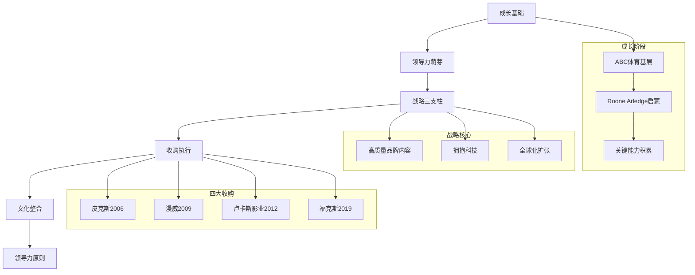
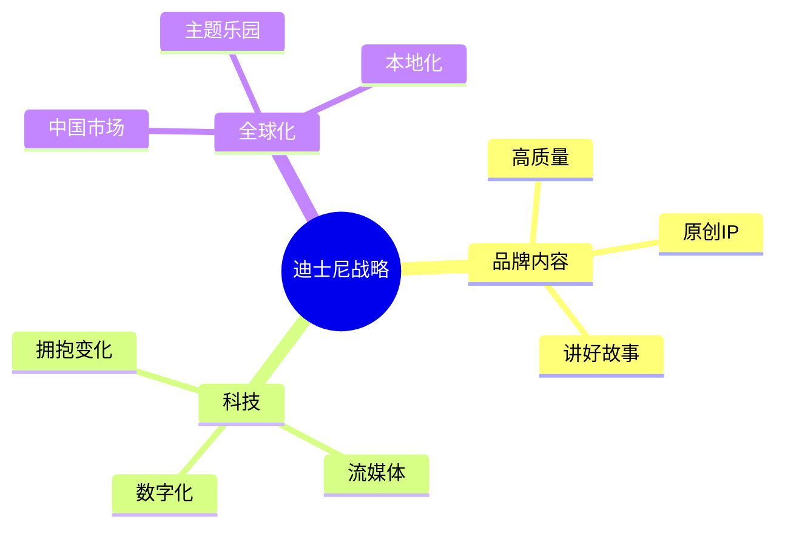
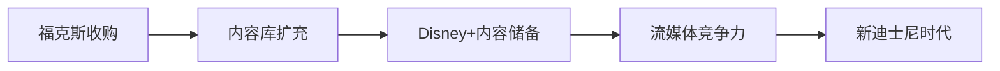
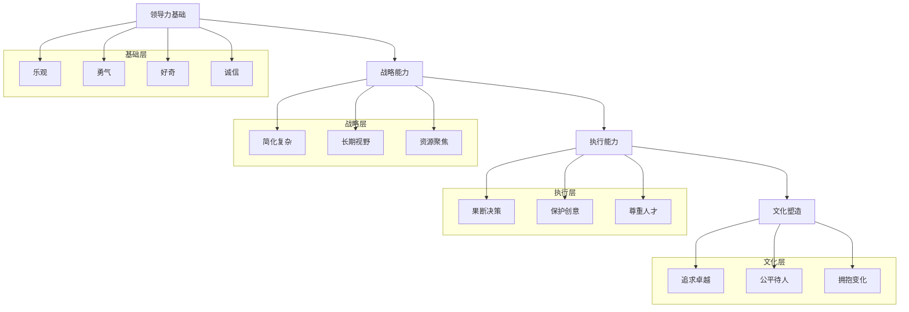

# 《一生的旅程》深度拆解

## 一、元信息/坐标定位

### 作者背景
罗伯特·艾格（Robert Iger）是迪士尼历史上最成功的CEO之一，1996年加入迪士尼，2005年接任CEO，2020年卸任（后于2022年回归）。在他任期内，迪士尼市值从480亿美元增长到2570亿美元，增幅超过400%。艾格主导了四次改变行业格局的收购：==皮克斯、漫威、卢卡斯影业和21世纪福克斯==。

### 写作动机
本书写于艾格即将卸任之际，既是对45年职业生涯的总结，也是对领导力哲学的系统梳理。艾格希望通过分享自己从基层员工到顶级CEO的经历，展示领导力的核心原则如何在实践中发挥作用。

### 知识坐标
本书处于==商业传记与领导力方法论的交汇点==。与杰克·韦尔奇的《赢》侧重管理技术不同，艾格更强调领导者的人格修养与战略直觉；与雷·达利欧的《原则》相比，本书更具叙事性和情感温度。

### 阅读价值
- **对创业者**：学习如何在巨型组织中推动变革
- **对管理者**：理解并购整合与文化融合的艺术
- **对职场人**：掌握从基层到高管的成长路径
- **对投资者**：洞察娱乐产业的战略逻辑

> [!abstract] 一句话总结
> 这是一本关于==如何用乐观、勇气、专注和公平==带领一个传统巨头走向未来的实战手册。

---

## 二、全书逻辑地图



**核心逻辑链条**：
本书以时间为经、原则为纬，编织出一幅领导力成长图谱。艾格从ABC体育的底层工作起步，在导师Roone Arledge的影响下形成了==追求卓越的工作态度==。接任CEO后，他用100天时间确立了三大战略支柱，随后通过四次精准并购将战略落地。每次收购都是战略、执行与文化整合的综合考验，而贯穿始终的是艾格提炼的十条领导力原则。全书形成了"个人成长→战略思维→执行能力→领导哲学"的完整闭环。

---

## 三、核心主题/逐章深度拆解

### 第一部分：从底层到高管——成长的底层逻辑

#### 核心论点
艾格在ABC体育的23年是其领导力的"学徒期"。真正的领导力不是天生的，而是在日复一日的工作中被==磨砺、被观察、被反思==出来的。

#### DIKW四层提炼

| 层级 | 内容 |
|------|------|
| **Data（数据）** | 艾格1974年加入ABC，起薪150美元/周，每天凌晨4:30上班 |
| **Information（信息）** | 他从最基础的演播室工作做起，逐步参与《广角世界》等重要节目制作 |
| **Knowledge（知识）** | Roone Arledge教会他：追求卓越不是口号，而是对每个细节的执念 |
| **Wisdom（智慧）** | 领导力的根基是==尊重每一份工作==，无论多么微小 |

#### 费曼式解读

> [!tip] 用最简单的话解释
> 想象你是一个刚进公司的实习生，每天做的都是端茶倒水的活。艾格告诉你：这些"杂活"其实是领导力训练营。因为当你认真对待每一件小事时，你在学习==如何把事情做到极致==。同时，你在观察那些优秀的人是怎么工作的，这比任何MBA课程都有价值。

#### 关键概念深挖

**1. "管理你的不耐烦"**

艾格年轻时急于求成，导师Dan Burke告诫他要学会管理自己的不耐烦。这个建议的深意在于：==雄心是燃料，耐心是方向盘==。没有耐心的雄心只会让你失控。

> [!note] 实践启示
> 在职业生涯早期，积累比晋升更重要。每一次"忍耐"都是在为未来的爆发积蓄能量。

**2. Roone Arledge的卓越标准**

Roone不仅是老板，更是艾格的领导力导师。他的核心理念是：==如果你能做到很好，就绝不接受还行==。这种对卓越的执念，成为艾格日后管理迪士尼的底层操作系统。

---

### 第二部分：战略三支柱——CEO的100天

#### 核心论点
接任CEO的前100天是定调的关键期。艾格用三个战略支柱==简化了迪士尼的复杂性==，让整个组织有了清晰的方向感。

#### DIKW四层提炼

| 层级 | 内容 |
|------|------|
| **Data** | 2005年迪士尼面临：动画业务滑坡、与皮克斯关系恶化、股价低迷 |
| **Information** | 艾格识别出问题的根源：过度多元化导致核心优势模糊 |
| **Knowledge** | 战略的本质是取舍，做什么很重要，不做什么更重要 |
| **Wisdom** | ==战略必须简单到每个员工都能复述== |

#### 三大战略支柱详解



**支柱一：创造高质量品牌内容**

> [!warning] 常见误区
> 很多公司把"做好内容"当成空洞口号。艾格的做法是：==把资源集中到最能代表迪士尼品牌的项目上==，砍掉边缘业务。

**支柱二：拥抱科技而非对抗科技**

艾格清醒地认识到：流媒体不是威胁，而是机遇。迪士尼不能像柯达一样，==手握数码相机专利却死守胶片业务==。

**支柱三：成为真正的全球化公司**

上海迪士尼是这一战略的集中体现。艾格亲自参与谈判18年，最终打造了一个==融合中国文化的迪士尼乐园==。

#### 费曼式解读

> [!tip] 用最简单的话解释
> 假设你开了一家餐厅，生意不好。你可以做很多事：换菜单、搞营销、开分店、做外卖。但艾格会问：你最拿手的是什么？做好那一道菜，其他都围绕它来。迪士尼最擅长的是讲故事，所以一切战略都围绕"如何更好地讲故事"展开。

---

### 第三部分：四大收购——战略的艺术与执行的科学

#### 皮克斯收购（2006年，74亿美元）

**核心论点**：==买公司就是买人才和文化==，而不是买资产。

| 层级 | 内容 |
|------|------|
| **Data** | 迪士尼动画连续失败：《星银岛》《熊的传说》《四眼天鸡》 |
| **Information** | 皮克斯掌握着计算机动画的核心能力，更重要的是创意文化 |
| **Knowledge** | 保护被收购方的文化独立性，比整合协同效应更重要 |
| **Wisdom** | ==收购的第一天想着如何保护，而非如何改变== |

> [!note] 收购哲学
> 艾格承诺乔布斯：皮克斯保持独立运营，不派迪士尼高管"监督"。这种==克制==赢得了乔布斯的信任，也保护了皮克斯的创意基因。

#### 漫威收购（2009年，40亿美元）

**核心论点**：==看到别人看不到的价值==是战略眼光的体现。

2009年很多人认为漫威只是一家漫画公司，而艾格看到的是：
- 5000多个角色的IP宝库
- 跨媒体叙事的潜力
- 与迪士尼受众的互补性

> [!tip] 战略洞察
> 漫威收购时市场估值40亿，艾格知道这是==被严重低估的文化资产==。截至2023年，漫威电影宇宙票房已超过290亿美元。

#### 卢卡斯影业收购（2012年，40.5亿美元）

**核心论点**：==尊重创始人的情感==是交易成功的关键。

艾格处理与乔治·卢卡斯的关系极为细腻：
- 亲自飞往天行者牧场谈判
- 承诺保护《星球大战》的文化遗产
- 让卢卡斯感到这是"托孤"而非"卖身"

#### 21世纪福克斯收购（2019年，713亿美元）

**核心论点**：==战略决定了交易规模==，而非相反。

这是迪士尼史上最大的收购，艾格的逻辑是：
- 流媒体时代需要海量内容
- 福克斯的影视库是不可复制的资产
- 这是迪士尼转型为流媒体公司的关键拼图



#### 费曼式解读

> [!tip] 用最简单的话解释
> 想象你要买一家咖啡店。普通人看的是设备值多少钱、租金多少。艾格看的是：这家店的咖啡师有多厉害？他们的独家配方是什么？买下来后怎么让这些人愿意留下来继续做好咖啡？==收购的本质是买人心，不是买资产==。

---

### 第四部分：领导力十原则——艾格的领导哲学

#### 核心论点
领导力不是一套技术，而是一种==人格的表达==。艾格总结的十条原则，本质上是他人格特质的外化。

#### 十原则详解

| 原则 | 核心内涵 | 实践要点 |
|------|----------|----------|
| **乐观** | 领导者必须是现实主义的乐观者 | 相信问题有解决方案，并感染团队 |
| **勇气** | 做对的事，而非容易的事 | 在不确定中做出决策 |
| **专注** | 在噪音中保持战略清晰 | 学会说"不" |
| **果断** | 不做决定也是一种决定 | 信息永远不完美，但要行动 |
| **好奇** | 保持对世界的开放心态 | 不断学习新领域 |
| **公平** | 对所有人一视同仁 | 尊重是领导力的基础 |
| **周全** | 决策前考虑各方影响 | 但不能因此瘫痪 |
| **真诚** | 做真实的自己 | 伪装终会被识破 |
| **追求卓越** | 拒绝平庸 | "还行"是最危险的词 |
| **诚信** | 做正确的事 | 哪怕代价高昂 |

> [!warning] 关键洞察
> 这十条原则不是"选择题"，而是"必答题"。艾格强调：==领导者必须在所有维度上都达到及格线以上==，短板会被无限放大。

#### DIKW四层提炼

| 层级 | 内容 |
|------|------|
| **Data** | 艾格每天4:15起床，保持运动习惯，持续学习新技术 |
| **Information** | 这些习惯支撑了他在高压环境下的稳定输出 |
| **Knowledge** | 领导力是一种需要持续投入的能力 |
| **Wisdom** | ==领导者的自我管理是团队管理的前提== |

---

### 第五部分：上海迪士尼——全球化的极致案例

#### 核心论点
上海迪士尼不是简单的"复制粘贴"，而是==在尊重本地文化的基础上创造新体验==。

#### 关键决策分析

**1. 18年的马拉松谈判**

艾格亲自参与与中国政府的谈判，展现了==极致的耐心与战略定力==。他深知：这不是一笔普通交易，而是迪士尼全球化战略的关键一步。

**2. "原汁原味迪士尼，别具一格中国风"**

这个定位精准地平衡了两个看似矛盾的需求：
- 保持迪士尼的魔法体验
- 尊重中国消费者的文化期待

> [!note] 实践细节
> 上海迪士尼的餐厅提供中餐，景点融入中国元素（如十二生肖），但核心体验保持迪士尼标准。

#### 费曼式解读

> [!tip] 用最简单的话解释
> 假设你要把一家美国餐厅开到中国。你有两个选择：完全照搬美国模式，或者完全本地化。艾格选择了第三条路：==保留灵魂，适应身体==。灵魂是迪士尼的魔法体验，身体是中国消费者的习惯和文化。

---

## 四、核心框架提炼

### 艾格领导力模型



### 三大核心公式

**公式一：战略 = 聚焦 × 勇气**
- 聚焦是知道该做什么
- 勇气是敢于放弃什么

**公式二：收购成功 = 战略契合 × 文化保护 × 人才留存**
- 战略契合决定"为什么买"
- 文化保护决定"怎么整合"
- 人才留存决定"能否成功"

**公式三：领导力 = 人格 × 能力 × 时机**
- 人格是底层操作系统
- 能力是应用程序
- 时机是运行环境

### 与其他框架的对接

| 框架 | 艾格的对应实践 |
|------|----------------|
| [[吉姆·柯林斯的第五级领导力]] | 艾格展现了"谦逊+意志"的特质 |
| [[克莱顿·克里斯坦森的创新者窘境]] | 迪士尼通过收购解决了内部创新不足的问题 |
| [[本·霍洛维茨的创业维艰]] | 艾格同样强调"没有好的选择，只有较好的选择" |

---

## 五、批判性思考

### 幸存者偏差的局限

> [!warning] 批判视角
> 本书是成功者的回顾，难免带有==事后诸葛亮==的色彩。艾格的四次收购都成功了，但这并不意味着他的方法论可以普遍复制。

**需要追问的问题**：
- 如果漫威电影宇宙失败了，艾格还会被视为战略大师吗？
- 他的成功有多少归功于时代背景（流媒体崛起、中国市场开放）？
- 迪士尼的规模和品牌护城河，让他的试错成本更低吗？

### 领导力原则的内在张力

艾格的十条原则之间存在==潜在的矛盾==：
- **果断 vs 周全**：如何在快速决策和充分考虑之间平衡？
- **乐观 vs 现实**：过度乐观会不会变成盲目？
- **勇气 vs 公平**：勇敢的决策可能伤害一部分人

> [!note] 深层思考
> 艾格没有给出解决这些矛盾的万能公式，因为==领导力的艺术恰恰在于情境判断==。

### 时代局限性

艾格的领导力哲学形成于==前AI、前疫情==时代。在新的环境下：
- 远程工作对"走动管理"提出挑战
- AI对内容创作行业的冲击尚未可知
- 流媒体市场已经从蓝海变成红海

### 中国叙事的简化

上海迪士尼的成功叙事可能==过于平滑==。书中较少提及：
- 与中方合作伙伴的具体分歧
- 文化冲突的处理细节
- 本地化过程中的妥协与代价

---

## 六、行动清单

### 对管理者

- [ ] **制定个人战略三支柱**：用艾格的方法，为自己的团队/业务确定3个最重要的方向
- [ ] **建立"卓越"的具体标准**：把"做到最好"转化为可衡量的指标
- [ ] **每周进行"不做清单"复盘**：识别哪些事情应该停止
- [ ] **练习100天上任法**：新接手任何项目，先用100天确立核心方向

### 对职场人

- [ ] **找到你的Roone Arledge**：识别并主动接近那些可以教你的人
- [ ] **管理你的不耐烦**：把急于求成的能量转化为深度积累
- [ ] **记录"小事卓越"案例**：每周写下一件你做到极致的小事
- [ ] **培养战略思维**：每周花30分钟思考公司的战略逻辑

### 对创业者

- [ ] **设计"保护收购方文化"的整合方案**：如果有并购机会，先想清楚如何保护对方
- [ ] **建立简单到能复述的战略**：如果员工不能一句话说清公司战略，说明战略还不够清晰
- [ ] **列出"勇气决策"清单**：识别那些你知道对但不敢做的事
- [ ] **每季度做一次"乐观审计"**：检查自己是否在向团队传递积极信号

---

## 七、延伸阅读路线图

```mermaid
flowchart LR
    A[一生的旅程] --> B[领导力深化]
    A --> C[迪士尼研究]
    A --> D[并购专题]
    A --> E[管理哲学]

    B --> B1[[[赢]] - 杰克·韦尔奇]
    B --> B2[[[原则]] - 雷·达利欧]

    C --> C1[[[创意公司]] - 艾德·卡特姆]
    C --> C2[[[迪士尼战争]] - 詹姆斯·斯图尔特]

    D --> D1[[[门口的野蛮人]]]
    D --> D2[[[并购大师]]]

    E --> E1[[[基业长青]] - 吉姆·柯林斯]
    E --> E2[[[创新者的窘境]] - 克里斯坦森]
```

### 推荐阅读顺序

1. **[[创意公司]]** - 艾德·卡特姆：从皮克斯内部视角理解迪士尼收购
2. **[[赢]]** - 杰克·韦尔奇：对比不同风格的CEO领导力
3. **[[基业长青]]** - 吉姆·柯林斯：理解艾格决策背后的理论框架
4. **[[创新者的窘境]]** - 克里斯坦森：理解迪士尼为何必须通过收购获取创新

---

## 八、费曼终极检验

### 如果我要向一个10岁小孩解释这本书

"想象你是一个动画公司的老板，你的公司很大很有名，但是你的动画师画的电影没人看了。你发现隔壁有一家小公司，他们画的电影超级棒，每个人都喜欢。

你有两个选择：一是让你的人去学他们，二是把他们公司买下来。

艾格选择了买下来。但他做了一件聪明的事：买了之后，他没有让自己的人去管那家小公司，而是让小公司继续自己做。

因为他知道：==好东西之所以好，是因为做它的人用自己的方式在做==。如果你去改变他们，好东西就不好了。

这就是这本书最重要的道理：当你成为老板，你的工作不是去控制别人，而是==创造一个环境，让厉害的人可以继续厉害下去==。"

### 核心心智模型检验

- **能否用一句话说清本书的核心**：领导力的本质是用乐观、勇气、专注和公平来激发他人的最佳表现
- **能否用一个案例说明核心原则**：皮克斯收购展示了"保护创意文化"的重要性
- **能否将原则迁移到新情境**：如果要整合一个新收购的创业团队，核心是保护其文化独立性

> [!abstract] 终极总结
> 《一生的旅程》不仅是一本商业传记，更是一本关于==如何在复杂系统中保持简单原则==的领导力手册。艾格的成功告诉我们：最好的领导者不是最聪明的人，而是能够==让聪明人愿意跟随==的人。
