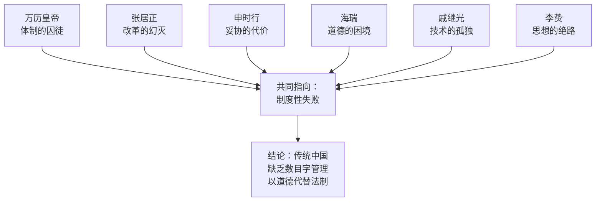
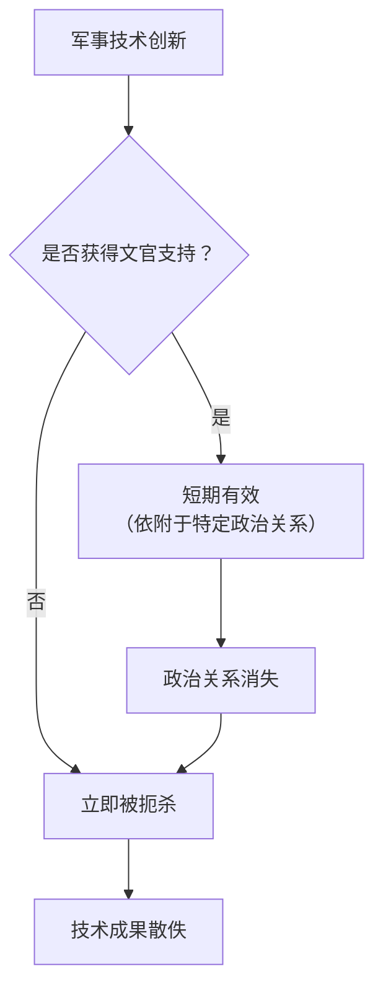
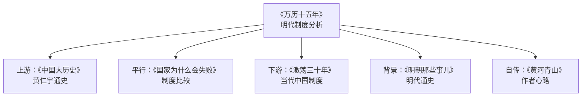

## 一、元信息速览

> [!abstract] 速览
> 《万历十五年》（英文原名 *1587, A Year of No Significance*）由华裔历史学家黄仁宇撰写，英文版1981年由耶鲁大学出版社出版，中文版1982年由中华书局出版。全书以公元1587年（明万历十五年）为切入点，表面上这一年"并无大事可叙"，但黄仁宇通过六个人物——万历皇帝、张居正、申时行、海瑞、戚继光、李贽——的命运轨迹，揭示明代中后期政治体制的深层困境。

本书的核心论点是：==明代中国的根本问题在于以道德代替法律、以人治代替制度，整个帝国依靠一套僵化的意识形态（儒家伦理）来维系运转，缺乏数目字管理（即量化、精确、技术化的行政手段）==。这不是某一个皇帝或大臣的个人失败，而是一种制度性的、结构性的困局。黄仁宇将此称为"大历史观"——不纠缠于个人功过，而是从制度与技术的长时段视角审视历史的演进逻辑。

本书篇幅不长（约十万字），文风克制冷峻，却成为中文世界影响最广泛的历史著作之一，至今仍是理解中国传统政治体制的必读经典。

---

## 二、全书逻辑地图

> [!note] 结构架构
> 全书共七章，采用"以人物为经、以制度为纬"的结构。六个人物分别代表帝国权力结构中的不同角色——君主、改革派首辅、调和派首辅、清官、武将、思想家。他们每一个人都试图在体制内有所作为，但无一例外地被体制本身所吞噬。

黄仁宇的叙事策略极为精妙：他不是在"讲故事"，而是在"做解剖"。每一章选取一个人物，把他放到制度的解剖台上，让你看到这个人的才华、努力、妥协和失败，然后指出——==问题不在于这个人不够好，而在于这个制度不允许任何人"够好"==。六个章节叠加起来，构成了一份关于帝制中国的完整"病理报告"。

最后一章以李贽的思想悲剧收束，暗示：当体制内的政治实践（万历、张居正、申时行）、道德实践（海瑞）、军事实践（戚继光）全部走入死胡同时，连思想层面的突围（李贽）也以失败告终。帝国的出路，在1587年已经被彻底堵死。

---

## 三、逐章深度拆解

### 第一章：「万历皇帝」——一个活人如何被制度变成道具

**核心论点**：万历皇帝的个人悲剧——从少年英主到消极怠工——本质上是君主制度自身矛盾的产物。皇帝名义上拥有至高权力，实际上却被礼仪、传统、官僚集团牢牢束缚，成为一个"活的祖宗牌位"。

**DIKW 金字塔**：

> [!tip] DIKW 金字塔
> - **Data（数据）**：万历十岁即位，在位四十八年（1572-1620），是明朝在位时间最长的皇帝。后期近三十年不上朝，史称"万历怠政"。
> - **Information（信息）**：万历早期在张居正辅政下推行改革，国力一度复振。但张居正死后被清算，万历试图立自己宠爱的郑贵妃之子为太子（"国本之争"），遭到群臣集体抵制，持续十五年。万历最终以不上朝、不批奏折的方式进行消极抵抗。
> - **Knowledge（知识）**：万历的"怠政"不是懒惰，而是一种==无声的抗议==。当皇帝发现自己连选择继承人这样的"家事"都无法自主决定时，他意识到自己不过是一个被制度操纵的傀儡。他选择了唯一可用的武器——不合作。
> - **Wisdom（智慧）**：一个制度如果连它名义上的最高权力者都无法驾驭，那这个制度的运转靠的不是权力，而是惯性。而靠惯性运转的制度，在需要做出关键调整时，就会陷入瘫痪。

**苏格拉底追问**：

- **追问一**：万历真的"无能为力"吗？他毕竟是皇帝，理论上可以杀掉反对他的大臣。但黄仁宇指出，如果皇帝用暴力手段压制文官，他就违反了整个帝国赖以运转的"道德合法性"基础——那他就不再是"圣君"，而变成了"暴君"。==权力的来源恰恰是对权力行使的约束==。这是一个深刻的悖论。
- **追问二**：万历的消极怠工损害了帝国吗？黄仁宇的答案是微妙的：损害了，但不是根本性的。因为帝国本来就不依赖皇帝的个人决策来运转——它依赖一套自动化的官僚程序。皇帝不上朝，官僚体系照样运作，只是运作效率更低。这反过来证明了：==皇帝在这个制度中的功能更像是一枚"印章"，而非一个"决策者"==。
- **追问三**：如果万历不是一个敏感的、有自我意识的人，而是一个甘于做傀儡的庸人，历史会不同吗？这个追问触及了黄仁宇"大历史观"的核心——个人性格只能影响历史的表面波纹，制度结构才决定历史的深层流向。

**心智模型：「金笼子」模型**

> [!important] 核心心智模型
> 你可以把万历想象成一只被关在金笼子里的鸟。笼子是金的——他享有最高的荣耀和物质待遇；但笼子仍然是笼子——他无法飞到任何他想去的方向。更关键的是，这只鸟不能打破笼子，因为笼子本身就是他"鸟王"身份的依据。打破笼子的那一刻，他就不再是鸟王了。

**费曼式解读**：想象你是一家公司的CEO，名片上写着"最终决策者"。但公司有一本厚达千页的"员工手册"规定了你每天的每一个动作——几点开会、穿什么衣服、跟谁说话。你的所有决定都必须先经过十七个委员会的审批。你想换一个副总裁，全公司联名反对。你最终发现，你唯一能真正自主决定的事情是——今天要不要来上班。于是你选择不来了。这就是万历的处境。

**金句**：==「皇帝的权威需要在一定条件下才能运用，他不能不顾一切。」==

---

### 第二章：「首辅张居正」——改革者的悲剧宿命

**核心论点**：张居正是明代最有作为的政治家，他推行的改革（一条鞭法、考成法）在其生前效果显著。但他死后立即遭到全面清算，改革成果也大幅倒退。黄仁宇认为，张居正的失败不是因为他做错了什么，而是因为==他试图用个人的强力意志来推动一个拒绝被推动的制度==。

**DIKW 金字塔**：

> [!tip] DIKW 金字塔
> - **Data**：张居正任首辅十年（1572-1582）。任内推行"考成法"（官员绩效考核制度）和"一条鞭法"（赋税简化改革），国库存银从不足二百万两增至超过六百万两。死后被抄家，家属或饿死或流放。
> - **Information**：张居正的改革触动了整个文官集团的利益——考成法意味着官员要被量化考核，一条鞭法意味着地方士绅的税收优惠被削减。更致命的是，张居正在推行改革时采取了威权手段，压制言路，排斥异己，这在"以道德自居"的文官系统中是最大的罪过。
> - **Knowledge**：张居正悲剧的深层原因在于，明代政治体制==没有为"改革"预留制度性通道==。改革只能依赖个人权威（张居正与太后、太监冯保的特殊关系），一旦个人权威消失（张居正去世），改革就失去了推动力。
> - **Wisdom**：任何依赖个人英雄的改革都是脆弱的。可持续的变革需要制度化——即把改革成果固化为不依赖任何特定个人就能运转的规则和程序。这是张居正没有做到、在明代体制下也不可能做到的事情。

**苏格拉底追问**：

- **追问一**：张居正的威权手段是改革的"必要代价"还是"致命缺陷"？这个问题没有简单答案。在一个不允许改革的制度中推行改革，不使用超常手段几乎不可能；但超常手段本身又为日后的清算提供了口实。这是==改革者的双重困境==——不激进则无法改革，太激进则招致反弹。
- **追问二**：张居正的改革如果持续下去，能否改变明朝的命运？黄仁宇对此持谨慎态度。一条鞭法和考成法是行政管理层面的优化，而非制度结构层面的变革。它们能提高效率，但无法解决帝国的根本问题——缺乏法治、缺乏技术化管理、缺乏社会流动机制。

**心智模型：「人治天花板」模型**

想象你用一根手指堵住一个水坝的裂缝。只要你的手指在那里，水坝就不会崩。但你的手指不可能永远在那里——你会累，你会老，你会死。真正的解决方案是用水泥修补裂缝，但水坝的管理委员会不允许你动水泥，因为"水坝自古以来就是用土建的，用水泥是违反祖制"。张居正就是那根手指。

**金句**：==「张居正的不在人间，使我们这个庞大的帝国失去重心，步伐不稳，最终失足而坠入深渊。」==

---

### 第三章：「世间已无张居正」——申时行的和稀泥哲学

**核心论点**：申时行是张居正之后的首辅，他亲眼目睹了张居正因激进改革而身败名裂，于是选择了截然相反的策略——调和、妥协、维持平衡。但这种"和稀泥"策略同样以失败告终，因为==在一个积重难返的制度中，调和本身也是一种无效的行动==。

**DIKW 金字塔**：

> [!tip] DIKW 金字塔
> - **Data**：申时行任首辅八年（1583-1591），最终因无法调和"国本之争"（万历立太子问题）中的皇帝与群臣而辞职。
> - **Information**：申时行深知帝国运转的真实逻辑——表面上是儒家道德，实际上是各方利益的博弈。他试图在皇帝和文官之间充当缓冲器，两边说好话，两边不得罪。他理解"阴"与"阳"的距离——即公开表态和私下操作之间的差距——并试图在这个距离中腾挪。
> - **Knowledge**：申时行的困境揭示了一个深刻的制度问题：==当一个系统的公开规则和实际运作严重脱节时，调和者的角色注定是悲剧性的==。他要同时维护公开规则的"面子"和实际运作的"里子"，而两者之间的张力越来越大，最终把他撕裂。
> - **Wisdom**：在一个需要根本性变革的系统中，维持现状不是"稳健"，而是"慢性自杀"。申时行的和稀泥延缓了危机的爆发，但也延缓了问题的解决，让病情从可治变成了不治。

**苏格拉底追问**：

- **追问一**：申时行和张居正，谁的路线更可取？这个问题的答案取决于你如何定义"可取"——如果是"对个人更安全"，那申时行更可取；如果是"对帝国更有益"，答案则不确定。张居正的激进改革被反弹消灭，申时行的消极调和让问题继续恶化。==两条路都通向失败，只是失败的方式不同==。
- **追问二**：在一个不允许改革也不允许维持现状的系统中，个人能做什么？黄仁宇的隐含回答是：什么也做不了。这正是他"大历史观"的冷峻之处——当制度的结构性缺陷达到一定程度时，个人的选择空间趋近于零。

**心智模型：「阴阳距离」模型**

> [!important] 核心概念
> 黄仁宇借申时行之口提出了"阴"与"阳"的概念——"阳"是公开的、书面的、道德化的规则；"阴"是实际的、潜在的、利益化的运作。一个健康的制度，阴阳之间的距离应该很小（法律怎么写的，就怎么执行）。但在明代，阴阳之间的距离已经大到无法弥合——官员们说的是一套（忠君爱民），做的是另一套（结党营私）。申时行的全部努力就是试图管理这个距离，不让它大到系统崩溃。

**费曼式解读**：你可以把这想象成一家公司，员工手册上写着"我们鼓励创新、平等、透明"，但实际运作中靠的是潜规则——谁跟老板关系好谁晋升，谁敢提意见谁被边缘化。申时行就像一个HR总监，他清楚知道手册和现实之间的差距，但他的工作不是消除差距，而是确保差距不被公开揭穿。因为一旦揭穿，整个组织的"合法性叙事"就崩塌了。

---

### 第四章：「海瑞——古怪的模范官僚」

**核心论点**：海瑞是中国历史上最著名的"清官"，但黄仁宇对海瑞的评价出人意料地冷峻。他认为海瑞的道德完美恰恰暴露了这个制度的荒谬——==一个需要靠个人道德自律来维系公平的制度，本质上是一个没有公平机制的制度==。

**DIKW 金字塔**：

> [!tip] DIKW 金字塔
> - **Data**：海瑞（1514-1587），以"直言敢谏、清正廉洁"著称。曾冒死上疏批评嘉靖皇帝（"天下之人不直陛下久矣"），被下狱。万历年间起复为南京右都御史，1587年死于任上。
> - **Information**：海瑞的"清廉"达到了极端的程度——他的衣食标准低于普通百姓，死后同僚凑钱才办了丧事。他在任上严格执法，凡是涉及百姓与士绅的纠纷一律偏向百姓，不问事实只问身份。
> - **Knowledge**：黄仁宇指出，海瑞的问题不在于他不够好，而在于他==把法律问题简化为道德问题==。他判案不依据法律条文的精确解读，而依据"好人应该被保护、坏人应该被惩罚"的朴素道德直觉。在没有精确的土地丈量数据、没有可靠的产权登记、没有规范的诉讼程序的情况下，"清官"的判断只能依赖个人的道德感——而道德感是不可复制的。
> - **Wisdom**：==社会公正不能建立在"好人掌权"的基础上，而必须建立在"制度约束坏人"的基础上==。海瑞是一个好人，但他的存在不能解决任何制度性问题——因为你不可能要求每一个官员都是海瑞。海瑞的意义在于他是一个"症状"，而非"药方"。

**苏格拉底追问**：

- **追问一**：海瑞的"一律偏向百姓"是正义吗？在具体案件中，不问事实只问身份地位来做判断，这本身就违反了正义的基本原则。海瑞把"弱者=正确"当作公理，但弱者也可能撒谎、也可能侵权。黄仁宇对此的批评是中肯的：==道德不能替代事实调查==。
- **追问二**：为什么帝国需要"海瑞"这个符号？因为帝国缺乏制度化的公平机制，所以需要一个道德偶像来证明"公平是存在的"——哪怕这个公平完全依赖于一个人的个人品格。海瑞是帝国道德合法性的"广告代言人"。

**心智模型：「道德独木桥」模型**

想象一条河，河上没有桥，只有一根独木。这根独木就是"道德"。海瑞能走过去，因为他平衡感极好。但大多数人走到一半就掉进河里了。真正的解决方案不是训练每个人都像海瑞一样走独木桥，而是==建一座桥==——一座由法律、制度、程序构成的、任何人都能安全通过的桥。

**金句**：==「海瑞的一生体现了一个有教养的读书人服务于公众而牺牲自我的精神，但这种精神的实际作用却至为微薄。」==

---

### 第五章：「戚继光——孤独的将领」

**核心论点**：戚继光是明代最杰出的军事家，他创建了"戚家军"，有效抵御了倭寇和北方边患。但他的军事成就完全依赖于张居正的政治庇护。张居正一死，戚继光立即被罢免，郁郁而终。黄仁宇通过戚继光的故事揭示了一个核心问题：==在一个重文轻武、以道德驾驭技术的体制中，军事专业化注定无法持续==。

**DIKW 金字塔**：

> [!tip] DIKW 金字塔
> - **Data**：戚继光（1528-1588），曾任蓟州总兵。著有《纪效新书》《练兵实纪》，是中国军事史上罕见的理论与实践兼备的将领。1582年张居正死后被调离，1585年被彻底罢免，1588年病逝。
> - **Information**：戚继光的军事改革包括：新式训练方法、鸳鸯阵战术体系、火器的系统化运用、后勤管理的规范化。这些改革在技术层面是先进的，但在制度层面缺乏保障——它们依附于戚继光个人和张居正的政治权力，而非嵌入帝国的军事制度之中。
> - **Knowledge**：明代的军事体制存在根本性缺陷：文官监控武将（以防武将造反），武将无法自主决定训练、装备和战术。军事被视为"道德教化"的附属品——如果边疆不稳，那一定是因为将领"德行不修"，而非因为训练不足或装备落后。这种认知框架使得==军事技术的进步失去了制度性的土壤==。
> - **Wisdom**：技术进步如果不能被制度吸纳和固化，就只是昙花一现。戚继光的军事革新与欧洲同时期的军事革命形成了鲜明对比——欧洲的军事技术进步被民族国家竞争所驱动、被制度化所巩固，而戚继光的成就随着他个人的退场而烟消云散。

**苏格拉底追问**：

- **追问一**：为什么明代"重文轻武"？根源在于宋代以来对武将夺权的历史恐惧（安史之乱、五代十国）。文官系统通过压制武将来确保政治稳定，但代价是牺牲了军事效能。这是一种==以长期衰弱换取短期稳定的策略==。
- **追问二**：戚继光的个人选择——向张居正靠拢、向权力低头、甚至为张居正搜罗美女——是否损害了他的道德形象？黄仁宇对此的态度是理解性的：在一个不允许军事家以专业能力立足的体制中，依附政治权力是唯一的生存策略。==批评戚继光的道德妥协，不如批评迫使他妥协的制度==。

**心智模型：「文官天花板」模型**

这个流程图揭示了一个令人沮丧的循环：在明代体制下，任何军事技术进步都必须通过"文官审批"——而文官评价军事的标准不是"有效性"而是"合道德性"。这意味着技术进步永远受制于一个不懂技术的评审系统。

**金句**：==「戚继光的求实精神，在这个以道德标榜的朝代中是很难获得知音的。」==

---

### 第六章：「李贽——自相矛盾的哲学家」

**核心论点**：李贽是明代最激进的思想家，他公开挑战程朱理学的权威，主张个性解放和独立思考。但黄仁宇认为，李贽的思想反叛最终走入了死胡同——==他能够批判旧体系，却无法建构新体系；他的反叛本身也没有超出旧体系的思想框架==。

**DIKW 金字塔**：

> [!tip] DIKW 金字塔
> - **Data**：李贽（1527-1602），曾任云南姚安知府，后辞官著述，著有《焚书》《藏书》等。1602年在狱中自刎而死。
> - **Information**：李贽批判"假道学"——那些口头上高谈仁义道德、实际上追逐私利的士大夫。他主张"童心说"——人应该保持赤子之心，不被虚伪的礼教所污染。他的言论在当时被视为异端，遭到保守派的持续攻击。
> - **Knowledge**：黄仁宇对李贽的分析极为深刻：李贽的思想反叛是"体制内的反叛"——他用儒家的语言批判儒家，用道德的武器攻击道德。他没有提出任何替代性的制度方案（比如法治、科学理性、个人权利），他的批判是情绪性的、直觉性的，而非建构性的。
> - **Wisdom**：==批判一个系统和超越一个系统是两件完全不同的事==。李贽做到了前者，但没有做到后者。要超越儒家道德体系，需要的不仅仅是"否定"，更需要一套全新的认知框架——比如实证科学的方法论、个人权利的哲学基础、社会契约论的政治理论。这些在十六世纪的中国都不存在。

**苏格拉底追问**：

- **追问一**：李贽的失败是个人能力的局限，还是时代的局限？黄仁宇倾向于后者。在没有科学革命、没有宗教改革、没有资本主义萌芽充分发展的十六世纪中国，李贽的思想反叛缺乏社会基础和知识资源来完成从"解构"到"建构"的飞跃。
- **追问二**：李贽能否与同时期的欧洲思想家（如蒙田）相比较？二者确有相似之处——都质疑传统权威，都重视个人体验。但关键差异在于：蒙田身处的欧洲正在经历宗教改革、地理大发现和科学革命，有一个日益多元化的知识生态支撑他的怀疑主义；李贽身处的中国则是一个思想越来越僵化的环境，他的怀疑主义找不到同盟。

**心智模型：「思想真空」模型**

> [!important] 核心心智模型
> 想象一个人被关在一间只有一扇门的房间里。他意识到这间房间有毒气，必须离开。他拼命砸门——这就是李贽的思想反叛。但门外不是自由的空气，而是另一间更大的房间，而他没有那间房间的钥匙。他甚至不知道那间房间的存在。他的所有能量都消耗在"砸门"上，却没有能力"建造通道"。

**金句**：==「李贽的悲观不仅属于个人，也属于他所生活的时代。传统的政治已经凝固，类似宗教改革或者文艺复兴的新生命无法在这样的环境中孕育。」==

---

### 第七章：总结——「万历十五年」的历史意义

**核心论点**：1587年之所以"无关紧要"，恰恰是因为帝国的命运在这一年已经无法被任何事件所改变。==真正的灾难不是某个具体的失败事件，而是一种结构性的无能——帝国已经丧失了自我调整的能力==。

黄仁宇在最后一章将所有线索汇聚：万历的消极、张居正的幻灭、申时行的无力、海瑞的孤独、戚继光的被弃、李贽的绝望——这六个维度共同指向一个结论：==明代中国的根本问题是"以道德代替法制"，缺乏黄仁宇所说的"数目字管理"==。

**"数目字管理"概念解读**：

> [!important] 核心概念
> "数目字管理"是黄仁宇整个史学体系的关键词。它指的不仅仅是"用数字管理"，而是一整套包含量化思维、精确法律、产权保护、信用体系、标准化行政程序的现代治理技术。西欧国家通过商业革命、法律理性化和科学革命逐步发展出了这套技术；中国则因为帝制体制的惯性、儒家道德至上主义和小农经济的分散性，==始终未能完成从"道德管理"向"技术管理"的转型==。

**费曼式解读**：你可以这样理解"数目字管理"——假设你经营一家餐厅。"道德管理"就是告诉厨师"要用心做菜"、告诉服务员"要真诚待客"，然后相信他们的良心。"数目字管理"则是建立一套具体的操作标准——食材的克数、烹饪的时间、服务的流程、顾客满意度的量化评估。前者依赖人品，后者依赖制度。明代中国就像一家只有"价值观"而没有"SOP"的餐厅——当厨师恰好是一个有良心的人时，饭菜还不错；当厨师换人了，一切就看运气了。

---

## 四、核心框架提炼

> [!abstract] 从全书中提炼出的核心分析框架

**框架一：道德—法制光谱**

黄仁宇的整个分析建立在一个核心对比之上：==道德管理 vs. 技术管理==（数目字管理）。明代中国处于光谱的"道德"极端——一切社会控制都诉诸道德号召，而非法律规范和技术手段。这导致了系统的低效（因为道德无法量化考核）、脆弱（因为道德依赖个人自律）和虚伪（因为实际行为与道德宣言严重脱节）。

**框架二：个人—制度张力**

六个人物的故事反复演绎同一主题：==有才华的个人被无能的制度所吞噬==。万历想做一个真正的皇帝，张居正想做一个真正的改革者，海瑞想做一个真正的清官，戚继光想做一个真正的军人，李贽想做一个真正的思想家——他们都失败了。不是因为他们不够努力，而是因为制度不允许任何人在任何方向上真正成功。

**框架三：阴阳脱节模型**

申时行章节揭示的"阴阳距离"问题，实际上是理解整个明代政治的钥匙。当一个系统的公开宣称（阳）与实际运作（阴）之间的距离过大时，系统就进入了一种"制度性虚伪"状态——每个人都在演戏，没有人相信台词，但所有人都必须继续演下去。这种状态消耗了巨大的组织能量，同时使任何真正的改革变得不可能（因为改革意味着揭开阴阳之间的距离，而这是所有人都不愿面对的）。

**框架四：技术封锁机制**

戚继光的故事揭示了一种"技术封锁"机制——==当评价体系基于道德而非效能时，技术进步就失去了激励基础==。你造了更好的火炮，但上级考核的是你是否"德行端正"；你提出了更有效的战术，但评审委员会关心的是你是否"忠君爱民"。这种评价体系系统性地压制了技术创新。

**框架五：思想闭锁循环**

李贽的故事揭示了一个更深层的困境：当整个社会的知识体系只有一种范式（儒学）时，即便是最激进的批判者也无法跳出这个范式。==你用儒学批判儒学，无论多么激烈，最终都还是在儒学内部打转==。要打破这个循环，需要外部的知识输入——科学、宗教改革、异文明的冲击——但这些在十六世纪的中国都极为微弱。

---

## 五、批判性思考

> [!warning] 对本书的批判性审视

**1. "大历史观"的优势与盲区**

黄仁宇的"大历史观"提供了一种极有洞察力的分析框架——它让你从个人恩怨的迷雾中抽身出来，看到制度和结构的力量。但这种视角也有其盲区：它倾向于==把一切归结为制度，从而低估了个人选择、偶然事件和文化因素的作用==。比如，万历的性格如果不同，国本之争的走向可能完全不同，而这会影响明朝后期的政治格局。

**2. "数目字管理"概念的模糊性**

"数目字管理"是黄仁宇最核心的概念，但也是最模糊的。它到底指什么？是资本主义？是理性官僚制？是法治？是市场经济？黄仁宇似乎把所有这些都混在一起，用一个含糊的概念来涵盖。学术界对此概念的批评相当多——有学者认为这个概念缺乏精确的定义和可操作性，更像是一个修辞手段而非分析工具。

**3. 对儒学的简化处理**

黄仁宇倾向于把儒学当作一个单一的、僵化的意识形态来批判。但实际上，儒学内部有丰富的多样性——程朱理学、陆王心学、经世致用学派之间存在巨大差异。把明代的制度困境全部归结为"儒学的问题"，可能过于简单化了。制度的僵化可能更多源于具体的政治安排（如明太祖朱元璋的祖训）、经济结构（小农经济的分散性）和历史路径依赖，而非仅仅是某种思想体系的缺陷。

**4. 缺乏比较视角的充分展开**

黄仁宇多次暗示中国与西欧的对比（特别是在"数目字管理"的讨论中），但本书并未系统展开这种比较。读者很容易从文本中得出"中国落后、西方先进"的简单结论，但实际上十六世纪的西欧也充满了专制、腐败和暴力——只是在某些特定的制度维度上（如法律理性化、商业组织）走上了不同的道路。黄仁宇在其他著作（如《资本主义与廿一世纪》）中对此有更充分的讨论，但在本书中，比较视角是不完整的。

**5. 历史决定论的倾向**

黄仁宇的叙事有时给人一种"一切都是注定的"的感觉——1587年帝国已经无可挽回，之后的灭亡只是时间问题。这种历史决定论的色彩值得警惕。历史从来不是"注定的"——明朝在1587年之后又存续了五十七年，期间仍有多次可能改变轨迹的节点。==后验的分析容易把偶然性变成必然性==，这是所有历史写作需要警惕的陷阱。

---

## 六、行动清单

> [!todo] 从本书中提炼的可行动建议

**对于理解组织与制度的人：**

- [ ] **审视你所在组织的"阴阳距离"**：公开宣称的价值观和实际运作的规则之间差距有多大？差距越大，组织的内耗越严重。尝试缩小这个距离，而不是维持双重标准。
- [ ] **警惕"道德代替制度"的陷阱**：当组织出了问题时，不要急于呼唤"道德觉醒"或"领导力提升"，先检查制度和流程是否有缺陷。好的制度应该让普通人也能做出正确的事，而不是依赖圣人。
- [ ] **为改革建立制度通道**：张居正的教训是，依赖个人权威的改革无法持续。如果你在推动变革，要同时思考如何把变革成果"制度化"——写进规则、嵌入流程、形成习惯。
- [ ] **避免"海瑞陷阱"**：个人的道德完美不能替代系统的制度建设。与其做一个孤独的道德英雄，不如做一个制度的建设者。
- [ ] **重视"数目字管理"**：在你的工作和生活中，尽可能用量化、可衡量、可追踪的方式来管理目标和进度，而不是依赖模糊的感觉和良好的意愿。

**对于理解历史和思维的人：**

- [ ] **培养"结构性思维"**：遇到问题时，不要急于归咎于个人，先分析制度和结构。"这个人为什么失败"的背后往往是"这个系统为什么逼迫他失败"。
- [ ] **警惕单一解释框架**：黄仁宇的"数目字管理"框架有洞察力，但也有局限。养成用多个框架分析同一问题的习惯。
- [ ] **阅读本书的英文原版**（*1587, A Year of No Significance*）：中文版虽然流畅，但部分地方与英文原版有微妙差异。如果你有余力，两版对照阅读会有额外收获。

---

## 七、延伸阅读路线图

> [!note] 根据兴趣方向选择延伸阅读

**深入黄仁宇的史学体系：**
- 《中国大历史》 — 黄仁宇：以更宏观的视角重述中国历史，"数目字管理"概念在此书中得到更系统的阐述。
- 《资本主义与廿一世纪》 — 黄仁宇：将中国置于全球资本主义发展的比较视野中。
- 《黄河青山》 — 黄仁宇：自传，有助于理解他的个人经历如何塑造了他的史学观点。

**深入明代历史：**
- 《明朝那些事儿》 — 当年明月：通俗叙事，适合补充明代通史知识。
- 《南明史》 — 顾诚：学术性更强，展示明朝灭亡的全过程。

**制度分析的理论资源：**
- [[《国家为什么会失败》]] — 阿西莫格鲁 & 罗宾逊：从"包容性制度 vs. 汲取性制度"的框架分析国家兴衰。
- 《枪炮、病菌与钢铁》 — 贾雷德·戴蒙德：从地理和生物学角度解释文明差异。

**与本书形成对话的著作：**
- [[《激荡三十年》]] — 吴晓波：同为"以人物折射制度"的写法，但聚焦当代中国。

---

## 八、费曼终极检验

> [!success] 用最简单的语言复述核心内容

如果你只有五分钟向一个完全没读过这本书的人解释它，你可以这样说：

「1587年，明朝万历十五年。这一年看起来什么大事都没发生——没有战争、没有政变、没有天灾。但一个历史学家告诉你：==正是这种"什么都没发生"本身，就是最大的问题==。

这本书讲了六个人的故事。皇帝想做一个有主见的统治者，失败了；首相想改革国家，失败了；另一个首相想维持平衡，失败了；清官想实现公正，失败了；将军想保卫国家，失败了；思想家想突破桎梏，失败了。

他们为什么都失败了？不是因为他们不够聪明、不够努力，而是因为他们所处的制度不允许任何人成功。这个制度的根本问题是：它用"道德"来管理一切——你是好皇帝吗？你是好官吗？你是好人吗？——而不是用具体的法律、精确的数据、标准化的程序来管理。

这就好像一家公司没有任何规章制度和KPI，全靠老板在晨会上讲"大家要有良心""大家要努力"来运转。当老板恰好是个好人的时候，公司还能撑着；一旦老板不行了，或者公司规模大了，这种管理方式就彻底崩溃了。

这本书最深刻的启示是：==一个好的制度应该让普通人也能把事情做对，而不是依赖英雄和圣人==。如果一个系统必须靠圣人才能运转，那这个系统本身就是有问题的。」

**费曼式追问：如果你只能从这本书中带走一个观念，那应该是什么？**

==不要用道德问题来掩盖制度问题==。当你看到一个组织反复出现同样的问题时，不要问"为什么这些人素质这么差"，而要问"为什么这个制度总是把人逼到做出糟糕选择的境地"。从个人归因转向制度归因——这是黄仁宇给你的最重要的思维工具。

---

> [!quote] 最终反思
> 《万历十五年》的持久魅力在于，它表面上讲的是四百多年前的明朝，实际上提出的是一个永恒的问题：==制度如何塑造人，人又如何被制度所困==。每一个在组织中工作过的人、每一个试图推动变革的人、每一个思考过"为什么好人做不了好事"的人，都能在这本书中找到共鸣。它不是一本告诉你"应该怎么做"的书，而是一本帮助你"看清楚现实"的书——而看清现实，永远是行动的第一步。
