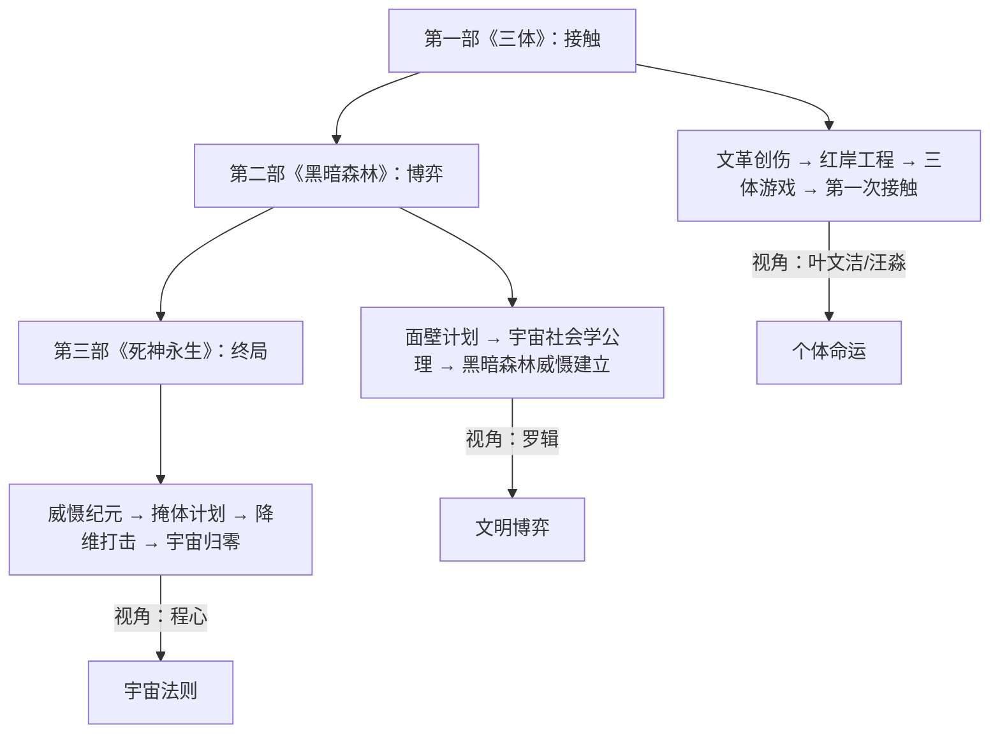

## 一、文学坐标定位

> [!abstract] 速览
> 《三体》三部曲（又称「地球往事」三部曲）由刘慈欣创作，包含《三体》（2006）、《黑暗森林》（2008）和《死神永生》（2010）三部。三部曲从文化大革命中一位天体物理学家的绝望之举开始，逐步展开人类文明与三体文明之间长达数百年的博弈，最终将视野拓展至整个宇宙的生存法则与宇宙的终极命运。2015年，《三体》英文版（刘宇昆译）获雨果奖最佳长篇小说，成为首部获此殊荣的非英语作品。

你需要首先理解《三体》在科幻文学谱系中的位置。在西方科幻的脉络中，阿西莫夫的《基地》系列建立了「心理史学」式的宏大文明叙事，阿瑟·克拉克的《2001太空漫游》展现了技术与神秘的交汇，斯坦尼斯拉夫·莱姆的《索拉里斯星》追问了人类认知的边界。刘慈欣的《三体》与这三条传统都有对话，但他提供了一个独特的贡献：==将宇宙社会学作为一个完整的公理体系提出==，并以此推导出文明间交互的终极逻辑。

在中国文学的维度上，《三体》的意义同样深远。它诞生于中国科幻的「第二次浪潮」——继80年代郑文光、叶永烈之后，以刘慈欣、王晋康、韩松为代表的新一代科幻作家重新将中国科幻推向世界。但《三体》的独特之处在于：它不仅是科幻文学，更是一部以科幻为载体的==文明史寓言==。文化大革命的创伤、冷战思维的延伸、全球化时代的信任危机——这些现实关怀被编织进宇宙尺度的叙事中，赋予了作品超越类型文学的厚度。

值得注意的是，刘慈欣的写作受到了苏联科幻传统（技术乐观主义与宏大叙事）和英美硬科幻传统（以物理定律为叙事基石）的双重影响，但他在此基础上注入了一种独特的==中国式生存焦虑==——这种焦虑来自一个后发现代化国家对「落后就要挨打」的深刻记忆。

---

## 二、叙事结构解析

> [!note] 三部曲的时间尺度与叙事策略
> 三部曲的时间跨度从20世纪60年代延伸至宇宙的终结（约10^18年后），空间范围从地球扩展至整个可观测宇宙。每一部的叙事策略各有不同，但共同构成了一个不断「推镜头」的过程——从个人命运到文明博弈，再到宇宙法则。

**第一部《三体》：悬疑与揭秘的双线叙事**

你会注意到第一部采用了一种类似侦探小说的结构。表层叙事是纳米科学家汪淼调查科学家自杀事件，深层叙事则通过叶文洁的回忆逐步揭开红岸工程的真相。两条线索交替推进，最终在「三体游戏」的虚拟世界中汇合。这种结构的精妙之处在于：它用悬疑的外壳包裹了一个关于==文明绝望==的内核——叶文洁向三体世界发送信号的那一刻，既是情节的高潮，也是整个三部曲悲剧的起点。

刘慈欣在第一部中做了一个大胆的决定：将文化大革命作为叙事的起点。这不仅仅是历史背景的设置，而是为整个三部曲的核心冲突提供了==心理动因==——叶文洁之所以向外太空发出邀请，根源在于她对人类文明已经彻底绝望。文革中父亲被迫害致死、母亲的背叛、好友的出卖——这些创伤累积成一个结论：人类无法自我救赎，需要外力介入。

**第二部《黑暗森林》：从悬疑到博弈论**

第二部的叙事结构发生了根本转变。悬疑消退，博弈论登场。面壁计划的设定本身就是一个极其精巧的叙事装置——四位面壁者需要制定只有自己知道的战略，而三体人的「智子」可以监控一切公开信息。这创造了一个独特的叙事情境：==真正的故事发生在沉默之中==。读者跟随罗辑从一个玩世不恭的社会学教授，逐步演变为掌握文明存亡的关键人物。

第二部的核心是宇宙社会学的两条公理和由此推导出的「黑暗森林」法则。这个推导过程本身就构成了叙事的高潮——它不是通过战斗或冒险来呈现的，而是通过==纯粹的思辨==来完成的。这在科幻文学中极为罕见，也体现了刘慈欣对读者智识的充分信任。

**第三部《死神永生》：从博弈到哲学**

第三部是三部曲中时间跨度最大、野心最宏的一部。叙事视角从罗辑转移到程心，这个选择引发了广泛争议。但你需要理解刘慈欣的意图：==程心不是作为一个「强角色」被塑造的，而是作为一种文明选择的具象化==。她代表了人类文明中「爱与同情」的那一面——这一面在宇宙的残酷法则面前一次又一次地做出了致命的选择。

第三部的叙事节奏是三部曲中最不均匀的——它在程心冬眠的间隔中跳跃式前进，每一次醒来都面对一个全新的时代。这种节奏感刻意制造了一种==时间的眩晕==，让你与程心一样，永远在追赶一个已经变化了的世界。

---

## 三、主题与意象网络

### 主题一：黑暗森林——宇宙的社会学隐喻

> [!tip] 黄金圈拆解
> - **Why**：刘慈欣为什么要构建「黑暗森林」理论？因为他试图回答费米悖论——如果宇宙中存在大量文明，为什么我们从未观测到任何迹象？刘慈欣的回答是：沉默本身就是答案。宇宙中的文明不是不存在，而是不敢暴露。
> - **How**：通过两条公理（生存是文明的第一需要；文明不断增长和扩张，但宇宙中的物质总量保持不变）加上「猜疑链」和「技术爆炸」两个概念，推导出任何暴露自身坐标的文明都将被消灭。
> - **What**：宇宙是一片黑暗森林，每个文明都是带枪的猎人，必须小心翼翼地潜行，因为「林中到处都有与他一样潜行的猎人」。

**文本细读**：「黑暗森林」法则的推导过程是第二部的核心段落。罗辑在叶文洁的启发下，从两条看似无害的公理出发，经过严密的逻辑推演，得出了一个令人毛骨悚然的结论。你需要注意这个推导的关键中间步骤——「猜疑链」。即使两个文明都是善意的，由于信息不对称和距离造成的沟通延迟，它们也无法确认对方的善意是真实的还是伪装的；更无法确认对方是否也在做同样的猜疑。这种递归式的不信任最终导致「先发制人」成为唯一理性的策略。

**概念网络**：「黑暗森林」法则与现实世界中的==博弈论==（尤其是囚徒困境）、国际关系中的==安全困境==、以及霍布斯的「一切人对一切人的战争」形成了深刻的互文。但刘慈欣将这些理论放大到了宇宙尺度，使其获得了一种新的力量——在地球上，囚徒困境可以通过重复博弈、制度建设和文化共识来部分化解；但在宇宙中，由于距离和时间的限制，这些机制全部失效。

**苏格拉底追问**：黑暗森林法则是否真的不可避免？如果一个文明发展出了远超其他文明的技术，它是否可以选择不遵循这个法则——比如建立一个宇宙范围的「治安体系」？刘慈欣在第三部中通过「歌者」文明的行为暗示了答案：即使是高等文明，也选择遵循黑暗森林法则，因为==在无限的宇宙中，你永远不知道是否存在比你更高的文明==。这形成了一个无限回归的猜疑链，使得法则在逻辑上无法被打破。

**费曼式共情**：想象你住在一栋无限大的公寓楼里，你不知道有多少邻居、他们在哪里、他们是否友好。你唯一知道的是：如果你大声说话，可能会招来危险；如果你敲邻居的门，你无法确定门后是朋友还是持枪的陌生人。最理性的策略是什么？保持沉默，锁好门，如果你发现了某个邻居的位置——在他发现你之前解决掉他。这就是黑暗森林。

---

### 主题二：技术与文明的辩证关系

> [!tip] 黄金圈拆解
> - **Why**：刘慈欣为什么如此执着于技术描写？因为在他的宇宙观中，技术不是文明的工具，而是文明的==本质度量==。一个文明的技术水平决定了它在宇宙生态中的位置，正如一个物种的适应能力决定了它在自然生态中的位置。
> - **How**：通过三体文明对人类的技术封锁（智子锁死基础物理研究）、人类在封锁下的挣扎与突破、以及高维文明对低维文明的降维打击，展现技术差距如何转化为生存权的剥夺。
> - **What**：从智子封锁到曲率驱动飞船，从二向箔到宇宙归零，技术成为决定文明生死的唯一变量。

**文本细读**：「智子」的设定是三部曲中最具想象力的技术构思之一。三体人将一个质子从高维展开为二维平面，在上面蚀刻电路，再折叠回微观尺度，使其成为一台拥有高维计算能力的超级计算机。智子被发射到地球后，可以干扰粒子加速器的实验结果，从而==在源头上锁死了人类的基础物理研究==。这个设定的精妙之处在于：它不是简单的武力压制，而是一种更深层的控制——阻止你获得理解宇宙的能力。

你需要注意「技术爆炸」这个概念在三部曲中的反复出现。三体人之所以恐惧人类，不是因为人类当前的技术水平，而是因为人类可能发生技术爆炸——在极短的时间内实现技术的几何级跃升。人类从农业文明到核武器只用了几百年，这在宇宙尺度上几乎是瞬间。==技术爆炸的存在使得任何文明都不敢轻视比自己弱小的文明==，这也是黑暗森林法则的重要支撑。

**概念网络**：技术与文明的关系在三部曲中构成了一个多层次的网络：「智子封锁」→「基础科学停滞」→「技术发展受限」→「文明生存受威胁」→「面壁计划（以策略弥补技术差距）」→「黑暗森林威慑（以毁灭为杠杆撬动平衡）」。这条链条揭示了一个深刻的洞见：==当技术差距无法弥合时，战略思维成为唯一的武器==。

**苏格拉底追问**：技术发展是否必然导向毁灭性武器的获得？在三部曲的宇宙中，答案似乎是肯定的——光粒、二向箔、质量点，每一种高级武器都是对物理定律的更深层操控。但这是否意味着技术进步本身是一种诅咒？刘慈欣似乎暗示了一个更微妙的答案：技术本身是中性的，但==在黑暗森林的生存压力下，技术必然被优先用于攻击和防御==，而非和平目的。这是一种结构性的悲剧——不是个体的恶意导致毁灭，而是系统的逻辑使毁灭成为必然。

**费曼式共情**：想象你和邻居住在一条街上，你们都在各自的车库里研发新技术。你发明了一把更好的锁，他发明了一把更好的枪。你发明了一面更坚固的墙，他发明了一枚穿墙的导弹。每一次技术进步都让你更安全，同时也让你的邻居更不安全——而他的不安全感会驱使他做出更激进的研发。这就是技术竞赛的逻辑，也是三体世界的缩影。

---

### 主题三：人性的极限测试——道德在宇宙尺度下的崩塌与重建

> [!tip] 黄金圈拆解
> - **Why**：刘慈欣为什么要在宇宙尺度下测试人性？因为他想探索一个根本问题：人类的道德体系究竟是普世真理，还是仅仅适用于地球这个特殊环境的生存策略？
> - **How**：通过将人类放入极端的生存困境——智子封锁、末日之战、降维打击——观察人类的道德底线在何种压力下会发生变形或断裂。
> - **What**：从叶文洁的「人类需要拯救」到罗辑的「我可以毁灭两个世界」，再到程心的「我无法按下那个按钮」，三部曲呈现了人性在极端条件下的三种不同回应。

**文本细读**：三部曲中最具冲击力的道德困境发生在第二部的末尾和第三部的开头。罗辑建立了黑暗森林威慑——他手中握着一个按钮，一旦按下就会向宇宙广播太阳系的坐标，引来外星文明的打击，地球和三体世界同归于尽。这是一个==以自杀式攻击为基础的和平==。它有效，但它的有效性建立在一个可怕的前提之上：执剑人必须真的愿意毁灭全人类。

当执剑权从罗辑转移到程心的那一刻，威慑的基础瓦解了。三体人精准地判断出程心不会按下按钮——因为她「爱人类」，而==真正的爱不允许她毁灭她所爱的对象==。这个判断正确了。程心在三体舰队发起攻击时选择了不发射，地球因此沦陷。

刘慈欣在这里提出了一个极其尖锐的问题：在文明存亡的关头，==仁慈是一种美德还是一种罪过==？程心的选择从个人道德的角度无可指摘，但从文明存续的角度却是灾难性的。这种矛盾无法通过简单的道德判断来化解。

**概念网络**：人性这一主题通过三个核心人物形成了一个三角结构——叶文洁代表「对人性的绝望」，罗辑代表「对人性的超越」（他将自己异化为一个理性的威慑工具），程心代表「对人性的坚守」。三者不是对错的关系，而是==人类面对终极困境时三种不可调和的选择==。

> [!warning] 文本细读：程心的争议
> 你可能注意到程心在读者中引发了极大的争议，甚至被很多读者视为「圣母」式的角色加以批评。但如果你仔细阅读刘慈欣的文本，会发现他对程心的态度远比简单的批判要复杂。程心不是一个「犯错」的角色——她是一个==忠实于人类核心价值观的角色==，而这些价值观恰恰在宇宙生存法则面前显得格格不入。刘慈欣真正要追问的不是「程心做错了吗」，而是「一个文明如果必须放弃自己的核心价值观才能生存，那它还是同一个文明吗？」

**苏格拉底追问**：如果罗辑一直担任执剑人，地球就安全了吗？表面上看是的，但刘慈欣暗示了一个更深层的问题——长期处于威慑状态的文明会发生什么？第三部描写了威慑纪元中人类社会的变化：人类变得越来越「女性化」和温和，战斗意志被和平年代消磨殆尽。这暗示了一个悖论：==威慑的成功本身会消解维持威慑的能力==。和平导致软弱，软弱导致威慑失效，威慑失效导致毁灭。

**费曼式共情**：想象你手中握着一个按钮，按下去你和你的敌人同归于尽，不按你的敌人可能会攻击你但也可能不会。冷静的理性告诉你：只要你展示出「我真的会按」的姿态，敌人就不敢轻举妄动。但这意味着你每一天都要准备好与世界同归于尽——你必须让自己真正相信「按下去也没关系」。你能做到吗？你能做到多久？

---

### 主题四：维度与降维——物理学作为叙事隐喻

> [!tip] 黄金圈拆解
> - **Why**：刘慈欣为什么选择「维度」作为核心意象？因为维度是物理学中最根本的概念之一，它决定了存在本身的形态。用维度作为武器（降维打击），就是用==存在的基本条件==作为战场。
> - **How**：从智子的高维展开（将质子在不同维度间操作），到二向箔的降维打击（将三维空间压缩为二维），再到宇宙从十维逐步跌落到当前维度的历史，「维度」贯穿了整个三部曲的物理想象。
> - **What**：三维太阳系被二向箔「拍扁」为二维平面——一切物质、一切生命、一切意义在维度的坍缩中化为一幅永恒的画。

**文本细读**：二向箔降维打击是三部曲中最具视觉冲击力的场景。你需要注意刘慈欣在描写这一过程时的笔法——他没有选择恐怖或悲壮的基调，而是赋予了这个毁灭过程一种==诡异的美感==。三维世界向二维跌落时，一切物质在二维平面上展开为精细的图案，「像一幅无限精细的油画」。太阳系的毁灭不是爆炸式的，而是缓慢的、静默的、甚至是优雅的。这种美学处理使得毁灭获得了一种超越性——它不再只是灾难，而是宇宙自身的一种形态变换。

「维度」在三部曲中还有一层更深的含义：宇宙的维度不是天然的，而是==被战争消耗掉的==。第三部暗示，宇宙最初是十维的，但在漫长的文明战争中，高维武器的使用导致宇宙的维度一次又一次降低。当前宇宙的三维状态本身就是无数次「降维打击」的遗迹。这个设定将整个宇宙的物理结构重新定义为==文明战争的废墟==——你所生活的三维世界，不过是一个千疮百孔的战场。

**概念网络**：「维度」这个意象与「黑暗森林」法则形成了深层联系——降维打击之所以被使用，正是因为黑暗森林法则要求文明消灭任何潜在威胁。而降维打击的不可逆性又加剧了黑暗森林的残酷性：每一次降维都永久性地改变了宇宙的基本结构，使得所有文明（包括攻击者自身）的生存空间都在缩小。这形成了一个==宇宙级别的公地悲剧==。

**苏格拉底追问**：如果宇宙的维度是有限的、可消耗的资源，那么降维打击是否终将导致宇宙的毁灭？第三部给出了肯定的回答——当维度降至零维（大坍缩），宇宙将重新回到奇点。但这里产生了一个更深的问题：如果所有文明都知道降维打击最终会毁灭宇宙（包括自己），为什么还要使用？答案回到了黑暗森林法则：==在猜疑链中，没有文明敢于率先放弃武器==。即使知道共同毁灭是最终结果，个体的理性选择仍然是优先保证自己的短期生存。

**费曼式共情**：想象你住在一栋100层的大楼里，每个住户都可以拆掉一层楼的地板来获取建筑材料（比喻消耗维度来制造武器）。每拆掉一层，大楼就矮一层，所有人的生存空间都在缩小。理性告诉每个人：不应该拆楼。但如果你不拆，你的邻居可能会拆，然后用获得的材料来对付你。所以你先拆了。每个人都这么想，大楼越来越矮，直到无楼可拆。

---

### 主题五：时间——作为终极武器与终极审判

> [!tip] 黄金圈拆解
> - **Why**：刘慈欣为什么如此强调时间尺度？因为时间是三部曲中真正的主角——不是任何文明、任何个人，而是时间本身在塑造着一切。当你将视野拉长到亿万年的尺度，所有人类的挣扎都变得微不足道，同时也变得更加珍贵。
> - **How**：通过冬眠技术、光速飞行的时间膨胀效应、以及程心的多次跨时代跳跃，让读者切身感受到时间的无情流逝。
> - **What**：从「虫子不会被战胜」的几百年到宇宙终结的10^18年，时间在不同尺度上反复出现，成为文明兴衰的唯一恒定背景。

**文本细读**：三部曲中最令人感到时间之重的段落，是第三部中程心一次又一次从冬眠中醒来的体验。每一次苏醒，她面对的都是一个完全陌生的世界——旧的朋友已经老去或死去，社会结构已经剧变，甚至人类的形态本身都在变化。这种体验与你作为读者的感受形成共振：你也在跟着程心「跳跃」，在每一次跳跃中失去对「当下」的把握。

刘慈欣对时间最大胆的运用出现在结尾——程心和关一帆在小宇宙中度过了一段不知时间长度的生活，然后面临一个选择：是否将小宇宙中的物质归还给大宇宙，以便宇宙有足够的质量重新坍缩并诞生新的宇宙？这是一个==将个人存在与宇宙命运直接挂钩==的终极选择——你的生存所占据的那一点点质量，可能决定了下一个宇宙是否能够诞生。

**概念网络**：时间与「黑暗森林」、「技术」和「人性」三个主题都有交汇。「技术爆炸」是时间压缩的产物；「威慑失效」是时间消磨的结果；「降维打击」是时间积累的废墟。时间还与[[《活着》]]中福贵的时间体验形成有趣的对照——福贵在数十年中承受个人的苦难，程心在数百万年中见证文明的兴衰。尺度不同，但那种「被时间推着走」的无力感是相通的。

**苏格拉底追问**：如果程心可以不冬眠，而是在每一个时代完整地生活，她的选择是否会不同？刘慈欣通过冬眠的设定剥夺了程心「与时代共同成长」的机会——她永远是一个外来者，永远在用旧时代的价值观面对新时代的困境。这是否暗示：==人类的价值观只能在特定的历史条件下才有效？==

**费曼式共情**：想象你每隔100年醒来一次，每次只醒来一天。第一次醒来，你的城市还在但住的人已经换了；第二次醒来，你的城市已经消失了但国家还在；第三次醒来，国家已不存在但地球还在；第四次醒来，地球已经面目全非但太阳还在；第五次醒来，太阳已经熄灭了。你在每一次清醒的那一天里，能做什么？能改变什么？

---

## 四、人物分析

> [!info] 人物系统概览
> 三部曲的人物设计遵循了一个隐含的原则：==每个核心人物都是一种文明选择的人格化==。刘慈欣不以心理复杂性见长（这也是他常被批评的方面），但他的人物在概念层面具有极高的密度——每个人物都承载着一个哲学命题。

**叶文洁——绝望的先知**

叶文洁是三部曲的「第一推动力」。你需要理解她不是一个反派，而是一个==被历史碾碎后用绝望回应世界的知识分子==。文革中目睹父亲被批斗致死、在生态恶化的大兴安岭工作、被人反复出卖——这些经历让她得出了一个结论：人类文明已经病入膏肓，唯一的希望在于外部力量的介入。她向三体世界发出的信号，是一封==写给宇宙的求救信==，也是一纸对人类的判决书。

叶文洁的悲剧性在于：她的判断在个人经验的层面上是有充分理由的，但她将个人经验推广为对整个文明的判断，犯了以偏概全的错误。更深层的悲剧是：她所邀请来的「拯救者」（三体文明），比她所厌恶的人类社会还要冷酷得多。

**罗辑——从虚无到责任**

罗辑是三部曲中变化弧度最大的角色。初登场时，他是一个玩世不恭的社会学教授，享乐主义、逃避责任、甚至有些油滑。被选为面壁者后，他的第一反应不是担负使命，而是利用面壁者的特权为自己营造一个田园牧歌式的生活——在北欧的别墅里与想象中的完美女性共度时光。

但当他最终理解了宇宙社会学的真相后，一切都变了。罗辑从一个逃避者变成了==人类文明的独行守夜人==。在他担任执剑人的54年里，他独自承受着「随时可能毁灭两个世界」的压力，从一个年轻人变成了一个面如死灰的老人。这个转变不是英雄式的觉醒，而是一种==被真相压垮后的无奈承担==。

**程心——爱的重量与代价**

程心是三部曲中最具争议的角色。她的每一次重大决策——放弃威慑权、选择掩体计划而非光速飞船计划——都基于人道主义的考量，但每一次都导致了灾难性的后果。刘慈欣通过程心探讨了一个核心问题：==在生存与道德之间，是否存在第三种选择？==

你需要注意，程心不是一个软弱的角色——她敢于担任执剑人这件事本身就需要巨大的勇气。她的问题不在于缺乏勇气，而在于她的勇气来源于「爱」，而「爱」恰恰是威慑逻辑中最大的弱点。一个爱人类的人不可能真心按下毁灭全人类的按钮——这是逻辑上的必然，也是程心无法跨越的鸿沟。

**章北海——信念的暴力**

章北海是三部曲中最具「决断力」的角色。作为一名军人，他在了解了三体舰队的实力后，做出了一个冷酷的判断：人类舰队不可能在正面交战中取胜，唯一的出路是==逃跑==。为了实现这个目标，他暗杀了阻碍恒星际航行研究方向的科学家，伪装了自己的立场，隐忍数十年，最终在末日之战中劫持飞船逃离太阳系。

章北海的可怕之处在于他的==信念与行动的完全一致==。他从不犹豫、从不后悔，因为他已经在逻辑上说服了自己：为了文明的延续，任何代价都是值得的。他是罗辑的一面镜子——两人都看穿了现实，但罗辑选择威慑，章北海选择逃亡。

**「歌者」——宇宙冷漠的化身**

「歌者」是第三部中出现的高等文明个体，他/她在清理宇宙坐标时向太阳系投掷了二向箔。刘慈欣刻意用一种==漫不经心的语调==描写这个行为——对歌者来说，毁灭太阳系就像你顺手清理桌上的灰尘。这种漫不经心比任何恶意都更令人毛骨悚然，因为它揭示了一个事实：==你的存亡对于宇宙来说毫无意义==。

---

## 五、风格与语言

> [!note] 刘慈欣的语言特征
> 刘慈欣的语言风格在中国当代文学中是独特的——它不追求文学性的精致，而是追求一种==工程师式的精确和宏大==。

**「大」与「小」的张力**

刘慈欣最擅长的修辞手法是==尺度的突然跳跃==。他可以在一个段落中从一个人的面部表情跳到整个银河系的结构，从一滴眼泪跳到一个文明的覆灭。这种跳跃制造了一种持续的眩晕感——你永远无法安定在一个舒适的叙事尺度上。

比如描写降维打击时，镜头从程心的个人视角开始，逐渐拉远到太阳系的全景，最终退到以光年为单位的距离。人类的挣扎在这个拉远的过程中变得越来越小，最终消失在二维平面的图案中。这种==电影式的镜头语言==是刘慈欣叙事的标志。

**硬科幻的诗意**

刘慈欣常被归类为「硬科幻」作家，但他的文字中时常出现一种独特的诗意——这种诗意不来自修辞的华丽，而来自==概念本身的壮美==。当他描写宇宙的黑暗、维度的坍缩、光速的壁垒时，物理概念本身就携带着一种超越语言的力量。

这种「概念诗意」与传统文学中的「语言诗意」形成了有趣的对比。余华的诗意来自叙述节奏的克制，莫言的诗意来自语言的狂欢，而刘慈欣的诗意来自==思想实验的极致推演==。

**对话的功能化**

刘慈欣的人物对话往往承载着密集的信息传递功能，而非展现人物性格的微妙差异。这是他最常被批评的方面——人物对话有时像科学论文的口头版本。但你需要理解，这种「功能化对话」与他的叙事目标是一致的：在刘慈欣的宇宙中，==重要的是思想和概念，而非个体的情感波动==。罗辑推导黑暗森林法则的那段独白，本质上是一篇社会学论文，但它在叙事的语境中获得了远超学术论文的力量——因为这个推导直接决定了文明的存亡。

---

## 六、文学批评多视角

**科幻文学视角**

从科幻文学的传统来看，《三体》的核心贡献在于将==费米悖论转化为叙事动力==。在此之前，科幻文学对外星文明的想象主要分为两类：友好的（如克拉克的《童年的终结》）或敌对的（如威尔斯的《世界大战》）。刘慈欣提供了第三种可能：==不是友好或敌对，而是冷漠==。在黑暗森林中，文明之间的关系不是合作或战争，而是回避——不是因为不想交流，而是因为交流本身就是死刑。

**后殖民视角**

从后殖民批评的角度来看，《三体》可以被解读为一个关于==文明等级与技术压制==的寓言。三体文明对人类的智子封锁，可以与殖民者对被殖民者的知识封锁形成对照。当三体人说「你们是虫子」时，这种话语暴力与殖民话语中对「落后文明」的贬抑是同构的。而人类的回应——「虫子从来没有被战胜过」——则是一种后殖民式的抵抗宣言。

**女性主义视角**

程心这个角色在女性主义批评中具有复杂的意义。一方面，她是三部曲中唯一的女性核心视角人物，承担了「代表全人类」的重量。另一方面，她被赋予的特质——温柔、同情、母性——恰恰是传统性别刻板印象中的「女性特质」。当这些特质在宇宙生存法则面前「失败」时，文本是否暗示了==「阳刚」理性优于「阴柔」感性==？这是一个值得深思的问题。

刘慈欣本人可能无意做出这样的价值判断——第三部中人类社会整体的「女性化」趋势被描写为威慑纪元和平年代的必然产物，而非对女性特质的贬低。但文本的效果与作者的意图之间往往存在差距，这正是文学批评的空间所在。

**存在主义视角**

从存在主义哲学的角度来看，《三体》探讨了一个根本问题：在一个==无意义的宇宙==中，文明的存在是否有价值？黑暗森林法则揭示了一个冷酷的宇宙图景——没有神明、没有正义、没有高于生存的价值。每个文明都孤独地漂浮在黑暗中，唯一能做的就是尽可能长久地存在下去。

但刘慈欣没有止步于虚无主义。三部曲的结尾——程心在小宇宙中留下的那个生态球——暗示了一种==微弱但顽固的希望==：即使在宇宙的终结面前，生命的种子仍然在被保存和传递。这与加缪笔下西西弗斯推石上山的意象形成呼应——==明知无意义，仍然选择行动==。

---

## 七、跨时空共鸣

**与当代世界的共鸣**

三部曲中最具现实映射力的概念是「猜疑链」和「技术爆炸」。在当今国际关系中，核威慑的逻辑与黑暗森林威慑高度相似——和平建立在「确保相互毁灭」（MAD）的基础上。当一方的威慑可信度下降时，和平就变得脆弱。

「技术爆炸」的概念则与当代对人工智能发展的焦虑直接相关。当一种技术可能在极短时间内实现几何级增长时，所有现有的战略平衡都会被打破——这正是人们对AI技术失控的核心担忧。

**与个体生命的共鸣**

在个人层面，三部曲提供了一种思考框架：==你如何在不确定性中做出决策？==每个核心人物面临的困境——信息不完整、后果不可逆、时间不允许犹豫——都是日常生活中决策困境的放大版。罗辑建立威慑的过程，本质上是一个人在极端不确定性中寻找「杠杆支点」的故事；程心的失败，则提醒你：==善良的意图不能替代对现实逻辑的理解==。

**与中国文化的共鸣**

三部曲深层植根于中国的历史记忆和文化心理。「落后就要挨打」的焦虑、对「外部威胁」的敏感、在危机中「隐忍待机」的智慧（章北海）、对「集体生存」优先于「个体权利」的思维习惯——这些文化因子在宇宙尺度的叙事中获得了新的表达。

---

## 八、费曼终极检验

> [!success] 用最简单的语言，向一个从未读过《三体》的人解释这部作品的核心

如果你必须用最简单的话向一个朋友解释《三体》三部曲，你可以这样说：

想象宇宙是一片黑暗的森林。每一个文明——包括人类——都是这片森林中的一个猎人。你不知道森林里有多少猎人，也不知道他们在哪里。你只知道一件事：如果你暴露了自己的位置，你可能会被其他猎人射杀。所以每个人都保持沉默，小心翼翼地在黑暗中移动。

这部小说讲的就是：人类不小心暴露了自己的位置，然后花了几百年时间试图活下来。在这个过程中，你会看到人类最好的品质（勇气、智慧、爱）和最坏的处境（被锁死技术、被降低维度、被迫在自杀式威慑中苟活）之间的碰撞。最终你会发现，==活下来需要的东西，往往与你珍视的东西相矛盾==。

这部小说不是在告诉你宇宙真的是这样的。它是在问你一个问题：==如果宇宙真的是这样的，你愿意做什么来生存？你又愿意放弃什么？==

---

## 延伸阅读

- [[《基地》]]（阿西莫夫）——心理史学与文明周期：另一种宏大叙事的科幻传统
- [[《2001太空漫游》]]（阿瑟·克拉克）——技术与神秘的交汇：克拉克对未知文明的想象方式
- [[《索拉里斯星》]]（斯坦尼斯拉夫·莱姆）——不可理解的他者：莱姆对外星智慧的独特思考
- [[《童年的终结》]]（阿瑟·克拉克）——文明的终结与超越：另一种关于文明进化的想象
- 《自私的基因》（理查德·道金斯）——生存竞争的进化论基础：理解黑暗森林法则的生物学背景
- [[《利维坦》]]（托马斯·霍布斯）——「一切人对一切人的战争」：黑暗森林法则的哲学先驱
- 《囚徒困境》（威廉·庞德斯通）——博弈论通识：理解猜疑链的数学基础
- [[《活着》]]（余华）——同为中国当代文学杰作，以完全不同的尺度探讨「生存」的主题
