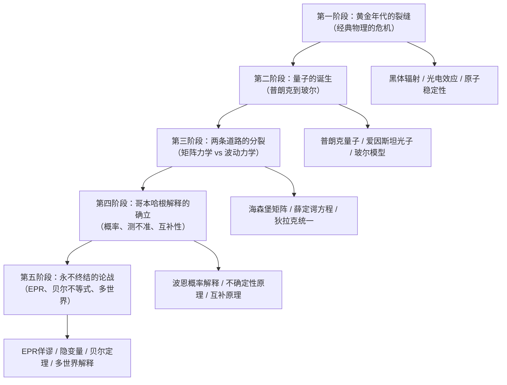
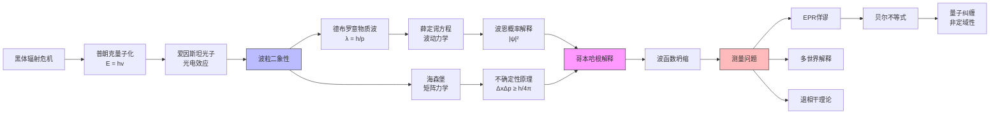
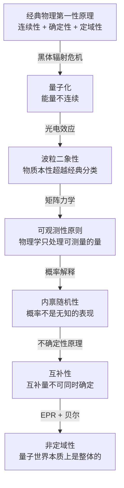
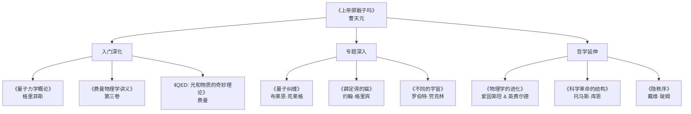

# 《上帝掷骰子吗：量子物理史话》深度拆解

## 一、科学坐标定位

> [!abstract] 速览
> 《上帝掷骰子吗：量子物理史话》由曹天元（笔名）撰写，初版于2006年，后多次修订再版。全书以编年体与群像叙事相结合的方式，讲述了从19世纪末经典物理危机到20世纪量子力学建立的完整历程。书名取自爱因斯坦的名言"上帝不掷骰子"（God does not play dice），全书的核心张力正是围绕这句话展开：==物理学的根基究竟是确定性的，还是概率性的？==

你需要首先理解这本书在科普谱系中的独特位置。在量子物理的科普作品中，霍金的《时间简史》侧重宇宙学，布莱恩·格林的《优雅的宇宙》聚焦弦论，费曼的《QED》以极简方式展示量子电动力学的核心逻辑。曹天元的贡献在于另一个维度：他选择了==以"人"为经、以"思想冲突"为纬==的叙事策略。这不是一本解释量子力学"是什么"的教科书，而是一部追问量子力学"怎么来的"以及"它意味着什么"的==思想史==。

在学科坐标上，本书横跨[[物理学]]、[[哲学]]（特别是[[科学哲学]]和[[认识论]]）、[[科学史]]三大领域。它与库恩的[[范式革命]]理论形成有趣的互文——量子力学的诞生正是库恩所说的"科学革命"的最佳范例：旧范式（经典物理）遭遇无法解释的反常现象（黑体辐射、光电效应），新范式（量子力学）在激烈的思想交锋中取代旧范式，而这个替代过程远非一帆风顺。

值得注意的是，曹天元以中文写作科普的选择本身就具有意义。中文世界长期缺乏兼具科学准确性和文学可读性的量子物理通识读物，而本书填补了这个空白。曹天元的文笔兼具幽默感与严肃性，他常以武侠小说式的笔法描写物理学家之间的思想"对决"，使得抽象的物理概念获得了叙事的力量。

---

## 二、知识架构地图

全书按照时间线索可以划分为==五个思想阶段==，每个阶段对应量子力学发展的一个关键转折：

**核心命题**：经典物理学建立在==决定论==的基石上——如果你知道一个系统在某一刻的全部信息，你就能精确预言它在未来任意时刻的状态。量子力学从根基上颠覆了这个信条：==在微观世界，概率不是对无知的承认，而是自然的本质属性==。这不仅是物理学的革命，更是人类认识论的革命。

---

## 三、逐章深度拆解

### 主题一：「经典物理的黄昏——两朵乌云」

> [!tip] 对应内容：全书开篇，经典物理的危机

**【布鲁姆认知阶梯】**

- **记忆**：1900年前后，经典物理学的大厦看似已经完工。牛顿力学统治了天上地下的运动，麦克斯韦方程组统一了电与磁，热力学三大定律坐镇能量世界。开尔文勋爵在1900年的一次演讲中说，物理学的天空"晴空万里"，只有"两朵小乌云"——以太漂移实验（迈克尔逊-莫雷实验）和黑体辐射的紫外灾难。
- **理解**：这两朵"小乌云"并非无关紧要的技术细节，而是经典物理框架的==结构性裂缝==。以太漂移问题最终催生了狭义相对论，而黑体辐射问题直接导致了量子论的诞生。所谓"紫外灾难"指的是：按照经典物理的瑞利-金斯公式计算，一个黑体在高频段（紫外方向）辐射的能量将趋于无穷大——这在物理上是荒谬的。
- **应用**：这段历史给你的方法论启示是：==一个理论体系中看似微小的"反常"，往往是革命的种子==。在商业、技术、社会各领域，那些无法被现有框架解释的"异常数据点"值得格外关注。
- **分析**：经典物理的根本假设是连续性——能量可以无限细分，物理量的变化是平滑的、连续的。正是这个假设导致了紫外灾难。量子论要打破的，恰恰就是这个深入骨髓的"连续性信仰"。
- **评价**：曹天元在叙述这段历史时的精妙之处在于，他让你感受到当时物理学家的==心理状态==——不是焦虑，而是自满。正是这种自满使得量子论的诞生更加戏剧化：它不是在绝望中被呼唤出来的，而是在胜利的庆典上意外闯入的。

**【第一性原理回溯】**

经典物理的第一性原理可以浓缩为三条：==连续性==（物理量可以取任意值）、==确定性==（知道初始条件就能预测未来）、==实在性==（物理量在被测量之前就客观存在）。量子力学将这三条全部击碎：能量是不连续的（量子化），未来是不可精确预测的（不确定性），物理量在测量之前不具有确定的值（哥本哈根解释）。

**【费曼式类比】**

想象你站在一座宏伟的大厦前——柱子是牛顿力学，穹顶是麦克斯韦方程，地基是热力学。你对它满意极了，觉得只需要再刷两层漆（解决两个小问题）就完美了。结果你拿起刷子刮掉旧漆，发现墙体下面是裂缝——不是表面的裂缝，而是从地基贯穿到穹顶的结构性裂缝。这座大厦没有倒塌（经典物理在宏观领域仍然有效），但你已经知道，它无法再向上加盖了。你需要在旁边建一座全新的建筑。

---

### 主题二：「普朗克的绝望之举——量子的诞生」

> [!tip] 对应内容：量子概念的提出

**【布鲁姆认知阶梯】**

- **记忆**：1900年12月14日，马克斯·普朗克在德国物理学会宣读了他的论文。为了解决黑体辐射问题，他提出了一个假设：==能量不是连续的，而是以一份一份的最小单位（量子）发出和吸收的==。每一份能量的大小等于 E = hv，其中 h 是普朗克常数（约6.626 x 10^-34 焦耳·秒），v 是频率。
- **理解**：普朗克本人对自己的假设深感不安。他不是一个革命者，而是一个==保守的经典物理学家==。他引入量子假设只是为了让数学公式与实验数据吻合，他试了多年想把这个假设"解释掉"——把它还原为经典物理的某种特殊情况——但始终失败。曹天元精确地捕捉到了这个悖论：量子革命是由一个反对革命的人发起的。
- **应用**：普朗克常数 h 的意义在于：它定义了自然界的==最小行动单位==。在微观世界，没有任何物理过程可以交换小于 h 的行动量。这就像自然界为能量交换设定了一个"最低消费"——你不能点半份菜。
- **分析**：为什么连续性假设在宏观世界工作得那么好，到了微观就失效？因为 h 极其微小。在宏观尺度上，能量的"颗粒感"小到完全察觉不到，就像你看一片沙滩觉得它是光滑的，只有拿放大镜才能看到每一粒沙。
- **评价**：曹天元将1900年12月14日称为"量子力学的生日"。但他也提醒你注意，一个新概念从被提出到被真正理解，中间可能隔着==整整一代人的时间==。普朗克提出了量子，但真正理解量子意味着什么的，是后来的爱因斯坦、玻尔和海森堡。

**【第一性原理回溯】**

普朗克做了一件在科学史上极为罕见的事：他==从结果倒推假设==。他先通过插值得到了一个与实验完美吻合的辐射公式，然后追问这个公式背后需要什么样的物理假设。答案是能量量子化。这是一种"数学先行"的发现方式——数学告诉你答案，但你还不理解它为什么是对的。

**【费曼式类比】**

想象你在数地板砖的数量。在一间很大的房间里，你远远看去觉得地面是连续的整体。但你走近蹲下来看，地面是由一块一块瓷砖拼成的——不存在"半块瓷砖"。普朗克告诉你，能量就像地板砖：远看是连续的（经典物理），近看是一块一块的（量子物理）。而 h 就是每块"能量瓷砖"的最小尺寸。

---

### 主题三：「爱因斯坦的光子——粒子的复仇」

> [!tip] 对应内容：光电效应与波粒二象性的序幕

**【布鲁姆认知阶梯】**

- **记忆**：1905年，爱因斯坦发表了关于光电效应的论文。他提出：光不仅在发射和吸收时表现为量子，==光本身就是由一个个不可分割的能量粒子（光子）组成的==。每个光子的能量为 E = hv。当光照射金属表面时，每个光子把全部能量一次性传递给一个电子，如果这份能量大于电子逃出金属表面所需的最低能量（逸出功），电子就被打出来。
- **理解**：爱因斯坦的光子假说比普朗克的量子假说激进得多。普朗克只是说能量的==发射和吸收==是量子化的（像自动售货机只接受一元硬币），但光在传播过程中仍然可以是连续的波。爱因斯坦则说不——==光本身就是粒子==。这直接挑战了自托马斯·杨的双缝实验（1801）以来光的波动理论已经统治了一个世纪的事实。
- **应用**：光电效应是现代光电器件（太阳能电池、光电探测器、CCD传感器）的物理基础。爱因斯坦获得1921年诺贝尔物理学奖，正是因为对光电效应的解释——注意，不是因为相对论。
- **分析**：这里出现了物理学史上最诡异的局面：==光既是波又是粒子==。杨氏双缝实验无可辩驳地证明了光是波（干涉条纹只有波才能产生），光电效应无可辩驳地证明了光是粒子（能量的一次性转移只有粒子才能解释）。两个实验都是正确的，但它们的结论看似互相矛盾。
- **评价**：曹天元在这里的叙事技巧值得注意——他把波粒二象性的困惑呈现为一场"侦探悬疑"。光究竟是什么？每一个新实验都像一条新线索，但线索之间互相矛盾。读者被拉入了与20世纪初物理学家同样的困惑之中。
- **创造**：你可以把波粒二象性视为一个更广泛的认识论教训：==人类构造的概念范畴（"波"和"粒子"）可能不足以描述自然的真实面貌==。自然不需要符合你的分类系统。

**【第一性原理回溯】**

爱因斯坦将普朗克的量子假说从"数学技巧"提升为"物理实在"。普朗克说"能量是一份一份交换的"只是计算工具；爱因斯坦说"光确实由一颗一颗光子组成"是关于世界本身的陈述。==从数学形式到物理实在的跳跃，是科学史上反复出现的关键时刻==。

**【费曼式类比】**

想象你往池塘里扔一颗石子。你看到涟漪向外扩散——这是波。但如果你用超高速摄像机放大池塘表面，你发现涟漪不是连续的水面起伏，而是由无数个微小的水珠在跳跃——这就是波粒二象性的类比。当然这个类比有严重的局限：水珠和水波是不同尺度的同一种东西，而光子和电磁波的关系远比这深刻——它们是同一个实体的两种显现方式。

---

### 主题四：「玻尔模型——原子内部的量子跳跃」

> [!tip] 对应内容：玻尔的原子理论

**【布鲁姆认知阶梯】**

- **记忆**：1913年，尼尔斯·玻尔提出了他的原子模型。核心要点有三：一、电子只能在特定的"允许轨道"上运行，每条轨道对应一个确定的能量值；二、电子在这些轨道上运行时==不辐射能量==（这违反了经典电动力学）；三、电子可以从一个轨道"跳跃"到另一个轨道，同时吸收或释放一个光子，光子的能量恰好等于两条轨道的能量差。
- **理解**：玻尔模型解决了一个经典物理完全无法回答的问题：==原子为什么是稳定的？==按照经典电动力学，绕核旋转的电子应该持续辐射电磁波，失去能量，在极短时间内坠入原子核。然而现实中原子是稳定的。玻尔的解答是简单粗暴的——他直接规定电子在特定轨道上"不辐射"，不给出经典物理的理由。
- **应用**：玻尔模型可以精确计算氢原子的光谱线（巴尔末系、赖曼系等），理论值与实验值的吻合令人惊叹。但它对更复杂的原子（氦及以上）的计算却失败了。
- **分析**：玻尔模型的==深层困难==在于它是一个"混血"理论——半经典半量子。它保留了"电子绕核旋转"的经典图像，但硬塞进了量子化条件。电子的"跳跃"是瞬时的、不连续的，没有"中间过程"——它不是从一个轨道"飞"到另一个轨道，而是在一个轨道上消失、在另一个轨道上出现。这种不连续性在经典物理中完全没有先例。
- **评价**：曹天元精彩地描述了玻尔模型带来的心理冲击。"量子跳跃"（quantum jump）这个概念至今仍是日常语言中"突变"的隐喻。但它最初的含义比隐喻更激进：它意味着==自然界中存在不可追踪的过程==——你无法问"电子在跳跃过程中在哪里"，因为跳跃没有过程。

**【第一性原理回溯】**

玻尔模型的第一性原理是==量子化条件==：角动量只能取 h/2π 的整数倍。这条规则不是从更深层的原理推导出来的——它是玻尔"猜"出来的，一个凑出来的天才猜想。后来的德布罗意波假说提供了一个更深层的理解：电子也是波，它在轨道上必须形成驻波，驻波的条件恰好给出了玻尔的量子化规则。

**【费曼式类比】**

想象一个只有特定楼层可以停靠的电梯：你可以在1楼、2楼、3楼出入，但不能停在1.5楼。电子在原子中就像这部电梯——只有特定的"能量楼层"是允许的。更奇怪的是，这部电梯在楼层之间移动时==没有中间过程==：它不是"上升"或"下降"，而是在1楼消失、在3楼出现。你按下按钮，门关了（1楼），门开了（3楼），中间什么都没发生。

---

### 主题五：「德布罗意的大胆假说——物质也是波」

> [!tip] 对应内容：物质波假说与实验验证

**【布鲁姆认知阶梯】**

- **记忆**：1924年，法国贵族路易·德布罗意（Louis de Broglie）在他的博士论文中提出：既然光（传统上认为是波）可以表现为粒子（光子），那么==粒子（如电子）也应该表现为波==。他给出了物质波的波长公式：λ = h/p，其中 p 是粒子的动量。
- **理解**：德布罗意的推理优美到令人屏息。他的逻辑是对称性——如果自然界在光身上展现了波粒二象性，那么按照对称性原则，物质粒子也应该具有波动性。这不是实验驱动的发现，而是==纯粹的理论直觉==。
- **应用**：1927年，戴维森和革末通过电子衍射实验证实了德布罗意波的存在——电子束打到晶体上形成的衍射图样，与X射线（已知是波）的衍射图样完全一致。这个实验直接导致了电子显微镜的发明。
- **分析**：德布罗意波假说解释了玻尔模型中量子化条件的"为什么"。电子轨道之所以只能取特定的半径，是因为电子的物质波必须在轨道上形成==驻波==——就像吉他弦只能振动出特定的谐波频率。不是整数个波长的轨道，电子波会自我干涉抵消，因此不能存在。
- **评价**：曹天元对这段历史的叙述充满了对称美感。他指出，德布罗意论文的审查委员会面临一个尴尬的局面：论文太大胆，没人敢轻易通过。最后是爱因斯坦读了论文后写信表示支持，德布罗意才获得了博士学位。这个细节揭示了科学共同体中==权威认可==在创新传播中的关键作用。

**【第一性原理回溯】**

德布罗意的第一性原理是==自然界的对称性==。如果波动性和粒子性是物理实体的普遍属性，那么这种二象性不应该只属于光，而应该属于一切物质。这个对称性论证在物理学史上反复出现（麦克斯韦的位移电流、狄拉克的反物质预言），它的威力在于：==当你发现理论中存在不对称时，你应该怀疑是理论不完备，而不是自然界不对称==。

**【费曼式类比】**

你知道水波可以绕过障碍物、发生衍射和干涉。德布罗意说，电子也能做到这些。这就像发现你的棒球（你一直以为它是硬邦邦的实心球）在某些条件下居然能像水波一样绕过墙角、产生干涉条纹。区别在于：棒球的物质波波长极其微小（约10^-34米），远远小于任何可观测的尺度，所以你永远看不到棒球的波动行为。只有极小的粒子（电子、中子等），它们的波长才大到可以被观测到。

---

### 主题六：「矩阵力学 vs 波动力学——双龙争霸」

> [!tip] 对应内容：海森堡与薛定谔的两条路径

**【布鲁姆认知阶梯】**

- **记忆**：1925年，维尔纳·海森堡在赫尔戈兰岛度假期间（他正因花粉过敏而逃离大陆），构建了矩阵力学。海森堡的策略是彻底抛弃不可观测的东西——你永远无法"看到"电子在原子中的轨道，所以轨道这个概念应该被清除出物理学。他只保留可以直接观测的物理量（如光谱线的频率和强度），用矩阵运算来描述它们之间的关系。1926年，薛定谔从德布罗意波出发，构建了波动力学，写出了著名的==薛定谔方程==。
- **理解**：两种力学在数学上是等价的（后来由狄拉克和冯·诺伊曼证明），但它们的==物理图像==完全不同。海森堡的矩阵力学是抽象的、代数的，拒绝提供任何直观画面；薛定谔的波动力学提供了一个看似熟悉的图像——电子是一团波。物理学界最初更喜欢薛定谔的版本，因为波是他们熟悉的概念。
- **分析**：曹天元精彩地展示了两派之间的==对立情绪==。薛定谔公开说矩阵力学让他"恶心"；海森堡则私下写信给泡利说，薛定谔的波动力学"令人厌恶"。这不仅是数学形式的分歧，更是关于==物理学应该是什么样的==的深层哲学冲突：物理学应该提供直观图像（薛定谔），还是只需要提供可计算的预言（海森堡）？
- **评价**：两条路径的最终统一（由狄拉克完成）是量子力学发展中最优美的篇章之一。它告诉你：==同一个物理实在可以有多种等价的数学描述==，而你不应该把任何一种描述等同于实在本身。

**【第一性原理回溯】**

海森堡的第一性原理：==物理理论只应该包含可观测的量==。这个"可观测性原则"极其激进——它意味着你不能谈论电子的"轨道"，因为你从未观测到它。你只能谈论电子跃迁时发出的光的频率，因为那是你真正测量到的。这个原则后来成为哥本哈根解释的基石之一。

薛定谔的第一性原理：==自然界的基本过程是波动==。他试图将量子力学还原为一种经典波动理论的推广，用连续的波函数来取代不连续的量子跳跃。

**【费曼式类比】**

想象你要描述一个黑箱子里的机器。海森堡的方式：我只记录输入和输出（你按这个按钮，那个灯亮），建立一个输入-输出的数学关系，我不关心箱子里面是什么。薛定谔的方式：我要打开箱子，看看里面是齿轮还是电路，我要画出构造图。最终发现：两种描述给出的预测完全相同，但一种是抽象表格，另一种是结构图。更让人困惑的是，当你真正打开箱子时，里面的东西既不是齿轮也不是电路——==它是你从未见过的东西==。

---

### 主题七：「波恩的概率解释——上帝开始掷骰子」

> [!tip] 对应内容：波函数的物理意义

**【布鲁姆认知阶梯】**

- **记忆**：薛定谔方程中的波函数 ψ（psi）是什么？薛定谔本人希望它代表电子电荷在空间中的实际分布——电子真的"弥散"成了一团波。但1926年，马克斯·波恩提出了另一种解释：==ψ 的绝对值的平方 |ψ|² 代表在某个位置找到电子的概率密度==。
- **理解**：波恩的概率解释意味着：波函数不是描述"电子在哪里"，而是描述"电子被发现在哪里的概率有多大"。这是一个天翻地覆的转变。在经典物理中，概率只出现在==你信息不完整==的时候（比如掷骰子：如果你知道骰子的精确初始状态，你原则上可以计算结果）。但在量子力学中，==概率是内禀的==——即使你掌握了关于系统的全部可能信息，你仍然无法预测单次测量的结果。
- **分析**：这就是书名的由来。爱因斯坦对波恩的概率解释深感不安，写信说"上帝不掷骰子"——他相信概率只是表面现象，底下一定有更深层的确定性规律（"隐变量"）。玻尔的回应是："爱因斯坦，别去指挥上帝应该怎么做。"
- **评价**：曹天元在这一段的叙述达到了全书的情感高潮之一。他让你看到，这场争论不是"对错"之争，而是关于==物理学的终极目标==是什么的争论。爱因斯坦追求的是"理解"——找到隐藏在现象背后的确定性法则；玻尔追求的是"描述"——建立一套能正确预测实验结果的形式体系，即使它不提供传统意义上的"理解"。
- **创造**：你可以把这场争论映射到更广泛的认识论问题：==我们追求的是"解释世界"还是"预测世界"？==如果一个理论能完美预测一切实验结果，但不提供任何直观的"为什么"，它算不算好理论？

**【第一性原理回溯】**

波恩的第一性原理是：==量子力学的基本对象不是粒子本身，而是关于粒子的概率==。这不是说我们"不够精确"所以只能用概率，而是说自然界在最基本的层面上就是概率性的。这是对拉普拉斯决定论（一个全知的恶魔可以预测宇宙的一切）的==根本否定==。

**【费曼式类比】**

经典世界像台球：你精确地知道母球的速度和方向，就能精确预测它会打中哪个球、弹到哪个洞。量子世界像一台只显示百分比的赌博机：你拉下拉杆，机器告诉你"70%概率出苹果、20%概率出橘子、10%概率出樱桃"——但具体这一次出什么，==没有任何人、任何计算、任何全知全能者==能提前知道。这不是机器有缺陷，这就是这台机器的工作方式。

---

### 主题八：「不确定性原理——测量的极限」

> [!tip] 对应内容：海森堡不确定性原理

**【布鲁姆认知阶梯】**

- **记忆**：1927年，海森堡提出了不确定性原理（Uncertainty Principle）：==你不可能同时精确知道一个粒子的位置和动量==。位置的不确定度 Δx 和动量的不确定度 Δp 的乘积不能小于 h/4π。你越精确地知道位置，就越不精确地知道动量，反之亦然。
- **理解**：不确定性原理不是仪器不够精密的问题，不是技术限制，而是==自然界的基本法则==。海森堡最初用"显微镜思想实验"来解释：要观察电子的位置，你必须用光照射它；光的波长越短（能看得越精确），光子的能量越大，对电子的动量干扰也越大。但这个解释容易让人误解为"是测量行为扰动了粒子"。更准确的理解是：==在量子力学中，位置和动量不是同时存在的确定属性==。
- **分析**：不确定性原理的数学根源是位置算符和动量算符不对易——==它们的乘法结果取决于相乘的顺序==（xp ≠ px）。这不是物理直觉能轻易把握的，它是数学结构本身的性质。曹天元在书中花了大量篇幅将这个抽象概念转化为可理解的语言，这是他作为科普作者最见功力之处。
- **评价**：不确定性原理经常被错误地引用于日常语境（"一切都是不确定的"），曹天元也注意到了这种滥用。不确定性原理有严格的适用范围——它只在==普朗克常数 h 不可忽略的微观尺度==上才有显著效应。你的日常生活完全不受它影响。

**【第一性原理回溯】**

不确定性原理揭示了一个比"测量精度有限"更深的真相：==经典物理中"粒子同时具有确定的位置和动量"这个概念本身就是错误的==。在量子力学中，一个粒子不是"既有位置又有动量但我们无法同时知道"，而是"它在被测量之前就不同时拥有精确的位置和动量"。这是本体论层面的颠覆，不是认识论层面的限制。

**【费曼式类比】**

想象你面前有一个字——你可以选择用中文读它，也可以选择用英文读它，但你不能同时用中英文读同一个字。位置和动量就是这样两种"阅读方式"——它们是描述同一个量子态的两种互补视角，清晰地使用一种视角必然模糊另一种。这个类比连接到玻尔的互补原理。

---

### 主题九：「哥本哈根解释——新正统的确立」

> [!tip] 对应内容：玻尔的互补原理与哥本哈根学派

**【布鲁姆认知阶梯】**

- **记忆**：哥本哈根解释是以玻尔为核心、在1920年代末形成的量子力学标准解释。它的三根支柱是：波恩的==概率解释==（波函数描述概率）、海森堡的==不确定性原理==（互补量不可同时精确）、玻尔的==互补原理==（波和粒子是对同一实在的互补描述，不可同时使用）。
- **理解**：哥本哈根解释最具争议的核心主张是==波函数坍缩==。在测量之前，粒子的波函数描述了所有可能结果的叠加态；测量的瞬间，波函数"坍缩"为一个确定的结果。坍缩是瞬时的、不可逆的，而且——这是最令人不安的部分——==没有任何物理机制来解释坍缩是如何发生的==。
- **分析**：哥本哈根解释在科学界的主导地位长达数十年，但它从未被所有人接受。它的核心困难在于：它在"可观测世界"和"量子世界"之间划了一条界线（海森堡切割），但==这条线画在哪里是任意的==。什么算"测量"？仪器算不算？人的意识算不算？猫算不算？（这就是薛定谔猫思想实验的由来。）
- **评价**：曹天元对哥本哈根解释的态度是审慎的。他既展示了它的强大预测力（迄今为止没有任何实验结果与哥本哈根解释的预测矛盾），也没有回避它的哲学困境。他让你看到：==一个极其成功的理论可以同时是极其令人困惑的==。

**【第一性原理回溯】**

哥本哈根解释的第一性原理是：==物理学的任务不是描述"实在是什么"，而是描述"我们能对实在说什么"==。这是一种认识论立场——物理学是关于观测和预测的学问，而不是关于"事物本身"的学问。这让物理学从形而上学后退了一步，有人认为这是明智的谦逊，有人认为这是不必要的投降。

**【费曼式类比】**

想象一场足球赛，但规则很特殊：只要没有裁判盯着，球可以同时在球场的多个位置（叠加态）。裁判一看（测量），球就"出现"在某一个位置。你不能说球"原本就在那里只是你没看到"——在裁判看之前，球真的"同时在多个位置"。这就是哥本哈根解释。爱因斯坦的反应是："你真的相信月亮只有在你看它的时候才存在吗？"

---

### 主题十：「EPR、贝尔与纠缠——爱因斯坦的最后一战」

> [!tip] 对应内容：全书后半部分的哲学论战

**【布鲁姆认知阶梯】**

- **记忆**：1935年，爱因斯坦与波多尔斯基、罗森发表了EPR论文，提出了一个思想实验，试图证明量子力学是"不完备的"。核心论证：两个曾经相互作用过的粒子，即使分离到任意远的距离，对其中一个粒子的测量会==瞬间==影响另一个粒子的状态。爱因斯坦称之为"鬼魅般的远距作用"（spooky action at a distance），认为这是荒谬的，因此量子力学一定遗漏了某些"隐变量"。
- **理解**：1964年，约翰·贝尔提出了贝尔不等式——一个数学判据，可以通过实验来区分"隐变量理论"和"标准量子力学"。如果实验结果违反贝尔不等式，说明隐变量理论是错的，量子力学的"鬼魅远距作用"是真实的。从1970年代开始的一系列实验（阿斯佩实验等）==一致地违反了贝尔不等式==，站在了量子力学一边。
- **分析**：量子纠缠不违反相对论的因果律——你不能用纠缠来传递信息（超光速通信），因为单独观测一边的结果看起来是完全随机的，只有当两边的结果==对比==时，你才能看到关联。信息的传递仍然需要经典通信渠道（不能超光速）。
- **评价**：曹天元在这一段展现了全书最精彩的叙事弧线——从爱因斯坦发起挑战（1935），到贝尔找到判据（1964），到阿斯佩完成实验（1982），==跨越近半个世纪的智识对决==终于有了实验裁决。而裁决的结果是：爱因斯坦的直觉是错的。宇宙确实比他愿意接受的更奇怪。
- **创造**：量子纠缠今天是量子计算和量子通信的物理基础。中国的"墨子号"卫星（2016年发射）已经实现了千公里级的量子密钥分发，其底层原理正是EPR纠缠。

**【第一性原理回溯】**

EPR论争的核心是关于==定域性==（locality）的问题。经典物理（包括相对论）假设：一个地点的事件不能瞬间影响远处的事件——影响的传播速度不能超过光速。贝尔定理和后续实验告诉你：==量子世界确实是非定域的==。两个纠缠粒子之间存在一种超越空间距离的关联。这不是信息的传递，而是一种更基本的"整体性"——纠缠的两个粒子在某种意义上不是"两个粒子"，而是==一个不可分割的量子系统==，无论它们相距多远。

**【费曼式类比】**

想象一副手套被拆成左右两只，分别密封在两个盒子里，寄往北京和纽约。你在北京打开盒子看到左手手套，瞬间就知道纽约那只是右手——但这没什么神奇的，因为手套在装箱时就已经确定了左右。EPR论证说量子纠缠也应该是这样的（隐变量）。但贝尔定理和实验证明：==量子纠缠不是"手套"模型==。在你打开盒子之前，里面的手套既不是左手也不是右手——它处于"左和右的叠加态"。你打开的那一刻它才变成左手，而另一只==同时==变成右手。这个"同时"是精确的、瞬时的、与距离无关的。

---

### 主题十一：「多世界解释与退相干——量子力学的其他出路」

> [!tip] 对应内容：全书尾声部分

**【布鲁姆认知阶梯】**

- **记忆**：1957年，休·艾弗雷特三世提出了量子力学的"多世界解释"（Many-Worlds Interpretation）：波函数从不坍缩。每次"测量"发生时，宇宙==分裂==为多个平行分支，每个分支对应一个可能的测量结果。你看到猫活着的那个"你"在一个分支中，看到猫死了的那个"你"在另一个分支中。两个分支同样真实，但永远不再相互干涉。
- **理解**：多世界解释的吸引力在于它的==简洁性==——不需要波函数坍缩这个特设假设，不需要区分"测量"和"非测量"，薛定谔方程在所有情况下都普适适用。代价是你必须接受无穷多个平行宇宙的存在——这对许多物理学家来说是不可接受的"本体论浪费"。
- **分析**：退相干理论（decoherence）在1970-80年代发展起来，部分弥合了不同解释之间的分歧。退相干解释了为什么宏观世界看起来是经典的——大量粒子之间的相互作用使得量子叠加态极其迅速地失去相干性，==宏观物体的量子效应被环境"洗掉"了==。但退相干并不完全解决测量问题——它解释了为什么你看不到宏观叠加，但没有解释为什么你看到的是"这个"结果而非"那个"。
- **评价**：曹天元在全书的尾声部分列举了量子力学的多种解释（哥本哈根、多世界、隐变量、一致性历史等），并坦率地承认：==物理学界至今没有共识==。每种解释在数学预测上是等价的——它们给出完全相同的实验预言——分歧纯粹在于"物理图像"和"哲学解读"。这是科学史上极为罕见的局面：一个理论已经使用了近一百年，但它的从业者对"它到底在说什么"仍然没有达成一致。

**【第一性原理回溯】**

各种解释之争的根源在于一个更深的问题：==数学形式体系与物理实在之间的关系是什么？==量子力学的数学（希尔伯特空间、算符、波函数）毫无争议且极其成功。争议在于：这套数学"对应"什么样的物理世界？是一个本质上概率性的世界（哥本哈根）？是无穷多个平行世界（多世界）？还是一个有隐藏确定性的世界（隐变量）？数学本身不回答这个问题——这是物理学与哲学的交界处。

**【费曼式类比】**

想象你有一台计算器，输入任何算式都能给出正确答案。现在三个人争论这台计算器内部是怎么工作的：一个说里面有小精灵在算（哥本哈根——观测创造实在）；一个说里面有无穷多个并行电路，每个电路算一个可能的答案然后只把一个显示给你（多世界）；第三个说里面有一个确定的电路，只是我们还没搞清楚（隐变量）。三个人无法区分谁是对的，因为==计算器的外部行为完全一样==。这就是量子力学解释问题的困境。

---

## 四、核心概念网络

---

## 五、关键人物群像

> [!info] 量子革命的主要角色

| 人物 | 核心贡献 | 哲学立场 | 诺贝尔奖 |
|------|----------|----------|----------|
| 马克斯·普朗克 | 能量量子化假设 | 保守，希望回归经典 | 1918 |
| 阿尔伯特·爱因斯坦 | 光子假说、EPR论文 | 实在论，反对概率解释 | 1921 |
| 尼尔斯·玻尔 | 原子模型、互补原理 | 实证主义，拥抱互补性 | 1922 |
| 路易·德布罗意 | 物质波假说 | 实在论，后转向隐变量 | 1929 |
| 维尔纳·海森堡 | 矩阵力学、不确定性原理 | 可观测性原则 | 1932 |
| 埃尔温·薛定谔 | 波动力学、薛定谔方程 | 实在论，反对概率解释 | 1933 |
| 马克斯·波恩 | 波函数概率解释 | 拥抱概率的内禀性 | 1954 |
| 保罗·狄拉克 | 统一矩阵与波动力学、反物质 | 数学优美性 | 1933 |
| 沃尔夫冈·泡利 | 泡利不相容原理 | 哥本哈根学派 | 1945 |
| 约翰·贝尔 | 贝尔不等式 | 倾向隐变量但尊重实验 | 未获奖 |

---

## 六、三大核心论战深度解析

### 论战一：玻尔-爱因斯坦大辩论

> [!warning] 20世纪物理学最伟大的智识对决

这场辩论贯穿了1927年至1955年（爱因斯坦去世）。曹天元将它呈现为一场分阶段的"武林决战"：

**第一回合（1927年索尔维会议）**：爱因斯坦设计了一系列思想实验，试图证明可以同时精确测量互补量（绕过不确定性原理）。玻尔逐一反驳，每次都指出爱因斯坦遗漏了某个量子效应。==爱因斯坦发现自己的广义相对论反过来被玻尔用于论证不确定性原理==——这是整场辩论中最戏剧化的时刻。

**第二回合（1930年索尔维会议）**：爱因斯坦提出了"光子箱"思想实验，玻尔整夜未眠后找到了反驳——利用爱因斯坦自己的 E=mc² 来证明光子箱实验仍然受不确定性原理约束。

**第三回合（1935年EPR论文）**：爱因斯坦改变了策略。他不再试图推翻不确定性原理，而是论证量子力学是"不完备的"——它没有描述全部的物理实在。这一次，玻尔的回应在逻辑上不那么干脆，更多是哲学层面的（他重新定义了"物理实在"的含义）。

**历史裁决**：贝尔不等式和后续实验（1982年阿斯佩实验及之后）判定：==爱因斯坦希望的那种"定域隐变量"理论不可能正确==。但爱因斯坦的追问本身推动了物理学的进步——没有EPR论文，就不会有贝尔定理，不会有量子纠缠的深入研究，也不会有今天的量子信息科学。

### 论战二：测量问题——薛定谔的猫

> [!warning] 量子力学最著名的思想实验

1935年，薛定谔提出了他的猫思想实验：一只猫被关在箱子里，箱内有一个放射源，如果原子衰变就触发毒气释放。根据量子力学，放射性原子在被观测之前处于"衰变"和"未衰变"的叠加态。那么猫呢？它是否也处于"死"和"活"的==叠加态==？

薛定谔设计这个实验不是为了说"量子力学多奇妙"，恰恰相反——他是为了说"量子力学有多荒谬"。他试图通过将微观叠加放大到宏观来==暴露哥本哈根解释的问题==。如果波函数坍缩只在"测量"时发生，那么什么算测量？猫对原子的"观测"算不算？

这个问题至今没有公认的答案。退相干理论解释了为什么你在实际中永远不会看到一只半死半活的猫（宏观系统极快地退相干），但它没有解释"为什么你看到的是这只活猫而不是那只死猫"。

### 论战三：决定论 vs 概率——物理学的终极信仰之争

这是贯穿全书的元叙事。曹天元让你看到，这场争论的双方都由最伟大的物理学家组成：

**决定论阵营**（爱因斯坦、薛定谔、德布罗意）：宇宙在最深层是确定性的。概率只是我们无知的反映，一定存在更深层的理论来恢复确定性。

**概率阵营**（玻尔、海森堡、波恩、泡利）：概率是自然的基本属性。追问"粒子在测量前到底在哪里"是无意义的问题——这就像问"北极的北边是什么"。

曹天元的叙事策略是让两边都充分陈述，不急于裁判。但他也诚实地指出：==迄今为止的一切实验都站在概率阵营一边==。这不意味着争论已经结束——它只是意味着如果有人想复活决定论，他需要拿出一个全新的理论，而这个理论必须在所有已知实验中给出与量子力学相同的预测。这是一个极高的门槛。

---

## 七、方法论提炼

### 费曼学习法视角

曹天元本身就在实践费曼学习法——他用大量的类比、故事和直觉性的解释来将量子力学"教给"非专业读者。从他的写作中你可以提取几条费曼式原则：

1. **如果你不能用类比解释一个概念，你可能没有真正理解它**。书中每个核心概念都配有日常经验的类比。
2. **承认困惑是理解的开始**。曹天元反复强调：如果你觉得量子力学"说得通"，你可能==还没有认真对待它==。费曼本人也说过："如果你觉得你理解了量子力学，那说明你还没理解。"
3. **历史脉络是概念理解的骨架**。孤立地学习"不确定性原理"远不如在"它解决了什么问题、取代了什么旧观念"的脉络中学习有效。

### 第一性原理视角

全书展现了一个==第一性原理被连续替换==的过程：

每一次替换都不是简单的"旧错新对"，而是==认知框架的扩展==。经典物理不是"错"的——它是量子力学在特定极限下的近似。牛顿力学没有被"推翻"，它被"包含"了。

### 布鲁姆认知层次视角

这本书的认知挑战可以用布鲁姆的六层次来标定：

| 层次 | 在本书中的体现 |
|------|--------------|
| **记忆** | 记住关键公式（E=hv, λ=h/p, ΔxΔp≥h/4π）、关键人物、关键实验 |
| **理解** | 能用自己的话解释每个概念为什么被提出、它解决了什么问题 |
| **应用** | 能用量子思维审视日常类比的适用性和局限性 |
| **分析** | 能分辨不同解释（哥本哈根、多世界、隐变量）之间的区别与各自的优劣 |
| **评价** | 能判断某种对量子力学的通俗引用是否准确，是否被过度简化或滥用 |
| **创造** | 能将量子力学的认识论启示迁移到其他领域——如对"确定性幻觉"的警惕 |

---

## 八、认识论启示：量子力学改变了什么

> [!important] 超越物理学的思想冲击

量子力学不仅是一门物理理论，它从根基上动摇了几个人类持续了数千年的认知预设：

**1. 观察者不是旁观者**

在经典物理中，观察者是被动的——他只是记录世界的状态，不影响世界。在量子力学中，==测量行为本身改变了被测量的系统==。这不是"干扰"的问题，而是：在测量之前，被测量的属性可能根本不存在。

**2. "是什么"取决于"怎么问"**

电子"是"波还是粒子？答案取决于你的实验装置——用双缝就看到波，用探测器就看到粒子。==电子的"本质"不是它自己的属性，而是它与实验装置之间的关系==。这种"关系性实在论"对传统的"实体本体论"构成了根本挑战。

**3. 确定性是特例，不是常态**

你日常经验中的确定性（苹果从树上掉下来、太阳从东方升起）不是宇宙的基本面貌，而是==大量量子事件在统计上的近似==。确定性是涌现的、宏观的、近似的，而概率性是基本的、微观的、精确的。

**4. 整体先于部分**

量子纠缠告诉你：在某些情况下，==整体的状态是确定的，但部分的状态是不确定的==。这与经典思维截然相反——经典思维假设理解部分就能理解整体。量子力学说不：有些系统的"整体性"是不可还原的。

---

## 九、延伸阅读路径

> [!note] 从本书出发的深入路径

---

## 十、终极追问

> [!question] 你合上这本书后应该带走的问题

1. 如果量子力学是正确的（迄今为止的一切实验都支持它），那么==日常世界的"确定性"是从哪里涌现出来的==？从概率的海洋中如何长出确定性的岛屿？

2. 量子力学的多种解释（哥本哈根、多世界、隐变量）在实验预测上完全等价。那么，==什么才能算作科学理论之间的"区别"==？如果两个理论给出相同的预测，它们是"同一个理论"还是"不同的理论"？

3. 爱因斯坦毕生追求一个统一的、确定性的、实在论的物理学图景。他失败了。但他的追问推动了贝尔定理、量子信息科学和量子计算的发展。==一个"错误"的直觉在什么意义上仍然是有价值的==？

4. 量子力学已经近一百年了，但它的基础诠释问题仍未解决。这是否意味着==我们对"理解"的定义本身需要更新==？也许"理解量子力学"不是找到一个直觉性的图像，而是学会在没有直觉图像的情况下继续工作？

5. 曹天元的书名问的是：上帝掷骰子吗？读完全书，你的回答是什么？而更重要的问题也许是：==如果上帝真的掷骰子，那改变了什么？==

---

> [!quote] 收束
> 量子力学不是一个需要你"相信"的理论——它是一个需要你"面对"的事实。无论你在哲学上偏向决定论还是概率论，无论你觉得多世界荒谬还是优雅，量子力学的数学预言在每一次实验中都被证实。曹天元这本书的最大贡献不是告诉你"量子力学是什么"，而是让你感受到"量子力学的诞生有多不容易"——它是一代最杰出的头脑在困惑、争论、犯错和突破中，一步一步拼出来的。理解这个过程，比记住任何公式都更接近物理学的精神。
