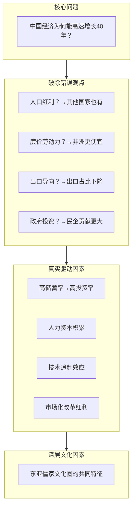
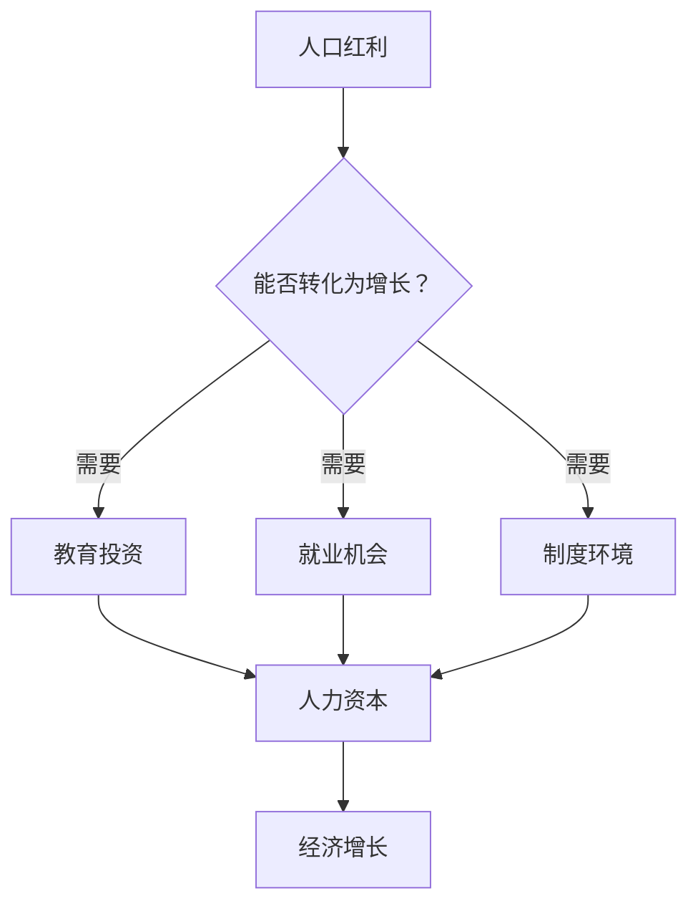
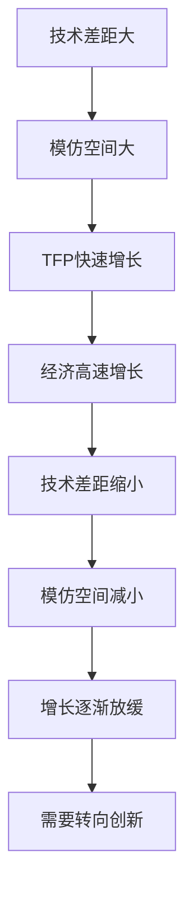
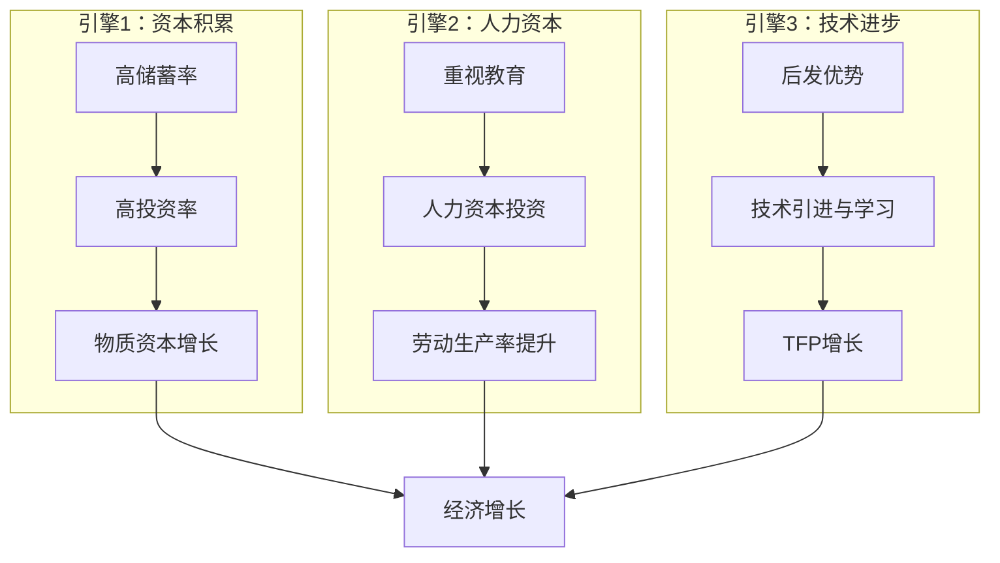

# 《中国式增长》深度拆解

## 一、元信息/坐标定位

### 作者背景
**朱天**是中欧国际工商学院经济学与金融学教授，密歇根大学经济学博士。他的研究领域涵盖中国经济增长、企业金融与公司治理。作为长期研究中国经济的学者，朱天教授善于用扎实的数据和严谨的逻辑来解析中国经济现象，挑战流行的错误观点。

### 学科定位
本书处于==发展经济学与中国经济研究的交叉领域==。它既不是宏大叙事的经济史，也不是技术性的学术论文，而是一本用通俗语言讲述中国经济增长逻辑的"解谜之作"。作者试图回答一个核心问题：==中国经济高速增长的真正原因是什么？==

### 写作动机
关于中国经济增长，存在大量流行但经不起推敲的解释——无论是"人口红利论"、"廉价劳动力论"，还是"政府主导论"。朱天教授认为，这些解释要么逻辑不通，要么与数据矛盾。本书旨在用严谨的经济学分析，厘清中国经济增长的真实驱动因素。

### 目标读者
- 关心中国经济前景的投资者和企业家
- 希望理解中国发展模式的政策研究者
- 对发展经济学感兴趣的学生和学者
- 任何想要理性认识中国经济的读者

> [!abstract] 一句话定位
> 这是一本用==经济学逻辑拆解中国增长密码==的著作，挑战流行谬误，还原增长本质。

---

## 二、全书逻辑地图

本书的论证结构可以概括为"破立结合"：

1. **立问**：提出核心谜题——为何中国能实现持续40年的高速增长？
2. **破谬**：逐一驳斥流行的错误解释，展示其逻辑漏洞和数据矛盾
3. **立论**：提出基于经济学基本原理的解释——高储蓄、人力资本、技术追赶
4. **溯源**：将经济因素追溯到更深层的文化特征

这种结构体现了学术研究的基本方法：==先清除错误的杂草，再种下正确的种子==。

---

## 三、核心主题/逐章深度拆解

### 第一章：增长的谜题

#### 核心论点
中国经济增长是一个需要解释的"异常现象"（anomaly）。==从1978年到2020年，中国GDP年均增长约9.5%，这在人类经济史上是前所未有的==。

#### DIKW四层提炼
| 层次 | 内容 |
|------|------|
| **Data（数据）** | 1978-2020年，中国人均GDP从不足200美元增长到超过10000美元 |
| **Information（信息）** | 中国用40年走完了西方200年的工业化历程 |
| **Knowledge（知识）** | 经济增长的基本公式：Y = f(K, L, A)，即产出取决于资本、劳动和技术 |
| **Wisdom（智慧）** | 理解增长需要区分"近因"和"远因"，表面现象和深层机制 |

#### 费曼式解读
假设你是一个1978年的经济学家，我告诉你：接下来40年，有一个国家的经济将以每年近10%的速度增长。你会猜是哪个国家？

日本？日本当时已经是发达经济体。韩国？有可能，但体量太小。中国？一个刚经历十年动荡、人均收入比非洲还低的国家？不可能！

但事实就是如此。这就是为什么中国的增长需要解释——它打破了太多人的预期和常规理论。

> [!note] 增长的规模效应
> 中国不仅增长快，而且体量大。==当一个14亿人口的国家持续高速增长，它对世界经济的影响是颠覆性的==。

#### 关键概念
- **经济增长率**：GDP的年度变化百分比
- **人均GDP**：衡量经济发展水平的核心指标
- **追赶效应（Catch-up Effect）**：落后国家可能比发达国家增长更快

---

### 第二章：破除"人口红利"迷思

#### 核心论点
"人口红利"不能解释中国的高速增长。==许多国家拥有更年轻的人口结构，却未能实现经济起飞==。

#### DIKW四层提炼
| 层次 | 内容 |
|------|------|
| **Data** | 非洲和南亚的抚养比（非劳动人口/劳动人口）比中国更低 |
| **Information** | 人口红利是增长的"许可证"，不是"发动机" |
| **Knowledge** | 劳动力数量≠劳动力质量；人多不等于人力资本多 |
| **Wisdom** | ==把相关性误认为因果性是经济分析的常见错误== |

#### 费曼式解读
"人口红利"这个词听起来很专业，意思是说：当一个国家的劳动年龄人口比例很高时，经济增长会更容易。

这个说法对不对？对，但不完整。

打个比方：有汽油（人口红利）是汽车能跑起来的必要条件，但有汽油不意味着汽车就会跑——你还需要发动机、轮子、方向盘……非洲很多国家有充足的"汽油"，但"汽车"就是跑不起来。

> [!warning] 常见谬误
> 把"人口红利"当作增长的充分条件，就像说"有脚就能跑马拉松"一样荒谬。

#### 关键概念
- **抚养比**：非劳动年龄人口与劳动年龄人口之比
- **人力资本**：劳动者所拥有的知识、技能和健康状况

---

### 第三章：破除"廉价劳动力"迷思

#### 核心论点
"廉价劳动力"同样不能解释中国的增长优势。==工资低不等于劳动力成本低；劳动力成本低也不等于产品有竞争力==。

#### DIKW四层提炼
| 层次 | 内容 |
|------|------|
| **Data** | 1990年代，中国制造业工资约为美国的3%，但单位劳动成本约为美国的50% |
| **Information** | 单位劳动成本 = 工资 / 劳动生产率 |
| **Knowledge** | 真正重要的是==劳动生产率与工资的比值==，而非工资绝对水平 |
| **Wisdom** | 比较优势是相对的概念，绝对水平高低不决定竞争力 |

#### 费曼式解读
假设你要开一家工厂，有两个选择：
- A国：工人月薪1000元，每人每月生产100件产品
- B国：工人月薪100元，每人每月生产5件产品

哪个更划算？A国的单位劳动成本是10元/件，B国是20元/件。==工资低三分之一，成本却高一倍==！

这就是"廉价劳动力"论的漏洞。中国工人的工资确实比发达国家低很多，但中国工人的生产效率也相当高——这才是关键。而生产效率来自于教育、培训、组织管理和技术水平。

> [!tip] 核心洞察
> ==低工资是贫穷的结果，不是竞争力的来源==。如果低工资就能带来竞争力，全世界最有竞争力的应该是最穷的国家。

#### 关键概念
- **单位劳动成本（Unit Labor Cost）**：生产一单位产品所需的劳动力成本
- **劳动生产率**：单位劳动时间的产出量

---

### 第四章：高储蓄——增长的第一引擎

#### 核心论点
==中国经济增长的第一个真正驱动因素是超高的储蓄率和投资率==。高储蓄为高投资提供了资金来源，高投资推动了资本积累和经济增长。

#### DIKW四层提炼
| 层次 | 内容 |
|------|------|
| **Data** | 中国的国民储蓄率长期保持在40-50%，是世界平均水平的两倍 |
| **Information** | 储蓄 = 投资（在封闭经济中）；高储蓄→高投资→高增长 |
| **Knowledge** | 索洛增长模型显示，储蓄率决定稳态资本存量和人均产出水平 |
| **Wisdom** | ==储蓄是延迟消费、投资未来的行为，体现了社会的时间偏好== |

#### 费曼式解读
经济增长从哪里来？最基本的来源是==资本积累==——你建了更多的工厂、道路、机器，自然能生产更多东西。

但资本积累需要钱。钱从哪来？要么借外债，要么靠自己攒。中国选择的主要是后者——==中国人非常能存钱==。

为什么中国人这么能存钱？这是一个深层的问题，涉及文化传统、社会保障不完善、房价压力等多种因素。但无论原因是什么，结果是明确的：高储蓄支撑了高投资，高投资推动了高增长。

> [!note] 储蓄率的国际比较
> | 国家/地区 | 储蓄率 |
> |----------|--------|
> | 中国 | 45-50% |
> | 东亚其他经济体 | 30-40% |
> | 美国 | 15-20% |
> | 撒哈拉以南非洲 | 10-15% |

#### 关键概念
- **储蓄率**：储蓄占GDP的比例
- **投资率**：固定资本形成占GDP的比例
- **资本积累**：社会资本存量的增加

---

### 第五章：人力资本——增长的第二引擎

#### 核心论点
==中国对教育的重视和人力资本的快速积累，是增长的第二个核心驱动因素==。人力资本不仅提高劳动生产率，还是技术吸收和创新的基础。

#### DIKW四层提炼
| 层次 | 内容 |
|------|------|
| **Data** | 中国高等教育毛入学率从1990年的3%上升到2020年的超过50% |
| **Information** | 中国每年培养的理工科毕业生数量超过美国和欧洲之和 |
| **Knowledge** | 人力资本的回报率通常高于物质资本，尤其在知识经济时代 |
| **Wisdom** | ==教育投资是对未来最确定的投资；人力资本是唯一不会折旧的资本== |

#### 费曼式解读
如果说储蓄是增长的"燃料"，那么人力资本就是"发动机"。

一台发动机越先进，同样的燃料能跑更远的路。同样，劳动者素质越高，同样的资本投入能产生更大的产出。

中国人对教育的重视近乎"疯狂"——这不是一个贬义词。从古代的科举制度到今天的高考，中国文化始终认为==教育是改变命运的最重要途径==。这种文化特征转化为巨大的人力资本投资，成为经济增长的重要驱动力。

> [!tip] 人力资本的乘数效应
> 人力资本不仅直接提高生产率，还能：
> - 更好地吸收和应用新技术
> - 更有效地管理和协调复杂组织
> - 更快地学习和适应新环境

#### 关键概念
- **人力资本（Human Capital）**：体现在劳动者身上的知识、技能和健康
- **教育回报率**：多受一年教育带来的收入增长百分比

---

### 第六章：技术追赶——增长的第三引擎

#### 核心论点
==作为后发国家，中国能够通过学习和模仿发达国家的技术来实现快速追赶==。这种"后发优势"是高增长的第三个引擎。

#### DIKW四层提炼
| 层次 | 内容 |
|------|------|
| **Data** | 中国全要素生产率（TFP）年均增长约3-4%，远高于发达国家的1-2% |
| **Information** | 技术差距越大，追赶的空间越大，潜在增长率越高 |
| **Knowledge** | 技术进步 = 创新 + 模仿；后发国家可以主要依靠模仿 |
| **Wisdom** | ==追赶是有终点的；当技术差距缩小，增长自然会放缓== |

#### 费曼式解读
想象你是一个学生，前面有个学霸。你要赶上他有两种方式：一是自己摸索发明新的学习方法，二是直接学习他已经验证有效的方法。

哪种更快？当然是后者。

这就是==后发优势==的本质。中国在改革开放之初，技术水平远落后于发达国家。但这也意味着大量成熟的技术可以直接引进和学习——不需要自己花巨资研发，不需要承担失败风险，只需要学习和适应。

> [!warning] 追赶的终点
> 后发优势是有期限的。==当你逐渐接近技术前沿，可学习的东西就越来越少，必须转向自主创新==。这是中国当前面临的转型挑战。

#### 关键概念
- **全要素生产率（TFP）**：不能被资本和劳动增长解释的产出增长
- **后发优势**：落后国家通过学习领先国家而获得的追赶机会
- **技术前沿**：当前最先进的技术水平

---

### 第七章：市场化改革——增长的制度基础

#### 核心论点
==市场化改革释放了被计划经济压抑的生产潜力==。产权保护、价格机制和竞争环境是增长的制度基础。

#### DIKW四层提炼
| 层次 | 内容 |
|------|------|
| **Data** | 民营经济对GDP的贡献从1978年的几乎为零上升到现在的60%以上 |
| **Information** | "放权让利"和"抓大放小"是改革的核心策略 |
| **Knowledge** | 市场机制通过价格信号实现资源的有效配置 |
| **Wisdom** | ==改革不是设计出来的，而是试出来的；实用主义是中国改革的特征== |

#### 费曼式解读
计划经济的问题是什么？不是计划本身，而是==信息问题==。

假设你要计划全国人民明天吃什么。你需要知道每个人的口味、每种食材的产量、每个餐馆的产能……这些信息是不可能完全掌握的。结果就是：要么短缺，要么浪费，要么两者同时发生。

市场机制通过价格来传递信息。东西短缺→价格上涨→生产商增加供给→短缺缓解。这个过程不需要中央计划者的参与，==自发==就能实现。

中国的改革开放，本质上就是逐步引入市场机制，让价格而非计划来配置资源。

> [!note] 渐进式改革 vs. 休克疗法
> | 中国（渐进式） | 苏联/俄罗斯（休克疗法） |
> |----------------|------------------------|
> | 双轨制过渡 | 一步到位私有化 |
> | 先增量后存量 | 存量直接改革 |
> | 摸着石头过河 | 顶层设计一步到位 |
> | 经济持续增长 | 经济严重衰退 |

#### 关键概念
- **市场化改革**：从计划经济向市场经济的转型过程
- **产权保护**：对私有财产权利的法律和制度保障
- **资源配置效率**：把资源配置到最能创造价值的用途

---

### 第八章：东亚模式与儒家文化

#### 核心论点
==中国的高增长不是孤立现象，而是东亚发展模式的一部分==。日本、韩国、新加坡、中国台湾都经历过类似的高速增长期，共同的文化背景是重要的解释因素。

#### DIKW四层提炼
| 层次 | 内容 |
|------|------|
| **Data** | 东亚经济体的储蓄率普遍高于世界平均水平10-20个百分点 |
| **Information** | 这些经济体都强调教育、勤劳和延迟满足 |
| **Knowledge** | 文化通过影响个体行为来影响宏观经济结果 |
| **Wisdom** | ==文化不是决定论，而是概率论；它影响倾向，不决定结果== |

#### 费曼式解读
如果把中国的增长放在更大的图景中观察，你会发现一个有趣的模式：==几乎所有东亚经济体都经历过类似的高速增长期==。

- 日本：1950-1970年代
- 韩国：1960-1990年代
- 台湾：1960-1990年代
- 新加坡：1965年至今
- 中国大陆：1978年至今

这些经济体有什么共同点？除了地理位置相近，它们都深受儒家文化影响。儒家文化强调什么？==教育、勤劳、储蓄、家庭责任、延迟满足==。这些特质恰好是经济发展所需要的。

> [!abstract] 儒家文化特征与经济增长的关联
> | 文化特征 | 经济影响 |
> |----------|----------|
> | 重视教育 | 人力资本积累 |
> | 勤劳节俭 | 高储蓄率、高劳动参与率 |
> | 延迟满足 | 长期投资倾向 |
> | 家庭责任 | 代际财富积累 |
> | 尊重权威 | 社会稳定、政策执行力 |

#### 关键概念
- **东亚模式**：以高储蓄、高投资、出口导向和政府干预为特征的发展模式
- **文化因素**：影响经济行为的价值观、信仰和习惯

---

## 四、核心框架提炼

### 框架一：增长三引擎模型

这是本书最核心的分析框架。==中国经济增长可以分解为三个引擎==：
1. **资本积累**：由高储蓄率驱动
2. **人力资本**：由教育投资驱动
3. **技术进步**：由后发优势驱动

三个引擎相互强化：人力资本提高了资本的产出效率，技术进步提高了人力资本的生产力，资本积累为技术引进提供了资金。

### 框架二：增长阶段论

| 阶段 | 特征 | 增长动力 | 挑战 |
|------|------|----------|------|
| 起飞期 | 人均收入低，技术差距大 | 资本积累、技术引进 | 储蓄动员、制度建设 |
| 追赶期 | 中等收入，技术差距缩小 | 人力资本、产业升级 | 中等收入陷阱 |
| 成熟期 | 高收入，接近技术前沿 | 自主创新 | 增长放缓、社会老龄化 |

中国目前处于从追赶期向成熟期过渡的阶段。==增长放缓是必然的，关键是能否成功跨越中等收入陷阱==。

### 框架三：真假驱动因素对比

| 流行说法 | 问题所在 | 真实因素 |
|----------|----------|----------|
| 人口红利 | 其他国家也有，但未能增长 | 人力资本质量 |
| 廉价劳动力 | 工资低不等于成本低 | 劳动生产率 |
| 出口导向 | 出口占GDP比例下降 | 国内投资与消费 |
| 政府主导 | 民企贡献超过60% | 市场化改革 |

---

## 五、批判性思考

### 本书的优势

1. **逻辑严谨**：每个论点都有数据支撑，每个反驳都指出逻辑漏洞
2. **视角独特**：不随大流，敢于挑战流行观点
3. **通俗易懂**：用日常语言解释经济学原理

### 本书的局限

1. **文化解释的边界**：文化因素难以量化，容易陷入"事后解释"的困境
2. **制度因素的简化**：对政府角色的分析可能过于简单化
3. **预测能力有限**：解释过去比预测未来容易得多

### 与其他观点的对话

| 话题 | 本书观点 | 其他观点 | 我的思考 |
|------|----------|----------|----------|
| 政府作用 | 市场化改革是关键 | 林毅夫强调政府的"因势利导" | 两者可能都有道理，关键在于政府干预的类型和程度 |
| 增长前景 | 增长会放缓但不会崩溃 | "中国崩溃论"不时出现 | 历史证明过度悲观往往是错的 |
| 文化决定论 | 文化影响但不决定 | 有人认为制度比文化更重要 | 文化和制度相互影响，难以截然分开 |

> [!warning] 批判性阅读提醒
> 任何单一因素的解释都可能过于简化。经济增长是多因素共同作用的结果，==本书的框架是理解的起点，而非终点==。

---

## 六、行动清单

### 对个人的启示

- [ ] **重新评估储蓄习惯**：高储蓄不仅是美德，也是经济发展的基础
- [ ] **持续投资人力资本**：教育和技能的回报率远高于金融投资
- [ ] **培养延迟满足能力**：这是个人和国家成功的共同特质

### 对投资者的启示

- [ ] **理解增长放缓的必然性**：不要对高增长持续抱有不切实际的预期
- [ ] **关注人力资本密集型行业**：教育、科技、医疗等领域有长期机会
- [ ] **警惕简单化的叙事**：无论是"崩溃论"还是"永远增长论"

### 对企业家的启示

- [ ] **利用剩余的追赶空间**：在技术差距仍存在的领域寻找机会
- [ ] **投资员工培训**：人力资本是可持续竞争优势的来源
- [ ] **关注效率而非规模**：增长模式正在从数量向质量转型

---

## 七、延伸阅读路线图

### 深化理解中国经济

1. [[《中国经济增长的逻辑》- 林毅夫]] - 另一种解释框架
2. [[《Catching Up to America》- 朱天]] - 本书的姊妹篇，英文版

### 发展经济学经典

1. [[《国家为什么会失败》- 阿西莫格鲁、罗宾逊]] - 制度决定论的代表作
2. [[《枪炮、病菌与钢铁》- 贾雷德·戴蒙德]] - 地理决定论的经典

### 东亚发展比较

1. [[《日本第一》- 傅高义]] - 了解日本奇迹
2. [[《亚洲的戏剧》- 冈纳·缪尔达尔]] - 发展经济学早期悲观预测的反面教材

---

## 八、费曼终极检验

### 如果要向一个完全不懂经济学的人解释这本书，我会说：

"中国过去40年经济增长非常快，快到很多人都觉得不可思议。为什么？

流行的解释说是因为中国人多、劳动力便宜、出口多。但这些解释都有问题——非洲人也多，劳动力更便宜，为什么没有高速增长？

真正的原因有三个：

**第一，中国人特别能存钱**。存下来的钱变成了投资——工厂、道路、机器。这些投资让生产能力不断提升。

**第二，中国人特别重视教育**。从古代科举到现代高考，教育一直是中国人改变命运的首选路径。高素质的劳动力是经济增长的发动机。

**第三，中国是后来者**。落后反而有好处——可以学习发达国家已经成熟的技术，不用自己从头发明。这比自主创新快得多、便宜得多。

这三个因素加上市场化改革释放的活力，共同造就了中国奇迹。但要注意，==这个模式不是永动机==。当资本积累到一定程度、当技术差距缩小，增长必然会放缓。中国正在经历这个转型。"

### 我能用这些知识做什么？

1. **评估投资机会时**，我会更关注人力资本和技术能力，而非廉价劳动力
2. **理解政策时**，我会区分真正有效的改革和表面文章
3. **预判未来时**，我会接受增长放缓的必然性，同时保持对韧性的信心

> [!abstract] 本书精华一句话
> ==中国经济增长的真正驱动因素是高储蓄率、人力资本积累和技术追赶，而非人口红利或廉价劳动力==。理解这一点，才能正确判断中国经济的未来。
