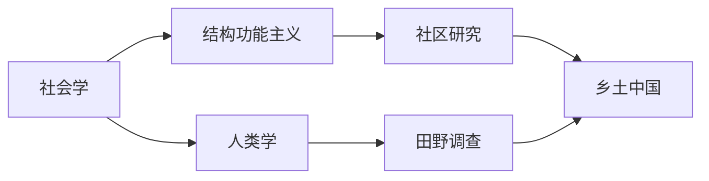
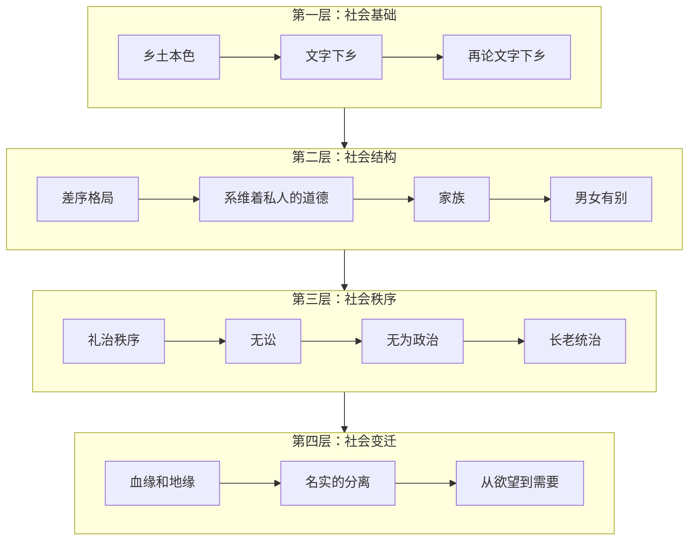
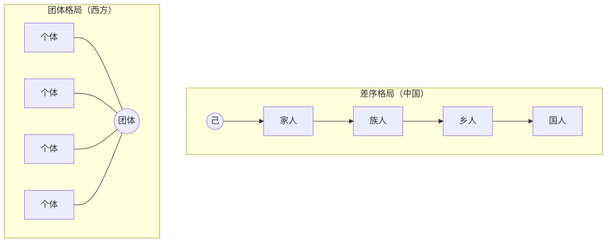
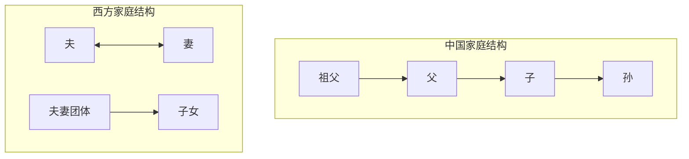
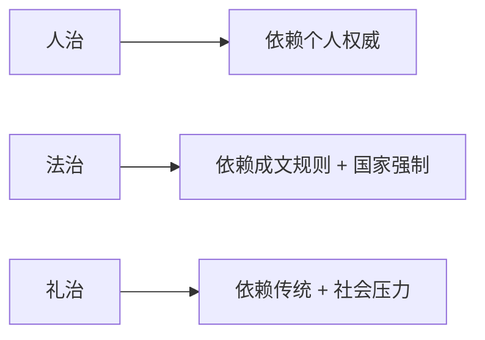
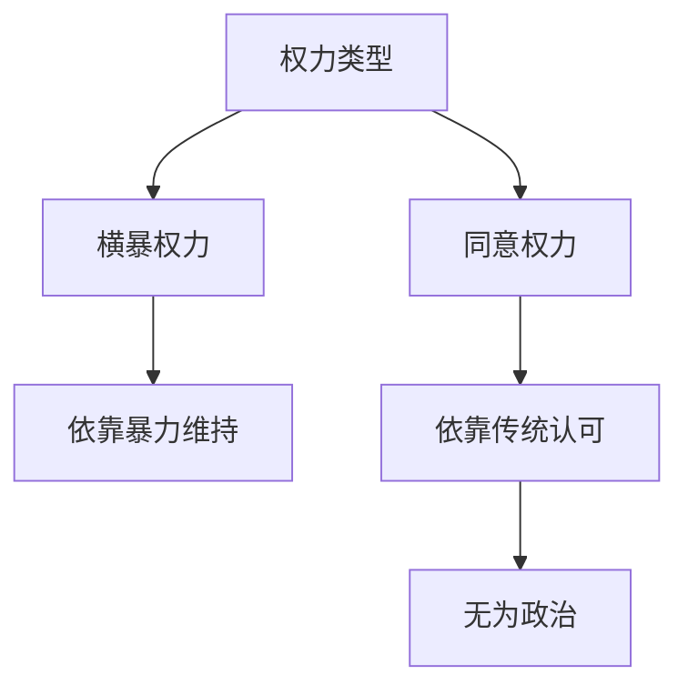
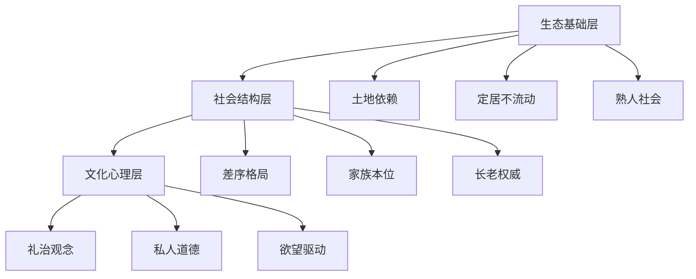
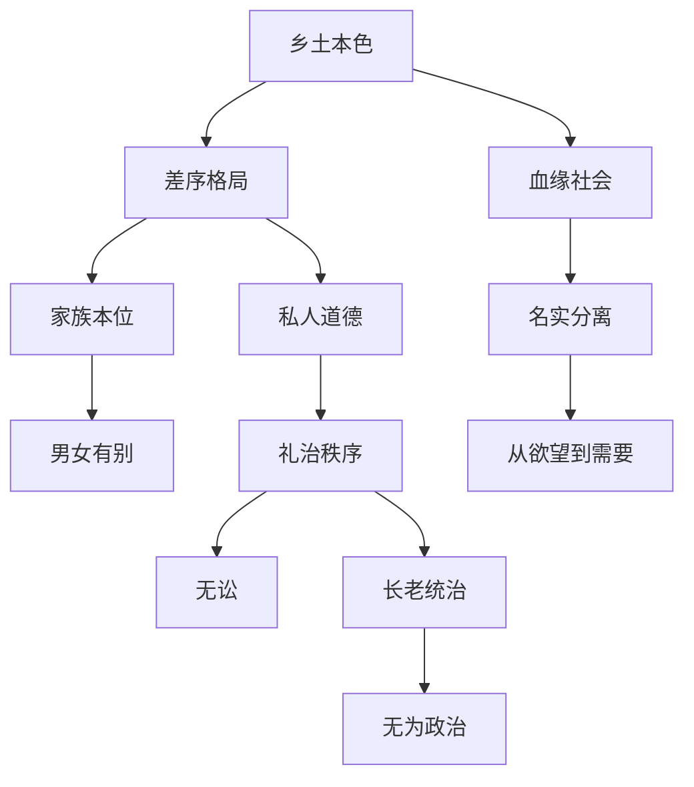
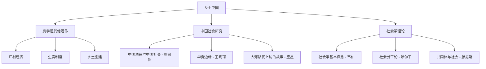

# 《乡土中国》深度读书笔记

> [!abstract] 一句话概括
> 费孝通以社会学视角解剖中国传统社会的"乡土性"，揭示了以==差序格局==为核心的社会结构如何塑造中国人的行为模式、伦理观念与治理逻辑。

---

## 一、元信息/坐标定位

### 1.1 作者背景

费孝通（1910-2005），中国社会学与人类学奠基人，师从马林诺夫斯基，开创了"社区研究"的中国学派。他的学术生涯贯穿了中国现代化的曲折历程，从《江村经济》到《乡土中国》，始终关注一个核心问题：==中国社会的基本结构是什么？==

### 1.2 写作背景

本书成书于1947年，由费孝通在西南联大授课讲义整理而成。彼时中国正处于传统与现代的激烈碰撞中，费孝通试图回答：为什么中国的现代化进程如此艰难？答案就藏在"乡土"二字之中。

### 1.3 学科定位

本书处于==社会学与人类学的交汇点==，采用结构功能主义视角，但又超越西方理论框架，建构了理解中国社会的本土概念体系。

### 1.4 核心问题域

> [!note] 本书回答的根本问题
> - 中国社会的基层结构是什么？
> - 这种结构如何影响中国人的行为方式？
> - 传统社会秩序如何维系？
> - 现代化转型面临什么深层障碍？

---

## 二、全书逻辑地图

> [!tip] 逻辑主线
> 全书沿着"土地→人际→秩序→变迁"的逻辑展开：
> 1. **基础层**：解释乡土社会为何"土"——不流动、熟人社会、口耳相传
> 2. **结构层**：揭示"差序格局"——中国社会结构的核心密码
> 3. **秩序层**：分析"礼治"如何维系社会——无需法律的秩序
> 4. **变迁层**：探讨传统向现代过渡的张力

这四层环环相扣：==土地决定了结构，结构决定了秩序，秩序决定了变迁的困难==。

---

## 三、核心主题/逐章深度拆解

### 第一章：乡土本色

#### 核心论点
中国社会的基层是乡土性的。"土"意味着三重含义：土地依赖、不流动、熟人社会。

#### DIKW四层提炼

| 层级 | 内容 |
|------|------|
| **Data（数据）** | 中国人口80%以上居住在农村，以土地为生 |
| **Information（信息）** | 农业生产要求定居，定居导致熟人社会形成 |
| **Knowledge（知识）** | 熟人社会中信任基于"熟悉"而非"契约" |
| **Wisdom（智慧）** | 现代社会制度移植困难的根源在于社会基础的差异 |

#### 费曼式解读

> [!tip] 费曼式解读：如何向一个外国人解释？
> 想象一个村庄，所有人都认识所有人，你知道张三他爷爷的爷爷是谁，也知道李四家的狗叫什么名字。在这种环境里，你需要合同吗？需要法院吗？不需要——因为"熟悉"本身就是最好的担保。这就是乡土中国的底色。

#### 关键概念

- ==熟人社会==：人际关系建立在长期、多面向、重复互动的基础上
- ==礼俗社会 vs 法理社会==：对应滕尼斯的Gemeinschaft与Gesellschaft

> [!warning] 常见误解
> "乡土"不是贬义词，不等于"落后"。费孝通是在做==价值中立==的社会学分析，而非道德评判。

---

### 第二章：文字下乡

#### 核心论点
乡土社会不需要文字，因为文字是为克服时空限制而发明的工具，而熟人社会没有这种需求。

#### DIKW四层提炼

| 层级 | 内容 |
|------|------|
| **Data** | 乡村识字率低，但生活运转良好 |
| **Information** | 面对面交流足以满足所有沟通需求 |
| **Knowledge** | 文字的本质是==间接交流工具==，熟人社会更依赖直接交流 |
| **Wisdom** | 知识传承方式决定社会类型，口耳相传塑造了乡土文化 |

#### 费曼式解读

> [!tip] 费曼式解读
> 为什么你奶奶可能不识字，但她知道怎么做最好吃的红烧肉？因为她妈妈亲手教她的。在一个所有人都能面对面交流的社会里，文字就像雨伞——晴天时，你根本不需要它。

#### 关键概念

- ==空间阻隔==：文字克服的是说话者与听话者不在同一地点的问题
- ==时间阻隔==：文字克服的是信息需要跨代传递的问题

---

### 第三章：再论文字下乡

#### 核心论点
乡土社会的时间是==循环的==，经验可以直接传承，不需要文字记录。

#### DIKW四层提炼

| 层级 | 内容 |
|------|------|
| **Data** | 农业社会的日历是循环的：春种秋收，年复一年 |
| **Information** | 循环时间意味着上一代的经验完全适用于下一代 |
| **Knowledge** | 记忆比文字更高效——"我爷爷就是这么干的" |
| **Wisdom** | ==文化惰性==的深层原因：经验的有效性导致创新的不必要性 |

#### 费曼式解读

> [!tip] 费曼式解读
> 想象你是个农民，你爷爷告诉你"惊蛰前后种玉米"，这条经验他爷爷也用过，有效了几百年。你需要把它写下来吗？不需要，因为你每年都用得上，不可能忘记。但如果你是程序员，你上周学的框架下周可能就过时了——这时候你才需要文档。

---

### 第四章：差序格局

> [!abstract] 本书最核心章节
> "差序格局"是费孝通最重要的理论贡献，是理解全书的钥匙。

#### 核心论点
中国社会结构如同==石子投入水中形成的波纹==，以"己"为中心，一圈圈向外推延。这与西方"团体格局"（如捆柴）形成鲜明对比。

#### DIKW四层提炼

| 层级 | 内容 |
|------|------|
| **Data** | 中国人说"自家人"，边界模糊且可伸缩 |
| **Information** | 群己界限随情境变化："我们家"可大可小 |
| **Knowledge** | 社会关系是==以自我为中心的同心圆==，远近亲疏决定道德责任 |
| **Wisdom** | 公私观念的模糊、腐败的文化土壤、关系社会的逻辑都根源于此 |

#### 费曼式解读

> [!tip] 费曼式解读
> 西方人像一捆柴：每根柴都是独立的个体，捆在一起就是团体。团体有明确边界——你要么在里面，要么在外面。
>
> 中国人像水波：你往池塘里扔一块石头，波纹从中心向外扩散，越远越淡。谁是"自己人"？看情况——借钱的时候范围小一点，请客的时候范围大一点。
>
> 这就解释了为什么中国人"公私不分"——因为根本就没有一条清晰的公私分界线！

#### 关键概念

- ==伸缩性==：社会圈子的边界随情境变化
- ==自我主义 vs 个人主义==：中国的"自我"是关系中的自我，西方的"个人"是原子化的个人
- ==攀关系、讲交情==：差序格局的日常实践

> [!warning] 深层影响
> 差序格局解释了：
> - 为何中国人"各扫门前雪"——因为公共空间不在任何人的"波纹"范围内
> - 为何"关系"如此重要——因为办事效率取决于你在对方波纹中的位置
> - 为何反腐如此困难——因为"帮自己人"被视为美德而非腐败

---

### 第五章：系维着私人的道德

#### 核心论点
在差序格局中，==道德是私人性的、情境性的==，而非普遍性的公共道德。

#### DIKW四层提炼

| 层级 | 内容 |
|------|------|
| **Data** | 儒家强调"孝悌忠信"，都是具体人伦关系中的德行 |
| **Information** | 道德责任随关系远近而递减 |
| **Knowledge** | 中国没有发展出类似西方"人人平等"的抽象道德观念 |
| **Wisdom** | 现代公民道德建设的深层障碍：缺乏==超越私人关系的公共道德传统== |

#### 费曼式解读

> [!tip] 费曼式解读
> 西方人问："这件事对不对？"——有一个普遍适用的标准。
> 中国人问："这件事对谁做？"——答案取决于你和对方的关系。
>
> 杀人是错的吗？西方人说绝对错。中国人说……要看杀的是谁。为父报仇？那是孝道。

---

### 第六章：家族

#### 核心论点
中国的"家"是一个==事业组织==，而非西方意义上的情感单位。家的边界可大可小，其核心是父子纵向轴。

#### DIKW四层提炼

| 层级 | 内容 |
|------|------|
| **Data** | 中国传统大家庭"五世同堂"为荣 |
| **Information** | 家庭的核心是==父子轴==而非夫妻轴 |
| **Knowledge** | 家是政治、经济、教育、宗教的综合体 |
| **Wisdom** | 家庭观念的现代转型需要结构性变革，不仅是观念更新 |

#### 关键概念

- ==小家庭 vs 大家庭==：西方以夫妻为核心的小家庭 vs 中国以父子为轴的大家族
- ==家的事业性==：中国的家承担生产、养老、教育等多重功能

---

### 第七章：男女有别

#### 核心论点
乡土社会压抑两性情感，强调男女分工与秩序稳定，形成==同性社交优先==的模式。

#### DIKW四层提炼

| 层级 | 内容 |
|------|------|
| **Data** | 传统中国夫妻"相敬如宾"，而非热烈相爱 |
| **Information** | 两性关系被规范化、冷却化处理 |
| **Knowledge** | 爱情被视为破坏秩序的力量，需要压抑 |
| **Wisdom** | 社会稳定的代价是==情感的牺牲与人性的压抑== |

#### 费曼式解读

> [!tip] 费曼式解读
> 浪漫爱情是什么？是激情、是冲动、是不顾一切。这在现代社会被歌颂，但在乡土社会是危险的——因为它会破坏家族安排的婚姻、打破社会秩序。所以乡土社会选择了"冷却"策略：男女授受不亲、夫妻相敬如宾。不是不懂爱，是不能爱。

---

### 第八章：礼治秩序

#### 核心论点
乡土社会既非"人治"也非"法治"，而是=="礼治"==——靠传统规范而非成文法律维持秩序。

#### DIKW四层提炼

| 层级 | 内容 |
|------|------|
| **Data** | 乡村极少诉讼，但社会秩序井然 |
| **Information** | "礼"是内化于心的行为规范 |
| **Knowledge** | 礼治依赖==传统的权威==，而非国家强制力 |
| **Wisdom** | 法治建设需要先解构礼治的深层逻辑 |

#### 费曼式解读

> [!tip] 费曼式解读
> 法治需要警察和法官——有人犯规就惩罚。
> 礼治不需要——因为每个人从小就知道规矩，而且违反规矩的代价是==社会性死亡==（被整个村子排斥）。
>
> 你可以跑到另一个城市躲避法律，但你能躲避整个村子的白眼吗？

---

### 第九章：无讼

#### 核心论点
乡土社会的理想是=="无讼"==，打官司本身被视为可耻的事情。

#### DIKW四层提炼

| 层级 | 内容 |
|------|------|
| **Data** | 传统中国以"无讼"为治理成就 |
| **Information** | 诉讼意味着礼治失败、社区和谐破裂 |
| **Knowledge** | 调解优于裁判，==面子==优于正义 |
| **Wisdom** | 现代法治意识的培育需要超越"讼则两败"的传统观念 |

#### 关键概念

- ==调解 vs 裁判==：乡土社会偏好调解（各打五十大板），现代法治强调裁判（分清是非）
- ==教化 vs 惩罚==：乡土逻辑是"你应该知道规矩"，而非"法无禁止即可为"

---

### 第十章：无为政治

#### 核心论点
乡土社会的权力是=="同意权力"==而非"横暴权力"，政府的最高境界是"无为而治"。

#### DIKW四层提炼

| 层级 | 内容 |
|------|------|
| **Data** | "皇权不下县"，乡村多自治 |
| **Information** | 国家权力对乡村的渗透有限 |
| **Knowledge** | 权力的正当性来自==传统==而非强制 |
| **Wisdom** | 现代国家建构需要打破乡土社会的自足性 |

---

### 第十一章：长老统治

#### 核心论点
乡土社会的权力属于=="长老"==——年长者因经验丰富而获得权威，这是一种教化性权力。

#### DIKW四层提炼

| 层级 | 内容 |
|------|------|
| **Data** | 乡村重大事务由长辈决定 |
| **Information** | 年龄=经验=权威 |
| **Knowledge** | 长老权力是==文化传承==的需要，而非个人专断 |
| **Wisdom** | 现代社会知识更新加速，长老权威的基础正在瓦解 |

#### 费曼式解读

> [!tip] 费曼式解读
> 在乡土社会，老人说的话就是对的——不是因为他们更聪明，而是因为他们经历过你将要经历的一切。他们知道什么时候种地、怎么处理邻里纠纷、哪些风俗必须遵守。
>
> 但在现代社会，你爸可能不会用智能手机——老人的经验反而成了负担。这就是"代沟"的社会学根源。

---

### 第十二章：血缘和地缘

#### 核心论点
乡土社会以==血缘==为纽带，商业社会以==地缘==为纽带。从血缘到地缘是社会现代化的标志。

#### DIKW四层提炼

| 层级 | 内容 |
|------|------|
| **Data** | 乡村聚落多以姓氏命名 |
| **Information** | 血缘关系决定社会地位与资源分配 |
| **Knowledge** | 商业需要突破血缘，建立基于契约的地缘关系 |
| **Wisdom** | 市场经济的发展需要从"熟人信任"转向"制度信任" |

---

### 第十三章：名实的分离

#### 核心论点
社会变迁时期，"名"（规范）与"实"（行为）会发生分离，形成表面遵从传统、实际另行一套的局面。

#### DIKW四层提炼

| 层级 | 内容 |
|------|------|
| **Data** | 传统社会也有变革，但往往"挂羊头卖狗肉" |
| **Information** | 变革披着传统的外衣进行 |
| **Knowledge** | 这是社会变迁的==缓冲机制==，减少冲击 |
| **Wisdom** | 理解中国改革的"渐进"特色：形式保守，内容创新 |

#### 费曼式解读

> [!tip] 费曼式解读
> 想象一个公司：老板说"我们要创新"，但实际上所有流程都没变。这就是"名实分离"——名义上是一回事，实际上是另一回事。
>
> 中国社会的很多变革都是这样：名义上还是"孝道"，实际操作已经完全不同了。这既是智慧（避免冲突），也是问题（虚伪与内耗）。

---

### 第十四章：从欲望到需要

#### 核心论点
乡土社会靠==欲望==驱动行为（自然的、习得的倾向），现代社会需要靠==理性计算的需要==来规划行动。

#### DIKW四层提炼

| 层级 | 内容 |
|------|------|
| **Data** | 传统农民"看天吃饭"，不做长期规划 |
| **Information** | 欲望是即时的、习惯化的行为驱动 |
| **Knowledge** | 现代经济需要理性计算、延迟满足 |
| **Wisdom** | 现代化转型的心理维度：从"我想要"到"我需要" |

> [!warning] 全书终章的深意
> 这一章点出了乡土社会现代化的==最深层障碍==：不仅是制度要变，心理结构也要变。从靠本能和习惯生活，转向靠理性和规划生活。

---

## 四、核心框架提炼

### 4.1 三层结构模型

### 4.2 对比框架：乡土社会 vs 现代社会

| 维度 | 乡土社会 | 现代社会 |
|------|----------|----------|
| **空间特征** | 定居、不流动 | 流动、迁徙 |
| **社会关系** | 差序格局 | 团体格局 |
| **信任基础** | 熟悉 | 契约 |
| **道德类型** | 私人的、情境的 | 公共的、普遍的 |
| **秩序维持** | 礼治 | 法治 |
| **权力来源** | 传统/长老 | 理性/制度 |
| **时间观念** | 循环 | 线性 |
| **行为驱动** | 欲望 | 需要 |

### 4.3 核心概念关系图

### 4.4 费孝通的方法论启示

> [!note] 本土化理论建构
> 费孝通没有简单套用西方理论，而是：
> 1. 从中国经验出发提炼概念（如"差序格局"）
> 2. 与西方理论对话但不依附（对比"团体格局"）
> 3. 建立本土的分析框架
>
> 这是==社会科学本土化==的典范。

---

## 五、批判性思考

### 5.1 理论贡献

1. **原创性概念**：==差序格局==已成为理解中国社会的基本概念工具，被广泛应用于社会学、人类学、政治学、管理学等领域。

2. **方法论示范**：展示了如何从本土经验出发建构理论，而非简单套用西方框架。

3. **解释力**：成功解释了许多"中国特色"现象——关系社会、公私不分、熟人经济等。

### 5.2 理论局限

> [!warning] 需要批判性审视的方面

1. **静态分析倾向**
   - 全书偏重结构分析，对==变迁动力==着墨较少
   - 似乎假设乡土社会是稳定的、均质的

2. **理想类型的问题**
   - "乡土社会"是韦伯式理想类型，现实更加复杂
   - 忽略了乡土社会内部的差异（南北差异、阶层差异等）

3. **二元对立框架**
   - 乡土/现代的二元对立过于简化
   - 实际上两种逻辑可能共存、杂糅

4. **时代局限**
   - 写于1947年，基于当时的乡村观察
   - 当代中国农村已发生巨大变化
   - 需要追问：差序格局在城市化进程中如何演变？

### 5.3 当代反思

> [!note] 延伸思考
> - 互联网时代的"熟人社会"是否复活？（微信群、同乡会）
> - 差序格局在职场中如何表现？（"圈子文化"）
> - 法治建设为何仍然困难？（礼治的惯性）
> - 公共道德为何难以建立？（私人道德的根深蒂固）

### 5.4 与其他理论的对话

- 与[[韦伯的理性化理论]]：乡土社会是"传统型权威"的典型
- 与[[涂尔干的社会分工论]]：乡土社会是"机械团结"而非"有机团结"
- 与[[布迪厄的场域理论]]：差序格局可视为一种"关系资本"的分布结构

---

## 六、行动清单

### 6.1 认知层面

- [ ] 反思自己的"差序格局"：我在无意识中如何区分"自己人"和"外人"？
- [ ] 觉察"礼治"残余：哪些行为是因为"大家都这样做"而非理性判断？
- [ ] 识别"名实分离"：生活中有哪些"说一套做一套"的情况？

### 6.2 行为层面

- [ ] 练习"公共道德"：在公共场合的行为是否与私人场合一致？
- [ ] 培养"契约意识"：减少对"熟人信任"的依赖，重视正式协议
- [ ] 突破"差序"局限：尝试对陌生人施以同等的道德关怀

### 6.3 社会参与层面

- [ ] 理解制度建设的困难：不要简单归咎于"人的素质"，而要看到结构性障碍
- [ ] 参与公共事务：打破"各扫门前雪"的惯性
- [ ] 支持法治建设：从自身做起，遇到纠纷优先诉诸法律而非"找关系"

### 6.4 阅读延伸

- [ ] 阅读费孝通其他著作：[[江村经济]]、[[生育制度]]
- [ ] 比较阅读：[[乡土重建]]、[[皇权与绅权]]
- [ ] 理论深化：阅读韦伯、涂尔干、滕尼斯的原典

---

## 七、延伸阅读路线图

### 推荐阅读顺序

1. **入门巩固**：[[江村经济]] - 费孝通的田野调查代表作，与本书理论互补
2. **横向拓展**：[[中国法律与中国社会]] - 瞿同祖，从法律史角度印证费孝通的分析
3. **理论深化**：[[共同体与社会]] - 滕尼斯，费孝通"礼俗社会/法理社会"概念的理论来源
4. **当代延续**：[[私人生活的变革]] - 阎云翔，研究当代中国农村家庭变迁
5. **批判视角**：[[反思社会学]] - 布迪厄，提供分析"关系"的另一套工具

---

## 八、费曼终极检验

> [!abstract] 终极检验：用一段话向完全不懂社会学的朋友解释这本书

想象你走进一个中国农村——那里的人世世代代住在同一块土地上，所有人都认识所有人。在这样的地方，你需要合同吗？不需要，因为大家都知道谁是谁，骗人的成本太高了。你需要警察吗？不需要，因为犯了错整个村子都会知道，社会压力比法律更可怕。

费孝通发现，这种"熟人社会"塑造了一切：中国人的人际关系像水波纹——越靠近自己的人越重要，越远的人越无所谓，所以"公私不分"；道德也是看关系的——对父母要孝顺，对陌生人则没什么义务；秩序靠"礼"（传统规矩）而不是法律来维持。

这就是为什么中国社会有那么多"关系"、"人情"、"面子"——它们不是陋习，而是==乡土社会结构的必然产物==。理解了这一点，你就理解了中国社会的底层代码。

> [!tip] 一句话总结
> ==乡土中国，是理解中国社会结构的第一把钥匙。==

---

*读书笔记完成于 2026-02-05*
