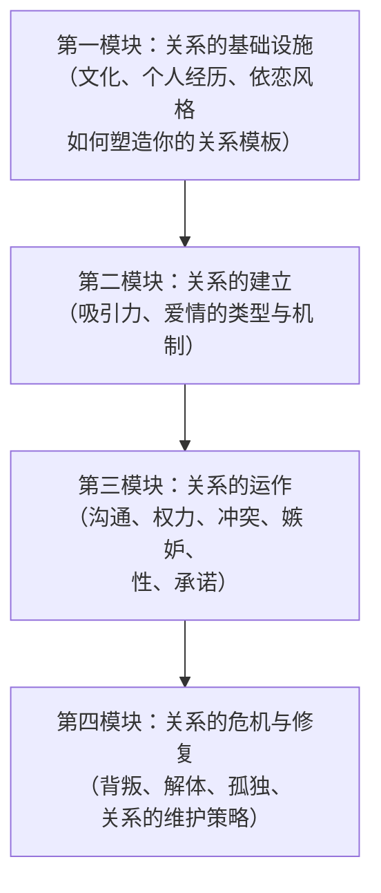
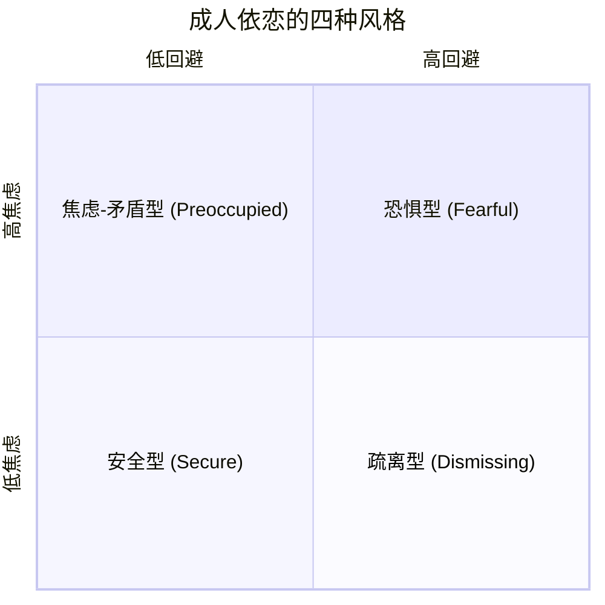
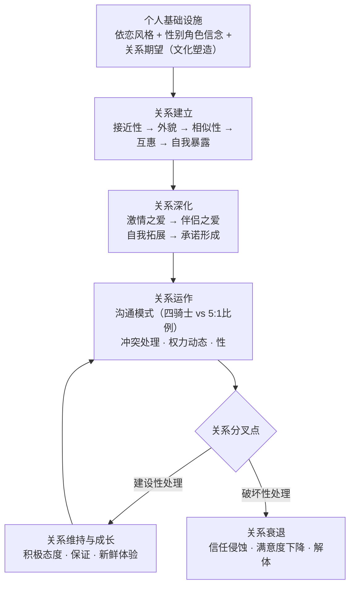
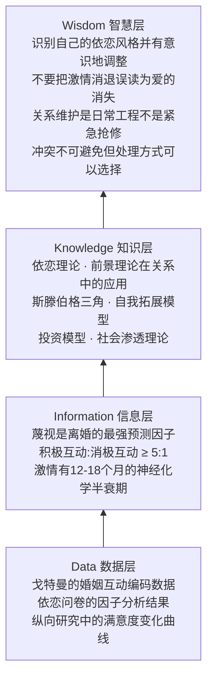

# 《亲密关系》深度拆解

## 一、元信息速览

《亲密关系》（*Intimate Relationships*）是美国社会心理学家罗兰·米勒（Rowland S. Miller）撰写的一部关于人际亲密关系的学术教材，也是该领域最具影响力的通俗学术著作之一。本书最初由米勒与丹尼尔·珀尔曼（Daniel Perlman）合著，后续版本由米勒独立修订。全书以==实证研究==为基础，系统地拆解了亲密关系从建立到维持、从冲突到解体的全过程，涵盖了吸引力、爱情、沟通、权力、嫉妒、背叛、性、冲突处理、亲密关系的解体与修复等核心议题。

这本书的独特价值在于：它不是一本教你"如何谈恋爱"的自助书，而是一本用==社会心理学的科学方法==来回答"亲密关系中到底发生了什么"的严肃学术作品。每一个结论背后都有实验数据、纵向研究或元分析的支撑。你读完之后不会获得一套"恋爱技巧"，但你会对人类亲密关系的运作机制有一个远比直觉深刻的理解。

与[[《思考，快与慢》]]揭示认知偏差类似，米勒揭示了你在亲密关系中的==系统性错觉==——你以为自己了解伴侣，但你对伴侣的判断充满偏差；你以为激情会永恒，但激情有其神经化学的半衰期；你以为沟通就是"多说话"，但真正重要的是你如何回应对方的积极事件。

## 二、全书逻辑地图

全书可以提炼为**四大模块**的递进结构：

**核心命题**：亲密关系不是"命中注定"或"缘分天定"的神秘体验，而是一个有==规律可循、可以被研究、可以被理解、在一定程度上可以被优化==的心理和社会过程。你在关系中遇到的几乎每一个困难——从吸引力消退到沟通失败，从嫉妒发作到信任崩塌——都有其心理学机制，理解这些机制不能保证你获得完美关系，但能让你不再在黑暗中摸索。

## 三、逐章深度拆解

### 第一章：「亲密关系的性质与重要性」

> [!abstract] 为什么研究亲密关系是一件严肃的事

**【核心论点】**

亲密关系的质量是预测人类幸福感的==最强指标之一==。大量研究表明，拥有高质量亲密关系的人在身心健康、寿命、心理韧性等维度上都显著优于缺乏亲密关系的人。这不是空洞的鸡汤——背后有坚实的流行病学和心理学数据支撑。

**【详细拆解】**

米勒首先澄清了"亲密关系"的定义。一段关系要称得上"亲密"，需要具备六个核心要素：（1）==了解==——你们拥有对方广泛的、私密的信息；（2）==关心==——你真切地关心对方的福祉；（3）==相互依赖==——你们频繁地、强烈地、在多种活动中互相影响；（4）==互惠性==——双方都认为这是一段亲密关系；（5）==信任==——你期望对方会善待你、尊重你；（6）==承诺==——你投入资源来维持这段关系。

一段关系可能包含上述一个或多个要素，但==高质量的亲密关系通常六个要素都很强==。

米勒引用了大量研究来说明亲密关系对健康的影响。孤独和社交隔离的健康风险==相当于每天吸15支烟==。已婚者（在关系质量高的条件下）比未婚者平均寿命更长、免疫功能更好、从疾病中恢复更快。但关键限定条件是"质量高"——一段充满冲突的糟糕婚姻对健康的损害甚至超过单身。

**【费曼式解读】**

你可以把亲密关系想象成一个"心理免疫系统"。就像你的生理免疫系统保护你免受病毒侵害一样，一段高质量的亲密关系保护你免受心理压力的侵害。当你面对生活中的打击——失业、丧亲、疾病——如果身边有一个你信任的人在支持你，你的心理"炎症反应"会被大幅缓解。但如果这个"免疫系统"本身就有问题（关系充满冲突），那它不但不能保护你，反而会成为一个持续的"感染源"。

**【金句/关键概念】**

> ==亲密关系的质量不是幸福生活的"锦上添花"，而是其"基础设施"。没有良好的亲密关系，你的幸福大厦建在沙子上。==

> [!tip] DIKW金字塔映射
> - **Data（数据）**：社交隔离的死亡风险增加26%的流行病学数据
> - **Information（信息）**：亲密关系质量与身心健康呈显著正相关
> - **Knowledge（知识）**：亲密关系的六要素定义框架
> - **Wisdom（智慧）**：与其追求"有没有关系"，不如追求"关系的质量"——一段糟糕的关系比没有关系更有害

---

### 第二章：「研究方法」

> [!note] 如何用科学方法研究人类最私密的体验

**【核心论点】**

亲密关系研究面临独特的方法论挑战：你不能做真正的随机实验（你不能把人随机分配到"幸福婚姻组"和"不幸婚姻组"），你依赖的自我报告数据容易被社会期望效应扭曲，而且关系是一个==动态变化的过程==，横截面数据只能捕捉一个快照。

**【详细拆解】**

米勒介绍了几种核心研究方法：

（1）==横截面研究==：在某一个时间点测量人们的关系特征。优点是快速、成本低；缺点是无法判断因果方向。比如你发现"幸福的伴侣沟通更好"，但你无法确定是好的沟通导致了幸福，还是幸福让人更愿意好好沟通。

（2）==纵向研究==：跟踪同一批人数月甚至数年。这是关系研究的黄金标准，因为你可以观察变化的方向。比如约翰·戈特曼（John Gottman）的经典研究跟踪了数百对夫妻长达14年，能预测谁会离婚。

（3）==经验取样法==：让参与者在日常生活中多次记录自己的即时感受。比如每天晚上花5分钟填一份关于今天关系互动的问卷。这种方法比一次性回忆准确得多，因为==记忆会系统性地扭曲==。

（4）==观察法==：让伴侣在实验室中讨论一个冲突话题，研究者通过录像编码他们的互动模式。戈特曼的大量研究就是基于这种方法。

一个核心方法论原则是==伴侣效应==的处理。在亲密关系中，两个人的数据是相互依赖的——你的满意度影响我的满意度，反之亦然。传统的统计方法假设数据点之间独立，这在关系研究中不成立。米勒介绍了"行动者-伴侣互依模型"（Actor-Partner Interdependence Model, APIM）等分析方法来处理这个问题。

**【费曼式解读】**

研究亲密关系就像研究天气——你面对的是一个动态的、多变量交互的复杂系统。你不能把天气"放进实验室"做控制实验，你只能在自然状态下观察、记录、寻找模式。而且你需要长时间的观测才能区分"气候"（长期趋势）和"天气"（短期波动）。一个伴侣今天心情不好不代表关系出了问题，就像今天下雨不代表气候变暖了。

> [!warning] 反脆弱视角
> 阅读关系研究时，你需要警惕==相关不等于因果==的陷阱。很多研究发现的是相关性（比如"经常说谢谢的伴侣更幸福"），但这不意味着你只要开始说谢谢就能变幸福——可能是本来就幸福的人更愿意说谢谢。始终追问研究设计是横截面还是纵向，是相关还是实验。

---

### 第三章：「文化与关系的演变」

> [!abstract] 你的关系不存在于真空中——文化塑造了一切

**【核心论点】**

你对亲密关系的期望、对伴侣的要求、对"正常关系"的定义，都被你所处的==文化和历史背景==深刻塑造。过去几十年来，西方社会（以及全球化影响下的许多其他社会）的亲密关系模式经历了剧烈变化，这些变化直接影响了关系的建立和维持。

**【详细拆解】**

米勒梳理了几个影响亲密关系的重大社会文化变迁：

（1）==性别角色的变化==：女性大规模进入职场，经济独立性增强。这意味着女性不再需要依赖婚姻获得经济保障，因此对婚姻质量的要求提高了——如果一段婚姻不幸福，离婚变成了一个可行的选项。这解释了为什么离婚率在20世纪下半叶显著上升。

（2）==个人主义文化的崛起==：在个人主义文化中（如美国），人们对婚姻的期望从"制度性"转向"表达性"。过去你结婚是为了完成社会角色（传宗接代、经济合作）；现在你结婚是为了==自我实现和情感满足==。心理学家伊莱·芬克尔（Eli Finkel）称之为"自我实现型婚姻"——你期望伴侣不仅是生活伙伴，还是情感支持者、灵魂伴侣、成长伙伴。这种高期望意味着婚姻成功时极其满足，但失败时也极其痛苦。

（3）==技术对关系的影响==：互联网和社交媒体改变了人们认识伴侣、维持关系、甚至结束关系的方式。在线约会扩大了潜在伴侣的选择范围，但也带来了"选择过载"——当你有太多选项时，你反而更难做出满意的选择，而且更容易对现有选择感到不满。

（4）==性别比例的影响==：米勒介绍了一个你可能从未想过的因素——==性别比==（sex ratio）。当一个社会中可婚配的男性多于女性时（高性别比），文化倾向于保守——强调承诺、忠诚、传统家庭价值观。当女性多于男性时（低性别比），文化倾向于自由——男性更不愿意承诺，关系更不稳定，离婚率和非婚生育率更高。这个规律在不同历史时期和文化中反复出现。

**【费曼式解读】**

你可以把文化想象成一个"操作系统"，而亲密关系是运行在这个操作系统上的"应用程序"。同一款应用在不同的操作系统上表现完全不同——同样的两个人，如果生在一个强调集体主义的社会，他们的关系模式会与生在个人主义社会截然不同。你以为你的关系选择是"自由意志"，但你的操作系统已经预设了大量的默认参数。

> ==你对"理想伴侣"的想象，你对"正常关系"的定义，你对"可接受的冲突方式"的判断——这些在你意识到之前就已经被文化写入了你的心理源代码。==

---

### 第四章：「依恋」

> [!warning] 理解亲密关系最重要的一把钥匙

**【核心论点】**

你在成年亲密关系中的行为模式，在很大程度上可以追溯到你在婴儿期与主要照料者（通常是母亲）之间形成的==依恋风格==。约翰·鲍尔比（John Bowlby）提出的依恋理论，以及后续研究者对成人依恋的扩展研究，构成了理解亲密关系最有解释力的理论框架之一。

**【详细拆解】**

鲍尔比认为，婴儿与照料者之间的互动质量形成了一个==内部工作模型==（internal working model）——一套关于"我是否值得被爱"和"他人是否可以信赖"的核心信念。这套信念像一副隐形眼镜，过滤了你后来所有的亲密关系体验。

玛丽·安斯沃斯（Mary Ainsworth）通过"陌生情境"实验将婴儿的依恋分为三种类型。后来的研究者将成人依恋扩展为==四种风格==，基于两个维度：**焦虑维度**（你是否担心被抛弃）和**回避维度**（你是否对亲密感到不舒服）：

（1）==安全型==（低焦虑、低回避）：你觉得自己值得被爱，也相信他人是可信赖的。你在关系中舒适、开放、能处理冲突。大约55%-60%的成人属于这一类型。

（2）==焦虑-矛盾型==（高焦虑、低回避）：你渴望亲密但不断担心被抛弃。你需要大量的确认和安慰，容易对伴侣的微小信号过度反应。约20%的成人属此类型。

（3）==疏离型==（低焦虑、高回避）：你重视独立性，对过度亲密感到不舒服。你倾向于压抑情感、回避依赖。约25%的成人属此类型。

（4）==恐惧型==（高焦虑、高回避）：你既渴望亲密又害怕亲密——你觉得自己不值得被爱，也不相信他人可靠。这是最不稳定的类型。

关键研究发现包括：

- 安全型的人在关系中==更满意、更信任、冲突处理更有建设性==。
- 焦虑型的人容易陷入"抗议行为"——当感到被忽视时，会通过制造冲突、情绪爆发来试图重新获得伴侣的注意。这往往适得其反。
- 回避型的人在伴侣需要支持时倾向于==退缩==——不是因为不关心，而是因为亲密和依赖让他们感到不安全。
- 焦虑型和回避型的配对是最常见但也最痛苦的组合——一方越追，另一方越逃，形成==追逃循环==（pursuit-withdrawal pattern）。

一个重要的好消息是：依恋风格==不是完全固定的==。虽然早期经验有很大影响，但成年后的积极关系体验（包括与安全型伴侣的关系、心理治疗等）可以逐渐修正不安全的内部工作模型。研究表明大约25%-30%的人在数年内会发生依恋风格的变化。

**【费曼式解读】**

你的依恋风格就像一副"关系眼镜"。安全型的人戴的是透明眼镜——他们看到的关系信号基本准确。焦虑型的人戴的是放大镜——他们会把伴侣没及时回消息放大成"他不爱我了"。回避型的人戴的是墨镜——他们把亲密信号过滤掉了，别人向他们靠近时他们看到的是"威胁"。恐惧型的人同时戴着放大镜和墨镜——既放大了威胁，又过滤了温暖，所以他们的世界看起来既危险又冰冷。

> ==你在关系中反复遇到的"同一个问题"，很可能不是因为你总是遇到"同一类人"，而是因为你戴着同一副眼镜。==

> [!tip] DIKW金字塔映射
> - **Data**：安斯沃斯陌生情境实验中婴儿的行为数据
> - **Information**：人类依恋可分为安全型和不安全型
> - **Knowledge**：依恋的内部工作模型理论——早期经验形成关于自我和他人的核心信念
> - **Wisdom**：识别自己的依恋风格是改善关系的第一步；一段与安全型伴侣的关系本身就是一种"疗愈"

---

### 第五章：「吸引力」

> [!abstract] 你以为你是"自由选择"的，但吸引力有其自身的规律

**【核心论点】**

人际吸引不是随机的、神秘的"化学反应"，而是遵循着==几条高度可预测的心理学原则==。接近性、外貌吸引力、相似性和被喜欢——这四个因素解释了人际吸引的绝大部分变异。

**【详细拆解】**

**(1) 接近性（Proximity）**

你最终与之建立关系的人，几乎必然是你==物理空间上接近==的人。费斯廷格的经典MIT宿舍研究发现，学生最好的朋友几乎总是住在同一楼层、甚至同一走廊的人。原因有二：首先是==纯粹曝光效应==（mere exposure effect）——你越频繁地接触一个人，你越倾向于喜欢他（前提是初始印象不是负面的）。其次是便利性——维持与远距离的人的关系需要更高的成本。

**(2) 外貌吸引力（Physical Attractiveness）**

这是关系研究中让人不太舒服的一个发现：==外貌的重要性远超大多数人愿意承认的程度==。在初次接触中，外貌吸引力几乎是最具影响力的因素——不论男女。研究表明：

- 外貌吸引力高的人被认为更聪明、更友善、更有能力、更有道德（==光环效应==）。
- 在约会研究中，外貌吸引力是预测"是否想要第二次约会"的最强指标，远超性格、智力或幽默感。
- 然而，外貌的影响力在关系深入后会==递减==——一旦你真正了解了一个人，性格特质的权重会上升。
- ==匹配假说==（matching hypothesis）：虽然每个人都偏好外貌最好的伴侣，但人们最终选择的伴侣通常在外貌吸引力上与自己==相当==。这不是因为审美取向，而是因为被拒绝的风险——你倾向于追求那些你认为"可能接受你"的人。

**(3) 相似性（Similarity）**

"相似性吸引"（similarity-attraction effect）是人际吸引中最稳健的发现之一。你倾向于被==与你态度、价值观、兴趣、背景相似==的人吸引。

一个常见的误解是"互补性吸引"——比如"外向的人喜欢内向的人"。米勒直接指出：==研究证据几乎不支持互补性假说==。在绝大多数维度上，相似性比互补性更能预测吸引力和关系满意度。唯一的例外是在"支配性"这个维度上，有一些微弱的证据支持互补（一个更支配的人和一个更服从的人可能更和谐）。

**(4) 被喜欢（Reciprocal Liking）**

你倾向于喜欢那些==喜欢你的人==。得知某人对你有好感，会显著增加你对那个人的好感。这不是你"势利"，而是被喜欢满足了你的==归属需求==，并且减少了被拒绝的恐惧。

**【费曼式解读】**

吸引力的运作方式类似于一个筛选漏斗。最顶层的筛子是接近性——你只能被你遇到的人吸引。第二层是外貌——在初次接触中，外貌决定了你是否有兴趣进一步了解。第三层是相似性——在深入交流后，你发现你们有多少共同点。最底层是互惠——对方也对你有意思吗？每一层都在淘汰候选人，最终留下的就是你实际会建立关系的那个人。你以为你在"自由选择"，但漏斗的形状早就限定了你的选择范围。

> ==你以为爱情是"在茫茫人海中找到那个特别的人"，但研究告诉你：你能爱上的人，基本限于你身边的人中长相差不多、想法差不多、而且碰巧也喜欢你的那一小撮人。这不是浪漫，但这是事实。==

---

### 第六章：「社会认知」

> [!warning] 你对伴侣的"了解"远没有你以为的那么准确

**【核心论点】**

你以为你很了解你的伴侣，但你对伴侣的认知充满了==系统性偏差==。你的期望塑造了你的观察，你的情绪状态扭曲了你的判断，而且随着关系的深入，你对伴侣的"了解"很可能不是在增加——而是在增加一种"了解的错觉"。

**【详细拆解】**

**(1) 第一印象的持久力**

第一印象不只是影响最初的判断——它会成为一个==过滤器==，影响你后续对所有信息的解读。如果你第一次见到某人觉得他"很温暖"，之后他做的事都会被你解读为"温暖"的证据——即使那些行为是模棱两可的。心理学中的==确认偏误==在亲密关系中尤其强大，因为你与伴侣的大量互动是模棱两可的，给了确认偏误充分的操作空间。

**(2) 理想化与积极错觉**

桑德拉·默里（Sandra Murray）的研究发现了一个看似矛盾的现象：==对伴侣抱有积极错觉（即略微高估伴侣的优点）的人，关系满意度更高==。换句话说，一定程度的"玫瑰色眼镜"对关系是有益的。但这里有一个关键限度——如果错觉过大，最终现实会撞碎它，导致更大的失望。

**(3) 归因模式**

你如何==解释==伴侣的行为，比伴侣实际做了什么更能预测你的关系满意度。幸福的伴侣倾向于做"关系增强型"归因：

- 伴侣做了好事→归因于内在、稳定因素（"他就是一个体贴的人"）
- 伴侣做了坏事→归因于外在、暂时因素（"他今天工作压力大"）

不幸福的伴侣则做"关系减损型"归因——恰好相反：

- 伴侣做了好事→"他今天心情好罢了"
- 伴侣做了坏事→"他就是这样一个自私的人"

==同样的事实，不同的归因模式，完全不同的关系体验。==

**(4) 记忆偏差**

你对关系历史的记忆并不可靠。研究发现，当前对关系的满意度会==倒回去重写==你对关系过去的记忆。如果你现在不满意，你会记得"从一开始就不太对"——即使当初你填的满意度问卷分数很高。

**【费曼式解读】**

你对伴侣的认知不是一张照片，而是一幅==自画像==——里面投射了你的期望、恐惧、需求和过去经历。你以为你在"客观地"观察伴侣，但你的大脑一直在用你预设的模板来裁剪现实。幸福的伴侣用的是一个"善意模板"——把模棱两可的信息往好的方向解读；不幸福的伴侣用的是一个"恶意模板"——同样的信息被解读为证据，证明"他果然不爱我"。

> [!note] 反脆弱视角
> 你对伴侣的认知系统是==脆弱的==——它在关系好的时候运转正常，但在遇到压力时会切换到"减损模式"，让每一个负面事件都被放大。反脆弱的做法是：在关系平顺时就刻意培养"增强型归因"的习惯，这样在遇到压力时你有一个更坚实的认知基础。

---

### 第七章：「友谊」

> [!note] 被忽视但至关重要的关系类型

**【核心论点】**

友谊是亲密关系的一种基本形式，它与浪漫关系有许多共同的心理机制，但也有独特之处。米勒指出，友谊的研究长期被忽视，部分原因是文化对"浪漫爱情"的过度关注。

**【详细拆解】**

友谊的核心特征是==自愿性==和==平等性==。与浪漫关系不同，友谊没有制度化的承诺（没有"友谊证书"），也没有排他性的期望。这意味着友谊的维持完全依赖于双方的==持续自愿投入==——一旦投入减少，友谊就会自然衰减，而不像婚姻那样有法律和社会制度来维持。

米勒讨论了友谊中的==性别差异==。研究发现一个稳健的模式：女性的友谊倾向于"面对面"（face-to-face）——以深度的情感分享和自我暴露为核心；男性的友谊倾向于"肩并肩"（side-by-side）——以共同活动（运动、游戏、工作）为核心。女性更可能跟闺蜜分享自己的恐惧和脆弱，男性更可能跟哥们一起打球。这不意味着男性的友谊质量更低——而是友谊的"表达方式"不同。

跨性别友谊面临独特挑战：==性吸引的潜在干扰==。研究表明，在异性友谊中，男性比女性更容易误读友谊中的信号为性兴趣——这被称为"性意图过知觉偏差"（sexual overperception bias）。

**【费曼式解读】**

如果浪漫关系是一栋签了长期租约的房子，友谊就是一个月租公寓——你随时可以搬走，没有违约金。这意味着友谊的"续约"完全靠它提供的价值：陪伴、支持、乐趣。这也意味着友谊对忽视比浪漫关系更==敏感==——你不回朋友消息三个月，友谊可能就凉了；但你跟配偶冷战三个月，法律上你们还是夫妻。

---

### 第八章：「爱情」

> [!abstract] 爱情不是一种感觉——它是多种成分的化学配方

**【核心论点】**

"爱情"不是一个单一的情感——它是由多个成分构成的复杂心理现象。不同的成分配比产生不同类型的爱。而且，==激情之爱（passionate love）和伴侣之爱（companionate love）遵循完全不同的时间曲线==——理解这一点对管理你的关系期望至关重要。

**【详细拆解】**

**(1) 斯滕伯格的爱情三角理论**

罗伯特·斯滕伯格（Robert Sternberg）提出爱情由三个成分构成：

- ==亲密==（Intimacy）：温暖、亲近、连接的感受
- ==激情==（Passion）：强烈的欲望、性吸引、"上瘾"般的渴望
- ==承诺==（Commitment）：短期是决定"我爱这个人"，长期是维持关系的决心

这三个成分的不同组合产生了七种爱情类型：喜欢（仅亲密）、迷恋（仅激情）、空洞的爱（仅承诺）、浪漫之爱（亲密+激情）、伴侣之爱（亲密+承诺）、愚昧之爱（激情+承诺）、完满之爱（三者兼具）。

**(2) 激情的神经化学基础**

激情之爱在神经化学上类似于==成瘾==。热恋期大脑释放大量多巴胺和去甲肾上腺素，同时血清素水平下降（与强迫症患者相似——这解释了为什么热恋中的人会不停地想对方）。这种神经化学状态是==不可持续的==——通常在12-18个月后显著减弱。这不是因为你不再爱对方，而是因为你的大脑不能长期处于那种"化学风暴"中。

**(3) 从激情到伴侣之爱的转变**

几乎所有持久的关系都会经历从激情之爱到伴侣之爱的转变。==这不是关系"出了问题"的信号——这是正常的、可预测的、不可避免的==。问题出在：如果你把激情的减退误读为"我不再爱他了"，你可能会做出错误的决定。

米勒强调，伴侣之爱虽然没有激情之爱的强烈"上瘾感"，但在预测长期关系满意度方面更有力。一项对长期婚姻的研究发现，==结婚多年后仍感到幸福的夫妻，其关系的核心是深厚的友谊、信任和相互尊重==，而不是持续的激情。

**(4) 自我拓展模型**

阿瑟·阿伦（Arthur Aron）的==自我拓展模型==提出，爱情的一个核心动力是"拓展自我"。当你爱上一个人时，你的"自我概念"扩大了——你把对方的资源、视角、身份纳入了你的自我定义。热恋期的兴奋感很大程度上来源于这种快速的自我拓展。当关系稳定后，自我拓展的速度变慢，兴奋感也随之减弱。==保持关系活力的一个关键策略是持续为关系注入新鲜的、有挑战性的共同体验==——一起旅行、学习新技能、挑战不熟悉的活动。

**【费曼式解读】**

爱情的成分变化就像一杯鸡尾酒。刚调好的时候，各种烈酒的味道冲击你的味蕾——那是激情。但酒精会挥发，冰块会融化。一小时后，这杯酒的味道变了——没那么冲了，但更柔和、更有层次。问题是：你是否因为它不再像第一口那么冲，就认为"这杯酒坏了"？如果你理解这个变化是自然的、不可避免的，你就能欣赏这杯酒的新味道。如果你不理解，你会不断地扔掉"不够冲"的酒，永远在追逐第一口的感觉。

> ==激情之爱是一枚火箭助推器——它的作用是把你送入关系的轨道。但火箭助推器注定会耗尽燃料然后脱落。真正让你在轨道上持续飞行的是伴侣之爱——那个更安静、更稳定的引擎。==

> [!tip] DIKW金字塔映射
> - **Data**：热恋期大脑扫描显示多巴胺通路激活模式与可卡因成瘾相似
> - **Information**：激情之爱有12-18个月的神经化学"半衰期"
> - **Knowledge**：斯滕伯格三角理论和自我拓展模型
> - **Wisdom**：不要把激情的自然减退误读为爱的消失；主动创造新鲜的共同体验来维持自我拓展

---

### 第九章：「沟通」

> [!warning] 关系成败的核心战场

**【核心论点】**

沟通不只是"交换信息"——它是亲密关系的==核心基础设施==。约翰·戈特曼数十年的研究证明，你能以超过90%的准确率预测一段婚姻是否会以离婚告终——仅仅通过观察伴侣15分钟的冲突对话。关键不是他们吵不吵架，而是==怎么吵==。

**【详细拆解】**

**(1) 自我暴露（Self-Disclosure）**

亲密关系的深化依赖于==逐步递增的自我暴露==。社会渗透理论（Altman & Taylor）认为，关系的发展就像剥洋葱——从外层的公共信息（你的职业、爱好）逐渐深入到核心的私密信息（你的恐惧、创伤、秘密）。关键原则是==互惠性==——你暴露一层，对方也暴露一层。如果一方暴露了深层信息而另一方没有回应，关系会变得不平衡。

**(2) 戈特曼的"末日四骑士"**

约翰·戈特曼通过对数千对夫妻的观察研究，发现了四种能高度预测关系破裂的沟通模式，他称之为=="末日四骑士"==：

- ==批评（Criticism）==：不是对具体行为的抱怨，而是对伴侣人格的攻击。"你今天忘了买牛奶"是抱怨；"你总是丢三落四，一点都靠不住"是批评。
- ==蔑视（Contempt）==：翻白眼、讽刺、冷嘲热讽、居高临下。这是"四骑士"中==最具破坏力==的一种，因为它传达的信息是"你不值得被尊重"。
- ==防御（Defensiveness）==：面对问题时不承认自己的责任，而是反过来指责对方或找借口。"我之所以回来晚了是因为你从来不关心我在公司压力多大"。
- ==石墙（Stonewalling）==：完全退出互动——不说话、不回应、像一堵墙。这通常是情绪淹没（emotional flooding）的结果——一个人被负面情绪压垮了，只能通过关闭来保护自己。

戈特曼发现，当这四种模式中的任何一种成为==惯常模式==时，关系处于高度危险中。他还发现了一个著名的比例：在稳定的关系中，积极互动与消极互动的比例至少是==5:1==。不是没有消极互动——而是有足够的积极互动来缓冲。

**(3) 主动-建设性回应**

谢利·盖布尔（Shelly Gable）的研究发现了一个出人意料的结论：==你如何回应伴侣的好消息，比你如何回应坏消息更能预测关系质量==。她区分了四种回应方式：

- **主动-建设性**："太棒了！跟我详细说说！"（积极投入，放大好消息）
- **被动-建设性**："嗯，不错。"（积极但冷淡）
- **主动-破坏性**："这会不会给你带来更多压力？"（积极但转向负面）
- **被动-破坏性**："哦。你说今晚吃什么？"（忽视，转换话题）

只有==主动-建设性回应==与关系满意度正相关。其他三种都与关系满意度负相关——甚至"被动-建设性"（看似无害的"嗯不错"）也是有害的。

**【费曼式解读】**

沟通就像两个人合奏音乐。好的沟通不是两个人各弹各的——而是你弹一个音符，对方接住它、回应它、然后加上自己的旋律。"四骑士"就是四种破坏合奏的方式：批评是弹走调的音、蔑视是砸对方的琴、防御是捂住耳朵不听对方弹、石墙是直接放下乐器走人。而主动-建设性回应就是最好的"合奏"——对方弹了一个漂亮的和弦，你热情地接住并让它更丰富。

> ==关系中最危险的沟通模式不是"吵架"——而是"蔑视"。当你开始对伴侣翻白眼时，你传递的信息是"你不配被我尊重"。没有什么比这更能毒害一段关系。==

---

### 第十章：「冲突」

> [!abstract] 冲突不是关系的敌人——糟糕的冲突处理方式才是

**【核心论点】**

所有亲密关系中都存在冲突——==零冲突的关系不存在==，而且也不健康。问题不在于你们是否有冲突，而在于你们如何处理冲突。建设性的冲突处理可以加深理解和亲密感；破坏性的冲突处理则会腐蚀关系的基础。

**【详细拆解】**

**(1) 冲突的来源**

米勒将冲突的来源分为几类：

- ==关键冲突==：涉及核心价值观和生活方式的不可调和差异（比如一方想要孩子另一方不想）。
- ==情境冲突==：由外部压力引发（工作压力、经济困难、育儿疲劳）。这些冲突的本质不是关系问题，但它们会"溢出"到关系中。
- ==归因冲突==：不是事件本身，而是对事件的不同解读。你觉得他不做家务是"不尊重你"，他觉得自己只是"太累了"。

**(2) 需求冲突理论**

米勒引用了一个关键框架：当你的==核心关系需求==（归属需求、自主需求、被尊重需求）受到威胁时，冲突会被激活。一个人在关系中反复提出的"表面问题"（你为什么不倒垃圾？你为什么不早点回家？）背后往往隐藏着一个==更深层的需求问题==（我需要感到被重视、我需要感到你在乎这个家）。

**(3) 冲突处理策略**

米勒介绍了几种冲突处理策略的类型学：

- ==合作==：双方共同寻找满足彼此需求的解决方案。这是最有建设性的策略，但需要双方都有意愿和能力。
- ==竞争==：试图让自己的立场获胜。短期可能"赢了"，长期会损害关系。
- ==回避==：假装问题不存在。对小问题可能管用，但对重要问题会导致==持续的不满积累==。
- ==顺从==：一方放弃自己的立场。偶尔为之是灵活的表现，但如果总是同一方顺从，会导致不平等和怨恨。
- ==妥协==：双方各让一步。比竞争好，但比合作差——因为双方都没有完全满足。

**(4) 宽恕的心理学**

米勒讨论了宽恕在冲突解决中的作用。宽恕不是"忘记"或"假装没发生"——==宽恕是放弃报复的愿望，即使你仍然记得受到了伤害==。研究表明，有能力宽恕的伴侣关系满意度更高。但宽恕需要一个前提：伤害方必须表现出==真诚的悔改==——否则"宽恕"变成了纵容。

**【费曼式解读】**

冲突就像一场火灾。问题不在于火会不会发生——任何有人住的房子都可能着火。问题在于你有没有灭火器、有没有逃生通道、有没有定期检查电路。"四骑士"式的沟通模式就是往火上浇油。合作式的冲突处理就是一个运转良好的消防系统——火来了，你们共同灭火，然后一起检查是什么引起了火灾、怎么防止下次再发生。

> [!warning] 反脆弱视角
> 一段从未经历冲突的关系是==脆弱的==——因为它从来没有被测试过。经历冲突并成功化解的关系反而更强韧——就像骨骼在承受适度压力后会变得更致密。关键是冲突必须被==建设性地处理==，否则它就是纯粹的破坏。

---

### 第十一章：「权力与暴力」

> [!warning] 关系中的权力不对称是大多数问题的隐形根源

**【核心论点】**

每一段亲密关系中都存在==权力动态==。权力不一定表现为"控制"或"命令"——更常见的形式是微妙的影响力不对称。理解权力在关系中的运作方式，是理解冲突、沟通、满意度的一个关键维度。

**【详细拆解】**

**(1) 最少兴趣原则**

关系中权力最大的人，通常是==对关系投入最少、需要对方最少的那个人==。这就是"最少兴趣原则"（principle of lesser interest）。如果你比对方更需要这段关系，你就处于权力劣势——因为你有更多可失去的东西。

**(2) 权力的来源**

米勒列出了关系中权力的几种来源：

- ==资源权力==：谁控制经济资源（收入差异）
- ==专家权力==：谁在某个领域有更多知识或技能
- ==参照权力==：谁更受社交圈的尊重
- ==合法权力==：社会文化赋予的角色权力（传统社会中丈夫的"家长"地位）
- ==强制权力==：通过威胁或暴力来控制——这是权力的最极端和最有害形式

**(3) 亲密伴侣暴力（IPV）**

米勒用相当大的篇幅讨论了亲密伴侣暴力。一个重要的研究发现是：亲密伴侣暴力不是一种单一现象，而是至少包含两种不同类型：

- ==情境性伴侣暴力==：在激烈冲突中情绪失控导致的暴力。双方都可能实施，通常程度较轻，不以控制为目的。
- ==亲密恐怖主义==：一方系统性地使用暴力和其他手段来控制另一方。几乎总是男性对女性。程度更严重、更频繁、更容易升级、更难离开。

区分这两种类型很重要，因为它们需要不同的干预策略。

**【费曼式解读】**

关系中的权力就像一个跷跷板。在最健康的关系中，跷跷板大致平衡——双方在不同领域互相掌握不同的影响力。但当跷跷板严重倾斜时——一方掌控了大部分权力——处于低端的人会感到压抑、怨恨、无力。而处于高端的人可能完全没意识到不对等——因为当你站在跷跷板的高处时，你看到的是一个"正常"的世界。

---

### 第十二章：「嫉妒与背叛」

> [!abstract] 关系中最强烈的负面情绪及其功能

**【核心论点】**

嫉妒是一种进化而来的==关系保护机制==——它的功能是警告你关系面临威胁。但这个机制经常"误报"，而且即使是真实的威胁，嫉妒引发的行为反应往往会让情况更糟。背叛则是亲密关系中最具破坏力的事件之一，其伤害的核心不在于行为本身，而在于对==信任==的摧毁。

**【详细拆解】**

**(1) 嫉妒的进化心理学**

进化心理学家提出，男女在嫉妒的"触发器"上存在差异：

- ==男性==对性不忠（sexual infidelity）更敏感——因为在进化环境中，性不忠意味着"亲子不确定性"（你可能在抚养不是你的基因的后代）。
- ==女性==对情感不忠（emotional infidelity）更敏感——因为在进化环境中，情感不忠意味着伴侣可能将资源转移给其他女性和她的后代。

米勒指出，这个性别差异在研究中确实存在，但==效应量没有某些流行科学叙事所暗示的那么大==。而且，文化因素会显著调节这个差异。

**(2) 嫉妒的认知-情感过程**

嫉妒包含三个成分：（1）==认知成分==——对威胁的评估（"那个人在跟我的伴侣调情吗？"）；（2）==情感成分==——焦虑、愤怒、悲伤的混合体验；（3）==行为成分==——监视、质问、报复或退缩。你的行为反应很大程度上取决于你的依恋风格——焦虑型的人更容易产生嫉妒，并且更可能做出"抗议行为"（查手机、跟踪、质问）。

**(3) 背叛与信任修复**

米勒将背叛定义为==违反了关系的核心规则==。不只是性不忠——泄露伴侣的秘密、在关键时刻缺席、持续的谎言，都构成背叛。

背叛之所以如此痛苦，是因为它攻击的是关系中最脆弱的部分——==信任==。信任是一种基于脆弱性的心理状态（"我把自己最脆弱的部分暴露给你，因为我相信你不会伤害我"）。当这种信任被打破时，受伤的不只是当下的事件，而是你对这段关系的==整个叙事框架==——"原来我一直以来相信的东西是假的"。

信任修复是可能的，但非常困难。它需要三个条件：（1）背叛方的==真诚道歉==和行为改变（不只是口头保证）；（2）受伤方的==愿意承担风险==再次信任（这需要极大的勇气）；（3）==时间==——信任的重建不是一个事件，而是一个漫长的过程。

**【费曼式解读】**

信任就像一面玻璃墙——当它完好时，你可以透过它清晰地看到对方，感到安全。背叛就像一块石头砸碎了这面玻璃。你可以用胶水把碎片粘回去，但裂纹永远在那里——你每次看过去都会看到它。随着时间推移，如果新的正面体验足够多，你可能会习惯那些裂纹。但你不太可能完全忘记它们的存在。

> ==嫉妒是你的关系免疫系统——它试图保护你。但就像过敏反应一样，免疫系统有时候会对无害的刺激做出过度反应，造成的伤害比"病原体"本身更大。==

---

### 第十三章：「性」

> [!note] 关系研究中最敏感但最重要的维度

**【核心论点】**

性在亲密关系中扮演着==多重角色==——它是亲密感的表达、连接的强化剂、权力的竞技场、冲突的来源。性满意度与关系满意度高度相关，但因果方向是双向的：好的关系促进好的性生活，好的性生活也促进好的关系。

**【详细拆解】**

**(1) 性欲的性别差异**

米勒引用了大量研究表明，==平均而言==，男性的性欲频率高于女性。这个差异是稳健的、跨文化的。但米勒强调两个重要限定：（1）个体差异远大于性别差异——有很多女性的性欲高于很多男性；（2）性欲受到==关系质量==的强烈调节——在高质量关系中，女性的性欲水平可以非常高。

**(2) 性满意度的决定因素**

研究一致发现，性满意度的最强预测因素不是技巧、频率或身体因素，而是==沟通==。能够开放、坦诚地讨论性需求和偏好的伴侣，性满意度显著更高。但许多伴侣——甚至是在一起多年的伴侣——仍然觉得难以开口谈论性。

**(3) 性频率随时间下降**

几乎所有的纵向研究都发现，性行为的频率在关系初期最高，然后==逐年下降==。这是正常的，与激情之爱的衰减轨迹一致。问题出在不切实际的期望——如果你以为"正常的关系应该一直像热恋期那样频繁"，那你会不必要地对关系产生怀疑。

**(4) 性脚本**

社会为性行为提供了一套==文化脚本==——关于"谁应该主动""什么是正常的""什么时候应该发生性行为"的隐含规则。这些脚本影响了你的行为和期望，而且你通常对它们的存在没有意识。当伴侣的性脚本不一致时（比如一方认为应该主动表达欲望，另一方认为这样"不够矜持"），冲突就会产生。

**【费曼式解读】**

性生活就像一段关系的"温度计"——它不能决定房间的温度，但它能反映房间的温度。当关系温暖时，性生活通常也不错。当关系冰冷时，性生活通常是最先冻住的。试图通过"修理温度计"来改变房间温度（只关注性技巧而忽视关系质量）是本末倒置的。

---

### 第十四章：「关系的解体与丧失」

> [!warning] 理解关系如何结束，才能理解关系如何维持

**【核心论点】**

关系的解体不是一个突然事件——它是一个==渐进的过程==，有可识别的阶段和预警信号。理解这个过程不是为了让你变得悲观，而是为了让你在关系滑向解体时能更早地识别信号并采取行动。

**【详细拆解】**

**(1) 关系解体的阶段模型**

史蒂夫·达克（Steve Duck）提出了一个影响广泛的关系解体阶段模型：

- ==内心阶段==：一方开始对关系感到不满，但还没有向对方表达。在内心反复权衡"留下还是离开"。
- ==对偶阶段==：不满被表达出来，伴侣开始共同面对问题。这个阶段可能导致修复，也可能导致分手决定。
- ==社会阶段==：分手决定被公开到社交网络中。双方开始"争夺"朋友的支持，构建各自的"分手叙事"。
- ==善后阶段==：双方各自为这段关系的结束赋予意义——"我从中学到了什么""下一段关系我会怎样"。

**(2) 卡尼·鲁斯布尔特的投资模型**

为什么有些人留在不幸福的关系中？鲁斯布尔特（Caryl Rusbult）的==投资模型==给出了解释。她认为关系承诺取决于三个因素：

- ==满意度==：你在这段关系中有多快乐？
- ==替代品质量==：你能找到的下一个伴侣有多好？（或者单身生活有多好？）
- ==投资规模==：你在这段关系中已经投入了多少？（时间、精力、共同资产、社交网络、共同记忆）

一个人可能在满意度低的情况下仍然留在关系中——因为替代品质量更低（"外面没有更好的了"），或者投资规模太大（"我们已经在一起十年了，还有孩子和房子"）。这不是非理性的——这是一种对==沉没成本和机会成本==的（未必有意识的）权衡。

**(3) 分手后的适应**

分手和离婚对大多数人来说是==高度痛苦的==经历。米勒引用的研究表明，分手后的情绪恢复通常需要数月到一两年。一个有趣的发现是：人们通常==高估==了分手带来的长期痛苦——大多数人恢复得比自己预期的要快。这与[[《思考，快与慢》]]中讨论的"影响偏差"（impact bias）一致——你高估了未来事件对你情绪的持久影响。

**【费曼式解读】**

关系解体就像一棵树倒下——你看到的是轰然倒塌的那一刻，但树根在地下腐烂可能已经持续了很多年。当你看到一对"突然"分手的夫妻时，他们的关系根系很可能早就在被忽视、被侵蚀。投资模型则解释了为什么有些"根已经烂了"的树还站着——因为旁边有建筑物支撑着它（沉没成本、共同资产、孩子），即使树本身已经死了。

---

### 第十五章：「孤独与维持关系的策略」

> [!abstract] 从理解到行动——如何让好的关系持续

**【核心论点】**

孤独不是"没有人陪"——而是你==感知到的社交连接与你渴望的社交连接之间的差距==。你可以身边有很多人但仍然感到孤独。关系的维持不是"自动发生的"——它需要持续的、有意识的投入。

**【详细拆解】**

**(1) 孤独的机制**

约翰·卡乔波（John Cacioppo）的研究表明，长期孤独不只是一种"不舒服的感觉"——它会引发一系列==生理变化==：皮质醇水平升高、免疫功能下降、睡眠质量变差、认知功能退化。从进化角度来看，孤独是一个"社交疼痛信号"——就像生理疼痛提醒你身体受伤了，孤独提醒你社交连接不足了。但如果这个信号长期得不到回应，它会变成一种==慢性应激==，侵蚀身心健康。

孤独还有一个自我强化的循环：==孤独的人更倾向于用消极的方式解读社交信号==（"他们只是客套，并不是真的想跟我做朋友"），这导致他们更退缩，更不愿意主动社交，从而更加孤独。

**(2) 关系维持策略**

米勒总结了研究证实的有效关系维持策略：

- ==积极态度==：对伴侣表现出愉快、乐观、幽默——听起来简单，但在日常生活的磨损中，这需要有意识的努力。
- ==开放性==：持续的自我暴露和坦诚沟通。不是"什么都说"，而是持续分享你的内心世界。
- ==保证==：明确地告诉伴侣"我爱你""你对我很重要""我选择和你在一起"。研究表明，伴侣不能读心术——你需要==说出来==。
- ==社交网络==：共同参与社交活动、与对方的朋友和家人保持良好关系。关系不存在于真空中——一个支持性的社交环境是关系的缓冲器。
- ==共同任务==：共同承担责任和义务。不一定是"家务平分"——重要的是双方都觉得==公平==。
- ==新鲜体验==：基于阿伦的自我拓展模型，持续为关系引入新鲜的、有一定挑战性的共同体验。不是奢侈的旅行——一起学做菜、一起走一条没走过的路、一起看一个新领域的纪录片，都是自我拓展的方式。

**【费曼式解读】**

关系维持就像打理一个花园。你不能种下种子后就走开等花开——你需要持续浇水、除草、施肥、修剪。花园不会因为你"第一次种得好"就永远美丽——它需要==日常的维护==。大多数关系的衰退不是因为一场暴风雨摧毁了花园，而是因为园丁连续几个月忘了浇水。

> ==维持关系最大的敌人不是外遇、不是冲突，而是==忽视==——日复一日、不知不觉地停止投入。==

> [!tip] DIKW金字塔映射
> - **Data**：纵向研究中关系满意度与维持行为频率的相关数据
> - **Information**：特定的维持策略（保证、积极态度、新鲜体验）与关系稳定性正相关
> - **Knowledge**：自我拓展模型和投资模型的整合
> - **Wisdom**：关系需要"有意识的日常投入"——把维持行为变成习惯，而不是等出了问题再补救

---

## 四、核心框架提炼

> [!abstract] 将全书蒸馏为可操作的思维工具

### 亲密关系运作的核心模型

### DIKW金字塔全书映射

### 反脆弱视角下的全书整合

亲密关系的核心悖论是：你必须把自己最脆弱的部分暴露给另一个人（亲密和信任要求脆弱性），但这种暴露恰恰可能让你受伤（背叛和失望的风险）。米勒的整本书可以读作一份关于==如何在必要的脆弱性中建立反脆弱系统==的指南：

- **对冲激情衰退**：理解它是正常的神经化学过程，用自我拓展策略注入新鲜感
- **对冲沟通恶化**：学习识别"四骑士"，在它们成为习惯之前纠正
- **对冲信任危机**：在平时积累"信任储蓄"（5:1比例），这样遇到冲突时有缓冲
- **对冲依恋不安全**：通过意识觉察和积极的关系体验逐步修正内部工作模型
- **利用冲突**：把建设性冲突视为关系的"压力测试"——经受住测试的关系会更强韧

---

## 五、批判性思考

> [!warning] 任何好书都值得被认真质疑

**1. 西方中心主义的局限**

本书的研究数据绝大多数来自西方（尤其是美国）的样本。关系规范、性别角色期望、对亲密的定义在不同文化中差异巨大。比如，在集体主义文化中，"自我拓展"可能不是关系的核心驱动力，"家族义务"和"社会和谐"可能更重要。将基于美国大学生被试的研究结论直接推广到全球，需要谨慎。

**2. 过度依赖自我报告数据**

关系研究中大量使用问卷和自我报告。但你对自己关系满意度的报告受到社会期望效应、当前情绪状态、甚至问卷问题顺序的影响。当一个人报告自己"非常满意"时，你并不总是清楚他是真的满意，还是在维护一个"幸福关系"的公共形象。

**3. 依恋理论的过度应用风险**

依恋理论是一个强大的框架，但它也有被过度简化和过度应用的风险。将所有关系问题归因于"依恋风格"可能会忽视情境因素（经济压力、健康问题、文化冲突）的重要性。而且，"安全型"作为"正常"标准可能带有规范性偏见——并非所有偏好独立的人都是"回避型"，有些人可能只是真的不需要那么多亲密感。

**4. 进化心理学解释的争议性**

书中引用的一些进化心理学解释（如嫉妒的性别差异）仍然存在争议。进化心理学的一个固有问题是：你无法直接测试进化假说——你只能构建"听起来合理"的故事，然后寻找间接证据。同样的行为差异往往可以用社会学习理论同样"合理地"解释。

**5. "正常关系"的隐含标准**

本书虽然努力保持科学客观，但它的很多讨论隐含了一个标准——长期稳定的一对一浪漫关系是"理想"模式。这个标准可能不适用于所有人——有些人可能在非传统的关系形式中同样幸福。

---

## 六、行动清单

> [!tip] 从知道到做到

**自我认知**

1. **识别你的依恋风格**：做一个成人依恋量表（ECR-R量表可在线找到），了解你的焦虑和回避得分。这不是"贴标签"——这是建立自我觉察的起点。
2. **审查你的归因模式**：下次伴侣做了一件让你不高兴的事，在反应之前问自己："我是在做增强型归因还是减损型归因？"
3. **识别你的"追逃模式"**：你在冲突中是追的那个人（要求讨论、情绪升级）还是逃的那个人（退缩、沉默、回避）？

**沟通改善**

4. **练习主动-建设性回应**：当伴侣分享好消息时，==放下手机==，用好奇和热情追问细节。这比任何"沟通技巧"都有效。
5. **监控"四骑士"**：当你感到想讽刺伴侣（蔑视）、想翻旧账攻击人格（批评）、想反驳而非倾听（防御）、想关闭对话（石墙）时——==停下来==。深呼吸。提醒自己这些模式的破坏力。
6. **用"我"陈述代替"你"陈述**："我感到被忽视，当你连续三天加班到很晚的时候"比"你总是不顾家"更不容易触发防御。

**关系维护**

7. **每周至少一次"新鲜共同体验"**：不需要很大——一起走一条没走过的路、一起看一部你们平时不看的类型的电影、一起做一道新菜。重点是"新鲜"和"共同"。
8. **定期说出你的欣赏**：研究表明，你以为伴侣"应该知道"的事，他们往往不知道。"谢谢你今天做的饭""我很欣赏你在那个困难时刻支持我"——==说出来==。
9. **管理你对激情衰退的期望**：当你发现"心跳不像以前那么快了"，提醒自己：这不是爱的消失，这是火箭助推器的正常脱落。真正的问题是：你们的伴侣之爱引擎是否在正常运转？

---

## 七、延伸阅读路线图

- [[《思考，快与慢》]]（丹尼尔·卡尼曼）：理解你在关系中犯下认知偏差的底层机制
- [[《依恋》]]（鲍尔比三部曲）：依恋理论的原始经典，深入理解依恋的发展心理学基础
- [[《爱的博弈》]]（约翰·戈特曼）：戈特曼将其数十年研究转化为可操作的关系改善方案
- [[《被讨厌的勇气》]]（岸见一郎）：阿德勒心理学视角下的人际关系——与依恋理论形成有趣的对话
- [[《非暴力沟通》]]（马歇尔·卢森堡）：沟通章节的实践补充——如何在冲突中表达需求而非攻击对方
- [[《自私的基因》]]（理查德·道金斯）：书中进化心理学解释的理论基础
- [[《亲密关系：通往灵魂之桥》]]（克里斯多福·孟）：一个更偏灵性的视角，与米勒的科学路径形成互补

---

## 八、费曼终极检验

> [!abstract] 如果你要向一个12岁的孩子解释这本书

你知道人为什么会喜欢另一个人吗？其实没有那么神秘。首先，你只能喜欢上你==经常见到==的人——你不可能爱上一个从来没遇到过的人。然后，外貌确实很重要——尤其是刚认识的时候。接着，你会发现你更容易跟==跟你像==的人成为朋友或恋人——喜欢同样的东西、有类似的想法。最后，如果你知道对方也喜欢你，你就更容易喜欢上他。

人为什么会吵架呢？因为两个人在一起，总会有想法不一样的时候——这是==正常的==。问题不在于吵不吵架，而在于怎么吵。有四种特别糟糕的吵架方式：说"你这个人就是这样"（人身攻击）、翻白眼看不起对方（蔑视）、不承认自己有任何问题（防御）、干脆不说话了（冷暴力）。如果两个人经常用这四种方式吵架，他们的关系很可能会出大问题。

还有一个重要的事：你知道刚谈恋爱的时候那种心跳加速、满脑子都是对方的感觉吗？那种感觉大概一年多以后就会变淡。这不是你不爱了——这是==你的大脑没法一直那么兴奋==。就像你吃一种超级好吃的糖，第一口惊艳无比，但如果你每天都吃，慢慢就没那么惊艳了。这不是糖变了——是你的舌头适应了。好的关系就是：即使那种"惊艳"过去了，你仍然觉得跟这个人在一起很舒服、很安全、很开心。

最后一件事：关系不是"找到对的人就完事了"。就像养一棵植物一样，你需要==每天浇水==。说"谢谢你"、一起做一些新的事情、在对方分享好消息的时候真心替他高兴——这些小事加在一起，就是关系的水和阳光。大多数关系不是因为一场大风暴死掉的——它们是因为主人忘了浇水而慢慢枯萎的。
