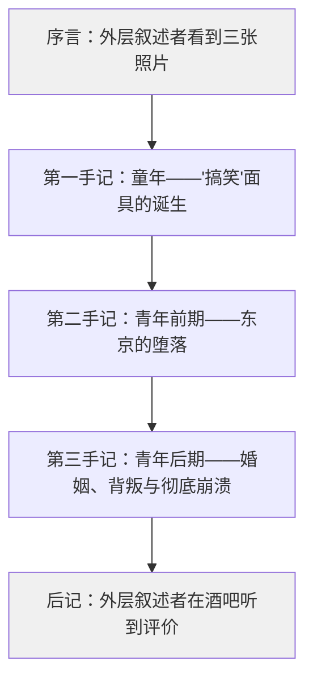
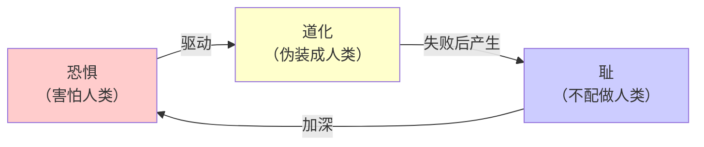
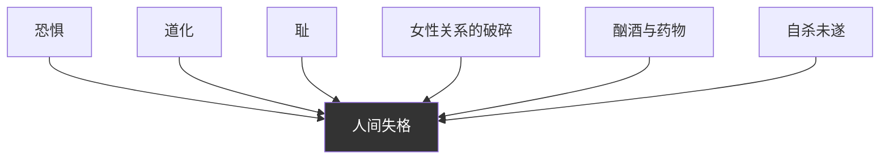
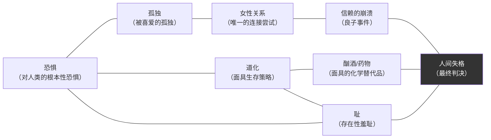

# 《人间失格》深度拆解

## 一、文学坐标定位

> [!abstract] 速览
> 《人间失格》（*No Longer Human*，又译"丧失为人的资格"）是太宰治于1948年发表的中篇小说，也是他的遗作——发表同年，太宰治与情人山崎富荣在玉川上水投水自尽。小说以三札手记的形式，讲述了主人公大庭叶藏从童年到青年的精神崩解历程：一个极度敏感的少年，因无法理解人类社会的运作规则，选择以"搞笑"作为伪装面具与世界周旋，最终在酗酒、药物成瘾、自杀未遂的连环坠落中彻底丧失了"作为人活着"的资格。

《人间失格》与太宰治的个人生平高度重叠。太宰治出生于青森县津轻的大地主家庭，自幼敏感内向，一生中曾五次自杀未遂，最终在第六次自杀中死去。小说中的大庭叶藏几乎就是太宰治的文学分身——同样的富裕家庭出身、同样的社会疏离感、同样的女性关系纠葛、同样的药物依赖。但你不能简单地将本书等同于自传：太宰治做了精密的文学加工，将个人痛苦升华为一种==关于「人之为人」的根本性追问==。

在日本文学脉络中，本书属于「私小说」传统——以作者个人体验为素材的第一人称叙事。但太宰治超越了典型私小说的自怜，他的叙述带有一种冰冷的自我解剖式的清醒。在世界文学中，《人间失格》可与陀思妥耶夫斯基的[[《地下室手记》]]、加缪的[[《局外人》]]、卡夫卡的[[《变形记》]]形成对话——它们共同构成了一个关于「被社会放逐的个体」的文学谱系。

太宰治属于日本战后「无赖派」文学流派。无赖派作家以颓废、放浪的姿态对抗战后日本社会的虚伪道德秩序。但太宰治的「无赖」不是波西米亚式的浪漫叛逆，而是一种==源于极度恐惧的自我毁灭==——他不是在反抗社会，他是在被社会的「人类性」本身碾碎。

---

## 二、叙事结构解析

> [!note] 三重嵌套的叙事框架
> 小说由「序言」「三札手记」「后记」构成，形成一个精密的叙事装置：外层叙述者（"我"）在酒吧偶然看到三张照片和三本手记，由此引出大庭叶藏的自述。

这一结构设计至少有四重功能：

1. **客观化的距离**：太宰治没有让叶藏直接对读者讲述，而是插入了一个「发现手记」的外层叙述者。这个装置制造了一种==考古学式的冷静==——你不是在听一个人倾诉，你是在阅读一份被发现的精神档案。这种距离保护了叙事不沦为单纯的自怜。

2. **照片的锚定**：序言中对三张照片的描述（幼年的诡异笑容、青年的美丽却空洞的面容、近乎老人般的疲惫面容）预先建立了叶藏的视觉形象，使读者在阅读手记时始终带着这三张面孔的印象。照片的静态与手记的动态形成张力。

3. **不可靠叙述的暗示**：手记是叶藏的自述，必然带有他的感知偏差。序言和后记的外层视角提供了一个微妙的校正——酒吧老板娘在后记中说叶藏「像神一样的好孩子」，这与叶藏自我认知中的「怪物」形成了==惊人的裂缝==。太宰治借此暗示：叶藏对自己的判断可能并不准确。

4. **三札手记的递进逻辑**：三本手记不是简单的时间流水账，而是一条精心设计的==精神坠落曲线==——第一手记（恐惧的发现）、第二手记（伪装的消耗）、第三手记（伪装的崩溃）。每一札都比前一札更深地坠入黑暗。

> [!warning] 关键结构特征
> 本书没有传统意义上的「高潮」和「解决」。它不是「问题—挣扎—解决」的叙事弧线，而是一条==持续下坠的抛物线==。叶藏没有获得救赎、没有自我和解、没有任何希望的暗示。这种拒绝提供出路的叙事姿态，本身就是太宰治最激进的文学选择。

---

## 三、主题与意象网络

### 主题一：「恐惧」——对人类的根本性恐惧

> [!tip] 黄金圈拆解
> - **Why**：太宰治为什么要以「恐惧」作为全书的情感基调？因为他要呈现一种极端的人类处境——一个人可以恐惧的不是某个具体的威胁，而是==「人类」这个物种本身==。这种恐惧不是社恐、不是内向，而是一种存在论层面的异质感。
> - **How**：通过叶藏的童年感知来展现——他无法理解人类为什么要吃饭、为什么要工作、为什么要说那些明显是谎言的客套话。这些对常人来说不成问题的事，对叶藏来说是深不见底的谜团。
> - **What**：叶藏从小就觉得自己与其他人类「不同」，他不理解人类社会的基本运作逻辑，因此生活在持续的恐惧之中。

**文本细读**：第一手记的开篇是日本文学中最著名的段落之一：「我过的是一种充满耻辱的生活。我甚至认为，我不了解人的生活。」这句话的力量在于它的绝对性——不是「我不太理解人」，而是「我完全不了解人的生活」。这不是程度问题，这是==本质问题==。

叶藏描述自己小时候不理解「饥饿」的含义。他看到家人在固定的时间围坐在一起，表情严肃地把食物送进嘴里，他觉得这是一种「仪式」，却不明白它的意义。对于一个正常的孩子来说，饿了就吃是本能，根本不需要理解。但叶藏连人类最基本的生理驱动都无法共情——这意味着他与人类之间的隔阂不是文化的、社会的，而是==生物性的、存在论的==。

**概念网络**：「恐惧」在本书中是一切行为的原动力。叶藏的搞笑是因为恐惧（害怕被发现自己的异质性），他的顺从是因为恐惧（害怕与人冲突），他的自杀是因为恐惧（害怕继续在人类世界中伪装），他的酗酒和药物成瘾是因为恐惧（需要麻醉才能暂时消除恐惧感）。恐惧是叶藏精神世界的万有引力。

**苏格拉底追问**：叶藏的恐惧是真实的精神状态，还是一种自我戏剧化的姿态？这个问题没有简单的答案。从临床角度看，叶藏的症状（持续的社会疏离、情感麻木、对人类行为的困惑）与自闭症谱系或严重的社交焦虑障碍有重叠。但太宰治不是在写病例报告——他是在用文学语言呈现一种极端的主观体验，这种体验的「真实性」不在于它是否符合诊断标准，而在于它是否引发你内心深处的共鸣。事实上，《人间失格》之所以在日本拥有持续的读者群（尤其是青少年），正是因为那种「觉得自己与世界格格不入」的感受是==普遍人类经验的极端放大==。

---

### 主题二：「道化」——面具作为生存策略

> [!tip] 黄金圈拆解
> - **Why**：太宰治为什么要让叶藏选择「搞笑」（道化，即扮演小丑）作为应对世界的方式？因为搞笑是一种最精妙的伪装——它同时满足了两个需求：隐藏真实的自我，以及获得他人的接纳。一个总是让别人笑的人，不会被追问内心。
> - **How**：通过叶藏在不同场景中反复使用「搞笑」来展示这一策略的运作方式——在家庭中扮演天真的孩子、在学校中扮演欢乐的同学、在社交中扮演有趣的青年。
> - **What**：叶藏从童年起就养成了通过搞笑来避免与人类产生真实接触的习惯，这成为他与世界之间的唯一界面。

**文本细读**：叶藏发现「搞笑」这一策略的过程被写得极为精确。他注意到，当他故意做出滑稽的动作时，周围的人会笑——而笑意味着善意，善意意味着安全。于是他开始系统性地将自己打造成一个「小丑」：故意在体操课上做出笨拙的动作、故意写出搞笑的作文、故意在对话中说出引人发笑的话。

但这个策略有一个致命的代价：==你越是成功地扮演了另一个人，你就越是失去了自己==。叶藏的搞笑从来不是快乐的表达，而是恐惧的产物。每一次成功的笑话背后，都是一次对真实自我的压抑。久而久之，叶藏甚至不知道面具下面还有没有一张真实的脸。

太宰治在此揭示了一个深刻的悖论：叶藏的面具太成功了。所有人都认为他是一个快乐、有趣的人，没有人察觉到他的痛苦。他越是成功地隐藏自己，就越是孤独——因为==被喜爱的不是他，是他的面具==。这种被喜爱的孤独，比不被喜爱更加致命。

**概念网络**：「道化」与「恐惧」形成因果链——恐惧催生了面具，面具又加深了恐惧（害怕面具被揭穿）。同时，「道化」与后来出现的「酗酒」「药物」形成功能替代关系——当面具不足以抵御恐惧时，叶藏需要更强力的麻醉手段。

**苏格拉底追问**：叶藏的「道化」与日常生活中的「社交礼仪」有本质区别吗？所有人在社交中都戴着某种面具，叶藏的特殊之处是什么？区别在于：普通人的社交面具是==半透明的==——面具下面的真实面孔隐约可见，而且他们自己知道什么时候戴着面具、什么时候摘下面具。叶藏的面具则是==不透明的==，而且他已经无法区分面具和面孔。他的面具不是一种选择，而是一种==强迫性的生存本能==。

---

### 主题三：「耻」——日本文化中的羞耻与自我否定

> [!tip] 黄金圈拆解
> - **Why**：太宰治为什么要以「耻」作为全书的核心情感？因为日本文化本身就是一种「耻文化」（鲁思·本尼迪克特在《菊与刀》中的经典概括），而太宰治将这种文化中的羞耻感推到了极致——叶藏不是为了某个具体的错误感到羞耻，他是为了==自己的存在本身==感到羞耻。
> - **How**：通过叶藏反复使用「耻辱」「羞耻」等词汇来自我描述，将一种弥散性的、无对象的羞耻感编织进叶藏生活的每一个角落。
> - **What**：从童年到青年，叶藏始终生活在一种深入骨髓的羞耻感中——他为自己不理解人类而羞耻，为自己不得不伪装而羞耻，为自己的软弱而羞耻，最终为自己活着这件事本身而羞耻。

**文本细读**：全书的第一句「我过的是一种充满耻辱的生活」确立了叙事的情感基调。注意，叶藏说的不是「我做过耻辱的事」，而是「我过的是耻辱的生活」——==耻辱不是附着在行为上的，而是附着在存在上的==。这是一种本体论层面的羞耻。

在日本文化语境中，「耻」与「人间」（人类社会）紧密关联。「人间失格」的字面意思是「丧失作为人间的一员的资格」，这意味着叶藏的羞耻指向的是一个根本性的判决：他不配做人。这个判决的施加者不是某个具体的权威（父亲、社会、法律），而是叶藏自己——他给自己判了「不是人」的罪。

**概念网络**：「耻」与「恐惧」和「道化」构成了叶藏精神世界的三角结构——恐惧（害怕人类）驱动了道化（伪装成人类），道化的失败带来了耻（不配做人类）。三者互相强化，形成一个无法逃脱的闭环：

**苏格拉底追问**：叶藏的羞耻是一种病理性的自我否定，还是一种过度诚实的自我认知？换一种方式问：叶藏看到了某种关于人类社会的真相——虚伪、表演、互相欺骗——而「正常人」之所以能正常生活，恰恰是因为他们对这些真相视而不见？如果是这样，那么叶藏的「失格」不是他的缺陷，而是他的==过度清醒的代价==。太宰治似乎两种立场都有暗示，但没有给出明确答案——这正是本书的文学力量所在。

---

### 主题四：「女性」——拯救与深渊的双重面孔

> [!tip] 黄金圈拆解
> - **Why**：太宰治为什么在叶藏的人生中安排了一系列女性角色？因为女性是叶藏与人类世界之间==唯一可能的连接点==。叶藏无法与男性建立真实关系（他只能通过搞笑来社交），但女性——出于母性、同情、或对他脆弱之美的吸引——能够在某些瞬间穿透他的面具。
> - **How**：通过不同的女性角色（常子、良子、静子等）与叶藏的关系，展示了亲密关系作为救赎可能与毁灭力量的双重性。
> - **What**：叶藏与多位女性产生纠葛，每一段关系都短暂地给了他某种「活着的理由」，但最终都以更深的坠落告终。

**文本细读**：叶藏与常子在�的心水（�的心中之水）的殉情未遂是全书最具冲击力的段落之一。两人相约投海，常子死了，叶藏活了下来。这个事件在叶藏的叙述中被处理得极为克制——他没有过多描述痛苦或内疚，而是以一种近乎麻木的语调记录了事实。但正是这种克制暴露了叶藏精神状态的严重程度：他不是「不痛苦」，而是已经==失去了正常表达痛苦的能力==。

良子（妻子）的角色设计尤为精妙。良子被描述为拥有「信赖天才」的女性——她对一切人和事都持有一种近乎天真的信任。叶藏被这种信任所吸引，因为信任意味着他可以不需要伪装。但恰恰是良子的信任导致了灾难：她的无条件信任被一个商人利用，良子遭到侵犯。叶藏目睹了这一切，但==他被摧毁的不是嫉妒或愤怒，而是「信赖」本身被玷污了==。如果连最纯粹的信任都不能保护一个人，那么这个世界就真的没有安全之处了。

**概念网络**：女性在本书中同时扮演了「避难所」和「陷阱」的角色。叶藏在女性身边获得短暂的安宁（避难所），但每一段关系的破碎都将他推向更深的深渊（陷阱）。这种双重性反映了叶藏与人类关系的核心矛盾：他极度渴望连接，又极度恐惧连接。

**苏格拉底追问**：太宰治笔下的女性是否只是叶藏精神旅程的「功能性配角」？这是对本书常见的女性主义批评。确实，书中的女性大多缺乏独立的心理深度——她们主要作为叶藏的情感参照物而存在。但另一方面，考虑到全书是叶藏的第一人称手记，这种视角本身就是叶藏认知局限的体现。一个无法理解人类的人，当然也无法真正理解女性。==女性角色的「扁平」恰恰是叶藏人格缺陷的文学表达==，而不是太宰治的创作缺陷。

---

### 主题五：「人间失格」——丧失为人资格的终极宣判

> [!tip] 黄金圈拆解
> - **Why**：太宰治为什么要以「人间失格」这四个字作为书名和全书的终极判词？因为这不仅是叶藏对自己的判决，也是太宰治对一种极端人类处境的命名——当一个人既无法融入人类社会，又无法彻底脱离人类社会时，他就处在「人间失格」的状态中。
> - **How**：通过叶藏逐步丧失社会身份的过程来展现——从贵族家庭的长子到被勒令退学的学生，从未遂的殉情者到酗酒的废人，从药物成瘾者到精神病院的患者。每一步都是一次社会身份的剥夺。
> - **What**：叶藏最终被送进精神病院，出院后住在乡下的破旧房子里，由一个不漂亮的老女佣照顾。他说：「我今年二十七岁，头发几乎白了一半，大多数人都以为我四十岁以上。」

**文本细读**：第三手记的结尾处，叶藏在精神病院中有一段极为重要的自白。他意识到自己已经彻底「失格」——不是被社会剥夺了资格，而是==他自己无法再承认自己是人类中的一员==。这个「失格」是双向的：社会不接纳他，他也不接纳自己。

「人间失格」这个概念的深度在于它的不可逆性。叶藏的坠落不像余华笔下的福贵——福贵失去一切之后依然可以「活着」。叶藏失去的不是外在的东西（财产、亲人、地位），而是==内在的某种根本性的东西==：与人类世界产生连接的能力。这种丧失是不可修复的。

**概念网络**：「人间失格」是全书所有主题的汇聚点——恐惧（无法理解人类）+ 道化（无法真实地做人）+ 耻（不配做人）= 人间失格（不再是人）。所有的支线最终都流向这个终点。

**苏格拉底追问**：「人间失格」是叶藏的个人悲剧，还是一种每个人都可能触及的极端状态？如果你诚实地审视自己，是否也曾在某些瞬间觉得自己「不配」——不配被爱、不配快乐、不配存在？叶藏的「失格」是这种普遍感受的==极端结晶==。它之所以震撼，不是因为它离你很远，而是因为它离你很近。

---

### 主题六：「罪与罚」——叶藏的反向陀思妥耶夫斯基

> [!tip] 黄金圈拆解
> - **Why**：太宰治为什么让叶藏在书中反复与「罪」的概念周旋？因为叶藏面临一个根本性的困境：他明知自己在「犯罪」（欺骗所有人、利用女性、逃避责任），但他又觉得自己没有能力不犯罪——因为他连「做人」都做不到，怎么可能做一个「好人」？
> - **How**：通过叶藏与堀木（他在东京的朋友）的一场对话来展现——两人玩一个游戏：说出「罪的反义词」。堀木说是「法律」，叶藏认为是「罚」，但他真正想说的是「神」。
> - **What**：叶藏认为罪与罚不是对立的，而是==同一回事==——犯罪本身就是惩罚，惩罚本身就是犯罪。

**文本细读**：叶藏与堀木关于「罪的反义词」的对话是全书最具哲学密度的段落之一。这段对话看似游戏，实则触及了太宰治的核心思考。

如果罪的反义词是「法律」，那意味着罪是一个社会概念——被法律禁止的就是罪。但叶藏的「罪」不在法律的范畴内：他的罪是伪装、是不真实、是对人类的恐惧。没有任何法律能审判这种「罪」。

如果罪的反义词是「罚」，那意味着罪和罚是平行的、可以互相抵消的。你犯了罪，受了罚，两清了。但叶藏的处境是：==他的存在本身就是罪，而他的痛苦就是罚——两者无法分离==。他不是先犯罪后受罚，而是犯罪和受罚同时发生、始终发生。

如果罪的反义词是「神」，那意味着只有超越人类的力量才能真正化解罪——也意味着在人类的层面上，罪是不可化解的。叶藏隐约触及了这个答案，但他没有说出口，因为他连「神」也无法信赖。

**概念网络**：「罪」的主题将本书与陀思妥耶夫斯基的文学世界连接起来。但差异是根本性的：陀氏笔下的拉斯柯尔尼科夫犯了一个具体的罪（杀人），然后通过痛苦走向救赎。叶藏的「罪」没有具体的内容，他的痛苦也不指向任何救赎。==太宰治写了一个没有救赎出口的陀思妥耶夫斯基世界==。

**苏格拉底追问**：叶藏是否在用「我不理解人类」来逃避道德责任？一个声称自己不理解善恶的人，是否可以被免除道德判断？太宰治对此的态度是暧昧的——他既展示了叶藏的痛苦是真实的（不是伪装的借口），又没有完全赦免叶藏的道德责任。这种暧昧性是本书的文学力量之一。

---

## 四、人物分析

### 大庭叶藏

叶藏是日本文学中最复杂的「反英雄」之一。他不是一个「坏人」，也不是一个「好人」——他是一个==在「人」这个范畴之外挣扎的存在==。

叶藏最核心的特质是他的==极端敏感性==。他能察觉到他人话语背后的真实意图、社交礼仪背后的空洞、道德说教背后的虚伪。但这种敏感性不是一种优势，而是一种==致命的诅咒==——因为他看到了太多，却无力处理看到的东西。

叶藏的第二个核心特质是他的==被动性==。他几乎从不主动做任何事——被女人收留、被朋友带着走、被命运推着坠落。他唯一主动的行为是自杀，而自杀也未能成功。这种极端的被动性不是「懒惰」，而是一种==存在论层面的无力感==：一个不理解人类游戏规则的人，怎么可能在游戏中采取主动？

叶藏与[[《局外人》]]中的默尔索形成了有趣的对比。默尔索的疏离是冷漠的、无动于衷的——他不在乎。叶藏的疏离是痛苦的、充满渴望的——==他极度在乎，但他无法在乎==。默尔索是太阳下冷酷的旁观者，叶藏是黑暗中颤抖的溺水者。

### 堀木

堀木是叶藏在东京的「朋友」，也是全书中最具反讽意味的角色。他是一个平庸的画家，却具有叶藏所缺乏的东西——==在人类社会中自如行走的能力==。堀木对叶藏来说既是引路人（带他进入东京的社交世界）又是对照物（提醒叶藏自己永远无法像堀木那样「正常」）。

堀木说出「罪的反义词是法律」时，暴露了他的精神平庸——他只能在社会规范的层面理解道德问题。但正是这种平庸，使他能够在叶藏坠落的世界中安然无恙。太宰治借此暗示：==「正常」可能只是「平庸」的另一个名字==。

### 良子

良子（叶藏的妻子）是全书中最令人心碎的角色。她的「信赖天才」——对一切人和事的无条件信任——既是她的美德，也是她的致命弱点。叶藏被这种信任所吸引，因为==在一个充满欺骗和伪装的世界里，良子是唯一不需要他戴面具的人==。

但良子遭到侵犯的事件摧毁了叶藏对「信赖」的最后希望。叶藏的反应不是保护良子或惩罚加害者，而是对「信赖」这个概念本身的崩溃——如果信任会被利用、纯真会被玷污，那么这个世界的最后一点光也熄灭了。

> [!warning] 关键解读
> 太宰治写良子事件的笔法极为残酷：他不是在写一个女性被侵犯的悲剧，而是在写==「信任」这个人类基本能力被摧毁的悲剧==。叶藏失去的不是妻子的贞操（这是一个过时的视角），而是他与人类世界之间最后一条连接线。

---

## 五、风格与语言

> [!note] 太宰治的叙事风格
> 《人间失格》的语言呈现出一种独特的矛盾：它既是极度自恋的（充斥着自我剖析），又是极度自毁的（每一次自我剖析都是一刀）。这种==自恋性的自我毁灭==是太宰治文体的标志。

太宰治的语言策略可以概括为：**用最轻盈的语调讲最沉重的内容**。

叶藏描述自己最痛苦的经历时，往往使用一种近乎漫不经心的语气——仿佛在说别人的事。这种语气与内容之间的反差制造了一种==令人不安的审美效果==：你不确定叶藏是真的无所谓，还是痛苦到已经说不出痛苦了。

太宰治的另一个语言特征是==频繁的自我否定==。叶藏的叙述中充满了「也许」「大概」「我不确定」这样的限定词，仿佛他连自己的感受都不敢确认。这种自我否定不是谦虚，而是一种深层的==自我不信任==——一个不确定自己是不是人的人，怎么可能确定自己的任何感受是真实的？

全书的语言节奏也值得注意：短句与长句交替出现，快速的叙事推进中突然插入一段停滞的冥想。这种节奏模拟了叶藏的精神状态——在麻木和敏感之间快速切换。

---

## 六、文学批评多视角

**存在主义视角**：叶藏可以被视为一个存在主义式的人物——他面对的核心问题是「存在先于本质」：他先于任何社会角色而存在，但他无法为自己创造一个本质（即一个可以安居的身份）。与萨特笔下的人物不同，叶藏不是在「自由选择」中感到焦虑——他根本没有选择的能力。他的「恶心」（借用萨特的术语）不是对自由的恐惧，而是对==人类存在本身的恐惧==。

**精神分析视角**：从弗洛伊德的角度看，叶藏的「道化」可以被解读为一种极端的防御机制——通过幽默来处理无法直接面对的焦虑。他与父亲的关系（渴望被认可却永远得不到真正的接纳）暗示了一种未解决的俄狄浦斯冲突。他反复依附于女性则可以被读作对母性温暖的持续渴望。但精神分析的解读有一个局限：它倾向于将叶藏的痛苦「病理化」，而太宰治可能要展示的是一种==超越病理学范畴的存在困境==。

**后现代视角**：叶藏的身份困境可以被读作一个后现代式的「主体消解」——他没有一个稳定的「自我」，只有一系列不断变换的面具。在这个意义上，叶藏不是一个「失败的自我」，而是一个==诚实地展示了「自我」本身之虚构性的存在==。如果所有人都在演戏（正如叶藏所观察到的），那么叶藏的特殊之处在于：他知道自己在演戏，而且他为此痛苦。

**日本文化视角**：在日本「和」（和谐）文化的语境中，叶藏的悲剧可以被理解为对过度强调集体和谐的社会结构的批判。日本社会要求个人抑制真实感受以维护群体和谐（「建前」与「本音」的区分），叶藏将这种文化要求推到了极端——他的全部生命都是「建前」（表面），他的「本音」（真心）从未被允许存在。==《人间失格》是对日本社会"建前"文化的最极端的文学控诉==。

---

## 七、跨时空共鸣

《人间失格》之所以在出版七十多年后仍然拥有大量读者（尤其在日本，它是仅次于《人间失格》的持续畅销书——抱歉，它本身就是持续畅销书，在日本文学作品销量中长期名列前茅），在于它触及了一种跨时代、跨文化的普遍人类体验：==觉得自己与世界格格不入==。

在社交媒体时代，叶藏的困境获得了新的共鸣。每个人都在社交平台上维持着精心策划的「人设」——快乐的、成功的、有趣的。这本质上就是一种数字时代的「道化」。而那些在深夜放下手机、面对空荡荡的天花板时感到的空虚和疲惫，与叶藏摘下面具后的感受并无不同。

但需要警惕的是：《人间失格》不应被简单地用作「我很特别所以我很痛苦」的自我安慰。叶藏的痛苦不是一种美学姿态，而是一种==真实的精神灾难==。如果你在阅读中感到共鸣，那值得认真对待——不是对号入座地认同叶藏，而是追问：你的哪些面具是必要的社交工具，哪些已经变成了无法摘下的枷锁？

---

## 八、核心框架提炼

### 概念网络

### 苏格拉底追问链

| 层级 | 追问 | 叶藏的回答 |
|------|------|-------------|
| 第一层 | 你为什么害怕人类？ | 因为我不理解他们的行为逻辑 |
| 第二层 | 不理解为什么会导致恐惧？ | 因为不理解意味着我可能做出「错误」的反应 |
| 第三层 | 做出错误反应的后果是什么？ | 被发现我不是「他们中的一员」 |
| 第四层 | 被发现了又怎样？ | 被排斥、被孤立、被抛弃 |
| 第五层 | 你已经在被排斥了，还怕什么？ | 怕的不是排斥，是==确认==——确认我真的不是人 |
| 第六层 | 你是人吗？ | 我不知道。这就是问题 |

### 黄金圈深层分析

- **Why**（太宰治的终极关切）：在一个要求每个人都「正常」的社会中，那些无法「正常」的人该怎么办？太宰治的回答是残酷的——他们不会「怎么办」，他们只会被碾碎。==《人间失格》不提供解决方案，它提供的是一面镜子==。
- **How**（如何传递）：通过一个极端个体的自我剖白，让你在阅读过程中反复经历「共鸣—抗拒—再共鸣」的循环。你想说「叶藏不是我」，但你无法完全说服自己。
- **What**（最终呈现）：一个从童年到青年的精神崩解全记录，以精密的文学语言刻画了一个人如何从「假装正常」一步步走向「丧失做人的资格」。

---

## 九、费曼终极检验

> [!abstract] 用最简单的话概括
> 如果你要向一个没读过《人间失格》的朋友解释这本书，可以这样说：

有一个叫叶藏的人，他从小就觉得自己不理解人类。不是那种「我有点社恐」的不理解，而是根本性的——他不明白人为什么要吃饭、为什么要假装开心、为什么要说明明是假话的寒暄。他太害怕了，所以从小就学会了一招：搞笑。他让所有人都笑，这样就没人会注意到他其实不是「他们中的一员」。

长大之后，这个面具越来越重。他开始喝酒、吃药，因为只有在醉了或者嗨了的时候他才能短暂地不恐惧。他和很多女人纠缠，因为女人是唯一能让他感到一点点温暖的存在。他试过自杀，没成功。他结了婚，妻子是一个天真到无条件信任所有人的女孩——结果妻子被人侵犯了，他连妻子都保护不了。

最后他被送进了精神病院。出来之后，二十七岁的他看起来像四十多岁。他说了全书最后的判词：==「我已经丧失了作为人活着的资格。」==

这本书不是在说「活着好难」——《活着》已经说过了。这本书说的是一件更可怕的事：==有些人可能从一开始就不具备「活在人类社会中」的能力==。不是他们不努力，不是他们不想，而是他们和人类之间有一道无法跨越的沟壑。叶藏一辈子都在试图跨过这道沟，最后他承认：他跨不过去。

这本书最厉害的地方在于：你读的时候会觉得叶藏在说你。不是全部的你，而是你内心某个角落里那个也觉得自己在「假装正常」的部分。太宰治抓住了这个部分，把它放大到了极致，然后逼你直视它。

---

## 延伸阅读路线图

> [!note] 推荐阅读路径

- [[《斜阳》]] — 太宰治另一部重要作品，从女性视角讲述贵族家庭的衰落，与《人间失格》形成互补
- [[《地下室手记》]] — 陀思妥耶夫斯基的经典，「地下人」与叶藏的社会疏离感高度共鸣
- [[《局外人》]] — 加缪的存在主义名作，默尔索的冷漠与叶藏的痛苦形成对照
- [[《变形记》]] — 卡夫卡笔下格里高尔的异化经验，与叶藏的「人间失格」形成跨文化对话
- [[《挪威的森林》]] — 村上春树的名作，对日本青年精神困境的另一种呈现
- [[《活着》]] — 余华的杰作，福贵的「活着」与叶藏的「失格」形成最鲜明的对比——同样是面对苦难，一个选择承受，一个被碾碎
- [[《菊与刀》]] — 鲁思·本尼迪克特对日本文化中「耻文化」的分析，为理解叶藏的羞耻感提供文化背景
